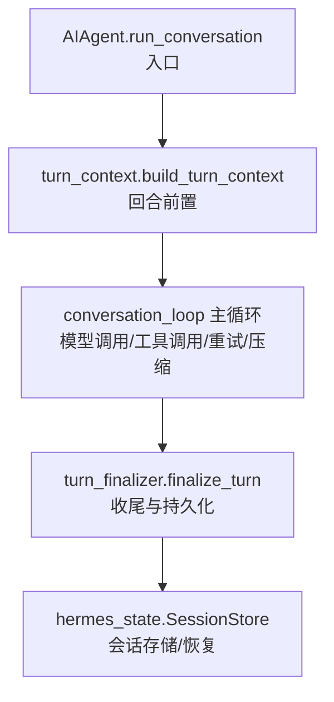
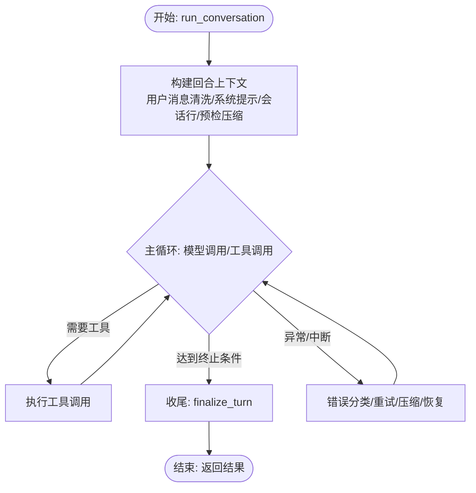
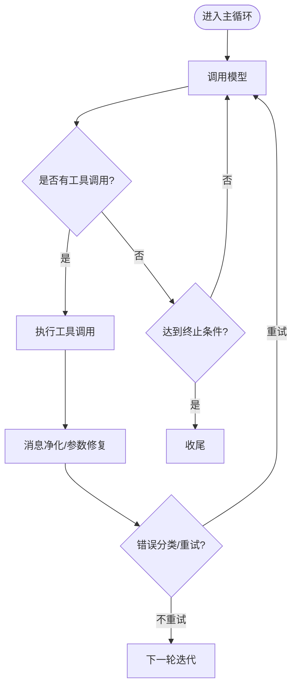
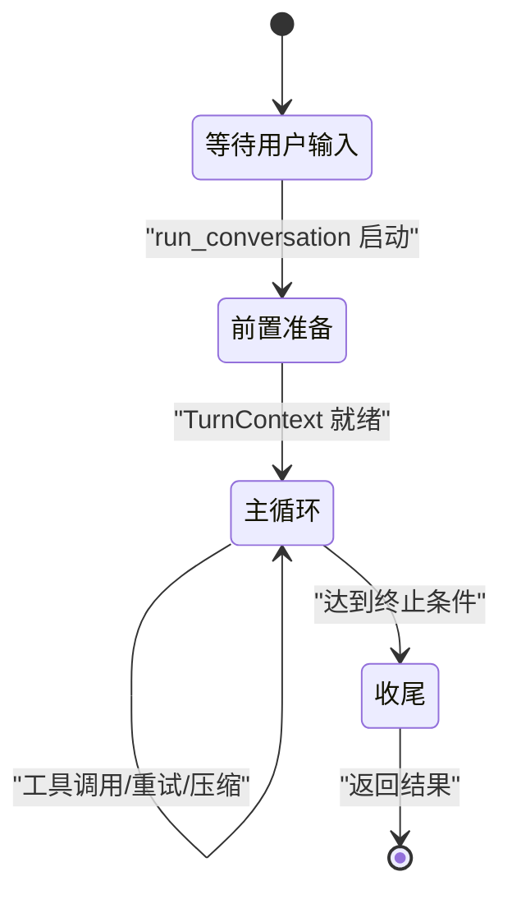
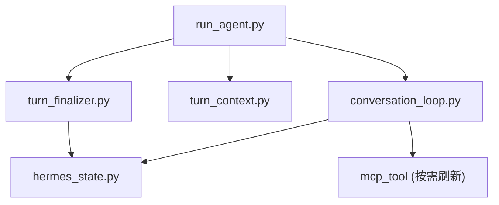

# 对话管理

<cite>
**本文引用的文件**
- [run_agent.py](file://run_agent.py)
- [conversation_loop.py](file://agent/conversation_loop.py)
- [turn_context.py](file://agent/turn_context.py)
- [turn_finalizer.py](file://agent/turn_finalizer.py)
- [hermes_state.py](file://hermes_state.py)
</cite>

## 目录
1. [简介](#简介)
2. [项目结构](#项目结构)
3. [核心组件](#核心组件)
4. [架构总览](#架构总览)
5. [详细组件分析](#详细组件分析)
6. [依赖关系分析](#依赖关系分析)
7. [性能考量](#性能考量)
8. [故障排查指南](#故障排查指南)
9. [结论](#结论)
10. [附录](#附录)

## 简介
本技术文档聚焦 Hermes Agent 的对话管理系统，围绕 AIAgent 的对话循环机制展开，重点解释 run_conversation 的实现原理、消息处理流程与状态管理机制；并系统说明会话生命周期（创建、初始化到结束）、对话上下文维护、消息历史管理、会话恢复机制；同时覆盖多轮对话的处理逻辑，包括工具调用循环、错误处理、超时控制。文末提供对话状态转换图与使用示例，帮助正确管理会话状态与处理异常情况。

## 项目结构
Hermes 的对话管理由多个模块协作完成：
- run_agent.py：定义 AIAgent 类及其 run_conversation 入口，负责编排整个对话回合。
- agent/conversation_loop.py：从 run_agent 中抽离出的“对话循环”主体，包含模型调用、工具调用循环、重试、压缩、后处理钩子等。
- agent/turn_context.py：每回合前置准备（TurnContext），负责用户消息清洗、系统提示恢复/构建、预检压缩、MCP 刷新、会话行创建等。
- agent/turn_finalizer.py：回合收尾阶段，负责轨迹保存、资源清理、会话持久化、结果组装、插件钩子触发等。
- hermes_state.py：SQLite 会话存储，负责会话元数据、完整消息历史、模型配置的持久化与检索，支持压缩导致的会话拆分与恢复。



**图表来源**
- [run_agent.py:1-200](file://run_agent.py#L1-L200)
- [conversation_loop.py:1-120](file://agent/conversation_loop.py#L1-L120)
- [turn_context.py:314-363](file://agent/turn_context.py#L314-L363)
- [turn_finalizer.py:69-90](file://agent/turn_finalizer.py#L69-L90)
- [hermes_state.py:1-16](file://hermes_state.py#L1-L16)

**章节来源**
- [run_agent.py:1-200](file://run_agent.py#L1-L200)
- [conversation_loop.py:1-120](file://agent/conversation_loop.py#L1-L120)
- [turn_context.py:314-363](file://agent/turn_context.py#L314-L363)
- [turn_finalizer.py:69-90](file://agent/turn_finalizer.py#L69-L90)
- [hermes_state.py:1-16](file://hermes_state.py#L1-L16)

## 核心组件
- AIAgent 与 run_conversation：作为对话回合的编排者，协调前置准备、主循环与收尾工作。
- TurnContext：封装每回合前置准备产出的上下文对象，供主循环消费。
- conversation_loop：实现模型调用、工具调用循环、错误分类与重试、上下文压缩、中断与恢复等。
- turn_finalizer：统一收尾，确保轨迹保存、资源清理、会话持久化、结果组装与插件钩子执行。
- hermes_state：提供 SQLite 持久化能力，支撑会话恢复、压缩拆分、全文检索等。

**章节来源**
- [run_agent.py:1-200](file://run_agent.py#L1-L200)
- [conversation_loop.py:1-120](file://agent/conversation_loop.py#L1-L120)
- [turn_context.py:314-363](file://agent/turn_context.py#L314-L363)
- [turn_finalizer.py:69-90](file://agent/turn_finalizer.py#L69-L90)
- [hermes_state.py:1-16](file://hermes_state.py#L1-L16)

## 架构总览
下图展示了单条用户消息进入后的端到端流程：从 AIAgent 启动 run_conversation，经 turn_context 构建回合上下文，进入 conversation_loop 的主循环（含模型调用、工具调用、重试与压缩），最终由 turn_finalizer 完成收尾与持久化，并通过 hermes_state 进行会话存储与恢复。

```mermaid
sequenceDiagram
participant Client as "调用方"
participant Agent as "AIAgent"
participant TC as "TurnContext"
participant Loop as "conversation_loop"
participant TF as "turn_finalizer"
participant State as "hermes_state"
Client->>Agent : 调用 run_conversation(用户消息, 系统提示, 历史)
Agent->>TC : build_turn_context(...)
TC-->>Agent : 返回 TurnContext
Agent->>Loop : 进入主循环(消息列表, 系统提示, 工具集)
Loop->>Loop : 模型调用/工具调用/重试/压缩
Loop-->>Agent : 产出 final_response/messages
Agent->>TF : finalize_turn(...)
TF->>State : _persist_session(messages, conversation_history)
TF-->>Agent : 返回 result
Agent-->>Client : 返回 result
```

**图表来源**
- [run_agent.py:1-200](file://run_agent.py#L1-L200)
- [conversation_loop.py:1-120](file://agent/conversation_loop.py#L1-L120)
- [turn_context.py:314-363](file://agent/turn_context.py#L314-L363)
- [turn_finalizer.py:69-90](file://agent/turn_finalizer.py#L69-L90)
- [hermes_state.py:1-16](file://hermes_state.py#L1-L16)

## 详细组件分析

### AIAgent 与 run_conversation 的对话循环机制
- 角色定位：run_conversation 是单条用户消息的完整处理单元，负责编排 turn_context 构建、主循环执行与 turn_finalizer 收尾。
- 关键职责：
  - 调用 turn_context 构建回合上下文，完成用户消息清洗、系统提示恢复/构建、会话行创建、预检压缩等。
  - 驱动 conversation_loop 主循环，处理模型调用、工具调用、错误分类与重试、上下文压缩、中断与恢复。
  - 将主循环结果交给 turn_finalizer 进行收尾，包括轨迹保存、资源清理、会话持久化、结果组装与插件钩子。
- 状态管理：通过 agent 实例属性维护当前任务 ID、回合 ID、迭代预算、工具守卫、流式回调等；在 turn_context 中重置每回合计数器，在 turn_finalizer 中清理与汇总统计。



**图表来源**
- [conversation_loop.py:1-120](file://agent/conversation_loop.py#L1-L120)
- [turn_context.py:314-363](file://agent/turn_context.py#L314-L363)
- [turn_finalizer.py:69-90](file://agent/turn_finalizer.py#L69-L90)

**章节来源**
- [run_agent.py:1-200](file://run_agent.py#L1-L200)
- [conversation_loop.py:1-120](file://agent/conversation_loop.py#L1-L120)
- [turn_context.py:314-363](file://agent/turn_context.py#L314-L363)
- [turn_finalizer.py:69-90](file://agent/turn_finalizer.py#L69-L90)

### 消息处理流程与会话生命周期
- 会话创建与初始化：
  - turn_context 在系统提示恢复/构建之后创建数据库会话行，确保后续压缩与旋转能正确引用父会话。
  - 设置日志上下文、技能写入来源、辅助客户端运行时信息、MCP 工具刷新、用户消息清洗与追加、待办与提醒计数器等。
- 消息历史管理：
  - 每回合维护 messages 列表，追加当前用户消息，并在压缩后重新锚定当前用户消息索引。
  - 支持 api_content sidecar 注入外部记忆与插件上下文，保证 API 侧内容稳定可回放。
- 会话恢复机制：
  - 支持从压缩旋转中恢复会话历史；hermes_state 提供会话恢复、导出限制与 FTS5 搜索能力。
  - 当会话过大时，提供安全恢复限制以避免内存压力。

```mermaid
sequenceDiagram
participant TC as "turn_context"
participant State as "hermes_state"
participant Loop as "conversation_loop"
TC->>TC : 恢复压缩旋转会话历史
TC->>TC : 设置日志/技能来源/辅助客户端/MCP刷新
TC->>TC : 清洗用户消息并追加到 messages
TC->>State : 创建/确保会话行system_prompt 已就绪
Loop->>Loop : 预检压缩与空闲压缩
Loop-->>TC : 压缩后重锚定当前用户消息索引
```

**图表来源**
- [turn_context.py:343-800](file://agent/turn_context.py#L343-L800)
- [hermes_state.py:1-200](file://hermes_state.py#L1-L200)

**章节来源**
- [turn_context.py:343-800](file://agent/turn_context.py#L343-L800)
- [hermes_state.py:1-200](file://hermes_state.py#L1-L200)

### 多轮对话处理逻辑：工具调用循环、错误处理、超时控制
- 工具调用循环：
  - 主循环根据模型响应决定是否需要工具调用；若需要则执行工具并继续循环，直到满足终止条件或达到最大迭代次数。
  - 支持工具守卫、参数修复、非 ASCII 与代理字符清洗、图像剥离等消息净化。
- 错误处理：
  - 使用 error_classifier 对 API 错误进行分类，区分本地处理错误与可重试的网络/配额错误。
  - 针对 Copilot 凭证过期、Ollama 上下文不足、图片尺寸超限等场景提供专门处理路径。
  - 支持部分流式响应恢复、截断续写、参考转交跳过等恢复策略。
- 超时控制：
  - 通过 provider 请求超时与陈旧超时配置控制网络交互；对工具输出过大导致流超时的情况给出系统提示，引导拆分工具调用。
  - 在 turn_context 中记录每回合是否收到 provider 响应，用于中断回滚显示计数等。



**图表来源**
- [conversation_loop.py:1-120](file://agent/conversation_loop.py#L1-L120)
- [turn_context.py:343-800](file://agent/turn_context.py#L343-L800)

**章节来源**
- [conversation_loop.py:1-120](file://agent/conversation_loop.py#L1-L120)
- [turn_context.py:343-800](file://agent/turn_context.py#L343-L800)

### 对话状态转换图
以下状态图展示单条用户消息在 run_conversation 中的主要状态流转：
- 初始：等待用户输入
- 前置准备：构建回合上下文
- 主循环：模型调用/工具调用/重试/压缩
- 收尾：轨迹保存/资源清理/会话持久化
- 结束：返回结果



**图表来源**
- [conversation_loop.py:1-120](file://agent/conversation_loop.py#L1-L120)
- [turn_context.py:314-363](file://agent/turn_context.py#L314-L363)
- [turn_finalizer.py:69-90](file://agent/turn_finalizer.py#L69-L90)

**章节来源**
- [conversation_loop.py:1-120](file://agent/conversation_loop.py#L1-L120)
- [turn_context.py:314-363](file://agent/turn_context.py#L314-L363)
- [turn_finalizer.py:69-90](file://agent/turn_finalizer.py#L69-L90)

### 使用示例与最佳实践
- 基本用法：
  - 创建 AIAgent 实例，传入 base_url、model 等参数。
  - 调用 run_conversation 传入用户消息、系统提示与可选的历史消息。
  - 获取返回的 result，包含 final_response、messages、统计信息等。
- 会话恢复：
  - 使用 hermes_state 提供的会话恢复接口加载历史，避免重复构建上下文。
  - 注意会话大小限制，必要时导出或压缩历史。
- 工具调用与错误处理：
  - 合理配置工具集与守卫规则，避免无效调用。
  - 关注错误分类结果，区分本地错误与可重试错误，采取相应策略。
- 超时与中断：
  - 配置 provider 超时与陈旧超时，防止长时间阻塞。
  - 支持中断恢复，确保流式响应与工具调用的完整性。

**章节来源**
- [run_agent.py:1-200](file://run_agent.py#L1-L200)
- [hermes_state.py:1-200](file://hermes_state.py#L1-L200)

## 依赖关系分析
- 模块耦合：
  - run_agent 依赖 conversation_loop、turn_context、turn_finalizer 完成回合编排。
  - conversation_loop 依赖 turn_context 提供的回合上下文，以及 hermes_state 进行会话持久化。
  - turn_finalizer 依赖 hermes_state 进行会话持久化，并触发插件钩子。
- 外部依赖：
  - 模型提供商（OpenAI、Anthropic、Ollama 等）通过 transport 层调用。
  - MCP 工具与服务发现通过 tools.mcp_tool 刷新。
- 潜在循环依赖：
  - 通过延迟导入与函数间接访问（如 _ra()）避免导入循环。



**图表来源**
- [run_agent.py:1-200](file://run_agent.py#L1-L200)
- [conversation_loop.py:1-120](file://agent/conversation_loop.py#L1-L120)
- [turn_context.py:314-363](file://agent/turn_context.py#L314-L363)
- [turn_finalizer.py:69-90](file://agent/turn_finalizer.py#L69-L90)
- [hermes_state.py:1-16](file://hermes_state.py#L1-L16)

**章节来源**
- [run_agent.py:1-200](file://run_agent.py#L1-L200)
- [conversation_loop.py:1-120](file://agent/conversation_loop.py#L1-L120)
- [turn_context.py:314-363](file://agent/turn_context.py#L314-L363)
- [turn_finalizer.py:69-90](file://agent/turn_finalizer.py#L69-L90)
- [hermes_state.py:1-16](file://hermes_state.py#L1-L16)

## 性能考量
- 上下文压缩：
  - 预检压缩与空闲压缩减少请求大小，避免上下文溢出。
  - 微压缩在回合结束后吸收最旧交换，分摊压缩成本。
- 系统提示缓存：
  - 通过 session DB 持久化系统提示，复用前缀缓存，提升 Anthropic 等提供商的缓存命中。
- MCP 工具刷新：
  - 仅在必要时刷新，避免每次回合都拉取重型依赖。
- 连接健康检查：
  - 每回合前清理死连接，提升稳定性。

[本节为通用指导，无需特定文件来源]

## 故障排查指南
- 常见问题：
  - 会话持久化失败：检查 hermes_state 的数据库健康与锁竞争。
  - 工具调用失败：查看工具守卫与参数修复日志，确认工具定义与权限。
  - 模型调用超时：调整 provider 超时配置，检查网络连接与配额。
  - 上下文溢出：启用或调整压缩策略，关注预检与空闲压缩日志。
- 诊断信息：
  - 关注 turn_finalizer 的诊断日志，了解回合结束原因、工具调用次数、响应长度等。
  - 使用 hermes_state 的会话恢复与导出功能，检查历史完整性。

**章节来源**
- [turn_finalizer.py:423-466](file://agent/turn_finalizer.py#L423-L466)
- [hermes_state.py:1-200](file://hermes_state.py#L1-L200)

## 结论
Hermes Agent 的对话管理系统通过 AIAgent.run_conversation 编排 turn_context、conversation_loop 与 turn_finalizer，实现了完整的单条用户消息处理流程。系统支持上下文压缩、系统提示缓存、MCP 工具刷新、连接健康检查等优化手段，并通过 hermes_state 提供强大的会话持久化与恢复能力。通过合理的错误处理、超时控制与状态管理，系统能够在复杂的多轮对话场景中保持稳定与高效。

[本节为总结性内容，无需特定文件来源]

## 附录
- 术语表：
  - 回合（Turn）：一次用户消息的完整处理过程。
  - 上下文压缩：对历史消息进行摘要或归档，以减少请求大小。
  - 系统提示缓存：持久化系统提示以提升缓存命中率。
  - MCP 工具：模型上下文协议工具，动态发现与刷新。
- 参考链接：
  - 相关模块源码路径见本文“本文引用的文件”。

[本节为补充信息，无需特定文件来源]