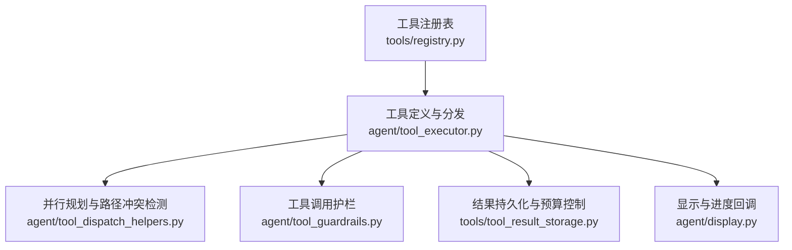
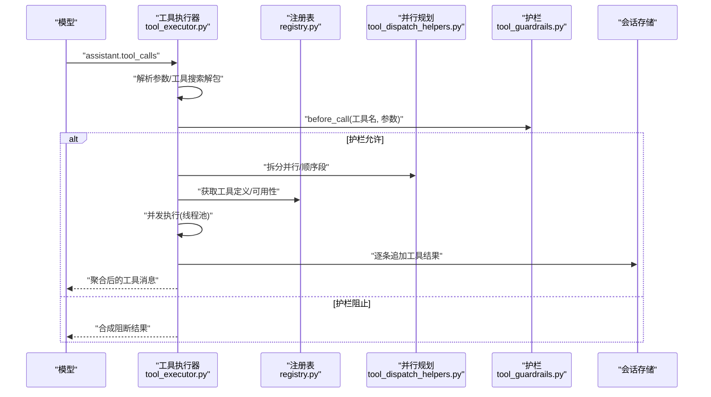
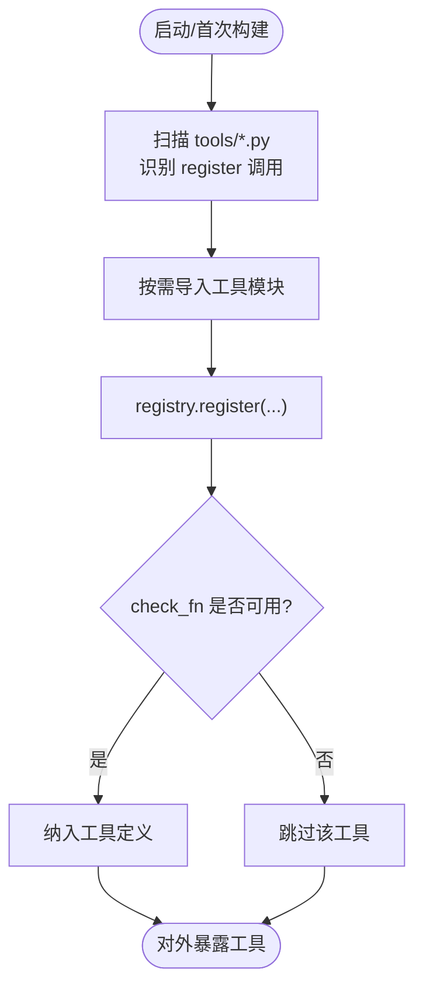
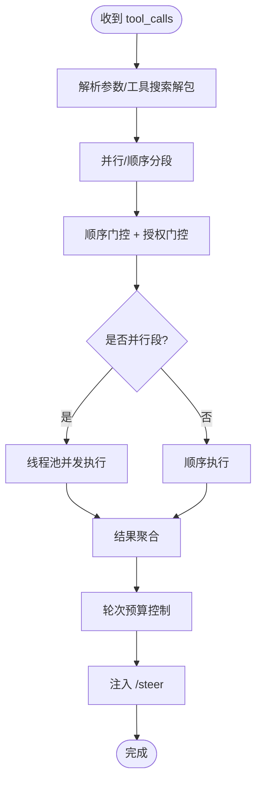
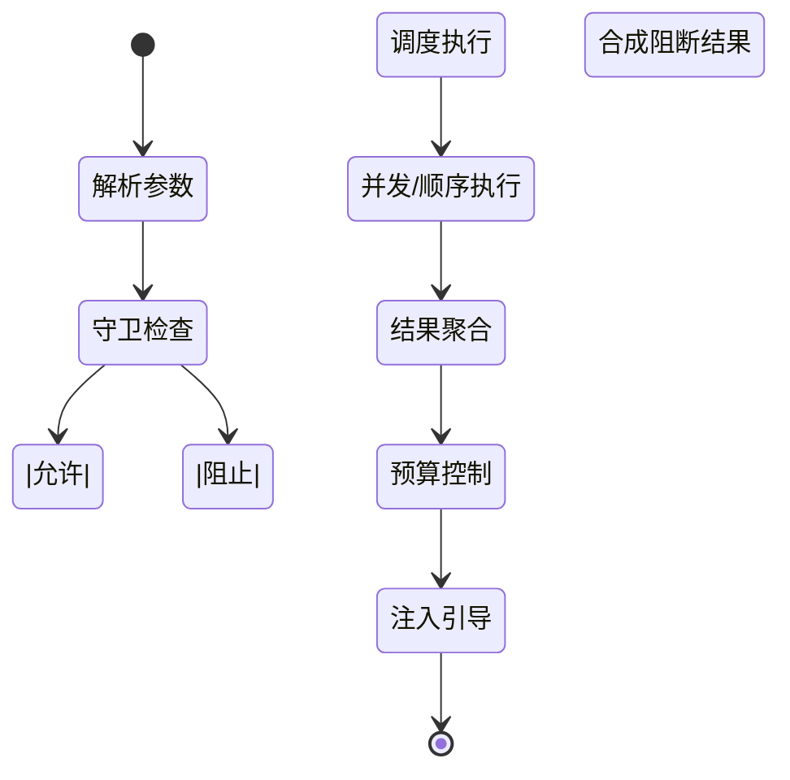
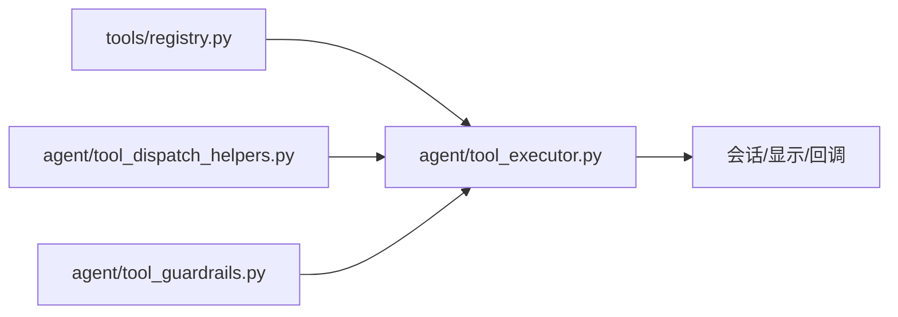

# 工具执行引擎

<cite>
**本文引用的文件**
- [agent/tool_executor.py](file://agent/tool_executor.py)
- [agent/tool_dispatch_helpers.py](file://agent/tool_dispatch_helpers.py)
- [agent/tool_guardrails.py](file://agent/tool_guardrails.py)
- [tools/registry.py](file://tools/registry.py)
</cite>

## 目录
1. [简介](#简介)
2. [项目结构](#项目结构)
3. [核心组件](#核心组件)
4. [架构总览](#架构总览)
5. [详细组件分析](#详细组件分析)
6. [依赖关系分析](#依赖关系分析)
7. [性能考量](#性能考量)
8. [故障排查指南](#故障排查指南)
9. [结论](#结论)
10. [附录](#附录)

## 简介
本文件面向 Hermes Agent 的“工具执行引擎”，系统化说明工具发现与注册、动态加载、依赖检查；工具调度算法（参数校验、并发执行、结果聚合）；执行环境安全机制（权限控制、资源隔离、输入验证）；以及从工具选择、参数解析、执行监控到结果处理的完整生命周期。同时提供自定义工具开发指南、错误处理模式、性能优化建议，以及监控与调试方法。

## 项目结构
围绕工具执行引擎的关键代码分布在以下模块：
- 工具注册与发现：tools/registry.py
- 工具调度与并发执行：agent/tool_executor.py
- 并行规划与安全策略：agent/tool_dispatch_helpers.py
- 循环保护与护栏：agent/tool_guardrails.py

**图示来源**
- [tools/registry.py:414-764](file://tools/registry.py#L414-L764)
- [agent/tool_executor.py:758-1580](file://agent/tool_executor.py#L758-L1580)
- [agent/tool_dispatch_helpers.py:116-234](file://agent/tool_dispatch_helpers.py#L116-L234)
- [agent/tool_guardrails.py:273-440](file://agent/tool_guardrails.py#L273-L440)

**章节来源**
- [tools/registry.py:108-159](file://tools/registry.py#L108-L159)
- [agent/tool_executor.py:758-1580](file://agent/tool_executor.py#L758-L1580)
- [agent/tool_dispatch_helpers.py:116-234](file://agent/tool_dispatch_helpers.py#L116-L234)
- [agent/tool_guardrails.py:273-440](file://agent/tool_guardrails.py#L273-L440)

## 核心组件
- 工具注册表（ToolRegistry）
  - 负责工具元数据收集、schema 生成、check_fn 可用性探测与缓存、插件覆盖策略、MCP 动态刷新支持。
- 工具执行器（tool_executor）
  - 负责工具调用批次的解析、顺序门控、并发调度、超时与中断、结果聚合、会话持久化与提示注入。
- 并行规划器（tool_dispatch_helpers）
  - 将批次拆分为“并行段”和“顺序段”，基于工具类型、路径范围、破坏性命令等规则保证正确性与性能。
- 工具护栏（tool_guardrails）
  - 防止重复失败、无进展、跑飞循环（如 web_search、子代理），提供警告或硬停止决策。

**章节来源**
- [tools/registry.py:414-764](file://tools/registry.py#L414-L764)
- [agent/tool_executor.py:758-1580](file://agent/tool_executor.py#L758-L1580)
- [agent/tool_dispatch_helpers.py:116-234](file://agent/tool_dispatch_helpers.py#L116-L234)
- [agent/tool_guardrails.py:273-440](file://agent/tool_guardrails.py#L273-L440)

## 架构总览
工具执行引擎的整体流程如下：
- 模型输出 tool_calls → 解析参数 → 工具搜索解包与范围校验 → 中间件链（请求改写、执行前钩子、守卫）→ 顺序门控与授权门控 → 并发执行（线程池）→ 结果聚合与预算控制 → 写入会话并注入 /steer。

**图示来源**
- [agent/tool_executor.py:807-873](file://agent/tool_executor.py#L807-L873)
- [agent/tool_executor.py:1154-1346](file://agent/tool_executor.py#L1154-L1346)
- [agent/tool_dispatch_helpers.py:116-234](file://agent/tool_dispatch_helpers.py#L116-L234)
- [agent/tool_guardrails.py:295-348](file://agent/tool_guardrails.py#L295-L348)
- [tools/registry.py:717-764](file://tools/registry.py#L717-L764)

## 详细组件分析

### 工具发现与注册
- 自动发现内置工具模块：通过 AST 扫描 tools/*.py 中顶层 registry.register 调用，避免全量导入开销，并使用磁盘缓存加速。
- 注册入口：每个工具在模块级调用 registry.register(name, toolset, schema, handler, check_fn, ...) 声明元数据与处理器。
- 可用性检查：check_fn 用于探测外部依赖（Docker、Playwright 等），带 TTL 与“最近成功容错”窗口，避免瞬时抖动导致工具不可用。
- 插件覆盖策略：插件默认不允许覆盖内置工具，需显式 opt-in；deregister 同样受所有权与策略限制。
- 动态 schema：支持 dynamic_schema_overrides，在 get_definitions 时合并运行时配置（如委托任务限制）。

**图示来源**
- [tools/registry.py:108-159](file://tools/registry.py#L108-L159)
- [tools/registry.py:201-230](file://tools/registry.py#L201-L230)
- [tools/registry.py:312-379](file://tools/registry.py#L312-L379)
- [tools/registry.py:562-644](file://tools/registry.py#L562-L644)
- [tools/registry.py:717-764](file://tools/registry.py#L717-L764)

**章节来源**
- [tools/registry.py:108-159](file://tools/registry.py#L108-L159)
- [tools/registry.py:201-230](file://tools/registry.py#L201-L230)
- [tools/registry.py:312-379](file://tools/registry.py#L312-L379)
- [tools/registry.py:562-644](file://tools/registry.py#L562-L644)
- [tools/registry.py:717-764](file://tools/registry.py#L717-L764)

### 工具调度算法（参数验证、并发执行、结果聚合）
- 参数解析：严格 JSON 对象解析，非法参数直接返回结构化错误，不执行工具。
- 工具搜索解包：若使用 tool_search 桥接，会解包为真实工具并校验当前会话作用域，防止越权调用。
- 并行规划：
  - 将批次切分为“并行段”和“顺序段”，保持原始顺序不变。
  - 对路径相关工具（read_file/search_files/write_file/patch）进行路径重叠检测，写者与其他读写冲突则分段。
  - 交互式工具（如 clarify）强制顺序执行。
  - 对 MCP 工具可查询其是否支持并行。
- 并发执行：
  - 使用 DaemonThreadPoolExecutor 提交任务，最大工作线程数根据批次内容调整（图片生成有独立上限）。
  - 顺序门控：按提交顺序等待，避免审批/授权阻塞导致后续任务饥饿。
  - 授权门控：序列化人类审批，排除人类等待时间计入批次截止时间。
  - 超时与中断：批次级超时、用户中断、解释器关闭均能安全释放等待中的工作者。
- 结果聚合：
  - 按原始顺序追加 tool 消息到会话。
  - 多模态结果包装为 OpenAI 兼容 content 列表。
  - 高风险工具输出包裹“不受信任”标记，防止间接提示注入。
  - 每轮结束后统一执行预算控制与 /steer 注入。

**图示来源**
- [agent/tool_executor.py:807-873](file://agent/tool_executor.py#L807-L873)
- [agent/tool_executor.py:1154-1346](file://agent/tool_executor.py#L1154-L1346)
- [agent/tool_dispatch_helpers.py:116-234](file://agent/tool_dispatch_helpers.py#L116-L234)

**章节来源**
- [agent/tool_executor.py:807-873](file://agent/tool_executor.py#L807-L873)
- [agent/tool_executor.py:1154-1346](file://agent/tool_executor.py#L1154-L1346)
- [agent/tool_dispatch_helpers.py:116-234](file://agent/tool_dispatch_helpers.py#L116-L234)

### 工具执行环境的安全机制
- 权限控制与作用域
  - 工具搜索解包后校验目标工具在当前会话的工具集中可用，避免受限会话越权。
  - 插件覆盖与注销受策略约束，防止未授权替换内置实现。
- 资源隔离
  - 并发执行使用线程池，且支持 daemon 模式，避免挂起线程阻塞进程退出。
  - 顺序门控与授权门控确保审批/授权不会无限期阻塞其他任务。
- 输入验证
  - 参数必须为合法 JSON 对象；非法参数直接拒绝执行。
  - 终端命令破坏性启发式检测，必要时创建检查点以支持回滚。
  - 高风险工具输出被标记为“不受信任”，降低间接提示注入风险。
- 运行期防护
  - 工具护栏检测重复失败、无进展、跑飞循环（web_search、子代理），提供警告或硬停止。
  - 结果大小与错误体长度限制，防止上下文膨胀。

**章节来源**
- [agent/tool_executor.py:807-873](file://agent/tool_executor.py#L807-L873)
- [agent/tool_executor.py:1154-1346](file://agent/tool_executor.py#L1154-L1346)
- [agent/tool_dispatch_helpers.py:92-100](file://agent/tool_dispatch_helpers.py#L92-L100)
- [agent/tool_guardrails.py:273-440](file://agent/tool_guardrails.py#L273-L440)
- [tools/registry.py:562-644](file://tools/registry.py#L562-L644)

### 工具执行生命周期管理
- 选择与准备
  - 解析 tool_calls，工具搜索解包与作用域校验。
  - 中间件链：请求改写、执行前钩子、守卫判断。
- 执行与监控
  - 顺序门控与授权门控协调执行时机。
  - 并发执行期间周期性心跳，避免网关误判空闲。
  - 记录活动、进度回调、开始/完成事件。
- 结果处理
  - 多模态适配、风险标注、预算控制、/steer 注入。
  - 增量持久化工具结果，确保破坏性操作后会话可恢复。

**图示来源**
- [agent/tool_executor.py:807-873](file://agent/tool_executor.py#L807-L873)
- [agent/tool_executor.py:1154-1346](file://agent/tool_executor.py#L1154-L1346)
- [agent/tool_guardrails.py:295-348](file://agent/tool_guardrails.py#L295-L348)

**章节来源**
- [agent/tool_executor.py:807-873](file://agent/tool_executor.py#L807-L873)
- [agent/tool_executor.py:1154-1346](file://agent/tool_executor.py#L1154-L1346)
- [agent/tool_guardrails.py:295-348](file://agent/tool_guardrails.py#L295-L348)

### 自定义工具开发指南
- 接口规范
  - 在模块级调用 registry.register(name, toolset, schema, handler, check_fn, requires_env, is_async, description, emoji, max_result_size_chars, dynamic_schema_overrides)。
  - schema 应包含 name、description、parameters 等字段；handler 返回字符串或多模态信封。
- 错误处理模式
  - 返回结构化错误 JSON 时会被裁剪 error 字段长度，避免上下文爆炸。
  - 异常将被捕获并转为错误消息，日志保留更详细信息。
- 性能优化建议
  - 使用 check_fn 探测外部依赖，利用 TTL 与容错窗口减少抖动影响。
  - 合理设置 max_result_size_chars，避免大结果拖慢上下文。
  - 对于 I/O 密集型工具，考虑异步或后台执行，并在环境中设置活动回调以保持心跳。
- 安全与合规
  - 避免跨工具集覆盖内置工具，除非明确 opt-in。
  - 对涉及文件系统或网络的工具，遵循路径冲突与“不受信任”输出标记。

**章节来源**
- [tools/registry.py:201-230](file://tools/registry.py#L201-L230)
- [tools/registry.py:562-644](file://tools/registry.py#L562-L644)
- [tools/registry.py:717-764](file://tools/registry.py#L717-L764)

### 监控与调试方法
- 进度与回调
  - tool_progress_callback 与 tool_complete_callback 提供开始/完成事件，便于 UI 与审计。
  - _emit_terminal_post_tool_call 输出工具调用的元数据（耗时、状态、错误类型）。
- 日志与可视化
  - 非静默模式下打印工具名称、参数预览、耗时与结果摘要。
  - 多模态结果文本摘要用于日志与预览。
- 诊断要点
  - 关注“顺序门控超时”“授权门控锁超时”“批次超时”“解释器关闭”等日志。
  - 检查护栏告警（重复失败、无进展、跑飞循环）以定位问题根因。

**章节来源**
- [agent/tool_executor.py:259-330](file://agent/tool_executor.py#L259-L330)
- [agent/tool_executor.py:665-756](file://agent/tool_executor.py#L665-L756)
- [agent/tool_executor.py:1354-1580](file://agent/tool_executor.py#L1354-L1580)

## 依赖关系分析
- 低耦合设计
  - 注册表与执行器通过函数名与 schema 解耦；执行器依赖并行规划与护栏做策略决策。
- 关键依赖链
  - tool_executor → tool_dispatch_helpers（并行规划）、tool_guardrails（护栏）、registry（工具定义与可用性）。
- 潜在循环与规避
  - 通过延迟导入与纯函数助手避免循环依赖；check_fn 缓存避免频繁外部探测。

**图示来源**
- [agent/tool_executor.py:758-1580](file://agent/tool_executor.py#L758-L1580)
- [agent/tool_dispatch_helpers.py:116-234](file://agent/tool_dispatch_helpers.py#L116-L234)
- [agent/tool_guardrails.py:273-440](file://agent/tool_guardrails.py#L273-L440)
- [tools/registry.py:414-764](file://tools/registry.py#L414-L764)

**章节来源**
- [agent/tool_executor.py:758-1580](file://agent/tool_executor.py#L758-L1580)
- [agent/tool_dispatch_helpers.py:116-234](file://agent/tool_dispatch_helpers.py#L116-L234)
- [agent/tool_guardrails.py:273-440](file://agent/tool_guardrails.py#L273-L440)
- [tools/registry.py:414-764](file://tools/registry.py#L414-L764)

## 性能考量
- 并发度控制
  - 最大工作线程数默认有限制；图片生成有独立并发上限，避免后端限流。
- 超时与中止
  - 批次级超时与顺序门控超时配合，避免长尾任务阻塞整体。
  - 用户中断与解释器关闭能快速释放等待中的工作者。
- 缓存与探测
  - check_fn 结果缓存与“最近成功容错”减少外部探测成本。
  - 工具发现缓存降低启动与重建开销。
- 结果大小控制
  - 错误体与结果大小限制，防止上下文膨胀。

[本节为通用指导，无需具体文件引用]

## 故障排查指南
- 常见问题
  - 工具参数非法：检查 JSON 结构与键名。
  - 工具不可用：查看 check_fn 探测失败日志与缓存 TTL。
  - 并发死锁/饥饿：关注顺序门控与授权门控超时日志。
  - 跑飞循环：依据护栏告警调整策略或参数。
- 定位步骤
  - 启用详细日志，观察工具开始/完成事件与耗时。
  - 检查会话消息中工具结果的 risk 标记与错误信息。
  - 核对工具搜索作用域与工具集配置。

**章节来源**
- [agent/tool_executor.py:259-330](file://agent/tool_executor.py#L259-L330)
- [agent/tool_executor.py:1354-1580](file://agent/tool_executor.py#L1354-L1580)
- [agent/tool_guardrails.py:273-440](file://agent/tool_guardrails.py#L273-L440)
- [tools/registry.py:312-379](file://tools/registry.py#L312-L379)

## 结论
Hermes Agent 的工具执行引擎通过“注册表 + 执行器 + 并行规划 + 护栏”的分层架构，实现了安全的工具发现、严格的参数校验、可控的并发执行与稳健的结果聚合。其顺序门控与授权门控保障了审批与交互的正确性，护栏机制有效抑制了常见陷阱（重复失败、无进展、跑飞循环）。结合结果大小控制、错误体裁剪与“不受信任”输出标记，系统在性能与安全性之间取得平衡。开发者可遵循接口规范与最佳实践快速扩展工具能力。

[本节为总结，无需具体文件引用]

## 附录
- 术语
  - 工具搜索解包：将桥接调用转换为实际工具调用并校验作用域。
  - 顺序门控：按提交顺序串行化工具启动，避免审批/授权阻塞。
  - 授权门控：序列化人类审批，排除人类等待时间计入批次截止。
  - 多模态信封：工具返回的多媒体内容封装格式。
- 参考路径
  - 工具注册与发现：[tools/registry.py:108-159](file://tools/registry.py#L108-L159)
  - 并发执行与聚合：[agent/tool_executor.py:1154-1346](file://agent/tool_executor.py#L1154-L1346)
  - 并行规划：[agent/tool_dispatch_helpers.py:116-234](file://agent/tool_dispatch_helpers.py#L116-L234)
  - 护栏策略：[agent/tool_guardrails.py:273-440](file://agent/tool_guardrails.py#L273-L440)

[本节为补充说明，无需具体文件引用]