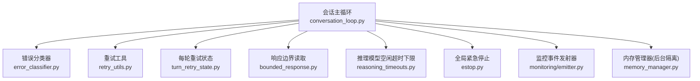
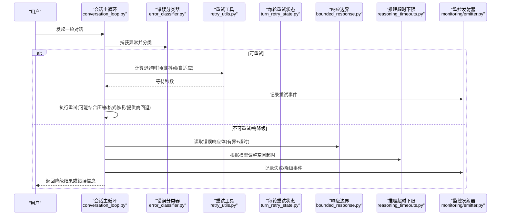
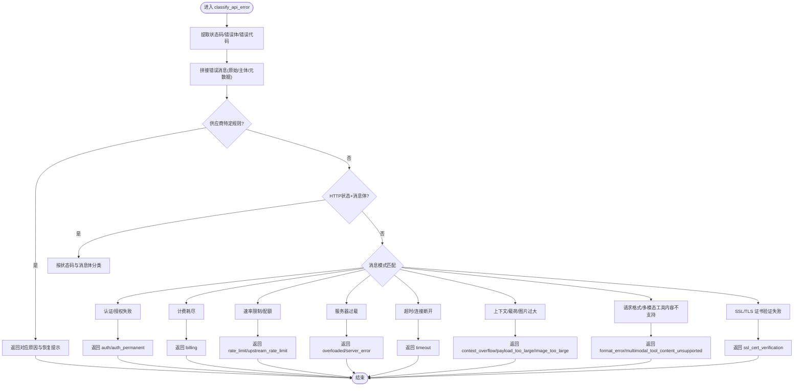
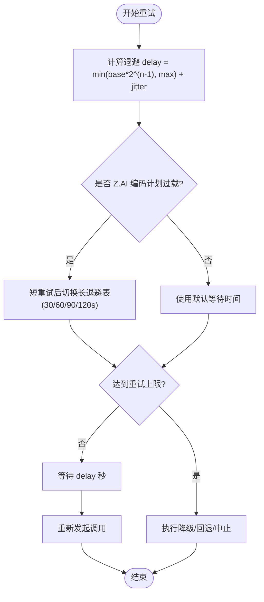
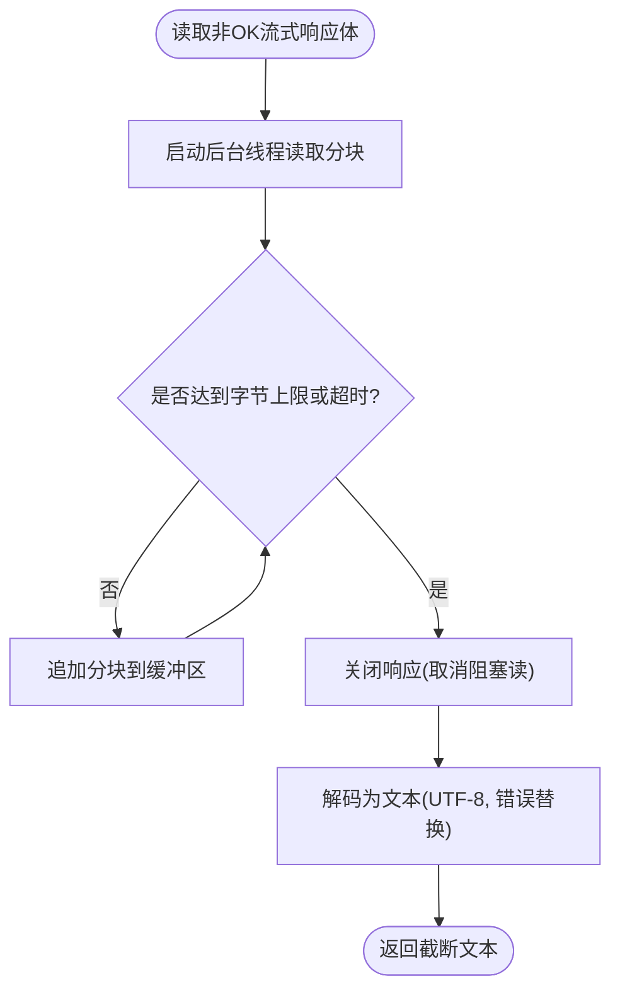
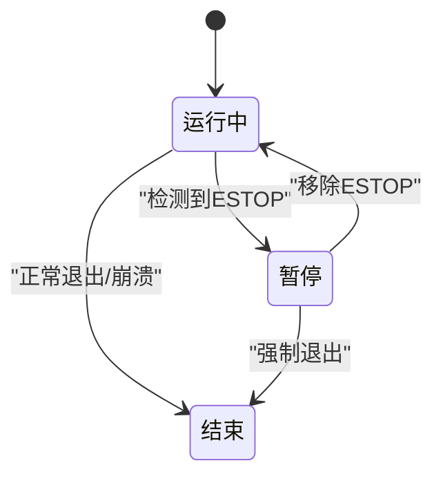
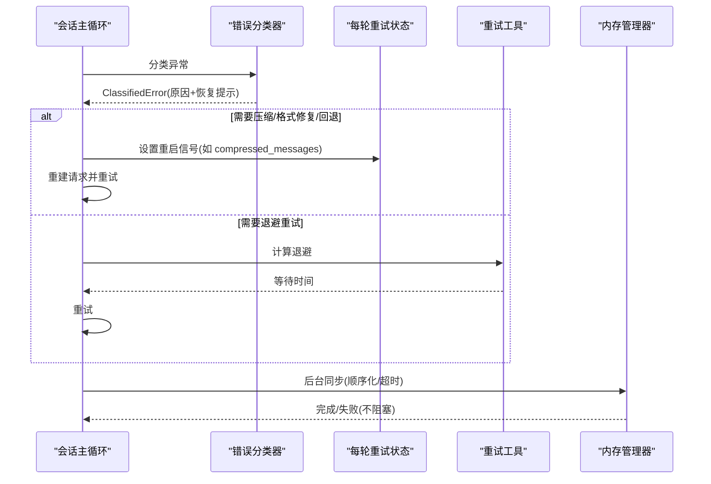
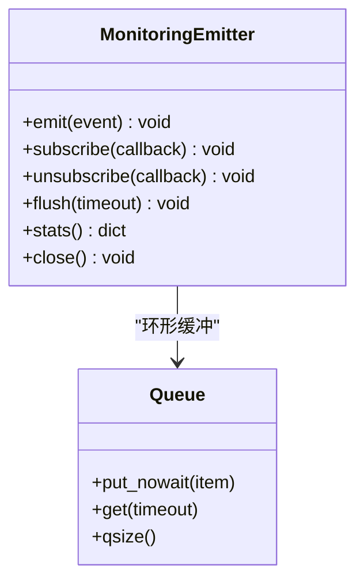
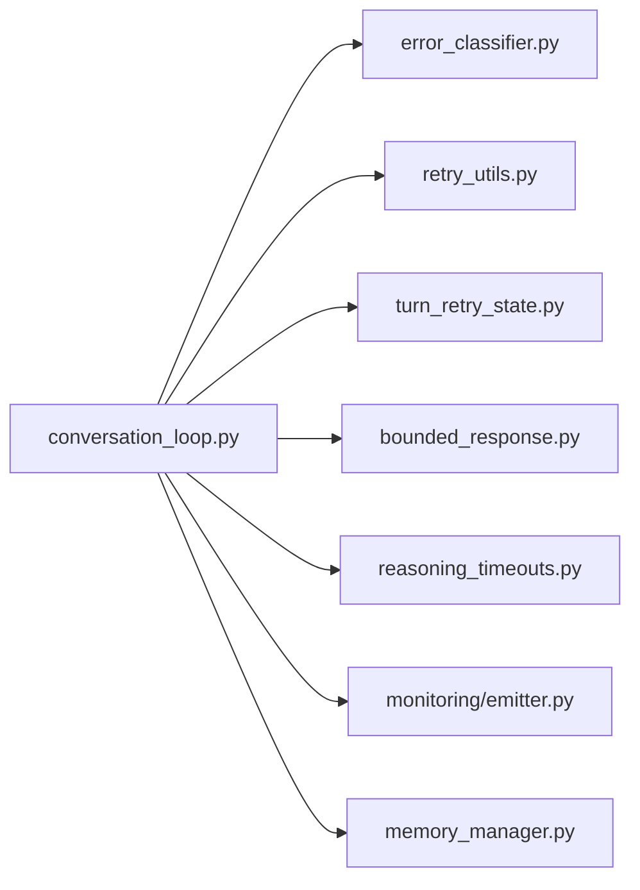

# 错误处理和恢复

<cite>
**本文引用的文件**
- [agent/error_classifier.py](file://agent/error_classifier.py)
- [agent/retry_utils.py](file://agent/retry_utils.py)
- [agent/turn_retry_state.py](file://agent/turn_retry_state.py)
- [agent/bounded_response.py](file://agent/bounded_response.py)
- [agent/estop.py](file://agent/estop.py)
- [agent/conversation_loop.py](file://agent/conversation_loop.py)
- [agent/reasoning_timeouts.py](file://agent/reasoning_timeouts.py)
- [agent/memory_manager.py](file://agent/memory_manager.py)
- [agent/monitoring/emitter.py](file://agent/monitoring/emitter.py)
</cite>

## 目录
1. [简介](#简介)
2. [项目结构](#项目结构)
3. [核心组件](#核心组件)
4. [架构总览](#架构总览)
5. [详细组件分析](#详细组件分析)
6. [依赖关系分析](#依赖关系分析)
7. [性能考量](#性能考量)
8. [故障排查指南](#故障排查指南)
9. [结论](#结论)
10. [附录](#附录)

## 简介
本技术文档聚焦 Hermes Agent 的错误处理与恢复机制，覆盖以下关键主题：
- 错误分类系统：错误类型识别、严重性评估、处理策略选择（重试、降级、回退、压缩等）
- 重试机制：指数退避、抖动、次数限制、失败降级策略
- 响应边界控制：超时管理、内存限制、资源保护
- 中断处理：优雅停止、状态保存、资源释放
- 故障恢复：会话恢复、数据一致性保证、服务自愈能力
- 监控与诊断：可观测性事件发射、指标导出、问题定位

## 项目结构
围绕错误处理与恢复的关键模块分布如下：
- 错误分类与策略：error_classifier.py
- 重试与退避：retry_utils.py、turn_retry_state.py
- 响应边界与资源保护：bounded_response.py、reasoning_timeouts.py
- 会话主循环与恢复编排：conversation_loop.py
- 全局紧急停止：estop.py
- 后台任务与隔离：memory_manager.py
- 监控与诊断：monitoring/emitter.py

**图表来源**
- [agent/conversation_loop.py:1-120](file://agent/conversation_loop.py#L1-L120)
- [agent/error_classifier.py:1-120](file://agent/error_classifier.py#L1-L120)
- [agent/retry_utils.py:1-120](file://agent/retry_utils.py#L1-L120)
- [agent/turn_retry_state.py:1-93](file://agent/turn_retry_state.py#L1-L93)
- [agent/bounded_response.py:1-120](file://agent/bounded_response.py#L1-L120)
- [agent/reasoning_timeouts.py:1-120](file://agent/reasoning_timeouts.py#L1-L120)
- [agent/estop.py:1-120](file://agent/estop.py#L1-L120)
- [agent/memory_manager.py:1-120](file://agent/memory_manager.py#L1-L120)
- [agent/monitoring/emitter.py:1-120](file://agent/monitoring/emitter.py#L1-L120)

**章节来源**
- [agent/conversation_loop.py:1-120](file://agent/conversation_loop.py#L1-L120)
- [agent/error_classifier.py:1-120](file://agent/error_classifier.py#L1-L120)
- [agent/retry_utils.py:1-120](file://agent/retry_utils.py#L1-L120)
- [agent/turn_retry_state.py:1-93](file://agent/turn_retry_state.py#L1-L93)
- [agent/bounded_response.py:1-120](file://agent/bounded_response.py#L1-L120)
- [agent/reasoning_timeouts.py:1-120](file://agent/reasoning_timeouts.py#L1-L120)
- [agent/estop.py:1-120](file://agent/estop.py#L1-L120)
- [agent/memory_manager.py:1-120](file://agent/memory_manager.py#L1-L120)
- [agent/monitoring/emitter.py:1-120](file://agent/monitoring/emitter.py#L1-L120)

## 核心组件
- 错误分类器：将异常结构化为“原因 + 恢复提示”，驱动重试、凭证轮换、提供商回退、上下文压缩等策略。
- 重试工具：提供带抖动的指数退避、特定供应商的自适应退避、以及针对过载场景的重试上限计算。
- 每轮重试状态：集中记录一次 API 调用尝试中的“一次性”恢复分支是否已触发，避免重复或死循环。
- 响应边界：对非成功流式响应的 body 进行有界读取与硬超时，防止内存膨胀与无限阻塞。
- 推理模型空闲超时：为已知推理模型设置空闲检测的下限，避免上游代理在长思考阶段误杀连接。
- 全局紧急停止：通过哨兵文件实现“暂停新工作”的全局开关，不影响进行中任务。
- 会话主循环：编排错误分类、重试、压缩、格式修复、提供商回退等恢复路径。
- 监控发射器：热路径零阻塞的事件队列与后台分发，用于指标/追踪/日志上报。

**章节来源**
- [agent/error_classifier.py:1-120](file://agent/error_classifier.py#L1-L120)
- [agent/retry_utils.py:1-120](file://agent/retry_utils.py#L1-L120)
- [agent/turn_retry_state.py:1-93](file://agent/turn_retry_state.py#L1-L93)
- [agent/bounded_response.py:1-120](file://agent/bounded_response.py#L1-L120)
- [agent/reasoning_timeouts.py:1-120](file://agent/reasoning_timeouts.py#L1-L120)
- [agent/estop.py:1-120](file://agent/estop.py#L1-L120)
- [agent/conversation_loop.py:1-120](file://agent/conversation_loop.py#L1-L120)
- [agent/monitoring/emitter.py:1-120](file://agent/monitoring/emitter.py#L1-L120)

## 架构总览
下图展示一次用户请求在会话主循环中的错误处理与恢复流程，包括分类、重试、压缩、回退与监控。

**图表来源**
- [agent/conversation_loop.py:1-120](file://agent/conversation_loop.py#L1-L120)
- [agent/error_classifier.py:620-720](file://agent/error_classifier.py#L620-L720)
- [agent/retry_utils.py:90-129](file://agent/retry_utils.py#L90-L129)
- [agent/bounded_response.py:56-125](file://agent/bounded_response.py#L56-L125)
- [agent/reasoning_timeouts.py:177-232](file://agent/reasoning_timeouts.py#L177-L232)
- [agent/monitoring/emitter.py:53-117](file://agent/monitoring/emitter.py#L53-L117)

## 详细组件分析

### 错误分类系统
- 分类目标：将任意异常映射到明确的 FailoverReason，附带 status_code、provider、model、message 及 recovery hints（是否可重试、是否需要压缩、是否需要轮换凭证、是否需要回退）。
- 优先级规则：
  - 先匹配供应商特定模式（如内容安全拦截、思考块签名、长上下文层级门控等）
  - 再按 HTTP 状态码与消息体细化（计费耗尽 vs 速率限制 vs 服务器过载）
  - 然后基于消息文本模式匹配（上下文溢出、载荷过大、图片过大、认证失败、SSL 证书验证失败等）
  - 最后回退为未知但可重试
- 输出：ClassifiedError，供上层重试循环直接消费，无需再次解析。

**图表来源**
- [agent/error_classifier.py:620-800](file://agent/error_classifier.py#L620-L800)

**章节来源**
- [agent/error_classifier.py:22-120](file://agent/error_classifier.py#L22-L120)
- [agent/error_classifier.py:620-800](file://agent/error_classifier.py#L620-L800)

### 重试机制（指数退避、次数限制、失败降级）
- 指数退避与抖动：jittered_backoff 使用 base_delay * 2^(attempt-1)，并以随机抖动分散并发重试风暴；支持最大延迟上限。
- 自适应退避：adaptive_rate_limit_backoff 针对特定供应商过载（如 Z.AI Coding Plan GLM-5.2）在短重试后切换到更长的退避表，提升用户体验与稳定性。
- 重试上限：zai_coding_overload_retry_ceiling 确保长退避表的所有档位都能被执行，避免过早放弃。
- 每轮重试状态：TurnRetryState 以“一次性”标志位记录各恢复分支是否已触发，避免重复尝试与死循环。

**图表来源**
- [agent/retry_utils.py:90-129](file://agent/retry_utils.py#L90-L129)
- [agent/retry_utils.py:162-209](file://agent/retry_utils.py#L162-L209)
- [agent/turn_retry_state.py:32-93](file://agent/turn_retry_state.py#L32-L93)

**章节来源**
- [agent/retry_utils.py:1-209](file://agent/retry_utils.py#L1-L209)
- [agent/turn_retry_state.py:1-93](file://agent/turn_retry_state.py#L1-L93)

### 响应边界控制（超时管理、内存限制、资源保护）
- 流式错误响应体读取：read_streaming_error_body 使用线程+事件的方式，限制最大字节数与硬超时，避免内存膨胀与无限阻塞；即使部分读取也安全返回。
- 推理模型空闲超时下限：get_reasoning_stale_timeout_floor 为已知推理模型设置最小空闲超时，避免上游代理在长思考阶段误杀连接。
- 资源保护：bounded read 与超时共同保障在异常情况下不会拖垮进程。

**图表来源**
- [agent/bounded_response.py:56-125](file://agent/bounded_response.py#L56-L125)
- [agent/reasoning_timeouts.py:177-232](file://agent/reasoning_timeouts.py#L177-L232)

**章节来源**
- [agent/bounded_response.py:1-149](file://agent/bounded_response.py#L1-L149)
- [agent/reasoning_timeouts.py:1-232](file://agent/reasoning_timeouts.py#L1-L232)

### 中断处理（优雅停止、状态保存、资源释放）
- 全局紧急停止：ESTOP 哨兵文件存在时，调度与新任务被阻止；进行中任务不受影响；提供 engage/disengage/get_state/check_paused 等接口。
- 资源释放：内存管理器后台任务在关闭时具备超时与丢弃计数，避免阻塞进程退出。
- 会话主循环：在检测到 ESTOP 或中断信号时，应尽快完成当前步骤并返回友好提示，不强行终止。

**图表来源**
- [agent/estop.py:59-123](file://agent/estop.py#L59-L123)
- [agent/memory_manager.py:698-757](file://agent/memory_manager.py#L698-L757)

**章节来源**
- [agent/estop.py:1-175](file://agent/estop.py#L1-L175)
- [agent/memory_manager.py:698-757](file://agent/memory_manager.py#L698-L757)

### 故障恢复策略（会话恢复、数据一致性、服务自愈）
- 会话恢复：conversation_loop 在错误分类后，依据 ClassifiedError 的恢复提示执行不同分支（压缩、长度续传、重建消息、提供商回退等），并通过 TurnRetryState 保证每个分支仅触发一次。
- 数据一致性：内存管理器将同步写入放入单工作线程串行化，确保顺序一致；后台任务失败不阻塞主流程。
- 服务自愈：错误分类器将“确定性拒绝”（如内容安全拦截、格式错误）标记为非重试，快速回退；对网络/传输错误采用退避重试；对过载/限流采用自适应退避。

**图表来源**
- [agent/conversation_loop.py:1-120](file://agent/conversation_loop.py#L1-L120)
- [agent/error_classifier.py:620-800](file://agent/error_classifier.py#L620-L800)
- [agent/turn_retry_state.py:32-93](file://agent/turn_retry_state.py#L32-L93)
- [agent/retry_utils.py:90-129](file://agent/retry_utils.py#L90-L129)
- [agent/memory_manager.py:638-695](file://agent/memory_manager.py#L638-L695)

**章节来源**
- [agent/conversation_loop.py:1-120](file://agent/conversation_loop.py#L1-L120)
- [agent/turn_retry_state.py:1-93](file://agent/turn_retry_state.py#L1-L93)
- [agent/memory_manager.py:638-695](file://agent/memory_manager.py#L638-L695)

### 错误监控与诊断工具
- 监控发射器：MonitoringEmitter 提供 O(微秒级) emit()，内部使用环形队列与后台分发线程，批量投递给订阅者（如 OTLP 导出器）；队列满时丢弃最旧事件，保证热路径不阻塞。
- 统计与关闭：stats() 提供队列深度、分发数、丢弃数、订阅者数量；close() 停止分发线程；flush() 等待队列清空。
- 使用建议：在错误分类、重试、降级、回退等关键路径 emit 事件，便于追踪与告警。

**图表来源**
- [agent/monitoring/emitter.py:36-117](file://agent/monitoring/emitter.py#L36-L117)
- [agent/monitoring/emitter.py:132-164](file://agent/monitoring/emitter.py#L132-L164)

**章节来源**
- [agent/monitoring/emitter.py:1-212](file://agent/monitoring/emitter.py#L1-L212)

## 依赖关系分析
- conversation_loop 依赖 error_classifier、retry_utils、turn_retry_state、bounded_response、reasoning_timeouts、monitoring/emitter、memory_manager。
- error_classifier 提供统一的恢复提示，减少上层分支复杂度。
- retry_utils 提供通用与供应商特定的退避策略。
- bounded_response 与 reasoning_timeouts 共同保障资源与连接健康。
- memory_manager 将后台任务与主流程解耦，避免阻塞。
- monitoring/emitter 作为横切关注点，贯穿错误与恢复路径。

**图表来源**
- [agent/conversation_loop.py:1-120](file://agent/conversation_loop.py#L1-L120)
- [agent/error_classifier.py:1-120](file://agent/error_classifier.py#L1-L120)
- [agent/retry_utils.py:1-120](file://agent/retry_utils.py#L1-L120)
- [agent/turn_retry_state.py:1-93](file://agent/turn_retry_state.py#L1-L93)
- [agent/bounded_response.py:1-120](file://agent/bounded_response.py#L1-L120)
- [agent/reasoning_timeouts.py:1-120](file://agent/reasoning_timeouts.py#L1-L120)
- [agent/monitoring/emitter.py:1-120](file://agent/monitoring/emitter.py#L1-L120)
- [agent/memory_manager.py:1-120](file://agent/memory_manager.py#L1-L120)

**章节来源**
- [agent/conversation_loop.py:1-120](file://agent/conversation_loop.py#L1-L120)
- [agent/error_classifier.py:1-120](file://agent/error_classifier.py#L1-L120)
- [agent/retry_utils.py:1-120](file://agent/retry_utils.py#L1-L120)
- [agent/turn_retry_state.py:1-93](file://agent/turn_retry_state.py#L1-L93)
- [agent/bounded_response.py:1-120](file://agent/bounded_response.py#L1-L120)
- [agent/reasoning_timeouts.py:1-120](file://agent/reasoning_timeouts.py#L1-L120)
- [agent/monitoring/emitter.py:1-120](file://agent/monitoring/emitter.py#L1-L120)
- [agent/memory_manager.py:1-120](file://agent/memory_manager.py#L1-L120)

## 性能考量
- 重试抖动：避免并发重试风暴，降低供应商侧压力。
- 自适应退避：针对特定供应商过载场景优化等待策略，提升交互体验。
- 有界读取：限制错误响应体大小与读取超时，防止内存与CPU浪费。
- 后台任务隔离：内存管理器使用单工作线程串行化写入，避免阻塞主流程。
- 监控零阻塞：emit() 永不阻塞，队列满时丢弃最旧事件，保证热路径性能。

[本节为通用指导，不直接分析具体文件]

## 故障排查指南
- 常见错误与处理：
  - 认证失败：检查凭证有效性，必要时轮换或刷新；若永久失败则中止。
  - 计费耗尽：立即轮换凭证或提示充值；不再重试。
  - 速率限制/配额：退避重试；对供应商过载使用自适应退避。
  - 服务器过载：退避重试，不轮换凭证。
  - 上下文/载荷/图片过大：压缩或缩小后再重试。
  - 请求格式错误：修正请求形状后重试；若确定性问题则快速失败。
  - SSL 证书验证失败：快速失败并提供修复指引，避免无意义重试。
- 监控与诊断：
  - 使用 MonitoringEmitter 在关键路径 emit 事件，观察重试、降级、回退情况。
  - 通过 stats() 检查队列深度、丢弃数、订阅者数量，评估监控链路健康。
  - 结合 conversation_loop 日志与错误分类结果，定位根因。

**章节来源**
- [agent/error_classifier.py:620-800](file://agent/error_classifier.py#L620-L800)
- [agent/retry_utils.py:90-209](file://agent/retry_utils.py#L90-L209)
- [agent/monitoring/emitter.py:53-164](file://agent/monitoring/emitter.py#L53-L164)

## 结论
Hermes Agent 的错误处理与恢复机制通过“分类—重试—边界控制—中断—恢复—监控”的闭环设计，实现了高可用与强韧性：
- 分类器将复杂异常转化为明确策略，减少上层分支复杂度
- 重试工具提供弹性退避与供应商适配，平衡用户体验与系统稳定
- 响应边界与空闲超时保护资源，避免异常放大
- 中断与恢复确保会话一致性与自愈能力
- 监控发射器提供可观测性，支撑问题定位与持续优化

[本节为总结，不直接分析具体文件]

## 附录
- 术语说明：
  - 指数退避：等待时间随重试次数指数增长
  - 抖动：在退避基础上加入随机扰动，避免同步重试
  - 提供商回退：当某提供商不可用时切换到其他提供商或模型
  - 上下文压缩：减少消息长度以适应模型上下文窗口限制
- 最佳实践：
  - 在错误分类后立即决定重试/降级/中止，避免无效重试
  - 使用 TurnRetryState 确保每个恢复分支只触发一次
  - 对供应商过载使用自适应退避，提升交互体验
  - 始终对错误响应体进行有界读取与超时保护
  - 在关键路径 emit 监控事件，便于追踪与告警

[本节为补充说明，不直接分析具体文件]