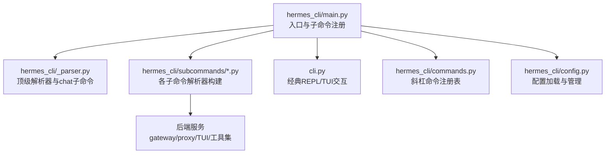
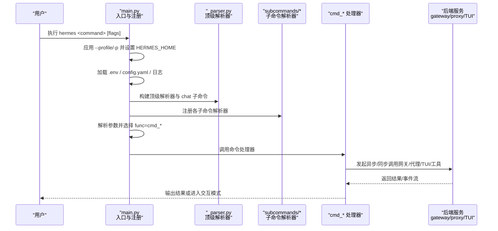
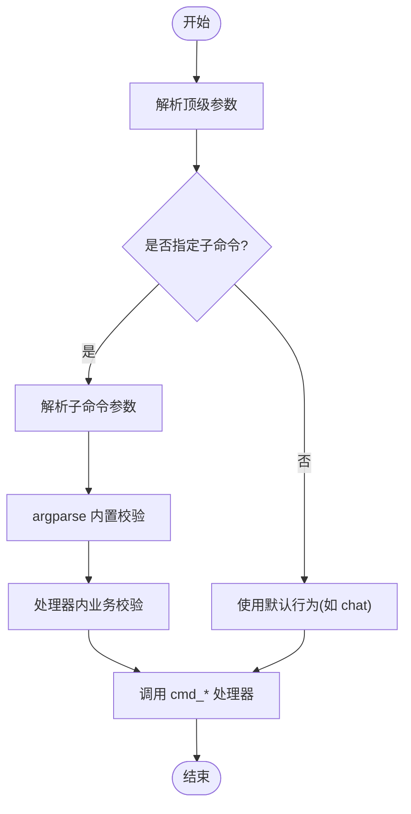
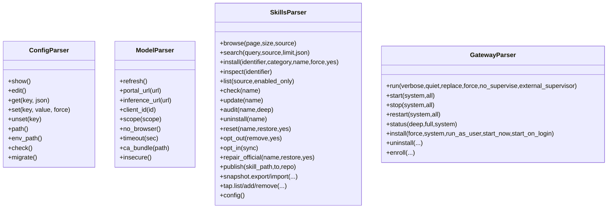
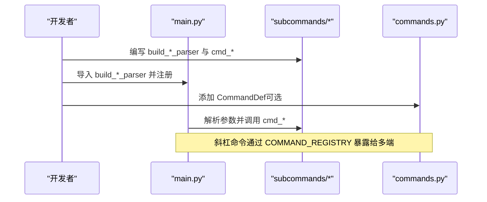
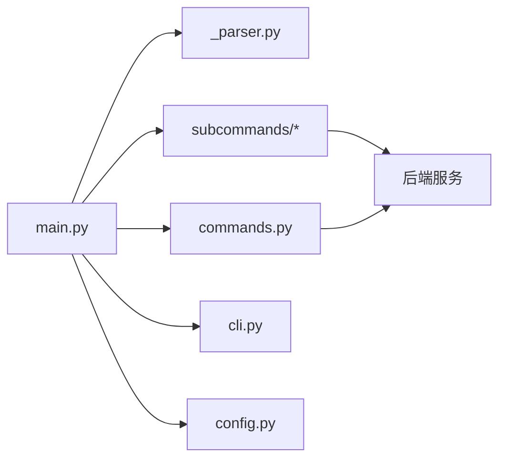

# CLI 接口层

<cite>
**本文引用的文件**
- [hermes_cli/main.py](file://hermes_cli/main.py)
- [hermes_cli/_parser.py](file://hermes_cli/_parser.py)
- [cli.py](file://cli.py)
- [hermes_cli/commands.py](file://hermes_cli/commands.py)
- [hermes_cli/config.py](file://hermes_cli/config.py)
- [hermes_cli/subcommands/model.py](file://hermes_cli/subcommands/model.py)
- [hermes_cli/subcommands/config.py](file://hermes_cli/subcommands/config.py)
- [hermes_cli/subcommands/skills.py](file://hermes_cli/subcommands/skills.py)
- [hermes_cli/subcommands/gateway.py](file://hermes_cli/subcommands/gateway.py)
- [hermes_cli/subcommands/_shared.py](file://hermes_cli/subcommands/_shared.py)
</cite>

## 目录
1. [简介](#简介)
2. [项目结构](#项目结构)
3. [核心组件](#核心组件)
4. [架构总览](#架构总览)
5. [详细组件分析](#详细组件分析)
6. [依赖关系分析](#依赖关系分析)
7. [性能考量](#性能考量)
8. [故障排查指南](#故障排查指南)
9. [结论](#结论)
10. [附录](#附录)

## 简介
本文件面向 Hermes Agent 的命令行接口（CLI）层，系统性说明命令解析器、子命令系统、参数验证与传递流程、错误处理策略，以及配置管理、会话控制、模型切换、技能管理等模块的职责分工。同时给出扩展新 CLI 命令的最佳实践，并解释 CLI 与后端服务（网关/代理/TUI）之间的通信机制，包括异步调用、状态同步与进度反馈。

## 项目结构
Hermes CLI 采用“顶层入口 + 子命令模块化”的组织方式：
- 顶层入口负责启动、快速路径优化、配置文件与环境加载、日志初始化、全局标志预处理（如 --profile），以及子命令注册与分发。
- 子命令按功能域拆分到 hermes_cli/subcommands/*，每个子命令提供独立的 build_*_parser 函数，集中声明该命令及其子命令的参数。
- 顶层解析器定义在 hermes_cli/_parser.py，仅包含顶级参数和 chat 子命令；其他子命令由 main.py 直接组装，便于与 cmd_* 处理器紧密耦合。
- 交互式 REPL 与 TUI 相关逻辑位于 cli.py，负责经典 prompt_toolkit 界面与部分显示/交互行为。
- 斜杠命令（/start、/model、/skills 等）通过 commands.py 中的中央注册表统一管理，供 CLI、网关、Telegram/Slack 等多端复用。

图表来源
- [hermes_cli/main.py:439-485](file://hermes_cli/main.py#L439-L485)
- [hermes_cli/_parser.py:87-503](file://hermes_cli/_parser.py#L87-L503)
- [cli.py:1-120](file://cli.py#L1-L120)
- [hermes_cli/commands.py:102-345](file://hermes_cli/commands.py#L102-L345)
- [hermes_cli/config.py:1-16](file://hermes_cli/config.py#L1-L16)

章节来源
- [hermes_cli/main.py:439-485](file://hermes_cli/main.py#L439-L485)
- [hermes_cli/_parser.py:87-503](file://hermes_cli/_parser.py#L87-L503)
- [cli.py:1-120](file://cli.py#L1-L120)
- [hermes_cli/commands.py:102-345](file://hermes_cli/commands.py#L102-L345)
- [hermes_cli/config.py:1-16](file://hermes_cli/config.py#L1-L16)

## 核心组件
- 顶层解析器与参数继承
  - 顶级参数（--version、--oneshot、--model、--provider、--resume、--continue、--worktree、--tui/--cli、--safe-mode 等）集中在 _parser.py 中定义，并通过 _inherited_flag 标记可在重启动时携带。
  - chat 子命令复用顶级参数，使用 argparse.SUPPRESS 避免覆盖已设置的顶级值。
- 子命令注册与分发
  - main.py 导入各子命令的 build_*_parser，统一挂载到 subparsers，并将 func=cmd_* 注入默认处理器，实现“解析即路由”。
- 配置与环境
  - 启动早期读取 config.yaml、.env，设置 HERMES_HOME、安全与网络偏好，初始化日志。
  - 支持 profile 覆盖（--profile/-p），并在 argparse 之前完成环境注入。
- 斜杠命令体系
  - commands.py 维护 COMMAND_REGISTRY，为 CLI、网关、平台（Telegram/Slack/Discord）提供统一的命令元数据与分发能力。
- 交互界面
  - cli.py 提供经典 REPL 与 TUI 相关的交互、格式化、历史、补全等能力。

章节来源
- [hermes_cli/_parser.py:16-37](file://hermes_cli/_parser.py#L16-L37)
- [hermes_cli/_parser.py:87-503](file://hermes_cli/_parser.py#L87-L503)
- [hermes_cli/main.py:439-485](file://hermes_cli/main.py#L439-L485)
- [hermes_cli/commands.py:102-345](file://hermes_cli/commands.py#L102-L345)
- [cli.py:1-120](file://cli.py#L1-L120)

## 架构总览
CLI 启动与控制流概览如下：

图表来源
- [hermes_cli/main.py:519-693](file://hermes_cli/main.py#L519-L693)
- [hermes_cli/main.py:746-775](file://hermes_cli/main.py#L746-L775)
- [hermes_cli/_parser.py:87-503](file://hermes_cli/_parser.py#L87-L503)
- [hermes_cli/subcommands/model.py:12-63](file://hermes_cli/subcommands/model.py#L12-L63)
- [hermes_cli/subcommands/config.py:12-69](file://hermes_cli/subcommands/config.py#L12-L69)
- [hermes_cli/subcommands/skills.py:12-317](file://hermes_cli/subcommands/skills.py#L12-L317)
- [hermes_cli/subcommands/gateway.py:32-200](file://hermes_cli/subcommands/gateway.py#L32-L200)

## 详细组件分析

### 命令解析器与参数传递流程
- 顶级参数与 chat 子命令
  - 顶级参数涵盖版本、一次性模式、模型/提供者、恢复会话、工作树、TUI/CLI 切换、安全模式等。
  - chat 子命令复用顶级参数，通过 SUPPRESS 避免覆盖，确保“hermes -m foo chat”语义正确。
- 参数继承与重启动携带
  - 通过 _inherited_flag 标记的参数会在重启动（如 setup wizard 后进入 chat）时自动携带。
- 子命令解析器
  - 每个子命令提供 build_*_parser(subparsers, ...)，将自身挂载到 subparsers，并设置默认处理器 func。
- 参数验证
  - 利用 argparse 的 choices、nargs、type、default、action 等进行基础校验。
  - 业务级校验在 cmd_* 处理器中进行（例如 provider 合法性、模型存在性）。

图表来源
- [hermes_cli/_parser.py:87-503](file://hermes_cli/_parser.py#L87-L503)
- [hermes_cli/subcommands/model.py:12-63](file://hermes_cli/subcommands/model.py#L12-L63)
- [hermes_cli/subcommands/config.py:12-69](file://hermes_cli/subcommands/config.py#L12-L69)
- [hermes_cli/subcommands/skills.py:12-317](file://hermes_cli/subcommands/skills.py#L12-L317)

章节来源
- [hermes_cli/_parser.py:87-503](file://hermes_cli/_parser.py#L87-L503)
- [hermes_cli/subcommands/model.py:12-63](file://hermes_cli/subcommands/model.py#L12-L63)
- [hermes_cli/subcommands/config.py:12-69](file://hermes_cli/subcommands/config.py#L12-L69)
- [hermes_cli/subcommands/skills.py:12-317](file://hermes_cli/subcommands/skills.py#L12-L317)

### 子命令系统与职责分工
- 配置管理（config）
  - 提供 show/edit/get/set/unset/path/env-path/check/migrate 等子命令，用于查看、编辑、查询、写入、迁移配置。
- 模型切换（model）
  - 提供刷新缓存、门户 URL、推理 API、OAuth 客户端 ID、scope、超时、CA bundle、禁用浏览器登录等选项，用于交互式选择默认模型与提供者。
- 技能管理（skills）
  - 提供 browse/search/install/inspect/list/check/update/audit/uninstall/reset/opt-out/opt-in/repair-official/publish/snapshot/tap/config 等丰富子命令，覆盖技能生命周期管理与源管理。
- 网关管理（gateway）
  - 提供 run/start/stop/restart/status/install/uninstall/enroll 等子命令，支持前台运行、后台服务、替换、强制启动、外部进程管理器、深度状态检查等。

图表来源
- [hermes_cli/subcommands/config.py:12-69](file://hermes_cli/subcommands/config.py#L12-L69)
- [hermes_cli/subcommands/model.py:12-63](file://hermes_cli/subcommands/model.py#L12-L63)
- [hermes_cli/subcommands/skills.py:12-317](file://hermes_cli/subcommands/skills.py#L12-L317)
- [hermes_cli/subcommands/gateway.py:32-200](file://hermes_cli/subcommands/gateway.py#L32-L200)

章节来源
- [hermes_cli/subcommands/config.py:12-69](file://hermes_cli/subcommands/config.py#L12-L69)
- [hermes_cli/subcommands/model.py:12-63](file://hermes_cli/subcommands/model.py#L12-L63)
- [hermes_cli/subcommands/skills.py:12-317](file://hermes_cli/subcommands/skills.py#L12-L317)
- [hermes_cli/subcommands/gateway.py:32-200](file://hermes_cli/subcommands/gateway.py#L32-L200)

### 命令注册机制与扩展新命令
- 子命令注册
  - 在 main.py 中导入各子命令的 build_*_parser，并传入 subparsers，完成注册。
  - 每个子命令内部通过 add_parser 创建子解析器，并使用 set_defaults(func=cmd_xxx) 绑定处理器。
- 斜杠命令注册
  - 在 commands.py 的 COMMAND_REGISTRY 中添加 CommandDef，即可在多端（CLI、网关、平台）暴露命令。
- 扩展步骤建议
  - 新增子命令：在 hermes_cli/subcommands 下新建模块，实现 build_*_parser，并在 main.py 中导入注册。
  - 新增斜杠命令：在 commands.py 添加 CommandDef，必要时在 gateway/run.py 或其他调度处实现 busy_policy 与处理器。

图表来源
- [hermes_cli/main.py:439-485](file://hermes_cli/main.py#L439-L485)
- [hermes_cli/commands.py:102-345](file://hermes_cli/commands.py#L102-L345)

章节来源
- [hermes_cli/main.py:439-485](file://hermes_cli/main.py#L439-L485)
- [hermes_cli/commands.py:102-345](file://hermes_cli/commands.py#L102-L345)

### 配置管理、会话控制、模型切换、技能管理
- 配置管理
  - 启动早期读取 config.yaml/.env，设置环境变量与安全/网络偏好，初始化日志。
  - 支持 profile 覆盖（--profile/-p），并在 argparse 前完成环境注入。
- 会话控制
  - 通过 --resume/-r、--continue/-c、--in、--worktree 等参数控制会话恢复与工作目录。
  - 斜杠命令提供 /new、/stop、/resume、/sessions 等会话操作。
- 模型切换
  - 通过 --model、--provider、--reasoning 等参数进行单次覆盖；持久化通过 model 子命令或 config set。
- 技能管理
  - skills 子命令提供搜索、安装、审计、更新、发布、快照、源管理等功能。

章节来源
- [hermes_cli/main.py:519-693](file://hermes_cli/main.py#L519-L693)
- [hermes_cli/main.py:746-775](file://hermes_cli/main.py#L746-L775)
- [hermes_cli/_parser.py:101-292](file://hermes_cli/_parser.py#L101-L292)
- [hermes_cli/subcommands/model.py:12-63](file://hermes_cli/subcommands/model.py#L12-L63)
- [hermes_cli/subcommands/skills.py:12-317](file://hermes_cli/subcommands/skills.py#L12-L317)
- [hermes_cli/commands.py:102-345](file://hermes_cli/commands.py#L102-L345)

### 与后端服务的通信机制（异步、状态同步、进度反馈）
- 前端入口与后端解耦
  - CLI 主要负责参数解析、配置加载、命令分发；具体执行委托给 cmd_* 处理器与后端服务（gateway/proxy/TUI）。
- 异步与流式
  - 聊天与工具调用通常以异步方式进行，CLI/TUI 通过事件流展示进度与结果。
- 状态同步
  - 会话状态、模型、工具集、技能等通过配置与运行时状态同步；斜杠命令可实时影响运行态。
- 进度反馈
  - 通过 TUI/REPL 的输出、日志、状态栏、提示符等方式反馈；CLI 也可通过 quiet/verbose 控制输出粒度。

章节来源
- [cli.py:1-120](file://cli.py#L1-L120)
- [hermes_cli/commands.py:102-345](file://hermes_cli/commands.py#L102-L345)

## 依赖关系分析
- 模块耦合
  - main.py 强依赖各子命令的 build_*_parser，形成“入口-解析器-处理器”的清晰分层。
  - _parser.py 仅承担顶级参数与 chat 子命令，降低循环依赖风险。
  - commands.py 作为斜杠命令的单一事实来源，被 CLI、网关、平台复用。
- 外部依赖
  - argparse 用于参数解析；prompt_toolkit 用于 TUI/REPL；hermes_logging 用于日志；hermes_constants 用于常量与路径。
- 潜在循环
  - 通过将子命令解析器独立到 subcommands/*，避免 main.py 与子命令间的循环导入。

图表来源
- [hermes_cli/main.py:439-485](file://hermes_cli/main.py#L439-L485)
- [hermes_cli/_parser.py:87-503](file://hermes_cli/_parser.py#L87-L503)
- [hermes_cli/commands.py:102-345](file://hermes_cli/commands.py#L102-L345)
- [cli.py:1-120](file://cli.py#L1-L120)
- [hermes_cli/config.py:1-16](file://hermes_cli/config.py#L1-L16)

章节来源
- [hermes_cli/main.py:439-485](file://hermes_cli/main.py#L439-L485)
- [hermes_cli/_parser.py:87-503](file://hermes_cli/_parser.py#L87-L503)
- [hermes_cli/commands.py:102-345](file://hermes_cli/commands.py#L102-L345)
- [cli.py:1-120](file://cli.py#L1-L120)
- [hermes_cli/config.py:1-16](file://hermes_cli/config.py#L1-L16)

## 性能考量
- 启动快速路径
  - 早期 UTF-8 设置、venv 自愈、鼠标残留抑制、容器/Termux 检测、fast version 处理，减少冷启动开销。
- 配置读取优化
  - 共享 raw_config 缓存，避免重复 YAML 解析；合并安全与网络偏好到环境变量，减少后续读取。
- 懒加载与按需导入
  - 仅在需要时导入重型依赖（如 prompt_toolkit、OpenAI SDK），降低首次导入成本。
- 日志与输出
  - 根据模式（cli/gui）初始化日志；支持 quiet/verbose 控制输出粒度，减少 I/O 压力。

章节来源
- [hermes_cli/main.py:59-102](file://hermes_cli/main.py#L59-L102)
- [hermes_cli/main.py:272-423](file://hermes_cli/main.py#L272-L423)
- [hermes_cli/main.py:746-775](file://hermes_cli/main.py#L746-L775)
- [cli.py:1-120](file://cli.py#L1-L120)

## 故障排查指南
- 配置解析失败
  - 当 config.yaml 无法解析时，系统会备份损坏文件并降级到默认配置，同时在 stderr 与日志中警告。
- 非交互式终端限制
  - 某些命令要求 TTY，若通过管道或非交互子进程调用会显式报错并退出。
- 安全与权限
  - 对敏感环境变量写保护（如 PATH、LD_*、PYTHON*），防止通过 dashboard 或 CLI 写入危险变量。
- 常见错误定位
  - 使用 hermes logs/errors 查看日志；使用 hermes doctor 检查环境与依赖；使用 hermes debug share 上传诊断报告。

章节来源
- [hermes_cli/config.py:45-156](file://hermes_cli/config.py#L45-L156)
- [hermes_cli/main.py:488-503](file://hermes_cli/main.py#L488-L503)
- [hermes_cli/config.py:160-200](file://hermes_cli/config.py#L160-L200)

## 结论
Hermes CLI 通过清晰的入口与模块化子命令设计，实现了高内聚、低耦合的命令体系。参数解析、配置管理、会话控制、模型切换、技能管理等功能职责明确，配合斜杠命令注册表，为多端一致体验提供了坚实基础。启动快速路径与懒加载策略保障了性能，完善的错误处理与日志机制提升了可观测性与可维护性。扩展新命令只需遵循现有模式，即可无缝集成到 CLI、网关与平台生态中。

## 附录
- 常用命令示例
  - 启动交互聊天：hermes
  - 一次性问答：hermes -z "你的问题"
  - 恢复最近会话：hermes -c
  - 选择默认模型：hermes model
  - 查看配置：hermes config show
  - 安装/启动网关：hermes gateway install/start
  - 浏览技能：hermes skills browse
- 最佳实践
  - 使用 --profile/-p 隔离不同环境配置。
  - 在 CI/无头环境中使用 --accept-hooks、--yolo、--ignore-user-config 等标志。
  - 通过 skills 子命令管理技能生命周期，定期 audit/update。
  - 使用 gateway 子命令管理服务生命周期，结合系统服务管理器实现高可用。