# 安全与权限控制

<cite>
**本文引用的文件**
- [tools/path_security.py](file://tools/path_security.py)
- [acp_adapter/permissions.py](file://acp_adapter/permissions.py)
- [tools/computer_use/permissions.py](file://tools/computer_use/permissions.py)
- [hermes_cli/security_advisories.py](file://hermes_cli/security_advisories.py)
- [hermes_cli/security_audit.py](file://hermes_cli/security_audit.py)
- [tools/threat_patterns.py](file://tools/threat_patterns.py)
- [tools/tirith_security.py](file://tools/tirith_security.py)
- [hermes_cli/mcp_security.py](file://hermes_cli/mcp_security.py)
- [gateway/authz_mixin.py](file://gateway/authz_mixin.py)
- [acp_adapter/auth.py](file://acp_adapter/auth.py)
</cite>

## 目录
1. [简介](#简介)
2. [项目结构](#项目结构)
3. [核心组件](#核心组件)
4. [架构总览](#架构总览)
5. [详细组件分析](#详细组件分析)
6. [依赖关系分析](#依赖关系分析)
7. [性能考量](#性能考量)
8. [故障排除指南](#故障排除指南)
9. [结论](#结论)
10. [附录](#附录)

## 简介
本文件面向 Hermes Agent 的安全与权限控制系统，围绕多层防护、最小权限原则与零信任模型展开，覆盖路径安全验证、权限管理（基于角色的访问控制、动态评估、继承机制）、威胁检测模式（恶意行为识别、异常流量、入侵检测）、审批工作流（敏感操作确认、人工审核、审计追踪）、安全策略配置（规则引擎、策略模板、动态更新）、安全监控与告警（事件记录、实时告警、合规报告），以及安全最佳实践与故障排除。文档以仓库实际实现为依据，提供可追溯的源码引用与可视化图示，帮助读者从概念到代码层面全面理解系统安全设计。

## 项目结构
Hermes 的安全能力分布在多个模块中：
- 路径与命令级安全：路径校验、命令内容扫描、外部二进制集成
- 权限与审批：ACP 权限桥接、计算机使用平台权限、网关授权
- 威胁检测：提示注入/C2/数据外泄等模式匹配、OSV 漏洞查询
- 供应链安全：已知受损包检测、MCP 服务器条目安全检查
- 认证与身份：ACP 认证方法发现、运行时提供者探测

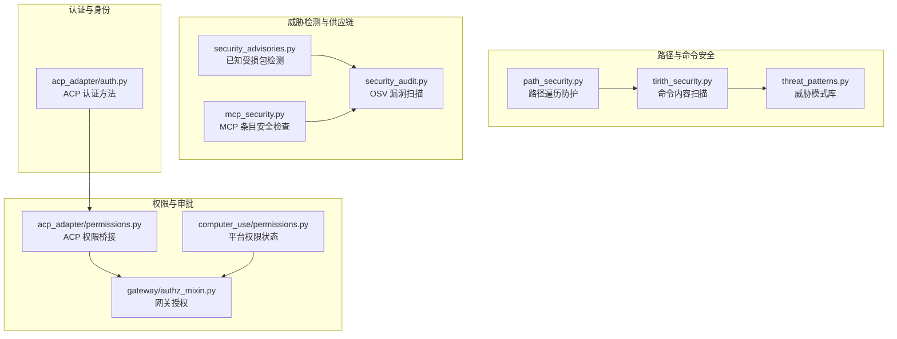

**图表来源**
- [tools/path_security.py:15-44](file://tools/path_security.py#L15-L44)
- [tools/tirith_security.py:731-800](file://tools/tirith_security.py#L731-L800)
- [tools/threat_patterns.py:207-255](file://tools/threat_patterns.py#L207-L255)
- [acp_adapter/permissions.py:110-183](file://acp_adapter/permissions.py#L110-L183)
- [tools/computer_use/permissions.py:121-199](file://tools/computer_use/permissions.py#L121-L199)
- [gateway/authz_mixin.py:386-783](file://gateway/authz_mixin.py#L386-L783)
- [hermes_cli/security_advisories.py:167-188](file://hermes_cli/security_advisories.py#L167-L188)
- [hermes_cli/security_audit.py:433-481](file://hermes_cli/security_audit.py#L433-L481)
- [hermes_cli/mcp_security.py:121-182](file://hermes_cli/mcp_security.py#L121-L182)
- [acp_adapter/auth.py:11-80](file://acp_adapter/auth.py#L11-L80)

**章节来源**
- [tools/path_security.py:15-44](file://tools/path_security.py#L15-L44)
- [tools/tirith_security.py:731-800](file://tools/tirith_security.py#L731-L800)
- [tools/threat_patterns.py:207-255](file://tools/threat_patterns.py#L207-L255)
- [acp_adapter/permissions.py:110-183](file://acp_adapter/permissions.py#L110-L183)
- [tools/computer_use/permissions.py:121-199](file://tools/computer_use/permissions.py#L121-L199)
- [gateway/authz_mixin.py:386-783](file://gateway/authz_mixin.py#L386-L783)
- [hermes_cli/security_advisories.py:167-188](file://hermes_cli/security_advisories.py#L167-L188)
- [hermes_cli/security_audit.py:433-481](file://hermes_cli/security_audit.py#L433-L481)
- [hermes_cli/mcp_security.py:121-182](file://hermes_cli/mcp_security.py#L121-L182)
- [acp_adapter/auth.py:11-80](file://acp_adapter/auth.py#L11-L80)

## 核心组件
- 路径安全验证：统一的路径解析与越界检查，防止路径穿越与符号链接逃逸。
- 命令内容安全：通过 tirith 子进程对命令进行内容级威胁检测，支持自动安装、签名校验与熔断保护。
- 威胁模式库：集中化的正则模式集合，按作用域（all/context/strict）应用，检测提示注入、C2、数据外泄等。
- 权限桥接与审批：将 Hermes 的“一次/会话/永久/拒绝”语义映射到 ACP 的许可选项，并支持超时与错误降级。
- 平台权限状态：跨平台检测 Computer Use 就绪性与 macOS TCC 权限，提供统一的状态输出。
- 网关授权：多通道接入的入站消息授权，支持允许名单、配对审批、上游代理信任与默认拒绝。
- 供应链安全：检测已知受损包并给出修复指引；按需扫描 venv、插件与 MCP 配置的漏洞。
- MCP 安全：阻止 shell 解释器执行网络外发或写入持久化表面的高危形状，并内置 IOC 黑名单。
- 认证方法：探测运行时提供者并注册 ACP 认证方法，支持终端设置流程。

**章节来源**
- [tools/path_security.py:15-44](file://tools/path_security.py#L15-L44)
- [tools/tirith_security.py:731-800](file://tools/tirith_security.py#L731-L800)
- [tools/threat_patterns.py:207-255](file://tools/threat_patterns.py#L207-L255)
- [acp_adapter/permissions.py:110-183](file://acp_adapter/permissions.py#L110-L183)
- [tools/computer_use/permissions.py:121-199](file://tools/computer_use/permissions.py#L121-L199)
- [gateway/authz_mixin.py:386-783](file://gateway/authz_mixin.py#L386-L783)
- [hermes_cli/security_advisories.py:167-188](file://hermes_cli/security_advisories.py#L167-L188)
- [hermes_cli/security_audit.py:433-481](file://hermes_cli/security_audit.py#L433-L481)
- [hermes_cli/mcp_security.py:121-182](file://hermes_cli/mcp_security.py#L121-L182)
- [acp_adapter/auth.py:11-80](file://acp_adapter/auth.py#L11-L80)

## 架构总览
下图展示了从用户输入到执行的关键安全拦截点与决策流程，体现零信任与最小权限原则：所有输入均需经过验证与授权，任何未明确允许的请求默认拒绝。

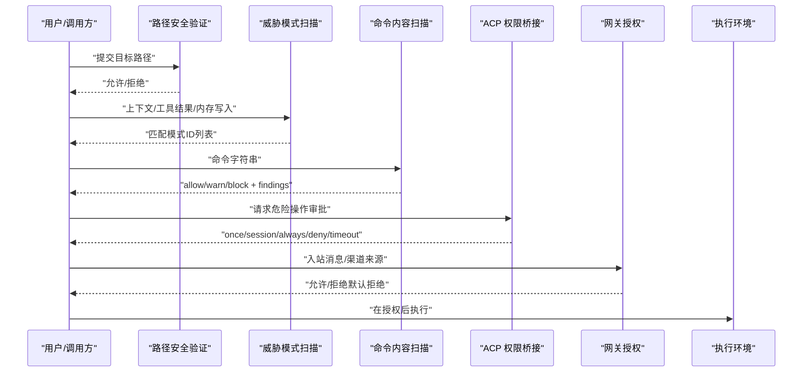

**图表来源**
- [tools/path_security.py:15-44](file://tools/path_security.py#L15-L44)
- [tools/threat_patterns.py:207-255](file://tools/threat_patterns.py#L207-L255)
- [tools/tirith_security.py:731-800](file://tools/tirith_security.py#L731-L800)
- [acp_adapter/permissions.py:110-183](file://acp_adapter/permissions.py#L110-L183)
- [gateway/authz_mixin.py:386-783](file://gateway/authz_mixin.py#L386-L783)

## 详细组件分析

### 路径安全验证
- 功能要点：
  - 使用 resolve() 与 relative_to() 确保目标路径位于允许根目录下，防止路径穿越。
  - 快速检测包含“..”的路径片段，提前拦截明显攻击。
  - 遵循最小权限原则：仅允许访问受控目录，失败时返回错误信息。
- 复杂度与健壮性：
  - 时间复杂度 O(n) 用于路径解析与相对路径检查。
  - 捕获 ValueError/OSError，避免异常传播导致服务中断。
- 优化建议：
  - 缓存已解析的根路径以减少重复开销。
  - 结合符号链接白名单策略增强安全性。

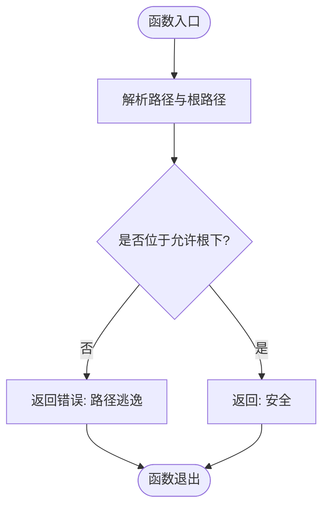

**图表来源**
- [tools/path_security.py:15-44](file://tools/path_security.py#L15-L44)

**章节来源**
- [tools/path_security.py:15-44](file://tools/path_security.py#L15-L44)

### 命令内容安全（Tirith 集成）
- 功能要点：
  - 通过子进程运行 tirith 对命令进行内容级威胁检测，返回 allow/warn/block 动作与 findings。
  - 支持自动安装、SHA-256 校验与可选 cosign 溯源验证。
  - 具备熔断保护：连续失败达到阈值后临时禁用，避免阻塞。
  - 支持 fail-open/fail-closed 配置，保障可用性与安全性的平衡。
- 关键流程：
  - 解析配置与环境变量，确定启用状态、超时与失败策略。
  - 解析二进制路径：PATH、HERMES_HOME/bin、自动下载。
  - 执行检查并处理异常：spawn 失败、超时、未知退出码。
- 性能与可靠性：
  - 背景线程异步安装，避免启动阻塞。
  - 去重日志与磁盘标记减少重复失败重试。

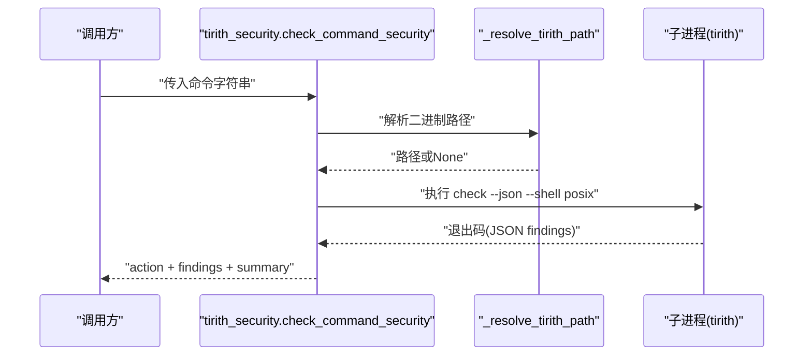

**图表来源**
- [tools/tirith_security.py:731-800](file://tools/tirith_security.py#L731-L800)
- [tools/tirith_security.py:493-599](file://tools/tirith_security.py#L493-L599)

**章节来源**
- [tools/tirith_security.py:731-800](file://tools/tirith_security.py#L731-L800)
- [tools/tirith_security.py:493-599](file://tools/tirith_security.py#L493-L599)

### 威胁模式库
- 功能要点：
  - 集中化管理正则模式，按作用域（all/context/strict）应用，控制检测强度。
  - 检测类别包括：经典提示注入、角色劫持、C2/Brainworm、数据外泄、持久化/SSH后门、硬编码密钥等。
  - 支持不可见 Unicode 字符检测与 NFKC 归一化，防止同形异义绕过。
- 使用场景：
  - 上下文装配、工具结果、内存写入与技能安装前的安全扫描。
  - 为阻断路径提供首个威胁消息，便于用户干预。
- 性能考虑：
  - 限制最大扫描字符数，避免长文本导致的回溯爆炸。
  - 预编译模式集，提升匹配效率。

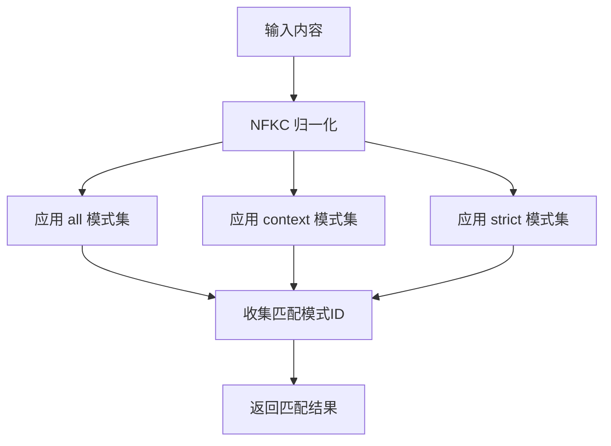

**图表来源**
- [tools/threat_patterns.py:207-255](file://tools/threat_patterns.py#L207-L255)

**章节来源**
- [tools/threat_patterns.py:207-255](file://tools/threat_patterns.py#L207-L255)

### 权限桥接与审批（ACP）
- 功能要点：
  - 将 Hermes 的“一次/会话/永久/拒绝”映射到 ACP 的许可选项，支持智能拒绝与超时。
  - 构建工具调用更新，附加命令与描述，生成唯一请求 ID 避免并发冲突。
  - 回调函数封装异步调度与异常处理，失败时默认拒绝。
- 工作流程：
  - 构建选项列表（允许一次、会话、永久、拒绝）。
  - 发送权限请求到 ACP，等待响应或超时。
  - 映射 ACP 结果为 Hermes 审批字符串。

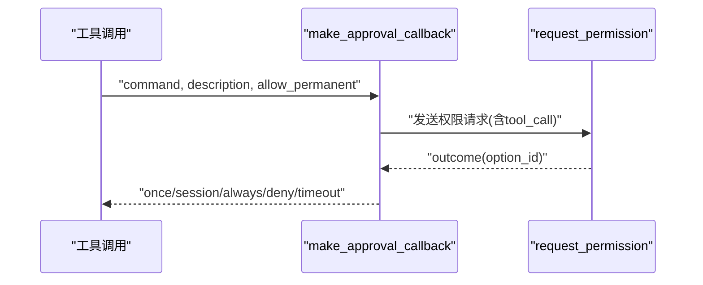

**图表来源**
- [acp_adapter/permissions.py:110-183](file://acp_adapter/permissions.py#L110-L183)

**章节来源**
- [acp_adapter/permissions.py:110-183](file://acp_adapter/permissions.py#L110-L183)

### 平台权限状态（Computer Use）
- 功能要点：
  - 跨平台检测驱动健康与 macOS TCC 权限（辅助功能、屏幕录制）。
  - 统一输出 ready/can_grant/checks/source/error 等字段，供 UI 与 CLI 使用。
  - 子进程环境变量清理，防止泄露敏感信息。
- 平台差异：
  - macOS：需要显式 TCC 授权；ready 取决于 accessibility 与 screen_recording。
  - Windows/Linux：以驱动健康为准，无 TCC 模型。

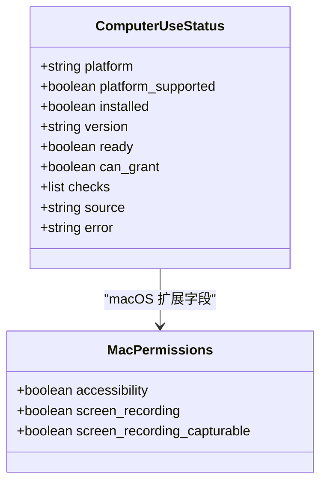

**图表来源**
- [tools/computer_use/permissions.py:121-199](file://tools/computer_use/permissions.py#L121-L199)

**章节来源**
- [tools/computer_use/permissions.py:121-199](file://tools/computer_use/permissions.py#L121-L199)

### 网关授权（多通道接入）
- 功能要点：
  - 支持上游代理信任、适配器自有访问策略、配对审批与允许名单。
  - 默认拒绝：未明确允许的请求一律拒绝，符合零信任原则。
  - 多平台适配：Telegram/Discord/Slack/WhatsApp 等的环境变量与配置读取。
- 决策顺序：
  - 系统事件（Home Assistant/Webhook）直接放行。
  - 上游中继或适配器声明的上游授权直接放行。
  - 群组/频道允许名单、机器人允许标志、配对存储检查。
  - 平台/全局允许名单匹配，否则拒绝。

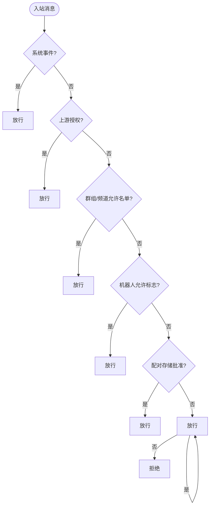

**图表来源**
- [gateway/authz_mixin.py:386-783](file://gateway/authz_mixin.py#L386-L783)

**章节来源**
- [gateway/authz_mixin.py:386-783](file://gateway/authz_mixin.py#L386-L783)

### 供应链安全（已知受损包与漏洞扫描）
- 已知受损包检测：
  - 扫描当前 venv 中的 Python 包版本，匹配已知受损清单。
  - 提供修复步骤与确认机制，支持 24 小时横幅缓存。
- 按需漏洞扫描：
  - 扫描 venv、插件 requirements/pyproject、MCP 配置中的固定版本。
  - 通过 OSV.dev 批量查询漏洞详情，按严重性排序输出。
- MCP 条目安全检查：
  - 阻止 shell 解释器执行网络外发或写入持久化表面。
  - 内置 IOC 黑名单，拒绝已知攻击指标。

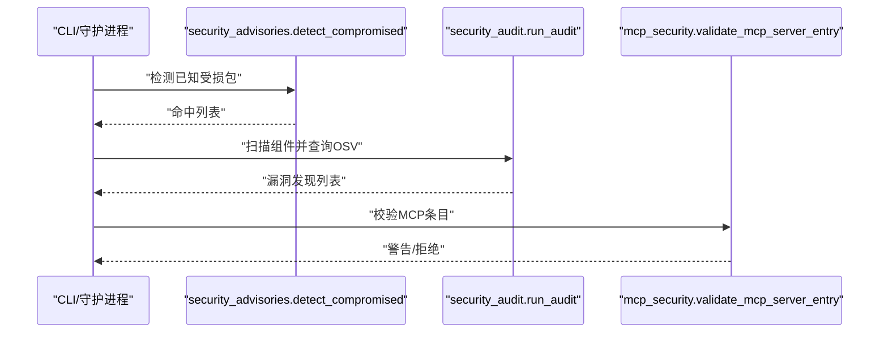

**图表来源**
- [hermes_cli/security_advisories.py:167-188](file://hermes_cli/security_advisories.py#L167-L188)
- [hermes_cli/security_audit.py:433-481](file://hermes_cli/security_audit.py#L433-L481)
- [hermes_cli/mcp_security.py:121-182](file://hermes_cli/mcp_security.py#L121-L182)

**章节来源**
- [hermes_cli/security_advisories.py:167-188](file://hermes_cli/security_advisories.py#L167-L188)
- [hermes_cli/security_audit.py:433-481](file://hermes_cli/security_audit.py#L433-L481)
- [hermes_cli/mcp_security.py:121-182](file://hermes_cli/mcp_security.py#L121-L182)

### 认证与身份（ACP）
- 功能要点：
  - 探测运行时提供者（如 Azure Foundry Entra ID），若存在则注册对应认证方法。
  - 始终提供终端设置方法，便于首次配置。
  - 支持 callable API key（令牌提供者）作为有效凭证。
- 集成方式：
  - 通过 acp.schema 注册 AuthMethodAgent 与 TerminalAuthMethod。
  - 在握手阶段向客户端暴露可用认证方法。

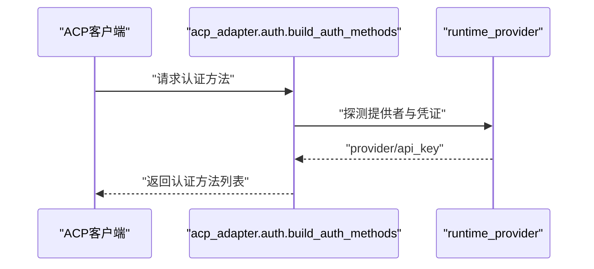

**图表来源**
- [acp_adapter/auth.py:11-80](file://acp_adapter/auth.py#L11-L80)

**章节来源**
- [acp_adapter/auth.py:11-80](file://acp_adapter/auth.py#L11-L80)

## 依赖关系分析
- 模块耦合：
  - 路径安全与命令扫描独立，但共同服务于执行前验证。
  - 威胁模式库被多个组件复用，降低重复实现风险。
  - 权限桥接与网关授权协同，确保审批与入站授权一致。
- 外部依赖：
  - tirith 二进制：通过 HTTPS 下载与 SHA-256 校验，可选 cosign 溯源。
  - OSV.dev：批量查询漏洞详情，需网络可达。
  - ACP SDK：权限请求与认证方法注册。
- 潜在循环依赖：
  - 通过延迟导入与模块化设计避免循环引用。
  - 网关授权模块惰性导入 logger，避免启动时循环。

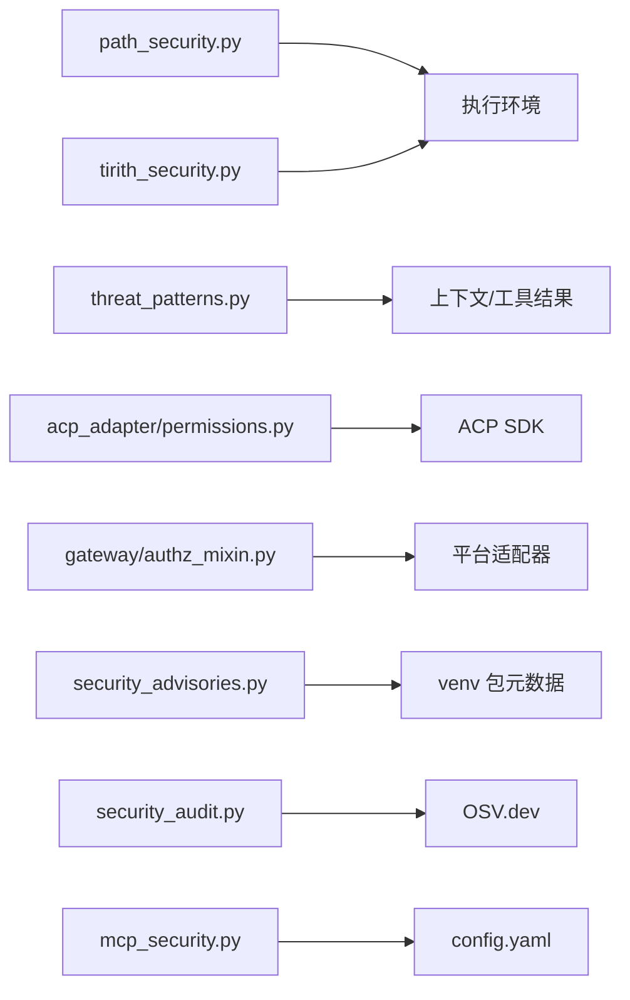

**图表来源**
- [tools/path_security.py:15-44](file://tools/path_security.py#L15-L44)
- [tools/tirith_security.py:731-800](file://tools/tirith_security.py#L731-L800)
- [tools/threat_patterns.py:207-255](file://tools/threat_patterns.py#L207-L255)
- [acp_adapter/permissions.py:110-183](file://acp_adapter/permissions.py#L110-L183)
- [gateway/authz_mixin.py:386-783](file://gateway/authz_mixin.py#L386-L783)
- [hermes_cli/security_advisories.py:167-188](file://hermes_cli/security_advisories.py#L167-L188)
- [hermes_cli/security_audit.py:433-481](file://hermes_cli/security_audit.py#L433-L481)
- [hermes_cli/mcp_security.py:121-182](file://hermes_cli/mcp_security.py#L121-L182)

**章节来源**
- [tools/path_security.py:15-44](file://tools/path_security.py#L15-L44)
- [tools/tirith_security.py:731-800](file://tools/tirith_security.py#L731-L800)
- [tools/threat_patterns.py:207-255](file://tools/threat_patterns.py#L207-L255)
- [acp_adapter/permissions.py:110-183](file://acp_adapter/permissions.py#L110-L183)
- [gateway/authz_mixin.py:386-783](file://gateway/authz_mixin.py#L386-L783)
- [hermes_cli/security_advisories.py:167-188](file://hermes_cli/security_advisories.py#L167-L188)
- [hermes_cli/security_audit.py:433-481](file://hermes_cli/security_audit.py#L433-L481)
- [hermes_cli/mcp_security.py:121-182](file://hermes_cli/mcp_security.py#L121-L182)

## 性能考量
- 路径与模式扫描：
  - 路径解析与相对路径检查为 O(n)，适合高频调用。
  - 威胁模式预编译与字符上限限制，避免长文本回溯。
- 命令扫描：
  - tirith 子进程调用有超时与熔断保护，避免阻塞。
  - 背景安装与去重日志减少网络与 I/O 开销。
- 漏洞扫描：
  - OSV 批量查询与并行详情获取，提升吞吐。
  - 仅扫描固定版本，减少误报与查询量。
- 授权决策：
  - 多条件短路判断，优先放行系统事件与上游授权。
  - 允许名单解析为集合，查找复杂度 O(1)。

[本节提供一般性指导，无需特定文件分析]

## 故障排除指南
- 路径验证失败：
  - 检查目标路径是否在允许根目录下，确认符号链接解析正确。
  - 参考路径安全函数的错误返回信息定位问题。
- 命令扫描阻塞：
  - 检查 tirith 二进制是否存在且可执行，查看熔断状态。
  - 调整超时与失败策略，必要时手动安装或禁用扫描。
- 威胁模式误报：
  - 调整作用域（context/strict）或自定义模式，避免合法内容被阻断。
  - 检查不可见 Unicode 字符与 NFKC 归一化影响。
- 权限审批超时：
  - 检查 ACP 连接与事件循环调度，确认用户交互是否完成。
  - 调整超时参数或降级为拒绝。
- 平台权限缺失：
  - macOS 上检查 TCC 权限授予状态，重新触发授权对话框。
  - 其他平台确认驱动健康状态。
- 供应链告警：
  - 根据修复步骤卸载或升级受损包，旋转密钥并审计配置。
  - 使用 hermes doctor 确认告警已处理。
- MCP 条目拒绝：
  - 检查命令与参数是否包含网络外发或持久化写入。
  - 移除 IOC 指标或替换为安全命令。

**章节来源**
- [tools/path_security.py:15-44](file://tools/path_security.py#L15-L44)
- [tools/tirith_security.py:731-800](file://tools/tirith_security.py#L731-L800)
- [tools/threat_patterns.py:207-255](file://tools/threat_patterns.py#L207-L255)
- [acp_adapter/permissions.py:110-183](file://acp_adapter/permissions.py#L110-L183)
- [tools/computer_use/permissions.py:121-199](file://tools/computer_use/permissions.py#L121-L199)
- [hermes_cli/security_advisories.py:167-188](file://hermes_cli/security_advisories.py#L167-L188)
- [hermes_cli/mcp_security.py:121-182](file://hermes_cli/mcp_security.py#L121-L182)

## 结论
Hermes Agent 的安全与权限控制系统通过多层防护、最小权限与零信任模型，构建了从路径、命令、上下文到入站消息的全链路安全保障。结合威胁模式库、供应链检测与 MCP 安全检查，系统能够有效识别与阻断恶意行为。权限桥接与网关授权确保敏感操作需经审批与授权，平台权限状态提供跨平台一致性。通过自动化安装、签名校验与熔断保护，系统在安全性与可用性之间取得平衡。建议持续更新威胁模式与供应链清单，定期审计配置与权限策略，确保安全基线不被削弱。

[本节总结性内容，无需特定文件分析]

## 附录
- 安全最佳实践：
  - 代码审查：关注路径解析、命令拼接与外部调用。
  - 漏洞扫描：定期运行供应链审计，及时修复高风险漏洞。
  - 安全测试：模拟提示注入、路径穿越与命令注入用例。
- 配置示例：
  - 启用 tirith 扫描并设置超时与失败策略。
  - 配置平台允许名单与上游代理信任。
  - 定义 MCP 服务器条目，避免 shell 解释器与高危命令。
- 合规报告：
  - 导出供应链审计报告与威胁检测结果。
  - 记录权限审批与网关授权决策日志。

[本节提供一般性指导，无需特定文件分析]