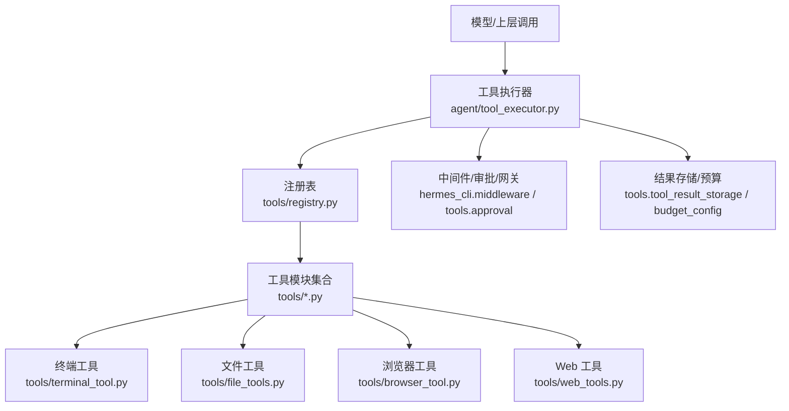
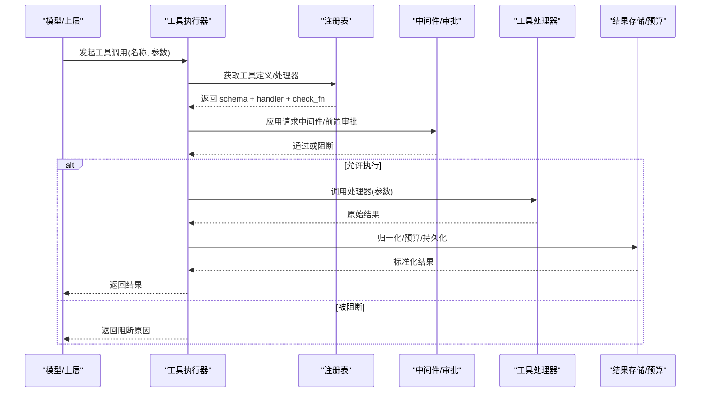
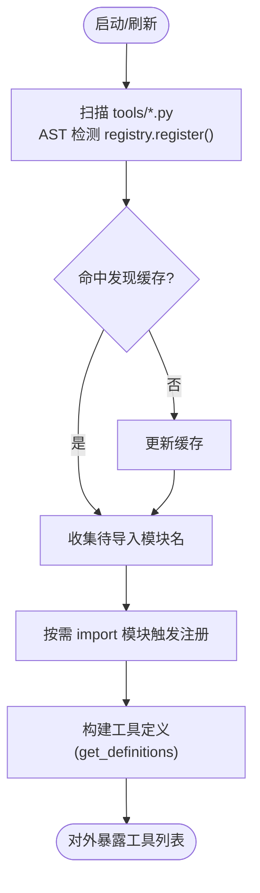
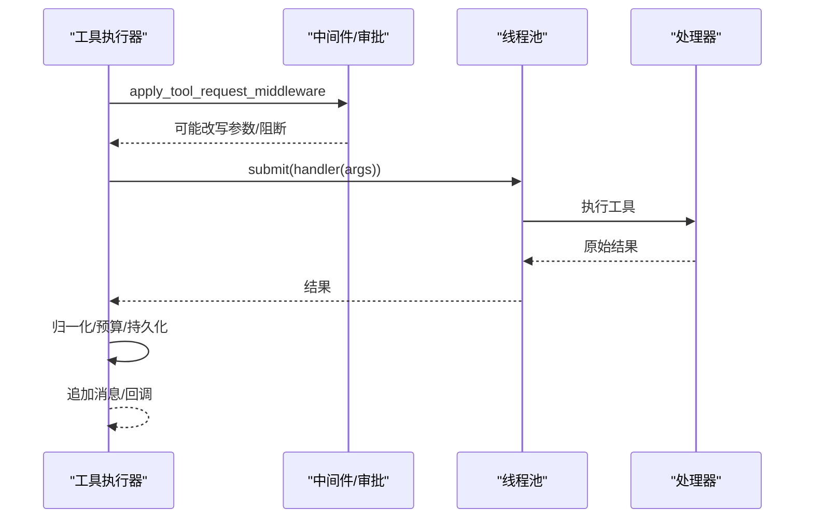
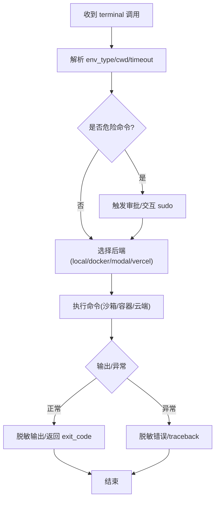
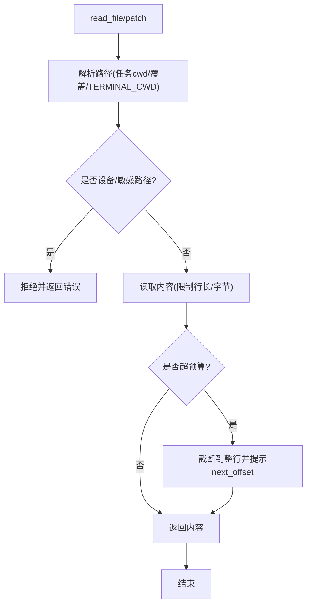
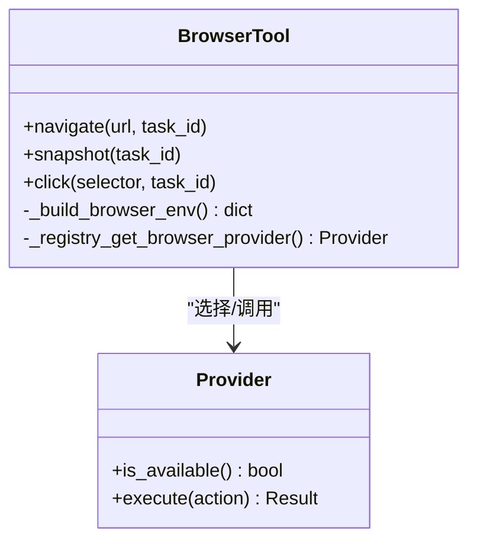
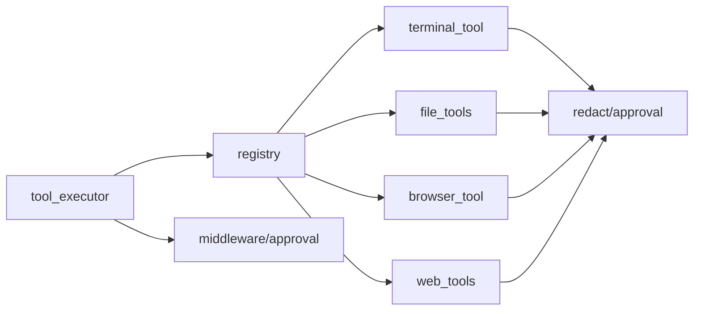

# 工具执行系统

<cite>
**本文引用的文件**
- [tools/registry.py](file://tools/registry.py)
- [agent/tool_executor.py](file://agent/tool_executor.py)
- [tools/terminal_tool.py](file://tools/terminal_tool.py)
- [tools/file_tools.py](file://tools/file_tools.py)
- [tools/browser_tool.py](file://tools/browser_tool.py)
- [tools/web_tools.py](file://tools/web_tools.py)
- [tests/tools/test_terminal_error_redaction.py](file://tests/tools/test_terminal_error_redaction.py)
</cite>

## 目录
1. [简介](#简介)
2. [项目结构](#项目结构)
3. [核心组件](#核心组件)
4. [架构总览](#架构总览)
5. [详细组件分析](#详细组件分析)
6. [依赖关系分析](#依赖关系分析)
7. [性能考量](#性能考量)
8. [故障排查指南](#故障排查指南)
9. [结论](#结论)
10. [附录：自定义工具开发指南](#附录自定义工具开发指南)

## 简介
本技术文档面向 Hermes Agent 的工具执行系统，系统性阐述工具注册机制、动态加载与发现算法、执行环境的安全隔离（沙箱、权限控制、资源限制）、以及终端、浏览器自动化、文件操作、网络请求等工具类型的实现要点。同时覆盖参数校验、错误处理、结果格式化规范，并提供自定义工具开发的完整指南与安全、性能优化建议。

## 项目结构
Hermes Agent 的工具执行系统由“注册与发现”“调度与执行”“具体工具实现”三层构成：
- 注册与发现：集中式注册表负责扫描、导入并登记工具元数据（名称、工具集、Schema、处理器、可用性检查函数等），提供定义查询与别名管理。
- 调度与执行：统一编排工具调用，支持顺序与并发执行、中间件链、授权审批门控、预算与超时控制、结果持久化与截断。
- 工具实现：按领域划分的具体工具模块，如终端、文件、浏览器、Web 搜索/提取等，各自封装安全策略、后端选择、资源限制与错误处理。

**图示来源**
- [agent/tool_executor.py:1-120](file://agent/tool_executor.py#L1-L120)
- [tools/registry.py:108-159](file://tools/registry.py#L108-L159)
- [tools/terminal_tool.py:1-35](file://tools/terminal_tool.py#L1-L35)
- [tools/file_tools.py:1-25](file://tools/file_tools.py#L1-L25)
- [tools/browser_tool.py:1-50](file://tools/browser_tool.py#L1-L50)
- [tools/web_tools.py:1-37](file://tools/web_tools.py#L1-L37)

**章节来源**
- [tools/registry.py:108-159](file://tools/registry.py#L108-L159)
- [agent/tool_executor.py:1-120](file://agent/tool_executor.py#L1-L120)

## 核心组件
- 工具注册表（ToolRegistry）
  - 职责：维护工具条目、工具集别名、工具集可用性检查；提供 get_definitions 生成 OpenAI 风格工具 Schema；支持插件覆盖策略与版本代际计数以驱动缓存失效。
  - 关键点：check_fn 缓存（TTL + 失败宽限窗口）避免外部状态抖动导致工具不可用；register/deregister 的跨工具集覆盖保护；动态 Schema 覆盖能力。
- 工具执行器（tool_executor）
  - 职责：解析参数、中间件链、授权审批门控、并发调度、预算与超时、结果归一化与持久化、进度回调与日志脱敏。
  - 关键点：并发工作线程上限、图像生成并行度限制、授权门控锁超时、批量任务中止与取消、结果大小预算与截断。
- 终端工具（terminal_tool）
  - 职责：本地/Docker/Modal/Vercel Sandbox 等多后端命令执行；危险命令审批；sudo 交互密码缓存；磁盘使用告警；错误输出敏感信息脱敏。
- 文件工具（file_tools）
  - 职责：路径解析与工作区锚定、设备/敏感路径拦截、读取大小预算与分页提示、补丁路径重写、受保护指令文件写入强制审批。
- 浏览器工具（browser_tool）
  - 职责：多后端（本地 Chromium、Browserbase、Browser Use、Firecrawl）自动选择；子进程环境变量最小化传递；URL 安全策略；会话隔离与清理。
- Web 工具（web_tools）
  - 职责：统一 Web 搜索/提取接口，后端可插拔（Exa/Firecrawl/Tavily/Parallel/Seagex/XA 等），受管网关路由与密钥透传控制。

**章节来源**
- [tools/registry.py:201-231](file://tools/registry.py#L201-L231)
- [tools/registry.py:414-442](file://tools/registry.py#L414-L442)
- [tools/registry.py:562-644](file://tools/registry.py#L562-L644)
- [tools/registry.py:717-764](file://tools/registry.py#L717-L764)
- [agent/tool_executor.py:78-131](file://agent/tool_executor.py#L78-L131)
- [agent/tool_executor.py:391-468](file://agent/tool_executor.py#L391-L468)
- [agent/tool_executor.py:758-800](file://agent/tool_executor.py#L758-L800)
- [tools/terminal_tool.py:57-62](file://tools/terminal_tool.py#L57-L62)
- [tools/terminal_tool.py:344-380](file://tools/terminal_tool.py#L344-L380)
- [tools/file_tools.py:30-85](file://tools/file_tools.py#L30-L85)
- [tools/file_tools.py:152-168](file://tools/file_tools.py#L152-L168)
- [tools/file_tools.py:307-363](file://tools/file_tools.py#L307-L363)
- [tools/file_tools.py:676-703](file://tools/file_tools.py#L676-L703)
- [tools/browser_tool.py:109-140](file://tools/browser_tool.py#L109-L140)
- [tools/web_tools.py:121-200](file://tools/web_tools.py#L121-L200)

## 架构总览
工具执行从“模型调用”到“工具返回”的关键流程如下：

**图示来源**
- [agent/tool_executor.py:482-662](file://agent/tool_executor.py#L482-L662)
- [tools/registry.py:717-764](file://tools/registry.py#L717-L764)

## 详细组件分析

### 工具注册与动态发现
- 动态发现
  - 通过 AST 扫描工具目录下 Python 文件是否包含顶层 `registry.register(...)` 调用，命中则记录模块名并延迟导入，避免全量 import 开销。
  - 引入发现缓存（基于 mtime+size），减少重复扫描成本。
- 注册协议
  - 每个工具在模块级调用 `registry.register(name, toolset, schema, handler, check_fn, ...)` 声明自身。
  - 支持动态 Schema 覆盖（运行时配置变化时更新描述/限制）。
- 可用性与缓存
  - check_fn 用于探测外部依赖（Docker/Modal/Playwright 等），带 TTL 与“最近成功宽限”机制，避免瞬时抖动导致工具不可见。
  - 支持按 profile 维度缓存隔离，多路复用场景下不串扰。
- 覆盖与权限
  - 跨工具集覆盖需显式 opt-in（allow_tool_override），防止误覆盖内置工具。
  - deregister 同样受所有权策略约束，MCP 工具集除外。

**图示来源**
- [tools/registry.py:108-159](file://tools/registry.py#L108-L159)
- [tools/registry.py:162-199](file://tools/registry.py#L162-L199)
- [tools/registry.py:233-380](file://tools/registry.py#L233-L380)
- [tools/registry.py:717-764](file://tools/registry.py#L717-L764)

**章节来源**
- [tools/registry.py:108-159](file://tools/registry.py#L108-L159)
- [tools/registry.py:233-380](file://tools/registry.py#L233-L380)
- [tools/registry.py:562-644](file://tools/registry.py#L562-L644)
- [tools/registry.py:717-764](file://tools/registry.py#L717-L764)

### 工具执行与并发调度
- 参数解析与中间件链
  - 解析 JSON 参数，失败即返回结构化错误。
  - 通过 hermes_cli.middleware 的请求/执行中间件链进行改写、审计、限流等。
- 授权与审批
  - 前置审批门控序列化，避免并发审批交错；支持人类等待时间排除于批处理截止时间之外。
- 并发执行
  - 线程池并发执行工具调用，默认最大并发 8；图片生成类工具单独限制并发。
  - 支持开始顺序门控与超时，避免单个慢任务阻塞整体批次。
- 结果归一化与预算
  - 统一将非字符串/非多模态信封的结果转为错误消息，避免下游无法处理的类型。
  - 根据上下文窗口计算结果预算，超限截断并提示继续读取。

**图示来源**
- [agent/tool_executor.py:141-157](file://agent/tool_executor.py#L141-L157)
- [agent/tool_executor.py:482-662](file://agent/tool_executor.py#L482-L662)
- [agent/tool_executor.py:758-800](file://agent/tool_executor.py#L758-L800)

**章节来源**
- [agent/tool_executor.py:78-131](file://agent/tool_executor.py#L78-L131)
- [agent/tool_executor.py:391-468](file://agent/tool_executor.py#L391-L468)
- [agent/tool_executor.py:482-662](file://agent/tool_executor.py#L482-L662)
- [agent/tool_executor.py:758-800](file://agent/tool_executor.py#L758-L800)

### 终端工具：沙箱执行、权限控制与资源限制
- 多后端执行
  - 支持 local、docker、modal、vercel_sandbox 等，按配置与环境变量选择。
  - 容器/云端环境具备文件系统与进程隔离，降低对宿主影响。
- 安全与权限
  - 危险命令审批（集成 approval 模块），sudo 交互式密码缓存与失败回退。
  - 工作目录白名单校验，拒绝含 shell 元字符的路径。
  - 错误输出强制敏感信息脱敏，避免凭证泄露。
- 资源限制
  - 前台命令最大超时硬限制；磁盘用量告警（定期扫描 scratch 目录）。
  - 后台任务生命周期管理与清理。

**图示来源**
- [tools/terminal_tool.py:57-62](file://tools/terminal_tool.py#L57-L62)
- [tools/terminal_tool.py:344-380](file://tools/terminal_tool.py#L344-L380)
- [tools/terminal_tool.py:404-420](file://tools/terminal_tool.py#L404-L420)
- [tools/terminal_tool.py:486-605](file://tools/terminal_tool.py#L486-L605)
- [tests/tools/test_terminal_error_redaction.py:47-154](file://tests/tools/test_terminal_error_redaction.py#L47-L154)

**章节来源**
- [tools/terminal_tool.py:1-35](file://tools/terminal_tool.py#L1-L35)
- [tools/terminal_tool.py:57-62](file://tools/terminal_tool.py#L57-L62)
- [tools/terminal_tool.py:344-380](file://tools/terminal_tool.py#L344-L380)
- [tools/terminal_tool.py:404-420](file://tools/terminal_tool.py#L404-L420)
- [tools/terminal_tool.py:486-605](file://tools/terminal_tool.py#L486-L605)
- [tests/tools/test_terminal_error_redaction.py:47-154](file://tests/tools/test_terminal_error_redaction.py#L47-L154)

### 文件工具：路径安全、读写预算与受保护文件
- 路径解析与工作区锚定
  - 优先使用任务/会话记录的 cwd，其次为注册的 cwd 覆盖，再回退到绝对 TERMINAL_CWD，最后到进程 cwd。
  - 容器后端使用 POSIX 路径规范化，避免主机符号链接导致的错位。
- 安全拦截
  - 阻止读取设备节点与敏感 proc 路径；写操作拦截系统敏感目录与 Docker socket。
  - 受保护的指令文件（如 AGENTS.md、CLAUDE.md、SOUL.md 等）写入强制审批，防止持久化提示注入。
- 读取预算与分页
  - 单次读取字符数上限（可配置），超出时截断至完整行并返回剩余行数，引导模型分段读取。
- 补丁路径修正
  - 对 V4A patch 头部路径进行主机绝对路径重写，确保工具层与 Shell 层目标一致。

**图示来源**
- [tools/file_tools.py:307-363](file://tools/file_tools.py#L307-L363)
- [tools/file_tools.py:516-549](file://tools/file_tools.py#L516-L549)
- [tools/file_tools.py:676-703](file://tools/file_tools.py#L676-L703)
- [tools/file_tools.py:728-800](file://tools/file_tools.py#L728-L800)

**章节来源**
- [tools/file_tools.py:30-85](file://tools/file_tools.py#L30-L85)
- [tools/file_tools.py:152-168](file://tools/file_tools.py#L152-L168)
- [tools/file_tools.py:307-363](file://tools/file_tools.py#L307-L363)
- [tools/file_tools.py:516-549](file://tools/file_tools.py#L516-L549)
- [tools/file_tools.py:676-703](file://tools/file_tools.py#L676-L703)
- [tools/file_tools.py:728-800](file://tools/file_tools.py#L728-L800)

### 浏览器工具：多后端、会话隔离与最小化凭据
- 后端选择
  - 自动选择本地 Chromium、Browserbase、Browser Use、Firecrawl 等，依据配置与凭据可用性。
- 安全隔离
  - 子进程环境变量最小化传递，仅放行浏览器后端所需键，避免泄露其他密钥。
  - URL 安全策略与访问策略检查，必要时阻断。
- 会话管理
  - 按 task_id 隔离会话，自动清理；支持 keep-alive 与超时配置。

**图示来源**
- [tools/browser_tool.py:109-140](file://tools/browser_tool.py#L109-L140)
- [tools/browser_tool.py:147-177](file://tools/browser_tool.py#L147-L177)

**章节来源**
- [tools/browser_tool.py:1-50](file://tools/browser_tool.py#L1-L50)
- [tools/browser_tool.py:109-140](file://tools/browser_tool.py#L109-L140)
- [tools/browser_tool.py:147-177](file://tools/browser_tool.py#L147-L177)

### Web 工具：多后端搜索/提取与受管网关
- 后端兼容
  - 支持 Exa、Firecrawl、Parallel、Tavily、SearXNG、Brave Free、DDGS、XA 等，通过注册表或内置探针选择。
- 受管网关
  - 对于订阅用户，可通过受管工具网关路由 Firecrawl 调用，提升稳定性与安全性。
- 安全与调试
  - URL 安全校验、敏感查询参数识别；可选调试模式记录调用与指标。

**章节来源**
- [tools/web_tools.py:1-37](file://tools/web_tools.py#L1-L37)
- [tools/web_tools.py:121-200](file://tools/web_tools.py#L121-L200)

## 依赖关系分析
- 组件耦合
  - 工具执行器强依赖注册表（获取定义/处理器）与中间件/审批（执行前策略）。
  - 各工具模块依赖共享安全库（脱敏、URL 安全、文件安全）与后端选择逻辑。
- 直接/间接依赖
  - terminal_tool → approval、environments/*、redact
  - file_tools → file_operations、file_state、redact、config
  - browser_tool → browser_registry、plugins.browser.*、url_safety
  - web_tools → plugins.web.*、managed_tool_gateway、url_safety
- 循环依赖规避
  - registry 设计为无循环依赖的叶子模块，工具模块在导入时自注册，model_tools 再聚合。

**图示来源**
- [tools/registry.py:108-159](file://tools/registry.py#L108-L159)
- [agent/tool_executor.py:482-662](file://agent/tool_executor.py#L482-L662)

**章节来源**
- [tools/registry.py:108-159](file://tools/registry.py#L108-L159)
- [agent/tool_executor.py:482-662](file://agent/tool_executor.py#L482-L662)

## 性能考量
- 工具发现缓存：基于文件 mtime+size 的发现缓存显著降低扫描开销。
- check_fn 缓存：TTL 与失败宽限避免频繁外部探测，兼顾响应速度与鲁棒性。
- 并发执行：默认 8 线程，图片生成类工具限制并发，避免后端限流。
- 结果预算：按上下文窗口缩放结果预算，避免大结果挤占模型上下文。
- 懒加载：浏览器工具等模块内关键依赖懒加载，缩短冷启动时间。

[本节为通用性能指导，无需特定文件引用]

## 故障排查指南
- 工具不可用
  - 检查 check_fn 是否因外部依赖缺失或临时抖动返回 False；查看最近一次成功时间与宽限窗口。
  - 确认工具集别名与启用/禁用配置是否正确。
- 终端工具报错
  - 关注错误输出中的敏感信息是否已脱敏；若未脱敏，检查 redact 开关与回调。
  - 验证 sudo 密码缓存是否因认证失败被清空；检查审批回调是否生效。
- 文件写入失败
  - 检查路径是否命中敏感目录或受保护指令文件；确认工作区锚定是否正确（worktree/cwd）。
- 浏览器/网络工具失败
  - 检查凭据与环境变量是否最小化传递；确认后端可用性（API Key、网关可达性）。
  - 查看 URL 安全策略是否阻断。

**章节来源**
- [tools/registry.py:233-380](file://tools/registry.py#L233-L380)
- [tools/terminal_tool.py:57-62](file://tools/terminal_tool.py#L57-L62)
- [tools/file_tools.py:676-703](file://tools/file_tools.py#L676-L703)
- [tools/browser_tool.py:109-140](file://tools/browser_tool.py#L109-L140)
- [tests/tools/test_terminal_error_redaction.py:47-154](file://tests/tools/test_terminal_error_redaction.py#L47-L154)

## 结论
Hermes Agent 的工具执行系统通过集中式注册与动态发现、严格的中间件与审批门控、多后端沙箱执行、细粒度的安全与资源限制，实现了高可靠、可扩展且安全的工具生态。其设计在性能（缓存、并发、懒加载）与安全（脱敏、路径拦截、最小凭据）之间取得平衡，并为自定义工具提供了清晰的扩展点与最佳实践指引。

[本节为总结性内容，无需特定文件引用]

## 附录：自定义工具开发指南
- 工具定义规范
  - 在工具模块中调用 `registry.register(name, toolset, schema, handler, check_fn, ...)`，schema 遵循 OpenAI function 格式。
  - 如需运行时动态调整描述/限制，提供 dynamic_schema_overrides 回调。
- 安全考虑
  - 输入校验：严格校验参数类型与取值范围，拒绝非法字符与越界路径。
  - 输出脱敏：对错误与日志中的敏感信息进行脱敏，避免凭证泄露。
  - 权限最小化：仅申请必要的环境变量与系统资源，避免过度授权。
- 性能优化建议
  - 使用 check_fn 探测外部依赖并缓存结果，避免每次定义查询都触发昂贵探测。
  - 对耗时操作采用异步/并发策略，合理设置超时与重试。
  - 控制结果大小，结合预算机制避免上下文溢出。
- 错误处理与结果格式化
  - 统一返回字符串或多模态信封；其他类型将被转换为错误消息。
  - 捕获并包装异常，提供可读的错误信息与错误类型，便于诊断。
- 测试与验证
  - 编写单元测试覆盖参数校验、安全拦截、错误脱敏与边界条件。
  - 使用 mock 替换外部依赖，确保测试稳定与快速。

**章节来源**
- [tools/registry.py:201-231](file://tools/registry.py#L201-L231)
- [tools/registry.py:562-644](file://tools/registry.py#L562-L644)
- [tools/registry.py:717-764](file://tools/registry.py#L717-L764)
- [agent/tool_executor.py:770-800](file://agent/tool_executor.py#L770-L800)