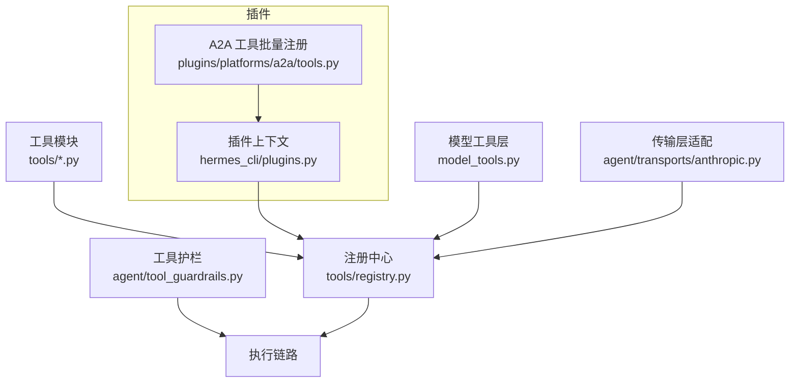
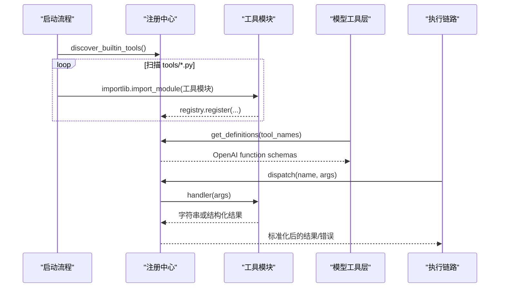
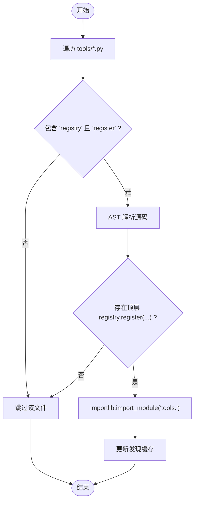
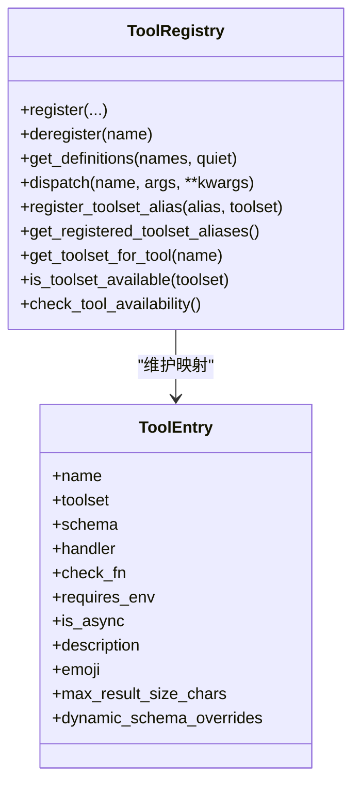
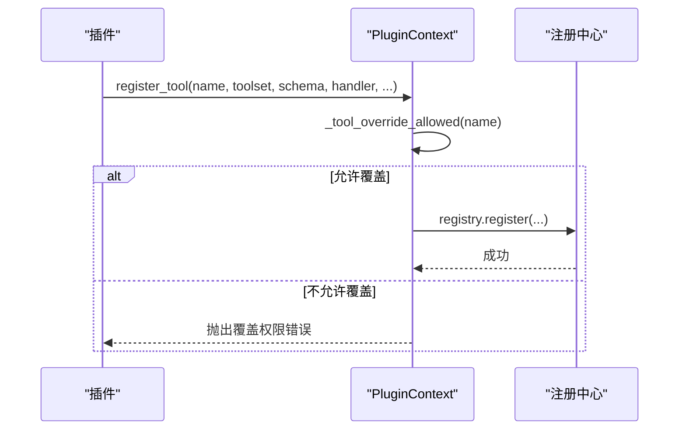
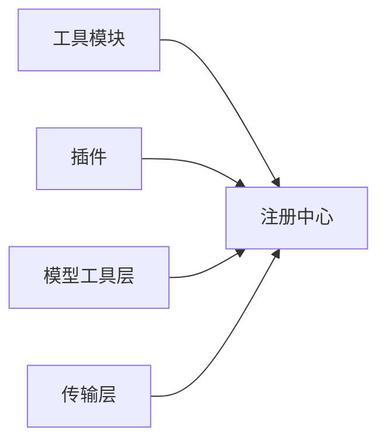

# 工具注册系统

<cite>
**本文引用的文件**
- [tools/registry.py](file://tools/registry.py)
- [hermes_cli/plugins.py](file://hermes_cli/plugins.py)
- [model_tools.py](file://model_tools.py)
- [agent/tool_guardrails.py](file://agent/tool_guardrails.py)
- [agent/transports/anthropic.py](file://agent/transports/anthropic.py)
- [plugins/platforms/a2a/tools.py](file://plugins/platforms/a2a/tools.py)
</cite>

## 目录
1. [简介](#简介)
2. [项目结构](#项目结构)
3. [核心组件](#核心组件)
4. [架构总览](#架构总览)
5. [详细组件分析](#详细组件分析)
6. [依赖关系分析](#依赖关系分析)
7. [性能考量](#性能考量)
8. [故障排查指南](#故障排查指南)
9. [结论](#结论)
10. [附录：API 与最佳实践](#附录api-与最佳实践)

## 简介
本技术文档聚焦 Hermes Agent 的工具注册系统，系统性阐述工具发现、动态加载、元数据管理、生命周期（注册到卸载）、分类体系与命名空间、版本兼容、依赖解析与冲突检测、安全验证与权限控制、沙箱隔离等关键机制。同时提供插件侧的注册 API、装饰器式/手动注册/批量注册的最佳实践，以及常见问题定位方法。

## 项目结构
围绕工具注册的核心代码主要分布在以下位置：
- 工具注册中心与调度：tools/registry.py
- 插件注册入口与安全门控：hermes_cli/plugins.py
- 模型层工具定义获取与异步桥接：model_tools.py
- 工具调用护栏（安全策略）：agent/tool_guardrails.py
- 传输层对注册表的读取与别名处理：agent/transports/anthropic.py
- 插件内工具批量注册示例：plugins/platforms/a2a/tools.py

**图表来源**
- [tools/registry.py:1-16](file://tools/registry.py#L1-L16)
- [hermes_cli/plugins.py:439-494](file://hermes_cli/plugins.py#L439-L494)
- [model_tools.py:284-284](file://model_tools.py#L284-L284)
- [agent/transports/anthropic.py:146-152](file://agent/transports/anthropic.py#L146-L152)
- [plugins/platforms/a2a/tools.py:585-588](file://plugins/platforms/a2a/tools.py#L585-L588)

**章节来源**
- [tools/registry.py:1-16](file://tools/registry.py#L1-L16)
- [hermes_cli/plugins.py:439-494](file://hermes_cli/plugins.py#L439-L494)

## 核心组件
- 工具条目 ToolEntry：承载工具名称、所属工具集、Schema、处理器、可用性检查函数、环境变量要求、是否异步、描述、表情、结果大小限制、动态 Schema 覆盖等元数据。
- 注册表 ToolRegistry：单例，维护工具映射、工具集别名、工具集检查函数、线程安全快照、生成号（用于外部缓存失效）。
- 工具发现 discover_builtin_tools：通过 AST 扫描 tools/*.py 中顶层 registry.register(...) 调用，惰性导入并返回已发现的模块名；附带基于文件 mtime+size 的发现缓存。
- 可用性检查缓存 check_fn_cache：TTL + 失败宽限窗口，避免外部依赖抖动导致工具“静默消失”。
- 分发 dispatch：统一执行同步/异步处理器，规范化结果，捕获异常并以标准错误格式返回。
- 插件注册入口 register_tool：在注册前进行“覆盖内置工具”的安全门控，再委托给注册中心。

**章节来源**
- [tools/registry.py:201-230](file://tools/registry.py#L201-L230)
- [tools/registry.py:414-436](file://tools/registry.py#L414-L436)
- [tools/registry.py:108-159](file://tools/registry.py#L108-L159)
- [tools/registry.py:257-387](file://tools/registry.py#L257-L387)
- [tools/registry.py:801-834](file://tools/registry.py#L801-L834)
- [hermes_cli/plugins.py:439-494](file://hermes_cli/plugins.py#L439-L494)

## 架构总览
工具注册系统采用“自注册 + 集中注册中心”的模式：
- 每个工具模块在模块级调用 registry.register(...) 声明自身。
- 启动时通过 discover_builtin_tools 扫描并导入这些模块，完成自动发现与注册。
- 插件通过 ctx.register_tool(...) 将自定义工具注入同一注册中心，受安全门控约束。
- 模型层通过 model_tools 获取工具定义（OpenAI function schema），并按需过滤不可用工具。
- 运行时由注册中心统一分发执行，并对结果做标准化与错误收敛。

**图表来源**
- [tools/registry.py:108-159](file://tools/registry.py#L108-L159)
- [tools/registry.py:717-764](file://tools/registry.py#L717-L764)
- [tools/registry.py:801-834](file://tools/registry.py#L801-L834)
- [model_tools.py:284-284](file://model_tools.py#L284-L284)

## 详细组件分析

### 工具发现算法与动态加载
- 静态扫描：使用 AST 解析每个工具模块，判断是否存在顶层 registry.register(...) 调用，避免误报。
- 快速预筛：先检索源码中是否包含关键字“registry”和“register”，减少 AST 解析开销。
- 发现缓存：以 (mtime_ns, size) 为键缓存判定结果，跨进程并发安全写入，显著降低冷启动成本。
- 惰性导入：仅对判定为“自注册”的模块执行 importlib.import_module，触发其模块级注册逻辑。

**图表来源**
- [tools/registry.py:71-106](file://tools/registry.py#L71-L106)
- [tools/registry.py:108-159](file://tools/registry.py#L108-L159)
- [tools/registry.py:162-199](file://tools/registry.py#L162-L199)

**章节来源**
- [tools/registry.py:71-106](file://tools/registry.py#L71-L106)
- [tools/registry.py:108-159](file://tools/registry.py#L108-L159)
- [tools/registry.py:162-199](file://tools/registry.py#L162-L199)

### 工具元数据管理与工具集/别名
- ToolEntry 字段完整描述工具元数据，包括动态 Schema 覆盖能力，便于根据运行时配置调整对外暴露的提示词与参数。
- 工具集别名：支持 register_toolset_alias 建立别名到规范工具集的映射，便于 UI/CLI 展示与路由。
- 查询接口：提供按工具集枚举工具、获取工具集需求、可用工具集统计等便捷方法。

**章节来源**
- [tools/registry.py:201-230](file://tools/registry.py#L201-L230)
- [tools/registry.py:487-507](file://tools/registry.py#L487-L507)
- [tools/registry.py:877-934](file://tools/registry.py#L877-L934)

### 工具生命周期管理（注册→运行→卸载）
- 注册：工具模块在导入时调用 registry.register(...)；插件通过 ctx.register_tool(...) 注册，并在注册前进行覆盖内置工具的授权校验。
- 运行：dispatch 统一执行同步/异步处理器，捕获异常并返回标准错误格式；结果经 _normalize_handler_result 规范化。
- 卸载：deregister 支持移除工具，清理工具集检查与别名；MCP 工具集允许“删除重建”模式。

**图表来源**
- [tools/registry.py:414-436](file://tools/registry.py#L414-L436)
- [tools/registry.py:562-644](file://tools/registry.py#L562-L644)
- [tools/registry.py:646-711](file://tools/registry.py#L646-L711)
- [tools/registry.py:801-834](file://tools/registry.py#L801-L834)

**章节来源**
- [tools/registry.py:562-644](file://tools/registry.py#L562-L644)
- [tools/registry.py:646-711](file://tools/registry.py#L646-L711)
- [tools/registry.py:801-834](file://tools/registry.py#L801-L834)

### 工具分类体系、命名空间与版本兼容
- 分类体系：以 toolset 为单位组织工具，支持别名映射，便于分组展示与条件启用。
- 命名空间：插件工具通过 hermes_plugins.* 命名空间识别，注册中心据此绑定“覆盖策略”与“所有权”。
- 版本兼容：动态 Schema 覆盖允许在不变更注册参数的情况下，依据运行时配置（如并发上限、深度限制）调整对外暴露的 Schema，保证向后兼容。

**章节来源**
- [tools/registry.py:513-544](file://tools/registry.py#L513-L544)
- [tools/registry.py:747-763](file://tools/registry.py#L747-L763)

### 依赖解析、冲突检测与自动解决
- 依赖解析：check_fn 用于探测外部依赖（如 Docker、Playwright、Modal SDK），结果被 TTL 缓存并在失败宽限期内抑制瞬态失败。
- 冲突检测：同名工具若来自不同 toolset 将被拒绝；如需替换内置实现，必须显式 override=True 并通过插件覆盖策略授权。
- 自动解决：MCP 工具集允许刷新时“删除重建”，避免重复注册导致的冲突。

**章节来源**
- [tools/registry.py:257-387](file://tools/registry.py#L257-L387)
- [tools/registry.py:562-644](file://tools/registry.py#L562-L644)
- [tools/registry.py:646-711](file://tools/registry.py#L646-L711)

### 安全验证、权限检查与沙箱隔离
- 插件覆盖授权：插件若要覆盖内置工具，需在配置中开启 allow_tool_override；未授权则抛出权限错误。
- 所有权校验：deregister 会校验调用方是否为工具所有者（按插件包根匹配），防止跨插件恶意卸载。
- 执行护栏：工具调用前后由 agent/tool_guardrails.py 进行策略决策（如循环上限、资源限制），确保执行环境安全。
- 沙箱隔离：工具执行可结合终端/容器化环境（如 terminal_tool 的环境配置），输出敏感信息会被脱敏处理。

**章节来源**
- [hermes_cli/plugins.py:498-520](file://hermes_cli/plugins.py#L498-L520)
- [tools/registry.py:646-711](file://tools/registry.py#L646-L711)
- [agent/tool_guardrails.py:570-570](file://agent/tool_guardrails.py#L570-L570)
- [tests/tools/test_terminal_error_redaction.py:1-154](file://tests/tools/test_terminal_error_redaction.py#L1-L154)

### 工具注册 API 说明
- 装饰器使用：当前仓库未提供统一的 @register_tool 装饰器；推荐在模块顶层直接调用 registry.register(...) 或 ctx.register_tool(...)。
- 手动注册：通过 hermes_cli.plugins.PluginContext.register_tool(...) 传入 name、toolset、schema、handler、check_fn、requires_env、is_async、description、emoji、override 等参数。
- 批量注册：插件可在初始化时集中调用 ctx.register_tool(...) 多次完成批量注册，例如 A2A 插件中的 register_tools(ctx) 模式。

**图表来源**
- [hermes_cli/plugins.py:439-494](file://hermes_cli/plugins.py#L439-L494)
- [tools/registry.py:562-644](file://tools/registry.py#L562-L644)

**章节来源**
- [hermes_cli/plugins.py:439-494](file://hermes_cli/plugins.py#L439-L494)
- [plugins/platforms/a2a/tools.py:585-588](file://plugins/platforms/a2a/tools.py#L585-L588)

### 工具执行与结果标准化
- 异步桥接：若工具标记为 is_async，将通过 model_tools._run_async 执行。
- 结果标准化：仅接受字符串或特定多模态信封；其他类型将被转换为错误响应，避免下游消费异常。
- 错误收敛：所有异常被捕获并以统一 JSON 错误格式返回，同时对过长错误体进行截断，保护上下文长度。

**章节来源**
- [tools/registry.py:801-834](file://tools/registry.py#L801-L834)
- [model_tools.py:284-284](file://model_tools.py#L284-L284)

## 依赖关系分析
- 工具模块 → 注册中心：通过模块级 registry.register(...) 声明。
- 插件 → 注册中心：通过 ctx.register_tool(...) 注册，受安全门控约束。
- 模型层 → 注册中心：获取工具定义（OpenAI function schema），并基于 check_fn 过滤不可用工具。
- 传输层 → 注册中心：读取已注册工具集与工具名，必要时进行别名处理。

**图表来源**
- [tools/registry.py:108-159](file://tools/registry.py#L108-L159)
- [hermes_cli/plugins.py:439-494](file://hermes_cli/plugins.py#L439-L494)
- [agent/transports/anthropic.py:146-152](file://agent/transports/anthropic.py#L146-L152)

**章节来源**
- [tools/registry.py:108-159](file://tools/registry.py#L108-L159)
- [hermes_cli/plugins.py:439-494](file://hermes_cli/plugins.py#L439-L494)
- [agent/transports/anthropic.py:146-152](file://agent/transports/anthropic.py#L146-L152)

## 性能考量
- 工具发现缓存：基于文件 mtime+size 的缓存显著降低冷启动扫描成本。
- check_fn 缓存：TTL 约 30 秒，失败宽限窗口约 60 秒，避免外部依赖抖动导致工具频繁不可用。
- 结果大小限制：per-tool 最大结果大小可配置，默认全局限制，防止大结果污染上下文。
- 线程安全：注册中心使用读写锁与快照机制，保障并发安全与一致性。

[本节为通用性能建议，不直接分析具体文件]

## 故障排查指南
- 工具不可用：检查对应工具的 check_fn 是否失败；查看日志中关于 check_fn 失败的警告；确认外部依赖状态与环境变量。
- 工具被拒绝注册：若出现覆盖内置工具的错误，请确认插件配置中是否开启 allow_tool_override。
- 工具被意外卸载：检查是否有非所有者插件尝试 deregister；确认调用栈来源是否符合预期。
- 结果过大或错误泄露：确认工具返回的是字符串或标准错误格式；检查错误体是否被截断；终端工具输出是否被脱敏。

**章节来源**
- [tools/registry.py:257-387](file://tools/registry.py#L257-L387)
- [hermes_cli/plugins.py:498-520](file://hermes_cli/plugins.py#L498-L520)
- [tools/registry.py:646-711](file://tools/registry.py#L646-L711)
- [tests/tools/test_terminal_error_redaction.py:1-154](file://tests/tools/test_terminal_error_redaction.py#L1-L154)

## 结论
Hermes Agent 的工具注册系统通过“自注册 + 集中注册中心”的设计，实现了高内聚、可扩展的工具生态。借助 AST 发现、TTL 缓存、失败宽限、线程安全快照、插件覆盖授权与执行护栏，系统在易用性、安全性与稳定性之间取得良好平衡。插件开发者可通过 ctx.register_tool(...) 安全地扩展工具集，并通过工具集别名与动态 Schema 覆盖实现灵活的版本兼容。

[本节为总结性内容，不直接分析具体文件]

## 附录：API 与最佳实践
- 工具注册 API
  - 插件注册：hermes_cli.plugins.PluginContext.register_tool(...)
  - 注册中心直注：tools.registry.ToolRegistry.register(...)
  - 批量注册：在插件初始化中多次调用 ctx.register_tool(...)，参考 A2A 插件的 register_tools(ctx) 模式。
- 最佳实践
  - 在工具模块顶层调用 registry.register(...)，保持自注册约定。
  - 为工具设置合理的 check_fn，并使用 requires_env 声明依赖环境变量。
  - 谨慎使用 override=True，仅在明确需要替换内置实现时使用，并确保配置授权。
  - 使用 dynamic_schema_overrides 根据运行时配置调整 Schema，避免硬编码限制。
  - 对可能产生大输出的工具设置 max_result_size_chars，防止上下文膨胀。
  - 在工具内部返回标准 JSON 字符串或使用 tool_error/tool_result 辅助函数，确保结果规范化。

**章节来源**
- [hermes_cli/plugins.py:439-494](file://hermes_cli/plugins.py#L439-L494)
- [tools/registry.py:562-644](file://tools/registry.py#L562-L644)
- [plugins/platforms/a2a/tools.py:585-588](file://plugins/platforms/a2a/tools.py#L585-L588)
- [tools/registry.py:974-1002](file://tools/registry.py#L974-L1002)