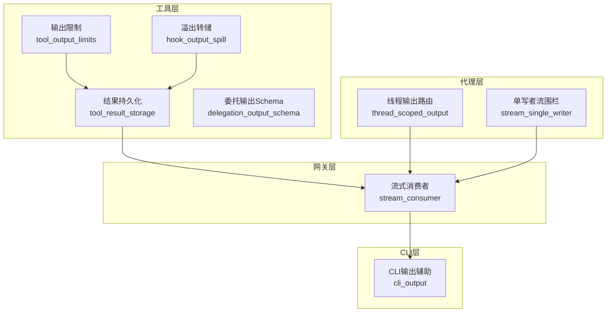
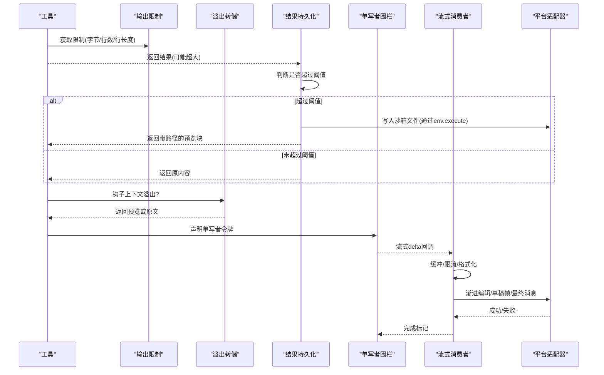
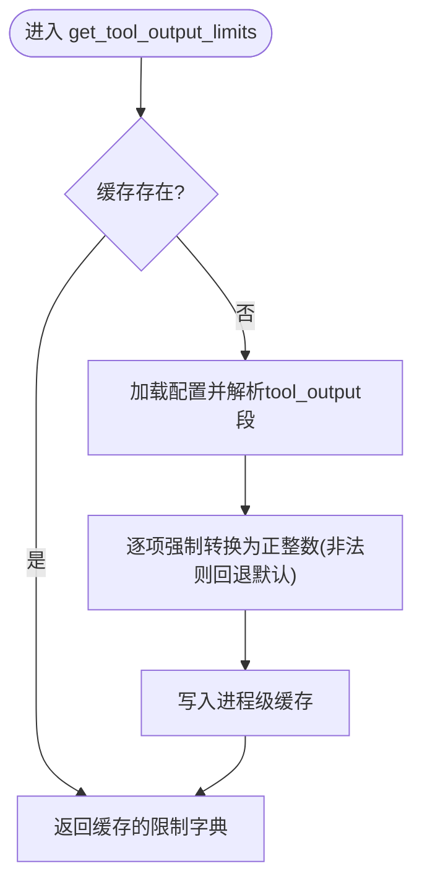
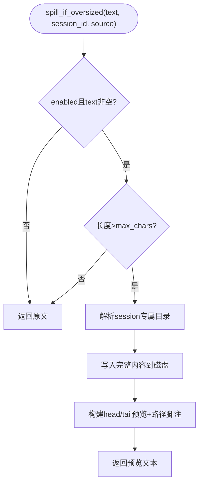
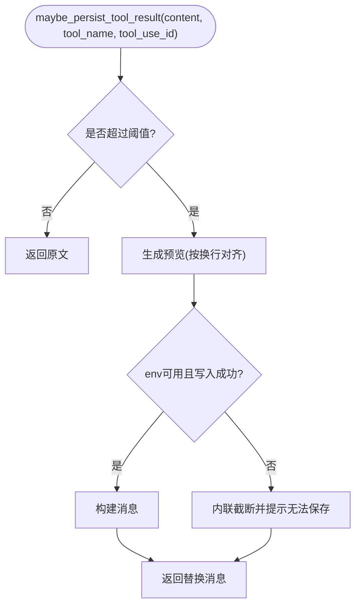
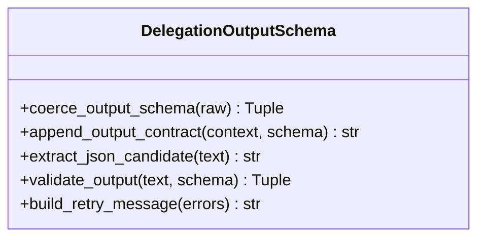
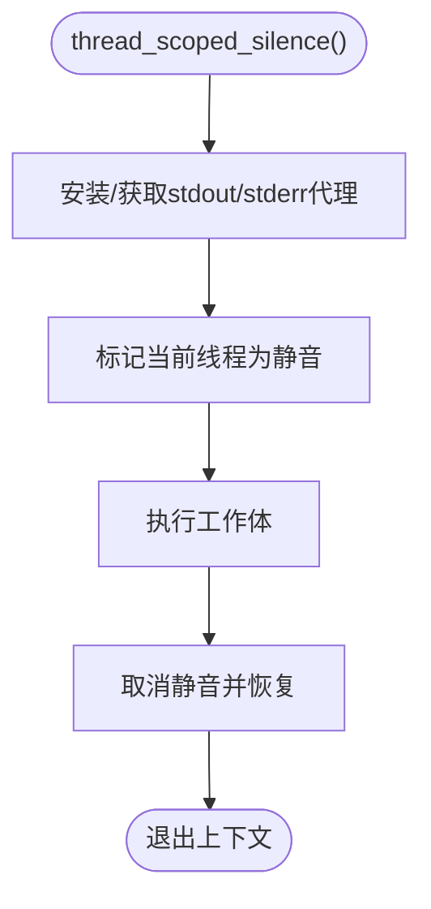
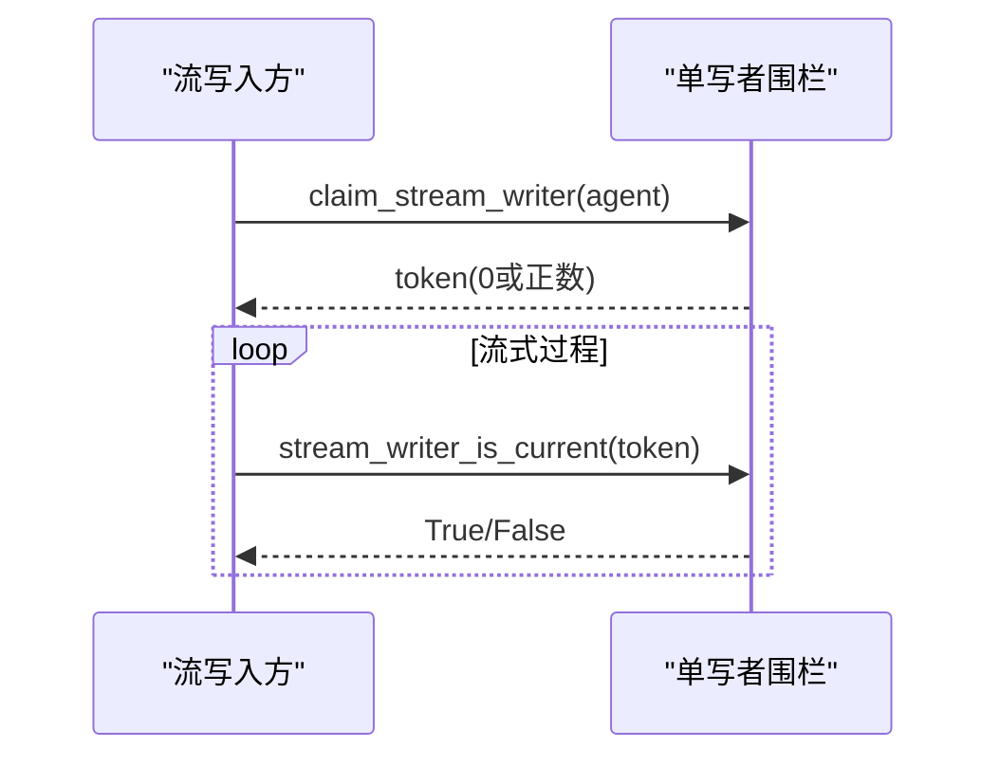
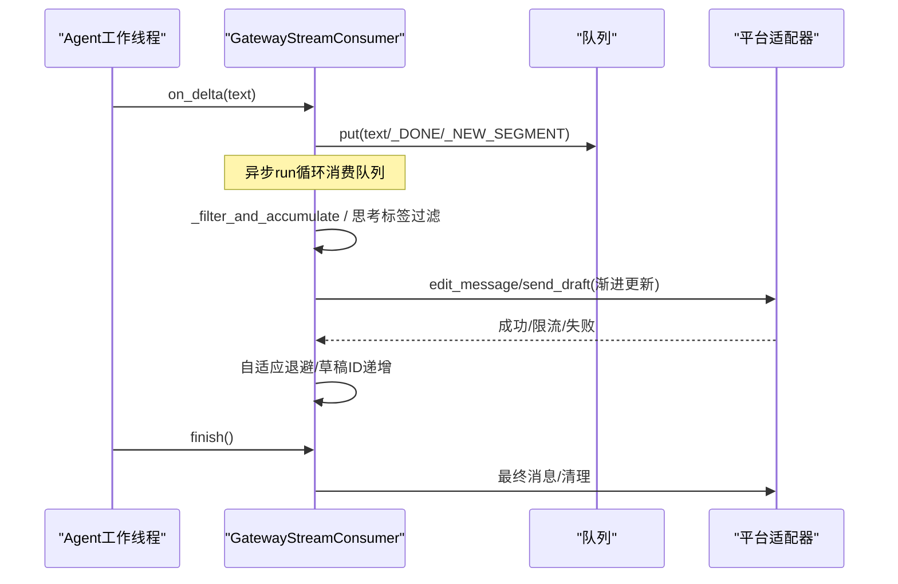
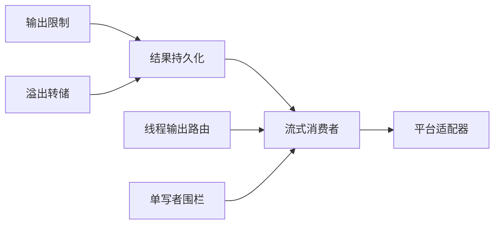

# 工具输出管理

<cite>
**本文引用的文件**
- [tools/tool_output_limits.py](file://tools/tool_output_limits.py)
- [tools/hook_output_spill.py](file://tools/hook_output_spill.py)
- [tools/tool_result_storage.py](file://tools/tool_result_storage.py)
- [tools/delegation_output_schema.py](file://tools/delegation_output_schema.py)
- [agent/thread_scoped_output.py](file://agent/thread_scoped_output.py)
- [agent/stream_single_writer.py](file://agent/stream_single_writer.py)
- [gateway/stream_consumer.py](file://gateway/stream_consumer.py)
- [hermes_cli/cli_output.py](file://hermes_cli/cli_output.py)
</cite>

## 目录
1. [简介](#简介)
2. [项目结构](#项目结构)
3. [核心组件](#核心组件)
4. [架构总览](#架构总览)
5. [详细组件分析](#详细组件分析)
6. [依赖关系分析](#依赖关系分析)
7. [性能考量](#性能考量)
8. [故障排查指南](#故障排查指南)
9. [结论](#结论)
10. [附录：配置与使用示例](#附录配置与使用示例)

## 简介
本技术文档围绕 Hermes Agent 的“工具输出管理系统”展开，聚焦以下目标：
- 输出流抽象：流式处理、缓冲管理与格式转换机制
- 输出限制控制：大小限制、时间限制与内存限制
- 结果存储机制：临时存储、持久化存储与缓存策略
- 输出钩子系统：预处理、后处理与中间件管道
- 输出格式标准化：JSON Schema 验证、数据序列化/反序列化
- 输出监控：性能统计、错误追踪与调试信息
- 输出压缩与优化：数据压缩、增量传输与分页加载
- 输出安全：敏感信息过滤、数据脱敏与访问控制
- 配置选项与使用示例

## 项目结构
与工具输出管理密切相关的模块分布在 tools、agent、gateway 与 hermes_cli 四个层次：
- tools：输出限制、溢出转储、结果持久化、委托输出 Schema 校验
- agent：线程级输出路由、单写者流围栏（避免并发写入冲突）
- gateway：流式消费者（将同步回调桥接到异步平台发送）、消息编辑与分片
- hermes_cli：CLI 输出辅助（颜色、提示等），用于交互层展示

图表来源
- [tools/tool_output_limits.py:1-111](file://tools/tool_output_limits.py#L1-L111)
- [tools/hook_output_spill.py:1-233](file://tools/hook_output_spill.py#L1-L233)
- [tools/tool_result_storage.py:1-255](file://tools/tool_result_storage.py#L1-L255)
- [tools/delegation_output_schema.py:1-152](file://tools/delegation_output_schema.py#L1-L152)
- [agent/thread_scoped_output.py:1-143](file://agent/thread_scoped_output.py#L1-L143)
- [agent/stream_single_writer.py:1-71](file://agent/stream_single_writer.py#L1-L71)
- [gateway/stream_consumer.py:1-800](file://gateway/stream_consumer.py#L1-L800)
- [hermes_cli/cli_output.py:1-78](file://hermes_cli/cli_output.py#L1-L78)

章节来源
- [tools/tool_output_limits.py:1-111](file://tools/tool_output_limits.py#L1-L111)
- [tools/hook_output_spill.py:1-233](file://tools/hook_output_spill.py#L1-L233)
- [tools/tool_result_storage.py:1-255](file://tools/tool_result_storage.py#L1-L255)
- [tools/delegation_output_schema.py:1-152](file://tools/delegation_output_schema.py#L1-L152)
- [agent/thread_scoped_output.py:1-143](file://agent/thread_scoped_output.py#L1-L143)
- [agent/stream_single_writer.py:1-71](file://agent/stream_single_writer.py#L1-L71)
- [gateway/stream_consumer.py:1-800](file://gateway/stream_consumer.py#L1-L800)
- [hermes_cli/cli_output.py:1-78](file://hermes_cli/cli_output.py#L1-L78)

## 核心组件
- 输出限制器：集中化管理工具输出的字节/行数/行长度上限，提供进程级缓存，避免重复读取配置。
- 溢出转储器：当钩子注入上下文过大时，将完整内容落盘并返回预览占位，防止污染提示缓存。
- 结果持久化：对超大工具结果进行沙箱持久化，并在上下文中以带路径的预览块替代原始内容；同时按轮次预算聚合裁剪。
- 委托输出 Schema：为子任务定义 JSON Schema 契约，提取候选 JSON、执行校验并生成单次重试消息。
- 线程输出路由：为后台工作线程提供线程级 stdout/stderr 静音，避免全局重定向影响其他线程。
- 单写者流围栏：在流式场景下确保仅有一个活跃写入者，失败时降级为无围栏继续流式。
- 流式消费者：接收同步 delta，队列缓冲、速率限制、渐进编辑消息，支持原生草稿流与多段续传。
- CLI 输出辅助：统一打印与输入提示，便于交互式界面展示。

章节来源
- [tools/tool_output_limits.py:1-111](file://tools/tool_output_limits.py#L1-L111)
- [tools/hook_output_spill.py:1-233](file://tools/hook_output_spill.py#L1-L233)
- [tools/tool_result_storage.py:1-255](file://tools/tool_result_storage.py#L1-L255)
- [tools/delegation_output_schema.py:1-152](file://tools/delegation_output_schema.py#L1-L152)
- [agent/thread_scoped_output.py:1-143](file://agent/thread_scoped_output.py#L1-L143)
- [agent/stream_single_writer.py:1-71](file://agent/stream_single_writer.py#L1-L71)
- [gateway/stream_consumer.py:1-800](file://gateway/stream_consumer.py#L1-L800)
- [hermes_cli/cli_output.py:1-78](file://hermes_cli/cli_output.py#L1-L78)

## 架构总览
下图展示了从工具执行到最终用户可见消息的端到端流程，包括限制、持久化、流式消费与平台投递。

图表来源
- [tools/tool_output_limits.py:1-111](file://tools/tool_output_limits.py#L1-L111)
- [tools/hook_output_spill.py:1-233](file://tools/hook_output_spill.py#L1-L233)
- [tools/tool_result_storage.py:1-255](file://tools/tool_result_storage.py#L1-L255)
- [agent/stream_single_writer.py:1-71](file://agent/stream_single_writer.py#L1-L71)
- [gateway/stream_consumer.py:1-800](file://gateway/stream_consumer.py#L1-L800)

## 详细组件分析

### 输出限制器（大小/行数/行长度）
- 设计要点
  - 集中化配置键 tool_output，包含 max_bytes、max_lines、max_line_length
  - 进程级缓存，首次读取后复用，避免频繁 I/O
  - 防御性解析：缺失或非法值回退至内置默认值，绝不抛错
- 复杂度
  - 读取与缓存 O(1)，每次调用直接命中缓存
- 错误处理
  - 任何异常均回退默认值，保证工具行为稳定
- 优化点
  - 可考虑热重载失效策略（当前提供测试重置接口）

图表来源
- [tools/tool_output_limits.py:48-111](file://tools/tool_output_limits.py#L48-L111)

章节来源
- [tools/tool_output_limits.py:1-111](file://tools/tool_output_limits.py#L1-L111)

### 溢出转储器（钩子上下文溢出）
- 设计要点
  - 当钩子注入上下文超过 max_chars，将完整内容写入 per-session 目录，返回 head/tail 预览与保存路径
  - 支持启用开关、预览头尾长度、自定义目录
  - 任何 I/O 异常均降级为截断+提示，不中断会话
- 复杂度
  - 字符串切片与文件写入，I/O 主导
- 错误处理
  - 捕获异常并记录日志，始终返回有界文本
- 优化点
  - 可按需调整 preview_head/tail 平衡可读性与体积

图表来源
- [tools/hook_output_spill.py:81-233](file://tools/hook_output_spill.py#L81-L233)

章节来源
- [tools/hook_output_spill.py:1-233](file://tools/hook_output_spill.py#L1-L233)

### 结果持久化（超大工具结果）
- 设计要点
  - 三层防御：工具内预截断、结果级持久化、轮次聚合预算
  - 通过 env.execute 将内容经 stdin 写入沙箱，规避命令行参数长度限制
  - 生成 <persisted-output> 包裹的预览块，包含文件大小、路径与使用说明
  - enforce_turn_budget 对整轮结果排序并优先持久化最大项直至满足预算
- 复杂度
  - 计算总大小 O(n)，排序 O(k log k)，I/O 主导
- 错误处理
  - 沙箱写入失败回退为内联截断并提示
- 优化点
  - 可结合分页读取（offset/limit）提升大文件浏览体验

图表来源
- [tools/tool_result_storage.py:82-200](file://tools/tool_result_storage.py#L82-L200)
- [tools/tool_result_storage.py:203-255](file://tools/tool_result_storage.py#L203-L255)

章节来源
- [tools/tool_result_storage.py:1-255](file://tools/tool_result_storage.py#L1-L255)

### 委托输出 Schema（结构化输出）
- 设计要点
  - 可选 per-task output_schema（JSON Schema），追加 OUTPUT CONTRACT 到子任务上下文
  - 提取候选 JSON（去除代码围栏与前后废话），执行 jsonschema 校验
  - 失败时生成一次性的重试消息，携带具体错误路径与提示
- 复杂度
  - 正则/字符串处理 O(n)，jsonschema 校验取决于 schema 复杂度
- 错误处理
  - 缺少 jsonschema 时降级为接受合法 JSON
- 优化点
  - 限制错误数量，避免重试消息过长

图表来源
- [tools/delegation_output_schema.py:29-152](file://tools/delegation_output_schema.py#L29-L152)

章节来源
- [tools/delegation_output_schema.py:1-152](file://tools/delegation_output_schema.py#L1-L152)

### 线程输出路由（线程级静音）
- 设计要点
  - 安装 sys.stdout/stderr 代理，按线程 ID 路由到 sink 或 passthrough
  - 提供 thread_scoped_silence 上下文管理器，仅对当前线程静音
- 复杂度
  - 每次 write 做线程判定与属性查找，开销极小
- 错误处理
  - 底层写入异常被吞掉，保证稳定性
- 优化点
  - 适合后台任务隔离日志，避免阻塞主线程 UI

图表来源
- [agent/thread_scoped_output.py:35-143](file://agent/thread_scoped_output.py#L35-L143)

章节来源
- [agent/thread_scoped_output.py:1-143](file://agent/thread_scoped_output.py#L1-L143)

### 单写者流围栏（避免并发写入）
- 设计要点
  - claim_stream_writer 尝试获取令牌，不可用时返回 0 表示无围栏
  - stream_writer_is_current 检查令牌是否仍有效，失败时视为有效以保证健壮性
- 复杂度
  - 方法调用 O(1)，异常路径快速返回
- 错误处理
  - 任何异常均降级为“无围栏”，不中断流式
- 优化点
  - 适用于多流并发场景，保护单一真实写入者

图表来源
- [agent/stream_single_writer.py:31-71](file://agent/stream_single_writer.py#L31-L71)

章节来源
- [agent/stream_single_writer.py:1-71](file://agent/stream_single_writer.py#L1-L71)

### 流式消费者（缓冲、限流、格式转换与平台投递）
- 设计要点
  - on_delta 接收同步 delta，入队由异步 run 循环消费
  - 缓冲累积、自适应编辑间隔、原生草稿流（draft）与编辑模式切换
  - 思考标签过滤、代码围栏闭合修复、多段续传与最终一致性校验
  - flush_pending_sync 提供同步屏障，确保关键顺序
- 复杂度
  - 队列操作 O(1)，文本处理 O(n)，平台 API 调用受限于网络与配额
- 错误处理
  - 大量异常被吞掉或降级，保障用户体验
- 优化点
  - 根据平台能力选择 draft/edit，减少冗余编辑次数

图表来源
- [gateway/stream_consumer.py:156-800](file://gateway/stream_consumer.py#L156-L800)

章节来源
- [gateway/stream_consumer.py:1-800](file://gateway/stream_consumer.py#L1-L800)

### CLI 输出辅助（交互层展示）
- 设计要点
  - 统一 print_info/success/warning/error/header 与 prompt/prompt_yes_no
  - 支持密码掩码输入，提升交互安全性与一致性
- 适用场景
  - 设置向导、配置交互、诊断输出等

章节来源
- [hermes_cli/cli_output.py:1-78](file://hermes_cli/cli_output.py#L1-L78)

## 依赖关系分析
- 组件耦合
  - 工具层依赖配置与沙箱环境；结果持久化依赖 BudgetConfig 与 env.execute
  - 代理层提供线程隔离与流围栏，降低并发风险
  - 网关层依赖平台适配器能力探测（如 supports_draft_streaming）
- 外部依赖
  - jsonschema（可选，缺失时降级）
  - 平台适配器（Telegram/Discord/Slack 等）
- 潜在环依赖
  - 各模块职责清晰，未见循环导入迹象

图表来源
- [tools/tool_output_limits.py:1-111](file://tools/tool_output_limits.py#L1-L111)
- [tools/hook_output_spill.py:1-233](file://tools/hook_output_spill.py#L1-L233)
- [tools/tool_result_storage.py:1-255](file://tools/tool_result_storage.py#L1-L255)
- [agent/thread_scoped_output.py:1-143](file://agent/thread_scoped_output.py#L1-L143)
- [agent/stream_single_writer.py:1-71](file://agent/stream_single_writer.py#L1-L71)
- [gateway/stream_consumer.py:1-800](file://gateway/stream_consumer.py#L1-L800)

章节来源
- [tools/tool_output_limits.py:1-111](file://tools/tool_output_limits.py#L1-L111)
- [tools/hook_output_spill.py:1-233](file://tools/hook_output_spill.py#L1-L233)
- [tools/tool_result_storage.py:1-255](file://tools/tool_result_storage.py#L1-L255)
- [agent/thread_scoped_output.py:1-143](file://agent/thread_scoped_output.py#L1-L143)
- [agent/stream_single_writer.py:1-71](file://agent/stream_single_writer.py#L1-L71)
- [gateway/stream_consumer.py:1-800](file://gateway/stream_consumer.py#L1-L800)

## 性能考量
- 流式缓冲与限流
  - 基于队列与自适应编辑间隔，避免平台限流导致的抖动
- 大对象处理
  - 溢出转储与结果持久化将大对象移出上下文，显著降低提示缓存压力
- I/O 优化
  - 沙箱写入通过 stdin 传递，规避命令行参数长度限制
- 内存占用
  - 进程级配置缓存减少重复解析；流式消费者维护最小必要状态
- 建议
  - 合理设置 max_bytes/max_lines/max_line_length 与 turn_budget
  - 开启草稿流以提升长响应体验，必要时回退编辑模式

[本节为通用指导，不直接分析具体文件]

## 故障排查指南
- 输出被截断
  - 检查 tool_output 配置中的 max_bytes/max_lines/max_line_length
  - 确认是否触发了结果持久化或溢出转储
- 流式卡顿或丢失
  - 检查单写者围栏是否正常获取令牌
  - 观察流式消费者的编辑频率与平台限流情况
- 持久化失败
  - 查看沙箱写入日志，确认 env.execute 可用与权限正确
- Schema 校验失败
  - 检查子任务输出是否符合 JSON Schema，关注重试消息中的错误路径
- 线程输出丢失
  - 确认是否误用全局重定向；应使用 thread_scoped_silence 隔离后台线程

章节来源
- [tools/tool_output_limits.py:48-111](file://tools/tool_output_limits.py#L48-L111)
- [tools/hook_output_spill.py:158-233](file://tools/hook_output_spill.py#L158-L233)
- [tools/tool_result_storage.py:100-200](file://tools/tool_result_storage.py#L100-L200)
- [tools/delegation_output_schema.py:105-152](file://tools/delegation_output_schema.py#L105-L152)
- [agent/stream_single_writer.py:31-71](file://agent/stream_single_writer.py#L31-L71)
- [gateway/stream_consumer.py:502-524](file://gateway/stream_consumer.py#L502-L524)

## 结论
Hermes Agent 的工具输出管理通过“限制—转储—持久化—流式消费—平台投递”的分层设计，实现了高可靠、可扩展且安全的输出处理链路。其核心优势在于：
- 可配置的硬限制与软预算，兼顾灵活性与稳定性
- 大对象的离线持久化与预览机制，避免上下文膨胀
- 流式消费的缓冲与限流，适配多平台差异
- 结构化输出契约与校验，提升下游可用性
- 线程隔离与单写者围栏，保障并发安全

[本节为总结，不直接分析具体文件]

## 附录：配置与使用示例
- 输出限制配置（config.yaml）
  - tool_output.max_bytes：终端输出上限（字符）
  - tool_output.max_lines：read_file 分页与截断上限
  - tool_output.max_line_length：每行长度上限
- 溢出转储配置（config.yaml）
  - hooks.output_spill.enabled：是否启用溢出转储
  - hooks.output_spill.max_chars：触发阈值
  - hooks.output_spill.preview_head/preview_tail：预览头尾长度
  - hooks.output_spill.directory：落盘目录（默认 HERMES_HOME/hook_outputs）
- 使用示例
  - 工具返回超大结果时，自动持久化并返回带路径的预览块
  - 钩子注入上下文过大时，落盘并返回预览占位
  - 流式响应通过 GatewayStreamConsumer 渐进编辑消息，最终一致交付
  - 委托任务通过 JSON Schema 约束输出，失败时一次性重试

章节来源
- [tools/tool_output_limits.py:20-29](file://tools/tool_output_limits.py#L20-L29)
- [tools/hook_output_spill.py:21-30](file://tools/hook_output_spill.py#L21-L30)
- [tools/tool_result_storage.py:1-23](file://tools/tool_result_storage.py#L1-L23)
- [gateway/stream_consumer.py:127-154](file://gateway/stream_consumer.py#L127-L154)
- [tools/delegation_output_schema.py:1-12](file://tools/delegation_output_schema.py#L1-L12)