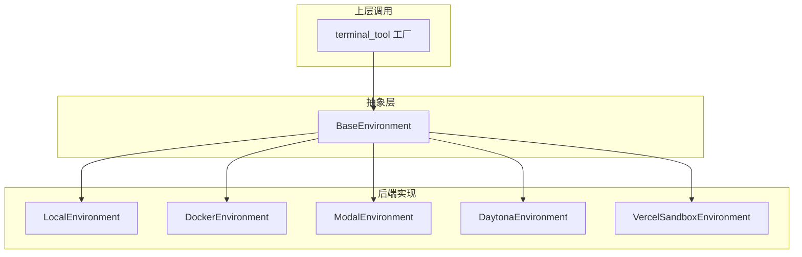
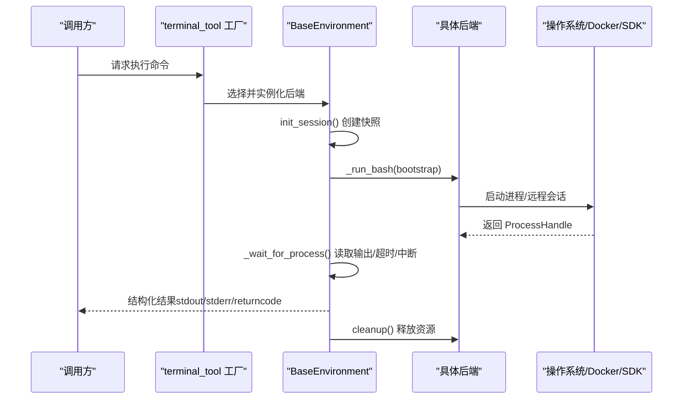
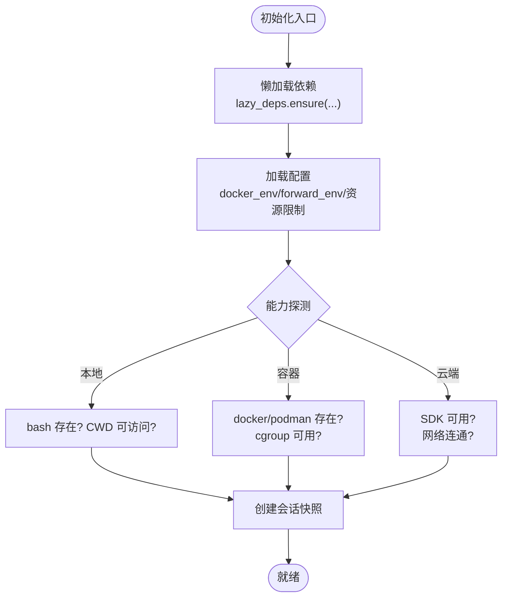
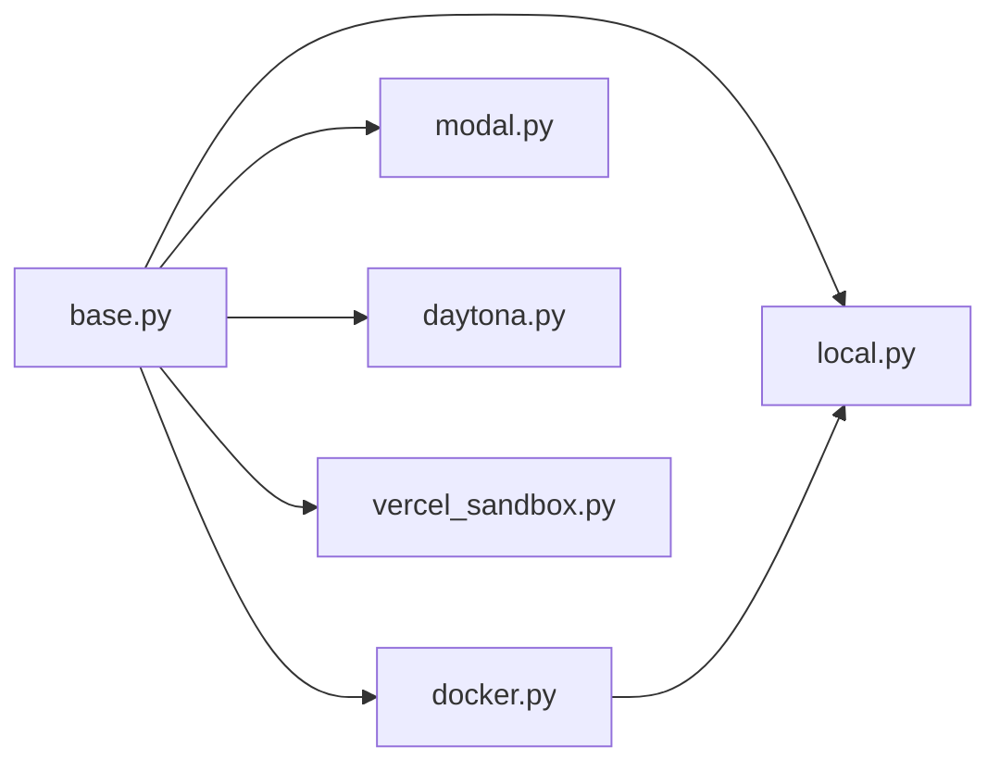

# 执行环境管理

<cite>
**本文引用的文件**
- [tools/environments/base.py](file://tools/environments/base.py)
- [tools/environments/__init__.py](file://tools/environments/__init__.py)
- [tools/environments/local.py](file://tools/environments/local.py)
- [tools/environments/docker.py](file://tools/environments/docker.py)
- [tools/environments/modal.py](file://tools/environments/modal.py)
- [tools/environments/daytona.py](file://tools/environments/daytona.py)
- [tools/environments/vercel_sandbox.py](file://tools/environments/vercel_sandbox.py)
- [tests/tools/test_terminal_error_redaction.py](file://tests/tools/test_terminal_error_redaction.py)
</cite>

## 目录
1. [简介](#简介)
2. [项目结构](#项目结构)
3. [核心组件](#核心组件)
4. [架构总览](#架构总览)
5. [详细组件分析](#详细组件分析)
6. [依赖关系分析](#依赖关系分析)
7. [性能考量](#性能考量)
8. [故障排查指南](#故障排查指南)
9. [结论](#结论)
10. [附录](#附录)

## 简介
本技术文档聚焦 Hermes Agent 的执行环境管理系统，围绕“统一抽象层 + 多后端适配”的设计展开。系统通过统一的 BaseEnvironment 接口屏蔽本地、Docker、云端（Modal、Daytona、Vercel Sandbox）等差异，提供一致的命令执行语义：每次调用以独立进程或远程会话方式运行 bash -c 命令，并在初始化时捕获 shell 快照（环境变量、函数、别名），后续命令复用该快照以提升启动速度并保持一致性。

文档涵盖：
- 环境抽象与能力检测、动态适配机制
- 多种执行后端支持（本地、容器、云端、沙箱）
- 环境初始化流程（依赖安装、配置加载、状态检查）
- 隔离机制（进程、文件系统、网络）
- 生命周期管理（启动、运行、暂停、销毁）
- 配置选项（资源限制、环境变量、挂载卷、网络设置）
- 监控与诊断（指标、日志、故障检测）
- 迁移与兼容性（版本升级、数据迁移、回滚策略）
- 环境选择建议与最佳实践

## 项目结构
执行环境相关代码集中在 tools/environments 目录下，采用“抽象基类 + 多实现”的模块化组织：
- base.py：定义统一接口、通用执行流、输出收集、CWD 标记、进程句柄适配等
- local.py：本地环境实现，包含路径转换、安全过滤、bash 查找与子进程环境构建
- docker.py：Docker/Podman 容器环境，含安全加固、资源限制、出站代理集成、孤儿容器回收
- modal.py / daytona.py / vercel_sandbox.py：云端/沙箱后端，封装 SDK 调用，暴露与 base 一致的 ProcessHandle 接口
- __init__.py：对外仅导出 BaseEnvironment，终端工具通过工厂按配置选择具体后端

**图表来源**
- [tools/environments/base.py:553-619](file://tools/environments/base.py#L553-L619)
- [tools/environments/__init__.py:1-15](file://tools/environments/__init__.py#L1-L15)

**章节来源**
- [tools/environments/__init__.py:1-15](file://tools/environments/__init__.py#L1-L15)

## 核心组件
- BaseEnvironment：统一抽象，提供 execute() 流程、init_session() 快照创建、_run_bash() 抽象方法、cleanup() 资源释放；内置中断处理、超时控制、CWD 持久化、输出截断与溢出转储。
- LocalEnvironment：本地 bash 执行，负责 Windows/Git Bash 路径兼容、子进程环境清理（敏感变量剥离）、安全 CWD 回退、bash 可执行体发现。
- DockerEnvironment：容器化执行，安全加固（cap-drop ALL、no-new-privileges、tmpfs 限制）、可选 cgroup 资源限制（CPU/内存/PID）、出站代理强制（iron-proxy）与 CA 注入、镜像入口点探测（s6-overlay）。
- ModalEnvironment/DaytonaEnvironment/VercelSandboxEnvironment：云端/沙箱后端，使用 _ThreadedProcessHandle 将阻塞式 SDK 调用包装为 ProcessHandle 协议，支持任务级快照与文件同步。

关键特性：
- 进程隔离：每个命令以独立进程或远程会话执行
- 文件系统隔离：容器 tmpfs、工作目录隔离、按需挂载
- 网络隔离：Docker 出站代理强制、NO_PROXY 白名单、CA 注入
- 安全环境：严格的环境变量过滤与密钥剥离
- 快照与 CWD：登录 shell 快照 + 原子写入，跨命令保持上下文

**章节来源**
- [tools/environments/base.py:553-782](file://tools/environments/base.py#L553-L782)
- [tools/environments/local.py:574-719](file://tools/environments/local.py#L574-L719)
- [tools/environments/docker.py:322-395](file://tools/environments/docker.py#L322-L395)
- [tools/environments/modal.py:164-200](file://tools/environments/modal.py#L164-L200)
- [tools/environments/daytona.py:30-152](file://tools/environments/daytona.py#L30-L152)
- [tools/environments/vercel_sandbox.py:1-76](file://tools/environments/vercel_sandbox.py#L1-L76)

## 架构总览
下图展示从 terminal_tool 到各后端的调用链与数据流，包括快照创建、命令执行、输出收集与清理。

**图表来源**
- [tools/environments/base.py:660-782](file://tools/environments/base.py#L660-L782)
- [tools/environments/base.py:382-467](file://tools/environments/base.py#L382-L467)
- [tools/environments/docker.py:772-800](file://tools/environments/docker.py#L772-L800)

## 详细组件分析

### 抽象层：BaseEnvironment
- 统一接口：_run_bash() 由子类实现；cleanup() 释放后端资源
- 会话快照：init_session() 在首次执行前捕获登录 shell 的 env、函数、别名，原子写入快照文件，避免并发竞争
- 命令执行：execute() 封装了快照 source、CWD 恢复、中断与超时处理
- 输出收集：_BoundedOutputCollector 保留头尾窗口，溢出时转储至 spill_path，防止内存膨胀
- 进程句柄：ProcessHandle 协议统一 subprocess.Popen 与 SDK 异步调用的外观；_ThreadedProcessHandle 将阻塞式 SDK 调用包装为线程内执行，暴露 poll/kill/wait/stdout/returncode

复杂度与性能：
- 快照创建一次，后续命令复用，显著降低冷启动开销
- 输出收集 O(n) 追加，渲染时 O(k) 截取，k 受 max_chars 限制
- 中断与心跳回调通过线程局部存储传递，避免全局状态污染

错误处理：
- EnvironmentConnectionError 表示基础设施不可达（SSH/Docker/远端服务），不视为命令失败，便于重试与降级
- 快照创建失败时自动回退为非登录 shell 模式，保证基本可用性

**章节来源**
- [tools/environments/base.py:55-79](file://tools/environments/base.py#L55-L79)
- [tools/environments/base.py:81-231](file://tools/environments/base.py#L81-L231)
- [tools/environments/base.py:382-467](file://tools/environments/base.py#L382-L467)
- [tools/environments/base.py:660-782](file://tools/environments/base.py#L660-L782)

### 本地环境：LocalEnvironment
- 路径兼容：Windows 下 MSYS/Git Bash 路径双向转换，确保 cd 与 Popen(cwd=...) 正确解析
- 安全环境：hermes_subprocess_env()/build_subprocess_env() 统一剥离敏感变量（Tier 1/Tier 2），注入 HERMES_HOME 覆盖，剔除活动虚拟环境标记，注入会话上下文变量
- bash 发现：优先使用便携 Git bash，回退 PATH 与已知位置，校验可执行性
- CWD 回退：当配置的 cwd 不可访问时，向上查找可用父目录，最终回退到临时目录

安全要点：
- 严格剥离网关令牌、GitHub 认证、远程计算凭据等 Tier 1 密钥
- 动态内部密钥（AUXILIARY_*、GATEWAY_RELAY_*）一律剥离
- 会话上下文变量在并发宿主中避免跨会话泄漏

**章节来源**
- [tools/environments/local.py:25-138](file://tools/environments/local.py#L25-L138)
- [tools/environments/local.py:140-198](file://tools/environments/local.py#L140-L198)
- [tools/environments/local.py:200-337](file://tools/environments/local.py#L200-L337)
- [tools/environments/local.py:352-513](file://tools/environments/local.py#L352-L513)
- [tools/environments/local.py:574-719](file://tools/environments/local.py#L574-L719)
- [tools/environments/local.py:722-800](file://tools/environments/local.py#L722-L800)

### 容器环境：DockerEnvironment
- 安全加固：默认 cap-drop ALL，仅添加必要 DAC_OVERRIDE/CHOWN/FOWNER，启用 no-new-privileges，/tmp 与 /var/tmp 使用受限 tmpfs
- 资源限制：探测 cgroup 控制器可用性，按需启用 --cpus/--memory/--pids-limit；/dev/shm 默认放大以避免共享内存不足
- 出站代理：集成 iron-proxy，强制 HTTPS/HTTP 代理与 NO_PROXY 白名单，注入 CA 证书，合并 NODE_OPTIONS 以强制 OpenSSL CA 验证
- 镜像入口点：检测 s6-overlay 入口点，调整 /run 挂载权限与 --init 行为
- 孤儿回收：reap_orphan_containers() 定期清理已退出且超时的 hermes 标签容器，避免资源泄露

网络与隔离：
- 通过 --add-host 与 host-gateway 使容器可达宿主机代理
- 严格禁止用户通过 docker_extra_args 覆盖关键代理/网络参数，否则报错或警告

**章节来源**
- [tools/environments/docker.py:322-395](file://tools/environments/docker.py#L322-L395)
- [tools/environments/docker.py:397-555](file://tools/environments/docker.py#L397-L555)
- [tools/environments/docker.py:638-696](file://tools/environments/docker.py#L638-L696)
- [tools/environments/docker.py:720-769](file://tools/environments/docker.py#L720-L769)
- [tools/environments/docker.py:148-240](file://tools/environments/docker.py#L148-L240)
- [tools/environments/docker.py:772-800](file://tools/environments/docker.py#L772-L800)

### 云端/沙箱后端：Modal、Daytona、Vercel Sandbox
- ModalEnvironment：基于 Modal SDK，支持持久化快照（im- 前缀或镜像名），异步执行通过 _AsyncWorker 调度，文件同步通过 FileSyncManager
- DaytonaEnvironment：基于 Daytona SDK，支持 CPU/内存/磁盘资源声明，持久化沙箱（停止/恢复），文件上传下载批量优化
- VercelSandboxEnvironment：基于 Vercel SDK，最小运行超时与重试退避，快照存储于 HERMES_HOME，支持文件同步

共性：
- 均实现 BaseEnvironment 接口，使用 _ThreadedProcessHandle 暴露统一进程外观
- 支持任务级快照与文件同步，提升冷启动与重复执行效率
- 对 SDK 异常进行幂等重试与降级处理

**章节来源**
- [tools/environments/modal.py:164-200](file://tools/environments/modal.py#L164-L200)
- [tools/environments/daytona.py:30-152](file://tools/environments/daytona.py#L30-L152)
- [tools/environments/vercel_sandbox.py:1-76](file://tools/environments/vercel_sandbox.py#L1-L76)

### 环境初始化流程
- 依赖安装：各后端按需懒加载 SDK（modal/daytona/vercel），通过 lazy_deps.ensure 安装
- 配置加载：Docker 后端读取 .env 与配置，解析 forward_env/env 字典，校验键值合法性
- 状态检查：Docker 后端预检 docker/podman 可执行与版本；本地环境校验 bash 可执行与 CWD 可访问性；云端后端探测 SDK 与网络连通性

**图表来源**
- [tools/environments/modal.py:83-124](file://tools/environments/modal.py#L83-L124)
- [tools/environments/daytona.py:54-152](file://tools/environments/daytona.py#L54-L152)
- [tools/environments/vercel_sandbox.py:47-76](file://tools/environments/vercel_sandbox.py#L47-L76)
- [tools/environments/docker.py:277-319](file://tools/environments/docker.py#L277-L319)
- [tools/environments/docker.py:720-769](file://tools/environments/docker.py#L720-L769)
- [tools/environments/base.py:660-782](file://tools/environments/base.py#L660-L782)

**章节来源**
- [tools/environments/base.py:660-782](file://tools/environments/base.py#L660-L782)
- [tools/environments/docker.py:277-319](file://tools/environments/docker.py#L277-L319)
- [tools/environments/local.py:722-800](file://tools/environments/local.py#L722-L800)

### 隔离机制
- 进程隔离：每个命令以独立进程或远程会话执行，避免状态共享
- 文件系统隔离：容器使用 tmpfs 限制 /tmp 与 /var/tmp；本地环境通过安全 CWD 回退与工作目录隔离
- 网络隔离：Docker 出站代理强制，NO_PROXY 白名单，CA 注入；云端后端通过 SDK 提供的沙箱网络策略

**章节来源**
- [tools/environments/docker.py:322-395](file://tools/environments/docker.py#L322-L395)
- [tools/environments/docker.py:397-555](file://tools/environments/docker.py#L397-L555)
- [tools/environments/local.py:140-198](file://tools/environments/local.py#L140-L198)

### 生命周期管理
- 启动：init_session() 创建快照，后端完成依赖与配置加载
- 运行：execute() 封装命令执行，支持前台/后台模式，超时与中断处理
- 暂停：云端后端支持沙箱停止/恢复（Daytona），本地/容器无显式暂停
- 销毁：cleanup() 释放容器/连接/进程；Docker 后端支持孤儿容器回收

**章节来源**
- [tools/environments/base.py:617-619](file://tools/environments/base.py#L617-L619)
- [tools/environments/daytona.py:89-152](file://tools/environments/daytona.py#L89-L152)
- [tools/environments/docker.py:148-240](file://tools/environments/docker.py#L148-L240)

### 配置选项
- 资源限制：Docker 后端支持 --cpus/--memory/--pids-limit（需 cgroup 支持）；Daytona 支持 cpu/memory/disk 声明
- 环境变量：docker_env/forward_env 白名单校验；本地环境严格剥离敏感变量
- 挂载卷：Docker 后端支持 bind mount 与 tmpfs；云端后端通过 FileSyncManager 同步文件
- 网络设置：Docker 出站代理强制，NO_PROXY 白名单，CA 注入；云端后端依赖 SDK 网络策略

**章节来源**
- [tools/environments/docker.py:322-395](file://tools/environments/docker.py#L322-L395)
- [tools/environments/docker.py:397-555](file://tools/environments/docker.py#L397-L555)
- [tools/environments/daytona.py:40-84](file://tools/environments/daytona.py#L40-L84)
- [tools/environments/local.py:574-719](file://tools/environments/local.py#L574-L719)

### 监控与诊断
- 性能指标：输出收集器记录 total_chars/buffered_chars，溢出时转储 spill_path 以便回溯
- 日志收集：各后端记录关键事件（快照创建、容器回收、代理配置、错误信息）
- 故障检测：EnvironmentConnectionError 区分基础设施故障与命令失败；Docker 后端探测 cgroup 与入口点；云端后端重试与降级

**章节来源**
- [tools/environments/base.py:81-231](file://tools/environments/base.py#L81-L231)
- [tools/environments/docker.py:148-240](file://tools/environments/docker.py#L148-L240)
- [tools/environments/docker.py:720-769](file://tools/environments/docker.py#L720-L769)

### 迁移与兼容性
- 版本升级：Docker 后端支持 podman 作为 docker 的替代品；云端后端懒加载 SDK，兼容不同版本
- 数据迁移：云端后端支持快照命名空间迁移（Modal 直接快照键迁移）
- 回滚策略：Docker 孤儿回收避免残留；云端后端支持从快照恢复，失败时回退到非登录 shell 或禁用后端

**章节来源**
- [tools/environments/modal.py:46-80](file://tools/environments/modal.py#L46-L80)
- [tools/environments/docker.py:277-319](file://tools/environments/docker.py#L277-L319)
- [tools/environments/base.py:750-782](file://tools/environments/base.py#L750-L782)

### 环境选择建议与最佳实践
- 本地环境：适合开发调试与快速迭代，注意 CWD 可访问性与 bash 路径兼容
- Docker 环境：适合需要强隔离与资源限制的场景，启用出站代理与 CA 注入确保安全
- 云端/沙箱：适合高隔离、弹性伸缩与团队协作，利用快照与文件同步提升效率
- 最佳实践：
  - 明确资源限制，避免过度分配
  - 启用出站代理强制，防止数据外泄
  - 使用快照减少冷启动时间
  - 定期清理孤儿容器与临时文件

[本节为概念性内容，无需引用具体文件]

## 依赖关系分析
- 模块耦合：base.py 被所有后端继承；local.py 提供安全环境与路径工具；docker.py 依赖 local.py 的安全过滤
- 外部依赖：Docker/Podman CLI、Modal/Daytona/Vercel SDK、iron-proxy（出站代理）
- 循环依赖：无明显循环依赖，模块职责清晰

**图表来源**
- [tools/environments/base.py:553-619](file://tools/environments/base.py#L553-L619)
- [tools/environments/docker.py:21-29](file://tools/environments/docker.py#L21-L29)

**章节来源**
- [tools/environments/base.py:553-619](file://tools/environments/base.py#L553-L619)
- [tools/environments/docker.py:21-29](file://tools/environments/docker.py#L21-L29)

## 性能考量
- 快照复用：init_session() 仅执行一次，后续命令通过 source 快照避免重复加载
- 输出截断：_BoundedOutputCollector 限制内存占用，溢出时转储磁盘
- 资源限制：Docker 后端启用 cgroup 限制，避免资源争用
- 网络优化：Docker 出站代理合并 NODE_OPTIONS，减少 TLS 握手开销
- 并发安全：线程局部存储传递活动回调，避免全局状态竞争

[本节为通用性能讨论，无需引用具体文件]

## 故障排查指南
- 常见问题：
  - Docker 不可用：检查 docker/podman 是否在 PATH 或已知路径，确认版本与权限
  - 出站代理失败：检查 iron-proxy 是否配置并运行，CA 证书是否存在
  - 云端 SDK 导入失败：确认 lazy_deps.ensure 成功，网络可达
  - 本地 bash 不可用：检查 Git Bash 路径与 ASLR 设置
- 诊断步骤：
  - 查看日志中的 EnvironmentConnectionError 与重试提示
  - 检查孤儿容器与临时文件
  - 验证快照文件与 CWD 文件完整性
- 参考测试：终端错误脱敏与状态码验证

**章节来源**
- [tests/tools/test_terminal_error_redaction.py:13-39](file://tests/tools/test_terminal_error_redaction.py#L13-L39)
- [tests/tools/test_terminal_error_redaction.py:47-154](file://tests/tools/test_terminal_error_redaction.py#L47-L154)
- [tools/environments/docker.py:772-800](file://tools/environments/docker.py#L772-L800)

## 结论
Hermes Agent 的执行环境管理系统通过统一抽象层与多后端适配，实现了灵活、安全、可扩展的命令执行框架。其设计强调：
- 一致性：BaseEnvironment 提供统一接口与执行流
- 安全性：严格的环境变量过滤、出站代理强制、容器安全加固
- 可靠性：快照复用、孤儿回收、重试与降级
- 可观测性：输出截断与转储、详细日志与故障检测

在实际使用中，应根据场景选择合适的后端，并遵循最佳实践以确保性能与安全。

[本节为总结性内容，无需引用具体文件]

## 附录
- 术语表：
  - 快照：登录 shell 的环境、函数、别名集合
  - 孤儿容器：未正常清理的 Docker 容器
  - 出站代理：限制容器外网访问的代理服务器
- 相关文件索引：
  - 抽象层：tools/environments/base.py
  - 本地环境：tools/environments/local.py
  - 容器环境：tools/environments/docker.py
  - 云端环境：tools/environments/modal.py, daytona.py, vercel_sandbox.py

[本节为索引性内容，无需引用具体文件]