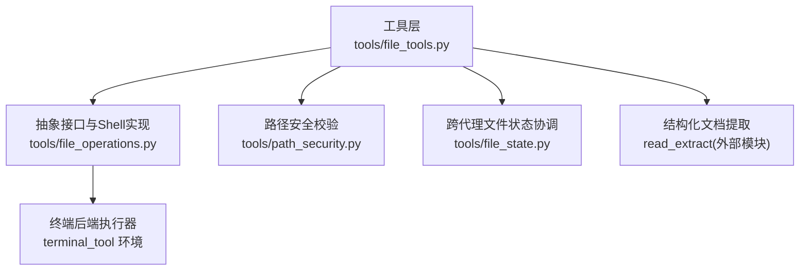
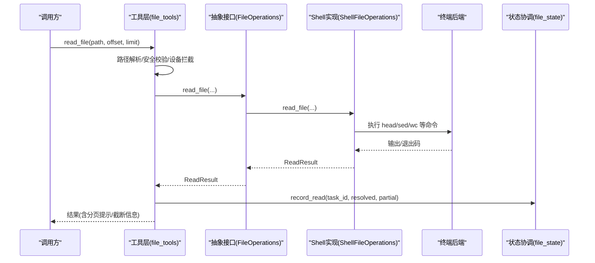
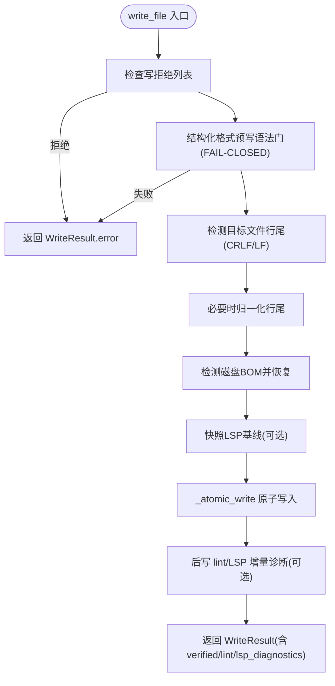
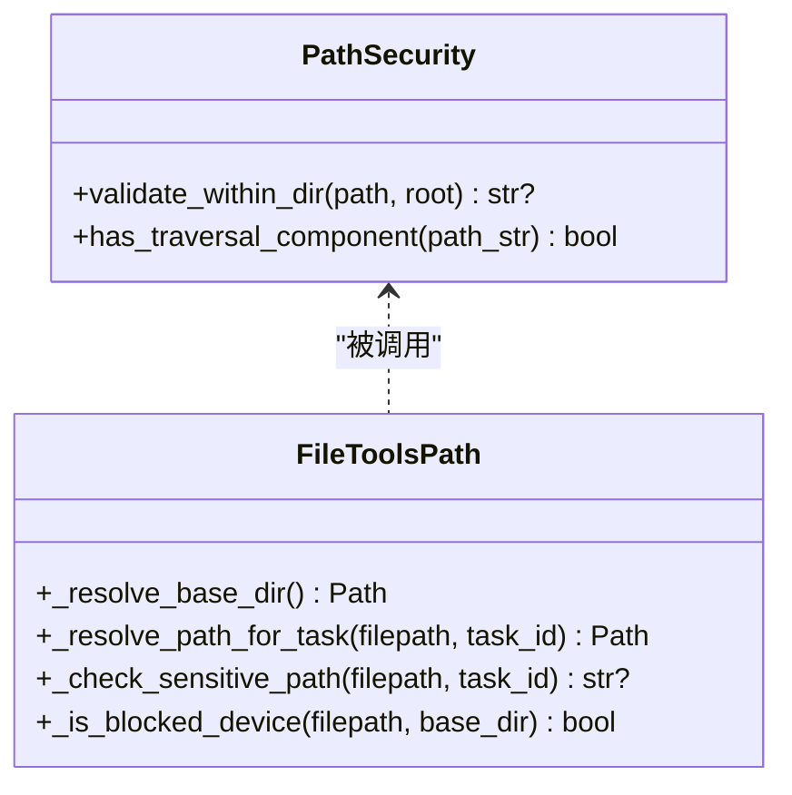
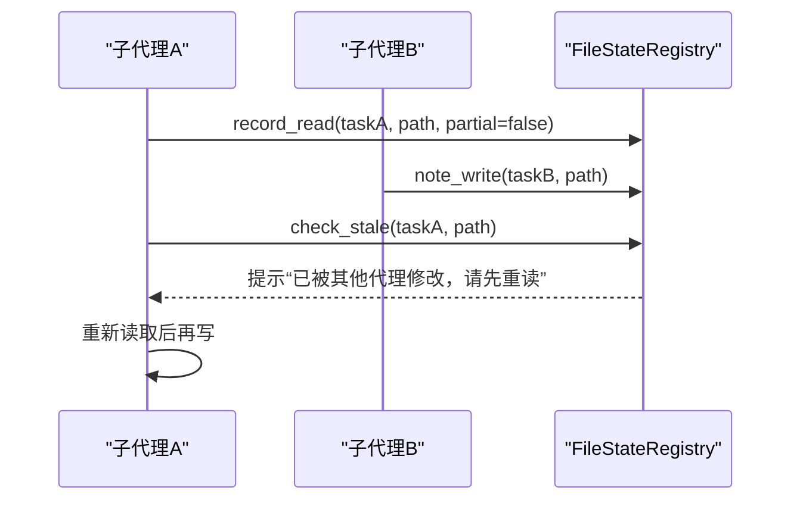
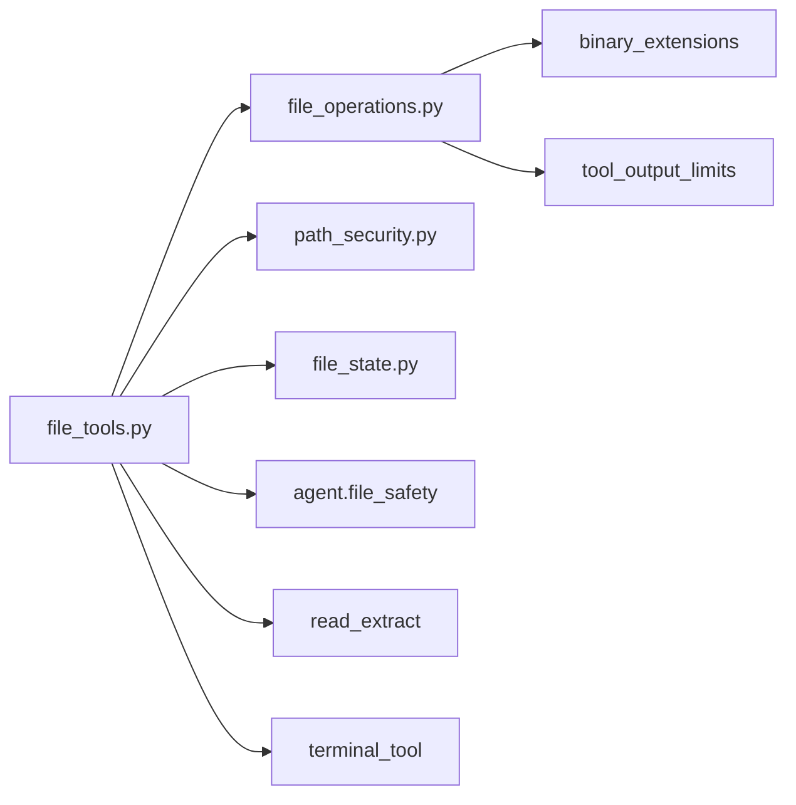

# 文件操作工具

<cite>
**本文引用的文件**
- [tools/file_operations.py](file://tools/file_operations.py)
- [tools/file_tools.py](file://tools/file_tools.py)
- [tools/path_security.py](file://tools/path_security.py)
- [tools/file_state.py](file://tools/file_state.py)
</cite>

## 目录
1. [简介](#简介)
2. [项目结构](#项目结构)
3. [核心组件](#核心组件)
4. [架构总览](#架构总览)
5. [详细组件分析](#详细组件分析)
6. [依赖关系分析](#依赖关系分析)
7. [性能考量](#性能考量)
8. [故障排查指南](#故障排查指南)
9. [结论](#结论)
10. [附录：最佳实践与示例](#附录最佳实践与示例)

## 简介
本技术文档面向 Hermes Agent 的文件操作工具，系统性阐述文件系统抽象层设计、路径规范化与安全校验机制、原子性写入与冲突处理、多类型文件读写/复制/移动/删除/批量处理、大文件流式处理与内存管理、文件格式支持（文本、二进制、压缩与特殊格式）、文件同步（增量、冲突检测、版本管理）、文件系统监控（变更监听、事件通知、状态同步）及安全策略（路径遍历防护、权限验证、恶意文件检测），并提供实用示例与最佳实践。

## 项目结构
Hermes Agent 的文件操作由“工具层 + 抽象实现 + 安全与状态协调”三部分构成：
- 工具层：对外暴露的 LLM 工具接口，负责参数校验、路径解析、安全拦截、结果格式化与错误脱敏。
- 抽象实现：跨终端后端的统一文件操作接口与基于 Shell 的具体实现，屏蔽本地/Docker/SSH/Modal/Daytona 等差异。
- 安全与状态：路径安全校验、写拒绝清单、受保护指令文件审批、跨代理并发状态跟踪与锁。

图表来源
- [tools/file_tools.py:1517-1599](file://tools/file_tools.py#L1517-L1599)
- [tools/file_operations.py:808-1090](file://tools/file_operations.py#L808-L1090)
- [tools/path_security.py:15-44](file://tools/path_security.py#L15-L44)
- [tools/file_state.py:59-90](file://tools/file_state.py#L59-L90)

章节来源
- [tools/file_tools.py:1517-1599](file://tools/file_tools.py#L1517-L1599)
- [tools/file_operations.py:808-1090](file://tools/file_operations.py#L808-L1090)
- [tools/path_security.py:15-44](file://tools/path_security.py#L15-L44)
- [tools/file_state.py:59-90](file://tools/file_state.py#L59-L90)

## 核心组件
- 抽象接口与结果模型：定义统一的读/写/补丁/搜索/删除/移动接口，以及 ReadResult/WriteResult/PatchResult/SearchResult/LintResult/ExecuteResult 等数据类，保证跨后端一致性与可序列化输出。
- ShellFileOperations：基于 shell 命令的统一实现，封装原子写入、行尾/BOM 保留、二进制/图像识别、分页读取、搜索与删除/移动等能力。
- 工具层 file_tools：路径解析、工作区基线、设备/敏感路径拦截、受保护指令文件审批、结构化文档提取、读缓存与去重、补丁失败计数提示、LSP 诊断集成。
- path_security：提供 within-dir 校验与遍历组件检测，防止路径逃逸。
- file_state：进程级单例 FileStateRegistry，记录每任务读时间戳与最后写入者，提供 per-path 锁与 stale 检查，避免并发子代理覆盖。

章节来源
- [tools/file_operations.py:158-353](file://tools/file_operations.py#L158-L353)
- [tools/file_operations.py:808-1090](file://tools/file_operations.py#L808-L1090)
- [tools/file_tools.py:1517-1599](file://tools/file_tools.py#L1517-L1599)
- [tools/path_security.py:15-44](file://tools/path_security.py#L15-L44)
- [tools/file_state.py:59-216](file://tools/file_state.py#L59-L216)

## 架构总览
文件操作从工具层进入，经路径解析与安全校验后，交由抽象接口选择具体实现；Shell 实现通过终端后端执行命令完成 I/O，并返回标准化结果。安全与状态模块在关键路径上提供防护与并发一致性保障。

图表来源
- [tools/file_tools.py:1517-1599](file://tools/file_tools.py#L1517-L1599)
- [tools/file_operations.py:1148-1243](file://tools/file_operations.py#L1148-L1243)
- [tools/file_state.py:93-112](file://tools/file_state.py#L93-L112)

## 详细组件分析

### 文件系统抽象层与 Shell 实现
- 抽象接口 FileOperations：统一 read_file/read_file_raw/read_file_bytes/write_file/patch_replace/patch_v4a/delete_file/delete_path/move_file/search 等能力，屏蔽后端差异。
- ShellFileOperations：
  - 原子写入 _atomic_write：使用临时文件+同盘 rename，确保写入原子性；自动创建父目录；尝试保留原文件模式；失败时清理临时文件；内容通过 stdin 管道传输，规避 ARG_MAX。
  - 行尾/BOM 保留：检测并保留 CRLF/LF 与 UTF-8 BOM，避免跨平台改写导致字节签名变化。
  - 二进制/图像识别：扩展名优先，辅以采样内容判断；图片走视觉工具而非内联显示。
  - 分页读取：sed 按行范围读取，wc 统计行数，BOM 剥离，提示继续偏移。
  - 删除/移动：跨平台 Python 片段执行，兼容 Windows 无 rm 场景；移动前进行写拒绝检查。
  - 搜索：rg/grep 输出清洗、上下文解析、超时标记、结果限流与去重。

图表来源
- [tools/file_operations.py:1449-1599](file://tools/file_operations.py#L1449-L1599)
- [tools/file_operations.py:1004-1090](file://tools/file_operations.py#L1004-L1090)

章节来源
- [tools/file_operations.py:450-514](file://tools/file_operations.py#L450-L514)
- [tools/file_operations.py:808-1090](file://tools/file_operations.py#L808-L1090)
- [tools/file_operations.py:1148-1243](file://tools/file_operations.py#L1148-L1243)
- [tools/file_operations.py:1297-1366](file://tools/file_operations.py#L1297-L1366)
- [tools/file_operations.py:1368-1443](file://tools/file_operations.py#L1368-L1443)
- [tools/file_operations.py:1449-1599](file://tools/file_operations.py#L1449-L1599)

### 路径规范化与工作区基线
- 路径解析：
  - 支持 ~ 展开、容器路径与主机路径区分、Git Bash/MSYS 路径转换、Windows 驱动路径适配。
  - 权威工作区基线：优先会话记录的 cwd，其次注册的任务 cwd 覆盖，再回退到绝对且非哨兵的 TERMINAL_CWD，最终回退进程 cwd。
  - 相对路径警告：当相对路径解析出工作区外时给出明确提示，避免 worktree 误写。
- 路径安全：
  - validate_within_dir：确保路径在允许根目录下，防止路径逃逸。
  - has_traversal_component：快速检测 .. 遍历组件。
  - 设备/敏感路径拦截：阻止 /dev/*、/proc/* 等可能挂起或泄露的路径；拒绝系统敏感目录与 Docker socket 等。

图表来源
- [tools/path_security.py:15-44](file://tools/path_security.py#L15-L44)
- [tools/file_tools.py:307-400](file://tools/file_tools.py#L307-L400)
- [tools/file_tools.py:516-589](file://tools/file_tools.py#L516-L589)
- [tools/file_tools.py:676-703](file://tools/file_tools.py#L676-L703)

章节来源
- [tools/file_tools.py:307-400](file://tools/file_tools.py#L307-L400)
- [tools/file_tools.py:516-589](file://tools/file_tools.py#L516-L589)
- [tools/path_security.py:15-44](file://tools/path_security.py#L15-L44)

### 原子性写入、备份恢复与冲突解决
- 原子性：_atomic_write 使用 mktemp + mv 的同盘原子替换，失败时清理临时文件，不污染用户数据。
- 备份恢复：当前实现未内置显式备份；可通过外层事务包装（先 cp 备份，再原子写，失败则回滚）实现。
- 冲突解决：
  - file_state 记录每个任务的读时间戳与最后写入者，写前 check_stale 检测外部修改或子代理覆盖风险，并给出重读提示。
  - 对同一路径提供 per-path 锁，串行化读→改→写临界区。
  - 工具层维护补丁失败计数，重复失败时升级提示（常见于视图陈旧或 old_string 歧义）。

图表来源
- [tools/file_state.py:93-216](file://tools/file_state.py#L93-L216)
- [tools/file_tools.py:1082-1134](file://tools/file_tools.py#L1082-L1134)

章节来源
- [tools/file_operations.py:1004-1090](file://tools/file_operations.py#L1004-L1090)
- [tools/file_state.py:59-216](file://tools/file_state.py#L59-L216)
- [tools/file_tools.py:1082-1134](file://tools/file_tools.py#L1082-L1134)

### 文件操作类型与批量处理
- 读：read_file（分页、行号、BOM 剥离、二进制/图像识别）、read_file_raw（完整文本）、read_file_bytes（base64 二进制）。
- 写：write_file（原子写入、行尾/BOM 保留、结构化格式 FAIL-CLOSED 预检、lint/LSP 诊断）。
- 补丁：patch_replace/patch_v4a（模糊匹配与 V4A 格式），结合 LSP 行位移映射生成增量诊断。
- 删除/移动：delete_file/delete_path（跨平台 Python 片段）、move_file（mv）。
- 搜索：search（rg/grep 输出清洗、上下文解析、超时与限制、结果去重与密度化）。
- 批量：通过循环调用上述 API，结合 file_state 的 writes_since 汇总子代理变更提醒。

章节来源
- [tools/file_operations.py:1148-1243](file://tools/file_operations.py#L1148-L1243)
- [tools/file_operations.py:1297-1366](file://tools/file_operations.py#L1297-L1366)
- [tools/file_operations.py:1368-1443](file://tools/file_operations.py#L1368-L1443)
- [tools/file_operations.py:1449-1599](file://tools/file_operations.py#L1449-L1599)
- [tools/file_state.py:218-243](file://tools/file_state.py#L218-L243)

### 大文件处理优化：流式、内存与进度
- 流式处理：
  - 写入通过 stdin 管道传输，避免命令行参数长度限制。
  - 读取使用 sed 分页与 head 采样，控制单次 I/O 量。
- 内存管理：
  - read_file 限制最大行数与行长，read_file_tool 支持字符预算裁剪，避免超大响应。
  - 结构化文档提取有大小上限，失败时给出明确原因。
- 进度跟踪：
  - 搜索结果支持 limit/offset 分页与 total_count/truncated 标志。
  - 读操作返回 total_lines 与 truncated/hint，便于客户端展示进度。

章节来源
- [tools/file_operations.py:724-766](file://tools/file_operations.py#L724-L766)
- [tools/file_operations.py:1148-1243](file://tools/file_operations.py#L1148-L1243)
- [tools/file_tools.py:52-86](file://tools/file_tools.py#L52-L86)
- [tools/file_tools.py:1517-1599](file://tools/file_tools.py#L1517-L1599)

### 文件格式支持：文本、二进制、压缩与特殊格式
- 文本：UTF-8 BOM 剥离与恢复、CRLF/LF 保留。
- 二进制：扩展名判定 + 内容采样；read_file_bytes 以 base64 安全传输。
- 图片：自动识别并重定向至视觉工具。
- 结构化文档：read_file_tool 尝试提取 .docx/.xlsx/.ipynb 等，失败时给出具体错误。
- 配置/脚本：JSON/YAML/TOML 预写语法门；Python/JS/TS/Go/Rust 等通过 shell linter 或 LSP 诊断。

章节来源
- [tools/file_operations.py:119-147](file://tools/file_operations.py#L119-L147)
- [tools/file_operations.py:890-923](file://tools/file_operations.py#L890-L923)
- [tools/file_operations.py:1297-1366](file://tools/file_operations.py#L1297-L1366)
- [tools/file_tools.py:1517-1599](file://tools/file_tools.py#L1517-L1599)

### 文件同步：增量、冲突检测与版本管理
- 增量：基于 mtime 与 last_writer 时间戳，detect 外部修改与子代理覆盖，提示重读。
- 冲突检测：check_stale 报告三类情况（兄弟代理修改、外部修改、从未读取），配合 per-path 锁减少竞争。
- 版本管理：当前未内置版本库集成；建议上层结合 git 提交/分支策略，或在 write 前后记录 diff 与元数据。

章节来源
- [tools/file_state.py:142-216](file://tools/file_state.py#L142-L216)
- [tools/file_state.py:59-90](file://tools/file_state.py#L59-L90)

### 文件系统监控：变更监听、事件通知与状态同步
- 变更监听：通过 file_state 的 record_read/note_write/check_stale 追踪最近读写与外部变更。
- 事件通知：可在上层订阅 writes_since 结果，向父代理或网关推送变更摘要。
- 状态同步：per-path 锁确保读→改→写的临界区串行化，避免竞态。

章节来源
- [tools/file_state.py:218-243](file://tools/file_state.py#L218-L243)
- [tools/file_state.py:59-90](file://tools/file_state.py#L59-L90)

### 安全考虑：路径遍历、权限验证与恶意文件检测
- 路径遍历防护：validate_within_dir、has_traversal_component、_sentinel_free_abs_cwd 拒绝哨兵值与相对锚点。
- 权限验证：写拒绝清单、敏感系统路径拦截、Hermes 配置文件直写保护、受保护指令文件强制审批。
- 恶意文件检测：设备路径黑名单（/dev/*、/proc/* 敏感项）、二进制/图像分流、结构化文档提取失败告警。

章节来源
- [tools/path_security.py:15-44](file://tools/path_security.py#L15-L44)
- [tools/file_tools.py:676-703](file://tools/file_tools.py#L676-L703)
- [tools/file_tools.py:516-589](file://tools/file_tools.py#L516-L589)
- [tools/file_tools.py:728-832](file://tools/file_tools.py#L728-L832)

## 依赖关系分析
- tools/file_tools.py 依赖：
  - tools/file_operations.py：抽象接口与 Shell 实现。
  - tools/path_security.py：路径安全校验。
  - tools/file_state.py：并发状态协调。
  - agent.file_safety：写拒绝清单与错误消息。
  - tools.read_extract：结构化文档提取。
  - tools.terminal_tool：终端环境与生命周期管理。
- tools/file_operations.py 依赖：
  - tools.binary_extensions：二进制扩展名集合。
  - agent.file_safety：写拒绝清单。
  - tools.tool_output_limits：输出限制常量。
- tools/file_state.py：进程级单例，线程安全，环境变量开关。

图表来源
- [tools/file_tools.py:15-23](file://tools/file_tools.py#L15-L23)
- [tools/file_operations.py:28-44](file://tools/file_operations.py#L28-L44)
- [tools/file_state.py:35-42](file://tools/file_state.py#L35-L42)

章节来源
- [tools/file_tools.py:15-23](file://tools/file_tools.py#L15-L23)
- [tools/file_operations.py:28-44](file://tools/file_operations.py#L28-L44)
- [tools/file_state.py:35-42](file://tools/file_state.py#L35-L42)

## 性能考量
- I/O 最小化：head/sed 分页、stat 探测、命令可用性缓存。
- 内存控制：字符预算裁剪、行长限制、结构化文档大小上限。
- 并行与锁：per-path 锁串行化关键区，避免全局瓶颈。
- 诊断与提示：补丁失败计数与逐步升级提示，减少无效重试。

[本节为通用指导，无需特定文件引用]

## 故障排查指南
- 读不到文件或路径错误：
  - 检查工作区基线与相对路径解析是否落在预期目录。
  - 查看 not_found 缓存与 TTL，确认路径是否被创建。
- 写入失败：
  - 检查写拒绝清单与敏感路径拦截。
  - 结构化格式预写语法门失败会直接拒绝，需修正内容。
- 补丁反复失败：
  - 关注连续失败计数与提示，通常因视图陈旧或 old_string 歧义。
- 并发覆盖：
  - 使用 file_state.check_stale 提示重读，必要时用 lock_path 包裹读改写。

章节来源
- [tools/file_tools.py:1197-1258](file://tools/file_tools.py#L1197-L1258)
- [tools/file_operations.py:1449-1599](file://tools/file_operations.py#L1449-L1599)
- [tools/file_state.py:142-216](file://tools/file_state.py#L142-L216)

## 结论
Hermes Agent 的文件操作工具通过抽象接口与 Shell 实现实现了跨终端后端的统一能力，并以路径规范化、安全校验、原子写入、并发状态协调为核心保障可靠性与安全性。配合结构化文档提取、流式处理与诊断反馈，满足复杂工程场景下的读写、补丁、搜索与批量处理需求。建议在更高层引入版本管理与变更事件总线，以完善同步与审计能力。

[本节为总结，无需特定文件引用]

## 附录：最佳实践与示例
- 读取大文件：使用 read_file 的分页参数（offset/limit），根据 total_lines 与 truncated 提示推进。
- 安全写入：对 JSON/YAML/TOML 等结构化格式，确保内容合法后再调用 write_file，避免预写语法门失败。
- 并发编辑：在写前调用 check_stale，若提示外部修改则先重读；必要时用 lock_path 包裹读改写。
- 批量处理：循环调用读/写/补丁，利用 writes_since 汇总子代理变更，并在 UI 中展示进度。
- 路径安全：始终使用工具层提供的路径解析函数，避免直接使用 os.path；对相对路径注意工作区边界警告。

[本节为通用指导，无需特定文件引用]