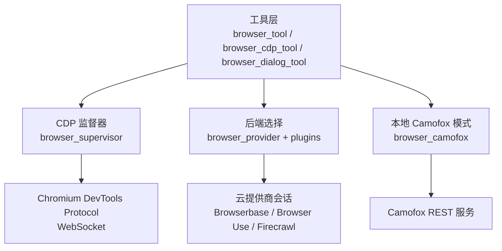
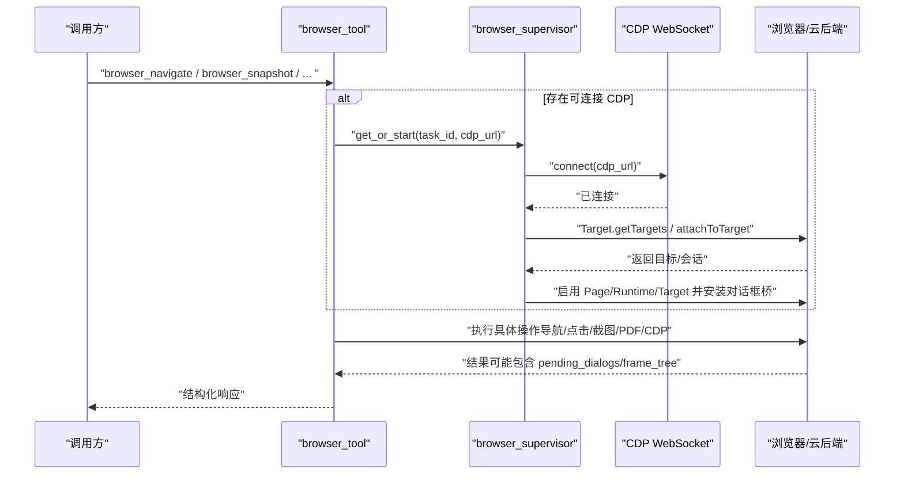
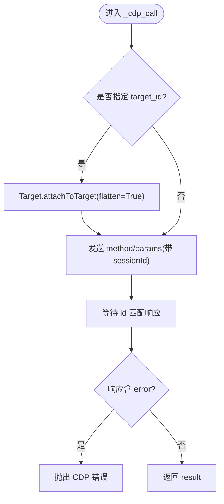
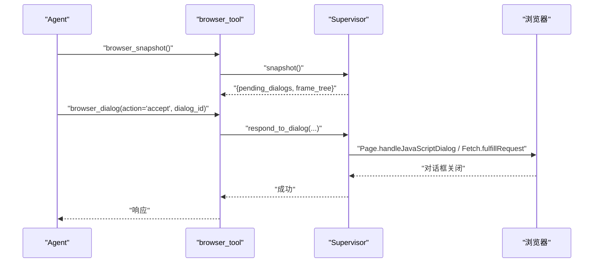
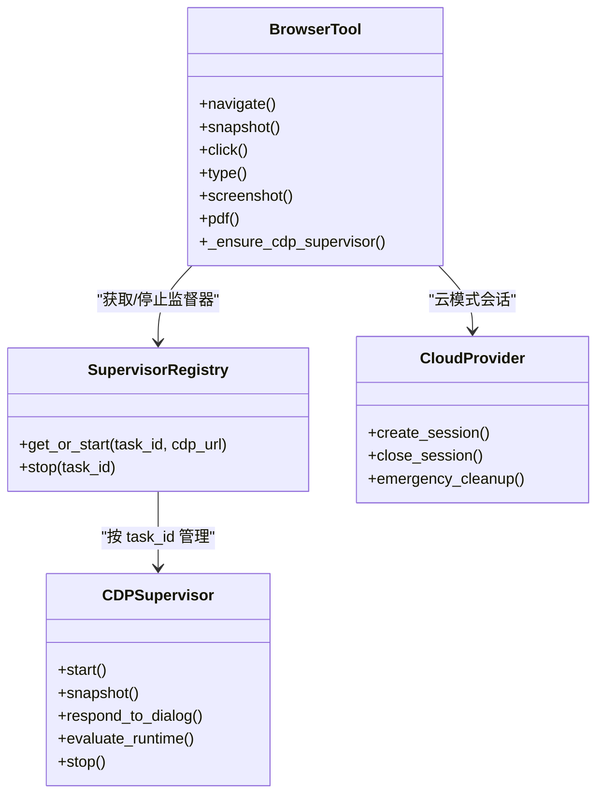
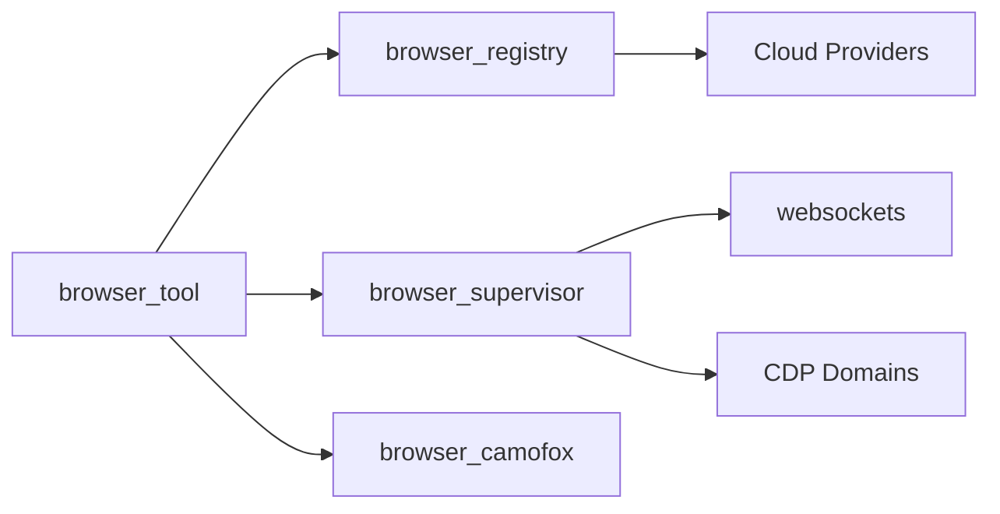

# 浏览器自动化工具

<cite>
**本文引用的文件**
- [tools/browser_tool.py](file://tools/browser_tool.py)
- [tools/browser_cdp_tool.py](file://tools/browser_cdp_tool.py)
- [tools/browser_supervisor.py](file://tools/browser_supervisor.py)
- [tools/browser_dialog_tool.py](file://tools/browser_dialog_tool.py)
- [tools/browser_camofox.py](file://tools/browser_camofox.py)
- [agent/browser_provider.py](file://agent/browser_provider.py)
</cite>

## 目录
1. [简介](#简介)
2. [项目结构](#项目结构)
3. [核心组件](#核心组件)
4. [架构总览](#架构总览)
5. [详细组件分析](#详细组件分析)
6. [依赖关系分析](#依赖关系分析)
7. [性能考虑](#性能考虑)
8. [故障排查指南](#故障排查指南)
9. [结论](#结论)
10. [附录](#附录)

## 简介
本技术文档面向 Hermes Agent 的浏览器自动化子系统，系统性阐述其核心架构与实现机制，重点覆盖：
- CDP 协议通信、页面控制与事件处理（含对话框拦截、OOPIF/iframe 路由）
- 浏览器实例管理（多标签页、会话隔离、资源回收）
- 网页交互能力（导航、元素操作、表单填写、截图与 PDF 导出路径）
- 反爬虫检测绕过策略（UA 轮换、指纹伪装、行为模拟）
- 浏览器配置项（视口、代理、扩展等）
- 错误处理（网络异常、页面加载失败、交互超时）
- 性能优化（并发控制、缓存、内存管理）
- 自动化脚本示例与调试方法

## 项目结构
Hermes 的浏览器自动化由“工具层 + 运行时 + 后端抽象”组成：
- 工具层：对外暴露统一 API（导航、快照、点击、类型输入、截图、PDF、CDP 透传、对话框响应等）
- 运行时：CDP 监督器（持久化 WebSocket、事件订阅、状态快照）、会话注册表
- 后端抽象：云提供商接口（Browserbase/Browser Use/Firecrawl），本地 Camofox 模式，以及通过 CDP 直连本地 Chromium 家族浏览器

图表来源
- [tools/browser_tool.py:1-120](file://tools/browser_tool.py#L1-L120)
- [tools/browser_cdp_tool.py:1-60](file://tools/browser_cdp_tool.py#L1-L60)
- [tools/browser_supervisor.py:1-20](file://tools/browser_supervisor.py#L1-L20)
- [tools/browser_camofox.py:1-24](file://tools/browser_camofox.py#L1-L24)
- [agent/browser_provider.py:1-37](file://agent/browser_provider.py#L1-L37)

章节来源
- [tools/browser_tool.py:1-120](file://tools/browser_tool.py#L1-L120)
- [tools/browser_cdp_tool.py:1-60](file://tools/browser_cdp_tool.py#L1-L60)
- [tools/browser_supervisor.py:1-20](file://tools/browser_supervisor.py#L1-L20)
- [tools/browser_camofox.py:1-24](file://tools/browser_camofox.py#L1-L24)
- [agent/browser_provider.py:1-37](file://agent/browser_provider.py#L1-L37)

## 核心组件
- 浏览器工具入口（browser_tool.py）
  - 统一封装 agent-browser CLI 调用与云提供商调度；支持本地 headless Chromium、Browserbase、Browser Use、Firecrawl。
  - 提供导航、快照、元素交互、截图、PDF、控制台、评估等高层工具；维护任务级会话隔离与清理。
  - 负责 CDP 端点解析与监督器启动（当存在可连接 CDP 时）。
- CDP 透传工具（browser_cdp_tool.py）
  - 直接通过 WebSocket 发送任意 CDP 命令；支持按 target_id 或 frame_id 路由到特定标签页或跨源 iframe。
  - 内置私有/内网 URL 防护（SSRF 边界），对敏感输出进行脱敏。
- CDP 监督器（browser_supervisor.py）
  - 为每个 task_id 维护一个持久化 CDP 连接，订阅 Page/Runtime/Target 事件，维护 pending dialogs、frame_tree、console 历史。
  - 注入对话框桥接脚本并通过 Fetch 域拦截，使对话框可在服务端可控（尤其适配 Browserbase 等会旁路原生对话框的后端）。
  - 提供线程安全的 snapshot 与 respond_to_dialog、evaluate_runtime 等同步/异步桥接。
- 对话框工具（browser_dialog_tool.py）
  - 基于监督器的 pending_dialogs 列表，接受/拒绝对话框，支持 prompt 文本回填。
- Camofox 后端（browser_camofox.py）
  - 通过 REST API 驱动 Camoufox（Firefox 指纹伪装），提供导航、快照、点击、类型、滚动、按键、截图等能力。
  - 支持 Docker 下回环地址重写、VNC 可视化、受管持久化与现有标签页复用。
- 云提供商抽象（agent/browser_provider.py）
  - 定义 create_session/close_session/emergency_cleanup 等生命周期契约，供 browser_tool 统一调度。

章节来源
- [tools/browser_tool.py:1-120](file://tools/browser_tool.py#L1-L120)
- [tools/browser_cdp_tool.py:1-60](file://tools/browser_cdp_tool.py#L1-L60)
- [tools/browser_supervisor.py:1-20](file://tools/browser_supervisor.py#L1-L20)
- [tools/browser_dialog_tool.py:1-47](file://tools/browser_dialog_tool.py#L1-L47)
- [tools/browser_camofox.py:1-24](file://tools/browser_camofox.py#L1-L24)
- [agent/browser_provider.py:1-37](file://agent/browser_provider.py#L1-L37)

## 架构总览
下图展示从工具调用到后端执行的完整链路，包括 CDP 监督器在其中的关键作用。

图表来源
- [tools/browser_tool.py:594-640](file://tools/browser_tool.py#L594-L640)
- [tools/browser_supervisor.py:644-769](file://tools/browser_supervisor.py#L644-L769)
- [tools/browser_cdp_tool.py:188-276](file://tools/browser_cdp_tool.py#L188-L276)

章节来源
- [tools/browser_tool.py:594-640](file://tools/browser_tool.py#L594-L640)
- [tools/browser_supervisor.py:644-769](file://tools/browser_supervisor.py#L644-L769)
- [tools/browser_cdp_tool.py:188-276](file://tools/browser_cdp_tool.py#L188-L276)

## 详细组件分析

### CDP 协议通信与事件处理
- 无状态 CDP 调用（browser_cdp_tool._cdp_call）
  - 通过 websockets 建立连接，可选 Target.attachToTarget 以扁平化会话，发送 method/params，等待 id 匹配的响应。
  - 支持 target_id（标签页级）与 frame_id（跨源 iframe）两种路由方式。
- 有状态 CDP 监督器（browser_supervisor）
  - 单进程单循环，持久连接，自动重连与退避。
  - 自动附加初始 page，启用 Page/Runtime/Target，设置 AutoAttach 以捕获子目标（workers/OOPIF）。
  - 注入对话框桥脚本，使用 Fetch.enable 拦截 XHR 请求，将 alert/confirm/prompt/beforeunload 转为 pending_dialogs。
  - 提供 snapshot/respond_to_dialog/evaluate_runtime 等同步/异步桥接。

图表来源
- [tools/browser_cdp_tool.py:188-276](file://tools/browser_cdp_tool.py#L188-L276)

章节来源
- [tools/browser_cdp_tool.py:188-276](file://tools/browser_cdp_tool.py#L188-L276)
- [tools/browser_supervisor.py:741-769](file://tools/browser_supervisor.py#L741-L769)

### 页面控制与事件处理（对话框、框架树）
- 对话框处理
  - 通过注入脚本替换 alert/confirm/prompt，拦截到 Fetch 域后生成 PendingDialog。
  - 工具层读取 browser_snapshot.pending_dialogs，调用 browser_dialog(action=accept|dismiss, prompt_text?) 完成响应。
- 框架树与 OOPIF
  - 监督器维护 frame_tree，区分同源 iframe 与跨源 iframe（is_oopif），后者拥有独立 cdp_session_id。
  - 对跨源 iframe 的 Runtime.evaluate 等需通过 frame_id 路由至对应 session。

图表来源
- [tools/browser_dialog_tool.py:82-117](file://tools/browser_dialog_tool.py#L82-L117)
- [tools/browser_supervisor.py:445-505](file://tools/browser_supervisor.py#L445-L505)
- [tools/browser_supervisor.py:770-800](file://tools/browser_supervisor.py#L770-L800)

章节来源
- [tools/browser_dialog_tool.py:82-117](file://tools/browser_dialog_tool.py#L82-L117)
- [tools/browser_supervisor.py:445-505](file://tools/browser_supervisor.py#L445-L505)
- [tools/browser_supervisor.py:770-800](file://tools/browser_supervisor.py#L770-L800)

### 浏览器实例管理与多标签页
- 会话隔离
  - 每个 task_id 对应独立的 CDP 监督器与会话上下文；cloud provider 返回的 session_name/bb_session_id/cdp_url 用于隔离与清理。
- 多标签页
  - 通过 Target.getTargets 枚举目标，Target.createTarget/attachToTarget 创建/附加新标签页；CDP 透传支持 target_id 精确控制。
- 资源回收
  - 工具层维护活跃会话字典，任务结束时触发 close_session/emergency_cleanup；Camofox 支持软清理与受管持久化。

图表来源
- [tools/browser_tool.py:594-640](file://tools/browser_tool.py#L594-L640)
- [tools/browser_supervisor.py:289-350](file://tools/browser_supervisor.py#L289-L350)
- [agent/browser_provider.py:50-127](file://agent/browser_provider.py#L50-L127)

章节来源
- [tools/browser_tool.py:594-640](file://tools/browser_tool.py#L594-L640)
- [tools/browser_supervisor.py:289-350](file://tools/browser_supervisor.py#L289-L350)
- [agent/browser_provider.py:50-127](file://agent/browser_provider.py#L50-L127)

### 网页交互功能
- 元素操作与表单填写
  - 通过 accessibility tree 快照中的 ref（如 @e1/@e2）定位元素，执行 click/type/press/scroll。
  - Camofox 路径同样支持基于 ref 的操作，并在输出中对敏感输入进行脱敏显示。
- 截图生成与 PDF 导出
  - 工具层提供截图与 PDF 能力（通过 agent-browser 或云提供商能力）；CDP 也可通过 Page.captureScreenshot/Page.printToPDF 实现。
- 控制台与 JS 执行
  - 通过 evaluate_runtime 或 CDP Runtime.evaluate 执行 JS，支持 returnByValue 与 awaitPromise。

章节来源
- [tools/browser_tool.py:1-120](file://tools/browser_tool.py#L1-L120)
- [tools/browser_camofox.py:496-574](file://tools/browser_camofox.py#L496-L574)
- [tools/browser_supervisor.py:507-609](file://tools/browser_supervisor.py#L507-L609)
- [tools/browser_cdp_tool.py:539-634](file://tools/browser_cdp_tool.py#L539-L634)

### 反爬虫检测绕过策略
- UA 轮换与指纹伪装
  - Camofox 基于 Camoufox（Firefox 分支）提供 C++ 级指纹伪装；可通过配置启用受管持久化与现有标签页复用，降低被识别风险。
- 行为模拟
  - 通过真实用户手势（userGesture）执行 JS，避免自动化特征；对话框桥接与 Fetch 拦截减少原生弹窗带来的异常行为。
- 代理与隐身模式
  - 云提供商（Browserbase/Browser Use）支持住宅代理与隐身模式；可通过环境变量与配置开启高级隐身。

章节来源
- [tools/browser_camofox.py:1-24](file://tools/browser_camofox.py#L1-L24)
- [tools/browser_camofox.py:176-208](file://tools/browser_camofox.py#L176-L208)
- [tools/browser_tool.py:27-37](file://tools/browser_tool.py#L27-L37)
- [tools/browser_supervisor.py:507-554](file://tools/browser_supervisor.py#L507-L554)

### 浏览器配置选项
- 命令超时与打开超时
  - 通过 config.yaml 的 browser.command_timeout 控制；首次 open 有更高下限以适应冷启动。
- CDP 端点
  - 支持 BROWSER_CDP_URL 环境变量与 browser.cdp_url 配置；自动发现 /json/version 并解析 webSocketDebuggerUrl。
- 对话框策略
  - browser.dialog_policy（must_respond/auto_dismiss/auto_accept）与 browser.dialog_timeout_s 控制默认行为。
- Camofox 相关
  - CAMOFOX_URL、CAMOFOX_API_KEY、CAMOFOX_REWRITE_LOOPBACK_URLS、CAMOFOX_ADOPT_EXISTING_TAB、managed_persistence 等。

章节来源
- [tools/browser_tool.py:298-342](file://tools/browser_tool.py#L298-L342)
- [tools/browser_tool.py:434-555](file://tools/browser_tool.py#L434-L555)
- [tools/browser_tool.py:558-591](file://tools/browser_tool.py#L558-L591)
- [tools/browser_camofox.py:84-131](file://tools/browser_camofox.py#L84-L131)
- [tools/browser_camofox.py:222-254](file://tools/browser_camofox.py#L222-L254)

### 错误处理机制
- CDP 超时与网络异常
  - 统一捕获 TimeoutError/TimeoutError/WebSocketException，返回结构化错误信息，必要时提示重新连接。
- 私有/内网 URL 防护
  - 对 Page.navigate 与 Runtime.evaluate 表达式进行 SSRF 检查，阻止访问内部地址。
- 对话框与帧路由错误
  - 当 frame_id 不存在或非 OOPIF 时给出明确提示；supervisor 未激活时返回友好错误。
- 云提供商错误
  - 会话创建/关闭失败时记录警告并继续清理流程，确保资源不泄漏。

章节来源
- [tools/browser_cdp_tool.py:492-531](file://tools/browser_cdp_tool.py#L492-L531)
- [tools/browser_cdp_tool.py:117-180](file://tools/browser_cdp_tool.py#L117-L180)
- [tools/browser_supervisor.py:353-393](file://tools/browser_supervisor.py#L353-L393)
- [agent/browser_provider.py:112-127](file://agent/browser_provider.py#L112-L127)

### 性能优化技巧
- 并发控制
  - 监督器单循环串行处理 CDP I/O，避免竞争；外部同步调用通过 safe_schedule_threadsafe 安全调度。
- 缓存策略
  - 命令超时、云提供商实例、浏览器引擎等采用模块级缓存；截图清理节流避免频繁扫描。
- 内存管理
  - 快照内容截断与 LLM 摘要（阈值 15000 字符）；frame_tree 条目限制（30）与深度限制（2）；控制台历史环形缓冲（50）。
- 重连与退避
  - CDP 监督器在连接失败时指数退避并重试，保持长连接稳定性。

章节来源
- [tools/browser_tool.py:252-277](file://tools/browser_tool.py#L252-L277)
- [tools/browser_tool.py:206-235](file://tools/browser_tool.py#L206-L235)
- [tools/browser_supervisor.py:80-90](file://tools/browser_supervisor.py#L80-L90)
- [tools/browser_supervisor.py:644-739](file://tools/browser_supervisor.py#L644-L739)

## 依赖关系分析
- 工具层依赖
  - browser_tool 依赖 agent.browser_registry 选择云提供商；依赖 tools.browser_supervisor 启动 CDP 监督器；可选依赖 tools.browser_camofox 走 REST 路径。
- 监督器依赖
  - 依赖 websockets 与 CDP 协议；通过 Target/Page/Runtime/Fetch 域与浏览器交互。
- 云提供商抽象
  - 通过 ABC 定义统一生命周期，便于插件化扩展与第三方集成。

图表来源
- [tools/browser_tool.py:159-177](file://tools/browser_tool.py#L159-L177)
- [tools/browser_supervisor.py:31-37](file://tools/browser_supervisor.py#L31-L37)
- [agent/browser_provider.py:50-127](file://agent/browser_provider.py#L50-L127)

章节来源
- [tools/browser_tool.py:159-177](file://tools/browser_tool.py#L159-L177)
- [tools/browser_supervisor.py:31-37](file://tools/browser_supervisor.py#L31-L37)
- [agent/browser_provider.py:50-127](file://agent/browser_provider.py#L50-L127)

## 性能考虑
- 首开延迟优化
  - 首次 open 提高最小超时，适应冷启动与系统库缺失场景；提供沙箱绕过建议与依赖安装指引。
- 快照与内容压缩
  - 大页面快照进行截断与摘要，限制存储大小，避免模型上下文爆炸。
- 事件与缓冲区
  - 控制台事件与最近对话框使用环形缓冲，防止无限增长。
- 重连与健壮性
  - CDP 监督器具备指数退避重连，保障在云环境短暂断开时的自愈能力。

[本节为通用指导，无需特定文件引用]

## 故障排查指南
- 无法连接 CDP
  - 检查 BROWSER_CDP_URL 或 browser.cdp_url 是否正确；确认浏览器调试端口开放；尝试 /browser connect 重新建立连接。
- 对话框未出现或无法响应
  - 确认已启动 CDP 监督器；查看 browser_snapshot.pending_dialogs；若为跨源 iframe，使用 frame_id 路由。
- 页面加载超时
  - 调整 browser.command_timeout；在 Docker 环境中确保依赖齐全；必要时添加 --no-sandbox 参数。
- 私有/内网 URL 被阻断
  - 当前页面位于内网时，部分 CDP 方法会被保护；请切换到公网或调整策略。

章节来源
- [tools/browser_cdp_tool.py:460-476](file://tools/browser_cdp_tool.py#L460-L476)
- [tools/browser_supervisor.py:353-393](file://tools/browser_supervisor.py#L353-L393)
- [tools/browser_tool.py:385-421](file://tools/browser_tool.py#L385-L421)
- [tools/browser_cdp_tool.py:117-180](file://tools/browser_cdp_tool.py#L117-L180)

## 结论
Hermes 的浏览器自动化子系统通过统一的工具层、强大的 CDP 监督器与可扩展的云提供商抽象，实现了高可靠、高性能且安全的浏览器操控能力。其设计兼顾了本地与云端、静态与动态场景，提供了完善的错误处理与性能优化机制，适合构建复杂的网页自动化工作流。

[本节为总结性内容，无需特定文件引用]

## 附录
- 常用 CDP 方法参考
  - Target.getTargets：列出所有标签页/目标
  - Target.attachToTarget：附加到目标并获取 sessionId
  - Page.navigate/Page.reload：导航与刷新
  - Runtime.evaluate：执行 JS 表达式
  - Emulation.setDeviceMetricsOverride：设置视口
  - Network.getAllCookies：获取 Cookie
  - Page.captureScreenshot/Page.printToPDF：截图与 PDF 导出
- 典型自动化脚本示例（概念性步骤）
  - 导航到目标页面 -> 获取快照 -> 定位元素并点击/填写 -> 处理可能的对话框 -> 截图/PDF 保存 -> 关闭会话
- 调试方法
  - 启用 CDP 监督器日志；使用 browser_snapshot 观察 pending_dialogs 与 frame_tree；通过 browser_cdp 直接发送诊断命令；在 Camofox 模式下通过 VNC 实时观察浏览器。

[本节为补充说明，无需特定文件引用]