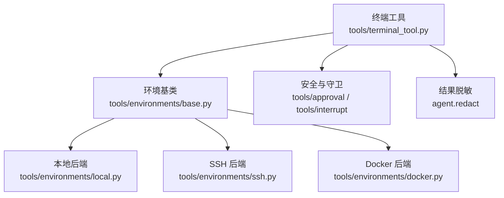
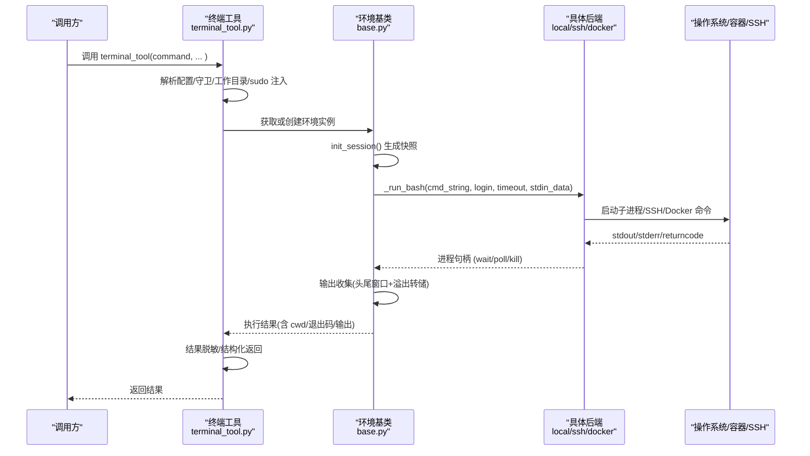
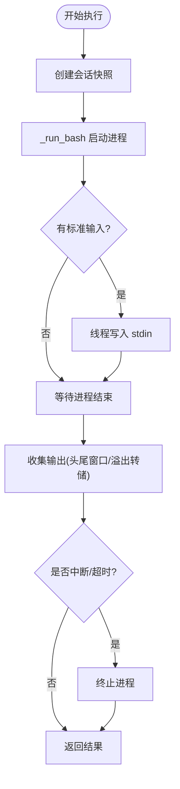
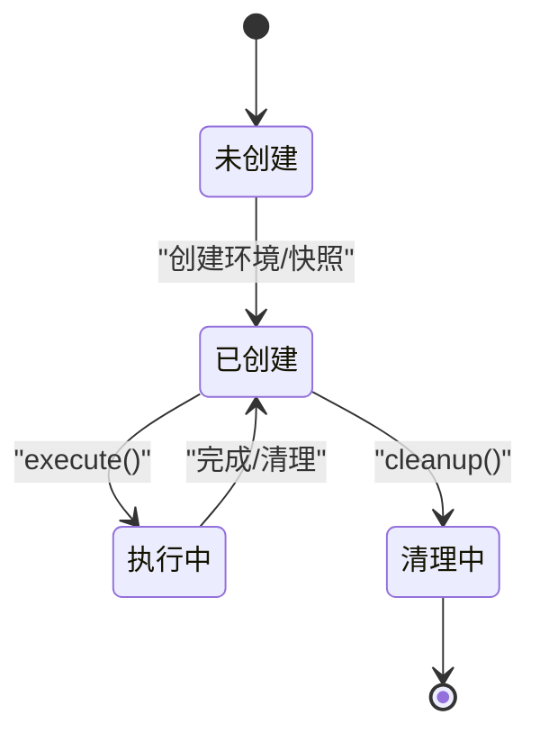
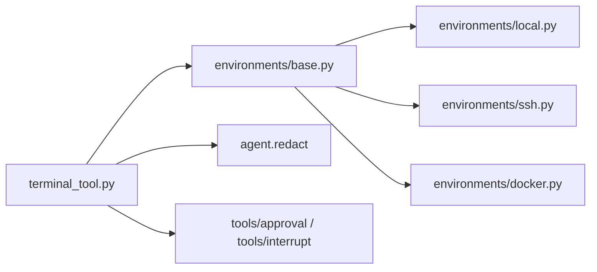

# 终端执行工具

<cite>
**本文引用的文件**
- [tools/terminal_tool.py](file://tools/terminal_tool.py)
- [tools/environments/base.py](file://tools/environments/base.py)
- [tools/environments/local.py](file://tools/environments/local.py)
- [tools/environments/docker.py](file://tools/environments/docker.py)
- [tools/environments/ssh.py](file://tools/environments/ssh.py)
- [tests/tools/test_terminal_error_redaction.py](file://tests/tools/test_terminal_error_redaction.py)
</cite>

## 目录
1. [简介](#简介)
2. [项目结构](#项目结构)
3. [核心组件](#核心组件)
4. [架构总览](#架构总览)
5. [详细组件分析](#详细组件分析)
6. [依赖关系分析](#依赖关系分析)
7. [性能考虑](#性能考虑)
8. [故障排除指南](#故障排除指南)
9. [结论](#结论)
10. [附录](#附录)

## 简介
本技术文档面向 Hermes Agent 的“终端执行工具”，系统性阐述其进程管理、输入输出流处理与实时通信机制；解释终端会话的生命周期（创建、监控、清理）；覆盖多种后端实现（本地终端、SSH、容器化环境等）；说明命令执行的权限控制、资源限制与安全策略；提供配置项（超时、缓冲区、编码等）；详述错误处理（进程异常、网络中断、超时）；给出性能优化建议（连接复用、异步处理、内存优化）；并提供使用示例与故障排除指引。

## 项目结构
终端执行能力由“工具入口 + 统一环境抽象 + 多后端实现”构成：
- 工具入口：对外暴露统一的 terminal_tool 调用，负责参数校验、安全守卫、结果脱敏、生命周期协调。
- 统一环境抽象：BaseEnvironment 定义 execute/init_session/_run_bash/cleanup 等接口，封装快照、CWD 跟踪、中断与超时、输出收集等通用逻辑。
- 后端实现：LocalEnvironment、SSHEnvironment、DockerEnvironment（以及 Modal/Singularity/Daytona/Vercel Sandbox 等）分别实现 _run_bash 与 cleanup，适配不同运行域。

图表来源
- [tools/terminal_tool.py:1064-1073](file://tools/terminal_tool.py#L1064-L1073)
- [tools/environments/base.py:553-619](file://tools/environments/base.py#L553-L619)
- [tools/environments/local.py:1-120](file://tools/environments/local.py#L1-L120)
- [tools/environments/ssh.py:40-85](file://tools/environments/ssh.py#L40-L85)
- [tools/environments/docker.py:1-31](file://tools/environments/docker.py#L1-L31)

章节来源
- [tools/terminal_tool.py:1-35](file://tools/terminal_tool.py#L1-L35)
- [tools/environments/base.py:1-80](file://tools/environments/base.py#L1-L80)

## 核心组件
- 终端工具入口（tools/terminal_tool.py）
  - 解析配置与环境变量，选择后端并缓存活跃环境实例。
  - 命令前置守卫（危险命令检测、主机访问检查、交互式审批）。
  - sudo 注入与密码交互（支持缓存、超时、回退）。
  - 前台/后台执行、超时上限、工作目录解析、会话级 CWD 记录。
  - 结果序列化前强制脱敏，避免敏感信息泄露。
- 环境基类（tools/environments/base.py）
  - BaseEnvironment 统一 execute 流程：初始化会话快照、source 快照、执行 bash、捕获 CWD 标记、中断轮询、超时控制、输出收集与截断。
  - 输出收集器 _BoundedOutputCollector：头尾窗口 + 溢出转储文件，保证内存可控且可恢复。
  - 进程句柄协议 ProcessHandle 与 _ThreadedProcessHandle：屏蔽 SDK 后端差异，统一 wait/poll/kill/stdout 语义。
- 本地后端（tools/environments/local.py）
  - 安全的子进程环境构建与敏感环境变量过滤（Tier 1/Tier 2 剥离），跨会话泄漏防护，Windows Git Bash 路径兼容。
  - 工作目录回退与可用性检查，bash 查找与启动健壮性。
- SSH 后端（tools/environments/ssh.py）
  - ControlMaster 持久连接，批量文件同步（tar over SSH），远程家目录探测与目录准备。
  - 连接建立失败、超时、传输失败的明确错误提示与重试建议。
- Docker 后端（tools/environments/docker.py）
  - 容器安全加固（cap-drop ALL、no-new-privileges、tmpfs 限制）、可选 cgroup 资源限制（CPU/内存/PID）。
  - 出站代理集成（iron-proxy）：CA 证书挂载、代理环境变量注入、NODE_OPTIONS 合并、碰撞检测。
  - 孤儿容器回收、镜像入口点检测、共享内存默认值调整。

章节来源
- [tools/terminal_tool.py:57-70](file://tools/terminal_tool.py#L57-L70)
- [tools/terminal_tool.py:348-381](file://tools/terminal_tool.py#L348-L381)
- [tools/terminal_tool.py:976-1062](file://tools/terminal_tool.py#L976-L1062)
- [tools/terminal_tool.py:1453-1583](file://tools/terminal_tool.py#L1453-L1583)
- [tools/environments/base.py:81-231](file://tools/environments/base.py#L81-L231)
- [tools/environments/base.py:382-467](file://tools/environments/base.py#L382-L467)
- [tools/environments/local.py:225-337](file://tools/environments/local.py#L225-L337)
- [tools/environments/local.py:456-513](file://tools/environments/local.py#L456-L513)
- [tools/environments/ssh.py:28-85](file://tools/environments/ssh.py#L28-L85)
- [tools/environments/docker.py:322-366](file://tools/environments/docker.py#L322-L366)
- [tools/environments/docker.py:397-555](file://tools/environments/docker.py#L397-L555)

## 架构总览
终端工具通过统一入口调度到具体后端，后端基于 BaseEnvironment 的 execute 流程完成“会话快照 -> 命令执行 -> 输出收集 -> 状态返回”。

图表来源
- [tools/terminal_tool.py:1064-1073](file://tools/terminal_tool.py#L1064-L1073)
- [tools/environments/base.py:660-782](file://tools/environments/base.py#L660-L782)
- [tools/environments/base.py:329-349](file://tools/environments/base.py#L329-L349)
- [tools/environments/local.py:722-800](file://tools/environments/local.py#L722-L800)
- [tools/environments/ssh.py:394-404](file://tools/environments/ssh.py#L394-L404)
- [tools/environments/docker.py:772-800](file://tools/environments/docker.py#L772-L800)

## 详细组件分析

### 进程管理与输入输出流
- 进程模型
  - 每个命令以“spawn-per-call”的方式启动一个 bash -c 进程，确保隔离性与幂等性。
  - 非原生子进程的 SDK 后端（如 Modal/Daytona）通过 _ThreadedProcessHandle 包装为统一接口。
- 输入处理
  - 通过 _pipe_stdin 在独立线程写入 stdin，避免管道死锁；对 Windows 文本模式换行转换进行规避。
- 输出处理
  - _BoundedOutputCollector 维护固定大小的头尾窗口，并在溢出时转储到磁盘文件，防止内存膨胀。
  - 输出渲染时保留必要状态后缀，并标注省略信息。
- 中断与超时
  - 全局中断事件用于立即终止长耗时命令；_wait_for_process 周期性触发活动回调，便于网关感知存活。
  - 快照创建与命令执行均带超时保护，避免卡死。

图表来源
- [tools/environments/base.py:295-349](file://tools/environments/base.py#L295-L349)
- [tools/environments/base.py:81-231](file://tools/environments/base.py#L81-L231)
- [tools/environments/base.py:660-782](file://tools/environments/base.py#L660-L782)

章节来源
- [tools/environments/base.py:295-349](file://tools/environments/base.py#L295-L349)
- [tools/environments/base.py:81-231](file://tools/environments/base.py#L81-L231)
- [tools/environments/base.py:660-782](file://tools/environments/base.py#L660-L782)

### 终端会话生命周期管理
- 创建
  - 首次调用时根据 env_type 选择后端；若不存在则创建并缓存；任务级覆盖（register_task_env_overrides）可指定镜像/CWD。
  - init_session 生成登录 shell 快照，包含环境变量、函数、别名，并记录当前工作目录。
- 监控
  - 每命令执行期间周期性触发活动回调（interval 默认 10s），供上层网关/仪表盘显示进度。
  - 会话级 CWD 记录（record_session_cwd/get_session_cwd）保障跨调用一致性。
- 清理
  - 各后端 cleanup 释放资源（关闭连接、删除临时文件、回传文件等）。
  - Docker 后端支持孤儿容器回收，避免进程崩溃导致的残留。

图表来源
- [tools/terminal_tool.py:1088-1101](file://tools/terminal_tool.py#L1088-L1101)
- [tools/terminal_tool.py:1197-1229](file://tools/terminal_tool.py#L1197-L1229)
- [tools/environments/base.py:660-782](file://tools/environments/base.py#L660-L782)
- [tools/environments/ssh.py:406-427](file://tools/environments/ssh.py#L406-L427)
- [tools/environments/docker.py:148-239](file://tools/environments/docker.py#L148-L239)

章节来源
- [tools/terminal_tool.py:1088-1101](file://tools/terminal_tool.py#L1088-L1101)
- [tools/terminal_tool.py:1197-1229](file://tools/terminal_tool.py#L1197-L1229)
- [tools/environments/base.py:660-782](file://tools/environments/base.py#L660-L782)
- [tools/environments/ssh.py:406-427](file://tools/environments/ssh.py#L406-L427)
- [tools/environments/docker.py:148-239](file://tools/environments/docker.py#L148-L239)

### 多后端实现要点
- 本地后端（LocalEnvironment）
  - 子进程环境净化：移除高危密钥、动态内部密钥、激活虚拟环境标记；注入 HERMES_HOME 与上下文会话变量。
  - Windows Git Bash 兼容：路径转换、bash 查找与启动健壮性。
- SSH 后端（SSHEnvironment）
  - ControlMaster 连接复用；批量文件同步（tar over SSH）；远程家目录探测与目录准备。
  - 连接失败/超时/传输失败均抛出 EnvironmentConnectionError，附带重试建议。
- Docker 后端（DockerEnvironment）
  - 安全加固：能力最小化、no-new-privileges、tmpfs 限制；可选 cgroup 资源限制。
  - 出站代理：CA 证书挂载、代理环境变量注入、NODE_OPTIONS 合并、冲突检测。
  - 孤儿容器回收、共享内存默认值调整、镜像入口点检测。

章节来源
- [tools/environments/local.py:225-337](file://tools/environments/local.py#L225-L337)
- [tools/environments/local.py:456-513](file://tools/environments/local.py#L456-L513)
- [tools/environments/local.py:722-800](file://tools/environments/local.py#L722-L800)
- [tools/environments/ssh.py:28-85](file://tools/environments/ssh.py#L28-L85)
- [tools/environments/ssh.py:394-404](file://tools/environments/ssh.py#L394-L404)
- [tools/environments/docker.py:322-366](file://tools/environments/docker.py#L322-L366)
- [tools/environments/docker.py:397-555](file://tools/environments/docker.py#L397-L555)

### 权限控制、资源限制与安全策略
- 命令守卫
  - 危险命令检测、主机路径访问检查、交互式审批（支持回调）。
- sudo 处理
  - 自动改写 sudo 调用为 -S 模式；支持 SUDO_PASSWORD、交互式密码、缓存与失效策略；NOPASSWD 场景跳过交互。
- 环境变量安全
  - Tier 1/Tier 2 剥离策略，防止 LLM 提供商密钥、网关中继密钥、动态内部密钥泄露至子进程。
  - 跨会话泄漏防护：HERMES_SESSION_* 等上下文变量在子进程中按 ContextVar 权威值注入或剥离。
- 容器安全
  - cap-drop ALL、no-new-privileges、tmpfs 限制；可选 pids/cpu/memory 限制；共享内存默认提升。
  - 出站代理强制与碰撞检测，防止用户额外参数绕过安全策略。

章节来源
- [tools/terminal_tool.py:348-381](file://tools/terminal_tool.py#L348-L381)
- [tools/terminal_tool.py:976-1062](file://tools/terminal_tool.py#L976-L1062)
- [tools/environments/local.py:225-337](file://tools/environments/local.py#L225-L337)
- [tools/environments/local.py:456-513](file://tools/environments/local.py#L456-L513)
- [tools/environments/docker.py:322-366](file://tools/environments/docker.py#L322-L366)
- [tools/environments/docker.py:590-635](file://tools/environments/docker.py#L590-L635)

### 配置选项
- 终端环境与资源
  - TERMINAL_ENV：后端类型（local/ssh/docker/modal/daytona/vercel_sandbox）。
  - TERMINAL_TIMEOUT：命令超时（秒）。
  - TERMINAL_LIFETIME_SECONDS：环境生命周期（秒）。
  - TERMINAL_CWD：工作目录（容器后端需绝对路径）。
  - TERMINAL_CONTAINER_CPU/MEMORY/DISK：容器资源限制。
  - TERMINAL_DOCKER_*：Docker 相关（forward_env/volumes/env/extra_args/shm_size/network/persist_across_processes/orphan_reaper）。
  - TERMINAL_SSH_*：SSH 连接参数（host/user/port/key/persistent）。
  - TERMINAL_MODAL_MODE：Modal 模式（auto/direct/managed）。
  - TERMINAL_VERCEL_RUNTIME：Vercel 运行时版本。
- 其他
  - TERMINAL_MAX_FOREGROUND_TIMEOUT：前台超时硬上限。
  - TERMINAL_DISK_WARNING_GB：磁盘使用告警阈值。
  - TERMINAL_SANDBOX_DIR：沙箱存储根目录。

章节来源
- [tools/terminal_tool.py:118-133](file://tools/terminal_tool.py#L118-L133)
- [tools/terminal_tool.py:1453-1583](file://tools/terminal_tool.py#L1453-L1583)
- [tools/environments/base.py:275-287](file://tools/environments/base.py#L275-L287)

### 错误处理机制
- 基础设施错误
  - EnvironmentConnectionError：表示后端不可达（SSH 断开、Docker 守护进程未运行、远端文件同步失败等），附带重试建议。
- 进程异常与超时
  - 快照创建失败回退为非登录 bash；命令执行超时/中断及时终止并返回结构化错误。
- 输出与结果脱敏
  - 所有错误与回溯在序列化前强制脱敏，避免敏感信息泄露；成功输出可选择关闭脱敏。
- 典型测试覆盖
  - 前端重试错误、环境创建导入错误、后台启动错误、外层异常等均验证脱敏行为。

章节来源
- [tools/environments/base.py:55-79](file://tools/environments/base.py#L55-L79)
- [tools/environments/base.py:660-782](file://tools/environments/base.py#L660-L782)
- [tools/terminal_tool.py:57-70](file://tools/terminal_tool.py#L57-L70)
- [tests/tools/test_terminal_error_redaction.py:47-154](file://tests/tools/test_terminal_error_redaction.py#L47-L154)

### 实际使用示例
- 前台执行
  - 直接调用 terminal_tool(command="...")，返回即时结果（即使设置高超时也立即返回）。
- 后台执行
  - background=true 返回 session_id；配合 notify_on_complete=true 用于有界任务；使用 process(action="poll"/"wait") 管理。
- 工作目录
  - 使用 workdir 指定命令级 CWD；当命令改变会话 CWD 时，结果会包含 cwd 字段，应信任该字段而非每次 cd。
- PTY
  - pty=true 用于交互式 CLI（无 PTY 会挂起）；将 git 输出重定向到 cat 以避免分页。

章节来源
- [tools/terminal_tool.py:1077-1086](file://tools/terminal_tool.py#L1077-L1086)

## 依赖关系分析
- 模块耦合
  - terminal_tool 依赖 base 抽象与各后端实现；通过工具注册表与守卫模块进行安全控制；通过 agent.redact 进行结果脱敏。
  - local/ssh/docker 各自实现 _run_bash 与 cleanup，遵循 ProcessHandle 协议。
- 外部依赖
  - Docker 后端依赖 docker/podman CLI；SSH 后端依赖 ssh/scp；Modal/Daytona/Vercel 依赖对应 SDK。
- 潜在循环依赖
  - 通过延迟导入（如 hermes_cli.config、agent.secret_scope）避免导入期失败影响工具发现与 CLI 启动。

图表来源
- [tools/terminal_tool.py:1064-1073](file://tools/terminal_tool.py#L1064-L1073)
- [tools/environments/base.py:553-619](file://tools/environments/base.py#L553-L619)
- [tools/environments/local.py:1-120](file://tools/environments/local.py#L1-L120)
- [tools/environments/ssh.py:1-85](file://tools/environments/ssh.py#L1-L85)
- [tools/environments/docker.py:1-31](file://tools/environments/docker.py#L1-L31)

章节来源
- [tools/terminal_tool.py:1064-1073](file://tools/terminal_tool.py#L1064-L1073)
- [tools/environments/base.py:553-619](file://tools/environments/base.py#L553-L619)

## 性能考虑
- 连接复用
  - SSH 使用 ControlMaster 保持长连接，减少握手开销。
  - Docker 支持跨进程容器复用（docker_persist_across_processes），降低冷启动成本。
- 异步与缓冲
  - 输入写入采用独立线程避免阻塞；输出收集器头尾窗口 + 溢出转储，兼顾内存与可恢复性。
- 资源限制
  - Docker 后端启用 cgroup 限制（CPU/内存/PID）与 tmpfs 大小限制，防止资源滥用。
- I/O 优化
  - SSH 批量文件同步使用 tar over SSH 单流传输，减少 O(N) 往返。
  - Docker 出站代理 CA 证书挂载与 NODE_OPTIONS 合并，减少 TLS 握手与配置复杂度。

章节来源
- [tools/environments/ssh.py:211-340](file://tools/environments/ssh.py#L211-L340)
- [tools/environments/docker.py:720-769](file://tools/environments/docker.py#L720-L769)
- [tools/environments/base.py:81-231](file://tools/environments/base.py#L81-L231)
- [tools/terminal_tool.py:1567-1583](file://tools/terminal_tool.py#L1567-L1583)

## 故障排除指南
- SSH 连接失败
  - 现象：连接超时或认证失败。
  - 排查：确认 host/port/key 可达；sshd 服务正常；防火墙放行；ControlPath 可用。
  - 参考：连接建立与错误提示。
- Docker 不可用
  - 现象：无法找到 docker 可执行文件或版本检查失败。
  - 排查：安装 Docker Desktop 或 podman；PATH 正确；macOS 非 PATH 位置检测。
  - 参考：可用性检查与错误提示。
- 输出过大导致卡顿
  - 现象：长时间无返回或内存增长。
  - 排查：检查输出量；利用溢出转储文件定位；必要时限制命令输出。
  - 参考：输出收集器与转储机制。
- sudo 密码问题
  - 现象：sudo 要求密码或认证失败。
  - 排查：设置 SUDO_PASSWORD；或使用交互式密码；检查 NOPASSWD 配置；认证失败后自动清除缓存。
  - 参考：sudo 注入与密码处理。
- 出站代理问题
  - 现象：容器内网络请求失败或证书校验失败。
  - 排查：检查 iron-proxy 状态与 CA 证书；确认环境变量未被覆盖；查看碰撞检测日志。
  - 参考：出站代理注入与冲突检测。

章节来源
- [tools/environments/ssh.py:28-133](file://tools/environments/ssh.py#L28-L133)
- [tools/environments/docker.py:772-800](file://tools/environments/docker.py#L772-L800)
- [tools/environments/base.py:81-231](file://tools/environments/base.py#L81-L231)
- [tools/terminal_tool.py:976-1062](file://tools/terminal_tool.py#L976-L1062)
- [tools/environments/docker.py:397-555](file://tools/environments/docker.py#L397-L555)

## 结论
Hermes 终端执行工具通过统一的环境抽象与多后端实现，提供了安全、稳定、可扩展的命令执行能力。其设计重点包括：
- 进程隔离与快照机制，确保命令执行的一致性与可恢复性。
- 严格的权限控制与资源限制，防止敏感信息泄露与资源滥用。
- 健壮的输入输出流处理与实时通信，支持大输出与长耗时任务。
- 完善的错误处理与故障恢复，提升系统鲁棒性。
- 灵活的配置与优化策略，适应不同运行环境与性能需求。

## 附录
- 术语
  - 会话快照：登录 shell 的环境、函数、别名等状态的持久化副本。
  - 工作目录（CWD）：命令执行的当前目录，支持会话级记录与命令级覆盖。
  - 出站代理：通过 iron-proxy 对容器内网络流量进行管控与审计。
- 最佳实践
  - 使用后台模式启动长期服务，并通过健康检查确认就绪。
  - 合理设置超时与资源限制，避免资源耗尽。
  - 谨慎使用 sudo，优先使用 NOPASSWD 或配置化密码。
  - 在容器后端使用绝对路径作为工作目录，避免相对路径导致启动失败。