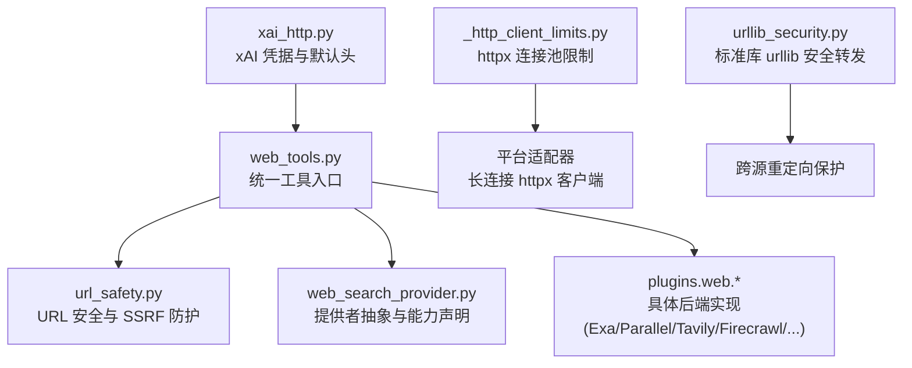
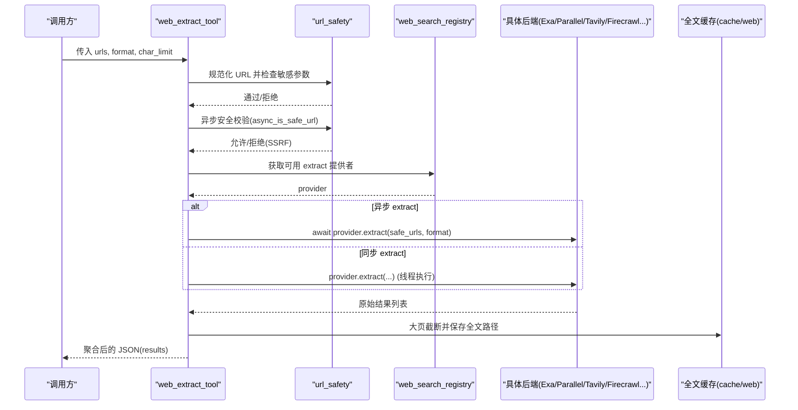
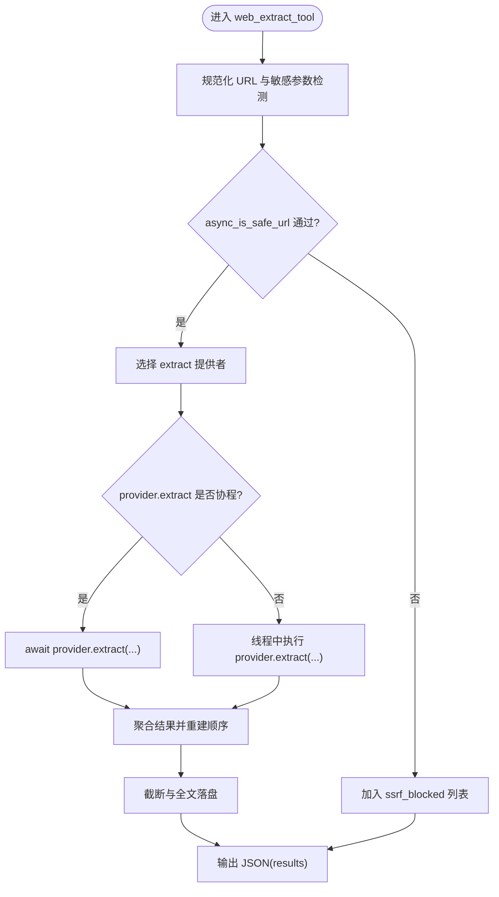
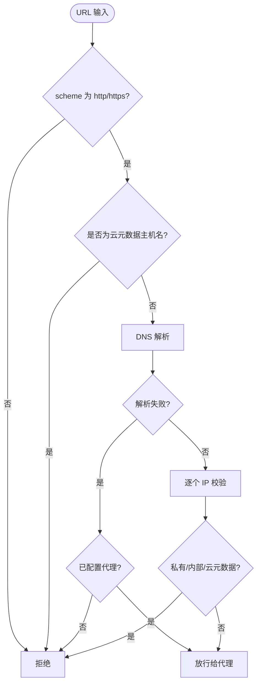
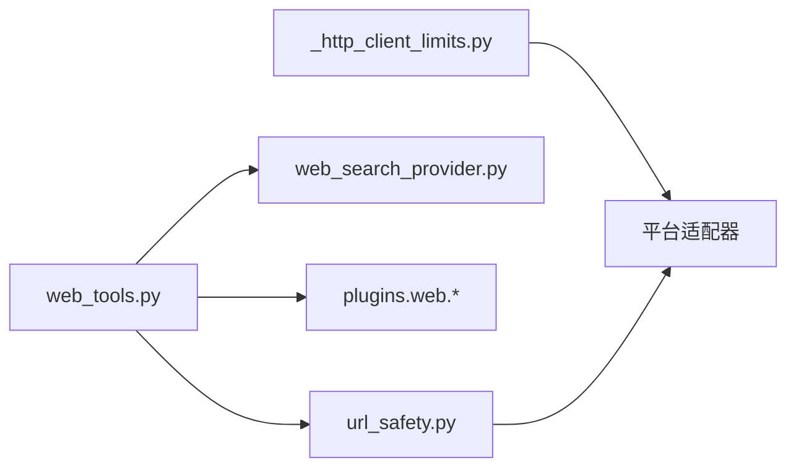

# 网络和 Web 工具

<cite>
**本文引用的文件**
- [tools/web_tools.py](file://tools/web_tools.py)
- [tools/url_safety.py](file://tools/url_safety.py)
- [agent/web_search_provider.py](file://agent/web_search_provider.py)
- [hermes_cli/urllib_security.py](file://hermes_cli/urllib_security.py)
- [tools/xai_http.py](file://tools/xai_http.py)
- [gateway/platforms/_http_client_limits.py](file://gateway/platforms/_http_client_limits.py)
</cite>

## 目录
1. [简介](#简介)
2. [项目结构](#项目结构)
3. [核心组件](#核心组件)
4. [架构总览](#架构总览)
5. [详细组件分析](#详细组件分析)
6. [依赖关系分析](#依赖关系分析)
7. [性能考量](#性能考量)
8. [故障排除指南](#故障排除指南)
9. [结论](#结论)
10. [附录](#附录)

## 简介
本技术文档聚焦 Hermes Agent 的网络与 Web 工具，系统性说明网络请求封装、HTTP/HTTPS 支持、连接池与超时管理、重试策略、URL 安全校验（域名白名单、协议检查、内容过滤）、多搜索引擎与 API 客户端集成、并发请求处理（限流、错误重试、结果聚合）、网络配置（代理、超时、SSL 证书验证）、错误处理机制（网络异常、超时、降级）以及性能优化建议（连接复用、缓存、带宽控制）。文中所有实现细节均基于仓库中的实际代码。

## 项目结构
Hermes Agent 的网络与 Web 能力由“工具层 + 安全层 + 提供者抽象 + 平台 HTTP 限制”共同构成：
- 工具层：提供 web_search_tool 与 web_extract_tool 两个统一入口，负责后端选择、参数校验、SSRF 防护、截断与存储、调试日志等。
- 安全层：集中进行 URL 规范化、敏感查询参数检测、私有/内部 IP 阻断、云元数据地址强制拦截、连接时 SSRF 校验与重定向目标校验。
- 提供者抽象：WebSearchProvider ABC 定义搜索/提取的统一接口，插件化注册与能力声明。
- 平台 HTTP 限制：为长生命周期适配器提供 httpx.Limits 调优，避免 CLOSE_WAIT 导致 FD 耗尽。

图表来源
- [tools/web_tools.py:618-740](file://tools/web_tools.py#L618-L740)
- [tools/url_safety.py:415-528](file://tools/url_safety.py#L415-L528)
- [agent/web_search_provider.py:89-212](file://agent/web_search_provider.py#L89-L212)
- [gateway/platforms/_http_client_limits.py:43-85](file://gateway/platforms/_http_client_limits.py#L43-L85)
- [hermes_cli/urllib_security.py:31-133](file://hermes_cli/urllib_security.py#L31-L133)
- [tools/xai_http.py:16-112](file://tools/xai_http.py#L16-L112)

章节来源
- [tools/web_tools.py:618-740](file://tools/web_tools.py#L618-L740)
- [tools/url_safety.py:415-528](file://tools/url_safety.py#L415-L528)
- [agent/web_search_provider.py:89-212](file://agent/web_search_provider.py#L89-L212)
- [gateway/platforms/_http_client_limits.py:43-85](file://gateway/platforms/_http_client_limits.py#L43-L85)
- [hermes_cli/urllib_security.py:31-133](file://hermes_cli/urllib_security.py#L31-L133)
- [tools/xai_http.py:16-112](file://tools/xai_http.py#L16-L112)

## 核心组件
- 统一工具入口
  - web_search_tool：同步调用，按能力选择后端，返回搜索结果元数据。
  - web_extract_tool：异步调用，对 URL 做安全校验后交给后端提取，支持大页截断与全文落盘。
- URL 安全与 SSRF 防护
  - is_safe_url / async_is_safe_url：DNS 解析并校验 IP，阻止私有/内部/云元数据地址。
  - create_ssrf_safe_async_client / create_ssrf_safe_client：在 TCP 连接时对目标 IP 再次校验，关闭 DNS 重绑定窗口。
  - redirect_target_from_response：从响应中解析重定向目标，防止 3xx 跳转至内网。
- 提供者抽象
  - WebSearchProvider：定义 name、is_available、supports_search/extract、search/extract、get_setup_schema。
- 平台 HTTP 限制
  - platform_httpx_limits：为长生命周期适配器设置更激进的 keepalive 过期与最大连接数，降低 FD 压力。
- 标准库 urllib 安全转发
  - SafeCredentialRedirectHandler / open_credentialed_url：跨源重定向时仅保留安全头，防止凭据泄露。
- xAI 集成辅助
  - has_xai_credentials / resolve_xai_http_credentials / hermes_xai_default_headers：快速凭据探测、OAuth/Key 解析、稳定 UA。

章节来源
- [tools/web_tools.py:618-740](file://tools/web_tools.py#L618-L740)
- [tools/web_tools.py:742-1045](file://tools/web_tools.py#L742-L1045)
- [tools/url_safety.py:415-528](file://tools/url_safety.py#L415-L528)
- [tools/url_safety.py:825-875](file://tools/url_safety.py#L825-L875)
- [agent/web_search_provider.py:89-212](file://agent/web_search_provider.py#L89-L212)
- [gateway/platforms/_http_client_limits.py:43-85](file://gateway/platforms/_http_client_limits.py#L43-L85)
- [hermes_cli/urllib_security.py:31-133](file://hermes_cli/urllib_security.py#L31-L133)
- [tools/xai_http.py:16-112](file://tools/xai_http.py#L16-L112)

## 架构总览
下图展示一次 web_extract 调用从工具入口到后端提取的完整流程，包括安全校验、后端选择、异步/同步分发、截断与存储、结果聚合。

图表来源
- [tools/web_tools.py:742-1045](file://tools/web_tools.py#L742-L1045)
- [tools/url_safety.py:522-528](file://tools/url_safety.py#L522-L528)
- [agent/web_search_provider.py:153-184](file://agent/web_search_provider.py#L153-L184)

章节来源
- [tools/web_tools.py:742-1045](file://tools/web_tools.py#L742-L1045)
- [tools/url_safety.py:522-528](file://tools/url_safety.py#L522-L528)
- [agent/web_search_provider.py:153-184](file://agent/web_search_provider.py#L153-L184)

## 详细组件分析

### 统一工具入口：web_search_tool 与 web_extract_tool
- 后端选择策略
  - 优先读取 web.search_backend / web.extract_backend；未设置则回退到 web.backend；再回退到环境变量探针与插件注册表。
  - 内置后端集合包含 exa、parallel、tavily、firecrawl、searxng、brave-free、ddgs、xai；非内置名称走插件注册表。
- 搜索流程
  - 同步调用，限制 limit 范围，记录调试信息，失败时返回结构化错误。
- 提取流程
  - 输入校验与敏感参数检测；SSRF 安全校验；按能力选择 provider；异步或同步分发；大页截断与全文落盘；base64 图片替换为占位符；最终输出精简字段。
- 错误处理
  - 捕获异常并返回 tool_error；对无效 URL、被策略拦截的 URL、provider 无结果等情况分别标记。

图表来源
- [tools/web_tools.py:742-1045](file://tools/web_tools.py#L742-L1045)
- [tools/url_safety.py:522-528](file://tools/url_safety.py#L522-L528)

章节来源
- [tools/web_tools.py:618-740](file://tools/web_tools.py#L618-L740)
- [tools/web_tools.py:742-1045](file://tools/web_tools.py#L742-L1045)

### URL 安全与 SSRF 防护
- 协议与主机名检查
  - 仅允许 http/https；禁止云元数据主机名（如 metadata.google.internal）。
- IP 级阻断
  - 阻止私有、环回、链路本地、保留、组播、未指定、CGNAT 段；始终阻止云元数据 IP 段。
- 全局开关
  - 可通过 security.allow_private_urls 或 HERMES_ALLOW_PRIVATE_URLS 启用私有 IP 解析；即使开启，云元数据仍被强制拦截。
- 连接时校验
  - create_ssrf_safe_*_client 在 TCP 连接前解析并校验 IP，关闭 DNS 重绑定漏洞；重定向目标通过 response hook 再次校验。
- 代理环境
  - 当检测到代理环境变量且 DNS 解析失败时，放行给代理侧解析；直连场景严格 fail-closed。

图表来源
- [tools/url_safety.py:415-528](file://tools/url_safety.py#L415-L528)
- [tools/url_safety.py:825-875](file://tools/url_safety.py#L825-L875)

章节来源
- [tools/url_safety.py:415-528](file://tools/url_safety.py#L415-L528)
- [tools/url_safety.py:825-875](file://tools/url_safety.py#L825-L875)

### 提供者抽象与插件化后端
- WebSearchProvider ABC
  - 能力声明：supports_search / supports_extract。
  - 方法契约：search(query, limit) 返回统一结构；extract(urls, **kwargs) 返回列表结构。
  - 可用性检查：is_available 不得发起网络请求，适合工具注册与界面刷新。
- 插件发现
  - 工具入口会确保插件已加载，避免子进程或测试路径下注册表为空导致的误报。
- 后端选择
  - 通过 web_search_registry 获取 active provider；若配置的 provider 不支持某能力，给出明确错误提示。

章节来源
- [agent/web_search_provider.py:89-212](file://agent/web_search_provider.py#L89-L212)
- [tools/web_tools.py:589-616](file://tools/web_tools.py#L589-L616)
- [tools/web_tools.py:857-943](file://tools/web_tools.py#L857-L943)

### 平台 HTTP 客户端限制
- 背景
  - 平台适配器使用长生命周期 httpx.AsyncClient，默认 keepalive 过期较短，在某些代理环境下易出现 CLOSE_WAIT 堆积，导致 FD 耗尽。
- 策略
  - platform_httpx_limits 返回更激进的 Limits：max_keepalive_connections=10，keepalive_expiry=2.0s，可通过环境变量调整。
- 适用场景
  - 适用于 QQ Bot、飞书、企业微信、钉钉、Signal、BlueBubbles、WeCom-callback 等平台适配器。

章节来源
- [gateway/platforms/_http_client_limits.py:1-85](file://gateway/platforms/_http_client_limits.py#L1-L85)

### 标准库 urllib 安全转发
- 问题
  - 跨源重定向可能携带认证头到新域，造成凭据泄露。
- 方案
  - SafeCredentialRedirectHandler 仅在同源重定向时保留原头；跨源时仅保留 accept、user-agent。
  - _CrossOriginRequestSanitizer 作为最后处理器清理后续请求头。
  - open_credentialed_url 封装 opener，保证安全策略生效。

章节来源
- [hermes_cli/urllib_security.py:31-133](file://hermes_cli/urllib_security.py#L31-L133)

### xAI 集成辅助
- 凭据探测
  - has_xai_credentials 快速检查 XAI_API_KEY 或 OAuth 令牌是否存在，避免热路径网络开销。
- 凭据解析
  - resolve_xai_http_credentials 优先使用 OAuth 池，其次回退到 API Key；支持 base_url 覆盖与校验。
- 默认头
  - hermes_xai_default_headers 设置稳定 UA，便于区分 Hermes Agent 流量。

章节来源
- [tools/xai_http.py:16-112](file://tools/xai_http.py#L16-L112)
- [tools/xai_http.py:257-330](file://tools/xai_http.py#L257-L330)

## 依赖关系分析
- 工具层依赖安全层进行 URL 与 SSRF 校验，依赖提供者抽象进行后端解耦，依赖平台限制优化长连接资源消耗。
- 安全层不依赖上层业务逻辑，可被多处复用（vision 下载、网关平台适配器、媒体缓存等）。
- 平台限制模块独立于工具层，仅影响长生命周期适配器。

图表来源
- [tools/web_tools.py:618-740](file://tools/web_tools.py#L618-L740)
- [tools/url_safety.py:415-528](file://tools/url_safety.py#L415-L528)
- [agent/web_search_provider.py:89-212](file://agent/web_search_provider.py#L89-L212)
- [gateway/platforms/_http_client_limits.py:43-85](file://gateway/platforms/_http_client_limits.py#L43-L85)

章节来源
- [tools/web_tools.py:618-740](file://tools/web_tools.py#L618-L740)
- [tools/url_safety.py:415-528](file://tools/url_safety.py#L415-L528)
- [agent/web_search_provider.py:89-212](file://agent/web_search_provider.py#L89-L212)
- [gateway/platforms/_http_client_limits.py:43-85](file://gateway/platforms/_http_client_limits.py#L43-L85)

## 性能考量
- 连接复用与超时
  - 平台适配器使用长生命周期 httpx 客户端，配合 platform_httpx_limits 缩短空闲连接存活时间，减少 CLOSE_WAIT 堆积。
  - 建议在网关环境中通过 HERMES_GATEWAY_HTTPX_KEEPALIVE_EXPIRY 与 HERMES_GATEWAY_HTTPX_MAX_KEEPALIVE 调优。
- 大页截断与全文落盘
  - web_extract_tool 对超过字符预算的页面进行 head+tail 截断，并将全文保存到 cache/web，避免单次响应过大。
  - 截断策略保持行边界，并在结果中指示如何分页读取省略部分。
- 带宽与上下文控制
  - 将 base64 图片替换为占位符，减少 token 膨胀；真实图片链接保留以便后续抓取。
  - 通过 web.extract_char_limit 控制每页发送给模型的字符预算，平衡上下文与完整性。
- 代理与 DNS
  - 在代理环境下，DNS 解析失败时放行给代理侧解析，避免误杀合法请求；直连场景严格 fail-closed。

[本节为通用指导，不直接分析具体文件]

## 故障排除指南
- 无法找到可用的 Web 后端
  - 现象：web_search/web_extract 提示未配置后端。
  - 排查：确认 web.search_backend / web.extract_backend / web.backend 设置；检查对应环境变量（EXA_API_KEY、PARALLEL_API_KEY、TAVILY_API_KEY、FIRECRAWL_API_KEY/FIRECRAWL_API_URL、SEARXNG_URL、BRAVE_SEARCH_API_KEY）；确认插件已启用。
  - 参考：后端选择与可用性检查逻辑。
- 提取被策略拦截
  - 现象：返回“Blocked: URL contains ...”或“Blocked: URL targets a private or internal network address”。
  - 排查：检查 URL 是否包含敏感查询参数或指向私有/内部/云元数据地址；如需访问内网，启用 security.allow_private_urls 并确保不是云元数据地址。
  - 参考：URL 安全与 SSRF 防护。
- 重定向导致内网访问
  - 现象：公网 URL 302 跳转到内网地址。
  - 排查：使用 create_ssrf_safe_*_client 创建客户端，或在响应钩子中使用 redirect_target_from_response 校验目标。
  - 参考：连接时 SSRF 校验与重定向目标解析。
- 平台适配器 FD 耗尽
  - 现象：长时间运行后出现大量 CLOSE_WAIT，FD 接近上限。
  - 排查：使用 platform_httpx_limits 并调小 keepalive_expiry；必要时调整 max_keepalive_connections。
  - 参考：平台 HTTP 客户端限制。
- 标准库 urllib 跨源凭据泄露
  - 现象：重定向到新域后出现认证头。
  - 排查：使用 open_credentialed_url 包装请求，确保跨源时仅保留安全头。
  - 参考：标准库 urllib 安全转发。

章节来源
- [tools/web_tools.py:618-740](file://tools/web_tools.py#L618-L740)
- [tools/web_tools.py:742-1045](file://tools/web_tools.py#L742-L1045)
- [tools/url_safety.py:415-528](file://tools/url_safety.py#L415-L528)
- [tools/url_safety.py:825-875](file://tools/url_safety.py#L825-L875)
- [gateway/platforms/_http_client_limits.py:43-85](file://gateway/platforms/_http_client_limits.py#L43-L85)
- [hermes_cli/urllib_security.py:31-133](file://hermes_cli/urllib_security.py#L31-L133)

## 结论
Hermes Agent 的网络与 Web 工具以“统一入口 + 安全前置 + 插件化后端 + 平台连接优化”为核心设计，既保证了多搜索引擎与 API 客户端的灵活集成，又通过严格的 URL 安全与 SSRF 防护降低了安全风险。通过大页截断、全文落盘、连接池调优与代理友好策略，系统在性能与可靠性之间取得良好平衡。建议在生产环境中结合平台负载与环境特性，合理配置后端、安全策略与连接限制，以获得最佳体验。

[本节为总结性内容，不直接分析具体文件]

## 附录
- 常用配置项
  - web.search_backend / web.extract_backend / web.backend：选择后端。
  - web.extract_char_limit：每页字符预算，默认 15000，范围 2000–500000。
  - security.allow_private_urls / HERMES_ALLOW_PRIVATE_URLS：是否允许私有 IP 解析。
  - HERMES_GATEWAY_HTTPX_KEEPALIVE_EXPIRY / HERMES_GATEWAY_HTTPX_MAX_KEEPALIVE：平台适配器连接池调优。
- 典型用法
  - 搜索：web_search_tool("Python tutorials", limit=5)。
  - 提取：await web_extract_tool(["https://example.com"], char_limit=40000)。
  - 安全客户端：create_ssrf_safe_async_client() 用于直接 HTTP(S) 连接。

[本节为补充信息，不直接分析具体文件]