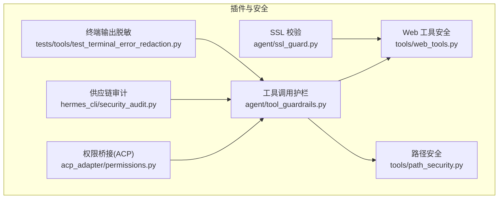
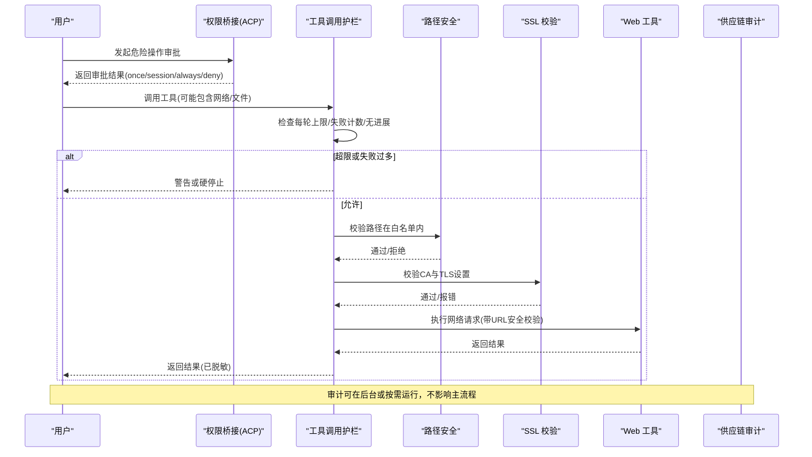
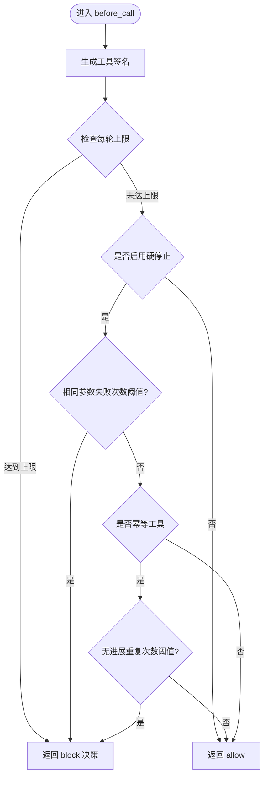
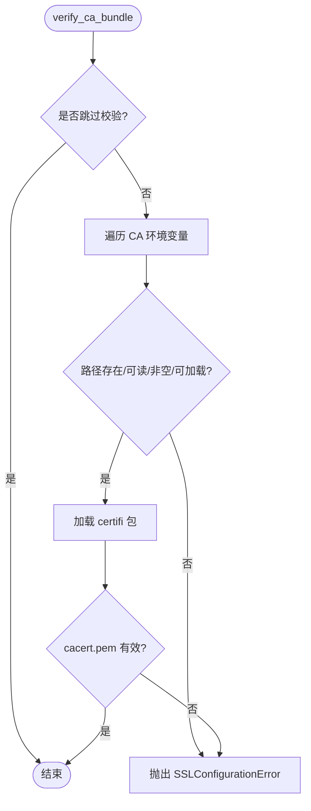
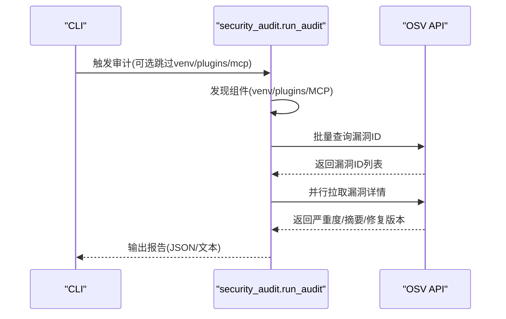
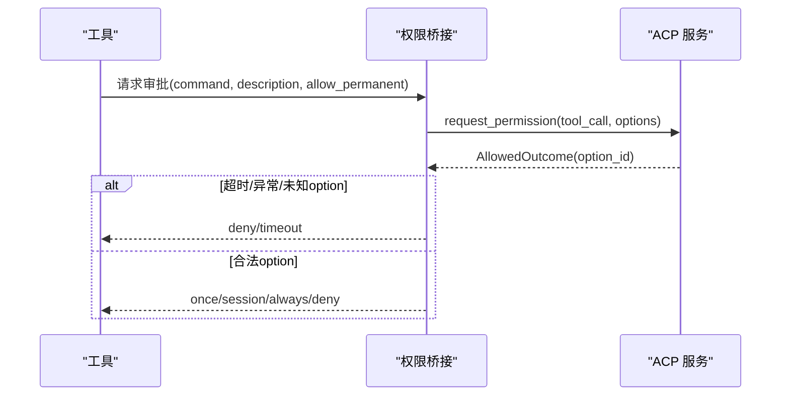
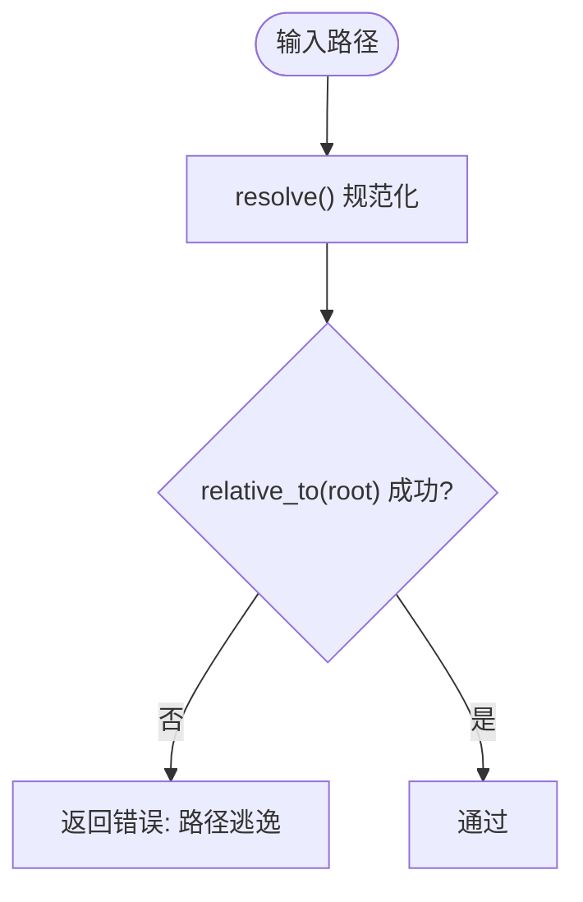
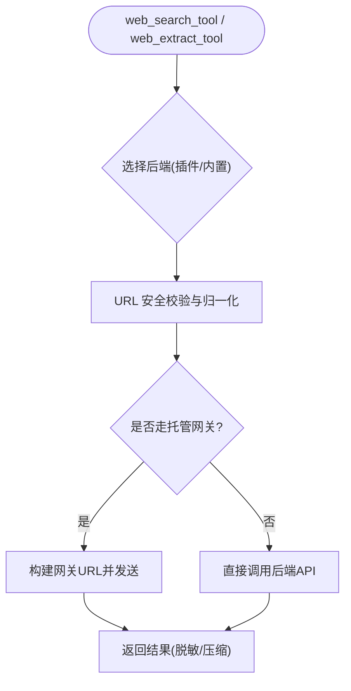
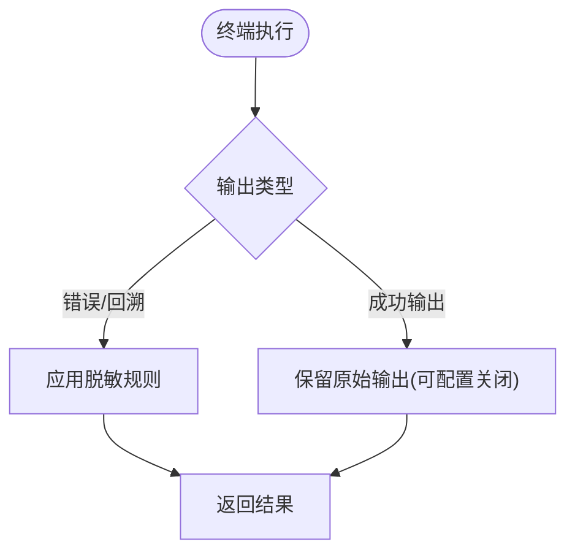
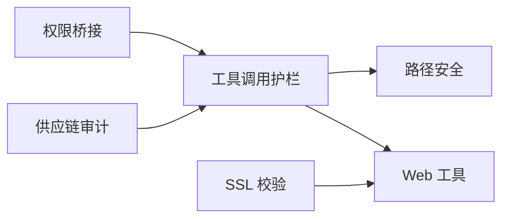

# 插件安全机制

<cite>
**本文引用的文件**
- [agent/tool_guardrails.py](file://agent/tool_guardrails.py)
- [agent/ssl_guard.py](file://agent/ssl_guard.py)
- [hermes_cli/security_audit.py](file://hermes_cli/security_audit.py)
- [acp_adapter/permissions.py](file://acp_adapter/permissions.py)
- [tools/path_security.py](file://tools/path_security.py)
- [tools/web_tools.py](file://tools/web_tools.py)
- [tests/tools/test_terminal_error_redaction.py](file://tests/tools/test_terminal_error_redaction.py)
</cite>

## 目录
1. [简介](#简介)
2. [项目结构](#项目结构)
3. [核心组件](#核心组件)
4. [架构总览](#架构总览)
5. [详细组件分析](#详细组件分析)
6. [依赖关系分析](#依赖关系分析)
7. [性能考量](#性能考量)
8. [故障排查指南](#故障排查指南)
9. [结论](#结论)
10. [附录](#附录)

## 简介
本文件面向 Hermes Agent 的“插件系统安全机制”，聚焦以下目标：
- 权限控制与审批：危险命令执行、工具调用、网络访问的安全边界。
- 代码签名验证与可信来源：对插件与外部依赖的可信性校验策略（以供应链审计为主）。
- 沙箱执行环境：进程隔离、路径限制、资源上限等。
- 访问控制策略：文件系统访问、网络请求限制、系统调用防护。
- 插件间数据隔离与共享边界：会话级、工具级隔离原则。
- 安全审计与监控：行为日志、异常检测、风险评估。
- 安全配置最佳实践与漏洞防护措施。

## 项目结构
围绕插件安全的关键模块分布如下：
- 工具调用护栏：在每轮对话中检测重复失败、无进展、失控循环，并支持硬停止。
- SSL/TLS 安全：启动时校验 CA 证书包完整性与可用性。
- 供应链审计：扫描 venv、用户插件声明依赖、MCP 服务器命令中的可审计组件，查询 OSV 获取漏洞信息。
- 权限桥接：将 ACP 的许可选项映射为 Hermes 的审批结果，用于危险命令审批流。
- 路径安全：统一的路径白名单校验，防止越权访问。
- Web 工具安全：URL 安全校验、敏感参数处理、受控后端选择。
- 终端输出脱敏：错误与回溯信息中的敏感内容自动脱敏。

**图表来源**
- [agent/tool_guardrails.py:273-508](file://agent/tool_guardrails.py#L273-L508)
- [agent/ssl_guard.py:68-101](file://agent/ssl_guard.py#L68-L101)
- [hermes_cli/security_audit.py:433-481](file://hermes_cli/security_audit.py#L433-L481)
- [acp_adapter/permissions.py:110-182](file://acp_adapter/permissions.py#L110-L182)
- [tools/path_security.py:15-34](file://tools/path_security.py#L15-L34)
- [tools/web_tools.py:106-200](file://tools/web_tools.py#L106-L200)
- [tests/tools/test_terminal_error_redaction.py:41-154](file://tests/tools/test_terminal_error_redaction.py#L41-L154)

**章节来源**
- [agent/tool_guardrails.py:20-83](file://agent/tool_guardrails.py#L20-L83)
- [agent/ssl_guard.py:18-66](file://agent/ssl_guard.py#L18-L66)
- [hermes_cli/security_audit.py:1-18](file://hermes_cli/security_audit.py#L1-L18)
- [acp_adapter/permissions.py:18-73](file://acp_adapter/permissions.py#L18-L73)
- [tools/path_security.py:1-44](file://tools/path_security.py#L1-L44)
- [tools/web_tools.py:1-100](file://tools/web_tools.py#L1-L100)
- [tests/tools/test_terminal_error_redaction.py:1-154](file://tests/tools/test_terminal_error_redaction.py#L1-L154)

## 核心组件
- 工具调用护栏（Tool Call Guardrails）
  - 识别幂等与变更型工具，统计重复失败、无进展、同工具失败次数，支持警告与硬停止。
  - 提供每轮上限（如 web_search、delegate_task），防止失控循环。
- SSL/TLS 校验（SSL Guard）
  - 启动前检查环境变量指定的 CA bundle 与内置 certifi 是否有效且可加载。
- 供应链审计（Security Audit）
  - 扫描 venv、用户插件 requirements/pyproject、MCP 命令中的版本化依赖，批量查询 OSV 获取漏洞详情。
- 权限桥接（ACP Permissions）
  - 将 ACP 的许可选项映射为 Hermes 的 once/session/always/deny 等审批结果，支持超时与异常兜底。
- 路径安全（Path Security）
  - 统一校验路径是否在允许根目录下，阻止目录穿越。
- Web 工具安全（Web Tools）
  - URL 安全校验、敏感查询参数处理、后端选择与网关路由。
- 终端输出脱敏（Terminal Redaction）
  - 错误与回溯信息中自动脱敏密钥类字符串，避免泄露。

**章节来源**
- [agent/tool_guardrails.py:273-508](file://agent/tool_guardrails.py#L273-L508)
- [agent/ssl_guard.py:68-101](file://agent/ssl_guard.py#L68-L101)
- [hermes_cli/security_audit.py:433-481](file://hermes_cli/security_audit.py#L433-L481)
- [acp_adapter/permissions.py:110-182](file://acp_adapter/permissions.py#L110-L182)
- [tools/path_security.py:15-34](file://tools/path_security.py#L15-L34)
- [tools/web_tools.py:106-200](file://tools/web_tools.py#L106-L200)
- [tests/tools/test_terminal_error_redaction.py:41-154](file://tests/tools/test_terminal_error_redaction.py#L41-L154)

## 架构总览
Hermes 插件安全通过多层防线协同工作：
- 入口层：权限审批（ACP）决定是否允许执行危险命令或工具。
- 执行层：工具调用护栏在每轮内限制高风险工具的调用频率与循环。
- 资源层：路径安全限制文件系统访问范围；SSL 校验确保网络通信可信。
- 审计层：供应链审计定期或按需扫描依赖漏洞，辅助风险决策。
- 输出层：终端输出脱敏防止敏感信息外泄。

**图表来源**
- [acp_adapter/permissions.py:110-182](file://acp_adapter/permissions.py#L110-L182)
- [agent/tool_guardrails.py:295-508](file://agent/tool_guardrails.py#L295-L508)
- [tools/path_security.py:15-34](file://tools/path_security.py#L15-L34)
- [agent/ssl_guard.py:68-101](file://agent/ssl_guard.py#L68-L101)
- [tools/web_tools.py:106-200](file://tools/web_tools.py#L106-L200)
- [hermes_cli/security_audit.py:433-481](file://hermes_cli/security_audit.py#L433-L481)

## 详细组件分析

### 工具调用护栏（Tool Call Guardrails）
- 设计要点
  - 区分幂等与变更型工具，分别跟踪失败与无进展。
  - 支持警告与硬停止两种策略，默认仅警告，硬停止需显式开启。
  - 每轮上限：web_search、delegate_task 等高风险工具有严格计数限制。
- 关键数据结构
  - ToolCallSignature：稳定标识工具名与规范化参数哈希。
  - ToolGuardrailDecision：动作（allow/warn/block/halt）、原因码、消息、计数、签名。
  - LoopCapConfig：每轮上限配置（max_web_searches、max_subagents）。
- 复杂度与性能
  - 每次调用 O(1) 更新计数与判定；哈希计算为 O(n) 基于参数大小。
  - 每轮重置计数器，避免跨轮累积导致的误判。
- 优化机会
  - 对超大参数进行截断后再哈希，减少开销。
  - 对高频工具增加本地缓存命中率判断，降低重复计算。

**图表来源**
- [agent/tool_guardrails.py:295-508](file://agent/tool_guardrails.py#L295-L508)

**章节来源**
- [agent/tool_guardrails.py:20-83](file://agent/tool_guardrails.py#L20-L83)
- [agent/tool_guardrails.py:176-223](file://agent/tool_guardrails.py#L176-L223)
- [agent/tool_guardrails.py:273-508](file://agent/tool_guardrails.py#L273-L508)

### SSL/TLS 校验（SSL Guard）
- 功能说明
  - 启动前检查 HERMES_CA_BUNDLE、SSL_CERT_FILE、REQUESTS_CA_BUNDLE、CURL_CA_BUNDLE 指向的 CA bundle 是否存在、可读、非空且可被 ssl.create_default_context 加载。
  - 校验内置 certifi 的 cacert.pem 是否完整（最小尺寸要求）并可加载证书列表。
- 错误处理
  - 抛出一致的 SSLConfigurationError，附带修复建议（重新安装 certifi/httpx/openai 或修正环境变量）。
- 可配置项
  - HERMES_SKIP_SSL_GUARD：跳过校验（调试场景慎用）。

**图表来源**
- [agent/ssl_guard.py:28-66](file://agent/ssl_guard.py#L28-L66)
- [agent/ssl_guard.py:68-101](file://agent/ssl_guard.py#L68-L101)

**章节来源**
- [agent/ssl_guard.py:1-102](file://agent/ssl_guard.py#L1-L102)

### 供应链审计（Security Audit）
- 扫描范围
  - venv 中所有 PyPI 包。
  - 用户插件目录下的 requirements.txt 与 pyproject.toml 中的精确版本依赖。
  - config.yaml 中 MCP 服务器的 npx/uvx 命令解析出的版本化包。
- 漏洞查询
  - 使用 OSV.dev 批量查询接口，按严重度排序，支持 JSON 与人类可读输出。
  - 支持 --fail-on 阈值控制退出码，便于 CI 集成。
- 并发与容错
  - 并行拉取漏洞详情，网络异常时降级为未知严重度。

**图表来源**
- [hermes_cli/security_audit.py:433-481](file://hermes_cli/security_audit.py#L433-L481)
- [hermes_cli/security_audit.py:300-408](file://hermes_cli/security_audit.py#L300-L408)

**章节来源**
- [hermes_cli/security_audit.py:1-18](file://hermes_cli/security_audit.py#L1-L18)
- [hermes_cli/security_audit.py:84-200](file://hermes_cli/security_audit.py#L84-L200)
- [hermes_cli/security_audit.py:258-279](file://hermes_cli/security_audit.py#L258-L279)
- [hermes_cli/security_audit.py:433-481](file://hermes_cli/security_audit.py#L433-L481)

### 权限桥接（ACP Permissions）
- 作用
  - 将 ACP 的许可选项（allow_once/allow_session/allow_always/deny/deny_always）映射为 Hermes 的审批结果（once/session/always/deny/timeout）。
  - 构建工具调用更新（ToolCallUpdate）以便在 UI 中展示待审批的命令。
- 超时与异常
  - 等待响应超时返回 timeout；异常或未知 option_id 返回 deny。
- 安全性
  - 仅接受已知选项 ID，未知一律拒绝，避免越权。

**图表来源**
- [acp_adapter/permissions.py:41-73](file://acp_adapter/permissions.py#L41-L73)
- [acp_adapter/permissions.py:98-182](file://acp_adapter/permissions.py#L98-L182)

**章节来源**
- [acp_adapter/permissions.py:18-73](file://acp_adapter/permissions.py#L18-L73)
- [acp_adapter/permissions.py:110-182](file://acp_adapter/permissions.py#L110-L182)

### 路径安全（Path Security）
- 功能
  - validate_within_dir：确保目标路径在允许的根目录内，遵循符号链接与相对路径解析。
  - has_traversal_component：快速检测路径中是否包含 .. 穿越组件。
- 使用场景
  - 文件读写、技能管理、凭证访问等工具统一调用，防止越权访问。

**图表来源**
- [tools/path_security.py:15-34](file://tools/path_security.py#L15-L34)

**章节来源**
- [tools/path_security.py:1-44](file://tools/path_security.py#L1-L44)

### Web 工具安全（Web Tools）
- 功能
  - 后端选择：支持 Firecrawl、Tavily、Parallel、Exa 等，优先通过插件注册表解析。
  - URL 安全：normalize_url_for_request、async_is_safe_url、敏感查询参数过滤。
  - 网关路由：可选通过托管工具网关（Nous Subscribers）转发请求。
- 安全点
  - 拒绝缺失或非字符串 URL；对模型提供的混合结构进行健壮解析。
  - 通过插件提供者实现统一的客户端构造与响应归一化。

**图表来源**
- [tools/web_tools.py:106-200](file://tools/web_tools.py#L106-L200)

**章节来源**
- [tools/web_tools.py:1-100](file://tools/web_tools.py#L1-L100)
- [tools/web_tools.py:106-200](file://tools/web_tools.py#L106-L200)

### 终端输出脱敏（Terminal Redaction）
- 功能
  - 在终端工具的错误与回溯信息中自动脱敏密钥类字符串，避免泄露。
  - 支持命令感知的脱敏策略，可按命令上下文调整。
- 测试覆盖
  - 覆盖前台重试错误、背景启动错误、导入错误、外层异常等多种场景。

**图表来源**
- [tests/tools/test_terminal_error_redaction.py:41-154](file://tests/tools/test_terminal_error_redaction.py#L41-L154)

**章节来源**
- [tests/tools/test_terminal_error_redaction.py:1-154](file://tests/tools/test_terminal_error_redaction.py#L1-L154)

## 依赖关系分析
- 组件耦合
  - 工具调用护栏依赖路径安全与 Web 工具安全，形成执行期约束。
  - 权限桥接位于审批入口，影响后续工具调用是否放行。
  - SSL 校验作为前置条件，保障网络通信可信。
  - 供应链审计独立于运行时，提供离线/按需风险评估。
- 外部依赖
  - OSV.dev 用于漏洞查询。
  - certifi/httpx/OpenAI 等库的 CA bundle 由 SSL 校验保障。
  - ACP SDK 用于权限交互。

**图表来源**
- [acp_adapter/permissions.py:110-182](file://acp_adapter/permissions.py#L110-L182)
- [agent/tool_guardrails.py:295-508](file://agent/tool_guardrails.py#L295-L508)
- [tools/path_security.py:15-34](file://tools/path_security.py#L15-L34)
- [tools/web_tools.py:106-200](file://tools/web_tools.py#L106-L200)
- [agent/ssl_guard.py:68-101](file://agent/ssl_guard.py#L68-L101)
- [hermes_cli/security_audit.py:433-481](file://hermes_cli/security_audit.py#L433-L481)

**章节来源**
- [agent/tool_guardrails.py:295-508](file://agent/tool_guardrails.py#L295-L508)
- [tools/web_tools.py:106-200](file://tools/web_tools.py#L106-L200)
- [agent/ssl_guard.py:68-101](file://agent/ssl_guard.py#L68-L101)
- [hermes_cli/security_audit.py:433-481](file://hermes_cli/security_audit.py#L433-L481)

## 性能考量
- 工具调用护栏
  - 每轮计数器重置，避免长期累积；哈希计算对大参数可能带来开销，建议截断。
- SSL 校验
  - 启动时一次性校验，避免运行时重复；certifi 加载失败会快速失败。
- 供应链审计
  - 批量查询 OSV，并行拉取详情；网络异常时降级，不阻塞主流程。
- Web 工具
  - 后端选择与网关路由可能引入额外延迟；缓存客户端实例以减少重建成本。

[本节为通用指导，无需特定文件引用]

## 故障排查指南
- SSL 配置错误
  - 现象：网络请求报 FileNotFoundError 或证书加载失败。
  - 处理：运行 hermes doctor --fix 或手动重装 certifi/httpx/openai；检查自定义 CA bundle 环境变量。
- 工具调用失控
  - 现象：同一工具反复失败或无进展。
  - 处理：查看护栏警告/硬停止消息；调整参数或更换工具路径。
- 权限审批超时
  - 现象：危险命令长时间无响应。
  - 处理：检查 ACP 连接状态；确认用户界面是否收到审批请求。
- 供应链漏洞
  - 现象：审计发现高危漏洞。
  - 处理：升级至修复版本；必要时隔离受影响插件或 MCP 服务器。

**章节来源**
- [agent/ssl_guard.py:32-43](file://agent/ssl_guard.py#L32-L43)
- [agent/tool_guardrails.py:311-440](file://agent/tool_guardrails.py#L311-L440)
- [acp_adapter/permissions.py:159-182](file://acp_adapter/permissions.py#L159-L182)
- [hermes_cli/security_audit.py:539-590](file://hermes_cli/security_audit.py#L539-L590)

## 结论
Hermes Agent 的插件安全机制通过权限审批、工具调用护栏、路径与网络校验、供应链审计与输出脱敏等多层防护，构建了从入口到输出的全链路安全体系。建议在部署中启用硬停止策略、严格路径白名单、强制 SSL 校验，并定期运行供应链审计，结合 ACP 审批流程，确保插件行为可控、可审计、可恢复。

[本节为总结性内容，无需特定文件引用]

## 附录
- 安全配置最佳实践
  - 启用工具调用护栏的硬停止（hard_stop_enabled=true），并合理设置阈值。
  - 固定插件依赖版本，避免模糊 pin；定期运行 hermes security audit。
  - 使用托管工具网关（如适用）集中管控网络出口。
  - 禁止在生产环境设置 HERMES_SKIP_SSL_GUARD。
- 漏洞防护措施
  - 对插件目录进行只读挂载与最小权限运行。
  - 对 MCP 服务器命令进行白名单校验，仅允许版本化包。
  - 对终端输出启用命令感知脱敏，避免密钥泄露。

[本节为通用指导，无需特定文件引用]