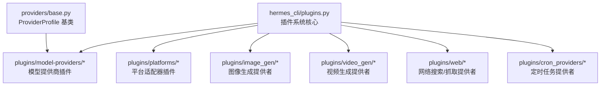
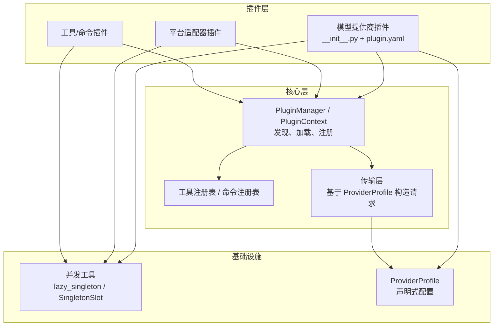
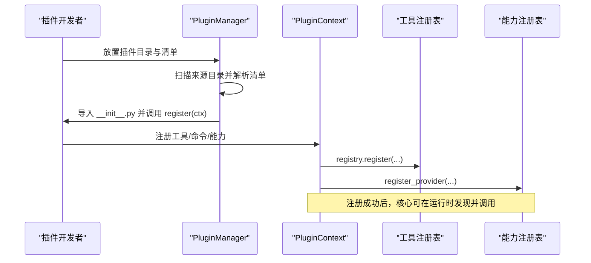
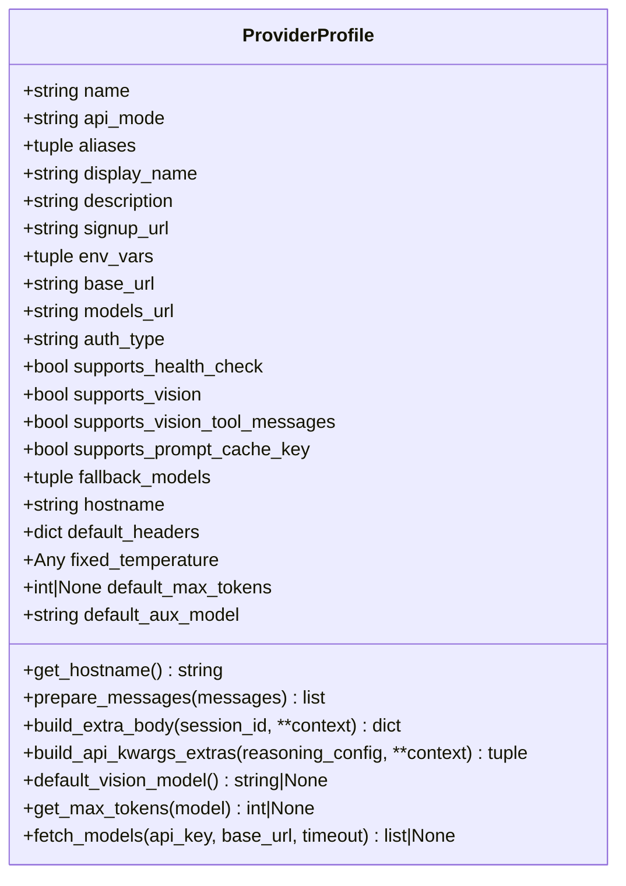
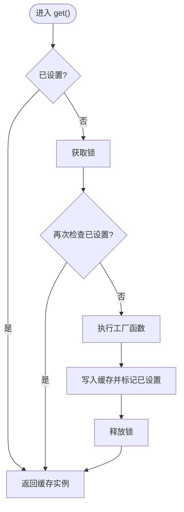
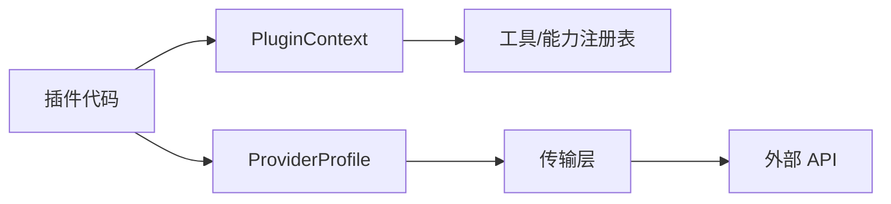

# 插件开发指南

<cite>
**本文引用的文件**
- [hermes_cli/plugins.py](file://hermes_cli/plugins.py)
- [providers/base.py](file://providers/base.py)
- [plugins/model-providers/README.md](file://plugins/model-providers/README.md)
- [plugins/plugin_utils.py](file://plugins/plugin_utils.py)
</cite>

## 目录
1. [简介](#简介)
2. [项目结构](#项目结构)
3. [核心组件](#核心组件)
4. [架构总览](#架构总览)
5. [详细组件分析](#详细组件分析)
6. [依赖关系分析](#依赖关系分析)
7. [性能考虑](#性能考虑)
8. [故障排查指南](#故障排查指南)
9. [结论](#结论)
10. [附录](#附录)

## 简介
本指南面向 Hermes Agent 插件开发者，提供从零开始开发插件的完整流程与最佳实践。内容涵盖：
- 开发环境搭建与项目结构规划
- 插件类型与接口实现要点（模型提供商、平台适配器、工具等）
- 配置管理、依赖声明与资源组织
- 测试编写与调试技巧
- 打包、发布与分发流程

Hermes 插件系统支持多种来源加载插件（内置、用户目录、项目目录、pip 入口点），并通过统一的清单与注册机制进行发现与管理。不同插件类型通过各自注册点接入系统，例如模型提供商通过 ProviderProfile 声明式注册，平台适配器通过平台注册表接入，工具通过工具注册表暴露能力。

## 项目结构
Hermes 将插件按功能域分目录组织，便于扩展与维护：
- plugins/model-providers：模型提供商插件集合，每个子目录为一个自包含的 ProviderProfile 插件
- plugins/platforms：网关消息平台适配器插件集合
- plugins/image_gen、plugins/video_gen、plugins/web、plugins/cron_providers 等：各类能力提供者插件
- hermes_cli/plugins.py：插件系统核心，负责发现、加载、生命周期钩子、工具/命令注册等
- providers/base.py：ProviderProfile 基类，用于声明式描述模型提供商行为

图表来源
- [hermes_cli/plugins.py:1-32](file://hermes_cli/plugins.py#L1-L32)
- [providers/base.py:1-10](file://providers/base.py#L1-L10)

章节来源
- [hermes_cli/plugins.py:1-32](file://hermes_cli/plugins.py#L1-L32)
- [providers/base.py:1-10](file://providers/base.py#L1-L10)

## 核心组件
- 插件管理器与上下文
  - 插件发现与加载：从多个来源扫描并导入插件模块，解析 plugin.yaml 清单，调用 register(ctx) 完成注册
  - PluginContext：提供给插件的注册门面，支持工具、CLI 命令、斜杠命令、上下文引擎、图像/视频生成提供者、仪表盘认证提供者等注册
- 模型提供商 Profile
  - ProviderProfile：声明式描述提供商身份、鉴权、端点、能力、请求级特性与模型目录获取逻辑；传输层据此构造请求，无需在核心中硬编码分支
- 并发安全工具
  - lazy_singleton、SingletonSlot：为插件提供线程安全的懒加载单例与带键槽位缓存，避免全局单例竞态导致的资源泄漏

章节来源
- [hermes_cli/plugins.py:368-800](file://hermes_cli/plugins.py#L368-L800)
- [providers/base.py:38-239](file://providers/base.py#L38-L239)
- [plugins/plugin_utils.py:1-136](file://plugins/plugin_utils.py#L1-L136)

## 架构总览
下图展示了插件系统与核心组件的交互关系：插件通过 PluginContext 注册能力，模型提供商通过 ProviderProfile 声明式接入，传输层依据 Profile 构建请求；并发工具保障单例初始化安全。

图表来源
- [hermes_cli/plugins.py:1-32](file://hermes_cli/plugins.py#L1-L32)
- [providers/base.py:38-239](file://providers/base.py#L38-L239)
- [plugins/plugin_utils.py:43-136](file://plugins/plugin_utils.py#L43-L136)

## 详细组件分析

### 插件系统核心（hermes_cli/plugins.py）
- 插件来源与覆盖策略
  - 内置插件、用户插件、项目插件、pip 入口点；同名插件后加载者覆盖前者
- 清单与生命周期
  - 每个目录插件需包含 plugin.yaml 与 __init__.py，后者提供 register(ctx)
  - 支持丰富的生命周期钩子（工具调用前后、LLM 调用前后、会话生命周期、网关前置分发、审批生命周期、看板任务状态变更等）
- 工具与命令注册
  - 通过 PluginContext.register_tool 注册工具，支持覆盖内置工具的受控开关
  - 支持 CLI 子命令与对话内斜杠命令注册
- 能力提供者注册
  - 上下文引擎、图像/视频生成提供者、仪表盘认证提供者、网络搜索/提取提供者等统一注册入口

图表来源
- [hermes_cli/plugins.py:1-32](file://hermes_cli/plugins.py#L1-L32)
- [hermes_cli/plugins.py:368-800](file://hermes_cli/plugins.py#L368-L800)

章节来源
- [hermes_cli/plugins.py:1-32](file://hermes_cli/plugins.py#L1-L32)
- [hermes_cli/plugins.py:368-800](file://hermes_cli/plugins.py#L368-L800)

### 模型提供商插件（ProviderProfile）
- 声明式配置
  - 名称、别名、显示名、描述、注册链接、环境变量、基础 URL、鉴权类型、健康检查支持、视觉能力、提示词缓存键支持、默认辅助模型、最大令牌数等
- 请求级钩子
  - prepare_messages、build_extra_body、build_api_kwargs_extras、default_vision_model、get_max_tokens
- 模型目录获取
  - fetch_models 支持显式 models_url、base_url 推导与标准 OpenAI 兼容路径，自动设置 UA 与安全访问

图表来源
- [providers/base.py:38-239](file://providers/base.py#L38-L239)

章节来源
- [providers/base.py:38-239](file://providers/base.py#L38-L239)
- [plugins/model-providers/README.md:1-71](file://plugins/model-providers/README.md#L1-L71)

### 并发安全工具（lazy_singleton / SingletonSlot）
- 使用场景
  - 避免进程级全局单例在多线程下的竞态条件导致重复初始化与资源泄漏
- 能力
  - lazy_singleton：零参工厂的线程安全懒加载单例，附带 reset 方法便于测试清理
  - SingletonSlot：带键槽位的线程安全缓存，首次成功构建后忽略后续参数，符合“首个配置获胜”的常见语义

图表来源
- [plugins/plugin_utils.py:84-136](file://plugins/plugin_utils.py#L84-L136)

章节来源
- [plugins/plugin_utils.py:1-136](file://plugins/plugin_utils.py#L1-L136)

### 不同类型插件的开发要点
- 模型提供商插件
  - 创建 __init__.py 定义 ProviderProfile 并调用注册函数
  - 创建 plugin.yaml 清单（name、kind、version、description、author）
  - 非平凡场景可继承 ProviderProfile 重写钩子（如 build_extra_body、build_api_kwargs_extras、thinking_config 转换等）
- 平台适配器插件
  - 遵循平台插件目录结构与注册约定，通过插件系统加载并在网关层接入消息路由
- 工具插件
  - 通过 PluginContext.register_tool 注册工具，必要时启用 allow_tool_override 以替换内置工具（需配置授权）
- 其他能力提供者
  - 图像/视频生成、网络搜索/提取、定时任务等，均通过对应注册入口注入

章节来源
- [plugins/model-providers/README.md:1-71](file://plugins/model-providers/README.md#L1-L71)
- [hermes_cli/plugins.py:368-800](file://hermes_cli/plugins.py#L368-L800)

## 依赖关系分析
- 插件与核心耦合点
  - 插件通过 PluginContext 与核心交互，降低直接依赖
  - 模型提供商通过 ProviderProfile 与传输层解耦，仅声明行为
- 外部依赖
  - 模型目录获取使用 urllib 与安全访问封装，设置稳定 UA 以避免 WAF 拦截
- 潜在循环依赖
  - 通过延迟导入（如 hermes_cli.__version__）避免导入时循环

图表来源
- [hermes_cli/plugins.py:368-800](file://hermes_cli/plugins.py#L368-L800)
- [providers/base.py:38-239](file://providers/base.py#L38-L239)

章节来源
- [hermes_cli/plugins.py:368-800](file://hermes_cli/plugins.py#L368-L800)
- [providers/base.py:38-239](file://providers/base.py#L38-L239)

## 性能考虑
- 懒加载与单例
  - 使用 lazy_singleton/SingletonSlot 减少昂贵对象重复创建，提升并发安全性与性能
- 模型目录获取
  - fetch_models 具备超时控制与异常降级，避免阻塞启动或探测流程
- 钩子执行
  - 生命周期钩子应在插件中保持轻量，避免阻塞主流程；必要时采用异步或后台任务

[本节提供通用指导，不直接分析具体文件]

## 故障排查指南
- 启用插件调试日志
  - 设置 HERMES_PLUGINS_DEBUG=1，可在 stderr 输出详细的插件发现与加载日志，便于定位未加载原因
- 常见问题
  - 插件未加载：检查目录结构、plugin.yaml 是否完整、register(ctx) 是否正确调用
  - 工具冲突：若尝试覆盖内置工具，需在配置中开启 allow_tool_override
  - 模型目录获取失败：检查 base_url/models_url、鉴权头、UA 设置与网络可达性
- 日志位置
  - 插件日志同时写入 ~/.hermes/logs/agent.log，stderr 仅在调试模式下输出

章节来源
- [hermes_cli/plugins.py:83-130](file://hermes_cli/plugins.py#L83-L130)
- [providers/base.py:200-239](file://providers/base.py#L200-L239)

## 结论
Hermes 插件系统通过声明式 ProviderProfile 与统一的 PluginContext 注册机制，实现了高度可扩展的模型提供商、平台适配器与工具生态。开发者只需遵循目录规范、清单格式与注册约定，即可快速集成新能力。借助并发安全工具与完善的调试手段，可高效开发与维护高质量插件。

[本节为总结性内容，不直接分析具体文件]

## 附录

### 从零开始开发插件的步骤
- 环境准备
  - 安装 Hermes 并准备开发目录
  - 根据需要启用项目级插件（HERMES_ENABLE_PROJECT_PLUGINS）
- 项目结构
  - 在 plugins/<category>/<your_plugin>/ 下创建 __init__.py 与 plugin.yaml
  - 在 __init__.py 中实现 register(ctx) 并完成注册
- 接口实现
  - 模型提供商：定义 ProviderProfile 并调用注册函数
  - 工具/命令：通过 PluginContext 注册工具与命令
  - 能力提供者：按对应注册入口注入
- 配置管理
  - 在 plugin.yaml 中声明 name、kind、version、description、author
  - 如需环境变量，可在 requires_env 中声明
- 资源组织
  - 将静态资源与配置文件放入插件目录，按需加载
- 测试与调试
  - 使用 pytest 编写单元测试，利用 lazy_singleton.reset 清理状态
  - 启用 HERMES_PLUGINS_DEBUG=1 查看详细日志
- 打包与发布
  - 将插件作为独立包发布到 pip，或通过 entry_points 暴露 hermes_agent.plugins 组
  - 用户可通过 pip 安装或在 ~/.hermes/plugins/ 放置目录插件

[本节为流程性说明，不直接分析具体文件]