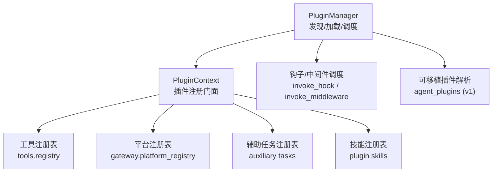
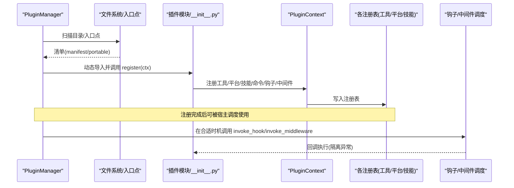
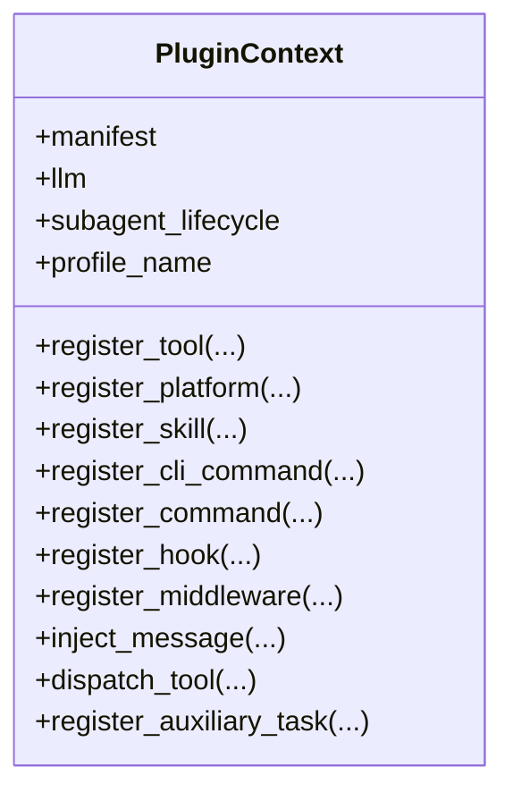
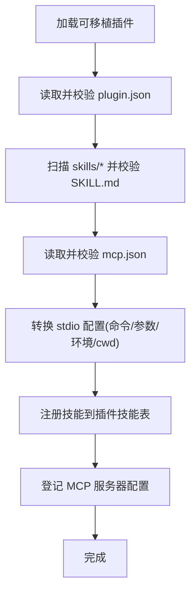
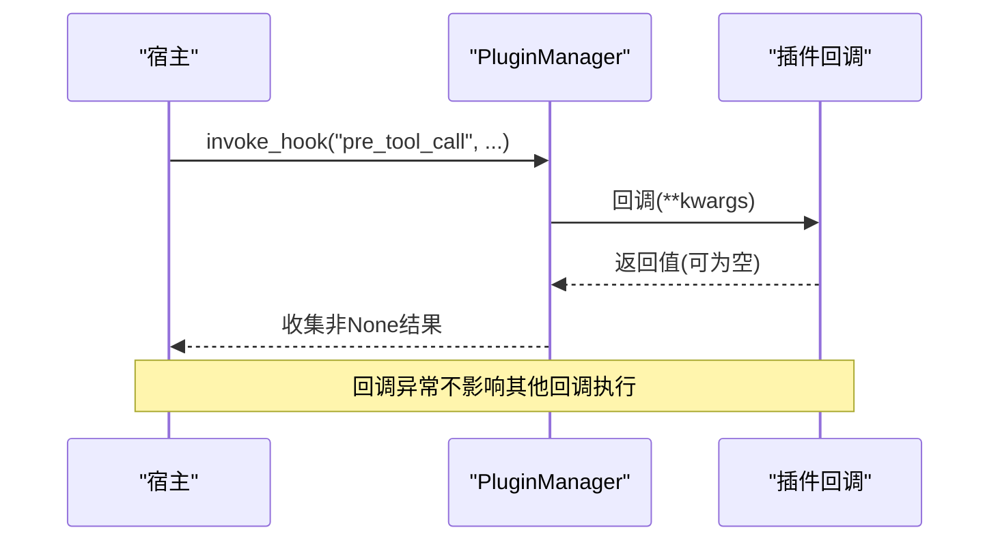
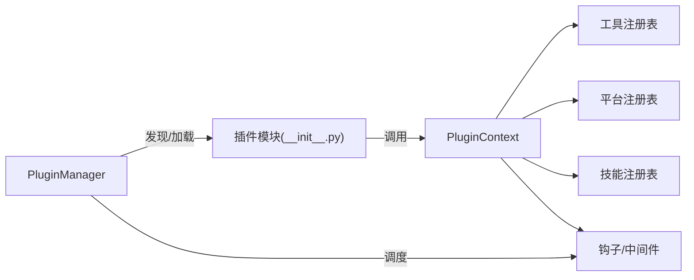

# 插件接口规范

<cite>
**本文引用的文件**
- [hermes_cli/plugins.py](file://hermes_cli/plugins.py)
- [hermes_cli/agent_plugins.py](file://hermes_cli/agent_plugins.py)
- [plugins/plugin_utils.py](file://plugins/plugin_utils.py)
- [agent/plugin_llm.py](file://agent/plugin_llm.py)
</cite>

## 目录
1. [简介](#简介)
2. [项目结构](#项目结构)
3. [核心组件](#核心组件)
4. [架构总览](#架构总览)
5. [详细组件分析](#详细组件分析)
6. [依赖关系分析](#依赖关系分析)
7. [性能考量](#性能考量)
8. [故障排查指南](#故障排查指南)
9. [结论](#结论)
10. [附录](#附录)

## 简介
本规范面向 Hermes Agent 的插件开发者，系统化说明插件如何接入、注册能力、参与生命周期事件、与宿主及其他插件通信。文档覆盖：
- 插件基础类与抽象方法（以 PluginContext 为核心）
- 生命周期钩子与中间件机制
- 插件发现、加载与启用策略
- 插件间通信协议与数据交换格式（工具调用、消息注入、辅助任务等）
- 错误处理与安全边界（工具覆盖、LLM 访问控制、可移植包校验）
- 实现示例路径与验证方法

## 项目结构
Hermes 插件系统由“发现—加载—注册—运行”四阶段构成，核心位于 CLI 层，运行时通过工具注册表、平台注册表、辅助任务注册表等进行扩展。



图表来源
- [hermes_cli/plugins.py:1309-1336](file://hermes_cli/plugins.py#L1309-L1336)
- [hermes_cli/plugins.py:1341-1494](file://hermes_cli/plugins.py#L1341-L1494)
- [hermes_cli/plugins.py:1607-1716](file://hermes_cli/plugins.py#L1607-L1716)
- [hermes_cli/plugins.py:1903-1989](file://hermes_cli/plugins.py#L1903-L1989)
- [hermes_cli/plugins.py:2103-2169](file://hermes_cli/plugins.py#L2103-L2169)
- [hermes_cli/agent_plugins.py:451-475](file://hermes_cli/agent_plugins.py#L451-L475)

章节来源
- [hermes_cli/plugins.py:1-32](file://hermes_cli/plugins.py#L1-L32)
- [hermes_cli/plugins.py:1309-1336](file://hermes_cli/plugins.py#L1309-L1336)
- [hermes_cli/plugins.py:1341-1494](file://hermes_cli/plugins.py#L1341-L1494)
- [hermes_cli/plugins.py:1607-1716](file://hermes_cli/plugins.py#L1607-L1716)
- [hermes_cli/plugins.py:1903-1989](file://hermes_cli/plugins.py#L1903-L1989)
- [hermes_cli/plugins.py:2103-2169](file://hermes_cli/plugins.py#L2103-L2169)
- [hermes_cli/agent_plugins.py:451-475](file://hermes_cli/agent_plugins.py#L451-L475)

## 核心组件
- PluginContext：插件在 register(ctx) 中使用的统一门面，提供工具、平台、技能、命令、钩子、中间件、消息注入、LLM 访问等注册能力。
- PluginManager：负责插件发现、清单解析、模块加载、钩子/中间件调度、可移植包解析与集成。
- 可移植插件解析器（Agent Plugins v1）：在不导入 Python 代码的前提下，校验并翻译 plugin.json/mcp.json/SKILL.md 为内部记录。
- 并发安全原语：lazy_singleton、SingletonSlot，避免插件内全局单例的竞态问题。

章节来源
- [hermes_cli/plugins.py:368-1303](file://hermes_cli/plugins.py#L368-L1303)
- [hermes_cli/plugins.py:1309-2258](file://hermes_cli/plugins.py#L1309-L2258)
- [hermes_cli/agent_plugins.py:47-77](file://hermes_cli/agent_plugins.py#L47-L77)
- [hermes_cli/agent_plugins.py:97-155](file://hermes_cli/agent_plugins.py#L97-L155)
- [hermes_cli/agent_plugins.py:192-252](file://hermes_cli/agent_plugins.py#L192-L252)
- [hermes_cli/agent_plugins.py:310-448](file://hermes_cli/agent_plugins.py#L310-L448)
- [hermes_cli/agent_plugins.py:451-475](file://hermes_cli/agent_plugins.py#L451-L475)
- [plugins/plugin_utils.py:43-136](file://plugins/plugin_utils.py#L43-L136)

## 架构总览
插件从“清单发现”到“能力注册”，再到“运行时钩子/中间件触发”，形成闭环。可移植插件通过 JSON/YAML 声明式配置，无需执行任意 Python 即可被识别和集成。



图表来源
- [hermes_cli/plugins.py:1341-1494](file://hermes_cli/plugins.py#L1341-L1494)
- [hermes_cli/plugins.py:1903-1989](file://hermes_cli/plugins.py#L1903-L1989)
- [hermes_cli/plugins.py:2103-2169](file://hermes_cli/plugins.py#L2103-L2169)

## 详细组件分析

### 插件上下文与注册能力（PluginContext）
- 工具注册：register_tool(name, toolset, schema, handler, ...) 将工具加入全局注册表，支持异步、环境变量要求、描述与表情；可通过 override 替换内置工具（需显式授权）。
- 平台注册：register_platform(...) 向 gateway 平台注册表登记适配器工厂与依赖检查函数。
- 技能注册：register_skill(name, path, description, frontmatter) 注册只读技能，命名空间基于插件名。
- 命令注册：register_cli_command(...) 与 register_command(...) 分别注册 CLI 子命令与会话斜杠命令。
- 钩子/中间件：register_hook(hook_name, callback)、register_middleware(kind, callback)。
- 消息注入：inject_message(content, role) 将外部消息注入会话或中断当前轮次。
- 工具分发：dispatch_tool(tool_name, args, **kwargs) 通过注册表调用工具，自动注入父代理上下文。
- LLM 访问：ctx.llm 提供受控的宿主模型调用能力（信任策略与覆盖权限由配置控制）。
- 辅助任务：register_auxiliary_task(key, display_name, description, defaults) 声明新的辅助 LLM 任务。



图表来源
- [hermes_cli/plugins.py:368-1303](file://hermes_cli/plugins.py#L368-L1303)

章节来源
- [hermes_cli/plugins.py:368-1303](file://hermes_cli/plugins.py#L368-L1303)

### 插件管理器（PluginManager）
- 发现与加载：discover_and_load(force) 扫描 bundled/user/project/entrypoint 四类来源，解析 manifest/portable，按 kind/source 差异化处理（exclusive/model-provider/backend/platform 等）。
- 目录扫描：_scan_directory/_scan_directory_level 支持扁平与分类目录布局，深度限制为两层。
- 清单解析：_parse_manifest 读取 plugin.yaml/yml，推断 kind，兼容 portable plugin.json。
- 模块加载：_load_plugin 动态导入 __init__.py 并调用 register(ctx)，统计本次注册的 tool/hook/middleware/command 数量。
- 可移植插件：_load_portable_plugin 调用 agent_plugins 解析 skill/mcp，不执行任意 Python。
- 钩子/中间件：invoke_hook/invoke_middleware 逐个回调并隔离异常，返回非 None 结果列表。
- 可插拔能力：list_plugins/find_plugin_skill/get_portable_mcp_servers 等用于诊断与集成。

```mermaid
flowchart TD
Start(["开始 discover_and_load"]) --> Scan["扫描目录/入口点"]
Scan --> Parse["解析清单(manifest/portable)"]
Parse --> Decide{"kind/source?"}
Decide --> |exclusive/model-provider| Skip["跳过通用加载"]
Decide --> |backend(platform/bundled)| AutoLoad["自动加载/延迟加载"]
Decide --> |standalone/user| EnableCheck{"是否启用?"}
EnableCheck --> |否| MarkDisabled["标记未启用"]
EnableCheck --> |是| LoadModule["动态导入并调用 register(ctx)"]
LoadModule --> Stats["统计注册项"]
AutoLoad --> Stats
Skip --> Stats
Stats --> End(["结束"])
```

图表来源
- [hermes_cli/plugins.py:1341-1494](file://hermes_cli/plugins.py#L1341-L1494)
- [hermes_cli/plugins.py:1607-1716](file://hermes_cli/plugins.py#L1607-L1716)
- [hermes_cli/plugins.py:1903-1989](file://hermes_cli/plugins.py#L1903-L1989)

章节来源
- [hermes_cli/plugins.py:1309-2258](file://hermes_cli/plugins.py#L1309-L2258)

### 可移植插件（Agent Plugins v1）
- 清单校验：plugin.json 必须声明 $schema 为 v1，字段白名单严格校验，author/keywords/extensions 等可选字段类型约束。
- 技能发现：skills/<name>/SKILL.md 前导 YAML frontmatter 校验 name/description/license/compatibility/metadata/allowed-tools。
- MCP 服务器：mcp.json 声明 mcpServers，仅支持 stdio 类型；streamable-http/sse 暂不支持；cwd/env/command 参数安全展开与校验。
- 数据根：PLUGIN_DATA 路径按需创建，避免污染插件根目录。
- 诊断：组件级失败以 diagnostics 形式返回，不阻断整体加载。



图表来源
- [hermes_cli/agent_plugins.py:97-155](file://hermes_cli/agent_plugins.py#L97-L155)
- [hermes_cli/agent_plugins.py:192-252](file://hermes_cli/agent_plugins.py#L192-L252)
- [hermes_cli/agent_plugins.py:310-448](file://hermes_cli/agent_plugins.py#L310-L448)
- [hermes_cli/agent_plugins.py:451-475](file://hermes_cli/agent_plugins.py#L451-L475)

章节来源
- [hermes_cli/agent_plugins.py:47-77](file://hermes_cli/agent_plugins.py#L47-L77)
- [hermes_cli/agent_plugins.py:97-155](file://hermes_cli/agent_plugins.py#L97-L155)
- [hermes_cli/agent_plugins.py:192-252](file://hermes_cli/agent_plugins.py#L192-L252)
- [hermes_cli/agent_plugins.py:310-448](file://hermes_cli/agent_plugins.py#L310-L448)
- [hermes_cli/agent_plugins.py:451-475](file://hermes_cli/agent_plugins.py#L451-L475)

### 生命周期钩子与中间件
- 钩子集合 VALID_HOOKS 包含 pre/post_tool_call、pre/post_llm_call、transform_*、pre_verify、on_session_*、kanban_*、pre_approval_request 等。
- 插件通过 register_hook 注册回调；宿主在关键路径调用 invoke_hook，每个回调独立 try/except，确保健壮性。
- 中间件 register_middleware 允许改写请求/执行行为，未知 kind 会警告但保留向前兼容。



图表来源
- [hermes_cli/plugins.py:136-219](file://hermes_cli/plugins.py#L136-L219)
- [hermes_cli/plugins.py:2103-2169](file://hermes_cli/plugins.py#L2103-L2169)

章节来源
- [hermes_cli/plugins.py:136-219](file://hermes_cli/plugins.py#L136-L219)
- [hermes_cli/plugins.py:2103-2169](file://hermes_cli/plugins.py#L2103-L2169)

### 插件间通信协议与数据交换
- 工具调用：通过 ctx.dispatch_tool 或 tools.registry 调用，参数为工具定义 schema 对应的字典，返回 JSON 字符串（与模型工具调用一致）。
- 消息注入：ctx.inject_message 将文本注入会话，支持角色区分；若代理忙碌则中断当前轮次。
- 辅助任务：register_auxiliary_task 声明新任务键与默认路由字段，宿主在启动时桥接配置与环境变量。
- 平台适配：register_platform 暴露适配器工厂与依赖探测，供网关/定时任务/发送消息等路径按需加载。
- 斜杠命令：register_command 提供会话内快捷命令，支持参数提示，便于不同平台展示。

章节来源
- [hermes_cli/plugins.py:439-490](file://hermes_cli/plugins.py#L439-L490)
- [hermes_cli/plugins.py:524-548](file://hermes_cli/plugins.py#L524-L548)
- [hermes_cli/plugins.py:552-629](file://hermes_cli/plugins.py#L552-L629)
- [hermes_cli/plugins.py:633-660](file://hermes_cli/plugins.py#L633-L660)
- [hermes_cli/plugins.py:979-1039](file://hermes_cli/plugins.py#L979-L1039)
- [hermes_cli/plugins.py:1103-1212](file://hermes_cli/plugins.py#L1103-L1212)

### 安全与信任边界
- 工具覆盖保护：override=True 替换内置工具需显式配置 allow_tool_override，否则抛出 PluginToolOverrideError。
- LLM 访问控制：ctx.llm 受 trust policy 与配置项控制，防止未授权覆盖模型/认证。
- 可移植包安全：路径展开限制在 PLUGIN_ROOT/PLUGIN_DATA 下，禁止逃逸；命令白名单与头部校验。
- 并发安全：提供 lazy_singleton/SingletonSlot 避免全局单例竞态。

章节来源
- [hermes_cli/plugins.py:74-78](file://hermes_cli/plugins.py#L74-L78)
- [hermes_cli/plugins.py:498-520](file://hermes_cli/plugins.py#L498-L520)
- [hermes_cli/agent_plugins.py:255-287](file://hermes_cli/agent_plugins.py#L255-L287)
- [hermes_cli/agent_plugins.py:290-307](file://hermes_cli/agent_plugins.py#L290-L307)
- [plugins/plugin_utils.py:43-136](file://plugins/plugin_utils.py#L43-L136)

## 依赖关系分析
- 插件对宿主依赖：通过 PluginContext 暴露的能力进行注册；不直接耦合具体实现。
- 宿主对插件依赖：仅依赖约定（register(ctx)）、清单格式与注册表契约。
- 可移植插件与宿主解耦：通过 JSON/YAML 声明，不引入 Python 代码即被识别。



图表来源
- [hermes_cli/plugins.py:1903-1989](file://hermes_cli/plugins.py#L1903-L1989)
- [hermes_cli/plugins.py:2103-2169](file://hermes_cli/plugins.py#L2103-L2169)

章节来源
- [hermes_cli/plugins.py:1903-1989](file://hermes_cli/plugins.py#L1903-L1989)
- [hermes_cli/plugins.py:2103-2169](file://hermes_cli/plugins.py#L2103-L2169)

## 性能考量
- 延迟加载平台插件：bundled platform 插件采用 deferred 注册，仅在首次使用时导入重依赖 SDK，显著缩短冷启动时间。
- 清单扫描优化：目录扫描限制深度、跳过特定目录，减少 I/O。
- 可移植插件零执行：解析阶段不导入 Python 代码，降低启动开销。
- 钩子/中间件隔离：每个回调独立 try/except，避免长尾阻塞影响主流程。

章节来源
- [hermes_cli/plugins.py:1453-1466](file://hermes_cli/plugins.py#L1453-L1466)
- [hermes_cli/plugins.py:1862-1901](file://hermes_cli/plugins.py#L1862-L1901)
- [hermes_cli/plugins.py:1632-1716](file://hermes_cli/plugins.py#L1632-L1716)
- [hermes_cli/plugins.py:2103-2169](file://hermes_cli/plugins.py#L2103-L2169)

## 故障排查指南
- 插件未生效：
  - 检查是否在 plugins.enabled 列表中或被 disabled 禁用。
  - 查看 LoadedPlugin.error 字段定位加载失败原因。
- 工具覆盖失败：
  - 确认已设置 allow_tool_override: true 且插件源为非 bundled。
- 钩子无响应：
  - 确认 hook_name 属于 VALID_HOOKS；检查回调签名与参数。
- 可移植包校验失败：
  - 查看 diagnostics 中 scope 与 message，修正 plugin.json/mcp.json/SKILL.md。
- 并发问题：
  - 使用 lazy_singleton/SingletonSlot 管理全局资源，避免竞态。

章节来源
- [hermes_cli/plugins.py:1398-1487](file://hermes_cli/plugins.py#L1398-L1487)
- [hermes_cli/plugins.py:1983-1989](file://hermes_cli/plugins.py#L1983-L1989)
- [hermes_cli/plugins.py:2191-2211](file://hermes_cli/plugins.py#L2191-L2211)
- [hermes_cli/agent_plugins.py:451-475](file://hermes_cli/agent_plugins.py#L451-L475)
- [plugins/plugin_utils.py:43-136](file://plugins/plugin_utils.py#L43-L136)

## 结论
Hermes 插件体系通过清晰的 PluginContext 门面与 PluginManager 调度，实现了插件的发现、加载、注册与运行全链路。结合可移植插件的声明式能力、严格的信任边界与健壮的钩子/中间件机制，既保证了扩展性，又确保了安全性与稳定性。建议插件开发者遵循本规范进行开发，并使用提供的并发原语与校验工具提升质量。

## 附录

### 插件生命周期与阶段
- 初始化：清单解析与可移植包校验。
- 启动：动态导入模块并调用 register(ctx)。
- 运行：通过工具/平台/技能/命令等注册能力参与宿主流程；在钩子/中间件处执行回调。
- 关闭：宿主进程退出时清理资源（插件侧自行管理）。

章节来源
- [hermes_cli/plugins.py:1341-1494](file://hermes_cli/plugins.py#L1341-L1494)
- [hermes_cli/plugins.py:1903-1989](file://hermes_cli/plugins.py#L1903-L1989)

### 接口实现示例与验证方法（路径指引）
- 工具注册示例：参考 register_tool 的参数与行为，见 [hermes_cli/plugins.py:439-490](file://hermes_cli/plugins.py#L439-L490)。
- 平台注册示例：参考 register_platform 的工厂与依赖探测，见 [hermes_cli/plugins.py:979-1039](file://hermes_cli/plugins.py#L979-L1039)。
- 技能注册示例：参考 register_skill 的命名空间与校验，见 [hermes_cli/plugins.py:1254-1303](file://hermes_cli/plugins.py#L1254-L1303)。
- 钩子注册示例：参考 register_hook 与 VALID_HOOKS，见 [hermes_cli/plugins.py:136-219](file://hermes_cli/plugins.py#L136-L219) 与 [hermes_cli/plugins.py:1214-1229](file://hermes_cli/plugins.py#L1214-L1229)。
- 可移植插件校验：参考 _validate_manifest/_discover_skills/_discover_mcp，见 [hermes_cli/agent_plugins.py:97-155](file://hermes_cli/agent_plugins.py#L97-L155)、[hermes_cli/agent_plugins.py:192-252](file://hermes_cli/agent_plugins.py#L192-L252)、[hermes_cli/agent_plugins.py:310-448](file://hermes_cli/agent_plugins.py#L310-L448)。
- 并发安全示例：参考 lazy_singleton/SingletonSlot 的使用方式，见 [plugins/plugin_utils.py:43-136](file://plugins/plugin_utils.py#L43-L136)。
- LLM 访问控制：参考 ctx.llm 的信任策略与覆盖控制，见 [agent/plugin_llm.py:598-704](file://agent/plugin_llm.py#L598-L704)。