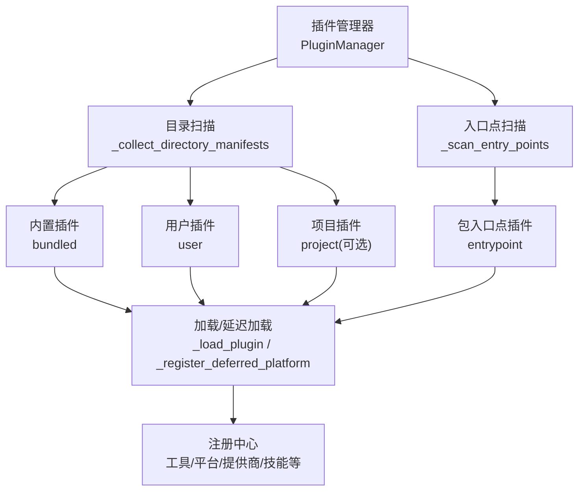
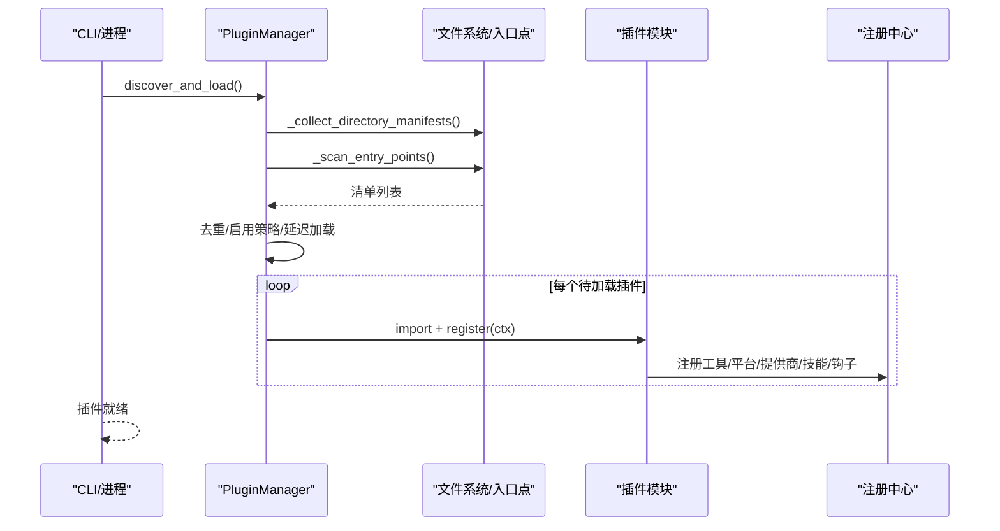
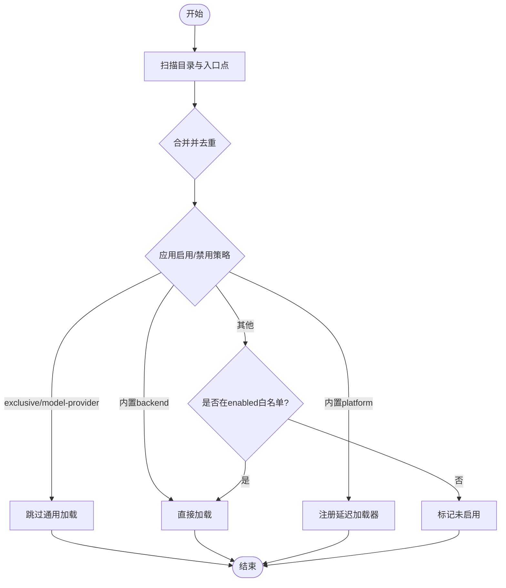
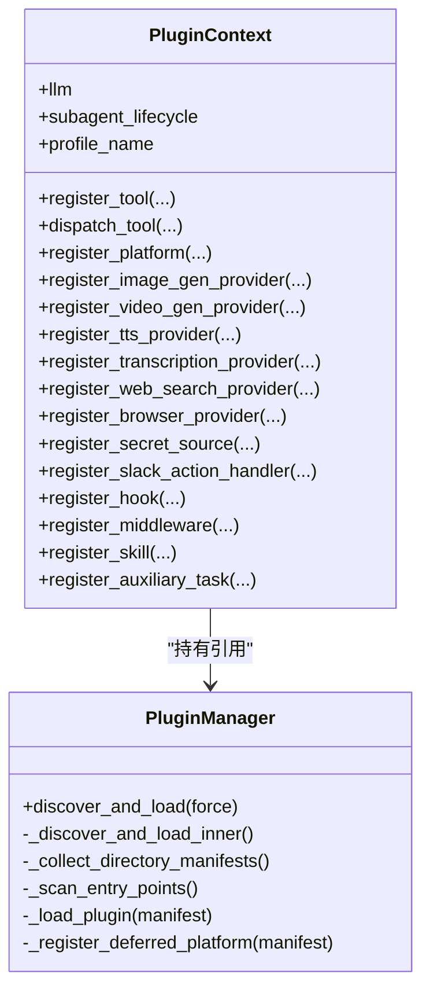
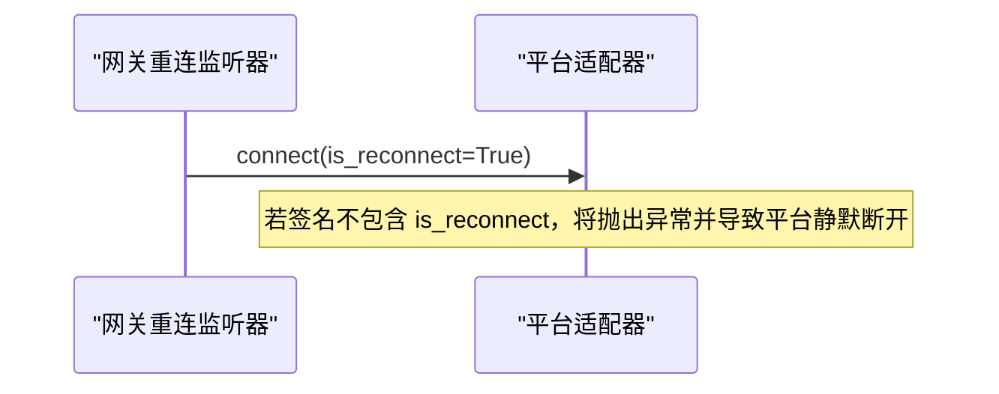
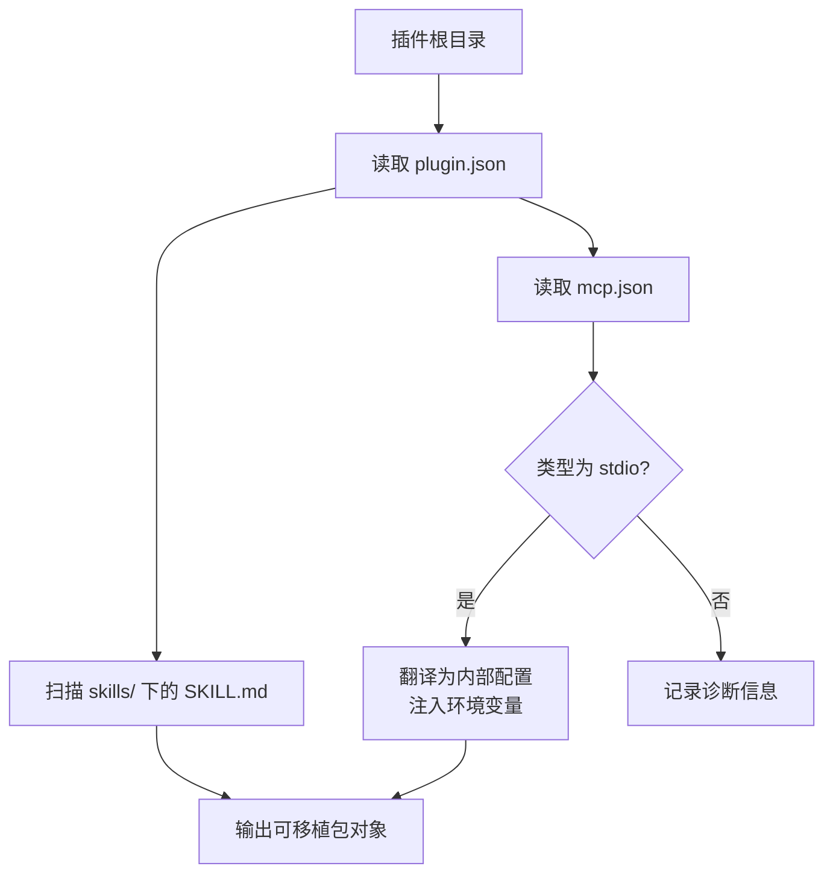
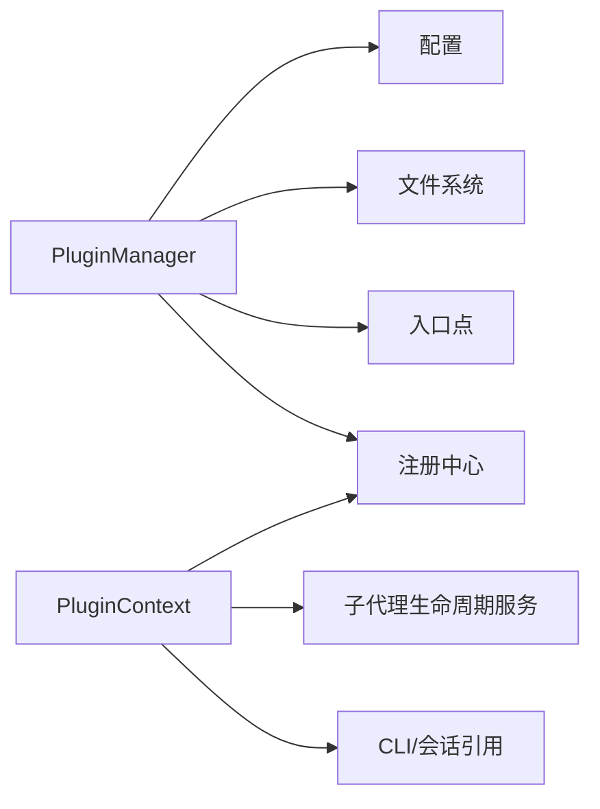

# 插件架构

<cite>
**本文引用的文件**
- [hermes_cli/plugins.py](file://hermes_cli/plugins.py)
- [hermes_cli/agent_plugins.py](file://hermes_cli/agent_plugins.py)
- [plugins/plugin_utils.py](file://plugins/plugin_utils.py)
- [tests/gateway/test_adapter_connect_is_reconnect_contract.py](file://tests/gateway/test_adapter_connect_is_reconnect_contract.py)
</cite>

## 目录
1. [简介](#简介)
2. [项目结构](#项目结构)
3. [核心组件](#核心组件)
4. [架构总览](#架构总览)
5. [详细组件分析](#详细组件分析)
6. [依赖关系分析](#依赖关系分析)
7. [性能考量](#性能考量)
8. [故障排查指南](#故障排查指南)
9. [结论](#结论)
10. [附录](#附录)

## 简介
本文件面向 Hermes Agent 的插件系统，系统性说明插件发现机制、生命周期管理、依赖注入、接口规范（提供商接口、平台适配器接口、工具扩展接口）、安装与配置、版本管理、插件间通信与数据共享策略、开发指南与安全机制。文档基于仓库中插件系统的实际实现进行梳理，确保读者既能理解整体设计，也能按图索骥定位到具体代码位置。

## 项目结构
Hermes 插件系统由“插件管理器 + 插件上下文 + 多种注册能力”构成，支持多来源插件加载与优先级覆盖：
- 内置插件：仓库 plugins 目录下
- 用户插件：~/.hermes/plugins/
- 项目插件：./.hermes/plugins/（需显式开启）
- 包入口点插件：通过 Python entry points 暴露 hermes_agent.plugins 组

图表来源
- [hermes_cli/plugins.py:1341-1487](file://hermes_cli/plugins.py#L1341-L1487)
- [hermes_cli/plugins.py:1496-1545](file://hermes_cli/plugins.py#L1496-L1545)

章节来源
- [hermes_cli/plugins.py:1-32](file://hermes_cli/plugins.py#L1-L32)
- [hermes_cli/plugins.py:1341-1487](file://hermes_cli/plugins.py#L1341-L1487)
- [hermes_cli/plugins.py:1496-1545](file://hermes_cli/plugins.py#L1496-L1545)

## 核心组件
- 插件清单与运行时状态
  - PluginManifest：描述插件元信息、类型、来源、键名、是否可移植等
  - LoadedPlugin：记录已加载插件的模块、已注册的工具/钩子/中间件/命令、启用状态、错误信息等
- 插件上下文
  - PluginContext：提供给插件 register(ctx) 的宿主能力门面，包括 LLM 访问、子代理生命周期、工具注册、CLI/斜杠命令注册、提供商注册、平台适配器注册、钩子/中间件注册、技能注册等
- 插件管理器
  - PluginManager：负责发现、去重、加载、延迟加载、注册中心维护、MCP 探测等

章节来源
- [hermes_cli/plugins.py:307-362](file://hermes_cli/plugins.py#L307-L362)
- [hermes_cli/plugins.py:368-1303](file://hermes_cli/plugins.py#L368-L1303)
- [hermes_cli/plugins.py:1309-1336](file://hermes_cli/plugins.py#L1309-L1336)

## 架构总览
插件系统采用“声明式清单 + 动态注册”的模式：
- 清单层：plugin.yaml 或 plugin.json（可移植格式）描述插件能力与依赖
- 发现层：扫描目录与入口点，合并并去重，应用 enabled/disabled 策略
- 加载层：按需导入模块，执行 register(ctx)，将能力注册到全局注册表
- 运行层：在工具调用、网关消息、会话生命周期等时机触发钩子和中间件

图表来源
- [hermes_cli/plugins.py:1341-1487](file://hermes_cli/plugins.py#L1341-L1487)
- [hermes_cli/plugins.py:1496-1545](file://hermes_cli/plugins.py#L1496-L1545)

## 详细组件分析

### 插件发现与加载流程
- 多来源扫描：内置、用户、项目（可选）、入口点
- 去重与优先级：后发现的覆盖先发现的同名 key；用户 > 内置；项目 > 用户（当启用时）
- 特殊类型处理：
  - exclusive：由类别自身发现激活，通用扫描跳过
  - model-provider：由 providers 子系统懒加载
  - backend（内置）：自动加载
  - platform（内置）：延迟加载，首次使用时才引入重型 SDK
- 启用控制：
  - disabled 黑名单优先
  - enabled 白名单（None 表示默认不启用，迁移后会填充历史已安装插件）

图表来源
- [hermes_cli/plugins.py:1380-1487](file://hermes_cli/plugins.py#L1380-L1487)
- [hermes_cli/plugins.py:1496-1545](file://hermes_cli/plugins.py#L1496-L1545)

章节来源
- [hermes_cli/plugins.py:1341-1487](file://hermes_cli/plugins.py#L1341-L1487)
- [hermes_cli/plugins.py:1496-1545](file://hermes_cli/plugins.py#L1496-L1545)

### 插件上下文与能力注册
- 工具扩展接口
  - register_tool：注册工具到全局 registry，支持 override（需显式授权）
  - dispatch_tool：通过注册表调度工具调用，自动注入父代理上下文
- 平台适配器接口
  - register_platform：注册网关平台适配器工厂与检查函数，支持依赖探测与安装提示
- 提供商接口
  - 图像生成、视频生成、TTS、STT、Web 搜索/提取、浏览器云后端、密钥源等
  - 各注册方法均做类型校验与命名冲突保护
- 钩子与中间件
  - register_hook：注册生命周期钩子（如 pre_tool_call、pre_llm_call、on_session_start 等）
  - register_middleware：注册行为变更中间件（请求重写、执行包装）
- 技能注册
  - register_skill：注册只读技能，命名空间隔离，需显式加载
- 辅助任务
  - register_auxiliary_task：声明 LLM 驱动的辅助任务，提供默认路由字段

图表来源
- [hermes_cli/plugins.py:368-1303](file://hermes_cli/plugins.py#L368-L1303)
- [hermes_cli/plugins.py:1309-1336](file://hermes_cli/plugins.py#L1309-L1336)

章节来源
- [hermes_cli/plugins.py:368-1303](file://hermes_cli/plugins.py#L368-L1303)
- [hermes_cli/plugins.py:1309-1336](file://hermes_cli/plugins.py#L1309-L1336)

### 平台适配器接口契约
- 所有平台适配器的 connect() 必须接受 is_reconnect 关键字参数，以便网关重连监听器在重试时传递该参数
- 测试通过 AST 静态解析所有 adapter.py 与 *_adapter.py，强制契约一致性

图表来源
- [tests/gateway/test_adapter_connect_is_reconnect_contract.py:1-145](file://tests/gateway/test_adapter_connect_is_reconnect_contract.py#L1-L145)

章节来源
- [tests/gateway/test_adapter_connect_is_reconnect_contract.py:1-145](file://tests/gateway/test_adapter_connect_is_reconnect_contract.py#L1-L145)

### 可移植插件包（Agent Plugins v1）
- 使用 plugin.json 声明插件元信息与扩展
- 支持 skills 目录与 mcp.json 声明 MCP 服务器
- 路径与占位符安全解析，限制逃逸路径，环境变量注入 PLUGIN_ROOT/PLUGIN_DATA
- 仅支持 stdio 传输的 MCP 服务器（streamable-http/sse 不支持）

图表来源
- [hermes_cli/agent_plugins.py:97-155](file://hermes_cli/agent_plugins.py#L97-L155)
- [hermes_cli/agent_plugins.py:192-252](file://hermes_cli/agent_plugins.py#L192-L252)
- [hermes_cli/agent_plugins.py:310-365](file://hermes_cli/agent_plugins.py#L310-L365)
- [hermes_cli/agent_plugins.py:368-448](file://hermes_cli/agent_plugins.py#L368-L448)
- [hermes_cli/agent_plugins.py:451-485](file://hermes_cli/agent_plugins.py#L451-L485)

章节来源
- [hermes_cli/agent_plugins.py:97-155](file://hermes_cli/agent_plugins.py#L97-L155)
- [hermes_cli/agent_plugins.py:192-252](file://hermes_cli/agent_plugins.py#L192-L252)
- [hermes_cli/agent_plugins.py:310-365](file://hermes_cli/agent_plugins.py#L310-L365)
- [hermes_cli/agent_plugins.py:368-448](file://hermes_cli/agent_plugins.py#L368-L448)
- [hermes_cli/agent_plugins.py:451-485](file://hermes_cli/agent_plugins.py#L451-L485)

### 插件间通信与数据共享策略
- 通过全局注册表共享能力：工具、提供商、平台、技能、辅助任务
- 钩子与中间件作为事件总线：插件可在关键阶段观察或改写行为
- 会话级注入：插件可通过 inject_message 向活跃对话注入消息
- 子代理生命周期服务：插件可获取序列化句柄与快照，避免直接持有活体代理
- 并发安全：插件可使用提供的 lazy_singleton 与 SingletonSlot 避免竞态

章节来源
- [hermes_cli/plugins.py:522-660](file://hermes_cli/plugins.py#L522-L660)
- [hermes_cli/plugins.py:1214-1250](file://hermes_cli/plugins.py#L1214-L1250)
- [plugins/plugin_utils.py:1-136](file://plugins/plugin_utils.py#L1-L136)

## 依赖关系分析
- 插件管理器依赖：
  - 配置读取：启用/禁用列表、项目插件开关
  - 文件系统：扫描目录、读取清单
  - 入口点：Python entry points 组 hermes_agent.plugins
  - 注册中心：工具、平台、提供商、技能、辅助任务
- 插件上下文依赖：
  - 各子系统注册表（image_gen、video_gen、tts、stt、web search、browser、secret sources）
  - 网关平台注册表（platform_registry）
  - 会话与 CLI 引用（用于消息注入与工具调度）

图表来源
- [hermes_cli/plugins.py:1341-1487](file://hermes_cli/plugins.py#L1341-L1487)
- [hermes_cli/plugins.py:368-1303](file://hermes_cli/plugins.py#L368-L1303)

章节来源
- [hermes_cli/plugins.py:1341-1487](file://hermes_cli/plugins.py#L1341-L1487)
- [hermes_cli/plugins.py:368-1303](file://hermes_cli/plugins.py#L368-L1303)

## 性能考量
- 延迟加载平台插件：避免启动时引入重型第三方 SDK，仅在首次使用时加载
- 懒构建宿主资源：LLM 门面与子代理生命周期服务在首次访问时构建
- 并发安全：提供线程安全的单例工具，避免重复初始化导致的资源泄漏
- 最小化导入开销：插件上下文对宿主模块采用延迟导入，减少循环依赖与冷启动成本

章节来源
- [hermes_cli/plugins.py:1453-1466](file://hermes_cli/plugins.py#L1453-L1466)
- [hermes_cli/plugins.py:378-413](file://hermes_cli/plugins.py#L378-L413)
- [plugins/plugin_utils.py:43-81](file://plugins/plugin_utils.py#L43-L81)
- [plugins/plugin_utils.py:84-136](file://plugins/plugin_utils.py#L84-L136)

## 故障排查指南
- 平台适配器连接失败
  - 现象：网关重连时适配器抛出不期望的关键字参数异常
  - 原因：connect() 缺少 is_reconnect 参数
  - 解决：为 connect() 添加 is_reconnect 关键字参数，或通过 **kwargs 吸收
- 插件未生效
  - 检查 enabled/disabled 配置
  - 确认插件 key 与 name 匹配
  - 查看日志中的“Skipping ... (not enabled in config)”提示
- 工具覆盖被拒绝
  - 现象：尝试覆盖内置工具时报权限错误
  - 原因：未设置 allow_tool_override
  - 解决：在配置中为对应插件条目设置 allow_tool_override: true
- 可移植插件 MCP 不可用
  - 检查 mcp.json 类型是否为 stdio
  - 检查路径是否越界、占位符是否正确展开
  - 查看诊断信息中的错误范围与消息

章节来源
- [tests/gateway/test_adapter_connect_is_reconnect_contract.py:1-145](file://tests/gateway/test_adapter_connect_is_reconnect_contract.py#L1-L145)
- [hermes_cli/plugins.py:1398-1487](file://hermes_cli/plugins.py#L1398-L1487)
- [hermes_cli/plugins.py:439-520](file://hermes_cli/plugins.py#L439-L520)
- [hermes_cli/agent_plugins.py:368-448](file://hermes_cli/agent_plugins.py#L368-L448)

## 结论
Hermes 插件系统以清晰的清单驱动与模块化注册为核心，兼顾了可扩展性、安全性与性能。通过统一的插件上下文与注册中心，插件可以安全地扩展工具、平台、提供商与行为钩子；通过延迟加载与并发安全原语，系统在保持低启动开销的同时保障稳定性。对于开发者而言，遵循接口契约、合理使用配置开关与授权机制，即可快速构建高质量的插件生态。

## 附录

### 插件安装与配置
- 安装位置
  - 内置：仓库 plugins 目录
  - 用户：~/.hermes/plugins
  - 项目：./.hermes/plugins（需开启 HERMES_ENABLE_PROJECT_PLUGINS）
  - 包：通过 entry points hermes_agent.plugins 暴露
- 启用/禁用
  - plugins.enabled：白名单（None 表示默认不启用）
  - plugins.disabled：黑名单（优先于白名单）
- 可移植插件
  - 使用 plugin.json 与 skills/mcp.json 声明能力
  - 数据目录位于 ~/.hermes/plugin-data/<skill_namespace>

章节来源
- [hermes_cli/plugins.py:1-32](file://hermes_cli/plugins.py#L1-L32)
- [hermes_cli/plugins.py:231-274](file://hermes_cli/plugins.py#L231-L274)
- [hermes_cli/plugins.py:1496-1545](file://hermes_cli/plugins.py#L1496-L1545)
- [hermes_cli/agent_plugins.py:451-485](file://hermes_cli/agent_plugins.py#L451-L485)

### 版本管理与兼容性
- 清单版本
  - 可移植插件使用 https://agent-plugins.org/schemas/1.0.0/plugin.schema.json
  - MCP 使用 https://agent-plugins.org/schemas/1.0.0/mcp.schema.json
- 向后兼容
  - 允许未知字段并记录诊断
  - 支持 legacy bare name 与 path-derived key 双重查找

章节来源
- [hermes_cli/agent_plugins.py:21-22](file://hermes_cli/agent_plugins.py#L21-L22)
- [hermes_cli/agent_plugins.py:104-113](file://hermes_cli/agent_plugins.py#L104-L113)
- [hermes_cli/plugins.py:1398-1487](file://hermes_cli/plugins.py#L1398-L1487)

### 安全机制
- 工具覆盖授权：覆盖内置工具需显式 allow_tool_override
- 路径安全：可移植插件路径解析限制逃逸，禁止危险字符与相对路径越界
- 环境变量保护：保留 PLUGIN_ROOT/PLUGIN_DATA，禁止覆盖
- 沙箱执行：平台适配器与外部进程通过网关与注册表隔离，插件不直接持有敏感上下文

章节来源
- [hermes_cli/plugins.py:439-520](file://hermes_cli/plugins.py#L439-L520)
- [hermes_cli/agent_plugins.py:255-287](file://hermes_cli/agent_plugins.py#L255-L287)
- [hermes_cli/agent_plugins.py:310-365](file://hermes_cli/agent_plugins.py#L310-L365)

### 开发指南（实践要点）
- 环境搭建
  - 准备 plugin.yaml 或 plugin.json（可移植）
  - 实现 register(ctx) 并在其中注册能力
- 接口实现
  - 工具：使用 register_tool，必要时申请 override
  - 平台：使用 register_platform，提供 check_fn 与可选 ensure_deps_fn
  - 提供商：继承对应 Provider 基类并注册
  - 钩子/中间件：注册到 VALID_HOOKS/VALID_MIDDLEWARE 集合
- 测试方法
  - 使用 pytest 验证适配器契约（is_reconnect）
  - 利用诊断信息定位可移植插件问题
- 发布流程
  - 遵循清单 schema 与命名约束
  - 通过 entry points 或目录方式分发
  - 在 enabled/disabled 中明确启用策略

章节来源
- [hermes_cli/plugins.py:136-221](file://hermes_cli/plugins.py#L136-L221)
- [hermes_cli/plugins.py:439-1303](file://hermes_cli/plugins.py#L439-L1303)
- [tests/gateway/test_adapter_connect_is_reconnect_contract.py:1-145](file://tests/gateway/test_adapter_connect_is_reconnect_contract.py#L1-L145)
- [hermes_cli/agent_plugins.py:97-155](file://hermes_cli/agent_plugins.py#L97-L155)