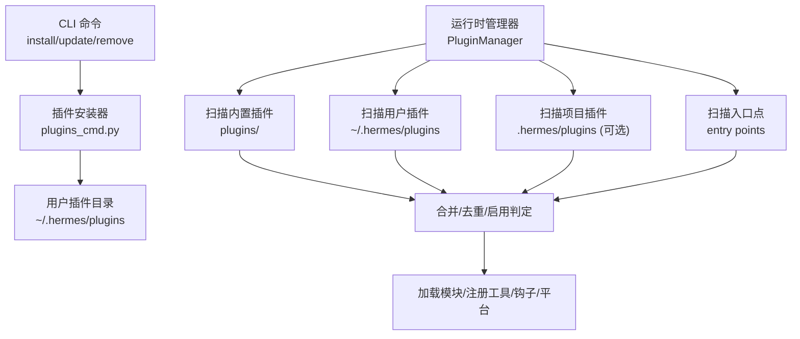
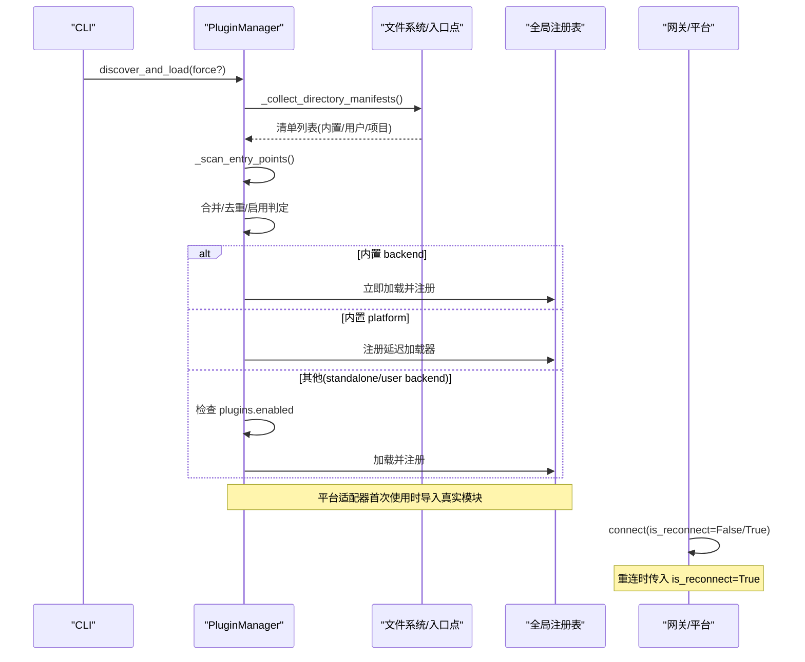
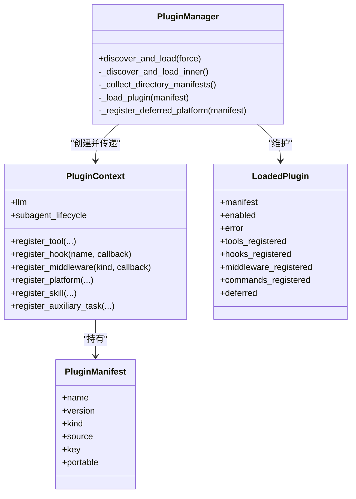
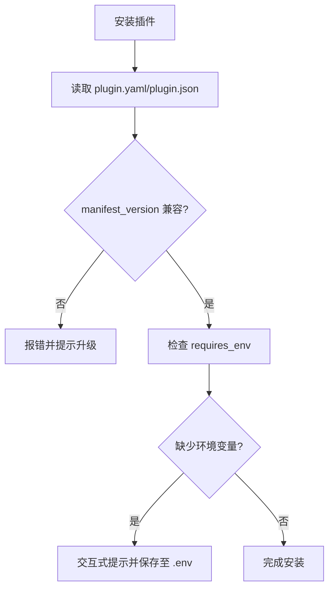
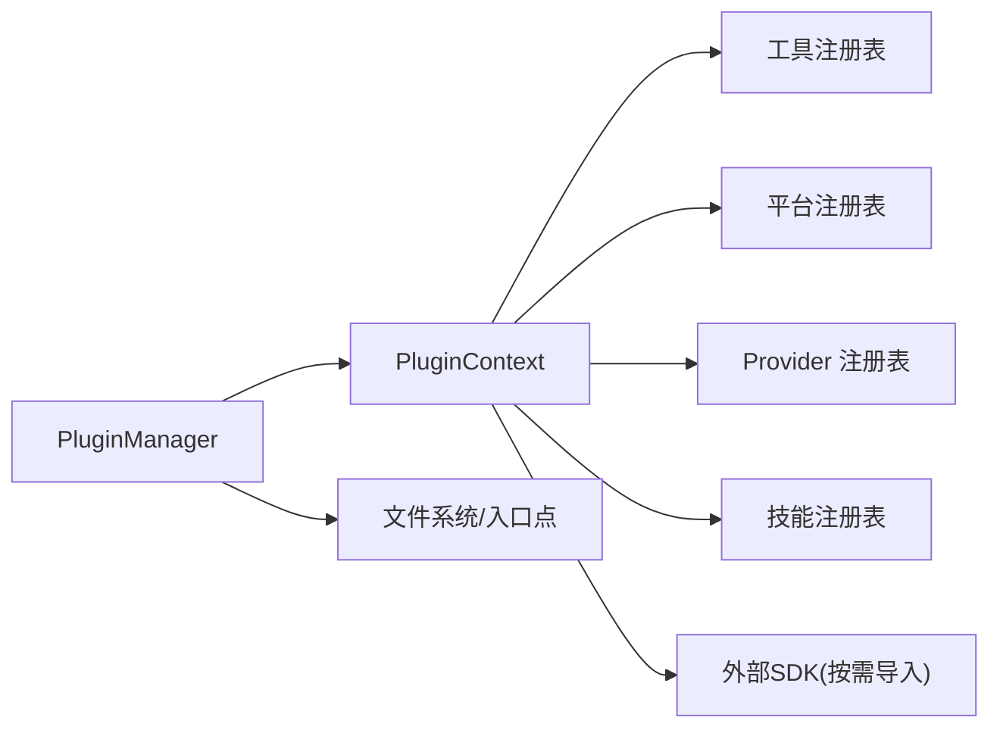

# 插件生命周期管理

<cite>
**本文引用的文件**
- [hermes_cli/plugins.py](file://hermes_cli/plugins.py)
- [hermes_cli/plugins_cmd.py](file://hermes_cli/plugins_cmd.py)
- [tests/gateway/test_adapter_connect_is_reconnect_contract.py](file://tests/gateway/test_adapter_connect_is_reconnect_contract.py)
</cite>

## 目录
1. [简介](#简介)
2. [项目结构](#项目结构)
3. [核心组件](#核心组件)
4. [架构总览](#架构总览)
5. [详细组件分析](#详细组件分析)
6. [依赖关系分析](#依赖关系分析)
7. [性能考量](#性能考量)
8. [故障排查指南](#故障排查指南)
9. [结论](#结论)
10. [附录](#附录)

## 简介
本文件面向 Hermes Agent 的插件系统，系统化说明插件从发现、加载、初始化到运行、暂停、恢复与卸载的全生命周期。重点覆盖：
- 插件扫描与来源优先级（内置、用户、项目、入口点）
- 插件启用/禁用策略与配置门控
- 插件状态管理与错误记录
- 依赖解析与版本兼容性检查（manifest_version）
- 插件间依赖与冲突解决（键名去重、独占类别、覆盖控制）
- 生命周期事件监听与处理（hooks/middleware）
- 故障恢复与异常处理最佳实践

## 项目结构
Hermes 插件系统由 CLI 层与运行时管理器组成：
- hermes_cli/plugins.py：插件发现、加载、注册、钩子与中间件管理、上下文门面等核心逻辑
- hermes_cli/plugins_cmd.py：插件安装/更新/移除、清单读取与环境变量提示、清单版本校验等
- tests/gateway/test_adapter_connect_is_reconnect_contract.py：平台适配器连接契约测试，体现“重连”语义在生命周期中的重要性



图表来源
- [hermes_cli/plugins.py:1341-1487](file://hermes_cli/plugins.py#L1341-L1487)
- [hermes_cli/plugins_cmd.py:462-581](file://hermes_cli/plugins_cmd.py#L462-L581)

章节来源
- [hermes_cli/plugins.py:1-32](file://hermes_cli/plugins.py#L1-L32)
- [hermes_cli/plugins_cmd.py:1-8](file://hermes_cli/plugins_cmd.py#L1-L8)

## 核心组件
- PluginManifest：描述插件元数据（名称、版本、类型、来源、键名、便携性等）
- LoadedPlugin：运行时实例状态（是否启用、错误信息、已注册项）
- PluginContext：插件注册门面（工具、钩子、中间件、平台、技能、辅助任务等）
- PluginManager：统一调度发现、加载、注册、查询与清理

关键职责要点
- 多源扫描与优先级合并（内置 > 用户 > 项目；同 key 后者优先覆盖）
- 启用/禁用门控（plugins.enabled/disabled）
- 特殊类型分流（exclusive、model-provider、backend、platform）
- 延迟加载平台插件以减少冷启动开销
- 钩子与中间件注册与调用
- 安全与信任门控（工具覆盖需显式授权）

章节来源
- [hermes_cli/plugins.py:307-362](file://hermes_cli/plugins.py#L307-L362)
- [hermes_cli/plugins.py:368-1303](file://hermes_cli/plugins.py#L368-L1303)
- [hermes_cli/plugins.py:1309-1487](file://hermes_cli/plugins.py#L1309-L1487)

## 架构总览
下图展示插件从发现到运行的主流程，以及平台适配器的重连契约。



图表来源
- [hermes_cli/plugins.py:1341-1487](file://hermes_cli/plugins.py#L1341-L1487)
- [tests/gateway/test_adapter_connect_is_reconnect_contract.py:1-145](file://tests/gateway/test_adapter_connect_is_reconnect_contract.py#L1-L145)

## 详细组件分析

### 插件发现与加载
- 扫描顺序：内置插件（排除 memory/context_engine/platforms/model-providers）、内置平台插件（单独扫描 platforms）、用户插件、项目插件（需环境变量开启）、入口点插件
- 键名去重：以 path-derived key 为主，同名后者优先覆盖
- 启用/禁用：disabled 优先于 enabled；未启用则记录为 disabled/not enabled
- 特殊类型分流：
  - exclusive：由类别选择器激活，不在此处加载
  - model-provider：由 providers 子系统懒加载
  - backend（内置）：自动加载
  - platform（内置）：注册延迟加载器，首次使用才导入重型 SDK

```mermaid
flowchart TD
Start(["开始"]) --> Scan["扫描多源清单"]
Scan --> Merge{"合并/去重"}
Merge --> Gate{"启用/禁用门控"}
Gate --> |禁用| Skip["记录 disabled/not enabled"]
Gate --> |启用| Type{"类型分流"}
Type --> |exclusive| Exclusive["交由类别选择器"]
Type --> |model-provider| ModelProv["交由 providers 子系统"]
Type --> |backend(内置)| LoadBuiltin["立即加载注册"]
Type --> |platform(内置)| Defer["注册延迟加载器"]
Type --> |其他| LoadUser["检查 enabled 后加载"]
Skip --> End(["结束"])
Exclusive --> End
ModelProv --> End
LoadBuiltin --> End
Defer --> End
LoadUser --> End
```

图表来源
- [hermes_cli/plugins.py:1380-1487](file://hermes_cli/plugins.py#L1380-L1487)

章节来源
- [hermes_cli/plugins.py:1341-1487](file://hermes_cli/plugins.py#L1341-L1487)

### 插件初始化与运行
- 插件通过 register(ctx) 暴露能力：
  - 工具注册：register_tool(...)
  - 钩子注册：register_hook(hook_name, callback)
  - 中间件注册：register_middleware(kind, callback)
  - 平台注册：register_platform(...)
  - 技能注册：register_skill(...)
  - 辅助任务注册：register_auxiliary_task(...)
  - 各类 Provider 注册（图像生成、视频生成、TTS、STT、Web搜索、浏览器、密钥源等）
- 运行期触发：
  - 工具调用、会话生命周期事件、网关消息分发前钩子、审批前后钩子、Kanban 任务状态变更钩子等



图表来源
- [hermes_cli/plugins.py:307-362](file://hermes_cli/plugins.py#L307-L362)
- [hermes_cli/plugins.py:368-1303](file://hermes_cli/plugins.py#L368-L1303)
- [hermes_cli/plugins.py:1309-1487](file://hermes_cli/plugins.py#L1309-L1487)

章节来源
- [hermes_cli/plugins.py:136-219](file://hermes_cli/plugins.py#L136-L219)
- [hermes_cli/plugins.py:368-1303](file://hermes_cli/plugins.py#L368-L1303)

### 插件状态管理
- 状态字段：enabled、error、deferred
- 状态来源：
  - disabled 或 not enabled → enabled=false，error 记录原因
  - exclusive / model-provider → 跳过加载，记录原因
  - 内置 platform → deferred=true（延迟加载）
- 状态查询：可通过 manager 内部集合统计已发现/已启用数量

章节来源
- [hermes_cli/plugins.py:346-362](file://hermes_cli/plugins.py#L346-L362)
- [hermes_cli/plugins.py:1398-1487](file://hermes_cli/plugins.py#L1398-L1487)

### 依赖解析与版本兼容性
- 清单版本兼容：
  - 安装阶段读取 manifest_version，若高于当前支持版本，拒绝安装并提示升级
- 环境依赖：
  - requires_env 声明缺失变量时，安装过程可交互式提示并写入 .env
- 平台依赖探测：
  - register_platform 提供 check_fn（被动探测）与 ensure_deps_fn（主动安装），仅在需要时执行



图表来源
- [hermes_cli/plugins_cmd.py:540-556](file://hermes_cli/plugins_cmd.py#L540-L556)
- [hermes_cli/plugins_cmd.py:312-400](file://hermes_cli/plugins_cmd.py#L312-L400)
- [hermes_cli/plugins.py:979-1039](file://hermes_cli/plugins.py#L979-L1039)

章节来源
- [hermes_cli/plugins_cmd.py:540-556](file://hermes_cli/plugins_cmd.py#L540-L556)
- [hermes_cli/plugins_cmd.py:312-400](file://hermes_cli/plugins_cmd.py#L312-L400)
- [hermes_cli/plugins.py:979-1039](file://hermes_cli/plugins.py#L979-L1039)

### 插件间依赖与冲突解决
- 键名去重：以 path-derived key 为准，避免 image_gen/openai 与 tts/openai 冲突
- 覆盖控制：
  - 工具覆盖需显式授权 allow_tool_override，否则抛出权限错误
  - 内置 provider 名称不可被插件覆盖（TTS/STT 等）
- 独占类别：exclusive 类型由类别选择器决定唯一提供者
- 平台适配器命名空间：register_platform 会记录插件来源，便于诊断

章节来源
- [hermes_cli/plugins.py:1398-1487](file://hermes_cli/plugins.py#L1398-L1487)
- [hermes_cli/plugins.py:439-520](file://hermes_cli/plugins.py#L439-L520)
- [hermes_cli/plugins.py:895-975](file://hermes_cli/plugins.py#L895-L975)
- [hermes_cli/plugins.py:979-1039](file://hermes_cli/plugins.py#L979-L1039)

### 生命周期事件监听与处理
- 支持的钩子包括但不限于：
  - 工具调用前后、LLM 调用前后、API 请求前后
  - 会话生命周期（开始/结束/最终化/重置）
  - 技能生命周期、子代理启停
  - 网关分发前、审批前后、看板任务状态变更
- 注册方式：PluginContext.register_hook(hook_name, callback)
- 未知钩子：记录警告但保留，保证向前兼容

章节来源
- [hermes_cli/plugins.py:136-219](file://hermes_cli/plugins.py#L136-L219)
- [hermes_cli/plugins.py:1214-1229](file://hermes_cli/plugins.py#L1214-L1229)

### 运行、暂停、恢复与卸载
- 运行：插件能力在加载后通过全局注册表对外暴露（工具、平台、Provider、技能等）
- 暂停/恢复：
  - 平台适配器支持重连语义（is_reconnect 参数），用于网络中断后的恢复
  - 钩子可用于观察会话/任务生命周期，实现业务级暂停/恢复
- 卸载：
  - CLI 提供 remove 命令删除插件目录
  - 注意：进程内已加载模块不会自动卸载，通常需重启进程或重新 discover_and_load(force=True)

章节来源
- [tests/gateway/test_adapter_connect_is_reconnect_contract.py:1-145](file://tests/gateway/test_adapter_connect_is_reconnect_contract.py#L1-L145)
- [hermes_cli/plugins_cmd.py:715-729](file://hermes_cli/plugins_cmd.py#L715-L729)
- [hermes_cli/plugins.py:1341-1378](file://hermes_cli/plugins.py#L1341-L1378)

## 依赖关系分析
- 插件与宿主：
  - 插件通过 PluginContext 访问宿主能力（LLM、子代理生命周期、工具注册等）
  - 宿主通过 PluginManager 统一管理插件发现与加载
- 插件与注册表：
  - 工具、平台、Provider、技能等通过各自注册表集中管理
- 外部依赖：
  - 平台适配器依赖第三方 SDK（如 slack_bolt、discord.py 等），采用延迟导入降低冷启动成本
  - 清单解析依赖 yaml/json 读取



图表来源
- [hermes_cli/plugins.py:368-1303](file://hermes_cli/plugins.py#L368-L1303)
- [hermes_cli/plugins.py:1341-1487](file://hermes_cli/plugins.py#L1341-L1487)

章节来源
- [hermes_cli/plugins.py:368-1303](file://hermes_cli/plugins.py#L368-L1303)
- [hermes_cli/plugins.py:1341-1487](file://hermes_cli/plugins.py#L1341-L1487)

## 性能考量
- 延迟加载平台插件：避免一次性导入重型 SDK，缩短 CLI 冷启动时间
- 仅扫描清单：在不加载模块的情况下进行启用/禁用判定与 MCP 能力探测
- 缓存与幂等：discover_and_load 支持 force 刷新，避免重复扫描开销
- 最小化副作用：check_fn 仅做被动探测，不安装依赖

章节来源
- [hermes_cli/plugins.py:1453-1466](file://hermes_cli/plugins.py#L1453-L1466)
- [hermes_cli/plugins.py:1547-1599](file://hermes_cli/plugins.py#L1547-L1599)
- [hermes_cli/plugins.py:1341-1378](file://hermes_cli/plugins.py#L1341-L1378)

## 故障排查指南
- 插件未生效
  - 检查是否在 plugins.enabled 中启用，或被 plugins.disabled 禁用
  - 查看 LoadedPlugin.error 字段获取跳过原因
- 平台适配器无法重连
  - 确保适配器 connect() 接受 is_reconnect 关键字参数
- 工具覆盖失败
  - 确认已设置 allow_tool_override: true
- 环境变量缺失
  - 根据 requires_env 提示补齐 .env 中的变量
- 清单版本不兼容
  - 按提示升级 Hermes 以支持更高 manifest_version

章节来源
- [hermes_cli/plugins.py:1398-1487](file://hermes_cli/plugins.py#L1398-L1487)
- [tests/gateway/test_adapter_connect_is_reconnect_contract.py:1-145](file://tests/gateway/test_adapter_connect_is_reconnect_contract.py#L1-L145)
- [hermes_cli/plugins_cmd.py:540-556](file://hermes_cli/plugins_cmd.py#L540-L556)
- [hermes_cli/plugins_cmd.py:312-400](file://hermes_cli/plugins_cmd.py#L312-L400)
- [hermes_cli/plugins.py:439-520](file://hermes_cli/plugins.py#L439-L520)

## 结论
Hermes 插件系统通过清晰的发现-加载-注册分层、严格的启用/禁用门控、安全的覆盖控制与延迟加载机制，实现了可扩展且高性能的插件生态。结合丰富的生命周期钩子与 Provider 体系，插件可在工具、平台、媒体、语音、搜索等多维度扩展 Agent 能力。遵循本文所述的最佳实践，可有效提升插件稳定性、可维护性与用户体验。

## 附录
- 常用命令
  - 安装插件：hermes plugins install <identifier>
  - 更新插件：hermes plugins update <name>
  - 移除插件：hermes plugins remove <name>
  - 重启网关使插件生效：hermes gateway restart

章节来源
- [hermes_cli/plugins_cmd.py:584-667](file://hermes_cli/plugins_cmd.py#L584-L667)
- [hermes_cli/plugins_cmd.py:670-713](file://hermes_cli/plugins_cmd.py#L670-L713)
- [hermes_cli/plugins_cmd.py:715-729](file://hermes_cli/plugins_cmd.py#L715-L729)