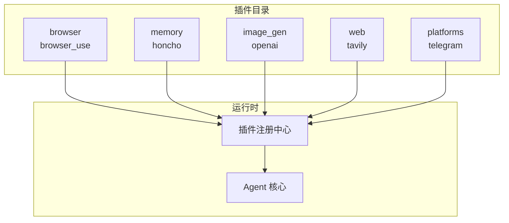
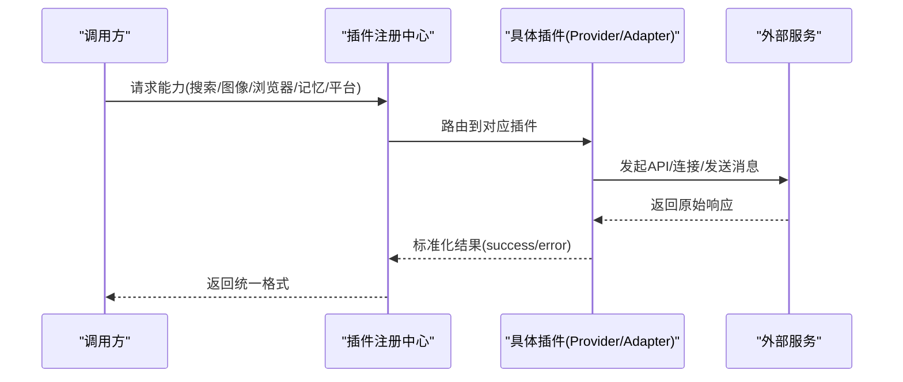
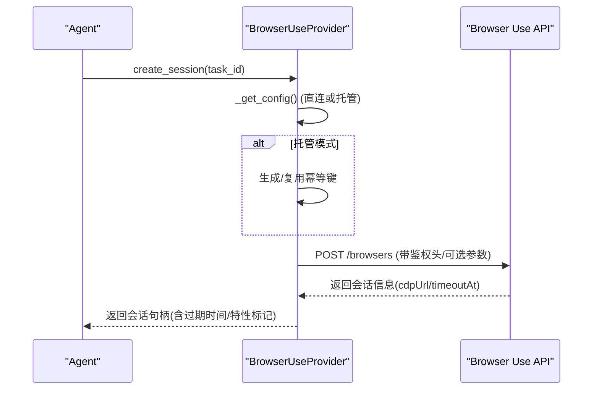
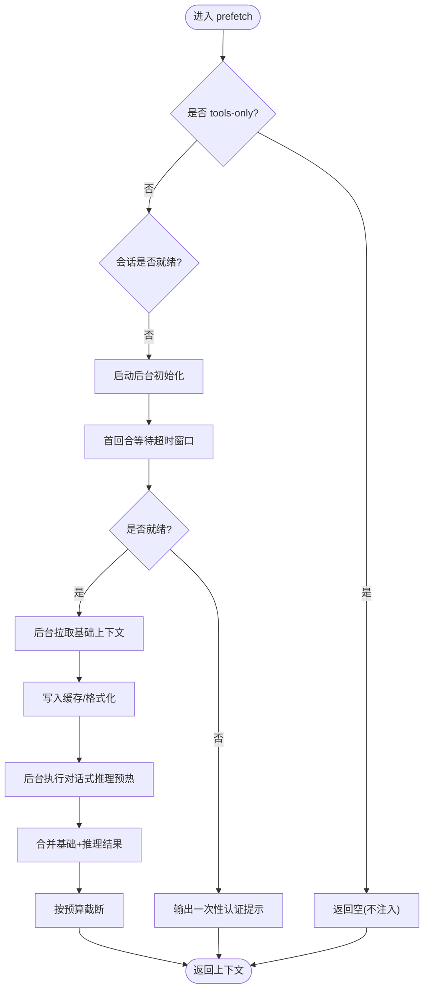
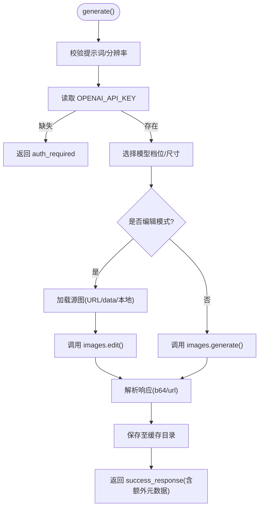
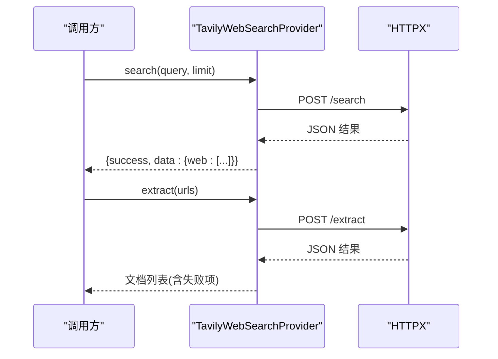
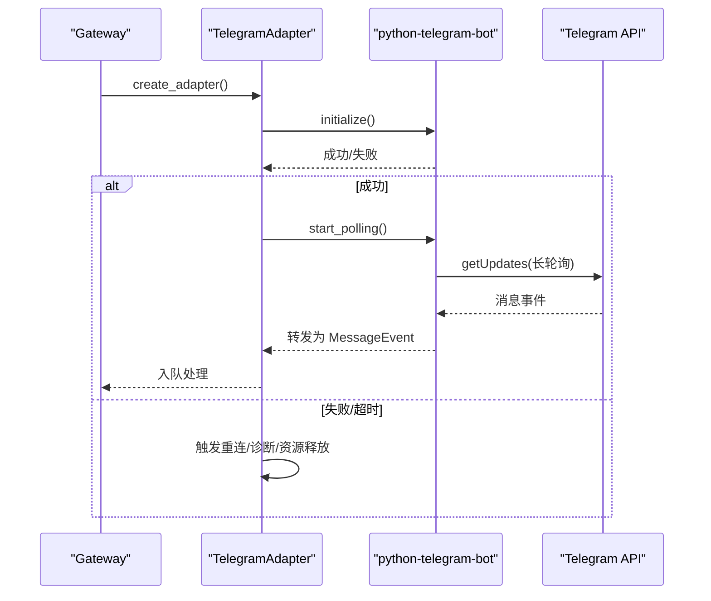
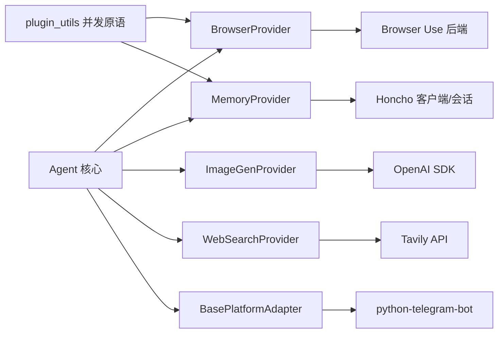

# 插件示例集合

<cite>
**本文引用的文件**
- [plugins/browser/browser_use/plugin.yaml](file://plugins/browser/browser_use/plugin.yaml)
- [plugins/browser/browser_use/provider.py](file://plugins/browser/browser_use/provider.py)
- [plugins/memory/honcho/plugin.yaml](file://plugins/memory/honcho/plugin.yaml)
- [plugins/memory/honcho/__init__.py](file://plugins/memory/honcho/__init__.py)
- [plugins/image_gen/openai/plugin.yaml](file://plugins/image_gen/openai/plugin.yaml)
- [plugins/image_gen/openai/__init__.py](file://plugins/image_gen/openai/__init__.py)
- [plugins/web/tavily/plugin.yaml](file://plugins/web/tavily/plugin.yaml)
- [plugins/web/tavily/__init__.py](file://plugins/web/tavily/__init__.py)
- [plugins/web/tavily/provider.py](file://plugins/web/tavily/provider.py)
- [plugins/platforms/telegram/plugin.yaml](file://plugins/platforms/telegram/plugin.yaml)
- [plugins/platforms/telegram/__init__.py](file://plugins/platforms/telegram/__init__.py)
- [plugins/platforms/telegram/adapter.py](file://plugins/platforms/telegram/adapter.py)
- [plugins/plugin_utils.py](file://plugins/plugin_utils.py)
</cite>

## 目录
1. [简介](#简介)
2. [项目结构](#项目结构)
3. [核心组件](#核心组件)
4. [架构总览](#架构总览)
5. [详细组件分析](#详细组件分析)
6. [依赖关系分析](#依赖关系分析)
7. [性能考量](#性能考量)
8. [故障排查指南](#故障排查指南)
9. [结论](#结论)
10. [附录：自定义插件模板与最佳实践](#附录自定义插件模板与最佳实践)

## 简介
本文件为 Hermes Agent 的“插件示例集合”，围绕浏览器自动化、消息平台适配器、记忆存储、图像生成、网络搜索等典型场景，提供完整的实现参考、配置说明、使用与部署指南，并解释关键实现细节与设计模式。同时给出自定义插件开发模板与常见问题解决方案、性能优化建议，帮助开发者快速构建高质量插件。

## 项目结构
Hermes 插件以“按能力域分目录”的方式组织，每个插件包含 plugin.yaml（元数据与声明）与 provider/adapter 等实现模块。常见类型包括：
- 后端能力插件：浏览器后端、图像生成后端、网络搜索后端
- 平台适配器：消息平台接入（如 Telegram）
- 记忆插件：跨会话用户建模与检索（如 Honcho）

图表来源
- [plugins/browser/browser_use/plugin.yaml:1-8](file://plugins/browser/browser_use/plugin.yaml#L1-L8)
- [plugins/memory/honcho/plugin.yaml:1-8](file://plugins/memory/honcho/plugin.yaml#L1-L8)
- [plugins/image_gen/openai/plugin.yaml:1-8](file://plugins/image_gen/openai/plugin.yaml#L1-L8)
- [plugins/web/tavily/plugin.yaml:1-8](file://plugins/web/tavily/plugin.yaml#L1-L8)
- [plugins/platforms/telegram/plugin.yaml:1-36](file://plugins/platforms/telegram/plugin.yaml#L1-L36)

章节来源
- [plugins/browser/browser_use/plugin.yaml:1-8](file://plugins/browser/browser_use/plugin.yaml#L1-L8)
- [plugins/memory/honcho/plugin.yaml:1-8](file://plugins/memory/honcho/plugin.yaml#L1-L8)
- [plugins/image_gen/openai/plugin.yaml:1-8](file://plugins/image_gen/openai/plugin.yaml#L1-L8)
- [plugins/web/tavily/plugin.yaml:1-8](file://plugins/web/tavily/plugin.yaml#L1-L8)
- [plugins/platforms/telegram/plugin.yaml:1-36](file://plugins/platforms/telegram/plugin.yaml#L1-L36)

## 核心组件
- 浏览器自动化插件（Browser Use）：通过 BrowserProvider 抽象对接云端浏览器服务，支持直连 API Key 或托管网关两种认证方式，具备会话创建、关闭与异常清理能力。
- 记忆存储插件（Honcho）：通过 MemoryProvider 暴露 profile/search/reasoning/context/conclude 工具，支持上下文注入与后台预热，具备懒初始化与线程安全。
- 图像生成插件（OpenAI）：通过 ImageGenProvider 封装 gpt-image-2，提供多质量档位、尺寸映射、本地缓存与错误响应标准化。
- 网络搜索插件（Tavily）：通过 WebSearchProvider 提供 search/extract 能力，统一结果格式与错误处理。
- 消息平台适配器（Telegram）：通过 BasePlatformAdapter 扩展，完成消息收发、富文本渲染、媒体处理、连接生命周期管理与健壮的重连/超时控制。

章节来源
- [plugins/browser/browser_use/provider.py:105-325](file://plugins/browser/browser_use/provider.py#L105-L325)
- [plugins/memory/honcho/__init__.py:237-800](file://plugins/memory/honcho/__init__.py#L237-L800)
- [plugins/image_gen/openai/__init__.py:165-420](file://plugins/image_gen/openai/__init__.py#L165-L420)
- [plugins/web/tavily/provider.py:130-225](file://plugins/web/tavily/provider.py#L130-L225)
- [plugins/platforms/telegram/adapter.py:633-800](file://plugins/platforms/telegram/adapter.py#L633-L800)

## 架构总览
各插件通过统一的 Provider/Adapter 接口接入 Agent 运行时，由注册中心发现并挂载。调用链从上层工具/平台到具体后端，最终返回标准化的成功/失败响应。

图表来源
- [plugins/web/tavily/__init__.py:8-11](file://plugins/web/tavily/__init__.py#L8-L11)
- [plugins/image_gen/openai/__init__.py:417-420](file://plugins/image_gen/openai/__init__.py#L417-L420)
- [plugins/browser/browser_use/provider.py:189-256](file://plugins/browser/browser_use/provider.py#L189-L256)
- [plugins/platforms/telegram/adapter.py:633-800](file://plugins/platforms/telegram/adapter.py#L633-L800)

## 详细组件分析

### 浏览器自动化插件（Browser Use）
- 设计要点
  - 双认证路径：优先直连 BROWSER_USE_API_KEY；当配置 tool_gateway.browser=gateway 时走托管网关计费。
  - 幂等键管理：托管模式下为创建会话请求附加幂等键，避免重复 POST 导致 409 冲突。
  - 会话生命周期：create_session/close_session/emergency_cleanup 覆盖正常与异常退出场景。
  - 可用性检测与配置 Schema：is_available/get_setup_schema 用于引导式配置。
- 关键流程（创建会话）

图表来源
- [plugins/browser/browser_use/provider.py:129-177](file://plugins/browser/browser_use/provider.py#L129-L177)
- [plugins/browser/browser_use/provider.py:189-256](file://plugins/browser/browser_use/provider.py#L189-L256)

章节来源
- [plugins/browser/browser_use/plugin.yaml:1-8](file://plugins/browser/browser_use/plugin.yaml#L1-L8)
- [plugins/browser/browser_use/provider.py:105-325](file://plugins/browser/browser_use/provider.py#L105-L325)

### 记忆存储插件（Honcho）
- 设计要点
  - 三种召回模式：context/tools/hybrid，分别控制自动注入与工具可用。
  - 懒初始化与后台预热：tools-only 模式可延迟初始化；context/hybrid 模式在首回合进行后台预取与对话式推理预热。
  - 线程安全：使用锁保护首次上下文获取与状态更新，避免竞态。
  - 工具集：profile/search/reasoning/context/conclude，覆盖快照、检索、综合问答与持久化结论。
- 首回合上下文注入流程

图表来源
- [plugins/memory/honcho/__init__.py:699-800](file://plugins/memory/honcho/__init__.py#L699-L800)
- [plugins/memory/honcho/__init__.py:425-562](file://plugins/memory/honcho/__init__.py#L425-L562)

章节来源
- [plugins/memory/honcho/plugin.yaml:1-8](file://plugins/memory/honcho/plugin.yaml#L1-L8)
- [plugins/memory/honcho/__init__.py:237-800](file://plugins/memory/honcho/__init__.py#L237-L800)

### 图像生成插件（OpenAI）
- 设计要点
  - 多质量档位：low/medium/high 映射同一模型的不同 quality 参数，体现速度/质量权衡。
  - 输入源处理：支持 URL、data URI、本地文件读取，并进行安全校验。
  - 输出缓存：将 b64_json 或 URL 内容落盘至缓存目录，避免后续访问失效链接。
  - 错误标准化：统一 error_response 携带错误类型、模型、提示词等信息。
- 生成流程图

图表来源
- [plugins/image_gen/openai/__init__.py:219-409](file://plugins/image_gen/openai/__init__.py#L219-L409)

章节来源
- [plugins/image_gen/openai/plugin.yaml:1-8](file://plugins/image_gen/openai/plugin.yaml#L1-L8)
- [plugins/image_gen/openai/__init__.py:165-420](file://plugins/image_gen/openai/__init__.py#L165-L420)

### 网络搜索插件（Tavily）
- 设计要点
  - 双能力：search 与 extract，均同步调用 HTTP 接口。
  - 结果归一化：将不同来源的结果映射为标准文档结构，失败项保留 error 字段。
  - 中断感知：在执行前检查中断信号，及时返回。
- 搜索与提取序列

图表来源
- [plugins/web/tavily/provider.py:35-61](file://plugins/web/tavily/provider.py#L35-L61)
- [plugins/web/tavily/provider.py:153-210](file://plugins/web/tavily/provider.py#L153-L210)

章节来源
- [plugins/web/tavily/plugin.yaml:1-8](file://plugins/web/tavily/plugin.yaml#L1-L8)
- [plugins/web/tavily/__init__.py:8-11](file://plugins/web/tavily/__init__.py#L8-L11)
- [plugins/web/tavily/provider.py:130-225](file://plugins/web/tavily/provider.py#L130-L225)

### 消息平台适配器（Telegram）
- 设计要点
  - 健壮的生命周期管理：对 PTB Application/Bot 的 initialize/start_polling/stop/shutdown 设置严格超时与回退策略，防止事件循环阻塞导致网关挂起。
  - 富文本与媒体：MarkdownV2 转义、表格转换、图片/音频/视频上传与时长探测。
  - 批处理与节流：文本与媒体消息聚合，降低客户端拆分带来的多次 turn 干扰。
  - 授权与环境门控：支持 per-profile 的允许名单与环境变量门控。
- 启动与轮询时序

图表来源
- [plugins/platforms/telegram/adapter.py:97-173](file://plugins/platforms/telegram/adapter.py#L97-L173)
- [plugins/platforms/telegram/adapter.py:633-800](file://plugins/platforms/telegram/adapter.py#L633-L800)

章节来源
- [plugins/platforms/telegram/plugin.yaml:1-36](file://plugins/platforms/telegram/plugin.yaml#L1-L36)
- [plugins/platforms/telegram/__init__.py:1-4](file://plugins/platforms/telegram/__init__.py#L1-L4)
- [plugins/platforms/telegram/adapter.py:633-800](file://plugins/platforms/telegram/adapter.py#L633-L800)

## 依赖关系分析
- 插件与运行时的耦合点
  - 浏览器插件依赖 BrowserProvider 抽象与托管网关辅助函数。
  - 记忆插件依赖 MemoryProvider 抽象与 session 管理器。
  - 图像生成插件依赖 ImageGenProvider 抽象与 OpenAI SDK。
  - 网络搜索插件依赖 WebSearchProvider 抽象与 httpx。
  - 平台适配器依赖 BasePlatformAdapter 与 python-telegram-bot。
- 共享并发原语
  - 插件通用并发工具 lazy_singleton 与 SingletonSlot 用于线程安全的单例/槽位管理，避免全局单例的 TOCTOU 问题。

图表来源
- [plugins/plugin_utils.py:43-136](file://plugins/plugin_utils.py#L43-L136)
- [plugins/browser/browser_use/provider.py:105-177](file://plugins/browser/browser_use/provider.py#L105-L177)
- [plugins/memory/honcho/__init__.py:237-313](file://plugins/memory/honcho/__init__.py#L237-L313)
- [plugins/image_gen/openai/__init__.py:165-183](file://plugins/image_gen/openai/__init__.py#L165-L183)
- [plugins/web/tavily/provider.py:130-151](file://plugins/web/tavily/provider.py#L130-L151)
- [plugins/platforms/telegram/adapter.py:280-300](file://plugins/platforms/telegram/adapter.py#L280-L300)

章节来源
- [plugins/plugin_utils.py:1-136](file://plugins/plugin_utils.py#L1-L136)

## 性能考量
- 浏览器插件
  - 托管模式下短生命周期会话与代理国家码默认值，减少计费与资源占用。
  - 幂等键复用避免重复创建导致的 409 冲突。
- 记忆插件
  - 首回合超时窗口与后台预热，平衡首响速度与准确性。
  - 上下文缓存与对话式推理频率控制，降低不必要网络开销。
- 图像生成插件
  - 多质量档位供用户按需选择，兼顾速度与质量。
  - 本地缓存 b64/url，避免后续访问失效链接。
- 网络搜索插件
  - 同步调用但限制最大结果数，避免过大响应。
  - 中断感知，及时释放资源。
- 平台适配器
  - 严格的超时与回退策略，避免事件循环阻塞。
  - 文本/媒体批处理与节流，降低 API 压力与客户端拆分影响。

[本节为通用指导，无需特定文件引用]

## 故障排查指南
- 浏览器插件
  - 未配置凭据：检查 BROWSER_USE_API_KEY 或托管网关配置。
  - 会话创建失败：查看 HTTP 状态码与错误体，必要时重试并保留幂等键。
- 记忆插件
  - 认证失败：关注一次性认证提示，确认 API Key/Base URL。
  - 首回合慢：调整 first_turn_base_wait/dialectic_cadence 等参数。
- 图像生成插件
  - 缺少依赖或密钥：安装 openai 包并设置 OPENAI_API_KEY。
  - 源图加载失败：检查 URL/本地路径权限与格式。
- 网络搜索插件
  - 未设置 TAVILY_API_KEY：根据提示获取并配置。
  - 提取失败：查看 failed_results/fail_urls 中的错误信息。
- 平台适配器
  - 启动卡住：检查事件循环是否被同步调用阻塞，查看诊断堆栈。
  - 连接池泄漏：确保异常路径下正确关闭 PTB 应用与传输。

章节来源
- [plugins/browser/browser_use/provider.py:189-287](file://plugins/browser/browser_use/provider.py#L189-L287)
- [plugins/memory/honcho/__init__.py:603-625](file://plugins/memory/honcho/__init__.py#L603-L625)
- [plugins/image_gen/openai/__init__.py:239-260](file://plugins/image_gen/openai/__init__.py#L239-L260)
- [plugins/web/tavily/provider.py:46-61](file://plugins/web/tavily/provider.py#L46-L61)
- [plugins/platforms/telegram/adapter.py:97-173](file://plugins/platforms/telegram/adapter.py#L97-L173)

## 结论
本集合展示了 Hermes Agent 插件体系在不同能力域的成熟实现范式：统一的 Provider/Adapter 抽象、清晰的配置与注册机制、健壮的并发与错误处理、以及面向生产环境的性能与稳定性保障。基于这些示例，开发者可以快速构建符合规范的自定义插件，并在实际场景中灵活组合与扩展。

[本节为总结性内容，无需特定文件引用]

## 附录：自定义插件模板与最佳实践
- 插件清单（plugin.yaml）
  - name/version/description：标识与描述
  - kind：backend/platform 等
  - requires_env/provides_*：声明环境变量与提供的能力
  - hooks/post_setup：可选钩子与后置步骤
- 注册入口
  - 实现 register(ctx) 方法，调用 ctx.register_*_provider 将插件实例注册到运行时
- 实现规范
  - 遵循对应 Provider/Adapter 接口，返回标准化成功/失败响应
  - 使用插件通用并发原语（lazy_singleton/SingletonSlot）避免竞态
  - 做好错误分类与日志记录，便于定位问题
- 配置与部署
  - 通过 CLI 或配置文件启用插件，填写所需环境变量
  - 对于平台适配器，注意依赖安装与网络连通性
- 测试与验证
  - 单元测试覆盖关键路径（认证、网络、错误分支）
  - 集成测试验证端到端流程（会话创建、消息收发、图像生成等）

章节来源
- [plugins/browser/browser_use/plugin.yaml:1-8](file://plugins/browser/browser_use/plugin.yaml#L1-L8)
- [plugins/web/tavily/__init__.py:8-11](file://plugins/web/tavily/__init__.py#L8-L11)
- [plugins/image_gen/openai/__init__.py:417-420](file://plugins/image_gen/openai/__init__.py#L417-L420)
- [plugins/plugin_utils.py:43-136](file://plugins/plugin_utils.py#L43-L136)