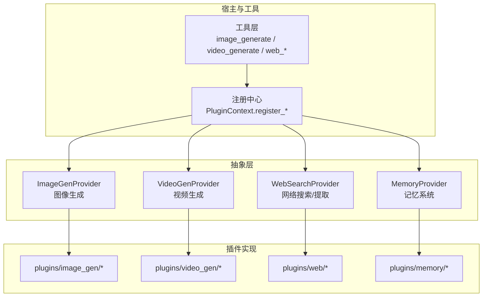
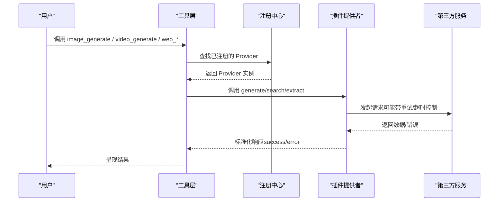
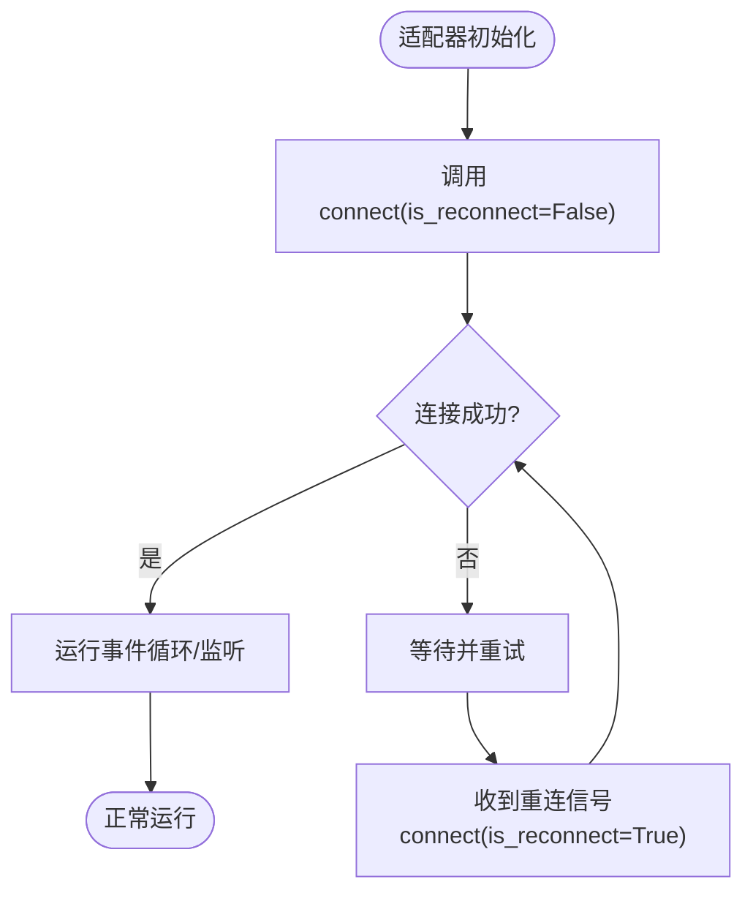
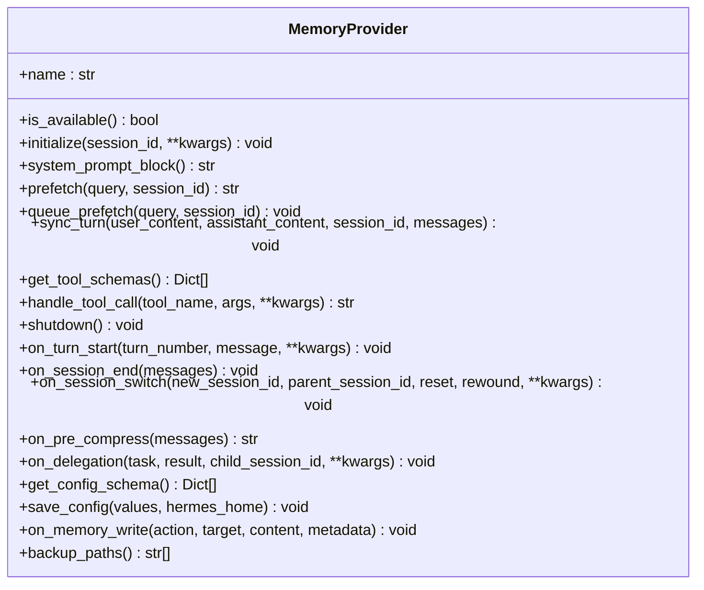
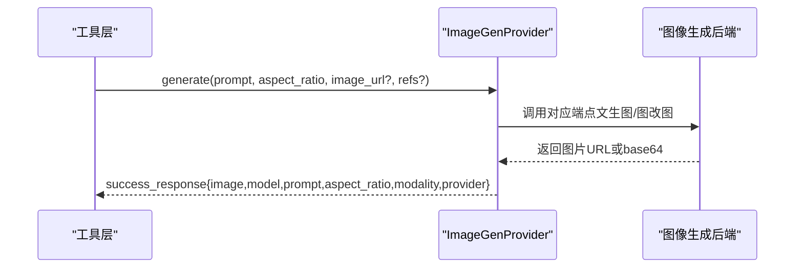
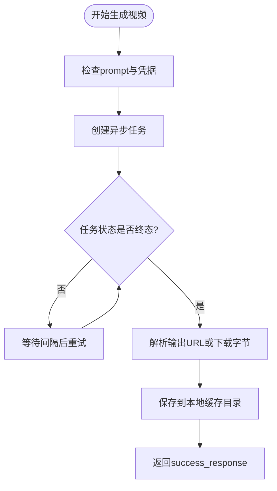
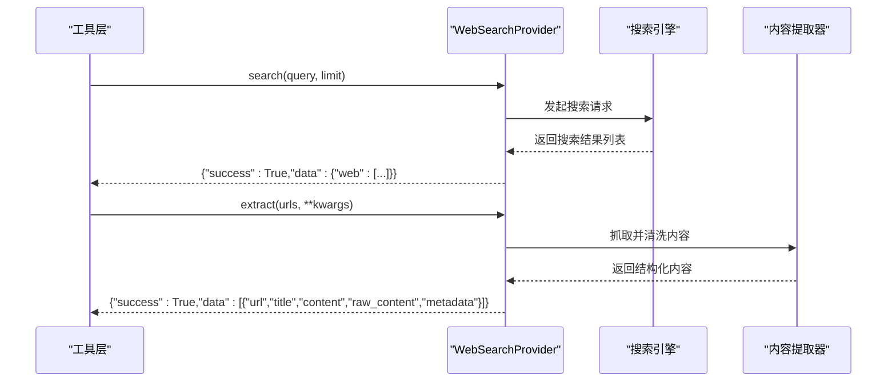
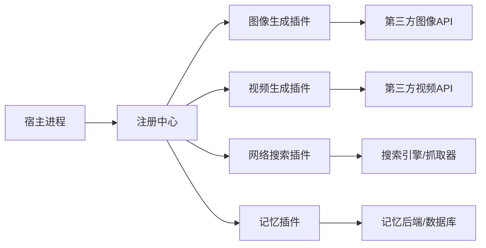

# 插件类型

<cite>
**本文引用的文件**
- [plugins/plugin_utils.py](file://plugins/plugin_utils.py)
- [agent/memory_provider.py](file://agent/memory_provider.py)
- [agent/image_gen_provider.py](file://agent/image_gen_provider.py)
- [agent/video_gen_provider.py](file://agent/video_gen_provider.py)
- [agent/web_search_provider.py](file://agent/web_search_provider.py)
- [tests/gateway/test_adapter_connect_is_reconnect_contract.py](file://tests/gateway/test_adapter_connect_is_reconnect_contract.py)
</cite>

## 目录
1. [简介](#简介)
2. [项目结构](#项目结构)
3. [核心组件](#核心组件)
4. [架构总览](#架构总览)
5. [详细组件分析](#详细组件分析)
6. [依赖关系分析](#依赖关系分析)
7. [性能考虑](#性能考虑)
8. [故障排查指南](#故障排查指南)
9. [结论](#结论)
10. [附录](#附录)

## 简介
本文件面向 Hermes Agent 的“插件类型”体系，系统性梳理并说明以下插件类型：模型提供商插件、平台适配器插件、记忆系统插件、图像生成插件、视频生成插件、网络搜索插件。对每种插件类型，文档将阐述其职责、接口规范、配置方式、使用场景、与其他类型的差异与适用性，并提供具体示例路径与最佳实践建议。目标是帮助开发者快速理解如何扩展或集成新的后端能力，同时保证与宿主系统的稳定对接。

## 项目结构
Hermes 的插件以“按能力域分目录”的方式组织，核心抽象位于 agent 目录下，具体实现以插件包形式置于 plugins 目录中。关键要点：
- 抽象层（ABC）定义统一接口与响应格式，确保不同后端可插拔替换。
- 注册机制通过 PluginContext 暴露的 register_* 方法完成，由宿主在启动时加载。
- 配置项通过 config.yaml 中的 provider 字段选择激活的后端。
- 工具层调用统一的工具名（如 image_generate、video_generate、web_search），由路由根据参数决定具体后端。

**图示来源**
- [agent/image_gen_provider.py:64-188](file://agent/image_gen_provider.py#L64-L188)
- [agent/video_gen_provider.py:75-196](file://agent/video_gen_provider.py#L75-L196)
- [agent/web_search_provider.py:89-212](file://agent/web_search_provider.py#L89-L212)
- [agent/memory_provider.py:81-358](file://agent/memory_provider.py#L81-L358)

**章节来源**
- [agent/image_gen_provider.py:1-40](file://agent/image_gen_provider.py#L1-L40)
- [agent/video_gen_provider.py:1-45](file://agent/video_gen_provider.py#L1-L45)
- [agent/web_search_provider.py:1-50](file://agent/web_search_provider.py#L1-L50)
- [agent/memory_provider.py:1-32](file://agent/memory_provider.py#L1-L32)

## 核心组件
本节概述各插件类型的核心职责与统一接口要点：
- 模型提供商插件：提供 LLM 推理能力，通常通过传输层（transports）适配不同厂商 API；在本仓库中体现为多套 model-providers 插件与运行时调度。
- 平台适配器插件：连接外部消息/协作平台（如 Telegram、Slack、Discord 等），负责连接、重连、事件收发；需遵循 connect(is_reconnect) 契约。
- 记忆系统插件：提供跨会话持久化回忆能力，支持预取、写入、工具暴露、备份路径等生命周期钩子。
- 图像生成插件：统一 text-to-image 与 image-to-image/edit 入口，返回标准化结果。
- 视频生成插件：统一 text-to-video 与 image-to-video 入口，封装异步任务轮询与本地缓存。
- 网络搜索插件：统一 web_search 与 web_extract 能力，屏蔽底层搜索引擎差异。

**章节来源**
- [agent/memory_provider.py:81-358](file://agent/memory_provider.py#L81-L358)
- [agent/image_gen_provider.py:64-188](file://agent/image_gen_provider.py#L64-L188)
- [agent/video_gen_provider.py:75-196](file://agent/video_gen_provider.py#L75-L196)
- [agent/web_search_provider.py:89-212](file://agent/web_search_provider.py#L89-L212)
- [tests/gateway/test_adapter_connect_is_reconnect_contract.py:33-145](file://tests/gateway/test_adapter_connect_is_reconnect_contract.py#L33-L145)

## 架构总览
下图展示插件类型在系统中的交互关系：工具层通过注册中心选择激活的后端，后端实现各自的具体逻辑，并通过统一响应格式回传结果。

**图示来源**
- [agent/image_gen_provider.py:341-394](file://agent/image_gen_provider.py#L341-L394)
- [agent/video_gen_provider.py:319-371](file://agent/video_gen_provider.py#L319-L371)
- [agent/web_search_provider.py:22-50](file://agent/web_search_provider.py#L22-L50)

## 详细组件分析

### 模型提供商插件
- 职责：为 Agent 提供大语言模型推理能力，屏蔽不同厂商 SDK/API 差异，统一认证、限流、计费与错误处理。
- 接口规范：通过传输层（transports）与模型提供方通信；在宿主侧由运行时选择并调用。
- 配置方式：在配置中选择 model.provider 或相关 key，设置密钥与基础 URL。
- 使用场景：对话、代码生成、工具调用编排、多模态输入输出。
- 与其他类型区别：模型提供商关注“文本/多模态推理”，不直接涉及平台接入或媒体生成。
- 示例路径：见仓库中 model-providers 下的多个实现（如 anthropic、openai、gemini、vertex 等）。

**章节来源**
- [agent/transports/chat_completions.py:1-200](file://agent/transports/chat_completions.py#L1-L200)
- [agent/transports/base.py:1-200](file://agent/transports/base.py#L1-L200)

### 平台适配器插件
- 职责：连接外部平台（聊天/协作/物联网等），负责连接建立、消息收发、事件分发与重连。
- 接口规范：必须实现 async def connect(..., is_reconnect=False)，网关会在重连时传入该关键字参数。
- 配置方式：在 gateway/platforms 或 plugins/platforms 下以 adapter.py 或 *_adapter.py 暴露适配器类。
- 使用场景：Telegram、Slack、Discord、Teams、WhatsApp、邮件、Home Assistant 等。
- 与其他类型区别：平台适配器聚焦“通道接入”，不涉及内容生成或记忆存储。
- 最佳实践：
  - 在 connect 中接受 is_reconnect 关键字，避免重连失败导致通道静默断开。
  - 保持连接状态一致，正确处理断线重连与幂等发送。
- 示例路径：见 tests 中对适配器接口的静态校验，确保所有适配器遵守契约。

**图示来源**
- [tests/gateway/test_adapter_connect_is_reconnect_contract.py:33-145](file://tests/gateway/test_adapter_connect_is_reconnect_contract.py#L33-L145)

**章节来源**
- [tests/gateway/test_adapter_connect_is_reconnect_contract.py:33-145](file://tests/gateway/test_adapter_connect_is_reconnect_contract.py#L33-L145)

### 记忆系统插件
- 职责：提供跨会话的持久化回忆能力，包括预取上下文、写入对话历史、暴露工具、备份外部路径等。
- 接口规范：实现 MemoryProvider ABC，包含 name、is_available、initialize、system_prompt_block、prefetch、sync_turn、get_tool_schemas、handle_tool_call、shutdown 以及若干可选钩子。
- 配置方式：通过 memory.provider 配置键选择激活的记忆后端；setup 流程会引导填写所需环境变量或配置文件。
- 使用场景：长期记忆、用户画像、知识检索、会话摘要、跨设备迁移。
- 与其他类型区别：记忆插件关注“状态与知识的持久化”，不直接产生内容或接入平台。
- 最佳实践：
  - prefetch 应轻量且可后台执行，避免阻塞主流程。
  - sync_turn 非阻塞写入，必要时队列化。
  - 实现 backup_paths 以便 hermes backup/import 完整迁移。
- 示例路径：plugins/memory 下的 honcho、mem0、hindsight、openviking 等。

**图示来源**
- [agent/memory_provider.py:81-358](file://agent/memory_provider.py#L81-L358)

**章节来源**
- [agent/memory_provider.py:81-358](file://agent/memory_provider.py#L81-L358)

### 图像生成插件
- 职责：统一 text-to-image 与 image-to-image/edit 能力，屏蔽不同后端差异，返回标准化结果。
- 接口规范：实现 ImageGenProvider ABC，必须实现 generate(prompt, aspect_ratio, image_url=None, reference_image_urls=None, **kwargs)。
- 配置方式：通过 image_gen.provider 选择激活后端；hermes tools 支持模型选择与元信息展示。
- 使用场景：文生图、参考图编辑、风格迁移、尺寸比例控制。
- 与其他类型区别：专注“图像生成”，不涉及视频或网页搜索。
- 最佳实践：
  - 忽略未知 kwargs 以保持向前兼容。
  - 使用 success_response/error_response 构造统一响应。
  - 对于临时 URL，优先下载到本地缓存目录以避免下游消费失败。
- 示例路径：plugins/image_gen 下的 fal、openai、xai、deepinfra、openrouter 等。

**图示来源**
- [agent/image_gen_provider.py:165-188](file://agent/image_gen_provider.py#L165-L188)
- [agent/image_gen_provider.py:341-394](file://agent/image_gen_provider.py#L341-L394)

**章节来源**
- [agent/image_gen_provider.py:64-188](file://agent/image_gen_provider.py#L64-L188)
- [agent/image_gen_provider.py:341-394](file://agent/image_gen_provider.py#L341-L394)

### 视频生成插件
- 职责：统一 text-to-video 与 image-to-video 能力，封装异步任务创建与轮询，下载并缓存结果。
- 接口规范：实现 VideoGenProvider ABC，必须实现 generate(prompt, model, image_url, duration, aspect_ratio, resolution, negative_prompt, audio, seed, **kwargs)。
- 配置方式：通过 video_gen.provider 选择激活后端；hermes tools 支持模型族选择与能力提示。
- 使用场景：短视频生成、动效制作、图像转视频。
- 与其他类型区别：专注“视频生成”，与图像生成类似但涉及更长的异步任务与更大的数据量。
- 最佳实践：
  - 使用 OpenAICompatibleVideoGenProvider 作为通用基类，减少重复实现。
  - 对长轮询设置合理间隔与截止时间，避免线程占用。
  - 对临时 URL 进行本地缓存，提高下游可用性。
- 示例路径：plugins/video_gen 下的 fal、xai、deepinfra 等。

**图示来源**
- [agent/video_gen_provider.py:168-196](file://agent/video_gen_provider.py#L168-L196)
- [agent/video_gen_provider.py:379-591](file://agent/video_gen_provider.py#L379-L591)

**章节来源**
- [agent/video_gen_provider.py:75-196](file://agent/video_gen_provider.py#L75-L196)
- [agent/video_gen_provider.py:379-591](file://agent/video_gen_provider.py#L379-L591)

### 网络搜索插件
- 职责：统一 web_search 与 web_extract 能力，屏蔽搜索引擎与抓取器差异。
- 接口规范：实现 WebSearchProvider ABC，至少实现 is_available，可选择实现 search 与 extract；supports_search/supports_extract 用于能力声明。
- 配置方式：通过 web.search_backend / web.extract_backend / web.backend 选择激活后端。
- 使用场景：实时信息检索、网页内容提取、并行抓取、结构化结果聚合。
- 与其他类型区别：专注“网络信息与内容获取”，不涉及模型推理或媒体生成。
- 最佳实践：
  - is_available 仅做轻量检查（环境变量/依赖导入/实例地址），不做网络调用。
  - extract 支持同步与异步两种形态，由调度器自动检测与 await。
  - 返回结果严格遵循约定格式，便于上层处理。
- 示例路径：plugins/web 下的 brave-free、ddgs、searxng、exa、parallel、tavily、firecrawl、xai 等。

**图示来源**
- [agent/web_search_provider.py:22-50](file://agent/web_search_provider.py#L22-L50)
- [agent/web_search_provider.py:142-184](file://agent/web_search_provider.py#L142-L184)

**章节来源**
- [agent/web_search_provider.py:89-212](file://agent/web_search_provider.py#L89-L212)

## 依赖关系分析
- 插件与宿主：通过注册中心解耦，宿主只关心统一接口与配置键。
- 插件之间：彼此独立，互不依赖；工具层负责路由到正确插件。
- 外部依赖：各插件可能依赖第三方 SDK（如 openai、requests、特定平台 SDK），应在 is_available 中检查并优雅降级。
- 并发安全：插件内部若维护全局单例，建议使用共享工具 lazy_singleton 或 SingletonSlot 避免竞态条件。

**图示来源**
- [plugins/plugin_utils.py:43-136](file://plugins/plugin_utils.py#L43-L136)

**章节来源**
- [plugins/plugin_utils.py:1-136](file://plugins/plugin_utils.py#L1-L136)

## 性能考虑
- 预取与异步：记忆插件的 prefetch 与 queue_prefetch 分离，避免阻塞主流程；网络搜索与媒体生成尽量异步化。
- 轮询与超时：视频生成采用有界轮询与截止时间，防止长时间占用线程。
- 资源复用：使用 lazy_singleton/SingletonSlot 管理昂贵客户端，避免重复创建连接与泄漏资源。
- 缓存策略：图像/视频生成优先下载并缓存到本地目录，提升下游可用性。
- 轻量检查：is_available 只做本地检查，避免在工具注册阶段发起网络请求。

[本节为通用指导，无需特定文件引用]

## 故障排查指南
- 平台适配器重连失败：确认 connect 方法签名包含 is_reconnect 关键字；否则网关重连时会抛出异常导致通道静默断开。
- 插件不可用：检查 is_available 的实现与环境变量/依赖是否正确；确保 get_setup_schema 能正确提示缺失项。
- 生成任务卡住：检查视频生成的轮询间隔与截止时间；确认网络可达与凭据有效。
- 搜索结果为空：确认 supports_search/supports_extract 与实际实现一致；检查后端限流与配额。
- 内存写入未生效：确认 sync_turn 非阻塞写入；检查 on_session_switch/on_session_end 钩子是否正确更新状态。

**章节来源**
- [tests/gateway/test_adapter_connect_is_reconnect_contract.py:33-145](file://tests/gateway/test_adapter_connect_is_reconnect_contract.py#L33-L145)
- [agent/memory_provider.py:154-188](file://agent/memory_provider.py#L154-L188)
- [agent/video_gen_provider.py:419-441](file://agent/video_gen_provider.py#L419-L441)
- [agent/web_search_provider.py:116-140](file://agent/web_search_provider.py#L116-L140)

## 结论
Hermes 的插件体系通过清晰的抽象层与统一的响应格式，实现了模型推理、平台接入、记忆存储、图像/视频生成、网络搜索等能力的灵活扩展。开发者只需遵循对应 ABC 的接口规范与配置约定，即可快速集成新后端。建议在实现中重视并发安全、异步处理、缓存与超时控制，以提升整体稳定性与性能。

[本节为总结性内容，无需特定文件引用]

## 附录
- 常用配置键：
  - image_gen.provider
  - video_gen.provider
  - web.search_backend / web.extract_backend / web.backend
  - memory.provider
  - model.provider（模型提供商）
- 工具名：
  - image_generate
  - video_generate
  - web_search / web_extract
- 插件目录：
  - plugins/image_gen/*
  - plugins/video_gen/*
  - plugins/web/*
  - plugins/memory/*
  - plugins/model-providers/*
  - plugins/platforms/*

[本节为补充信息，无需特定文件引用]