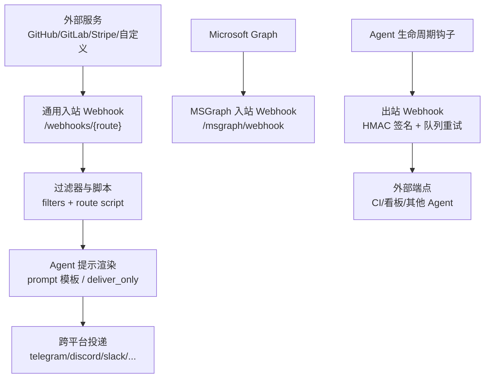
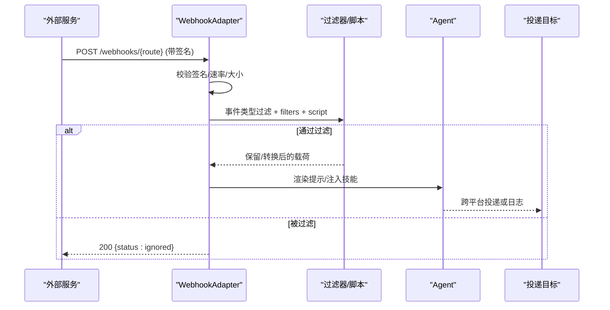
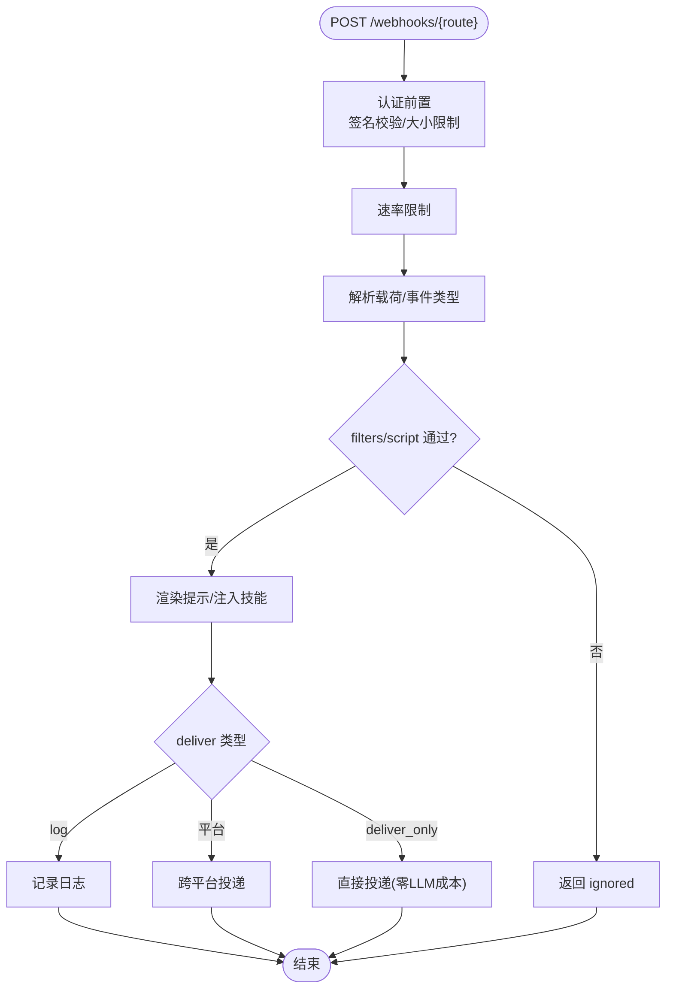
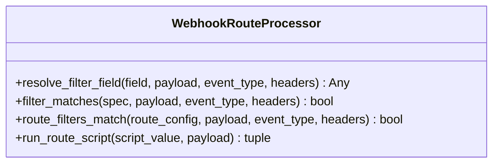
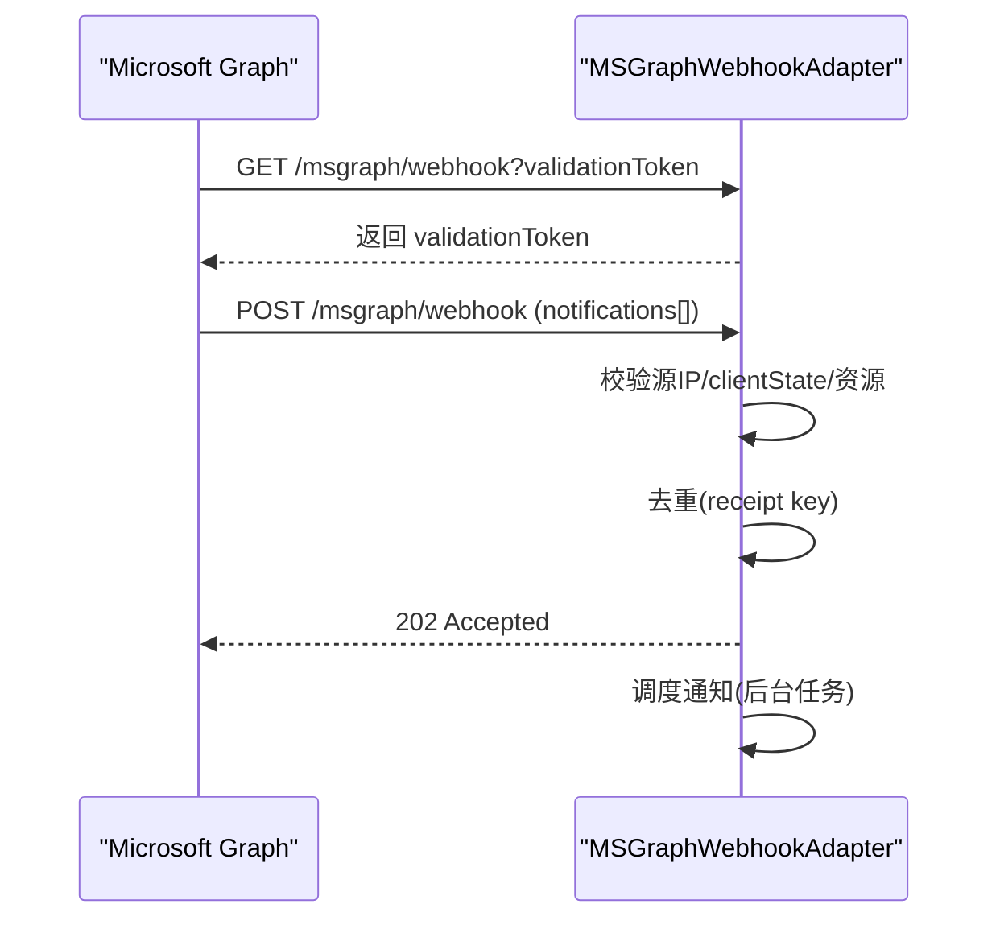
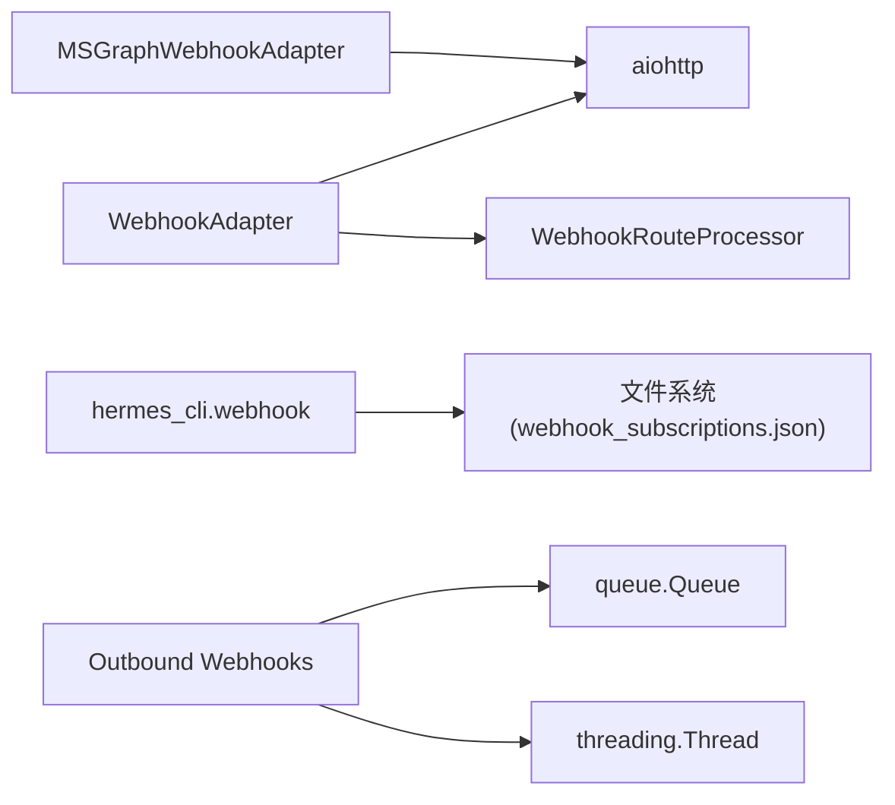

# Webhook 集成

<cite>
**本文引用的文件**
- [gateway/platforms/webhook.py](file://gateway/platforms/webhook.py)
- [gateway/platforms/webhook_filters.py](file://gateway/platforms/webhook_filters.py)
- [gateway/platforms/msgraph_webhook.py](file://gateway/platforms/msgraph_webhook.py)
- [hermes_cli/webhook.py](file://hermes_cli/webhook.py)
- [hermes_cli/subcommands/webhook.py](file://hermes_cli/subcommands/webhook.py)
- [agent/outbound_webhooks.py](file://agent/outbound_webhooks.py)
- [tests/gateway/test_webhook_adapter.py](file://tests/gateway/test_webhook_adapter.py)
</cite>

## 目录
1. [简介](#简介)
2. [项目结构](#项目结构)
3. [核心组件](#核心组件)
4. [架构总览](#架构总览)
5. [详细组件分析](#详细组件分析)
6. [依赖关系分析](#依赖关系分析)
7. [性能与可靠性](#性能与可靠性)
8. [故障排查指南](#故障排查指南)
9. [结论](#结论)
10. [附录：配置与使用要点](#附录：配置与使用要点)

## 简介
本技术文档面向 Hermes Agent 的 Webhook 集成系统，覆盖入站与出站两条链路：
- 入站 Webhook：接收外部服务（如 Microsoft Graph、GitHub/GitLab、Stripe 等）的 HTTP 回调，完成请求验证、签名校验、安全过滤、事件类型过滤、条件匹配与规则引擎处理，并将结果转换为 Agent 提示或直投消息。
- 出站 Webhook：在 Agent 生命周期中向外发送通知（CI/监控/其他 Agent），采用无阻塞队列与重试机制，支持 HMAC 签名与幂等投递。

文档同时提供调试与监控建议，帮助快速定位问题并评估运行状态。

## 项目结构
Webhook 相关代码主要分布在以下模块：
- 通用入站 Webhook 平台适配器：gateway/platforms/webhook.py
- 入站路由过滤器与脚本转换：gateway/platforms/webhook_filters.py
- Microsoft Graph 专用入站适配器：gateway/platforms/msgraph_webhook.py
- CLI 动态订阅管理：hermes_cli/webhook.py、hermes_cli/subcommands/webhook.py
- 出站 Webhook 通知：agent/outbound_webhooks.py
- 单元测试（签名、速率限制、健康检查等）：tests/gateway/test_webhook_adapter.py

图表来源
- [gateway/platforms/webhook.py:177-344](file://gateway/platforms/webhook.py#L177-L344)
- [gateway/platforms/msgraph_webhook.py:52-185](file://gateway/platforms/msgraph_webhook.py#L52-L185)
- [agent/outbound_webhooks.py:156-207](file://agent/outbound_webhooks.py#L156-L207)

章节来源
- [gateway/platforms/webhook.py:177-344](file://gateway/platforms/webhook.py#L177-L344)
- [gateway/platforms/msgraph_webhook.py:52-185](file://gateway/platforms/msgraph_webhook.py#L52-L185)
- [agent/outbound_webhooks.py:156-207](file://agent/outbound_webhooks.py#L156-L207)

## 核心组件
- 通用入站 Webhook 适配器：提供 aiohttp 服务器、路由注册、HMAC 签名校验、速率限制、负载大小限制、事件类型过滤、过滤器与脚本执行、提示模板渲染、直投模式、多 Profile 复用。
- 过滤器与脚本处理器：声明式过滤器（字段存在性、等于/包含/正则/文件列表/逻辑组合 all/any/not）、可执行脚本（bash/python）对载荷进行转换或忽略。
- Microsoft Graph 适配器：订阅验证握手、源 IP CIDR 白名单、clientState 校验、重复回执去重、资源前缀匹配、异步调度。
- CLI 动态订阅：通过 hermes webhook 命令创建/列出/删除/测试订阅，持久化到本地 JSON，热加载生效。
- 出站 Webhook：基于进程内队列与守护线程，HMAC-SHA256 签名，有限重试，避免阻塞 Agent 主循环。

章节来源
- [gateway/platforms/webhook.py:177-344](file://gateway/platforms/webhook.py#L177-L344)
- [gateway/platforms/webhook_filters.py:94-303](file://gateway/platforms/webhook_filters.py#L94-L303)
- [gateway/platforms/msgraph_webhook.py:52-185](file://gateway/platforms/msgraph_webhook.py#L52-L185)
- [hermes_cli/webhook.py:140-308](file://hermes_cli/webhook.py#L140-L308)
- [agent/outbound_webhooks.py:156-207](file://agent/outbound_webhooks.py#L156-L207)

## 架构总览
入站 Webhook 的请求路径：
- 路由解析与多 Profile 支持：/webhooks/{route} 与 /p/{profile}/webhooks/{route}
- 认证与安全：HMAC 签名校验（兼容 GitHub/GitLab/Svix/V2 时间戳绑定）、INSECURE_NO_AUTH 仅用于本地测试且禁止公网绑定
- 速率限制与负载限制：固定窗口限流、最大 Body 字节数
- 事件过滤：从头部或载荷提取事件类型，按 routes.events 白名单过滤
- 规则引擎：filters（all/any/not/exists/equals/contains/in/in_file/regex）+ route script（bash/python）
- 提示渲染：将载荷注入 prompt 模板；可选 skills 自动注入技能指令
- 投递策略：deliver=log（日志）、deliver=真实平台（跨平台投递）、deliver_only（跳过 Agent，直接投递）

出站 Webhook 的通知路径：
- 注册：读取 hooks.outbound 配置，向插件管理器注册回调
- 序列化：构造标准 JSON 载荷，附带 delivery_id、timestamp、X-Hermes-* 头
- 投递：进程内队列 + 单守护线程，超时与重试，拒绝 3xx 重定向，4xx 不重试

图表来源
- [gateway/platforms/webhook.py:584-800](file://gateway/platforms/webhook.py#L584-L800)
- [gateway/platforms/webhook_filters.py:141-226](file://gateway/platforms/webhook_filters.py#L141-L226)
- [agent/outbound_webhooks.py:380-455](file://agent/outbound_webhooks.py#L380-L455)

章节来源
- [gateway/platforms/webhook.py:584-800](file://gateway/platforms/webhook.py#L584-L800)
- [gateway/platforms/webhook_filters.py:141-226](file://gateway/platforms/webhook_filters.py#L141-L226)
- [agent/outbound_webhooks.py:380-455](file://agent/outbound_webhooks.py#L380-L455)

## 详细组件分析

### 通用入站 Webhook 适配器
- HTTP 端点与生命周期
  - 启动时创建 aiohttp Application，注册 /health、/webhooks/{route}、/p/{profile}/webhooks/{route}
  - connect() 中校验每个路由的 secret，拒绝 INSECURE_NO_AUTH 在非回环主机上暴露
  - 支持双栈默认绑定（None），可通过 extra.host 指定监听地址
- 请求处理流程
  - 热重载动态订阅（webhook_subscriptions.json）
  - 解析 profile 前缀，校验是否允许该 profile
  - 认证前置：Content-Length 检查、读取 body、HMAC 签名校验（兼容多种签名格式）
  - 速率限制：每路由固定窗口计数
  - 事件类型过滤：从 X-GitHub-Event/X-GitLab-Event/payload.event_type/type 提取
  - 过滤器与脚本：filters（all/any/not/exists/equals/contains/in/in_file/regex）与 route script（bash/python）
  - 提示渲染：prompt 模板注入 payload；可选 skills 注入技能指令
  - 投递：deliver=log/真实平台/deliver_only（跳过 Agent）
- 安全特性
  - HMAC 签名校验（含 Svix v1、V2 时间戳绑定、GitLab Token）
  - 非 ASCII 输入的安全比较（防止异常导致 500）
  - 拒绝 3xx 重定向（防误配与泄露）
  - 负载大小限制（client_max_size + 实际字节检查）
  - 幂等性：delivery_id 缓存（TTL 清理）

图表来源
- [gateway/platforms/webhook.py:584-800](file://gateway/platforms/webhook.py#L584-L800)
- [gateway/platforms/webhook_filters.py:141-226](file://gateway/platforms/webhook_filters.py#L141-L226)

章节来源
- [gateway/platforms/webhook.py:177-344](file://gateway/platforms/webhook.py#L177-L344)
- [gateway/platforms/webhook.py:584-800](file://gateway/platforms/webhook.py#L584-L800)
- [tests/gateway/test_webhook_adapter.py:130-200](file://tests/gateway/test_webhook_adapter.py#L130-L200)

### 过滤器与规则引擎
- 字段解析：支持 payload/event/event_type/headers 上下文，点号路径访问字典/列表索引
- 操作符：
  - exists/missing：字段存在性判断
  - equals/not_equals：精确匹配
  - contains/in/in_file：集合/文件列表匹配
  - regex：正则匹配（字符串化后匹配）
  - all/any/not：逻辑组合
- 脚本执行：
  - 支持 bash/python，限定在 ~/.hermes/scripts 下
  - 超时保护（默认 30 秒），输出敏感信息脱敏
  - 返回空/[SILENT]/非零退出码视为忽略；JSON 对象作为转换结果

图表来源
- [gateway/platforms/webhook_filters.py:94-303](file://gateway/platforms/webhook_filters.py#L94-L303)

章节来源
- [gateway/platforms/webhook_filters.py:94-303](file://gateway/platforms/webhook_filters.py#L94-L303)

### Microsoft Graph 入站适配器
- 订阅验证：GET /msgraph/webhook?validationToken=xxx，必须原样返回文本
- 安全控制：
  - 源 IP CIDR 白名单（allowed_source_cidrs），公网绑定时必须配置
  - clientState 校验（HMAC 安全比较）
  - 资源接受列表（支持前缀匹配）
- 去重与统计：seen receipts 队列与上限，接受/重复/拒绝计数
- 异步调度：支持传入 scheduler 或直接后台任务处理

图表来源
- [gateway/platforms/msgraph_webhook.py:153-185](file://gateway/platforms/msgraph_webhook.py#L153-L185)
- [gateway/platforms/msgraph_webhook.py:219-314](file://gateway/platforms/msgraph_webhook.py#L219-L314)

章节来源
- [gateway/platforms/msgraph_webhook.py:52-185](file://gateway/platforms/msgraph_webhook.py#L52-L185)
- [gateway/platforms/msgraph_webhook.py:219-314](file://gateway/platforms/msgraph_webhook.py#L219-L314)

### CLI 动态订阅管理
- 命令：subscribe/add/list/remove/test
- 持久化：~/.hermes/webhook_subscriptions.json，原子写入与权限控制（0o600）
- 热加载：网关启动与每次请求时检测文件变更并合并静态/动态路由
- 生成 URL：base_url/webhooks/{name}，自动生成 HMAC secret
- 测试：内置计算签名并发送测试 POST

章节来源
- [hermes_cli/webhook.py:140-308](file://hermes_cli/webhook.py#L140-L308)
- [hermes_cli/subcommands/webhook.py:12-84](file://hermes_cli/subcommands/webhook.py#L12-L84)

### 出站 Webhook 通知
- 配置：hooks.outbound 列表，支持 url/events/secret_env/matcher/timeout/name
- 注册：idempotent，安全模式下跳过
- 载荷：标准 JSON，包含 hook_event_name/tool_name/session_id/cwd/extra/delivery_id/timestamp
- 签名：HMAC-SHA256，X-Hermes-Signature-256
- 投递：进程内队列 + 守护线程，超时与重试（连接错误/5xx），4xx 不重试，拒绝 3xx
- 工具级匹配：pre_tool_call/post_tool_call 支持 matcher 正则匹配工具名

章节来源
- [agent/outbound_webhooks.py:156-207](file://agent/outbound_webhooks.py#L156-L207)
- [agent/outbound_webhooks.py:380-455](file://agent/outbound_webhooks.py#L380-L455)
- [agent/outbound_webhooks.py:520-570](file://agent/outbound_webhooks.py#L520-L570)

## 依赖关系分析
- 通用入站 Webhook 依赖 aiohttp 提供 HTTP 服务器能力
- 过滤器与脚本处理器依赖 Python 标准库与 subprocess，脚本路径受限于 ~/.hermes/scripts
- Microsoft Graph 适配器依赖 aiohttp，要求配置 allowed_source_cidrs（公网绑定）
- CLI 动态订阅依赖 hermes_constants 获取 home 路径，使用 utils.atomic_replace 保证原子写入
- 出站 Webhook 依赖 queue、threading、urllib.request，使用 atexit 在进程退出时尝试排空队列

图表来源
- [gateway/platforms/webhook.py:47-66](file://gateway/platforms/webhook.py#L47-L66)
- [gateway/platforms/webhook_filters.py:1-18](file://gateway/platforms/webhook_filters.py#L1-L18)
- [gateway/platforms/msgraph_webhook.py:14-30](file://gateway/platforms/msgraph_webhook.py#L14-L30)
- [hermes_cli/webhook.py:13-24](file://hermes_cli/webhook.py#L13-L24)
- [agent/outbound_webhooks.py:69-109](file://agent/outbound_webhooks.py#L69-L109)

章节来源
- [gateway/platforms/webhook.py:47-66](file://gateway/platforms/webhook.py#L47-L66)
- [gateway/platforms/webhook_filters.py:1-18](file://gateway/platforms/webhook_filters.py#L1-L18)
- [gateway/platforms/msgraph_webhook.py:14-30](file://gateway/platforms/msgraph_webhook.py#L14-L30)
- [hermes_cli/webhook.py:13-24](file://hermes_cli/webhook.py#L13-L24)
- [agent/outbound_webhooks.py:69-109](file://agent/outbound_webhooks.py#L69-L109)

## 性能与可靠性
- 入站 Webhook
  - 速率限制：固定窗口 per-route，默认每分钟 30 次，可配置
  - 负载限制：client_max_size 与 body 长度双重检查，防止大负载攻击
  - 幂等性：delivery_id TTL 缓存，避免重复触发 Agent
  - 过滤器与脚本：在事件进入 Agent 前过滤，减少无效处理
  - 直投模式：deliver_only 跳过 LLM，降低延迟与成本
- 出站 Webhook
  - 无阻塞：回调仅入队，守护线程负责网络 I/O
  - 重试策略：连接错误与 5xx 重试，4xx 不重试，3xx 拒绝
  - 超时控制：per-attempt 超时，默认 10 秒，上限 60 秒
  - 队列容量：最大 256 条，满时丢弃并记录警告

[本节为通用性能讨论，无需特定文件引用]

## 故障排查指南
- 签名失败
  - 确认发送方使用的签名格式（GitHub/GitLab/Svix/V2）
  - 检查 secret 是否正确配置，INSECURE_NO_AUTH 仅限本地测试
  - 参考测试用例中的签名计算方法
- 事件被忽略
  - 检查 events 白名单与 filters 规则
  - 查看 route script 输出是否为空/[SILENT] 或非零退出码
- 速率限制
  - 调整 rate_limit 或观察日志中的 429 响应
- 负载过大
  - 调整 max_body_bytes 或优化发送方载荷
- Microsoft Graph 接入
  - 确保 allowed_source_cidrs 配置正确（公网绑定必需）
  - 校验 clientState 与 subscription 验证令牌
- 出站失败
  - 检查目标 URL 可达性与超时设置
  - 查看日志中的重试与失败原因

章节来源
- [tests/gateway/test_webhook_adapter.py:130-200](file://tests/gateway/test_webhook_adapter.py#L130-L200)
- [gateway/platforms/msgraph_webhook.py:148-167](file://gateway/platforms/msgraph_webhook.py#L148-L167)
- [agent/outbound_webhooks.py:520-570](file://agent/outbound_webhooks.py#L520-L570)

## 结论
Hermes Agent 的 Webhook 集成提供了健壮、安全、可扩展的事件驱动能力：
- 入站：支持多源、多协议、强安全校验、灵活过滤与脚本转换、直投模式
- 出站：无阻塞、签名、重试、幂等，适合 CI/监控/跨 Agent 通知
- 运维：CLI 动态订阅、热加载、健康检查、测试工具

建议在生产环境中：
- 始终配置 HMAC secret，避免 INSECURE_NO_AUTH 暴露于公网
- 合理设置速率限制与负载限制
- 使用 filters 与脚本实现细粒度事件治理
- 对 Microsoft Graph 启用 CIDR 白名单与 clientState 校验
- 监控日志与指标，及时处理失败与告警

[本节为总结性内容，无需特定文件引用]

## 附录：配置与使用要点
- 通用入站 Webhook
  - 启用平台：platforms.webhook.enabled=true
  - 监听地址与端口：platforms.webhook.extra.host/port
  - 全局 secret：platforms.webhook.extra.secret
  - 路由：platforms.webhook.extra.routes.<name>.events/secret/prompt/skills/deliver/deliver_extra/deliver_only/filters/script
- Microsoft Graph
  - 启用平台：platforms.msgraph_webhook.enabled=true
  - 客户端状态：platforms.msgraph_webhook.extra.client_state
  - 源 IP 白名单：platforms.msgraph_webhook.extra.allowed_source_cidrs
  - 资源接受列表：platforms.msgraph_webhook.extra.accepted_resources
- CLI 动态订阅
  - 创建：hermes webhook subscribe <name> --prompt/--events/--skills/--deliver/--secret
  - 测试：hermes webhook test <name> --payload
  - 列出/删除：hermes webhook list/remove
- 出站 Webhook
  - 配置：hooks.outbound[].url/events/secret_env/matcher/timeout/name
  - 安全：优先使用 secret_env 注入密钥，避免明文
  - 工具匹配：matcher 仅对 pre_tool_call/post_tool_call 生效

章节来源
- [gateway/platforms/webhook.py:186-243](file://gateway/platforms/webhook.py#L186-L243)
- [gateway/platforms/msgraph_webhook.py:55-87](file://gateway/platforms/msgraph_webhook.py#L55-L87)
- [hermes_cli/webhook.py:162-224](file://hermes_cli/webhook.py#L162-L224)
- [agent/outbound_webhooks.py:32-65](file://agent/outbound_webhooks.py#L32-L65)