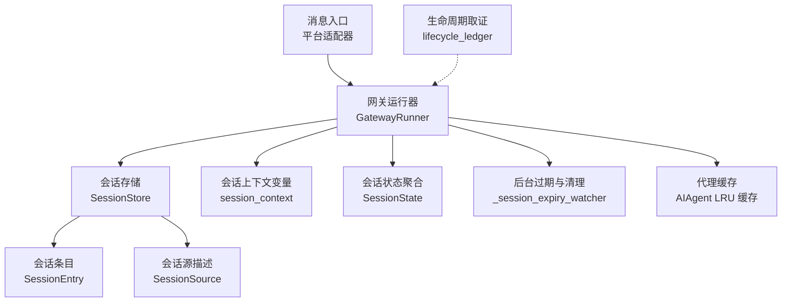
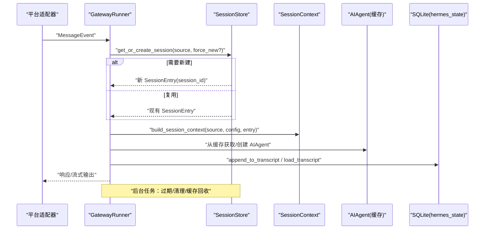
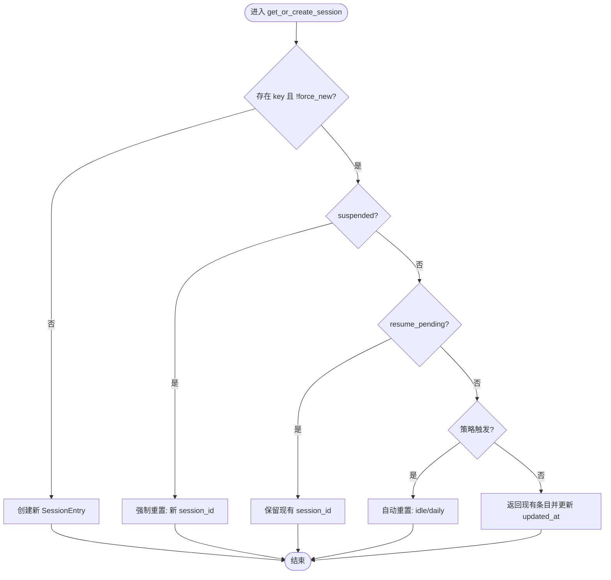
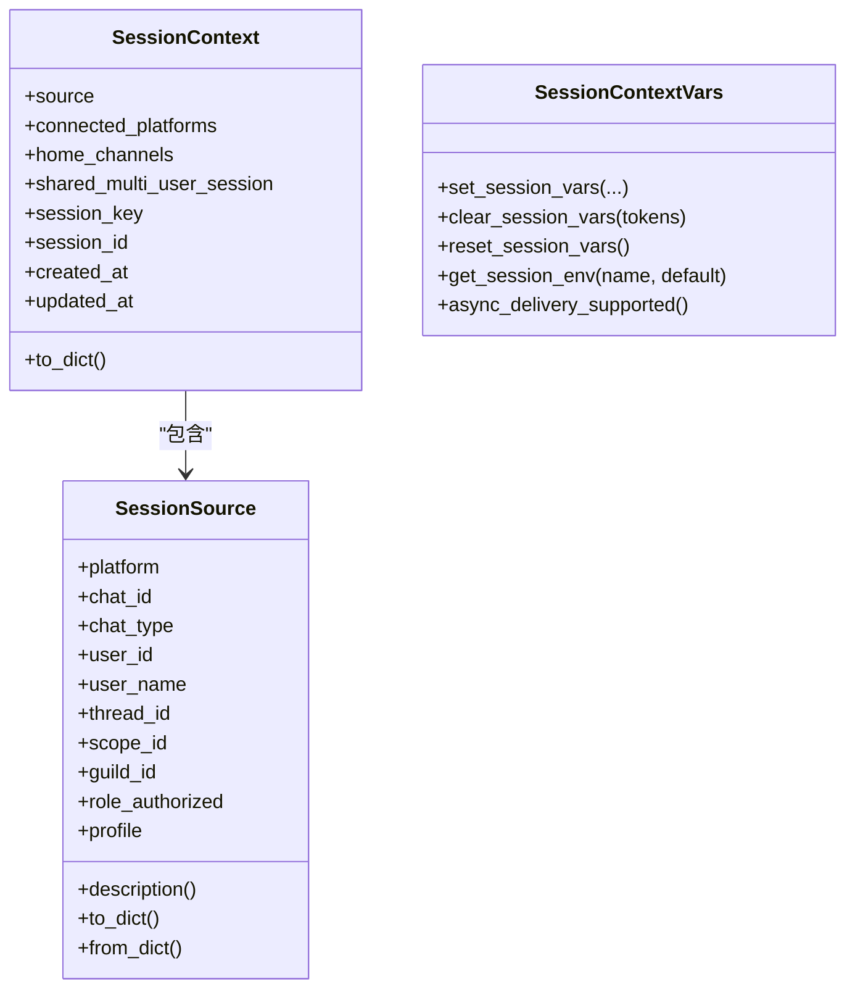
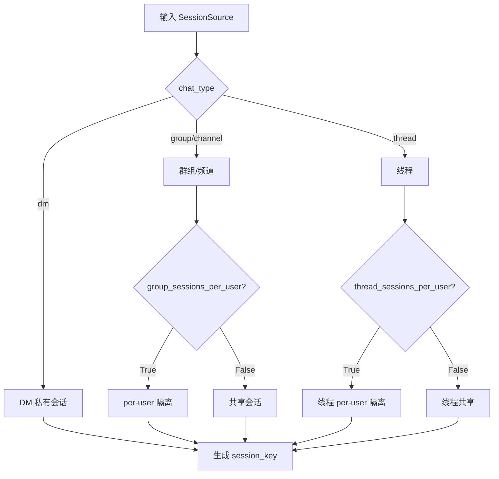
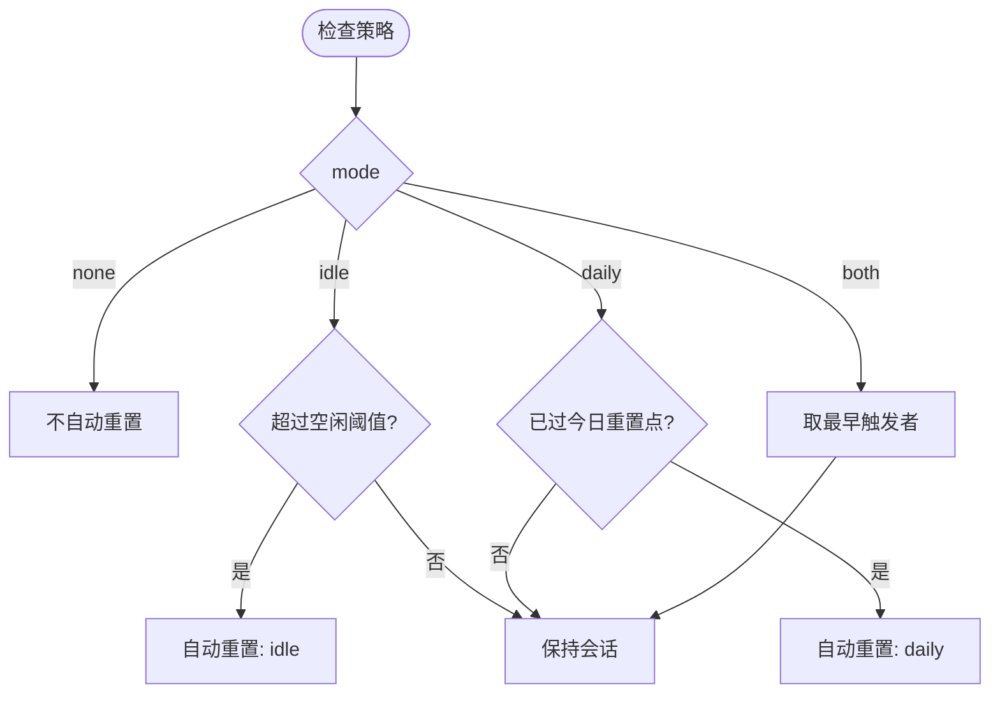
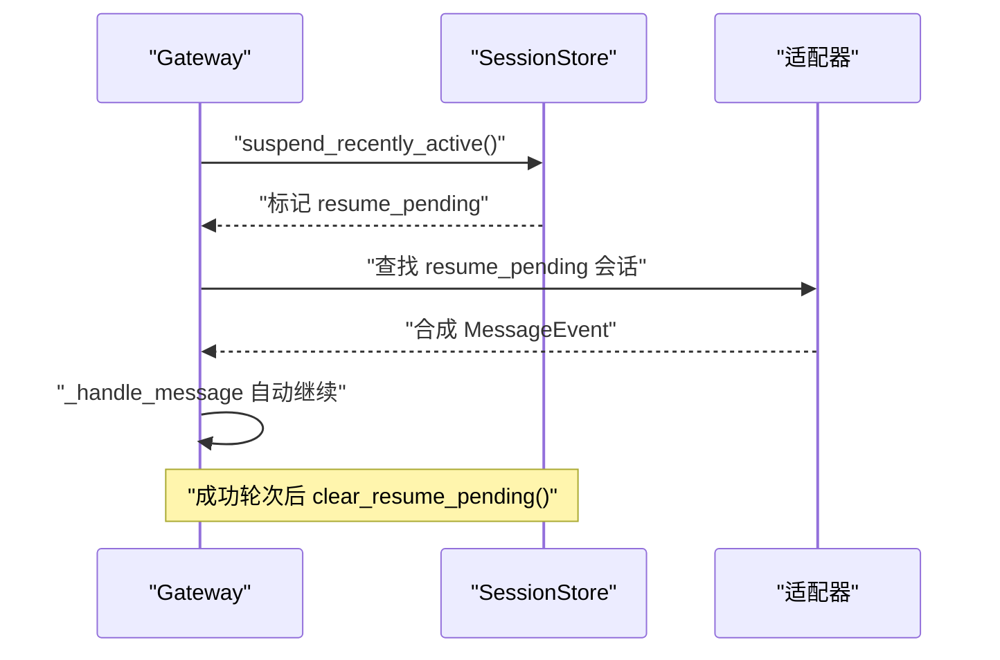
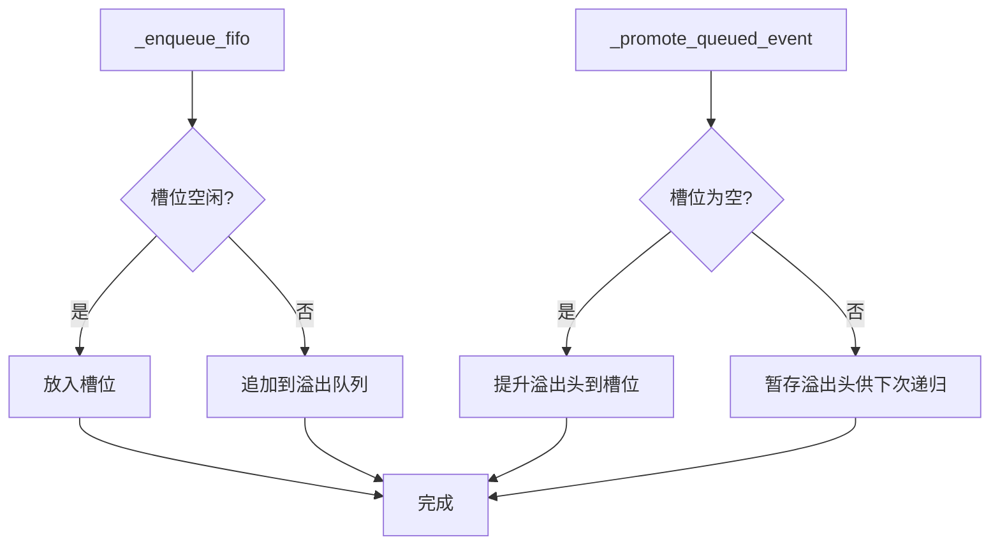
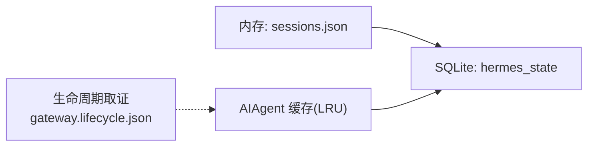
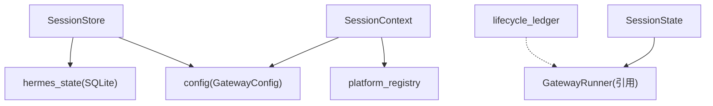

# 会话管理

<cite>
**本文引用的文件**
- [gateway/session.py](file://gateway/session.py)
- [gateway/session_context.py](file://gateway/session_context.py)
- [gateway/session_state.py](file://gateway/session_state.py)
- [gateway/lifecycle_ledger.py](file://gateway/lifecycle_ledger.py)
- [docs/session-lifecycle.md](file://docs/session-lifecycle.md)
</cite>

## 目录
1. [简介](#简介)
2. [项目结构](#项目结构)
3. [核心组件](#核心组件)
4. [架构总览](#架构总览)
5. [详细组件分析](#详细组件分析)
6. [依赖关系分析](#依赖关系分析)
7. [性能考量](#性能考量)
8. [故障排查指南](#故障排查指南)
9. [结论](#结论)
10. [附录](#附录)

## 简介
本技术文档聚焦 Hermes Agent 的会话管理系统，围绕以下目标展开：
- 会话生命周期：创建、激活、挂起、恢复、销毁等状态转换与触发条件。
- 会话上下文数据结构：用户信息、对话历史、工具状态、权限设置等。
- 多平台会话关联：跨平台身份映射、会话同步、一致性保证。
- 持久化策略：内存缓存、数据库存储、分布式共享（进程内/跨进程）。
- 监控与管理：会话监控指标、清理策略、异常恢复与诊断。

## 项目结构
与会话管理直接相关的核心模块位于 gateway 层，辅以 CLI 导出/查询能力与统一的状态记录。

图表来源
- [gateway/session.py:148-310](file://gateway/session.py#L148-L310)
- [gateway/session_context.py:206-313](file://gateway/session_context.py#L206-L313)
- [gateway/session_state.py:51-179](file://gateway/session_state.py#L51-L179)
- [gateway/lifecycle_ledger.py:181-268](file://gateway/lifecycle_ledger.py#L181-L268)
- [docs/session-lifecycle.md:144-204](file://docs/session-lifecycle.md#L144-L204)

章节来源
- [docs/session-lifecycle.md:1-20](file://docs/session-lifecycle.md#L1-L20)

## 核心组件
- SessionSource：消息来源描述，包含平台、聊天ID、线程ID、用户标识、角色授权、作用域等，用于路由、隔离与系统提示注入。
- SessionEntry：活跃会话元数据，包含 session_key、session_id、时间戳、token 用量、重置标志、恢复标记等。
- SessionStore：会话存储与操作中心，负责创建/获取/重置/挂起/恢复/修剪/转录读写等。
- SessionContext：构建动态系统提示所需的上下文，包括连接平台、家庭频道、是否多用户共享会话等。
- session_context：基于 contextvars 的任务级会话变量，避免并发覆盖，提供 set/clear/reset 与读取接口。
- SessionState：将网关每会话状态按 turn/conversation/persistent 三范围集中管理，避免分散字典导致的边界漂移。
- lifecycle_ledger：网关生命周期取证，记录上次非正常退出证据，辅助排障。

章节来源
- [gateway/session.py:148-310](file://gateway/session.py#L148-L310)
- [gateway/session.py:773-800](file://gateway/session.py#L773-L800)
- [gateway/session_context.py:206-313](file://gateway/session_context.py#L206-L313)
- [gateway/session_state.py:51-179](file://gateway/session_state.py#L51-L179)
- [gateway/lifecycle_ledger.py:181-268](file://gateway/lifecycle_ledger.py#L181-L268)

## 架构总览
会话管理的整体流程如下：
- 消息到达后，根据 SessionSource 计算 session_key，调用 SessionStore.get_or_create_session() 决定复用或新建会话。
- 若存在 resume_pending 或 suspended 等标志，执行软恢复或强制重置。
- 构造 SessionContext 并注入系统提示；在 GatewayRunner 中驱动 AIAgent 处理消息。
- 后台任务定期评估过期策略、清理缓存、回收资源、修剪旧条目。
- 通过 session_context 为每个异步任务绑定会话变量，确保并发安全。
- 使用 lifecycle_ledger 记录网关启动/退出证据，辅助定位非正常死亡。

图表来源
- [docs/session-lifecycle.md:99-141](file://docs/session-lifecycle.md#L99-L141)
- [docs/session-lifecycle.md:144-204](file://docs/session-lifecycle.md#L144-L204)
- [docs/session-lifecycle.md:503-537](file://docs/session-lifecycle.md#L503-L537)
- [docs/session-lifecycle.md:578-652](file://docs/session-lifecycle.md#L578-L652)

## 详细组件分析

### 会话生命周期与状态机
- 关键状态与标志：
  - suspended：硬挂起信号，下次访问强制新建 session_id。
  - resume_pending：软恢复标记，保留现有 session_id，直到下一次成功轮次完成。
  - was_auto_reset/auto_reset_reason：自动重置原因（idle/daily），首次消息注入通知。
  - expiry_finalized：已执行 on_session_finalize 钩子与资源清理，防止重复终结。
- 决策优先级（get_or_create_session）：
  1) suspended=True → 强制重置
  2) resume_pending=True → 保留 session_id（软恢复）
  3) 策略触发（idle/daily）→ 自动重置
  4) 无触发 → 返回现有条目并更新 updated_at

图表来源
- [docs/session-lifecycle.md:99-141](file://docs/session-lifecycle.md#L99-L141)

章节来源
- [docs/session-lifecycle.md:82-141](file://docs/session-lifecycle.md#L82-L141)

### 会话上下文数据结构
- SessionSource：
  - 字段：platform、chat_id、chat_type、user_id/user_name、thread_id、scope_id/guild_id、role_authorized、profile 等。
  - 用途：路由、隔离、系统提示注入、定时任务投递。
- SessionContext：
  - 字段：source、connected_platforms、home_channels、shared_multi_user_session、session_key/id/timestamps。
  - 用途：构建动态系统提示，告知 agent 当前上下文与可用能力。
- session_context（contextvars）：
  - 提供 set_session_vars/clear_session_vars/reset_session_vars/get_session_env 等接口。
  - 解决并发场景下 os.environ 被覆盖的问题，确保每个异步任务拥有独立会话上下文。

图表来源
- [gateway/session.py:148-310](file://gateway/session.py#L148-L310)
- [gateway/session.py:314-347](file://gateway/session.py#L314-L347)
- [gateway/session_context.py:206-313](file://gateway/session_context.py#L206-L313)

章节来源
- [gateway/session.py:148-310](file://gateway/session.py#L148-L310)
- [gateway/session.py:314-347](file://gateway/session.py#L314-L347)
- [gateway/session_context.py:206-313](file://gateway/session_context.py#L206-L313)

### 会话键生成与多平台关联
- 键格式：agent:main:{platform}:{chat_type}[:{chat_id}][:{thread_id}][:{participant_id}]
- DM 规则：始终私聊隔离；支持 thread_id 细分；无 chat_id 时回退到 user_id_alt/user_id。
- 群组/频道规则：默认 per-user 隔离；线程默认共享；可配置 group_sessions_per_user 与 thread_sessions_per_user。
- WhatsApp 特殊处理：标准化电话号码，避免别名导致会话碎片化。
- 多用户共享：当 shared_multi_user_session=True 时，系统提示不固定用户名，消息前缀发送者名，保持提示缓存稳定。

图表来源
- [docs/session-lifecycle.md:207-258](file://docs/session-lifecycle.md#L207-L258)
- [docs/session-lifecycle.md:261-291](file://docs/session-lifecycle.md#L261-L291)

章节来源
- [docs/session-lifecycle.md:207-258](file://docs/session-lifecycle.md#L207-L258)
- [docs/session-lifecycle.md:261-291](file://docs/session-lifecycle.md#L261-L291)

### 重置策略与过期机制
- 模式：none、idle、daily、both（默认 both）。
- 评估：
  - idle：超过 idle_minutes 未活动则重置。
  - daily：每日 at_hour 重置。
  - both：以先触发者为准。
- 排除：有活跃后台进程的会话永不过期/重置。
- 效果：结束旧 SQLite 会话、生成新 session_id、注入上下文通知、清理缓存与覆盖项。

图表来源
- [docs/session-lifecycle.md:294-342](file://docs/session-lifecycle.md#L294-L342)

章节来源
- [docs/session-lifecycle.md:294-342](file://docs/session-lifecycle.md#L294-L342)

### 重启恢复与挂起/恢复
- 启动恢复序列：
  - 若无 .clean_shutdown 标记，调用 suspend_recently_active() 将最近活跃的会话标记为 resume_pending。
  - 检测“卡住循环”：连续多次重启仍活跃的会话将被挂起，避免无限重试。
  - 队列入站消息直至恢复完成。
  - 对每个适配器，查找 resume_pending 会话，合成 MessageEvent 让 agent 自动继续。
- 挂起/恢复：
  - suspend_session()：标记 suspended=True，下次访问强制重置。
  - mark_resume_pending()：标记 resume_pending=True，保留 session_id。
  - clear_resume_pending()：成功轮次完成后清除恢复标记。

图表来源
- [docs/session-lifecycle.md:345-441](file://docs/session-lifecycle.md#L345-L441)

章节来源
- [docs/session-lifecycle.md:345-441](file://docs/session-lifecycle.md#L345-L441)

### 消息排队与FIFO保证
- 单槽 pending_messages + 溢出队列 _queued_events。
- 入队：若槽位空闲则放入；否则追加到溢出尾。
- 出队/晋升：槽位消费后，若有溢出项则提升一个；若无适配器可用则退回溢出队列。
- 深度：queue_depth = len(overflow) + (slot occupied ? 1 : 0)。
- 清空：/new 与 /reset 时清空该会话的排队事件。
- FIFO 不变式：每个 /queue 产生一次完整 agent 轮次，顺序严格，不会合并。

图表来源
- [docs/session-lifecycle.md:443-500](file://docs/session-lifecycle.md#L443-L500)

章节来源
- [docs/session-lifecycle.md:443-500](file://docs/session-lifecycle.md#L443-L500)

### 会话持久化策略
- 内存缓存：
  - sessions.json 持久化 SessionEntry 元数据（key→id、标志、时间戳、token 计数）。
  - AIAgent 实例按 session_key 进行 LRU 缓存，支持空闲 TTL 与内存压力回收。
- 数据库存储：
  - hermes_state 的 SQLite 作为会话转录与元数据的权威存储。
  - 支持 append/rewrite/load/rewind 等操作。
- 分布式共享：
  - 当前实现以进程内为主；跨进程一致性通过 SQLite 与 JSON 原子写入保障。
  - 生命周期取证文件（gateway.lifecycle.json）用于跨进程/重启后的诊断。

图表来源
- [docs/session-lifecycle.md:144-204](file://docs/session-lifecycle.md#L144-L204)
- [docs/session-lifecycle.md:578-652](file://docs/session-lifecycle.md#L578-L652)
- [gateway/lifecycle_ledger.py:181-268](file://gateway/lifecycle_ledger.py#L181-L268)

章节来源
- [docs/session-lifecycle.md:144-204](file://docs/session-lifecycle.md#L144-L204)
- [docs/session-lifecycle.md:578-652](file://docs/session-lifecycle.md#L578-L652)
- [gateway/lifecycle_ledger.py:181-268](file://gateway/lifecycle_ledger.py#L181-L268)

### 会话监控与管理工具
- 后台过期监视器：
  - 周期执行：终结过期会话、清理缓存、回收资源、修剪旧条目。
  - 失败重试：单次会话最多重试 3 次，之后强制标记为已终结。
- 代理缓存压力回收：
  - 比较匿名 RSS 与 memory_high_mb 预算，LRU 驱逐最久未使用的会话转录。
  - 保护近期会话与仍在转中的会话不被驱逐。
- 会话列表与过滤：
  - list_sessions(active_minutes?)：按最近活动时间筛选。
  - prune_old_entries(max_age_days)：按 updated_at 修剪旧条目。
- 生命周期取证：
  - record_startup()/detect_unclean_exit()/mark_exited()：记录上次非正常退出证据与内存快照。

章节来源
- [docs/session-lifecycle.md:539-576](file://docs/session-lifecycle.md#L539-L576)
- [docs/session-lifecycle.md:578-652](file://docs/session-lifecycle.md#L578-L652)
- [gateway/lifecycle_ledger.py:181-268](file://gateway/lifecycle_ledger.py#L181-L268)

## 依赖关系分析
- 低耦合高内聚：
  - SessionStore 专注会话存取与策略评估；SessionContext 专注系统提示构建；session_context 专注并发安全的上下文变量。
  - SessionState 将网关运行时状态按范围组织，避免散落字典带来的边界漂移。
- 外部依赖：
  - hermes_state（SQLite）用于转录与元数据持久化。
  - utils.atomic_replace/atomic_json_write 用于原子写入。
  - platform_registry 用于平台能力探测（如 Slack/Discord 工具可用性）。
- 潜在循环依赖：
  - 通过延迟导入与模块级 re-export 降低耦合（例如 config 的 Platform、SessionResetPolicy）。

图表来源
- [gateway/session.py:87-98](file://gateway/session.py#L87-L98)
- [gateway/session_context.py:360-443](file://gateway/session_context.py#L360-L443)
- [gateway/session_state.py:172-179](file://gateway/session_state.py#L172-L179)
- [gateway/lifecycle_ledger.py:181-268](file://gateway/lifecycle_ledger.py#L181-L268)

章节来源
- [gateway/session.py:87-98](file://gateway/session.py#L87-L98)
- [gateway/session_context.py:360-443](file://gateway/session_context.py#L360-L443)
- [gateway/session_state.py:172-179](file://gateway/session_state.py#L172-L179)
- [gateway/lifecycle_ledger.py:181-268](file://gateway/lifecycle_ledger.py#L181-L268)

## 性能考量
- 提示缓存与代理缓存：
  - AIAgent 实例按 session_key 缓存，LRU 策略，空闲 TTL 默认 1h。
  - 内存压力回收：RSS 超预算时驱逐 LRU 会话转录，释放内存给 OS。
- 转录与压缩：
  - 转录写入 SQLite，支持重写与回滚；压缩失败会累计 streak，影响后续冷却策略。
- 并发安全：
  - 使用 contextvars 避免并发覆盖；turn 级状态在每次轮次结束时清理。
- 过期与修剪：
  - 定期扫描过期会话并清理资源；按 max_age_days 修剪旧条目，防止 sessions.json 膨胀。

章节来源
- [docs/session-lifecycle.md:578-652](file://docs/session-lifecycle.md#L578-L652)
- [gateway/session_state.py:51-179](file://gateway/session_state.py#L51-L179)

## 故障排查指南
- 非正常退出诊断：
  - 查看 gateway.lifecycle.json 与 gateway-exit-diag.log，确认上次运行阶段、PID、内存快照与疑似 OOM。
- 会话卡住或反复重启：
  - 检查 suspended/resume_pending 标志；确认是否有活跃后台进程阻止过期。
  - 观察“卡住循环”检测：连续 3+ 次重启仍活跃的会话会被挂起。
- 消息丢失或乱序：
  - 检查排队机制：pending_messages 与 _queued_events 的深度与晋升逻辑。
  - 确认 /new 或 /reset 是否清除了排队事件。
- 提示缓存失效：
  - 检查系统提示是否包含每轮变化字段（如 message_id）；必要时调整注入位置。

章节来源
- [gateway/lifecycle_ledger.py:181-268](file://gateway/lifecycle_ledger.py#L181-L268)
- [docs/session-lifecycle.md:345-441](file://docs/session-lifecycle.md#L345-L441)
- [docs/session-lifecycle.md:443-500](file://docs/session-lifecycle.md#L443-L500)

## 结论
Hermes Agent 的会话管理系统通过清晰的职责划分与严格的并发控制，实现了跨平台的会话隔离、稳定的生命周期管理与可靠的持久化策略。结合后台过期、缓存回收与生命周期取证，系统在大规模并发与长会话场景下具备良好的鲁棒性与可维护性。建议在生产环境中合理配置重置策略、缓存预算与清理周期，并结合日志与取证文件进行持续监控与优化。

## 附录
- 关键配置项参考：
  - group_sessions_per_user、thread_sessions_per_user：控制群组/线程的多用户共享策略。
  - session_store_max_age_days：会话条目修剪阈值。
  - agent.agent_cache.*：代理缓存大小、空闲 TTL、内存预算与保护策略。
  - session_reset.mode/idle_minutes/at_hour：重置策略与参数。

章节来源
- [docs/session-lifecycle.md:654-680](file://docs/session-lifecycle.md#L654-L680)