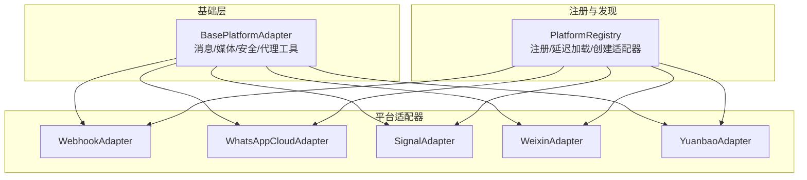
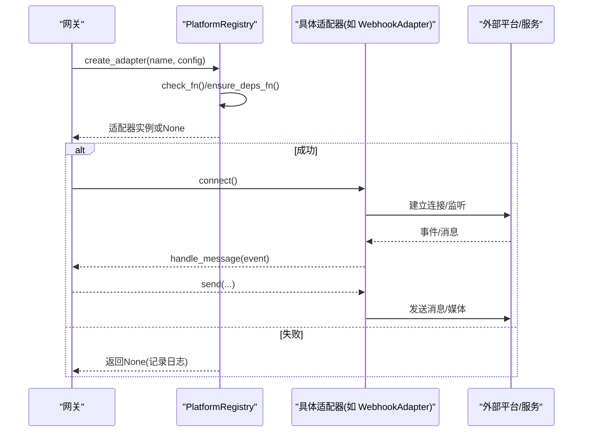
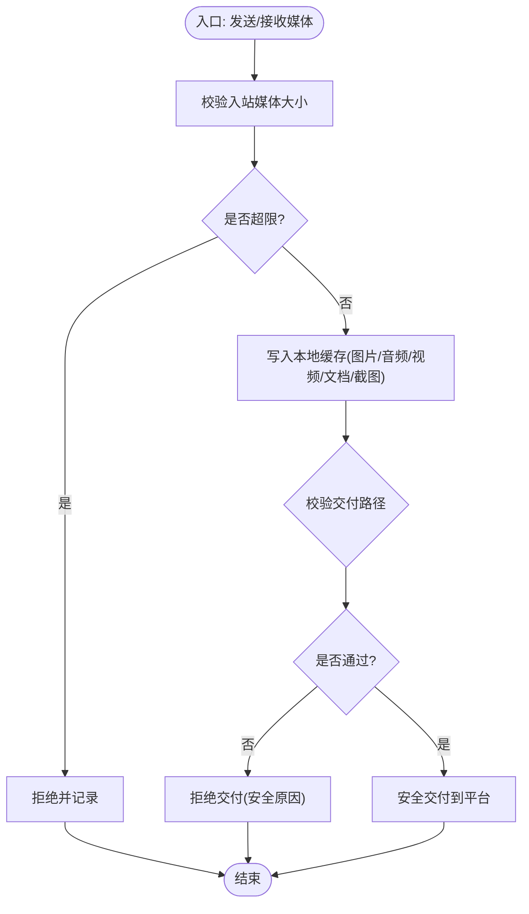
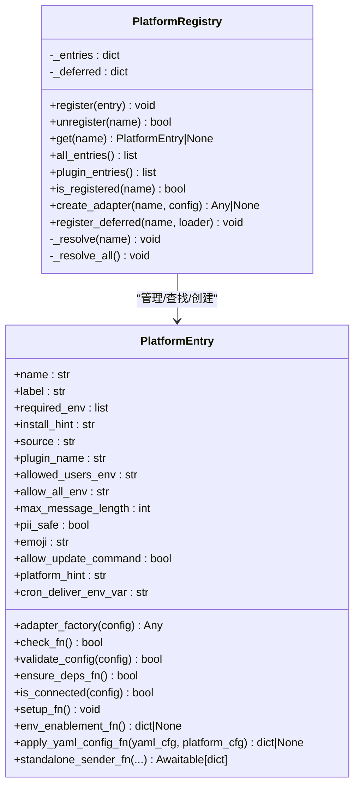
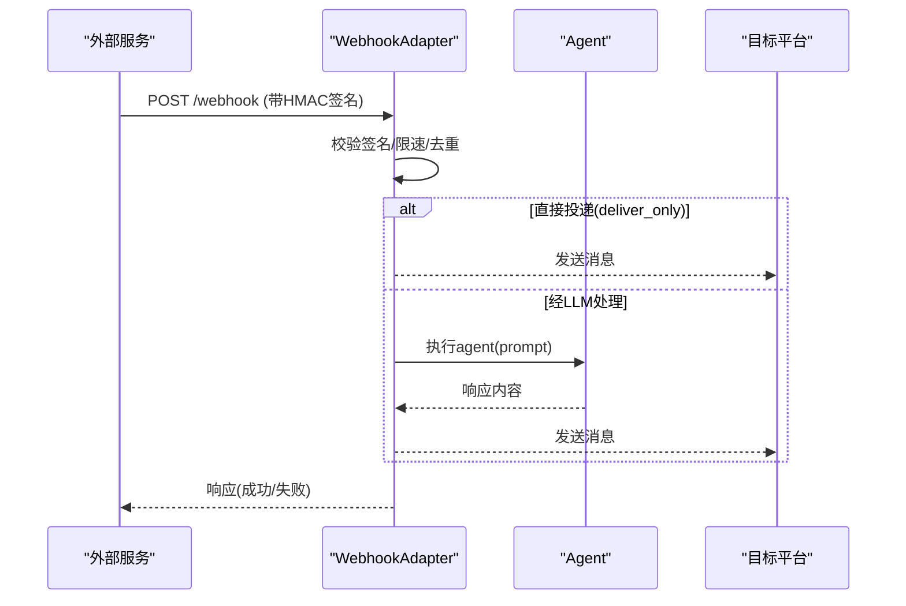
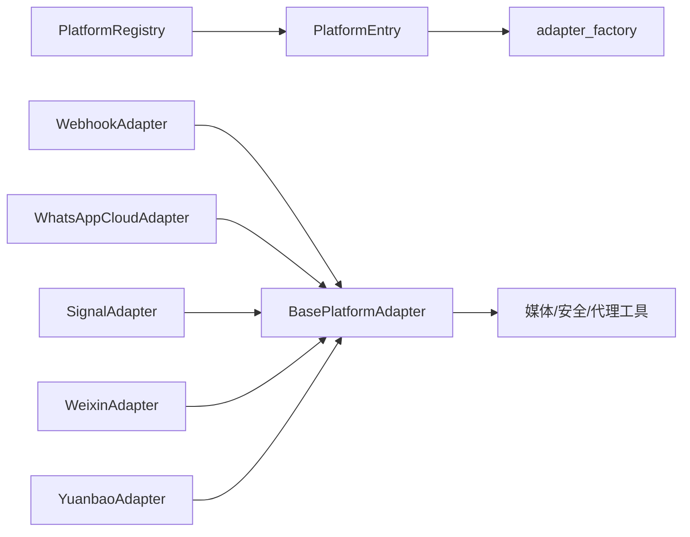

# 平台适配器

<cite>
**本文引用的文件**
- [gateway/platforms/base.py](file://gateway/platforms/base.py)
- [gateway/platform_registry.py](file://gateway/platform_registry.py)
- [gateway/platforms/webhook.py](file://gateway/platforms/webhook.py)
- [gateway/platforms/ADDING_A_PLATFORM.md](file://gateway/platforms/ADDING_A_PLATFORM.md)
</cite>

## 目录
1. [简介](#简介)
2. [项目结构](#项目结构)
3. [核心组件](#核心组件)
4. [架构总览](#架构总览)
5. [详细组件分析](#详细组件分析)
6. [依赖关系分析](#依赖关系分析)
7. [性能考量](#性能考量)
8. [故障排查指南](#故障排查指南)
9. [结论](#结论)
10. [附录](#附录)

## 简介
本技术文档面向 Hermes Agent 的平台适配器系统，聚焦统一架构设计、生命周期管理、消息格式转换、认证机制、错误处理与速率限制等核心能力。文档同时提供“如何开发新平台适配器”的实操指南，包括继承基类的步骤、必需实现的方法、可选扩展点，以及最佳实践与常见问题排查建议，帮助开发者快速集成新的消息平台。

## 项目结构
Hermes 的平台适配器体系由以下关键部分组成：
- 基础抽象与通用能力：定义统一的适配器接口、消息事件模型、媒体缓存与安全校验、代理与网络工具等。
- 平台注册中心：集中管理内置与插件平台的发现、依赖检查、配置校验与实例化。
- 具体平台适配器：如 Webhook、WhatsApp Cloud、Signal、Weixin、Yuanbao 等，均继承自基础类并实现平台特定逻辑。
- 新增平台指南：提供从插件路径或内置路径接入的完整清单与注意事项。

**图表来源**
- [gateway/platforms/base.py:1-200](file://gateway/platforms/base.py#L1-L200)
- [gateway/platform_registry.py:183-382](file://gateway/platform_registry.py#L183-L382)
- [gateway/platforms/webhook.py:177-200](file://gateway/platforms/webhook.py#L177-L200)

**章节来源**
- [gateway/platforms/base.py:1-200](file://gateway/platforms/base.py#L1-L200)
- [gateway/platform_registry.py:1-182](file://gateway/platform_registry.py#L1-L182)
- [gateway/platforms/webhook.py:1-176](file://gateway/platforms/webhook.py#L1-L176)

## 核心组件
- BasePlatformAdapter（基础抽象）
  - 统一的消息事件模型（MessageEvent、MessageType）、发送结果（SendResult）。
  - 媒体缓存与大小限制（图片、音频、视频、文档、截图），含 SSRF 防护与流式读取上限。
  - 代理解析与绕过策略（NO_PROXY/no_proxy、macOS 系统代理）。
  - 文本长度与 UTF-16 计算、自动 TTS 输出路径生成、线程/会话元数据构建。
  - 媒体交付路径安全校验（严格模式/宽松模式、白名单根目录、最近生产时间窗口）。
- PlatformRegistry（平台注册中心）
  - 支持插件与内置平台统一注册；延迟加载重型 SDK，避免启动开销。
  - 依赖检查（check_fn）、按需安装（ensure_deps_fn）、配置校验（validate_config）。
  - 统一创建适配器（create_adapter），失败时记录日志并返回 None。
  - 暴露平台元信息（label、emoji、platform_hint、pii_safe、max_message_length 等）。
- WebhookAdapter（示例平台适配器）
  - 基于 aiohttp 的 HTTP 服务器接收外部 webhook，进行 HMAC 签名校验、速率限制、幂等去重。
  - 将外部事件转换为 agent 提示，支持直接投递（deliver_only）或经 LLM 处理后投递。
  - 展示平台适配器的连接/断开、路由、安全与可观测性实践。

**章节来源**
- [gateway/platforms/base.py:570-800](file://gateway/platforms/base.py#L570-L800)
- [gateway/platforms/base.py:813-1122](file://gateway/platforms/base.py#L813-L1122)
- [gateway/platforms/base.py:1463-1542](file://gateway/platforms/base.py#L1463-L1542)
- [gateway/platform_registry.py:38-181](file://gateway/platform_registry.py#L38-L181)
- [gateway/platform_registry.py:183-382](file://gateway/platform_registry.py#L183-L382)
- [gateway/platforms/webhook.py:1-176](file://gateway/platforms/webhook.py#L1-176)
- [gateway/platforms/webhook.py:177-200](file://gateway/platforms/webhook.py#L177-L200)

## 架构总览
平台适配器采用“基础抽象 + 注册中心 + 具体实现”的分层架构：
- 基础抽象层提供跨平台一致的接口与通用能力（消息、媒体、安全、代理、TTS、长度限制等）。
- 注册中心负责平台发现、依赖检查、配置校验与实例化，屏蔽底层差异。
- 具体适配器实现平台特定的连接、收发、鉴权与业务逻辑，并通过注册中心被网关调度。

**图表来源**
- [gateway/platform_registry.py:299-377](file://gateway/platform_registry.py#L299-L377)
- [gateway/platforms/webhook.py:177-200](file://gateway/platforms/webhook.py#L177-L200)

## 详细组件分析

### 基础抽象类（BasePlatformAdapter）
- 职责
  - 定义统一的适配器接口与消息事件模型。
  - 提供媒体缓存、SSRF 防护、流式下载限流、代理解析、文本长度与 TTS 工具。
  - 提供媒体交付路径安全校验（严格/宽松模式、白名单、最近生产时间窗口）。
- 关键能力
  - 媒体缓存：图片、音频、视频、文档、截图的统一缓存与清理。
  - 安全：URL 安全校验、重定向目标校验、入站媒体大小限制。
  - 代理：支持环境变量与 macOS 系统代理，NO_PROXY/no_proxy 匹配。
  - 文本：UTF-16 长度计算、截断策略、自动 TTS 输出路径。
  - 会话元数据：线程、回复锚点、平台特定路由信息。
- 复杂度与优化
  - 媒体下载使用流式读取与重试退避，避免大文件 OOM。
  - 路径校验采用白名单+拒绝列表+最近生产时间窗口，兼顾安全与可用性。
  - 代理解析支持多种格式与通配符，减少重复配置。

**图表来源**
- [gateway/platforms/base.py:762-810](file://gateway/platforms/base.py#L762-L810)
- [gateway/platforms/base.py:837-927](file://gateway/platforms/base.py#L837-L927)
- [gateway/platforms/base.py:988-1068](file://gateway/platforms/base.py#L988-L1068)
- [gateway/platforms/base.py:1105-1122](file://gateway/platforms/base.py#L1105-L1122)
- [gateway/platforms/base.py:1463-1542](file://gateway/platforms/base.py#L1463-L1542)

**章节来源**
- [gateway/platforms/base.py:570-800](file://gateway/platforms/base.py#L570-L800)
- [gateway/platforms/base.py:813-1122](file://gateway/platforms/base.py#L813-L1122)
- [gateway/platforms/base.py:1463-1542](file://gateway/platforms/base.py#L1463-L1542)

### 平台注册中心（PlatformRegistry）
- 职责
  - 统一管理平台适配器条目（名称、标签、工厂函数、依赖检查、配置校验、安装提示等）。
  - 延迟加载重型 SDK，降低启动成本。
  - 提供 create_adapter 统一创建流程，包含依赖检查、安装、配置校验与异常处理。
- 关键特性
  - 插件与内置平台统一注册，支持覆盖与优先级。
  - 支持 env_enablement_fn、apply_yaml_config_fn、cron_deliver_env_var、standalone_sender_fn 等扩展点。
  - 提供 is_registered、all_entries、plugin_entries 等查询接口。
- 错误处理
  - 依赖检查失败时尝试安装；安装失败则记录警告并返回 None。
  - 配置校验失败或工厂异常时记录日志并返回 None。

**图表来源**
- [gateway/platform_registry.py:38-181](file://gateway/platform_registry.py#L38-L181)
- [gateway/platform_registry.py:183-382](file://gateway/platform_registry.py#L183-L382)

**章节来源**
- [gateway/platform_registry.py:1-182](file://gateway/platform_registry.py#L1-L182)
- [gateway/platform_registry.py:183-382](file://gateway/platform_registry.py#L183-L382)

### WebhookAdapter（示例平台适配器）
- 职责
  - 运行 aiohttp HTTP 服务器接收外部 webhook，进行 HMAC 签名校验与速率限制。
  - 将外部事件转换为 agent 提示，支持直接投递或经 LLM 处理后投递。
  - 提供静态/动态路由、幂等去重、SSRF 防护、健康检查等。
- 关键流程
  - 启动时加载静态路由与动态订阅，校验 HMAC 密钥。
  - 请求进入后验证签名、限速、去重，渲染 prompt 或直接投递。
  - 支持 deliver_only 模式以零 LLM 成本快速响应监控/通知场景。
- 错误处理
  - 签名不匹配、超时、状态码错误等均有明确日志与响应。
  - 重定向目标安全校验防止 SSRF。

**图表来源**
- [gateway/platforms/webhook.py:1-176](file://gateway/platforms/webhook.py#L1-L176)
- [gateway/platforms/webhook.py:177-200](file://gateway/platforms/webhook.py#L177-L200)

**章节来源**
- [gateway/platforms/webhook.py:1-176](file://gateway/platforms/webhook.py#L1-L176)
- [gateway/platforms/webhook.py:177-200](file://gateway/platforms/webhook.py#L177-L200)

### 新增平台适配器指南
- 插件路径（推荐）
  - 在 ~/.hermes/plugins/ 或 plugins/platforms/ 下创建 plugin.yaml 与 adapter.py。
  - 继承 BasePlatformAdapter，并在 register(ctx) 中通过 ctx.register_platform() 注册。
  - 利用可选钩子：env_enablement_fn、apply_yaml_config_fn、cron_deliver_env_var、standalone_sender_fn。
  - 共享行为可通过 Mixin 复用（如 WhatsAppBehaviorMixin）。
- 内置路径（核心贡献者）
  - 在 gateway/config.py 添加 Platform 枚举与环境变量加载。
  - 在 gateway/run.py 的 _create_adapter() 中添加平台分支。
  - 在授权映射、工具集、定时任务投递、通道目录、状态显示、设置向导、红脱敏、文档与测试等方面补齐集成点。
- 必需方法
  - __init__、connect、disconnect、send、send_typing、send_image、get_chat_info。
- 可选方法
  - send_document、send_voice、send_video、send_animation、send_image_file。
- 交互 UX（推荐）
  - send_clarify、send_exec_approval、send_slash_confirm、send_model_picker、send_choice_picker。

**章节来源**
- [gateway/platforms/ADDING_A_PLATFORM.md:1-75](file://gateway/platforms/ADDING_A_PLATFORM.md#L1-L75)
- [gateway/platforms/ADDING_A_PLATFORM.md:78-145](file://gateway/platforms/ADDING_A_PLATFORM.md#L78-L145)
- [gateway/platforms/ADDING_A_PLATFORM.md:148-302](file://gateway/platforms/ADDING_A_PLATFORM.md#L148-L302)
- [gateway/platforms/ADDING_A_PLATFORM.md:304-405](file://gateway/platforms/ADDING_A_PLATFORM.md#L304-L405)

## 依赖关系分析
- 耦合与内聚
  - BasePlatformAdapter 高内聚地封装了媒体、安全、代理、文本与 TTS 等通用能力，降低各平台适配器的重复实现。
  - PlatformRegistry 解耦了平台发现与实例化，使新增平台无需修改网关核心逻辑（插件路径）。
- 直接/间接依赖
  - 适配器依赖 base 提供的消息/媒体/安全工具。
  - 注册中心依赖平台条目元信息与工厂函数，延迟加载重型 SDK。
  - WebhookAdapter 依赖 aiohttp、HMAC、速率限制与幂等缓存。
- 循环依赖
  - 通过模块级单例与延迟导入避免启动期循环依赖。
- 外部集成点
  - 外部平台（Telegram、Discord、WhatsApp、Signal、Weixin、Yuanbao、Webhook 等）通过适配器接入。
  - 工具链（TTS、STT、浏览器截图、文件工具）通过 base 提供的缓存与安全校验集成。

**图表来源**
- [gateway/platforms/base.py:570-800](file://gateway/platforms/base.py#L570-L800)
- [gateway/platform_registry.py:38-181](file://gateway/platform_registry.py#L38-L181)
- [gateway/platforms/webhook.py:177-200](file://gateway/platforms/webhook.py#L177-L200)

**章节来源**
- [gateway/platforms/base.py:570-800](file://gateway/platforms/base.py#L570-L800)
- [gateway/platform_registry.py:38-181](file://gateway/platform_registry.py#L38-L181)
- [gateway/platforms/webhook.py:177-200](file://gateway/platforms/webhook.py#L177-L200)

## 性能考量
- 延迟加载：注册中心对插件平台采用延迟加载，避免启动时导入重型 SDK。
- 媒体流式下载：使用流式读取与 Content-Length 预检，防止大文件导致内存峰值。
- 重试与退避：媒体下载对超时与临时错误进行指数退避重试，提高鲁棒性。
- 代理优化：优先使用 connector 方式（aiohttp-socks）提升透明代理兼容性。
- 路径校验：严格模式下结合白名单与最近生产时间窗口，减少不必要的安全风险与 I/O。

[本节为通用指导，不直接分析具体文件]

## 故障排查指南
- 依赖缺失
  - 现象：create_adapter 返回 None，日志提示依赖未满足。
  - 处理：检查 check_fn 与 ensure_deps_fn；必要时手动安装依赖或修正环境。
- 配置校验失败
  - 现象：validate_config 返回 False，日志记录配置校验失败。
  - 处理：核对 config.yaml 与环境变量，确保必填字段正确。
- 媒体过大
  - 现象：入站媒体超过限制，抛出 ValueError。
  - 处理：调整 gateway.max_inbound_media_bytes 或优化上游上传策略。
- 路径不安全
  - 现象：交付路径被拒绝（严格模式或位于拒绝列表）。
  - 处理：将产物写入允许目录（缓存或 HERMES_MEDIA_ALLOW_DIRS），或放宽最近生产时间窗口。
- Webhook 签名失败
  - 现象：HMAC 校验不通过，请求被拒绝。
  - 处理：核对 secret、签名算法与头部字段；测试环境可使用 INSECURE_NO_AUTH（仅限测试）。

**章节来源**
- [gateway/platform_registry.py:299-377](file://gateway/platform_registry.py#L299-L377)
- [gateway/platforms/base.py:762-810](file://gateway/platforms/base.py#L762-L810)
- [gateway/platforms/base.py:1463-1542](file://gateway/platforms/base.py#L1463-L1542)
- [gateway/platforms/webhook.py:158-175](file://gateway/platforms/webhook.py#L158-L175)

## 结论
Hermes 的平台适配器系统通过统一的基础抽象与注册中心，实现了多消息平台的标准化接入与灵活扩展。开发者可依据指南快速实现新平台适配器，复用媒体缓存、安全校验、代理解析与 TTS 等通用能力，并通过可选钩子完成高级定制。建议在实现过程中遵循最小依赖、严格安全校验与良好错误处理的最佳实践，确保系统的稳定性与可维护性。

[本节为总结性内容，不直接分析具体文件]

## 附录
- 快速验证清单
  - 确认 Platform 枚举与环境变量加载正确。
  - 验证适配器初始化、连接、发送与断开流程。
  - 检查授权映射、工具集、定时任务投递、通道目录、状态显示与设置向导。
  - 编写单元测试覆盖配置解析、辅助函数、会话源往返、授权集成与发送路由。
- 参考实现
  - WebhookAdapter：HTTP 接收、HMAC 校验、速率限制、幂等去重、直接投递与 LLM 处理。
  - 其他平台适配器（WhatsApp Cloud、Signal、Weixin、Yuanbao）：继承 BasePlatformAdapter 并实现平台特定逻辑。

**章节来源**
- [gateway/platforms/ADDING_A_PLATFORM.md:392-405](file://gateway/platforms/ADDING_A_PLATFORM.md#L392-L405)
- [gateway/platforms/webhook.py:177-200](file://gateway/platforms/webhook.py#L177-L200)