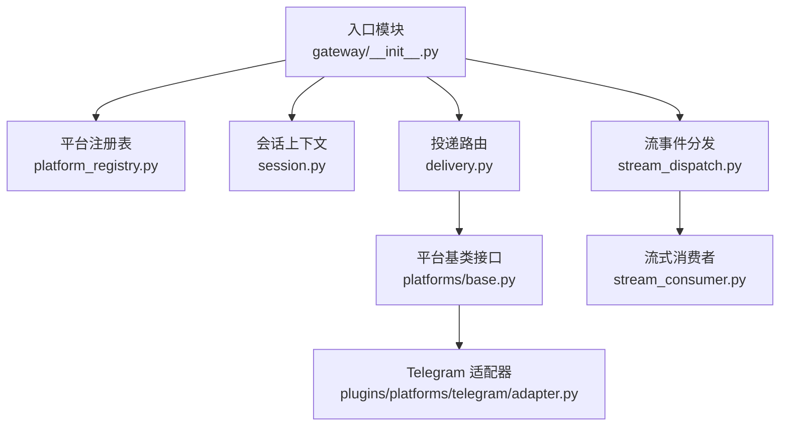
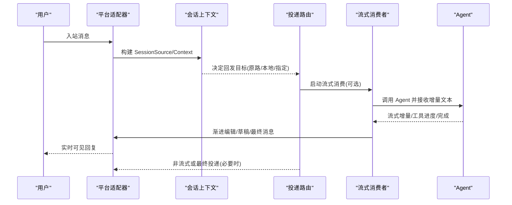
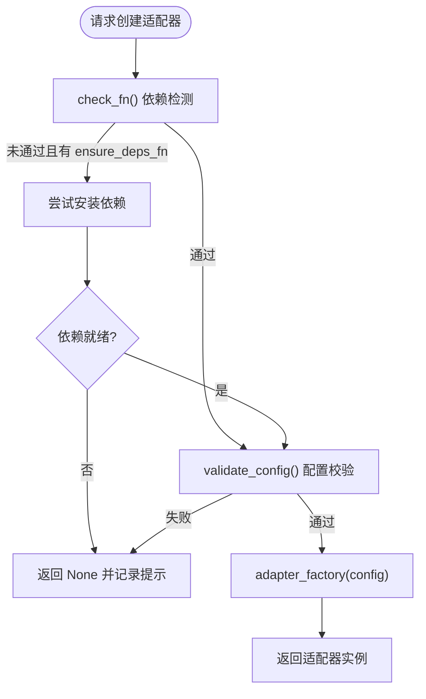
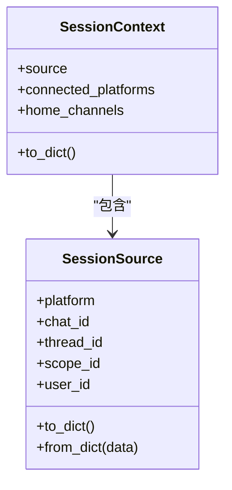
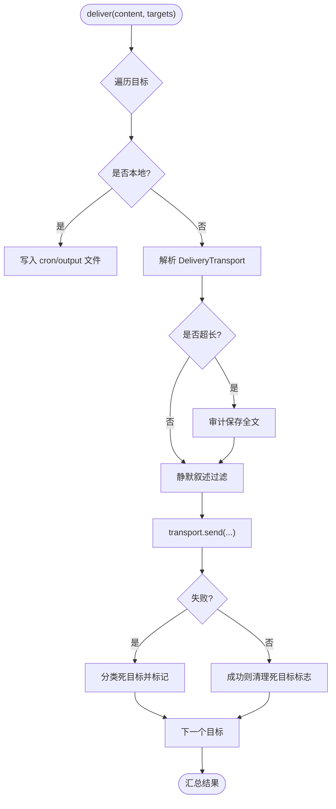
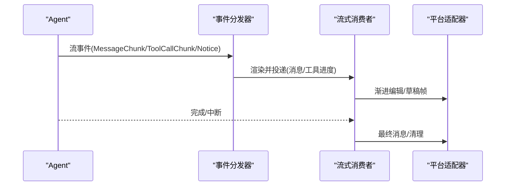
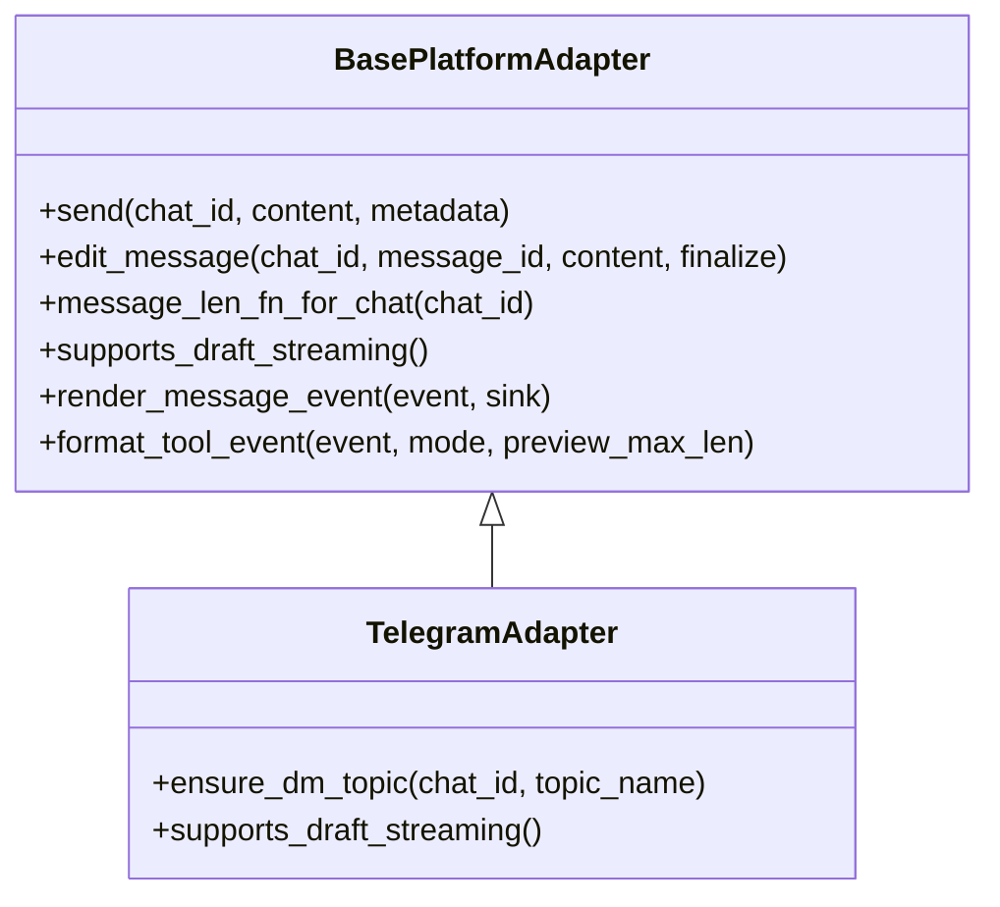
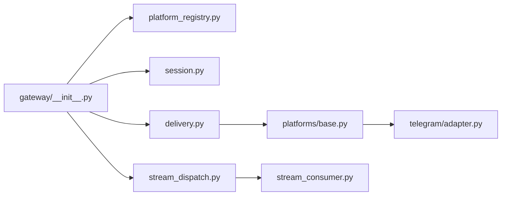

# 消息网关

<cite>
**本文引用的文件**
- [gateway/__init__.py](file://gateway/__init__.py)
- [gateway/platform_registry.py](file://gateway/platform_registry.py)
- [gateway/delivery.py](file://gateway/delivery.py)
- [gateway/session.py](file://gateway/session.py)
- [gateway/platforms/base.py](file://gateway/platforms/base.py)
- [gateway/stream_dispatch.py](file://gateway/stream_dispatch.py)
- [gateway/stream_consumer.py](file://gateway/stream_consumer.py)
- [plugins/platforms/telegram/adapter.py](file://plugins/platforms/telegram/adapter.py)
</cite>

## 目录
1. [简介](#简介)
2. [项目结构](#项目结构)
3. [核心组件](#核心组件)
4. [架构总览](#架构总览)
5. [详细组件分析](#详细组件分析)
6. [依赖关系分析](#依赖关系分析)
7. [性能考量](#性能考量)
8. [故障排查指南](#故障排查指南)
9. [结论](#结论)
10. [附录：平台集成开发指南](#附录：平台集成开发指南)

## 简介
本技术文档面向 Hermes Agent 的消息网关，系统性阐述多平台消息处理的统一架构与实现要点。内容覆盖：
- 消息路由与会话管理
- 平台适配机制（Telegram、Discord、Slack、WhatsApp 等）
- 消息投递机制（异步处理、重试策略、错误恢复）
- 流式响应处理（实时推送、进度更新、中断处理）
- 新平台适配器开发与最佳实践

## 项目结构
消息网关位于 gateway 目录，围绕“平台注册—会话上下文—投递路由—流式消费”形成闭环；平台适配器既包含内置实现（gateway/platforms），也支持插件化扩展（plugins/platforms）。

**图表来源**
- [gateway/__init__.py:1-36](file://gateway/__init__.py#L1-L36)
- [gateway/platform_registry.py:1-382](file://gateway/platform_registry.py#L1-L382)
- [gateway/delivery.py:1-647](file://gateway/delivery.py#L1-L647)
- [gateway/session.py:1-800](file://gateway/session.py#L1-L800)
- [gateway/platforms/base.py:1-800](file://gateway/platforms/base.py#L1-L800)
- [gateway/stream_dispatch.py:1-133](file://gateway/stream_dispatch.py#L1-L133)
- [gateway/stream_consumer.py:1-800](file://gateway/stream_consumer.py#L1-L800)
- [plugins/platforms/telegram/adapter.py:1-200](file://plugins/platforms/telegram/adapter.py#L1-L200)

**章节来源**
- [gateway/__init__.py:1-36](file://gateway/__init__.py#L1-L36)

## 核心组件
- 平台注册表：集中管理各平台适配器元数据、依赖检查、配置校验与工厂创建，支持延迟加载与插件覆盖。
- 会话上下文：维护消息来源、连接平台、家庭频道、PII 脱敏提示注入等，驱动动态系统提示与路由键生成。
- 投递路由：解析目标（origin/local/平台:聊天ID）、大小裁剪、静默叙述过滤、死目标追踪与重试恢复。
- 流式通道：将代理侧同步回调桥接到异步平台投递，支持渐进编辑、原生草稿流、工具进度展示与中断安全。
- 平台基类：统一的发送/编辑/媒体/长度限制/代理/SSRF 防护等通用能力，供各平台适配器继承。

**章节来源**
- [gateway/platform_registry.py:1-382](file://gateway/platform_registry.py#L1-L382)
- [gateway/session.py:1-800](file://gateway/session.py#L1-L800)
- [gateway/delivery.py:1-647](file://gateway/delivery.py#L1-L647)
- [gateway/stream_dispatch.py:1-133](file://gateway/stream_dispatch.py#L1-L133)
- [gateway/stream_consumer.py:1-800](file://gateway/stream_consumer.py#L1-L800)
- [gateway/platforms/base.py:1-800](file://gateway/platforms/base.py#L1-L800)

## 架构总览
下图展示了从入站消息到出站回复的端到端流程，包括路由、会话、流式消费与平台适配。

**图表来源**
- [gateway/session.py:148-347](file://gateway/session.py#L148-L347)
- [gateway/delivery.py:294-647](file://gateway/delivery.py#L294-L647)
- [gateway/stream_consumer.py:156-800](file://gateway/stream_consumer.py#L156-L800)
- [gateway/platforms/base.py:570-800](file://gateway/platforms/base.py#L570-L800)

## 详细组件分析

### 平台注册与发现
- 通过 PlatformEntry 描述平台名称、标签、工厂函数、依赖探测、配置校验、安装提示、环境自动启用、YAML→环境变量桥接、独立发送器钩子等。
- PlatformRegistry 提供延迟加载、注册/注销、查找与实例化，确保仅在使用时导入重型 SDK，降低冷启动开销。
- create_adapter 在构造前执行依赖检查与安装、配置校验，失败则返回 None 并记录日志。

**图表来源**
- [gateway/platform_registry.py:183-382](file://gateway/platform_registry.py#L183-L382)

**章节来源**
- [gateway/platform_registry.py:1-382](file://gateway/platform_registry.py#L1-L382)

### 会话管理与上下文注入
- SessionSource 描述消息来源（平台、聊天/线程、用户、范围隔离等），用于路由与权限判定。
- SessionContext 聚合源信息、已连接平台、家庭频道，并生成动态系统提示，向 Agent 暴露“我在哪里、能做什么、可投递到哪里”。
- 支持 PII 脱敏（对部分平台安全），以及平台特定行为提示（如 Slack/Discord 的工具可用性声明）。

**图表来源**
- [gateway/session.py:148-347](file://gateway/session.py#L148-L347)

**章节来源**
- [gateway/session.py:1-800](file://gateway/session.py#L1-L800)

### 投递路由与错误恢复
- DeliveryTarget 解析目标字符串（origin/local/平台:聊天ID:线程ID），DeliveryRouter 负责实际投递。
- 支持：
  - 超大输出审计保存与截断（非分块适配器）
  - “静默叙述”出站过滤，避免循环
  - 死目标追踪（删除群/封禁/踢出），成功投递后自愈清除
  - Telegram 私有主题创建/刷新与锚点回填
  - 通过 DeliveryTransport 抽象 Relay 转发与原生适配器差异

**图表来源**
- [gateway/delivery.py:213-647](file://gateway/delivery.py#L213-L647)

**章节来源**
- [gateway/delivery.py:1-647](file://gateway/delivery.py#L1-L647)

### 流式响应与进度更新
- GatewayEventDispatcher 将结构化流事件（消息片段、工具调用、通知等）按平台能力渲染并投递。
- GatewayStreamConsumer 桥接同步回调到异步平台：
  - 渐进编辑（editMessageText）或原生草稿流（sendDraft）
  - 工具进度队列合并，避免竞态
  - 思考/推理标签过滤，保证前端显示整洁
  - 新鲜最终消息策略（长响应完成后以新消息呈现）
  - 中断/会话重置保护，避免陈旧增量被投递

**图表来源**
- [gateway/stream_dispatch.py:40-133](file://gateway/stream_dispatch.py#L40-L133)
- [gateway/stream_consumer.py:156-800](file://gateway/stream_consumer.py#L156-L800)

**章节来源**
- [gateway/stream_dispatch.py:1-133](file://gateway/stream_dispatch.py#L1-L133)
- [gateway/stream_consumer.py:1-800](file://gateway/stream_consumer.py#L1-L800)

### 平台适配器实现与差异
- 基类 BasePlatformAdapter 提供跨平台通用能力：
  - 媒体类型识别与音频格式选择
  - UTF-16 长度计算与截断（适配 Telegram 4096 限制）
  - 代理与 NO_PROXY 解析、SSRF 重定向防护
  - 入站媒体大小上限与流式读取保护
  - 线程/回复锚点元数据构建
- 具体平台差异：
  - Telegram：私有主题创建/刷新、DM 回复锚点、草稿流、MarkdownV2 富文本、语音/音频格式限制
  - Discord：频道/线程、语音状态、工具集可用性提示
  - Slack：工作区 scope、Block Kit、MCP 工具可用性提示
  - WhatsApp：身份规范化与云 API 适配（由对应适配器实现）

**图表来源**
- [gateway/platforms/base.py:570-800](file://gateway/platforms/base.py#L570-L800)
- [plugins/platforms/telegram/adapter.py:1-200](file://plugins/platforms/telegram/adapter.py#L1-L200)

**章节来源**
- [gateway/platforms/base.py:1-800](file://gateway/platforms/base.py#L1-L800)
- [plugins/platforms/telegram/adapter.py:1-200](file://plugins/platforms/telegram/adapter.py#L1-L200)

## 依赖关系分析
- 入口模块导出配置、会话与投递相关能力，作为网关对外契约。
- 平台注册表解耦平台发现与实例化，支持插件覆盖与延迟加载。
- 投递路由依赖会话上下文与平台基类，屏蔽平台差异。
- 流式通道解耦 Agent 与平台，保证 UI 一致性与可靠性。

**图表来源**
- [gateway/__init__.py:1-36](file://gateway/__init__.py#L1-L36)
- [gateway/platform_registry.py:1-382](file://gateway/platform_registry.py#L1-L382)
- [gateway/delivery.py:1-647](file://gateway/delivery.py#L1-L647)
- [gateway/platforms/base.py:1-800](file://gateway/platforms/base.py#L1-L800)
- [plugins/platforms/telegram/adapter.py:1-200](file://plugins/platforms/telegram/adapter.py#L1-L200)
- [gateway/stream_dispatch.py:1-133](file://gateway/stream_dispatch.py#L1-L133)
- [gateway/stream_consumer.py:1-800](file://gateway/stream_consumer.py#L1-L800)

**章节来源**
- [gateway/__init__.py:1-36](file://gateway/__init__.py#L1-L36)

## 性能考量
- 延迟加载平台 SDK：仅在需要时导入重型依赖，缩短冷启动时间。
- 流式渐进编辑：减少频繁全量发送，降低带宽与平台限流压力。
- 超大输出审计+截断：保障非分块适配器不超限，同时保留完整审计副本。
- 媒体入站大小限制：防止恶意大文件导致 OOM。
- 代理与 NO_PROXY：智能选择代理并支持绕过，提升网络稳定性。
- 死目标快速短路：避免重复无效投递，节省配额与日志噪音。

[本节为通用指导，无需引用具体文件]

## 故障排查指南
- 平台依赖缺失：查看 create_adapter 的 check_fn/ensure_deps_fn 日志与 install_hint。
- 配置校验失败：确认 validate_config 与 required_env 设置正确。
- 投递失败：
  - 检查 DeliveryRouter 的死目标标记与错误分类。
  - 关注 Telegram 私有主题创建/刷新失败时的异常路径。
- 流式问题：
  - 观察 GatewayStreamConsumer 的编辑间隔自适应与草稿流降级。
  - 注意中断/会话重置导致的早期放弃逻辑。
- 媒体与网络：
  - 检查入站媒体大小限制与代理配置。
  - 关注 SSRF 重定向拦截日志。

**章节来源**
- [gateway/platform_registry.py:299-382](file://gateway/platform_registry.py#L299-L382)
- [gateway/delivery.py:460-647](file://gateway/delivery.py#L460-L647)
- [gateway/stream_consumer.py:156-800](file://gateway/stream_consumer.py#L156-L800)
- [gateway/platforms/base.py:682-800](file://gateway/platforms/base.py#L682-L800)

## 结论
Hermes 消息网关通过“平台注册—会话上下文—投递路由—流式消费”的统一架构，实现了多平台消息的一致化处理与高可靠投递。其设计兼顾了可扩展性（插件化与延迟加载）、健壮性（死目标、审计、限流与安全防护）与用户体验（流式渐进、工具进度、真实最终消息）。

[本节为总结，无需引用具体文件]

## 附录：平台集成开发指南
- 注册平台适配器：
  - 使用 platform_registry.register(PlatformEntry(...)) 声明名称、标签、工厂、依赖探测、配置校验、安装提示、环境自动启用、YAML→环境变量桥接、独立发送器等。
  - 若需覆盖内置实现，直接同名注册即可。
- 实现适配器：
  - 继承 BasePlatformAdapter，实现 send/edit_message/message_len_fn_for_chat 等关键方法。
  - 根据平台特性实现 supports_draft_streaming、render_message_event、format_tool_event 等以优化体验。
  - 遵循媒体格式、长度限制、代理与 SSRF 防护约定。
- 配置与环境：
  - 通过 validate_config 与 required_env 约束配置项。
  - 使用 env_enablement_fn 与 apply_yaml_config_fn 简化部署。
- 测试与调试：
  - 利用 dead_targets 与 DeliveryRouter 的错误分类进行回归测试。
  - 结合流式消费者的渐进编辑与草稿流路径验证 UI 表现。

**章节来源**
- [gateway/platform_registry.py:38-181](file://gateway/platform_registry.py#L38-L181)
- [gateway/platforms/base.py:570-800](file://gateway/platforms/base.py#L570-L800)
- [gateway/delivery.py:213-647](file://gateway/delivery.py#L213-L647)