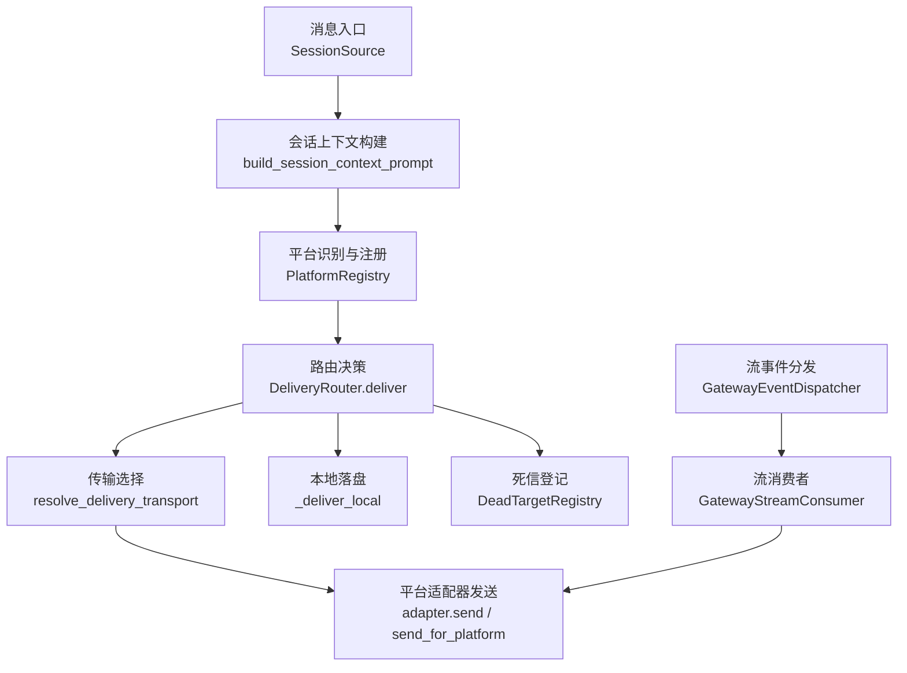
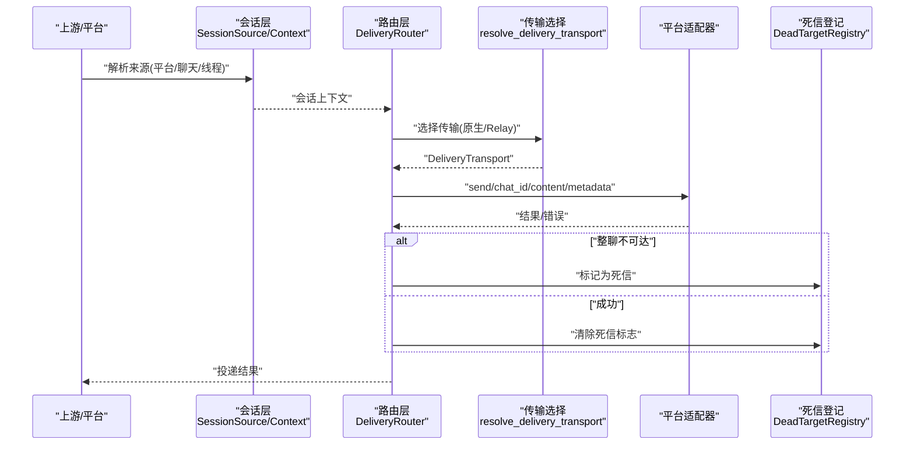
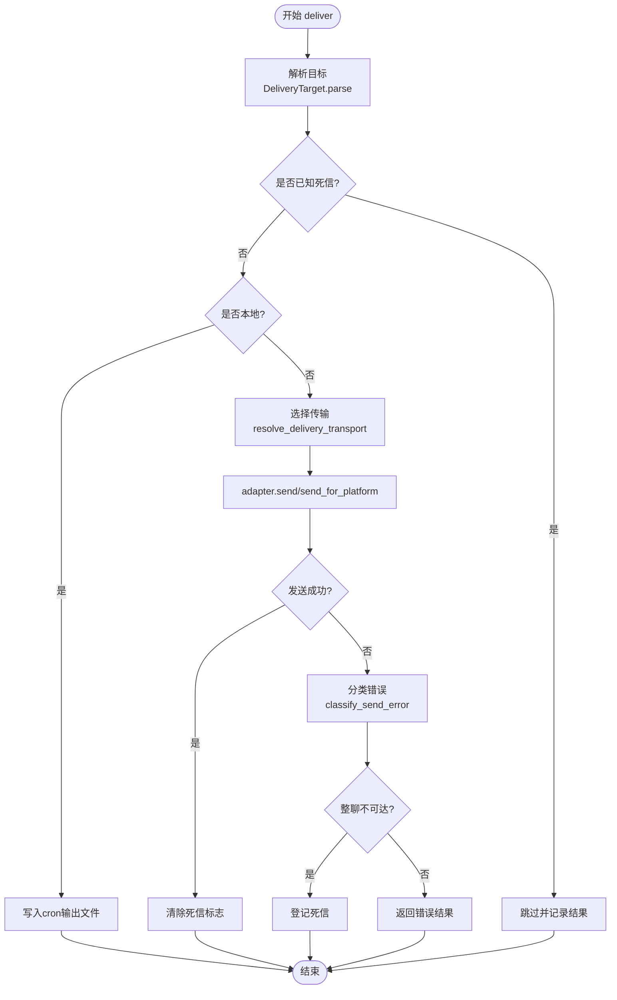
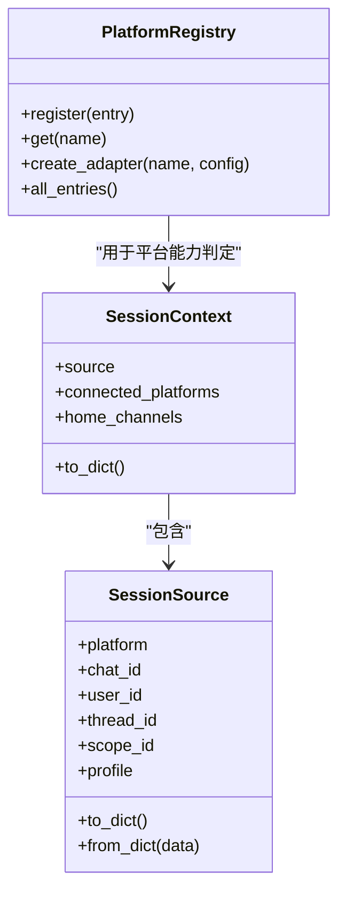
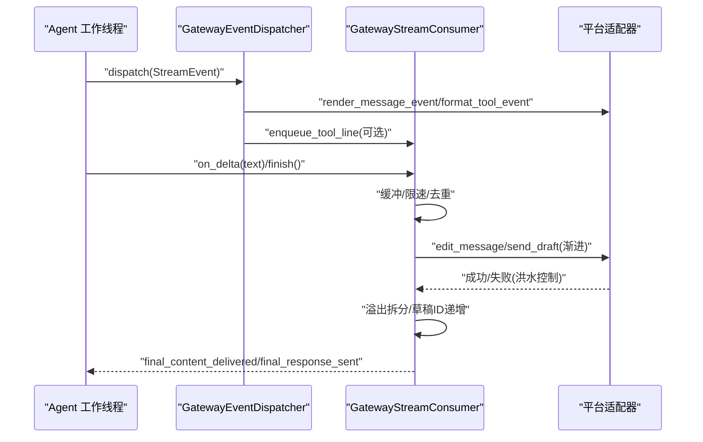
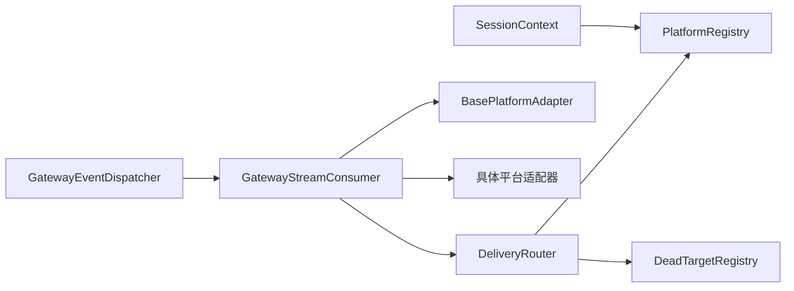

# 消息路由

<cite>
**本文引用的文件**
- [delivery.py](file://gateway/delivery.py)
- [stream_dispatch.py](file://gateway/stream_dispatch.py)
- [session.py](file://gateway/session.py)
- [platform_registry.py](file://gateway/platform_registry.py)
- [stream_consumer.py](file://gateway/stream_consumer.py)
- [dead_targets.py](file://gateway/dead_targets.py)
</cite>

## 目录
1. [简介](#简介)
2. [项目结构](#项目结构)
3. [核心组件](#核心组件)
4. [架构总览](#架构总览)
5. [详细组件分析](#详细组件分析)
6. [依赖关系分析](#依赖关系分析)
7. [性能考量](#性能考量)
8. [故障排除指南](#故障排除指南)
9. [结论](#结论)

## 简介
本技术文档聚焦 Hermes Agent 的消息路由系统，覆盖从消息接收到投递的完整链路：消息解析、会话绑定、平台识别、路由决策；异步消息处理机制（任务队列、并发控制、负载均衡）；可靠性机制（重试策略、失败恢复、死信处理）；以及流式响应处理（实时推送、进度更新、中断处理）。同时提供性能优化建议与故障排除指南。

## 项目结构
围绕消息路由的核心模块位于 gateway 目录：
- delivery.py：负责将消息/输出路由到目标平台或本地文件，包含目标解析、传输选择、大小裁剪、静默内容过滤、线程/话题处理等。
- stream_dispatch.py：将结构化流事件分派给适配器渲染并进入投递队列，屏蔽平台差异，保持同步可调用。
- session.py：维护会话来源 SessionSource、会话上下文 SessionContext，用于注入动态系统提示、多用户会话、PII 脱敏等。
- platform_registry.py：平台适配器注册中心，支持延迟加载、依赖检查、配置校验与实例创建。
- stream_consumer.py：桥接同步 agent 回调到异步平台投递，实现增量编辑、草稿流、溢出拆分、去重与最终一致性。
- dead_targets.py：持久化“已确认不可达”的目标集合，避免对已删除群/被踢机器人重复投递。



图表来源
- [session.py:479-745](file://gateway/session.py#L479-L745)
- [platform_registry.py:276-377](file://gateway/platform_registry.py#L276-L377)
- [delivery.py:294-391](file://gateway/delivery.py#L294-L391)
- [delivery.py:92-131](file://gateway/delivery.py#L92-L131)
- [delivery.py:460-642](file://gateway/delivery.py#L460-L642)
- [stream_dispatch.py:40-132](file://gateway/stream_dispatch.py#L40-L132)
- [stream_consumer.py:156-323](file://gateway/stream_consumer.py#L156-L323)

章节来源
- [delivery.py:1-647](file://gateway/delivery.py#L1-L647)
- [stream_dispatch.py:1-133](file://gateway/stream_dispatch.py#L1-L133)
- [session.py:148-347](file://gateway/session.py#L148-L347)
- [platform_registry.py:1-382](file://gateway/platform_registry.py#L1-L382)
- [stream_consumer.py:1-800](file://gateway/stream_consumer.py#L1-L800)
- [dead_targets.py:1-144](file://gateway/dead_targets.py#L1-L144)

## 核心组件
- DeliveryRouter：统一入口，解析目标、选择传输、执行发送、记录结果、管理死信。
- GatewayEventDispatcher：将结构化流事件（消息片段、工具调用、通知）路由到适配器的渲染钩子，并入队工具进度。
- GatewayStreamConsumer：接收 agent 同步回调，缓冲、限速、渐进编辑消息，支持草稿流、溢出拆分、去重与最终一致性。
- PlatformRegistry：集中注册平台适配器，支持懒加载、依赖探测、配置校验与工厂创建。
- DeadTargetRegistry：持久化“整聊不可达”目标，自动自愈（成功发送即清除）。
- SessionSource/SessionContext：描述消息来源与会话上下文，驱动动态系统提示与多用户/PII 处理。

章节来源
- [delivery.py:214-391](file://gateway/delivery.py#L214-L391)
- [stream_dispatch.py:40-132](file://gateway/stream_dispatch.py#L40-L132)
- [stream_consumer.py:156-323](file://gateway/stream_consumer.py#L156-L323)
- [platform_registry.py:183-382](file://gateway/platform_registry.py#L183-L382)
- [dead_targets.py:48-144](file://gateway/dead_targets.py#L48-L144)
- [session.py:148-347](file://gateway/session.py#L148-L347)

## 架构总览
消息路由由“入站会话绑定 + 出站路由投递 + 流式事件分发”三部分构成：
- 入站：通过 SessionSource 携带平台、聊天、线程、范围等信息，构建 SessionContext，注入动态系统提示。
- 出站：DeliveryRouter 解析目标字符串（origin/local/platform[:chat_id][:thread_id]），选择传输（原生适配器优先，否则 Relay），执行发送或本地落盘。
- 流式：GatewayEventDispatcher 将结构化事件交给适配器渲染，GatewayStreamConsumer 以增量编辑/草稿流方式推送到平台。



图表来源
- [session.py:479-745](file://gateway/session.py#L479-L745)
- [delivery.py:92-131](file://gateway/delivery.py#L92-L131)
- [delivery.py:318-391](file://gateway/delivery.py#L318-L391)
- [dead_targets.py:98-138](file://gateway/dead_targets.py#L98-L138)

## 详细组件分析

### 消息解析与目标路由（DeliveryRouter）
- 目标解析：支持 origin、local、platform、platform:chat_id、platform:chat_id:thread_id。
- 传输选择：原生适配器优先；若禁用或未启用，则尝试 Relay，并通过 fronts_platform 判断是否代理该逻辑平台。
- 发送流程：本地路径直接写文件；平台路径进行大小裁剪（非分块适配器）、静默内容过滤、Telegram 私有主题创建/刷新、元数据注入。
- 结果处理：成功时清理死信；失败时根据错误文本分类是否为整聊不可达，若是则登记死信。



图表来源
- [delivery.py:230-291](file://gateway/delivery.py#L230-L291)
- [delivery.py:318-391](file://gateway/delivery.py#L318-L391)
- [delivery.py:460-642](file://gateway/delivery.py#L460-L642)
- [dead_targets.py:98-138](file://gateway/dead_targets.py#L98-L138)

章节来源
- [delivery.py:214-642](file://gateway/delivery.py#L214-L642)
- [dead_targets.py:1-144](file://gateway/dead_targets.py#L1-L144)

### 会话绑定与平台识别（SessionSource/Context 与 PlatformRegistry）
- SessionSource：携带平台、聊天、线程、用户、范围、消息触发 ID、是否中继投递等字段，用于路由与上下文注入。
- SessionContext：聚合 Source、已连接平台、Home Channel，生成动态系统提示，支持 PII 脱敏与平台行为提示。
- PlatformRegistry：集中注册平台适配器，支持延迟加载、依赖检查、配置校验与工厂创建；create_adapter 在需要时才引入重型 SDK。



图表来源
- [session.py:148-347](file://gateway/session.py#L148-L347)
- [platform_registry.py:183-382](file://gateway/platform_registry.py#L183-L382)

章节来源
- [session.py:148-745](file://gateway/session.py#L148-L745)
- [platform_registry.py:1-382](file://gateway/platform_registry.py#L1-L382)

### 流式响应处理（GatewayEventDispatcher + GatewayStreamConsumer）
- GatewayEventDispatcher：将结构化事件（MessageChunk/ToolCallChunk/Commentary/GatewayNotice/LongToolHint）路由到适配器渲染，并将工具进度行入队到网关进度队列。
- GatewayStreamConsumer：
  - 线程安全 on_delta：从 agent 工作线程接收增量，放入 queue，由异步 run 任务消费。
  - 渐进编辑：使用 edit_message 或原生草稿流（draft）推送预览，支持自适应退避与洪水控制降级。
  - 溢出拆分：当消息超过平台限制时拆分为多条，保留完整账本以便最终一致性比对。
  - 去重与最终一致性：记录已发送文本与分段文本，避免重复发送；final_response 与已投递内容比对决定是否抑制最终发送。
  - 中断与过期保护：run_still_current 检测会话重置，及时放弃陈旧流。



图表来源
- [stream_dispatch.py:40-132](file://gateway/stream_dispatch.py#L40-L132)
- [stream_consumer.py:156-323](file://gateway/stream_consumer.py#L156-L323)
- [stream_consumer.py:760-800](file://gateway/stream_consumer.py#L760-L800)

章节来源
- [stream_dispatch.py:1-133](file://gateway/stream_dispatch.py#L1-L133)
- [stream_consumer.py:1-800](file://gateway/stream_consumer.py#L1-L800)

### 异步消息处理机制（任务队列、并发控制、负载均衡）
- 任务队列：GatewayStreamConsumer 使用 queue.Queue 将同步回调转换为异步任务，解耦 agent 工作线程与平台网络 IO。
- 并发控制：
  - 自适应编辑间隔：遇到洪水控制失败时逐步增大间隔，连续失败后禁用渐进编辑，回退到普通发送。
  - 草稿流降级：首次失败后永久禁用草稿流，改用 edit 保证稳定性。
  - 溢出拆分：按平台消息长度限制拆分，避免单条超限导致失败。
- 负载均衡：DeliveryRouter 并行遍历 targets 顺序投递；对于同一目标串行处理，避免竞态；死信登记减少无效重试。

章节来源
- [stream_consumer.py:156-323](file://gateway/stream_consumer.py#L156-L323)
- [delivery.py:318-391](file://gateway/delivery.py#L318-L391)

### 可靠性机制（重试策略、失败恢复、死信处理）
- 重试策略：
  - 渐进编辑失败时采用指数退避与上限控制；草稿流失败后降级。
  - Telegram 私有主题发送失败且为“未找到”时，尝试 ensure_dm_topic(force_create=True) 刷新并重试。
- 失败恢复：
  - 大输出审计保存：超出阈值先保存全文，再对非分块适配器进行截断并附加说明。
  - 代码围栏修复：确保 ``` 成对闭合，防止平台渲染异常。
- 死信处理：
  - 整聊不可达（forbidden/not_found）登记至 DeadTargetRegistry，后续投递短路跳过。
  - 成功发送后自动清除死信标志，实现自愈。

章节来源
- [delivery.py:460-642](file://gateway/delivery.py#L460-L642)
- [dead_targets.py:48-144](file://gateway/dead_targets.py#L48-L144)
- [stream_consumer.py:156-323](file://gateway/stream_consumer.py#L156-L323)

### 流式响应的实时推送、进度更新、中断处理
- 实时推送：GatewayStreamConsumer 持续消费增量，渐进编辑或草稿流即时可见。
- 进度更新：GatewayEventDispatcher 将工具调用事件格式化为进度行，入队到网关进度队列，与内容流不竞争。
- 中断处理：run_still_current 检测会话重置，提前终止流；flush_pending_sync 提供屏障，确保阻塞交互前已送达。

章节来源
- [stream_dispatch.py:40-132](file://gateway/stream_dispatch.py#L40-L132)
- [stream_consumer.py:502-523](file://gateway/stream_consumer.py#L502-L523)
- [stream_consumer.py:760-800](file://gateway/stream_consumer.py#L760-L800)

## 依赖关系分析
- DeliveryRouter 依赖 PlatformRegistry 获取适配器实例，依赖 DeadTargetRegistry 管理不可达目标。
- GatewayEventDispatcher 依赖适配器渲染接口，依赖 GatewayStreamConsumer 作为 sink。
- GatewayStreamConsumer 依赖 BasePlatformAdapter 的能力探测（如 message_len_fn_for_chat、supports_draft_streaming）。
- SessionContext 依赖 Platform 枚举与 HomeChannel，用于系统提示注入。



图表来源
- [delivery.py:294-391](file://gateway/delivery.py#L294-L391)
- [platform_registry.py:276-377](file://gateway/platform_registry.py#L276-L377)
- [dead_targets.py:48-144](file://gateway/dead_targets.py#L48-L144)
- [stream_dispatch.py:40-132](file://gateway/stream_dispatch.py#L40-L132)
- [stream_consumer.py:156-323](file://gateway/stream_consumer.py#L156-L323)
- [session.py:314-347](file://gateway/session.py#L314-L347)

章节来源
- [delivery.py:294-391](file://gateway/delivery.py#L294-L391)
- [platform_registry.py:276-377](file://gateway/platform_registry.py#L276-L377)
- [dead_targets.py:48-144](file://gateway/dead_targets.py#L48-L144)
- [stream_dispatch.py:40-132](file://gateway/stream_dispatch.py#L40-L132)
- [stream_consumer.py:156-323](file://gateway/stream_consumer.py#L156-L323)
- [session.py:314-347](file://gateway/session.py#L314-L347)

## 性能考量
- 延迟加载平台适配器：仅在需要时导入重型 SDK，缩短启动时间。
- 渐进编辑节流：基于洪水控制反馈自适应调整编辑间隔，降低 API 压力。
- 草稿流优先：在支持的平台上使用原生草稿流提升用户体验，失败自动降级。
- 溢出拆分与审计保存：避免单条超限失败，同时保留完整输出便于排查。
- 死信短路：对已确认不可达目标跳过投递，减少无效网络请求。
- 去重与最终一致性：记录已投递文本，避免重复发送与遗漏。

[本节为通用指导，无需特定文件引用]

## 故障排除指南
- 平台无法连接：检查 PlatformRegistry.create_adapter 的 check_fn/ensure_deps_fn/validate_config 是否通过；查看日志中的依赖安装与配置校验信息。
- 流式无输出：确认 GatewayStreamConsumer.run 是否运行、queue 是否被消费；检查 run_still_current 是否过早返回 False。
- 消息未送达：查看 DeliveryRouter.deliver 的结果与 DeadTargetRegistry 状态；若为整聊不可达，需重新添加机器人或恢复群组。
- Telegram 私有主题失败：确认 ensure_dm_topic 可用，必要时强制刷新 thread_id；检查 reply_to_message_id 是否提供。
- 大输出丢失：检查 MAX_PLATFORM_OUTPUT 阈值与审计保存路径；确认非分块适配器是否正确截断并附加说明。
- 代码渲染异常：确认 ensure_closed_code_fences 已修复不闭合的代码围栏。

章节来源
- [platform_registry.py:299-377](file://gateway/platform_registry.py#L299-L377)
- [stream_consumer.py:760-800](file://gateway/stream_consumer.py#L760-L800)
- [delivery.py:318-391](file://gateway/delivery.py#L318-L391)
- [delivery.py:460-642](file://gateway/delivery.py#L460-L642)
- [dead_targets.py:98-138](file://gateway/dead_targets.py#L98-L138)

## 结论
Hermes Agent 的消息路由系统通过清晰的职责划分与健壮的错误处理，实现了跨平台的高可靠消息投递与流式响应。DeliveryRouter 负责目标解析与传输选择，GatewayEventDispatcher 与 GatewayStreamConsumer 协同完成实时推送与进度更新，PlatformRegistry 提供灵活的平台扩展能力，DeadTargetRegistry 保障长期可用性。结合自适应节流、溢出拆分、去重与最终一致性，系统在性能与可靠性之间取得平衡。建议在生产环境中关注平台依赖安装、流式降级与死信自愈，以获得最佳体验。