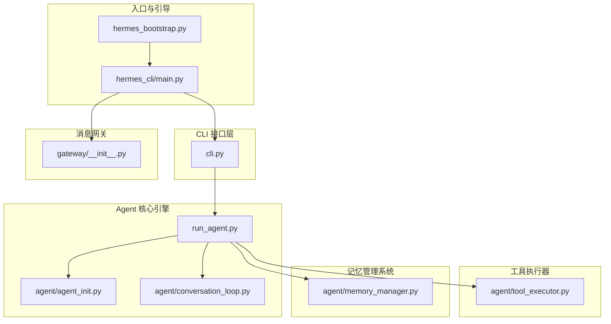
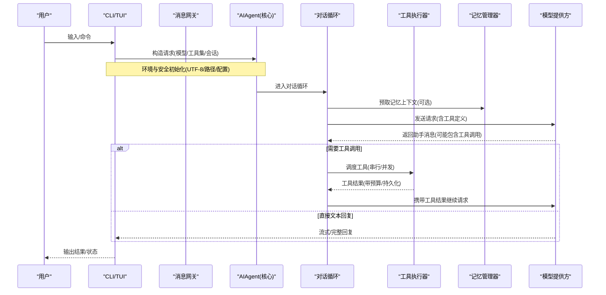
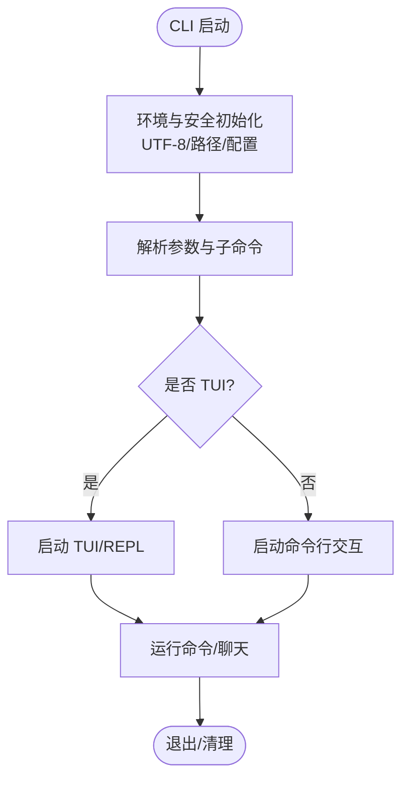
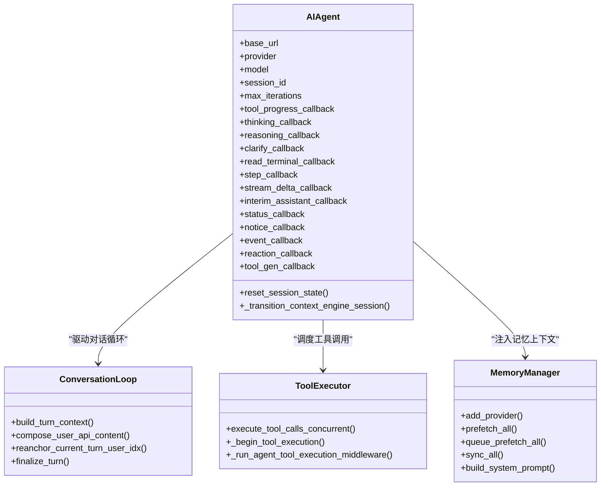
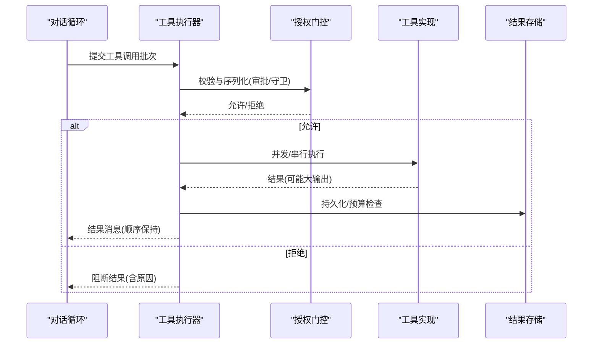
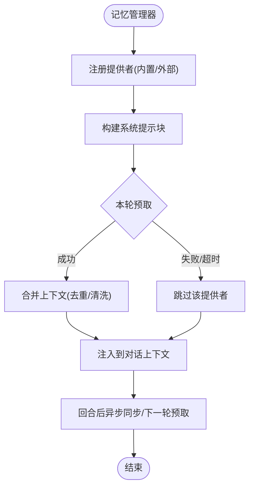
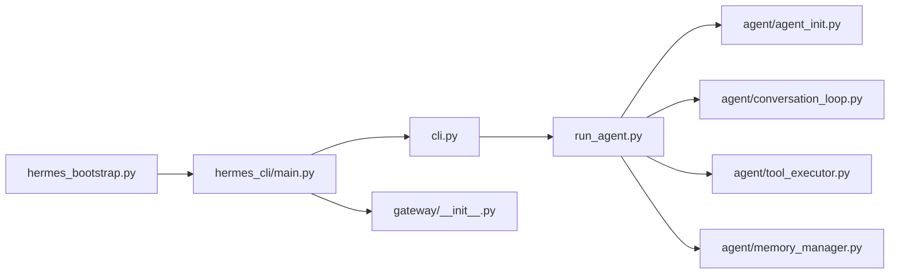

# 组件架构

<cite>
**本文引用的文件**
- [README.md](file://README.md)
- [hermes_bootstrap.py](file://hermes_bootstrap.py)
- [cli.py](file://cli.py)
- [hermes_cli/main.py](file://hermes_cli/main.py)
- [run_agent.py](file://run_agent.py)
- [agent/agent_init.py](file://agent/agent_init.py)
- [agent/conversation_loop.py](file://agent/conversation_loop.py)
- [agent/tool_executor.py](file://agent/tool_executor.py)
- [agent/memory_manager.py](file://agent/memory_manager.py)
- [gateway/__init__.py](file://gateway/__init__.py)
</cite>

## 目录
1. [简介](#简介)
2. [项目结构](#项目结构)
3. [核心组件](#核心组件)
4. [架构总览](#架构总览)
5. [详细组件分析](#详细组件分析)
6. [依赖关系分析](#依赖关系分析)
7. [性能考量](#性能考量)
8. [故障排查指南](#故障排查指南)
9. [结论](#结论)
10. [附录](#附录)

## 简介
本技术文档面向 Hermes Agent 的组件架构，聚焦于 CLI 接口层、Agent 核心引擎、消息网关、工具执行器与记忆管理系统等关键组件的职责边界、通信机制、数据流转、生命周期管理、状态同步、错误传播策略，以及可插拔设计与扩展机制（插件接口、动态加载、版本兼容）。文档通过架构图与数据流图展示各组件如何协同工作，并提供排障与性能优化建议。

## 项目结构
Hermes Agent 采用分层与模块化组织：
- 入口与引导：CLI 与 Gateway 进程由 hermes_cli/main.py 启动；跨平台 UTF-8 与环境安全由 hermes_bootstrap.py 统一处理。
- 交互界面：CLI 提供交互式终端与 TUI 能力，负责用户输入、命令解析、会话显示与输出渲染。
- 核心引擎：AIAgent 及其初始化、对话循环、上下文压缩、提示构建、重试与回退、轨迹保存等集中在 run_agent.py 与 agent/* 子模块。
- 工具执行：tool_executor.py 实现工具调用的串行/并发调度、授权门控、预算控制、结果持久化与回调。
- 记忆系统：memory_manager.py 统一管理内置与外部记忆提供者，负责系统提示注入、预取与异步同步。
- 消息网关：gateway/* 提供多平台接入、会话管理、投递路由与平台适配。

图表来源
- [hermes_bootstrap.py:1-240](file://hermes_bootstrap.py#L1-L240)
- [hermes_cli/main.py:1-800](file://hermes_cli/main.py#L1-L800)
- [cli.py:1-800](file://cli.py#L1-L800)
- [run_agent.py:1-800](file://run_agent.py#L1-L800)
- [agent/agent_init.py:1-800](file://agent/agent_init.py#L1-L800)
- [agent/conversation_loop.py:1-800](file://agent/conversation_loop.py#L1-L800)
- [agent/tool_executor.py:1-800](file://agent/tool_executor.py#L1-L800)
- [agent/memory_manager.py:1-800](file://agent/memory_manager.py#L1-L800)
- [gateway/__init__.py:1-36](file://gateway/__init__.py#L1-L36)

章节来源
- [README.md:1-265](file://README.md#L1-L265)
- [hermes_bootstrap.py:1-240](file://hermes_bootstrap.py#L1-L240)
- [hermes_cli/main.py:1-800](file://hermes_cli/main.py#L1-L800)
- [cli.py:1-800](file://cli.py#L1-L800)
- [run_agent.py:1-800](file://run_agent.py#L1-L800)
- [gateway/__init__.py:1-36](file://gateway/__init__.py#L1-L36)

## 核心组件
- CLI 接口层：负责命令解析、TUI/REPL 交互、配置加载、日志与早期恢复、环境变量桥接、平台选择与快捷路径。
- Agent 核心引擎：负责 AIAgent 初始化、模型路由、API 模式选择、会话上下文、提示构建、对话循环、重试与回退、轨迹与用量统计。
- 工具执行器：负责工具调用解析、并行/串行调度、授权门控、预算限制、结果持久化、回调与中断处理。
- 记忆管理系统：负责记忆提供者注册、系统提示注入、预取与异步同步、流式上下文清洗、工具 schema 注入。
- 消息网关：负责多平台接入、会话上下文、投递路由、平台工具集差异化、健康检查与监控。

章节来源
- [hermes_cli/main.py:1-800](file://hermes_cli/main.py#L1-L800)
- [cli.py:1-800](file://cli.py#L1-L800)
- [run_agent.py:1-800](file://run_agent.py#L1-L800)
- [agent/agent_init.py:1-800](file://agent/agent_init.py#L1-L800)
- [agent/conversation_loop.py:1-800](file://agent/conversation_loop.py#L1-L800)
- [agent/tool_executor.py:1-800](file://agent/tool_executor.py#L1-L800)
- [agent/memory_manager.py:1-800](file://agent/memory_manager.py#L1-L800)
- [gateway/__init__.py:1-36](file://gateway/__init__.py#L1-L36)

## 架构总览
下图展示了从用户输入到模型响应与工具执行的端到端流程，涵盖 CLI/Gateway 入口、Agent 核心、工具执行与记忆系统协作。

图表来源
- [hermes_cli/main.py:1-800](file://hermes_cli/main.py#L1-L800)
- [cli.py:1-800](file://cli.py#L1-L800)
- [run_agent.py:1-800](file://run_agent.py#L1-L800)
- [agent/conversation_loop.py:1-800](file://agent/conversation_loop.py#L1-L800)
- [agent/tool_executor.py:1-800](file://agent/tool_executor.py#L1-L800)
- [agent/memory_manager.py:1-800](file://agent/memory_manager.py#L1-L800)

## 详细组件分析

### CLI 接口层
- 职责与边界
  - 命令解析与子命令分发，TUI/REPL 交互，配置加载与桥接，日志与早期恢复，环境变量注入，平台选择。
  - 与 Agent 和 Gateway 解耦：仅负责用户交互与启动编排，不执行业务推理。
- 生命周期
  - 启动时进行快速路径引导、UTF-8 设置、路径修复、配置读取、日志初始化、TUI 决策。
  - 运行期维护会话状态、进度回调、中断处理。
- 错误传播
  - 对导入失败、配置异常、TTY 缺失等进行降级或友好提示，避免阻塞主流程。
- 扩展点
  - 子命令注册、中间件钩子、插件集成（如 skills、MCP、平台适配器）。

图表来源
- [hermes_cli/main.py:1-800](file://hermes_cli/main.py#L1-L800)
- [cli.py:1-800](file://cli.py#L1-L800)

章节来源
- [hermes_cli/main.py:1-800](file://hermes_cli/main.py#L1-L800)
- [cli.py:1-800](file://cli.py#L1-L800)

### Agent 核心引擎
- 职责与边界
  - AIAgent 初始化、模型与 API 模式选择、会话上下文、提示构建、对话循环、重试与回退、轨迹与用量统计。
  - 与工具执行器和记忆管理器协作，但不直接实现具体工具逻辑。
- 生命周期
  - 初始化阶段完成 provider 自动检测、传输预热、上下文引擎绑定、回调注册。
  - 对话循环阶段负责消息组装、压缩、流式处理、中断与重定向、最终化与持久化。
- 错误传播
  - 分类 API 错误、网络超时、配额耗尽、凭证过期等，触发重试、回退或用户提示。
- 扩展点
  - 自定义 provider、transport、context engine、prompt builder、trajectory saver。

图表来源
- [run_agent.py:1-800](file://run_agent.py#L1-L800)
- [agent/agent_init.py:1-800](file://agent/agent_init.py#L1-L800)
- [agent/conversation_loop.py:1-800](file://agent/conversation_loop.py#L1-L800)
- [agent/tool_executor.py:1-800](file://agent/tool_executor.py#L1-L800)
- [agent/memory_manager.py:1-800](file://agent/memory_manager.py#L1-L800)

章节来源
- [run_agent.py:1-800](file://run_agent.py#L1-L800)
- [agent/agent_init.py:1-800](file://agent/agent_init.py#L1-L800)
- [agent/conversation_loop.py:1-800](file://agent/conversation_loop.py#L1-L800)

### 工具执行器
- 职责与边界
  - 工具调用解析、串行/并发调度、授权门控、预算控制、结果持久化、回调与中断处理。
  - 与 model_tools、tools.registry、approval 等协作，确保工具执行的安全性与一致性。
- 生命周期
  - 批处理前进行权限校验与守卫决策，执行中记录进度与指标，完成后进行预算与持久化。
- 错误传播
  - 捕获并分类工具执行错误，支持取消、超时、授权失败、守卫拦截等场景。
- 扩展点
  - 中间件链、pre/post 钩子、授权策略、结果存储后端。

图表来源
- [agent/tool_executor.py:1-800](file://agent/tool_executor.py#L1-L800)

章节来源
- [agent/tool_executor.py:1-800](file://agent/tool_executor.py#L1-L800)

### 记忆管理系统
- 职责与边界
  - 注册内置与外部记忆提供者，注入系统提示，预取上下文，异步同步与队列预取，流式上下文清洗。
  - 保证只允许一个外部提供者，避免工具 schema 膨胀与冲突。
- 生命周期
  - 初始化时建立提供者索引与后台执行器；每轮对话前预取，结束后异步同步与下一轮预取。
- 错误传播
  - 单个提供者失败不影响其他提供者；超时与异常被记录并跳过，保障主流程稳定。
- 扩展点
  - 自定义 MemoryProvider 实现，工具 schema 注入，流式 scrubber 定制。

图表来源
- [agent/memory_manager.py:1-800](file://agent/memory_manager.py#L1-L800)

章节来源
- [agent/memory_manager.py:1-800](file://agent/memory_manager.py#L1-L800)

### 消息网关
- 职责与边界
  - 多平台接入（Telegram、Discord、Slack、WhatsApp、Signal 等），会话管理、上下文注入、投递路由、平台工具集差异化。
  - 与 CLI/Agent 解耦：网关负责消息收发与会话生命周期，Agent 负责推理与工具执行。
- 生命周期
  - 启动时加载配置、注册平台适配器、建立会话存储与投递路由；运行中处理消息、状态与健康检查。
- 错误传播
  - 平台连接失败、重连策略、消息投递失败均具备容错与告警。
- 扩展点
  - 新增平台适配器、自定义投递目标、平台特定工具集。

章节来源
- [gateway/__init__.py:1-36](file://gateway/__init__.py#L1-L36)

## 依赖关系分析
- 入口依赖
  - hermes_bootstrap 为所有入口提供 UTF-8 与环境安全；hermes_cli/main.py 负责 CLI/Gateway 启动与子命令分发。
- 核心依赖
  - run_agent.py 作为 AIAgent 入口，依赖 agent/* 子模块实现初始化、对话循环、工具执行、记忆管理。
- 工具与记忆
  - tool_executor.py 依赖 tools.registry、approval、budget_config 等；memory_manager.py 依赖 memory_provider 接口与工具 schema 标准化。
- 网关依赖
  - gateway/* 提供平台适配与会话管理，与 CLI/Agent 通过回调与事件解耦。

图表来源
- [hermes_bootstrap.py:1-240](file://hermes_bootstrap.py#L1-L240)
- [hermes_cli/main.py:1-800](file://hermes_cli/main.py#L1-L800)
- [cli.py:1-800](file://cli.py#L1-L800)
- [run_agent.py:1-800](file://run_agent.py#L1-L800)
- [agent/agent_init.py:1-800](file://agent/agent_init.py#L1-L800)
- [agent/conversation_loop.py:1-800](file://agent/conversation_loop.py#L1-L800)
- [agent/tool_executor.py:1-800](file://agent/tool_executor.py#L1-L800)
- [agent/memory_manager.py:1-800](file://agent/memory_manager.py#L1-L800)
- [gateway/__init__.py:1-36](file://gateway/__init__.py#L1-L36)

章节来源
- [hermes_bootstrap.py:1-240](file://hermes_bootstrap.py#L1-L240)
- [hermes_cli/main.py:1-800](file://hermes_cli/main.py#L1-L800)
- [cli.py:1-800](file://cli.py#L1-L800)
- [run_agent.py:1-800](file://run_agent.py#L1-L800)
- [agent/agent_init.py:1-800](file://agent/agent_init.py#L1-L800)
- [agent/conversation_loop.py:1-800](file://agent/conversation_loop.py#L1-L800)
- [agent/tool_executor.py:1-800](file://agent/tool_executor.py#L1-L800)
- [agent/memory_manager.py:1-800](file://agent/memory_manager.py#L1-L800)
- [gateway/__init__.py:1-36](file://gateway/__init__.py#L1-L36)

## 性能考量
- 启动优化
  - 快速路径引导、懒加载 SDK、缓存配置与别名映射、减少不必要的第三方导入。
- 并发与预算
  - 工具执行使用线程池与并发上限，图像生成独立限流；按上下文窗口缩放工具结果预算，避免溢出。
- 内存与上下文
  - 上下文压缩阈值自适应、参考传递与恢复、流式上下文清洗防止泄露。
- I/O 与持久化
  - 增量持久化工具调用进度，避免破坏性工具导致的中断丢失；会话 DB 写入失败降级与重试。
- 网络与重试
  - 自适应退避、速率限制、凭证轮换与回退模型；OpenRouter 元数据预热减少首请求延迟。

[本节为通用性能指导，无需特定文件引用]

## 故障排查指南
- 常见问题定位
  - 工具执行失败：检查授权门控、守卫策略、预算限制与结果持久化；查看 post-tool-call 钩子与中间件追踪。
  - 记忆预取超时：确认外部提供者响应时间，调整超时与后台任务；关注提供者异常日志。
  - 网关连接问题：检查平台适配器 connect 签名与 is_reconnect 参数；查看重连策略与健康导出。
- 错误分类与恢复
  - 对话循环中的本地处理错误与 API 调用错误分类，避免对确定性 bug 重复重试；配额耗尽时提供账单链接与切换建议。
- 调试与日志
  - 启用 verbose_logging、tool_progress_mode、notice/status 回调；查看 agent.log 与 errors.log；使用诊断命令与 doctor。

章节来源
- [agent/tool_executor.py:1-800](file://agent/tool_executor.py#L1-L800)
- [agent/memory_manager.py:1-800](file://agent/memory_manager.py#L1-L800)
- [agent/conversation_loop.py:1-800](file://agent/conversation_loop.py#L1-L800)

## 结论
Hermes Agent 通过清晰的组件分层与解耦设计，实现了 CLI/Gateway 双入口、强大的 Agent 核心、灵活的工具执行与可扩展的记忆系统。组件间通过回调、事件与标准接口协作，具备完善的生命周期管理、状态同步与错误传播机制。可插拔设计支持插件与平台适配器的动态加载与版本兼容，满足多场景部署与持续演进需求。

[本节为总结性内容，无需特定文件引用]

## 附录
- 可插拔设计与扩展机制
  - 插件接口：MemoryProvider、平台适配器、工具 schema 标准化；通过注册表与中间件链扩展能力。
  - 动态加载：懒加载 SDK、按需导入模块、后台预热与缓存；避免冷启动开销。
  - 版本兼容：配置迁移、别名映射、API 模式自动选择；向后兼容旧配置与行为。
- 最佳实践
  - 合理设置工具预算与并发上限；使用上下文压缩与参考传递；启用增量持久化与监控导出；定期审计工具与记忆提供者。

[本节为概念性内容，无需特定文件引用]