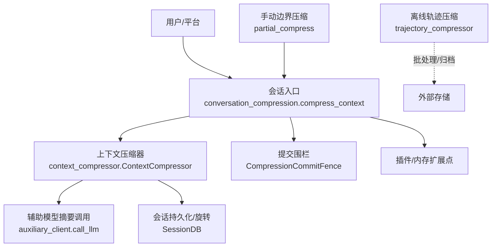
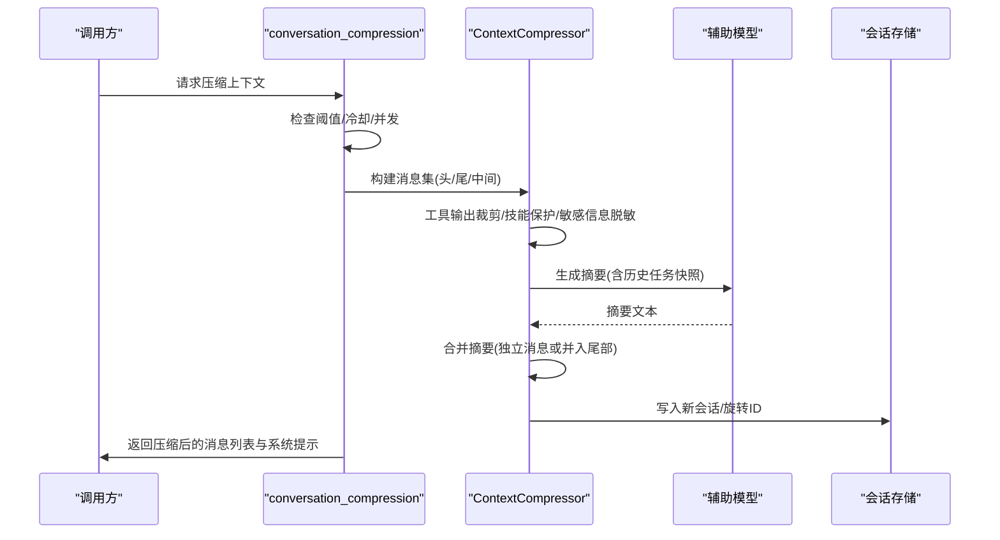
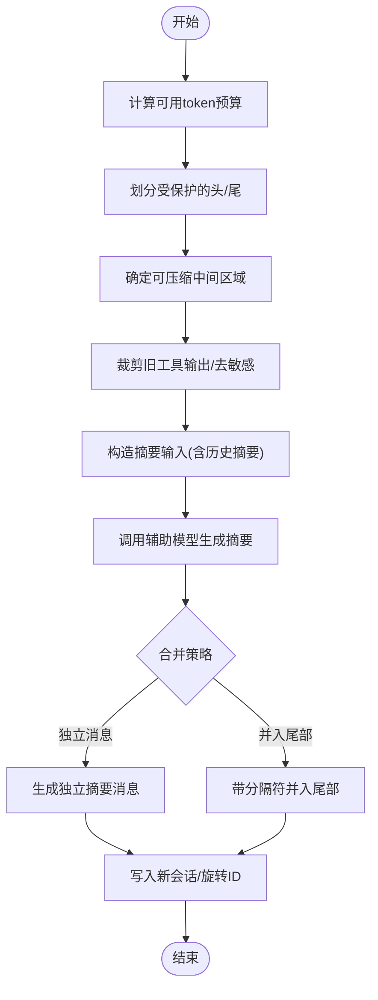
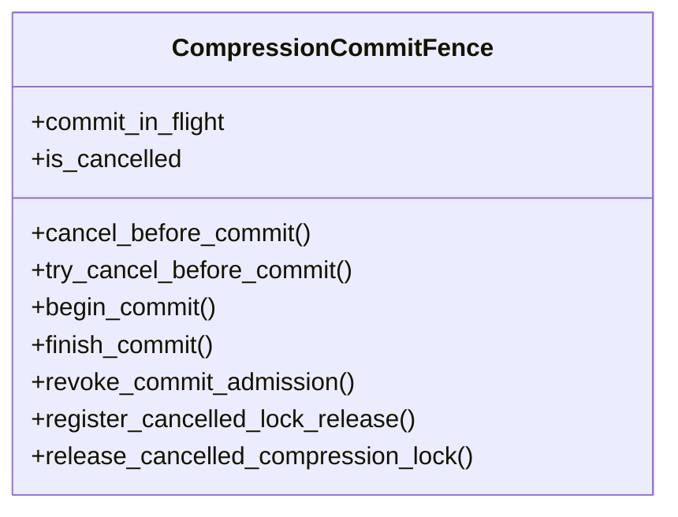
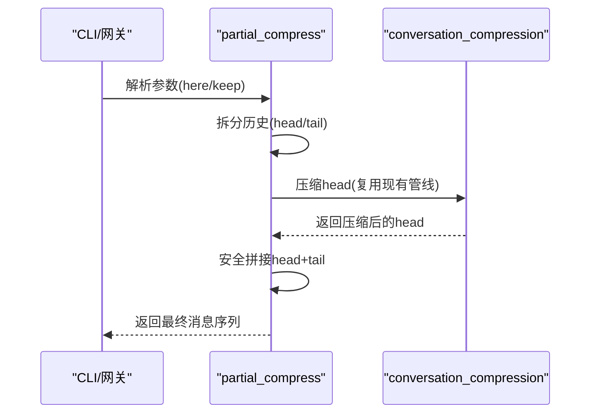
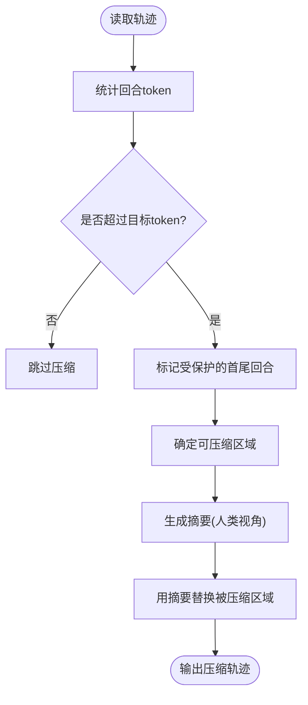
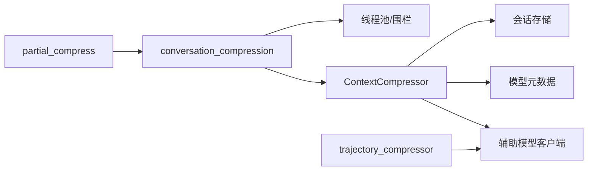

# 上下文压缩

<cite>
**本文引用的文件**
- [agent/context_compressor.py](file://agent/context_compressor.py)
- [agent/conversation_compression.py](file://agent/conversation_compression.py)
- [hermes_cli/partial_compress.py](file://hermes_cli/partial_compress.py)
- [trajectory_compressor.py](file://trajectory_compressor.py)
- [hermes_cli/config_defaults.py](file://hermes_cli/config_defaults.py)
- [agent/agent_init.py](file://agent/agent_init.py)
</cite>

## 目录
1. [简介](#简介)
2. [项目结构](#项目结构)
3. [核心组件](#核心组件)
4. [架构总览](#架构总览)
5. [详细组件分析](#详细组件分析)
6. [依赖关系分析](#依赖关系分析)
7. [性能考量](#性能考量)
8. [故障排查指南](#故障排查指南)
9. [结论](#结论)
10. [附录：配置与最佳实践](#附录配置与最佳实践)

## 简介
本技术文档聚焦 Hermes Agent 的“上下文压缩”能力，系统阐述对话压缩算法、触发条件、阈值策略、语义保持机制、不同类型内容（文本、代码、结构化数据）的处理策略，以及压缩后的上下文格式与恢复方式。同时给出可观测指标、评估方法与调优建议，帮助在长对话中稳定维持代理的理解与执行能力。

## 项目结构
Hermes 的上下文压缩由多层模块协作完成：
- 运行时自动压缩：agent/context_compressor.py 提供 ContextCompressor，负责消息摘要生成、关键信息保留、尾段保护、工具输出裁剪、滚动微压缩等。
- 压缩编排与超时控制：agent/conversation_compression.py 提供 compress_context 包装、提交围栏（CompressionCommitFence）、进度感知超时、并发池限制、状态快照/回滚等。
- 手动边界压缩：hermes_cli/partial_compress.py 支持“在此处之前压缩”的用户可控边界拆分与拼接。
- 离线轨迹压缩：trajectory_compressor.py 用于对已完成轨迹进行后处理压缩，便于训练或归档。
- 配置与阈值：hermes_cli/config_defaults.py 定义 compression.* 默认参数；agent/agent_init.py 将模型上下文长度与阈值结合，解析最终触发点。

图表来源
- [agent/conversation_compression.py:445-690](file://agent/conversation_compression.py#L445-L690)
- [agent/context_compressor.py:1-180](file://agent/context_compressor.py#L1-L180)
- [hermes_cli/partial_compress.py:213-325](file://hermes_cli/partial_compress.py#L213-L325)
- [trajectory_compressor.py:332-412](file://trajectory_compressor.py#L332-L412)

章节来源
- [agent/context_compressor.py:1-180](file://agent/context_compressor.py#L1-L180)
- [agent/conversation_compression.py:445-690](file://agent/conversation_compression.py#L445-L690)
- [hermes_cli/partial_compress.py:213-325](file://hermes_cli/partial_compress.py#L213-L325)
- [trajectory_compressor.py:332-412](file://trajectory_compressor.py#L332-L412)

## 核心组件
- ContextCompressor（运行时自动压缩）
  - 职责：选择保护头/尾、计算可压缩区域、构造摘要输入、调用辅助模型生成摘要、注入历史任务快照与技能丢失标记、合并到尾部或独立消息、清理敏感信息、维护滚动微压缩与失败冷却。
  - 关键点：按 token 预算动态分配摘要配额；严格角色交替保护；对工具输出做预裁剪；对 skill_view 结果做“幽灵技能”防护；对跨会话复用的摘要进行前缀归一化。
- conversation_compression（压缩编排）
  - 职责：封装 compress_context 调用，提供进度感知超时、提交围栏、并发池限流、状态快照/回滚、压缩状态提示与重试计数。
- partial_compress（手动边界压缩）
  - 职责：解析 /compress here/--keep N，拆分历史为 head/tail，保证 user↔assistant 交替合法，并在压缩后安全拼接。
- trajectory_compressor（离线轨迹压缩）
  - 职责：对已完成的轨迹进行目标 token 预算内的压缩，保护首尾，仅压缩中间区域，用单条人类摘要替换被压缩区域，并统计指标。

章节来源
- [agent/context_compressor.py:1-180](file://agent/context_compressor.py#L1-L180)
- [agent/conversation_compression.py:445-690](file://agent/conversation_compression.py#L445-L690)
- [hermes_cli/partial_compress.py:55-143](file://hermes_cli/partial_compress.py#L55-L143)
- [trajectory_compressor.py:332-412](file://trajectory_compressor.py#L332-L412)

## 架构总览
下图展示一次典型压缩流程：从触发判断、摘要生成、到提交与持久化的完整链路。

图表来源
- [agent/conversation_compression.py:445-690](file://agent/conversation_compression.py#L445-L690)
- [agent/context_compressor.py:180-780](file://agent/context_compressor.py#L180-L780)

## 详细组件分析

### 运行时自动压缩（ContextCompressor）
- 摘要生成与信息提取
  - 通过辅助模型对“中间区域”进行摘要，摘要配额按压缩内容的比例分配，并设置绝对上限，避免摘要本身成为新的上下文压力源。
  - 摘要模板包含“历史任务快照”“进行中状态”“待办用户问题”“剩余工作”等结构化小节，便于后续轮次快速定位上下文。
- 关键信息保留机制
  - 头尾保护：基于 token 预算而非固定消息数保护最近尾段，确保活跃用户请求与最新工具交互不被丢弃。
  - 工具输出裁剪：在进入 LLM 摘要前先裁剪旧工具输出，减少无效噪声。
  - 技能“幽灵”防护：检测即将丢失的 skill_view 指令，插入确定性标记，必要时在摘要后追加“已剪枝技能”清单，提示重新加载。
  - 角色交替保护：根据模板渲染规则跳过 tool/tool_calls 消息，避免 Mistral 家族模板拒绝请求。
- 压缩触发与阈值
  - 综合全局阈值与每模型阈值，对小窗口模型提高触发比例，避免频繁重压。
  - 失败冷却：摘要失败进入冷却期，防止反复失败导致抖动。
- 压缩后格式与恢复
  - 摘要以明确的前缀和结束标记包裹，作为“参考引用”，不替代最新用户消息。
  - 若需合并到尾部，使用分隔符包裹先前的尾部内容，避免误读为新消息。
  - 元数据键（以下划线开头）用于前端识别与过滤，不会发送到远端网关。

图表来源
- [agent/context_compressor.py:417-780](file://agent/context_compressor.py#L417-L780)

章节来源
- [agent/context_compressor.py:180-780](file://agent/context_compressor.py#L180-L780)

### 压缩编排与超时控制（conversation_compression）
- 提交围栏（CompressionCommitFence）
  - 确保取消与提交的原子性：在会话写入前允许取消；一旦进入提交阶段，等待完成后再释放锁。
  - 支持“进程级超时+总时长上限”，并提供进度追踪，区分慢响应与卡死。
- 并发与资源
  - 共享线程池限制最大并发压缩任务，避免多会话同时阻塞。
- 状态快照与回滚
  - 对压缩尝试的易变字段进行快照，失败时回滚，保证会话一致性。
- 状态提示
  - 统一的状态文案用于前端显示“正在压缩…”，并在完成后切换回正常状态。

图表来源
- [agent/conversation_compression.py:445-690](file://agent/conversation_compression.py#L445-L690)

章节来源
- [agent/conversation_compression.py:445-690](file://agent/conversation_compression.py#L445-L690)

### 手动边界压缩（partial_compress）
- 支持 “/compress here” 或 “/compress --keep N”，将历史拆分为 head/tail，head 走标准压缩管线，tail 原样保留。
- 保证拼接后的角色交替合法：若相邻角色冲突，会合并内容或插入桥接消息。
- 提供预览模式，报告将被压缩的消息数与近似 token 数，但不修改会话。

图表来源
- [hermes_cli/partial_compress.py:55-143](file://hermes_cli/partial_compress.py#L55-L143)
- [hermes_cli/partial_compress.py:213-325](file://hermes_cli/partial_compress.py#L213-L325)

章节来源
- [hermes_cli/partial_compress.py:55-143](file://hermes_cli/partial_compress.py#L55-L143)
- [hermes_cli/partial_compress.py:213-325](file://hermes_cli/partial_compress.py#L213-L325)

### 离线轨迹压缩（trajectory_compressor）
- 策略：保护首回合（system/human/gpt/tool）与最后 N 回合，仅压缩中间区域，用单条人类摘要替换被压缩区域，其余回合保持完整。
- 指标：记录原始/压缩后 token、回合数、压缩比率、API 调用次数与错误率等。
- 适用场景：训练数据准备、归档、回放与审计。

图表来源
- [trajectory_compressor.py:332-412](file://trajectory_compressor.py#L332-L412)
- [trajectory_compressor.py:743-800](file://trajectory_compressor.py#L743-L800)

章节来源
- [trajectory_compressor.py:332-412](file://trajectory_compressor.py#L332-L412)
- [trajectory_compressor.py:743-800](file://trajectory_compressor.py#L743-L800)

## 依赖关系分析
- 运行时压缩依赖：
  - 辅助模型客户端：用于摘要生成，具备重试与温度适配。
  - 会话存储：用于旋转 session_id、持久化压缩后的消息。
  - 模型元数据：估算 token、获取上下文长度，决定触发阈值。
- 编排层依赖：
  - 线程池与围栏：保障超时、并发与一致性。
  - 插件/内存扩展点：在压缩前后通知相关子系统更新上下文。
- 手动压缩依赖：
  - 复用运行时的压缩管线，但增加边界拆分与拼接逻辑。
- 离线压缩依赖：
  - 可选的 OpenRouter/自定义后端，用于摘要生成；本地 tokenizer 用于 token 计数。

图表来源
- [agent/context_compressor.py:180-780](file://agent/context_compressor.py#L180-L780)
- [agent/conversation_compression.py:445-690](file://agent/conversation_compression.py#L445-L690)
- [hermes_cli/partial_compress.py:213-325](file://hermes_cli/partial_compress.py#L213-L325)
- [trajectory_compressor.py:332-412](file://trajectory_compressor.py#L332-L412)

章节来源
- [agent/context_compressor.py:180-780](file://agent/context_compressor.py#L180-L780)
- [agent/conversation_compression.py:445-690](file://agent/conversation_compression.py#L445-L690)
- [hermes_cli/partial_compress.py:213-325](file://hermes_cli/partial_compress.py#L213-L325)
- [trajectory_compressor.py:332-412](file://trajectory_compressor.py#L332-L412)

## 性能考量
- 摘要输入大小限制：对摘要输入字符总量设定上限，避免超长 prompt 导致辅助模型超时或超出上下文。
- 摘要配额与上限：按比例分配摘要 token，并设置绝对上限，防止摘要膨胀。
- 工具输出裁剪：在进入 LLM 前裁剪旧工具输出，降低噪声与成本。
- 并发与超时：压缩任务限制并发，提供进度感知超时，避免长时间占用资源。
- 小窗口模型优化：对较小上下文窗口的模型提高触发比例，减少频繁重压带来的开销。

[本节为通用性能指导，无需特定文件引用]

## 故障排查指南
- 压缩被阻止
  - 现象：上下文超过阈值但压缩被阻止（如摘要模型冷却）。
  - 处理：等待冷却结束或手动触发 /compress；关注状态提示中的原因。
- 摘要失败
  - 现象：辅助模型调用失败或返回异常。
  - 处理：检查网络/鉴权/配额；查看失败冷却与重试；必要时降级为确定性丢弃策略。
- 角色交替错误
  - 现象：某些模板（如 Mistral 家族）拒绝请求。
  - 处理：确保摘要角色与相邻消息符合交替规则；系统已内置规避逻辑，若仍报错，检查是否有未处理的 tool/tool_calls 消息。
- 技能“幽灵”
  - 现象：skill_view 指令被压缩丢失，模型误以为技能仍加载。
  - 处理：关注“已剪枝技能”段落，按提示重新加载对应技能。
- 超时与卡死
  - 现象：压缩长时间无响应。
  - 处理：观察提交围栏与进度；确认是否进入总时长上限；必要时终止并重试。

章节来源
- [agent/conversation_compression.py:776-800](file://agent/conversation_compression.py#L776-L800)
- [agent/context_compressor.py:73-95](file://agent/context_compressor.py#L73-L95)
- [agent/context_compressor.py:201-228](file://agent/context_compressor.py#L201-L228)
- [agent/context_compressor.py:585-621](file://agent/context_compressor.py#L585-L621)

## 结论
Hermes 的上下文压缩通过“智能摘要 + 关键信息保留 + 严格边界保护”的组合，在长对话中有效平衡了上下文容量与语义完整性。其模块化设计使自动压缩、手动边界压缩与离线轨迹压缩各司其职，配合完善的超时、并发与回滚机制，保障了生产环境的稳定性与可观测性。合理配置阈值与监控关键指标，可在不同模型与负载下获得最优的压缩效果。

[本节为总结性内容，无需特定文件引用]

## 附录：配置与最佳实践

### 压缩触发条件与阈值
- 全局阈值与每模型阈值：结合模型上下文长度，自动调整触发点，避免小窗口模型频繁重压。
- 绝对 token 阈值：可设置硬上限，达到即触发压缩。
- 尾段保留比例：控制最近尾段的保留比例，确保活跃交互不被丢弃。
- 小窗口模型阈值提升：对小于阈值的模型提高触发比例，减少无效压缩。

章节来源
- [hermes_cli/config_defaults.py:595-783](file://hermes_cli/config_defaults.py#L595-L783)
- [agent/agent_init.py:276-302](file://agent/agent_init.py#L276-L302)

### 不同类型内容的压缩策略
- 文本：直接参与摘要，注意敏感信息脱敏与 URL 凭据隐藏。
- 代码：优先保留关键路径与调用关系；大段代码可通过占位符或摘要描述替代。
- 结构化数据：对 JSON/表格等，保留关键字段与聚合结果，去除冗余行。
- 工具输出：预裁剪旧输出，保留最近且必要的结果；对 skill_view 等大体积指令进行“幽灵技能”标记与提示。

章节来源
- [agent/context_compressor.py:417-780](file://agent/context_compressor.py#L417-L780)

### 压缩后的上下文格式与恢复机制
- 摘要前缀与结束标记：明确标识摘要范围，避免被当作新指令。
- 合并到尾部：使用分隔符包裹先前尾部内容，确保模型不误读。
- 元数据键：以下划线开头的键用于前端识别与过滤，不发送到远端。
- 恢复机制：压缩后旋转 session_id，保留受保护头尾；滚动微压缩持续更新摘要，避免信息丢失。

章节来源
- [agent/context_compressor.py:97-180](file://agent/context_compressor.py#L97-L180)
- [agent/context_compressor.py:249-267](file://agent/context_compressor.py#L249-L267)

### 语义保持技术与评估
- 语义保持：结构化摘要模板、历史任务快照、技能丢失标记、角色交替保护、敏感信息脱敏。
- 评估指标：压缩前后 token 数、消息数、摘要成功率、失败冷却次数、重复压缩率、用户反馈（如是否需要重新加载技能）。
- 观测手段：通过状态提示、日志与指标导出，监控压缩健康度与效果。

章节来源
- [agent/context_compressor.py:585-621](file://agent/context_compressor.py#L585-L621)
- [agent/conversation_compression.py:115-180](file://agent/conversation_compression.py#L115-L180)

### 最佳实践建议
- 合理设置阈值：根据模型上下文与业务负载，调整全局与每模型阈值，避免过频或过晚压缩。
- 关注技能与工具输出：对大体积 skill_view 与工具输出启用裁剪与标记，减少噪声。
- 利用手动边界压缩：在关键节点使用 “/compress here” 控制压缩边界，保留最近交互。
- 监控与调优：定期审查压缩指标与用户反馈，调整摘要配额、输入上限与失败冷却策略。

章节来源
- [hermes_cli/partial_compress.py:55-143](file://hermes_cli/partial_compress.py#L55-L143)
- [hermes_cli/config_defaults.py:595-783](file://hermes_cli/config_defaults.py#L595-L783)