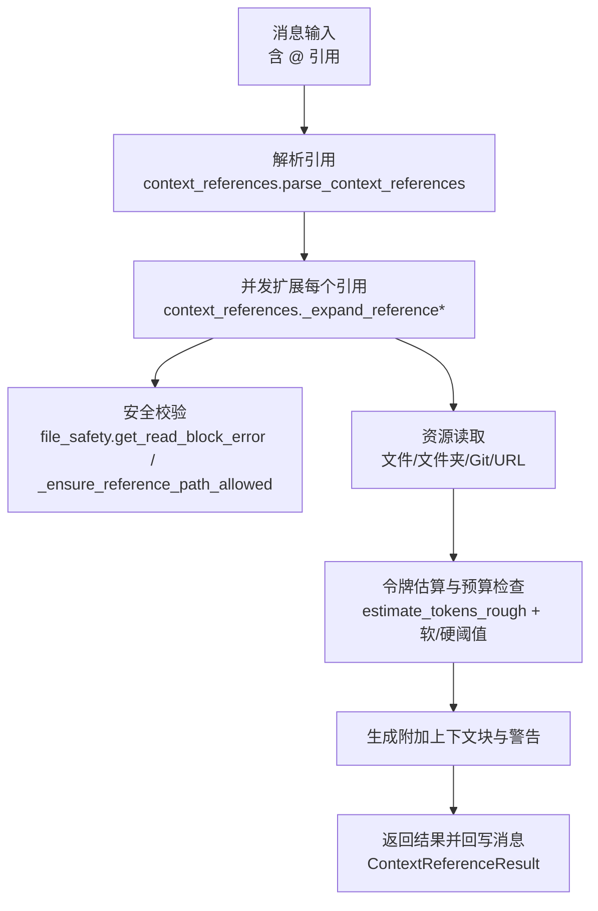
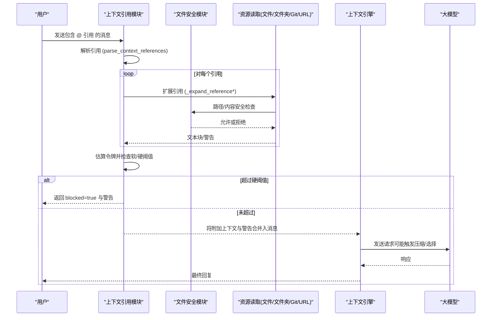
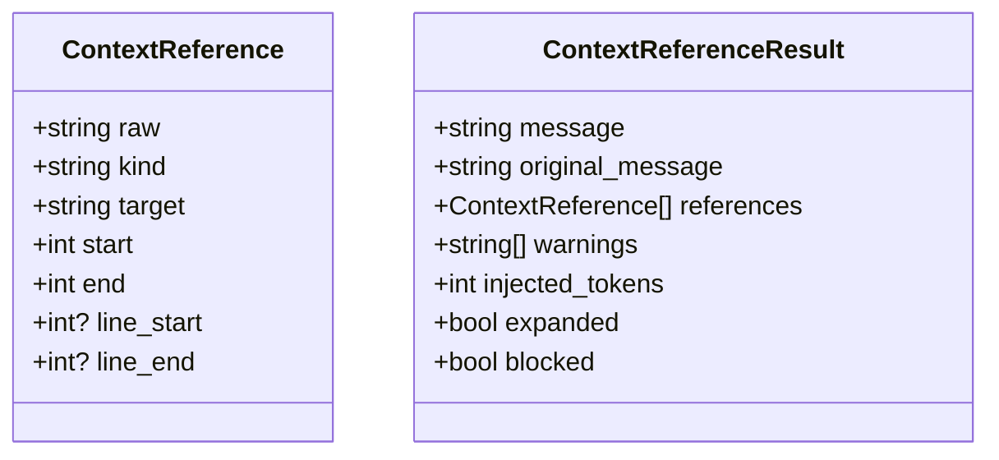
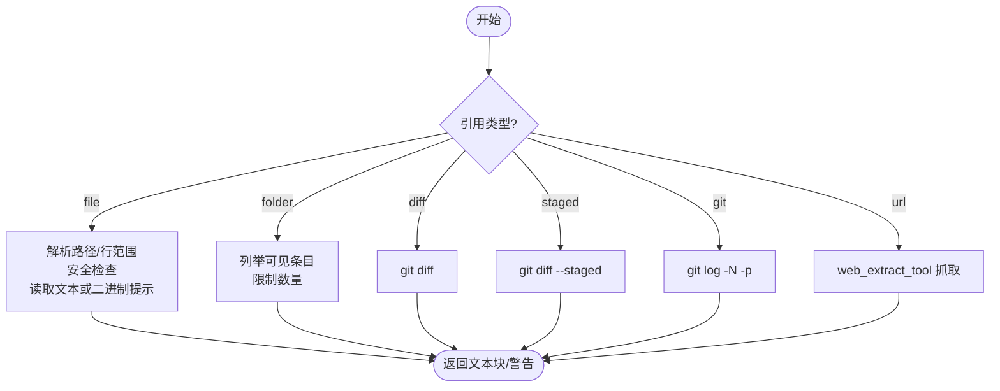
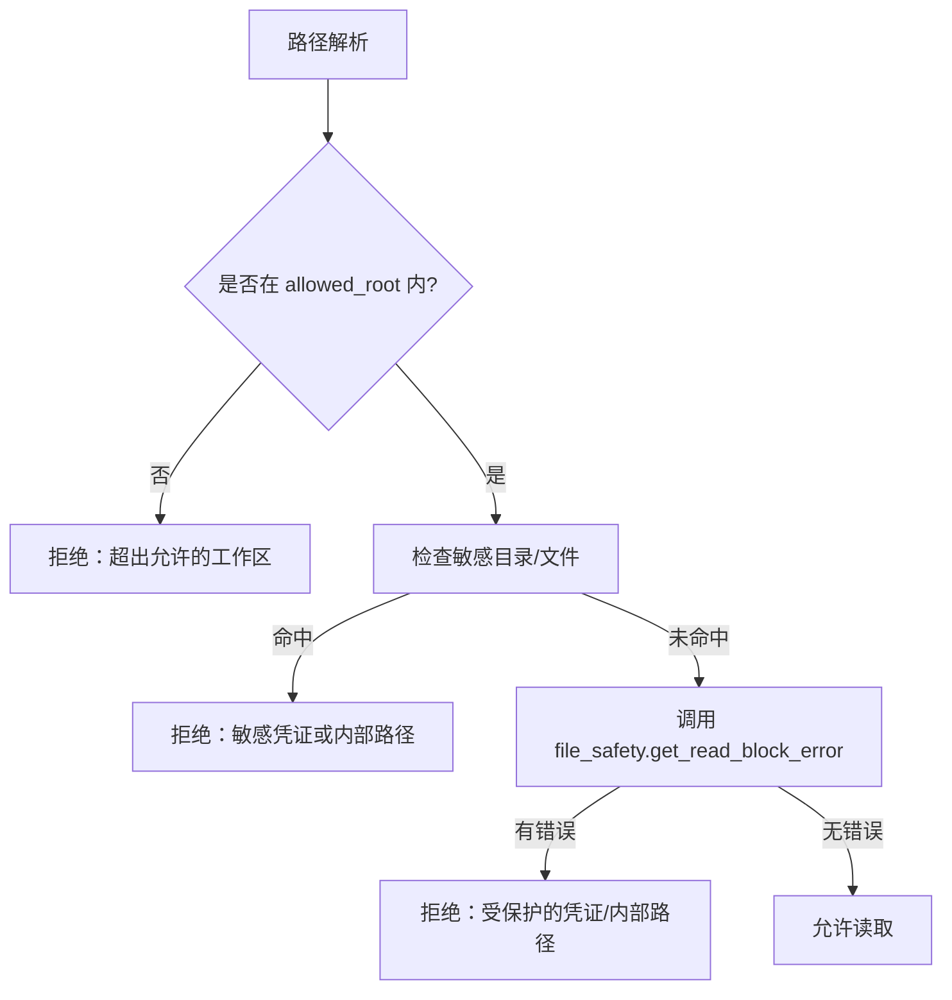
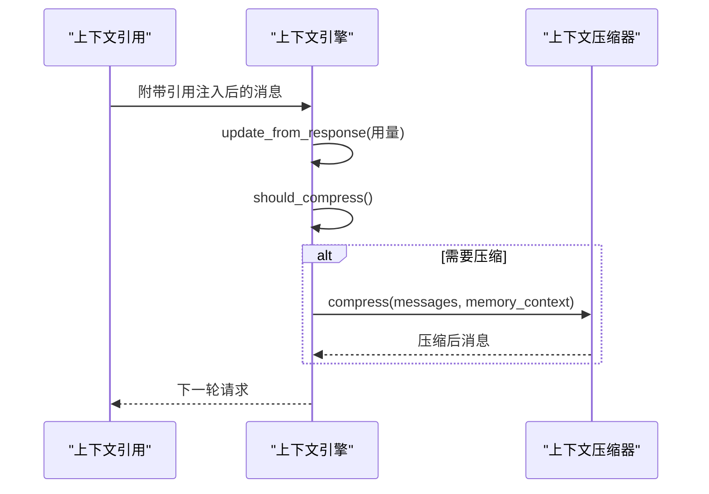
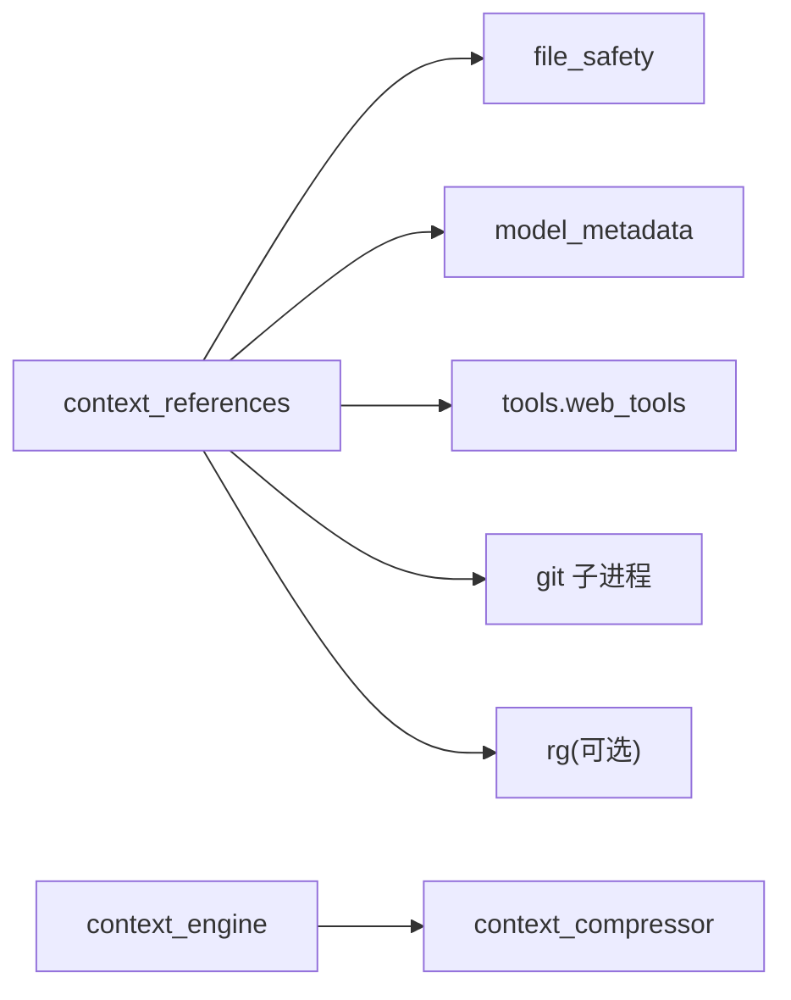

# 上下文引用管理

<cite>
**本文引用的文件**
- [agent/context_references.py](file://agent/context_references.py)
- [agent/file_safety.py](file://agent/file_safety.py)
- [agent/context_engine.py](file://agent/context_engine.py)
- [agent/context_compressor.py](file://agent/context_compressor.py)
- [agent/coding_context.py](file://agent/coding_context.py)
</cite>

## 目录
1. [简介](#简介)
2. [项目结构](#项目结构)
3. [核心组件](#核心组件)
4. [架构总览](#架构总览)
5. [详细组件分析](#详细组件分析)
6. [依赖关系分析](#依赖关系分析)
7. [性能与缓存](#性能与缓存)
8. [故障排查指南](#故障排查指南)
9. [结论](#结论)
10. [附录：配置与使用示例](#附录：配置与使用示例)

## 简介
本技术文档聚焦 Hermes Agent 的“上下文引用管理系统”，围绕以下目标展开：
- 引用创建、存储、解析与生命周期管理
- 引用类型系统（文件、文件夹、Git diff/staged/log、URL）
- 引用验证、权限控制与安全过滤
- 引用在对话中的作用（帮助 AI 理解意图、提供准确回答）
- 引用注入的预算控制、错误处理与可观测性
- 与上下文压缩/选择引擎的协作，以及性能优化建议

## 项目结构
与上下文引用相关的核心代码集中在 agent 目录下：
- 解析与扩展：agent/context_references.py
- 安全与访问控制：agent/file_safety.py
- 上下文引擎接口与默认实现：agent/context_engine.py、agent/context_compressor.py
- 编码工作区感知（影响提示与工具集）：agent/coding_context.py

图表来源
- [agent/context_references.py:80-236](file://agent/context_references.py#L80-L236)
- [agent/file_safety.py:194-337](file://agent/file_safety.py#L194-L337)

章节来源
- [agent/context_references.py:80-236](file://agent/context_references.py#L80-L236)
- [agent/file_safety.py:194-337](file://agent/file_safety.py#L194-L337)

## 核心组件
- 上下文引用数据模型
  - ContextReference：描述一条引用（原始文本、类型、目标、位置、行范围等）
  - ContextReferenceResult：预处理后的结果（最终消息、原始消息、引用列表、警告、注入令牌数、是否被阻断）
- 引用解析器
  - parse_context_references：基于正则识别 @simple 或 @kind:value[:line] 形式的引用
- 引用扩展器
  - preprocess_context_references / preprocess_context_references_async：入口函数，负责并发扩展、预算控制与结果组装
  - _expand_reference：按类型分派到具体扩展器
- 安全与路径限制
  - _resolve_path：相对路径解析与 allowed_root 约束
  - _ensure_reference_path_allowed：敏感目录/文件白名单 + file_safety 读拒绝清单
- 资源读取
  - 文件：按行范围裁剪、二进制检测与友好提示
  - 文件夹：递归列出可见条目（优先 rg 加速）
  - Git：diff/staged/log 子进程调用
  - URL：通过 web_extract_tool 抓取内容
- 上下文引擎集成
  - context_engine.ContextEngine：定义压缩/选择/观察钩子
  - context_compressor：自动压缩、摘要持久化、失败降级与敏感信息清理

章节来源
- [agent/context_references.py:43-63](file://agent/context_references.py#L43-L63)
- [agent/context_references.py:80-236](file://agent/context_references.py#L80-L236)
- [agent/context_references.py:239-346](file://agent/context_references.py#L239-L346)
- [agent/context_references.py:372-434](file://agent/context_references.py#L372-L434)
- [agent/context_engine.py:89-279](file://agent/context_engine.py#L89-L279)
- [agent/context_compressor.py:100-179](file://agent/context_compressor.py#L100-L179)

## 架构总览
下图展示了从用户消息到最终注入上下文的完整流程，以及与上下文引擎的交互点。

图表来源
- [agent/context_references.py:150-236](file://agent/context_references.py#L150-L236)
- [agent/file_safety.py:194-337](file://agent/file_safety.py#L194-L337)
- [agent/context_engine.py:133-279](file://agent/context_engine.py#L133-L279)

## 详细组件分析

### 解析与数据结构
- 引用类型
  - simple：diff、staged（快捷方式）
  - kind：file、folder、git、url
- 行范围语法
  - file 支持 :start 或 :start-end；也支持引号包裹路径以保留空格
- 数据结构
  - ContextReference：raw/kind/target/start/end/line_start/line_end
  - ContextReferenceResult：message/original_message/references/warnings/injected_tokens/expanded/blocked

图表来源
- [agent/context_references.py:43-63](file://agent/context_references.py#L43-L63)

章节来源
- [agent/context_references.py:80-120](file://agent/context_references.py#L80-L120)
- [agent/context_references.py:455-478](file://agent/context_references.py#L455-L478)

### 扩展与资源读取
- 文件引用
  - 解析路径与行范围；二进制文件不内联，返回元信息与工具指引
  - 语言高亮标记由后缀映射决定
- 文件夹引用
  - 优先使用 rg 快速列举；否则 os.walk；限制条目数量
- Git 引用
  - diff/staged/log 通过 git 子进程执行，带超时保护
- URL 引用
  - 通过 web_extract_tool 获取 markdown 内容；无内容时返回提示

图表来源
- [agent/context_references.py:239-346](file://agent/context_references.py#L239-L346)
- [agent/context_references.py:481-504](file://agent/context_references.py#L481-L504)
- [agent/context_references.py:538-555](file://agent/context_references.py#L538-L555)

章节来源
- [agent/context_references.py:269-346](file://agent/context_references.py#L269-L346)
- [agent/context_references.py:481-504](file://agent/context_references.py#L481-L504)
- [agent/context_references.py:538-555](file://agent/context_references.py#L538-L555)

### 安全与权限控制
- 路径解析与根限制
  - _resolve_path：展开用户目录、拼接 cwd、强制 resolve；若指定 allowed_root，则必须在其下
- 敏感路径拒绝
  - 内置敏感目录/文件黑名单
  - 统一接入 file_safety.get_read_block_error 作为权威拒绝清单（覆盖 auth.json、OAuth 令牌、mcp-tokens、.env 等）
- “失败即关闭”原则
  - 当安全查询异常时，直接拒绝，避免误放行

图表来源
- [agent/context_references.py:372-434](file://agent/context_references.py#L372-L434)
- [agent/file_safety.py:194-337](file://agent/file_safety.py#L194-L337)

章节来源
- [agent/context_references.py:372-434](file://agent/context_references.py#L372-L434)
- [agent/file_safety.py:194-337](file://agent/file_safety.py#L194-L337)

### 预算控制与注入策略
- 令牌估算
  - 使用 estimate_tokens_rough 估算每个附加块的 token 数
- 软/硬阈值
  - 硬阈值：超过 50% 上下文长度则完全阻止注入，返回 blocked=true 与警告
  - 软阈值：超过 25% 上下文长度则追加警告，仍允许注入
- 输出格式
  - 保留原始 @ 引用标记以便前端渲染为芯片；附加上下文块置于消息末尾

章节来源
- [agent/context_references.py:178-236](file://agent/context_references.py#L178-L236)

### 与上下文引擎的协作
- 上下文引擎职责
  - 跟踪 token 用量、决定是否压缩、执行压缩、可选地选择每轮上下文
- 与引用系统的衔接
  - 注入发生在构建请求消息之前；随后进入引擎的 select_context/compress 流程
  - 压缩过程会清理敏感信息，确保跨会话摘要安全

图表来源
- [agent/context_engine.py:133-279](file://agent/context_engine.py#L133-L279)
- [agent/context_compressor.py:100-179](file://agent/context_compressor.py#L100-L179)

章节来源
- [agent/context_engine.py:133-279](file://agent/context_engine.py#L133-L279)
- [agent/context_compressor.py:100-179](file://agent/context_compressor.py#L100-L179)

### 编码工作区感知对引用的影响
- 编码模式会改变工具集与系统提示，间接影响引用扩展时的行为（例如更强调 read_file/search_files/patch）
- 在 coding posture 下，引用通常用于定位代码片段、查看变更与仓库状态，提升代理对代码意图的理解

章节来源
- [agent/coding_context.py:1-50](file://agent/coding_context.py#L1-L50)
- [agent/coding_context.py:214-265](file://agent/coding_context.py#L214-L265)

## 依赖关系分析
- 模块耦合
  - context_references 强依赖 file_safety 进行安全校验
  - context_references 通过 model_metadata.estimate_tokens_rough 做预算评估
  - context_references 通过 tools.web_tools 获取 URL 内容
  - context_engine 与 context_compressor 共同维护上下文生命周期
- 外部依赖
  - git 子进程（diff/staged/log）
  - rg（可选，加速文件夹列举）
  - web_extract_tool（URL 抓取）

图表来源
- [agent/context_references.py:14-16](file://agent/context_references.py#L14-L16)
- [agent/context_references.py:320-346](file://agent/context_references.py#L320-L346)
- [agent/context_references.py:538-555](file://agent/context_references.py#L538-L555)
- [agent/context_engine.py:133-279](file://agent/context_engine.py#L133-L279)
- [agent/context_compressor.py:100-179](file://agent/context_compressor.py#L100-L179)

章节来源
- [agent/context_references.py:14-16](file://agent/context_references.py#L14-L16)
- [agent/context_references.py:320-346](file://agent/context_references.py#L320-L346)
- [agent/context_references.py:538-555](file://agent/context_references.py#L538-L555)
- [agent/context_engine.py:133-279](file://agent/context_engine.py#L133-L279)
- [agent/context_compressor.py:100-179](file://agent/context_compressor.py#L100-L179)

## 性能与缓存
- 并发扩展
  - 所有引用并行扩展，减少 I/O 等待（尤其是多个 URL 场景）
- 快速列举
  - 优先使用 rg 列举文件夹；失败时回退到 os.walk
- 预算控制
  - 软/硬阈值避免上下文膨胀；硬阈值直接阻断，防止提示过大
- 二进制文件
  - 不内联二进制，仅返回元信息与工具指引，降低无效负载
- 压缩与摘要
  - 上下文压缩器会在长对话中自动压缩历史，保持活跃上下文精简
- 缓存策略
  - 当前实现未对引用结果做显式缓存；如需高频重复引用同一资源，可在上层引入缓存（如按路径+行范围键）

[本节为通用指导，无需特定文件来源]

## 故障排查指南
- 常见错误与处理
  - 路径不在允许工作区内：检查 allowed_root 设置与相对路径解析
  - 敏感路径被拒绝：确认目标非 .ssh/.aws/.kube/.docker/.azure/.config/gh 等目录，且不在 file_safety 拒绝清单中
  - Git 命令超时/失败：检查 git 可用性与命令参数
  - URL 抓取为空：检查网络与 web_extract_tool 返回
  - 注入被阻断：检查注入令牌是否超过硬阈值（50%），必要时拆分引用或调整上下文长度
- 调试建议
  - 关注返回的 warnings 与 injected_tokens
  - 对于二进制文件，使用代理工具读取/转换
  - 在编码模式下，优先使用 read_file/search_files/patch 等工具配合引用

章节来源
- [agent/context_references.py:178-236](file://agent/context_references.py#L178-L236)
- [agent/context_references.py:269-346](file://agent/context_references.py#L269-L346)
- [agent/file_safety.py:194-337](file://agent/file_safety.py#L194-L337)

## 结论
Hermes 的上下文引用管理系统通过严格的解析、安全校验与预算控制，将外部资源（文件、文件夹、Git 变更、URL）安全地注入对话上下文，帮助代理准确理解用户意图并提供高质量回答。与上下文引擎的协作确保了长对话下的稳定性与效率。建议在高频场景中引入引用结果缓存，并结合编码模式与工具集优化引用使用体验。

[本节为总结，无需特定文件来源]

## 附录：配置与使用示例
- 配置项
  - 上下文引擎选择：context.engine（默认 compressor）
  - 编码模式：agent.coding_context（auto/focus/on/off）
  - 安全写入白名单：HERMES_WRITE_SAFE_ROOT（影响写操作，参考 file_safety）
- 使用示例
  - 文件引用：@file:"path/to/file":10-20（插入指定行范围）
  - 文件夹引用：@folder:"src/"（列出可见条目）
  - Git 变更：@diff、@staged、@git:3（最近 3 次提交差异）
  - URL 引用：@url:"https://example.com"（抓取并注入内容）
- 最佳实践
  - 合理拆分大文件引用，避免超过软/硬阈值
  - 在编码模式下结合 read_file/search_files/patch 工具链
  - 注意敏感路径与 .env 等环境文件的保护

章节来源
- [agent/context_engine.py:1-26](file://agent/context_engine.py#L1-L26)
- [agent/coding_context.py:39-49](file://agent/coding_context.py#L39-L49)
- [agent/file_safety.py:83-98](file://agent/file_safety.py#L83-L98)
- [agent/context_references.py:80-120](file://agent/context_references.py#L80-L120)
- [agent/context_references.py:455-478](file://agent/context_references.py#L455-L478)