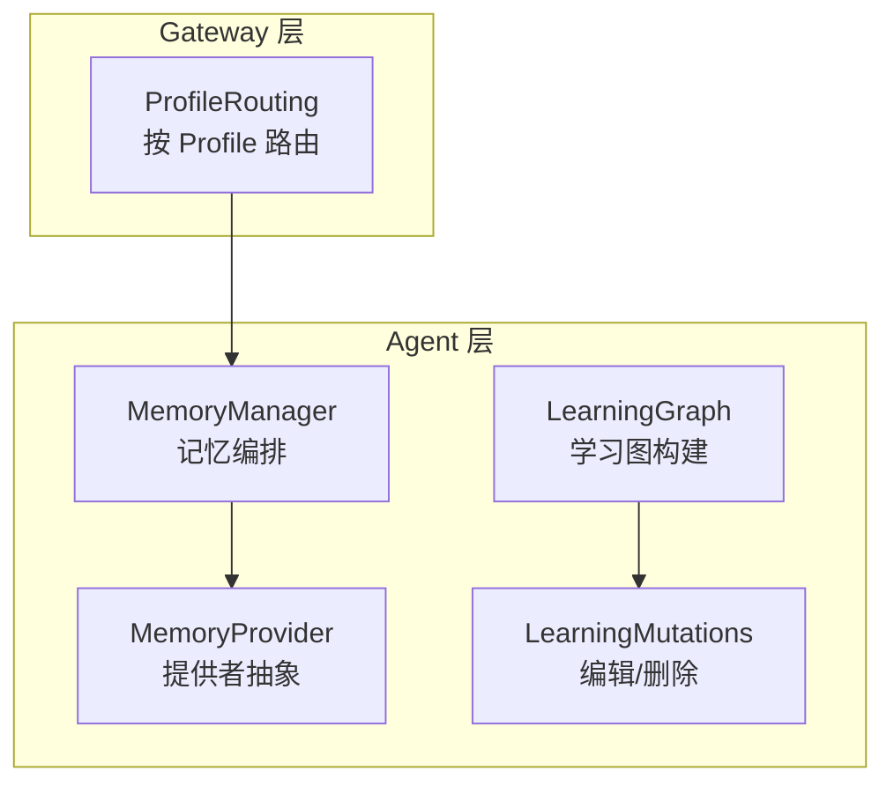
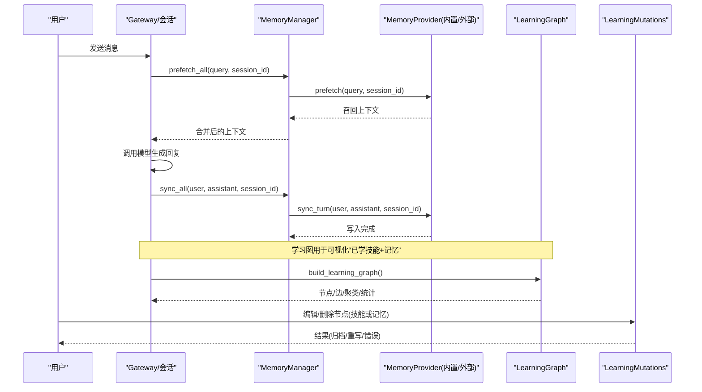
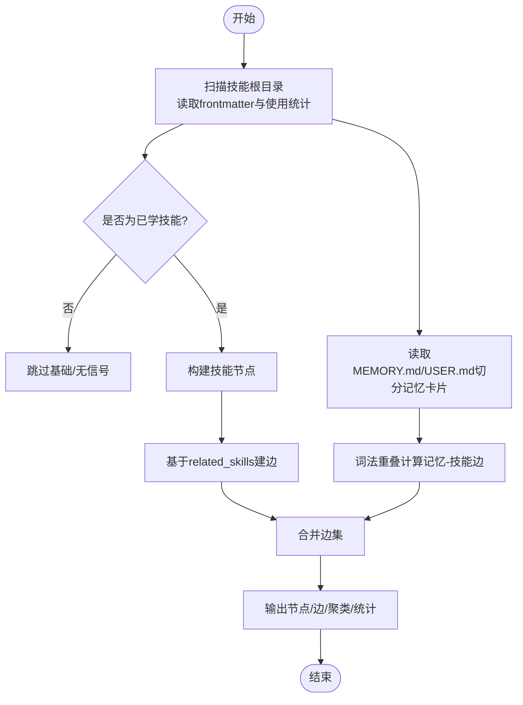
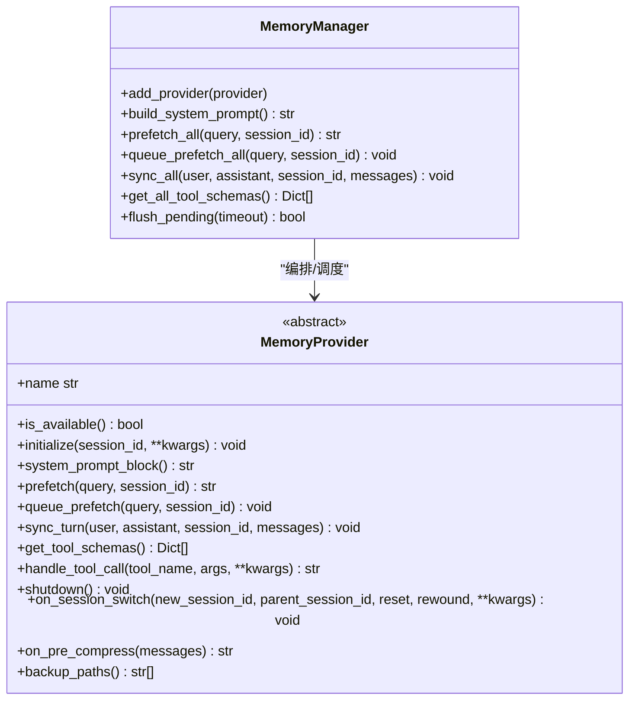
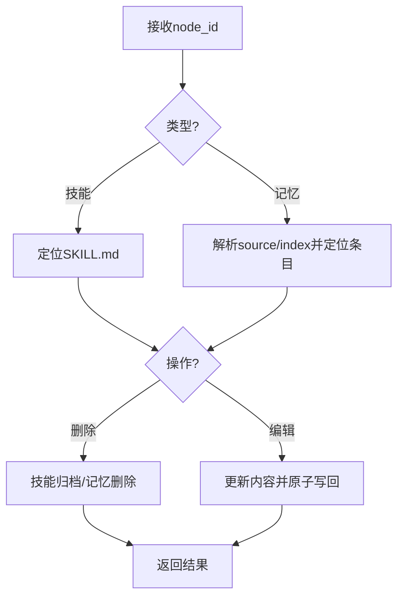
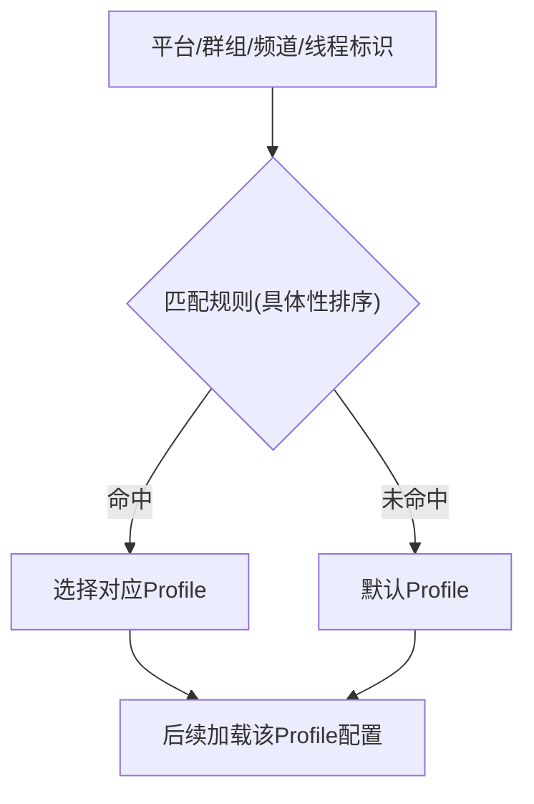
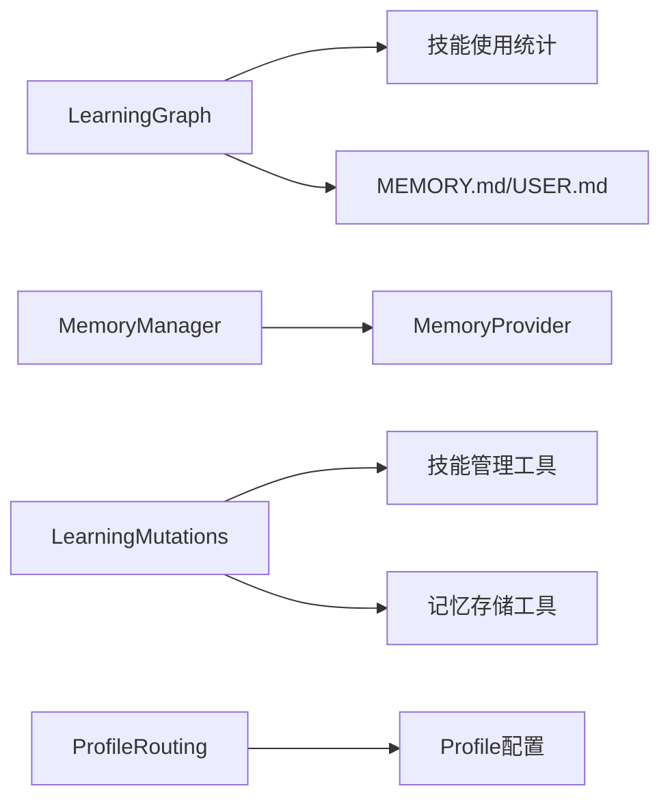

# 用户画像与学习

<cite>
**本文引用的文件**
- [agent/learning_graph.py](file://agent/learning_graph.py)
- [agent/learning_mutations.py](file://agent/learning_mutations.py)
- [agent/memory_manager.py](file://agent/memory_manager.py)
- [agent/memory_provider.py](file://agent/memory_provider.py)
- [gateway/profile_routing.py](file://gateway/profile_routing.py)
</cite>

## 目录
1. [简介](#简介)
2. [项目结构](#项目结构)
3. [核心组件](#核心组件)
4. [架构总览](#架构总览)
5. [详细组件分析](#详细组件分析)
6. [依赖关系分析](#依赖关系分析)
7. [性能考量](#性能考量)
8. [故障排查指南](#故障排查指南)
9. [结论](#结论)
10. [附录](#附录)

## 简介
本技术文档聚焦 Hermes Agent 的“用户画像与学习系统”，围绕以下目标展开：
- 解释用户偏好学习机制：行为模式识别、兴趣点提取、技能使用习惯分析。
- 说明用户画像的数据结构：基本信息、偏好设置、使用历史、技能熟练度等维度。
- 阐述跨会话知识迁移机制：如何在不同会话间保持一致的用户理解与个性化服务。
- 解析学习算法实现原理：增量学习、遗忘机制、置信度评估。
- 总结用户隐私保护措施与数据安全策略。

Hermes 的学习系统以“可学习的技能”和“持久化记忆”为核心，通过“学习图（Learning Graph）”将用户实际掌握或频繁使用的技能可视化，并将 MEMORY.md / USER.md 中的记忆片段作为一等节点参与关联推理；同时通过 MemoryManager 统一编排内置与外部记忆提供者，完成每轮对话的前置召回与后置同步，从而在跨会话中沉淀并复用用户画像信息。

## 项目结构
与用户画像和学习相关的核心代码主要分布在 agent 与 gateway 两个层面：
- agent 层：负责学习图构建、记忆读写编排、提供者抽象与生命周期管理。
- gateway 层：提供基于 Profile 的路由能力，使不同平台/频道/线程可以映射到不同的用户画像配置。

图表来源
- [agent/memory_manager.py:364-758](file://agent/memory_manager.py#L364-L758)
- [agent/memory_provider.py:81-358](file://agent/memory_provider.py#L81-L358)
- [agent/learning_graph.py:125-323](file://agent/learning_graph.py#L125-L323)
- [agent/learning_mutations.py:26-207](file://agent/learning_mutations.py#L26-L207)
- [gateway/profile_routing.py:50-167](file://gateway/profile_routing.py#L50-L167)

章节来源
- [agent/memory_manager.py:364-758](file://agent/memory_manager.py#L364-L758)
- [agent/memory_provider.py:81-358](file://agent/memory_provider.py#L81-L358)
- [agent/learning_graph.py:125-323](file://agent/learning_graph.py#L125-L323)
- [agent/learning_mutations.py:26-207](file://agent/learning_mutations.py#L26-L207)
- [gateway/profile_routing.py:50-167](file://gateway/profile_routing.py#L50-L167)

## 核心组件
- 学习图（Learning Graph）：扫描基础与用户技能，结合使用统计与相关技能声明，生成“已学技能”节点与边；同时将 MEMORY.md / USER.md 的记忆片段切分为卡片节点，并通过词法重叠建立记忆-技能边，回答“哪些已学技能与我记住的内容相关”。
- 记忆编排（MemoryManager）：注册内置与至多一个外部记忆提供者，提供系统提示拼装、前置召回（prefetch）、后置同步（sync_turn）、工具注入、后台任务调度与超时保护。
- 记忆提供者接口（MemoryProvider）：定义初始化、系统提示块、召回、同步、工具暴露、会话切换钩子、压缩前钩子、备份路径等标准契约。
- 学习图变更（LearningMutations）：对“学习图”中的节点进行编辑或删除，支持技能归档与记忆条目原子重写，保证一致性。
- Profile 路由（ProfileRouting）：根据平台、群组、频道、线程等维度匹配规则，将消息路由到不同 Profile，从而实现不同用户画像的配置隔离与个性化。

章节来源
- [agent/learning_graph.py:125-323](file://agent/learning_graph.py#L125-L323)
- [agent/memory_manager.py:364-758](file://agent/memory_manager.py#L364-L758)
- [agent/memory_provider.py:81-358](file://agent/memory_provider.py#L81-L358)
- [agent/learning_mutations.py:26-207](file://agent/learning_mutations.py#L26-L207)
- [gateway/profile_routing.py:50-167](file://gateway/profile_routing.py#L50-L167)

## 架构总览
下图展示了从用户输入到记忆召回、再到学习图可视化的端到端流程，以及跨会话的知识迁移路径。

图表来源
- [agent/memory_manager.py:525-694](file://agent/memory_manager.py#L525-L694)
- [agent/memory_provider.py:132-170](file://agent/memory_provider.py#L132-L170)
- [agent/learning_graph.py:254-323](file://agent/learning_graph.py#L254-L323)
- [agent/learning_mutations.py:124-187](file://agent/learning_mutations.py#L124-L187)

## 详细组件分析

### 学习图（Learning Graph）
- 技能节点构建：扫描基础与用户技能目录，读取 frontmatter 与使用统计，过滤掉基础安装且无学习信号的节点，仅保留“已学技能”（由代理创建或被使用过）。
- 边构建：基于技能的 related_skills 声明建立双向边；同时从 MEMORY.md / USER.md 切分记忆卡片，通过词法重叠计算与技能名的相关性，建立“记忆-技能”边。
- 输出结构：包含节点列表（含类别、使用时间、使用次数、状态、是否置顶等）、边列表、聚类统计、记忆卡片集合与密度统计。

图表来源
- [agent/learning_graph.py:125-168](file://agent/learning_graph.py#L125-L168)
- [agent/learning_graph.py:193-245](file://agent/learning_graph.py#L193-L245)
- [agent/learning_graph.py:254-323](file://agent/learning_graph.py#L254-L323)

章节来源
- [agent/learning_graph.py:125-323](file://agent/learning_graph.py#L125-L323)

### 记忆编排（MemoryManager）
- 提供者注册：允许内置提供者 + 至多一个外部提供者，避免工具 schema 膨胀与冲突。
- 系统提示拼装：收集各提供者的静态提示块。
- 前置召回（prefetch）：为即将进行的回合快速召回相关上下文；对外部提供者采用线程并发与超时控制，避免阻塞主流程。
- 后置同步（sync_turn）：将完成的回合写入提供者；通过单工作线程串行执行，确保顺序性且不阻塞用户交互。
- 工具注入：将提供者的工具 schema 注入到代理的工具表面，供模型调用。
- 流式清理：提供 StreamingContextScrubber，安全地剥离流式响应中的内部记忆上下文标记，防止泄露。

图表来源
- [agent/memory_manager.py:364-758](file://agent/memory_manager.py#L364-L758)
- [agent/memory_provider.py:81-358](file://agent/memory_provider.py#L81-L358)

章节来源
- [agent/memory_manager.py:364-758](file://agent/memory_manager.py#L364-L758)
- [agent/memory_provider.py:81-358](file://agent/memory_provider.py#L81-L358)

### 学习图变更（LearningMutations）
- 节点类型识别：区分“技能”与“记忆”两类节点。
- 详情获取：用于编辑预填充，返回当前内容。
- 删除：技能删除走归档流程（可恢复），记忆删除直接重写文件。
- 编辑：技能编辑委托给技能管理器，记忆编辑原子重写对应条目。
- 一致性保障：通过 MemoryStore 的原子写入与缓存清理，避免并发读写导致的不一致。

图表来源
- [agent/learning_mutations.py:26-207](file://agent/learning_mutations.py#L26-L207)

章节来源
- [agent/learning_mutations.py:26-207](file://agent/learning_mutations.py#L26-L207)

### Profile 路由（ProfileRouting）
- 路由规则：支持平台、群组、频道、线程等多级匹配，按具体性排序，优先匹配最具体的规则。
- 作用：将不同来源的消息路由到不同 Profile，每个 Profile 可拥有独立的模型、工具、记忆与人格，从而实现多用户画像隔离与个性化。

图表来源
- [gateway/profile_routing.py:50-167](file://gateway/profile_routing.py#L50-L167)

章节来源
- [gateway/profile_routing.py:50-167](file://gateway/profile_routing.py#L50-L167)

## 依赖关系分析
- LearningGraph 依赖技能使用统计与 SKILL.md 元数据，同时读取 memories 目录下的 MEMORY.md / USER.md 构建记忆卡片。
- MemoryManager 依赖 MemoryProvider 抽象，统一管理多个提供者，屏蔽外部提供者的异步与超时细节。
- LearningMutations 依赖技能管理与记忆存储工具，确保编辑/删除操作的原子性与一致性。
- ProfileRouting 独立于学习图与记忆编排，但影响最终生效的 Profile 配置，间接决定记忆与技能的作用域。

图表来源
- [agent/learning_graph.py:125-323](file://agent/learning_graph.py#L125-L323)
- [agent/memory_manager.py:364-758](file://agent/memory_manager.py#L364-L758)
- [agent/learning_mutations.py:26-207](file://agent/learning_mutations.py#L26-L207)
- [gateway/profile_routing.py:50-167](file://gateway/profile_routing.py#L50-L167)

章节来源
- [agent/learning_graph.py:125-323](file://agent/learning_graph.py#L125-L323)
- [agent/memory_manager.py:364-758](file://agent/memory_manager.py#L364-L758)
- [agent/learning_mutations.py:26-207](file://agent/learning_mutations.py#L26-L207)
- [gateway/profile_routing.py:50-167](file://gateway/profile_routing.py#L50-L167)

## 性能考量
- 前置召回并行与超时：外部提供者的 prefetch 使用独立线程并设置超时，避免慢查询阻塞主循环。
- 后置同步串行化：所有 provider 的 sync_turn 通过单工作线程串行执行，保证写入顺序，避免竞争。
- 流式上下文清理：StreamingContextScrubber 在流式场景下安全剥离内部记忆上下文，减少 UI 噪音与潜在泄露。
- 学习图构建开销：学习图构建涉及文件扫描与文本分词，适合按需触发（如桌面面板刷新），避免每次请求都重建。

[本节为通用性能建议，不直接分析具体文件]

## 故障排查指南
- 外部提供者超时：若 prefetch 长时间无响应，MemoryManager 会记录警告并跳过该提供者，检查网络与外部服务状态。
- 提供者冲突：仅允许一个外部提供者，重复注册会被拒绝并记录警告；确认 memory.provider 配置唯一。
- 工具名称冲突：提供者工具名不得与核心工具重名，否则会被忽略；需重命名以避免覆盖。
- 学习图节点失效：编辑/删除时若索引过期，会提示刷新学习图；先重新构建学习图再操作。
- 流式上下文泄露：若发现 UI 中出现内部记忆上下文标记，检查 StreamingContextScrubber 是否正确集成到流式处理链路。

章节来源
- [agent/memory_manager.py:547-595](file://agent/memory_manager.py#L547-L595)
- [agent/memory_manager.py:404-470](file://agent/memory_manager.py#L404-L470)
- [agent/learning_mutations.py:124-187](file://agent/learning_mutations.py#L124-L187)
- [agent/memory_manager.py:182-361](file://agent/memory_manager.py#L182-L361)

## 结论
Hermes 的用户画像与学习系统以“学习图 + 记忆编排”为核心，实现了：
- 行为模式识别：通过技能使用统计与相关技能声明，识别用户的活跃技能与兴趣领域。
- 兴趣点提取：将 MEMORY.md / USER.md 的记忆片段作为一等节点，并与技能建立关联，形成可解释的知识图谱。
- 技能使用习惯分析：基于 use_count、last_activity 等指标，量化技能熟练度与活跃度。
- 跨会话知识迁移：通过 MemoryManager 的 prefetch/sync 机制与 Profile 路由，在不同会话与 Profile 间稳定传递用户画像信息。
- 增量学习与遗忘：学习图仅展示“已学技能”，未使用的基础技能不会污染视图；记忆条目可通过编辑/删除维护长期准确性。
- 隐私与安全：流式上下文清理、提供者工具白名单与核心工具保护、原子写入与归档机制，共同保障数据安全与可控性。

[本节为总结性内容，不直接分析具体文件]

## 附录
- 用户画像数据结构建议（基于现有实现归纳）：
  - 基本信息：profile 名称、平台标识、会话 ID。
  - 偏好设置：通过 Profile 路由与系统提示块体现。
  - 使用历史：技能 use_count、last_activity、state、created_by。
  - 技能熟练度：use_count 与最近活动时间综合评估。
  - 记忆片段：MEMORY.md / USER.md 中的条目，作为“记忆节点”参与关联推理。
- 跨会话迁移要点：
  - 使用 session_id 区分不同会话，provider 应据此隔离状态。
  - 通过 on_session_switch 钩子处理会话切换时的状态重置或延续。
  - 利用 profile_routing 将不同来源的消息路由到不同 Profile，实现多画像隔离。

[本节为补充说明，不直接分析具体文件]