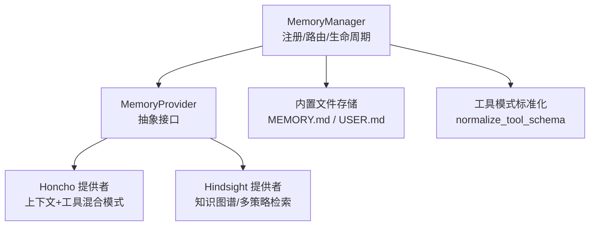
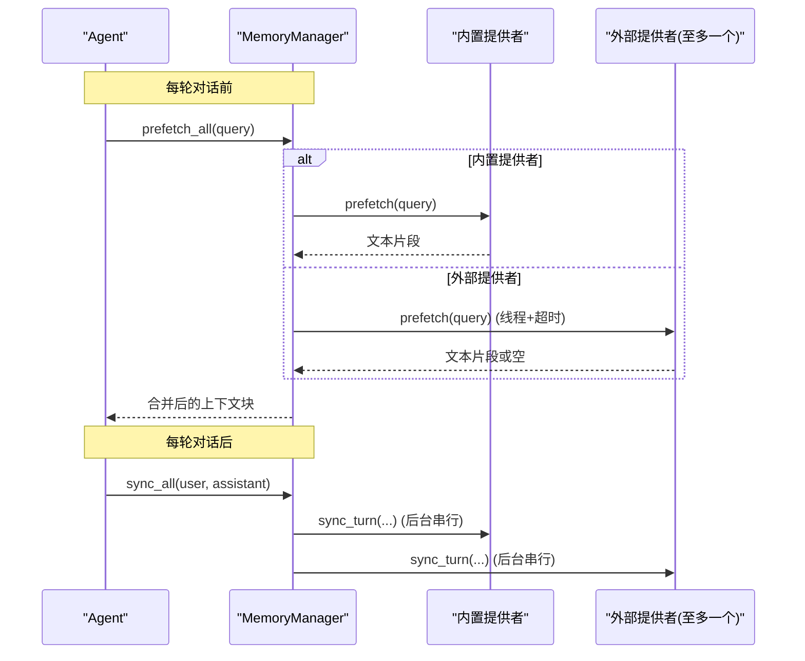
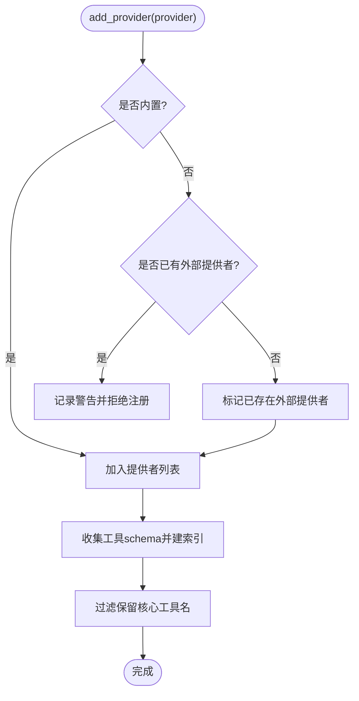
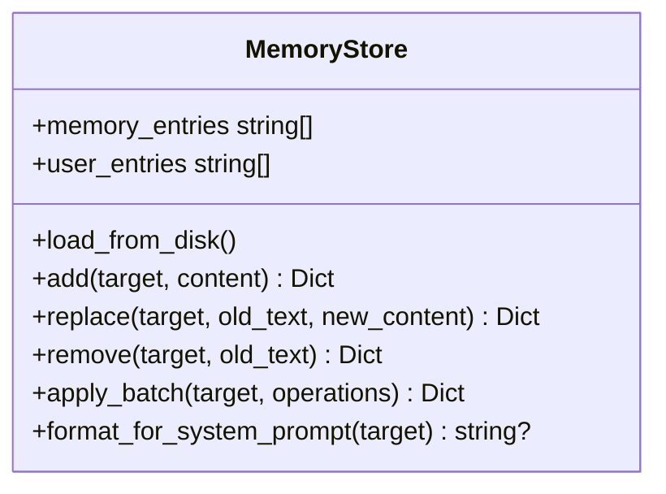
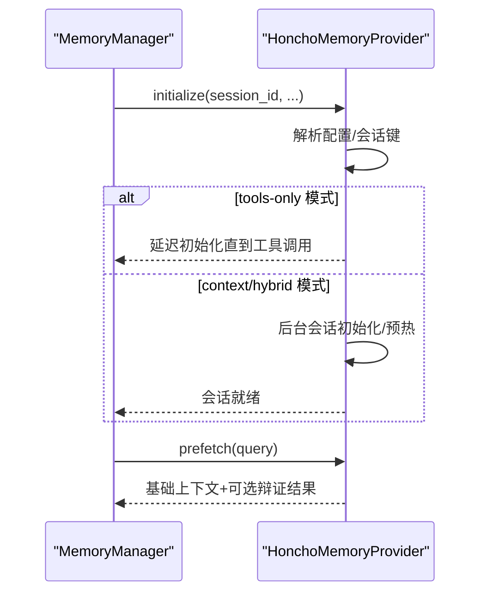
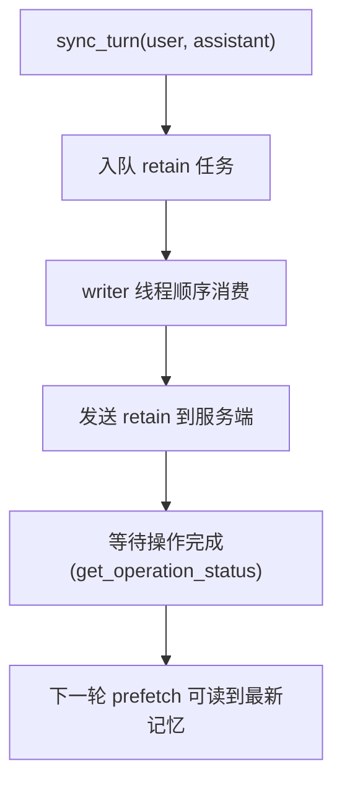
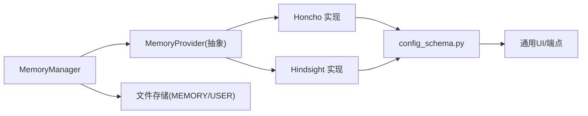

# 记忆存储机制

<cite>
**本文引用的文件**
- [agent/memory_manager.py](file://agent/memory_manager.py)
- [agent/memory_provider.py](file://agent/memory_provider.py)
- [plugins/memory/honcho/__init__.py](file://plugins/memory/honcho/__init__.py)
- [plugins/memory/hindsight/__init__.py](file://plugins/memory/hindsight/__init__.py)
- [tools/memory_tool.py](file://tools/memory_tool.py)
- [plugins/memory/config_schema.py](file://plugins/memory/config_schema.py)
</cite>

## 目录
1. [简介](#简介)
2. [项目结构](#项目结构)
3. [核心组件](#核心组件)
4. [架构总览](#架构总览)
5. [详细组件分析](#详细组件分析)
6. [依赖关系分析](#依赖关系分析)
7. [性能考量](#性能考量)
8. [故障排查指南](#故障排查指南)
9. [结论](#结论)
10. [附录](#附录)

## 简介
本技术文档聚焦 Hermes Agent 的记忆存储机制，围绕 MemoryManager 的核心架构展开，系统阐述提供者注册、工具模式标准化、系统提示构建、内置与外部提供者的管理策略（为何仅允许一个外部提供者以避免工具模式膨胀和冲突），以及记忆数据的持久化存储结构、索引机制、查询优化。同时给出存储后端抽象接口设计，覆盖向量数据库、关系数据库、文件系统等多种方案，并提供配置示例与性能调优建议。

## 项目结构
记忆子系统由“管理器 + 抽象接口 + 具体提供者 + 内置文件存储”组成：
- 管理器：MemoryManager，统一编排所有记忆提供者，负责注册、工具路由、系统提示拼装、预取/同步生命周期。
- 抽象接口：MemoryProvider，定义初始化、预取、同步、工具暴露、会话钩子等标准契约。
- 外部提供者：Honcho、Hindsight 等插件实现，提供跨会话语义检索、知识图谱、推理问答等能力。
- 内置存储：基于文件的 MEMORY.md / USER.md，提供轻量、可审计的持久化记忆。

**图示来源**
- [agent/memory_manager.py:364-470](file://agent/memory_manager.py#L364-L470)
- [agent/memory_provider.py:81-190](file://agent/memory_provider.py#L81-L190)
- [plugins/memory/honcho/__init__.py:237-335](file://plugins/memory/honcho/__init__.py#L237-L335)
- [plugins/memory/hindsight/__init__.py:681-753](file://plugins/memory/hindsight/__init__.py#L681-L753)
- [tools/memory_tool.py:148-240](file://tools/memory_tool.py#L148-L240)

**章节来源**
- [agent/memory_manager.py:1-108](file://agent/memory_manager.py#L1-L108)
- [agent/memory_provider.py:1-32](file://agent/memory_provider.py#L1-L32)

## 核心组件
- MemoryManager：单点集成入口，维护提供者列表、工具名到提供者的映射、后台执行器；限制仅一个外部提供者；提供系统提示构建、预取、同步、工具路由、会话边界处理、关闭流程。
- MemoryProvider：抽象基类，定义 name、is_available、initialize、system_prompt_block、prefetch、queue_prefetch、sync_turn、get_tool_schemas、handle_tool_call、shutdown 及可选钩子（on_turn_start、on_session_end、on_session_switch、on_pre_compress、on_delegation、backup_paths、get_config_schema/save_config）。
- Honcho 提供者：AI 原生用户建模，支持上下文注入与工具两种模式（context/tools/hybrid），提供 profile/search/reasoning/context/conclude 工具，具备会话预热、懒初始化、缓存与节流。
- Hindsight 提供者：长期记忆，知识图谱、实体解析、多策略检索（recall/reflect），支持云端与本地嵌入守护进程，具备异步写入队列、操作状态等待、能力探测与降级。
- 内置文件存储：MEMORY.md / USER.md，按条目分隔符组织，带字符预算、去重、安全扫描、原子写入与并发锁，提供 add/replace/remove/batch 操作。

**章节来源**
- [agent/memory_manager.py:364-848](file://agent/memory_manager.py#L364-L848)
- [agent/memory_provider.py:81-358](file://agent/memory_provider.py#L81-L358)
- [plugins/memory/honcho/__init__.py:237-335](file://plugins/memory/honcho/__init__.py#L237-L335)
- [plugins/memory/hindsight/__init__.py:681-800](file://plugins/memory/hindsight/__init__.py#L681-L800)
- [tools/memory_tool.py:148-240](file://tools/memory_tool.py#L148-L240)

## 架构总览
MemoryManager 作为协调层，屏蔽不同提供者的差异，对外暴露统一的工具集与记忆访问方式。其关键职责包括：
- 提供者注册：接受内置提供者（name="builtin"）与最多一个外部提供者；拒绝重复外部提供者并记录警告。
- 工具模式标准化：将 OpenAI function tool 或裸函数 schema 统一为裸函数 schema，避免嵌套导致名称缺失被严格模型拒绝。
- 系统提示构建：聚合各提供者的 system_prompt_block，形成静态提示片段。
- 预取与同步：对内置提供者直接调用；对外部提供者使用线程隔离与超时控制，保证慢/卡住的提供者不阻塞主流程。
- 工具路由：根据工具名分发到对应提供者，忽略保留核心工具名，避免冲突。
- 会话边界：在 session 切换时先结束旧会话提取，再切换到新会话，确保顺序一致。
- 关闭流程：有序 drain 后台任务后关闭提供者，避免进程退出阻塞。

**图示来源**
- [agent/memory_manager.py:525-695](file://agent/memory_manager.py#L525-L695)
- [agent/memory_provider.py:132-170](file://agent/memory_provider.py#L132-L170)

**章节来源**
- [agent/memory_manager.py:364-848](file://agent/memory_manager.py#L364-L848)

## 详细组件分析

### MemoryManager 核心架构
- 提供者注册与限制
  - 始终接受内置提供者；仅允许一个外部提供者，重复注册会记录警告并拒绝。
  - 注册时收集工具 schema，建立工具名到提供者的映射，过滤保留核心工具名，避免冲突。
- 工具模式标准化
  - normalize_tool_schema 将已包装的 OpenAI tool 解包为裸函数 schema，并校验 name 字段存在且为字符串，否则跳过该工具，防止污染请求。
- 系统提示构建
  - build_system_prompt 聚合各提供者的 system_prompt_block，拼接为空串则无贡献。
- 预取与同步
  - prefetch_all 清理技能脚手架文本，遍历提供者获取上下文；外部提供者通过独立线程运行并设置超时，失败不阻断其他提供者。
  - sync_all 将完成的一轮对话写入所有提供者，使用单工作线程序列化执行，避免网络/守护进程阻塞主循环。
- 工具路由
  - get_all_tool_schemas 收集所有提供者的工具 schema，去重并过滤保留核心工具名；handle_tool_call 将工具调用路由到对应提供者。
- 会话边界与压缩钩子
  - commit_session_boundary_async 先 on_session_end 再 on_session_switch，保证顺序；on_pre_compress 聚合提供者提取内容用于压缩摘要。
- 关闭流程
  - shutdown_all 先 drain 后台执行器（有限等待），再逆序关闭提供者，避免僵尸线程阻塞解释器退出。

**图示来源**
- [agent/memory_manager.py:404-470](file://agent/memory_manager.py#L404-L470)

**章节来源**
- [agent/memory_manager.py:404-848](file://agent/memory_manager.py#L404-L848)

### 内置提供者（文件存储）
- 存储结构
  - 两个文件：MEMORY.md（代理个人笔记）、USER.md（关于用户的偏好/风格/期望）。
  - 条目以分隔符 “§” 分割，支持多行条目；每个目标有字符预算限制。
- 索引与查询
  - 通过 substring 匹配进行 replace/remove；批量操作 apply_batch 支持原子性验证与最终预算检查。
- 安全与一致性
  - 加载时对进入系统提示的内容进行威胁模式扫描，命中则替换为占位符；读写使用文件锁与原子写入，检测外部漂移并拒绝可能丢失数据的写操作。
- 快照与注入
  - 启动时读取文件生成冻结快照用于系统提示注入；会话内修改立即落盘但不改变快照，保持前缀缓存稳定。

**图示来源**
- [tools/memory_tool.py:148-240](file://tools/memory_tool.py#L148-L240)
- [tools/memory_tool.py:390-670](file://tools/memory_tool.py#L390-L670)

**章节来源**
- [tools/memory_tool.py:148-800](file://tools/memory_tool.py#L148-L800)

### 外部提供者：Honcho
- 模式与工具
  - 支持 context/tools/hybrid 三种召回模式；暴露 honcho_profile、honcho_search、honcho_reasoning、honcho_context、honcho_conclude 工具。
  - system_prompt_block 输出模式头与工具说明；prefetch 在 context/hybrid 模式下返回基础上下文与辩证补充。
- 会话管理与预热
  - 懒初始化会话，首次实质性消息触发预热；支持首回合预算等待与后续异步刷新；具备上下文缓存与节流。
- 配置与备份
  - 从全局/本地配置链加载；save_config 写入 $HERMES_HOME/honcho.json；backup_paths 声明 ~/.honcho 以便备份。

**图示来源**
- [plugins/memory/honcho/__init__.py:343-563](file://plugins/memory/honcho/__init__.py#L343-L563)
- [plugins/memory/honcho/__init__.py:656-745](file://plugins/memory/honcho/__init__.py#L656-L745)

**章节来源**
- [plugins/memory/honcho/__init__.py:237-800](file://plugins/memory/honcho/__init__.py#L237-L800)

### 外部提供者：Hindsight
- 能力与模式
  - 支持云端与本地嵌入守护进程；提供 retain/recall/reflect 工具；支持 observation 优先的 recall_types。
  - 具备 API 版本探测与能力降级（update_mode='append' 支持与否）。
- 写入与读取
  - 单写者模型：retain 入队，writer 线程顺序消费；异步 retain 通过操作状态等待确保读后写可见性。
  - 配置加载优先级：$HERMES_HOME/hindsight/config.json → ~/.hindsight/config.json → 环境变量。
- 守护进程与健康
  - 通过端口健康检查与优雅超时管理嵌入式守护进程；支持 idle_timeout 与 LLM 配置写入 profile env。

**图示来源**
- [plugins/memory/hindsight/__init__.py:681-800](file://plugins/memory/hindsight/__init__.py#L681-L800)
- [plugins/memory/hindsight/__init__.py:255-294](file://plugins/memory/hindsight/__init__.py#L255-L294)
- [plugins/memory/hindsight/__init__.py:361-404](file://plugins/memory/hindsight/__init__.py#L361-L404)

**章节来源**
- [plugins/memory/hindsight/__init__.py:1-800](file://plugins/memory/hindsight/__init__.py#L1-L800)

### 工具模式标准化与注入
- 标准化：normalize_tool_schema 解包 OpenAI tool 包装，确保顶层 name 存在且为字符串；无效 schema 被跳过并记录警告。
- 注入：inject_memory_provider_tools 将外部记忆提供者的工具 schema 注入到 agent 的工具表面，遵循 enabled/disabled toolsets 与 memory 工具存在性判断。

**章节来源**
- [agent/memory_manager.py:50-157](file://agent/memory_manager.py#L50-L157)

## 依赖关系分析
- MemoryManager 依赖 MemoryProvider 抽象接口；具体实现为 Honcho、Hindsight 与内置文件存储。
- 工具路由依赖工具名唯一性与保留核心工具名集合，避免冲突。
- 外部提供者依赖各自 SDK/客户端与配置链；Hindsight 还依赖嵌入式守护进程与事件循环。
- 配置文件与 UI 渲染通过 config_schema 模块声明式描述，支持 flat_json 与 honcho_host_block 存储后端。

**图示来源**
- [plugins/memory/config_schema.py:1-145](file://plugins/memory/config_schema.py#L1-L145)
- [agent/memory_manager.py:364-848](file://agent/memory_manager.py#L364-L848)

**章节来源**
- [plugins/memory/config_schema.py:1-145](file://plugins/memory/config_schema.py#L1-L145)
- [agent/memory_manager.py:364-848](file://agent/memory_manager.py#L364-L848)

## 性能考量
- 外部提供者预取超时：默认约 8 秒，避免慢/卡住的外部提供者阻塞主循环；可通过 external_prefetch_timeout 调整。
- 后台串行写入：单工作线程序列化 provider 写入，保证 turn N 先于 turn N+1 落地，避免竞态。
- 关闭 drain 超时：默认约 5 秒，保障进程退出时尽可能完成收尾任务，超出则放弃并记录。
- 文件存储预算：MEMORY/USER 分别有字符预算，超限触发整合提示；批量操作一次性验证最终预算，减少往返。
- 异步 retain 可见性：Hindsight 在 prefetch 前等待服务端 retain 操作完成，避免读后写竞争。
- 缓存与节流：Honcho 的基础上下文与辩证结果缓存，按 cadence 刷新；首回合预算等待提升响应速度。

[本节为通用性能指导，无需特定文件引用]

## 故障排查指南
- 外部提供者预取超时
  - 现象：prefetch 超时日志，跳过该提供者直至返回。
  - 排查：检查网络/守护进程健康；适当增大 external_prefetch_timeout。
- 工具名冲突
  - 现象：注册时警告“工具名冲突”，忽略重复注册。
  - 排查：重命名提供者的工具，避免与保留核心工具名冲突。
- 文件存储漂移
  - 现象：replace/remove 报错“外部漂移”，拒绝写入并生成 .bak。
  - 排查：手动整合 .bak 内容，恢复干净文件后再重试。
- 文件不可读
  - 现象：read failed 错误，拒绝写入以防覆盖。
  - 排查：检查权限/锁定/编码问题，稍后重试。
- Hindsight 守护进程健康
  - 现象：导入或启动失败，报告 ImportError。
  - 排查：确认依赖安装与环境变量；调整 port_health_grace_timeout。

**章节来源**
- [agent/memory_manager.py:547-595](file://agent/memory_manager.py#L547-L595)
- [tools/memory_tool.py:91-145](file://tools/memory_tool.py#L91-L145)
- [plugins/memory/hindsight/__init__.py:130-152](file://plugins/memory/hindsight/__init__.py#L130-L152)

## 结论
Hermes Agent 的记忆存储机制通过 MemoryManager 统一管理多个记忆提供者，严格限制仅一个外部提供者以避免工具模式膨胀与冲突。内置文件存储提供轻量、可审计的持久化能力；外部提供者如 Honcho 与 Hindsight 提供强大的跨会话语义检索与推理能力。通过工具模式标准化、系统提示构建、预取/同步生命周期、会话边界处理与关闭流程，系统在可用性、一致性与性能之间取得平衡。结合配置声明与性能调优建议，可在不同场景下灵活选择与优化存储后端。

[本节为总结性内容，无需特定文件引用]

## 附录

### 存储后端抽象接口设计
- 抽象接口：MemoryProvider 定义了初始化、预取、同步、工具暴露、会话钩子等标准方法，便于扩展新的存储后端（向量数据库、关系数据库、文件系统等）。
- 配置声明：ProviderConfigSchema 与 ProviderField 提供声明式配置字段，支持 secret、select、bool、number、json 等类型，并由通用 UI/端点渲染与读写。
- 存储后端选择：
  - 向量数据库：适合大规模语义检索，需实现 prefetch/sync 与工具（如 search/reasoning）。
  - 关系数据库：适合结构化记忆与复杂查询，需实现条目增删改查与索引优化。
  - 文件系统：轻量、易审计，适合小中规模场景，注意并发锁与预算控制。

**章节来源**
- [agent/memory_provider.py:81-358](file://agent/memory_provider.py#L81-L358)
- [plugins/memory/config_schema.py:1-145](file://plugins/memory/config_schema.py#L1-L145)

### 存储配置示例
- Honcho
  - 配置路径：$HERMES_HOME/honcho.json（profile-scoped），或 ~/.honcho/config.json（legacy global）。
  - 关键字段：api_key、baseUrl、recall_mode、injection_frequency、context_cadence、dialectic_cadence、reasoning_level_cap 等。
  - 备份路径：~/.honcho（通过 backup_paths 声明）。
- Hindsight
  - 配置路径：$HERMES_HOME/hindsight/config.json（profile-scoped），或 ~/.hindsight/config.json（legacy shared）。
  - 环境变量：HINDSIGHT_API_KEY、HINDSIGHT_BANK_ID、HINDSIGHT_BUDGET、HINDSIGHT_TIMEOUT、HINDSIGHT_IDLE_TIMEOUT、HINDSIGHT_RETAIN_TAGS 等。
  - 守护进程：idle_timeout、port_health_grace_timeout、LLM 配置写入 profile env。

**章节来源**
- [plugins/memory/honcho/__init__.py:315-335](file://plugins/memory/honcho/__init__.py#L315-L335)
- [plugins/memory/hindsight/__init__.py:361-404](file://plugins/memory/hindsight/__init__.py#L361-L404)

### 性能调优建议
- 外部提供者预取：合理设置 external_prefetch_timeout，避免过长影响响应；对慢后端考虑禁用或降级。
- 写入串行化：保持单工作线程序列化写入，确保顺序一致；必要时调整 flush_pending 超时。
- 文件存储预算：根据场景调整 MEMORY/USER 字符预算；使用批量操作减少往返与整合失败次数。
- Hindsight 异步 retain：启用 _prefetch_waits_for_retain 确保读后写可见；调整 _RETAIN_OP_POLL_INTERVAL_S 平衡开销与时效。
- Honcho 预热：首回合预算等待与后续异步刷新结合，提升冷启动体验；按需开启 query rewrite 与 dialectic depth。

[本节为通用性能指导，无需特定文件引用]