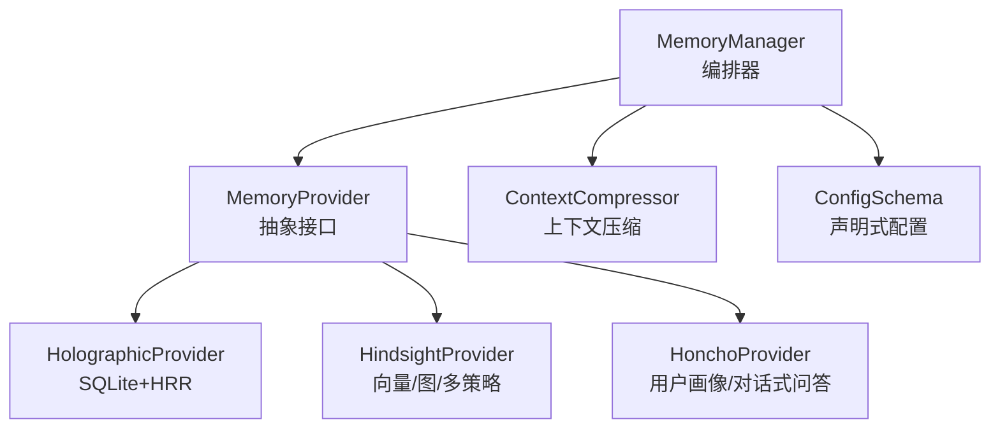
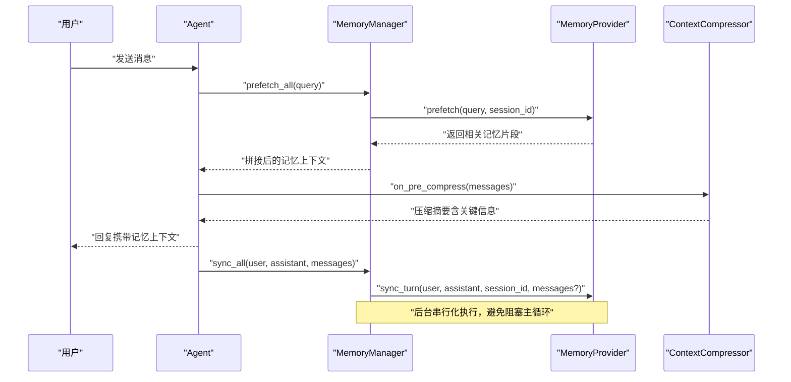
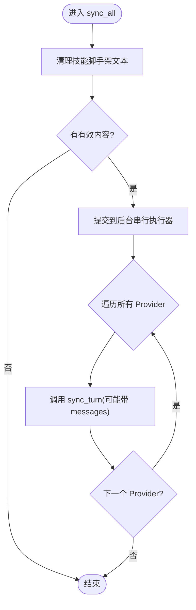
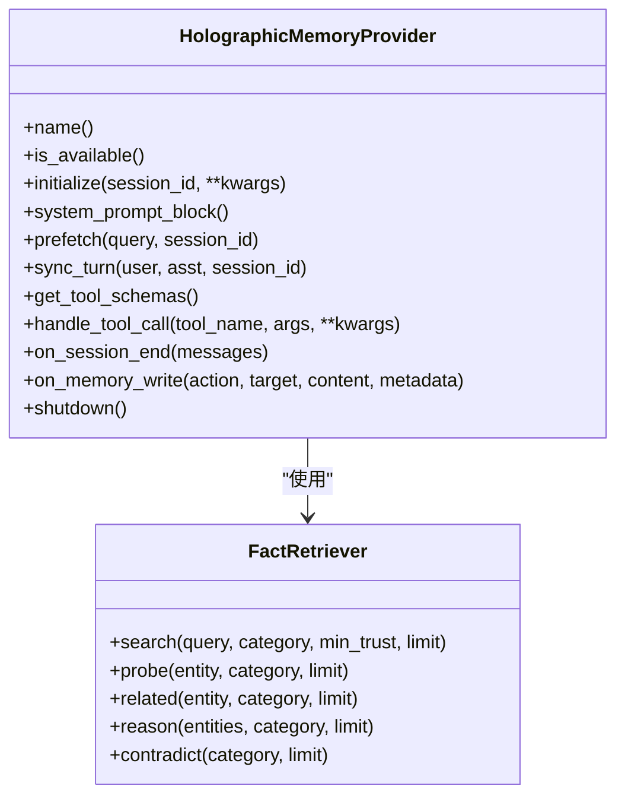
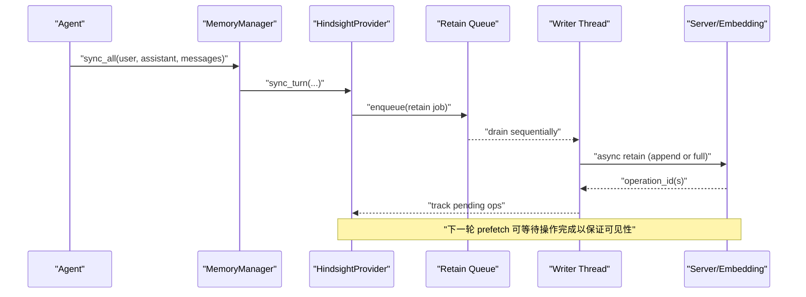
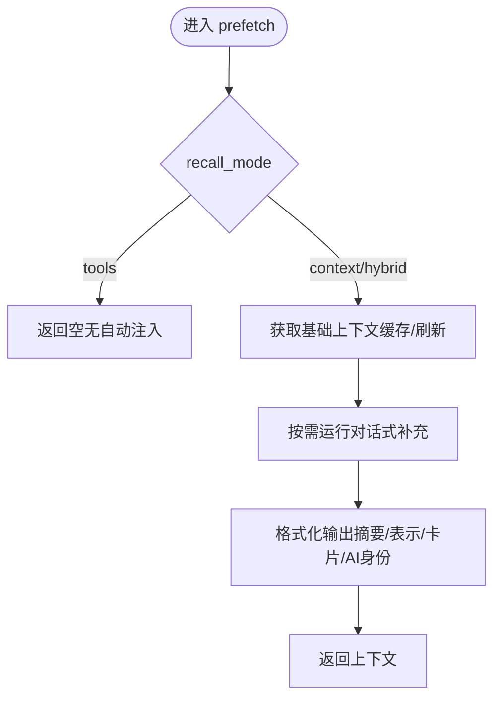
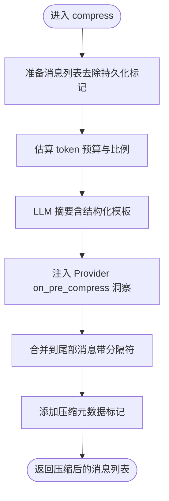
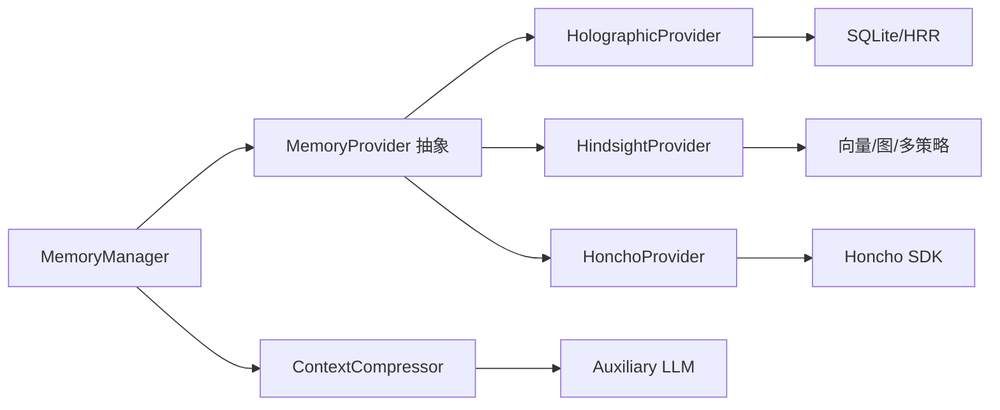

# 记忆管理系统

<cite>
**本文引用的文件**
- [agent/memory_manager.py](file://agent/memory_manager.py)
- [agent/memory_provider.py](file://agent/memory_provider.py)
- [plugins/memory/holographic/__init__.py](file://plugins/memory/holographic/__init__.py)
- [plugins/memory/hindsight/__init__.py](file://plugins/memory/hindsight/__init__.py)
- [plugins/memory/honcho/__init__.py](file://plugins/memory/honcho/__init__.py)
- [plugins/memory/config_schema.py](file://plugins/memory/config_schema.py)
- [agent/context_compressor.py](file://agent/context_compressor.py)
</cite>

## 目录
1. [简介](#简介)
2. [项目结构](#项目结构)
3. [核心组件](#核心组件)
4. [架构总览](#架构总览)
5. [详细组件分析](#详细组件分析)
6. [依赖关系分析](#依赖关系分析)
7. [性能考量](#性能考量)
8. [故障排查指南](#故障排查指南)
9. [结论](#结论)
10. [附录](#附录)

## 简介
本技术文档聚焦 Hermes Agent 的记忆管理系统，围绕以下目标展开：
- 记忆的存储结构与检索算法
- 生命周期管理（初始化、会话切换、压缩前钩子、关闭）
- 上下文压缩机制（消息摘要、信息提取、关键信息保留策略）
- 用户画像构建、偏好学习、跨会话知识迁移
- 记忆提供者接口设计（支持多种后端：向量数据库、关系数据库、文件系统）
- 记忆优化最佳实践（存储策略选择、查询性能调优、内存使用优化）

Hermes 通过统一的 MemoryManager 编排多个 MemoryProvider，每个 Provider 实现一致的接口以对接不同后端。系统提供预取（prefetch）、同步写入（sync_turn）、工具暴露与调度、后台任务隔离等能力，确保在长对话中维持稳定、可伸缩且低延迟的记忆体验。

## 项目结构
记忆相关代码主要分布在 agent 层与 plugins/memory 插件层：
- agent 层
  - memory_manager.py：统一编排器，负责注册 Provider、组装系统提示、预取/同步、工具注入、后台执行与超时控制
  - memory_provider.py：抽象基类，定义 Provider 生命周期与可选钩子
  - context_compressor.py：上下文压缩器，负责消息摘要、历史合并、关键信息保留
- plugins/memory 层
  - holographic：结构化事实存储（SQLite + HRR 检索），面向实体解析与组合推理
  - hindsight：长期记忆（向量/图/多策略检索），支持云端与本地嵌入模式
  - honcho：AI 原生用户建模（对话式问答、语义搜索、同行卡片、持久结论）
  - config_schema.py：声明式配置元数据，驱动通用 UI 与读写分发

图表来源
- [agent/memory_manager.py:364-800](file://agent/memory_manager.py#L364-L800)
- [agent/memory_provider.py:81-358](file://agent/memory_provider.py#L81-L358)
- [plugins/memory/holographic/__init__.py:113-267](file://plugins/memory/holographic/__init__.py#L113-L267)
- [plugins/memory/hindsight/__init__.py:681-800](file://plugins/memory/hindsight/__init__.py#L681-L800)
- [plugins/memory/honcho/__init__.py:237-336](file://plugins/memory/honcho/__init__.py#L237-L336)
- [plugins/memory/config_schema.py:94-145](file://plugins/memory/config_schema.py#L94-L145)
- [agent/context_compressor.py:1-200](file://agent/context_compressor.py#L1-L200)

章节来源
- [agent/memory_manager.py:1-800](file://agent/memory_manager.py#L1-L800)
- [agent/memory_provider.py:1-358](file://agent/memory_provider.py#L1-L358)
- [plugins/memory/holographic/__init__.py:1-463](file://plugins/memory/holographic/__init__.py#L1-L463)
- [plugins/memory/hindsight/__init__.py:1-800](file://plugins/memory/hindsight/__init__.py#L1-L800)
- [plugins/memory/honcho/__init__.py:1-336](file://plugins/memory/honcho/__init__.py#L1-L336)
- [plugins/memory/config_schema.py:1-145](file://plugins/memory/config_schema.py#L1-L145)
- [agent/context_compressor.py:1-200](file://agent/context_compressor.py#L1-L200)

## 核心组件
- MemoryManager：单点集成入口，负责：
  - 注册 Provider（内置一个，外部最多一个）
  - 构建系统提示块
  - 每轮预取（prefetch_all）与后台队列预取（queue_prefetch_all）
  - 每轮同步写入（sync_all）
  - 暴露 Provider 的工具 schema 并路由调用
  - 后台串行化执行（单工作线程），避免阻塞主循环
  - 外部 Provider 预取超时保护
- MemoryProvider：抽象接口，定义：
  - 生命周期：is_available、initialize、shutdown
  - 运行时：system_prompt_block、prefetch、queue_prefetch、sync_turn
  - 工具：get_tool_schemas、handle_tool_call
  - 可选钩子：on_turn_start、on_session_end、on_session_switch、on_pre_compress、on_delegation、backup_paths、on_memory_write、get_config_schema/save_config
- ContextCompressor：上下文压缩器，负责：
  - 对历史消息进行摘要与合并
  - 保留关键信息（如任务快照、待解决问题）
  - 为 Provider 提供 on_pre_compress 钩子，以便在压缩前提取洞察
- 各 Provider 实现：
  - Holographic：结构化事实、信任评分、实体解析、HRR 检索；支持自动抽取偏好与决策
  - Hindsight：长期记忆、知识图谱、多策略检索（语义/关键词/图遍历/重排）；支持云端与本地嵌入
  - Honcho：AI 原生用户建模、同行卡片、会话摘要、对话式推理；支持混合/上下文/工具三种召回模式

章节来源
- [agent/memory_manager.py:364-800](file://agent/memory_manager.py#L364-L800)
- [agent/memory_provider.py:81-358](file://agent/memory_provider.py#L81-L358)
- [plugins/memory/holographic/__init__.py:113-267](file://plugins/memory/holographic/__init__.py#L113-L267)
- [plugins/memory/hindsight/__init__.py:681-800](file://plugins/memory/hindsight/__init__.py#L681-L800)
- [plugins/memory/honcho/__init__.py:237-336](file://plugins/memory/honcho/__init__.py#L237-L336)
- [agent/context_compressor.py:1-200](file://agent/context_compressor.py#L1-L200)

## 架构总览
记忆系统采用“管理器 + 提供者”的解耦架构。MemoryManager 屏蔽后端差异，对外暴露统一 API；Provider 专注各自后端的存储、检索与工具实现。上下文压缩器在会话增长时主动压缩历史，并通过 on_pre_compress 将关键洞察注入压缩摘要，保证后续轮次仍可获得重要背景。

图表来源
- [agent/memory_manager.py:525-694](file://agent/memory_manager.py#L525-L694)
- [agent/memory_provider.py:132-170](file://agent/memory_provider.py#L132-L170)
- [agent/context_compressor.py:1-200](file://agent/context_compressor.py#L1-L200)

## 详细组件分析

### MemoryManager：编排与生命周期
- 注册与限制：仅允许一个外部 Provider，防止工具 schema 膨胀与冲突
- 系统提示：聚合各 Provider 的静态提示块
- 预取流程：
  - 过滤技能脚手架文本，避免污染记忆
  - 外部 Provider 预取使用独立线程与超时保护，避免阻塞
  - 结果按 Provider 顺序拼接，失败不阻断其他 Provider
- 同步写入：
  - 后台单工作线程串行化，保证 turn N 先于 turn N+1 落地
  - 兼容带 messages 参数的 Provider，便于更丰富的上下文
- 工具注入：
  - 收集 Provider 的工具 schema，去重并跳过核心保留工具名
  - 根据 toolset 配置决定是否暴露 memory 工具
- 后台任务：
  - 使用守护线程池，避免进程退出时被阻塞
  - flush_pending 用于测试或会话边界等待任务完成

图表来源
- [agent/memory_manager.py:638-694](file://agent/memory_manager.py#L638-L694)

章节来源
- [agent/memory_manager.py:1-800](file://agent/memory_manager.py#L1-L800)

### MemoryProvider：接口与钩子
- 必需方法：is_available、initialize、get_tool_schemas
- 可选方法：prefetch、queue_prefetch、sync_turn、handle_tool_call、shutdown
- 生命周期钩子：
  - on_turn_start：每轮开始时的 tick
  - on_session_end：会话结束时提取总结
  - on_session_switch：会话 ID 切换时更新状态
  - on_pre_compress：压缩前提取洞察，供压缩摘要保留
  - on_delegation：父代理观察子代理任务结果
  - backup_paths：备份额外磁盘路径
  - on_memory_write：镜像内置记忆写入
  - get_config_schema/save_config：声明式配置与保存

章节来源
- [agent/memory_provider.py:81-358](file://agent/memory_provider.py#L81-L358)

### HolographicProvider：结构化事实与 HRR 检索
- 存储：SQLite 事实表，支持类别、标签、信任分数
- 检索：FactRetriever 支持 search/probe/related/reason/contradict/list
- 工具：fact_store、fact_feedback，支持增删改查与反馈训练
- 自动抽取：on_session_end 可按正则从对话中提取偏好与决策，写入事实库
- 系统提示：显示事实数量与使用说明

图表来源
- [plugins/memory/holographic/__init__.py:113-267](file://plugins/memory/holographic/__init__.py#L113-L267)

章节来源
- [plugins/memory/holographic/__init__.py:1-463](file://plugins/memory/holographic/__init__.py#L1-L463)

### HindsightProvider：长期记忆与多策略检索
- 模式：云端 API 或本地嵌入（sentence_transformers）
- 配置：支持 profile-scoped 与 legacy 路径，环境变量覆盖
- 能力：retain/recall/reflect 工具，多策略检索（语义/关键词/图遍历/重排）
- 并发与健壮性：
  - 专用事件循环线程处理异步调用
  - 单写者模型（retain 队列 + writer 线程）
  - 服务端异步 retain 操作的状态轮询，保障读后一致
  - 健康检查与优雅降级（导入失败视为不可用）
- 压缩集成：on_pre_compress 可在压缩前提取洞察

图表来源
- [plugins/memory/hindsight/__init__.py:681-800](file://plugins/memory/hindsight/__init__.py#L681-L800)

章节来源
- [plugins/memory/hindsight/__init__.py:1-800](file://plugins/memory/hindsight/__init__.py#L1-L800)

### HonchoProvider：用户画像与跨会话知识迁移
- 召回模式：context（自动注入）、tools（显式工具）、hybrid（两者结合）
- 能力：
  - 同行卡片（card）：简短稳定的事实集合
  - 语义搜索（search）：跨会话原始消息片段
  - 对话式推理（reasoning）：综合回答，可调深度
  - 会话快照（context）：摘要 + 表示 + 卡片 + 最近消息
  - 持久结论（conclude）：长期结论，支撑画像演进
- 首轮预热：首次基础上下文获取可等待有限时间，提升首条响应质量
- 压缩集成：on_pre_compress 可用于在压缩前提取洞察

图表来源
- [plugins/memory/honcho/__init__.py:699-800](file://plugins/memory/honcho/__init__.py#L699-L800)

章节来源
- [plugins/memory/honcho/__init__.py:1-336](file://plugins/memory/honcho/__init__.py#L1-L336)

### 上下文压缩机制
- 目标：在长对话中保持上下文窗口可用，同时保留关键信息
- 策略：
  - 对中间历史进行摘要，保护头部与尾部
  - 结构化模板包含“已解决/待解决问题”、“历史任务快照”等
  - 工具输出在 LLM 摘要前进行剪枝，降低噪声
  - 预算按比例缩放，避免过度压缩
- Provider 集成：
  - on_pre_compress：Provider 可提取洞察并返回文本，压缩器将其纳入摘要提示
  - 压缩标记与元数据用于前端区分与过滤
- 关键信息保留：
  - 明确指示“最新用户消息是唯一行动源”，避免误恢复历史任务
  - 持久记忆（MEMORY.md/USER.md）始终权威，不被压缩说明削弱

图表来源
- [agent/context_compressor.py:1-200](file://agent/context_compressor.py#L1-L200)

章节来源
- [agent/context_compressor.py:1-200](file://agent/context_compressor.py#L1-L200)

## 依赖关系分析
- MemoryManager 依赖 MemoryProvider 抽象，具体实现由插件提供
- 各 Provider 依赖各自的存储后端：
  - Holographic：SQLite + HRR（numpy 可选）
  - Hindsight：云端 API 或本地 sentence_transformers
  - Honcho：SDK 客户端与会话管理器
- 上下文压缩器依赖辅助模型（廉价/快速）进行摘要
- 配置系统通过 config_schema.py 声明式描述 Provider 配置字段，驱动通用 UI 与读写

图表来源
- [agent/memory_manager.py:364-800](file://agent/memory_manager.py#L364-L800)
- [agent/memory_provider.py:81-358](file://agent/memory_provider.py#L81-L358)
- [plugins/memory/holographic/__init__.py:113-267](file://plugins/memory/holographic/__init__.py#L113-L267)
- [plugins/memory/hindsight/__init__.py:681-800](file://plugins/memory/hindsight/__init__.py#L681-L800)
- [plugins/memory/honcho/__init__.py:237-336](file://plugins/memory/honcho/__init__.py#L237-L336)
- [agent/context_compressor.py:1-200](file://agent/context_compressor.py#L1-L200)

章节来源
- [agent/memory_manager.py:364-800](file://agent/memory_manager.py#L364-L800)
- [agent/memory_provider.py:81-358](file://agent/memory_provider.py#L81-L358)
- [plugins/memory/holographic/__init__.py:113-267](file://plugins/memory/holographic/__init__.py#L113-L267)
- [plugins/memory/hindsight/__init__.py:681-800](file://plugins/memory/hindsight/__init__.py#L681-L800)
- [plugins/memory/honcho/__init__.py:237-336](file://plugins/memory/honcho/__init__.py#L237-L336)
- [agent/context_compressor.py:1-200](file://agent/context_compressor.py#L1-L200)

## 性能考量
- 预取与同步分离：
  - prefetch_all 对外部 Provider 使用独立线程与超时，避免阻塞主循环
  - sync_all 使用后台单工作线程串行化，保证顺序且不阻塞
- 工具 schema 规范化：
  - 避免重复包装导致 name 缺失，防止严格网关拒绝请求
- 压缩预算与剪枝：
  - 工具输出在摘要前剪枝，减少噪声与 token 消耗
  - 预算按比例缩放，平衡摘要质量与成本
- Provider 特定优化：
  - Hindsight：专用事件循环与单写者模型，减少资源泄漏与竞争
  - Honcho：首轮基础上下文有限等待，提升首条响应质量
  - Holographic：SQLite 本地存储，HRR 检索高效；信任评分与反馈训练提升相关性

[本节提供一般性指导，无需特定文件分析]

## 故障排查指南
- 外部 Provider 预取超时：
  - 现象：某 Provider 预取耗时过长被跳过
  - 处理：检查网络/服务健康，调整 external_prefetch_timeout
- 工具 schema 冲突：
  - 现象：Provider 工具名与核心工具冲突或被重复注册
  - 处理：重命名 Provider 工具，确保唯一性
- 压缩失败或配额错误：
  - 现象：辅助模型认证/配额错误导致压缩失败
  - 处理：检查凭证与配额，必要时降级为不压缩
- Provider 初始化失败：
  - 现象：Hindsight/Honcho 导入或认证失败
  - 处理：检查依赖安装、凭证与环境变量，查看日志中的警告信息

章节来源
- [agent/memory_manager.py:547-595](file://agent/memory_manager.py#L547-L595)
- [agent/memory_manager.py:430-470](file://agent/memory_manager.py#L430-L470)
- [agent/context_compressor.py:73-94](file://agent/context_compressor.py#L73-L94)
- [plugins/memory/hindsight/__init__.py:130-153](file://plugins/memory/hindsight/__init__.py#L130-L153)
- [plugins/memory/honcho/__init__.py:306-313](file://plugins/memory/honcho/__init__.py#L306-L313)

## 结论
Hermes 的记忆管理系统通过统一的 MemoryManager 与灵活的 MemoryProvider 接口，实现了多后端、可扩展、高性能的记忆能力。上下文压缩机制确保长对话中的关键信息得以保留，而各 Provider 针对自身优势提供了丰富的检索与建模能力。通过声明式配置、后台任务隔离与超时保护，系统在稳定性与可用性方面具备良好表现。建议在生产环境中根据场景选择合适的 Provider 与压缩策略，并结合反馈与监控持续优化。

[本节为总结性内容，无需特定文件分析]

## 附录
- 配置与部署
  - 使用 config_schema.py 声明 Provider 配置字段，驱动通用 UI 与读写
  - 支持 profile-scoped 与 legacy 路径，环境变量覆盖
- 最佳实践
  - 存储策略选择：结构化事实（Holographic）、长期记忆（Hindsight）、用户画像（Honcho）
  - 查询性能调优：合理设置最小信任阈值、限制结果数量、启用缓存
  - 内存使用优化：避免过大的上下文注入，利用压缩与剪枝

[本节为补充信息，无需特定文件分析]