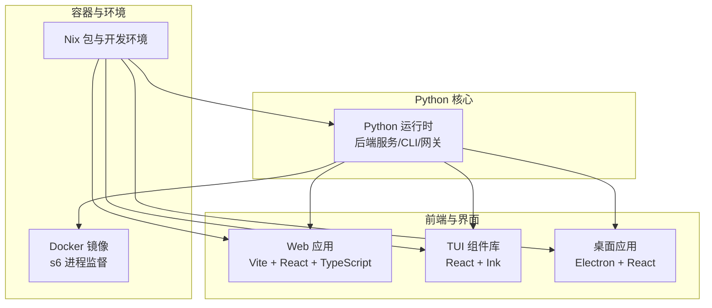
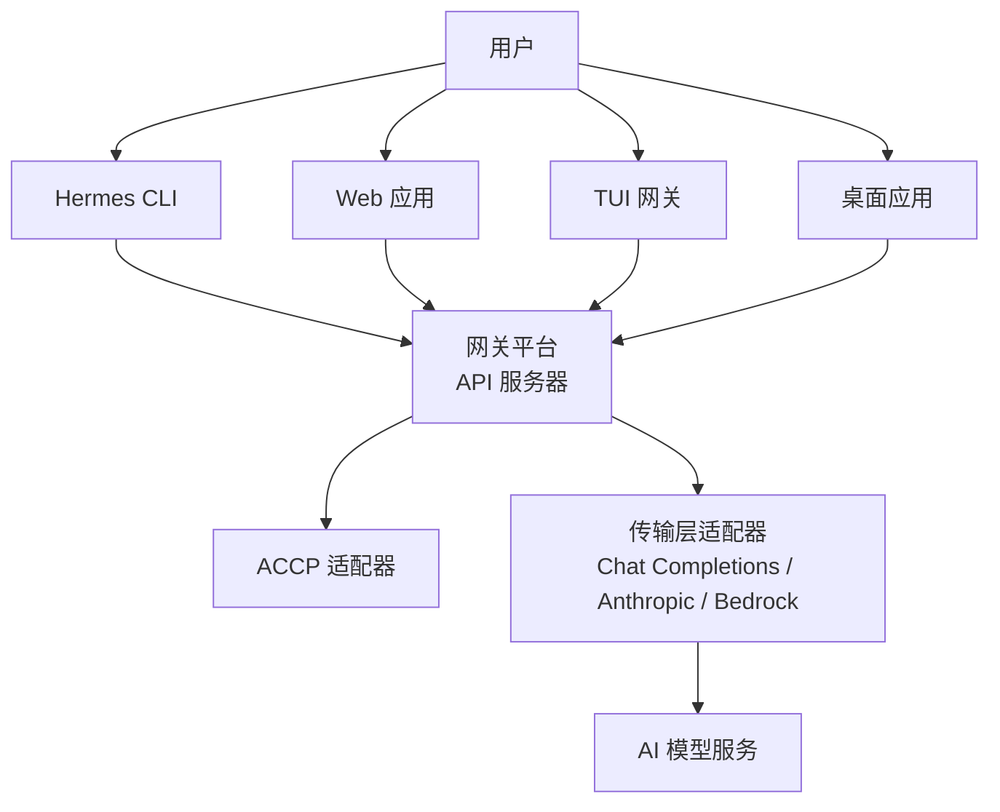
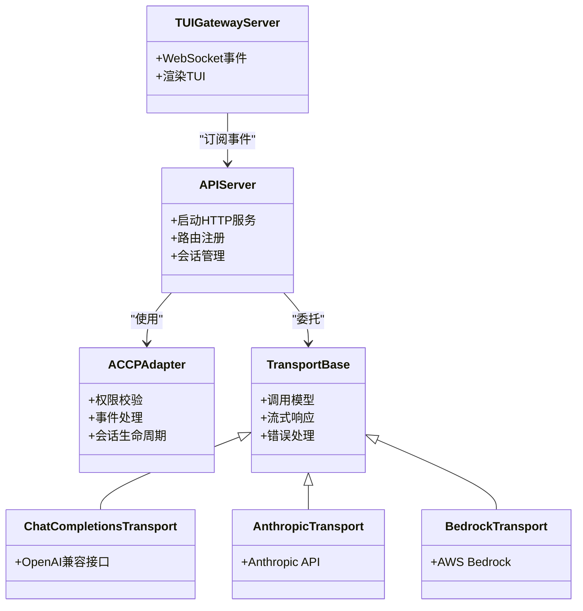
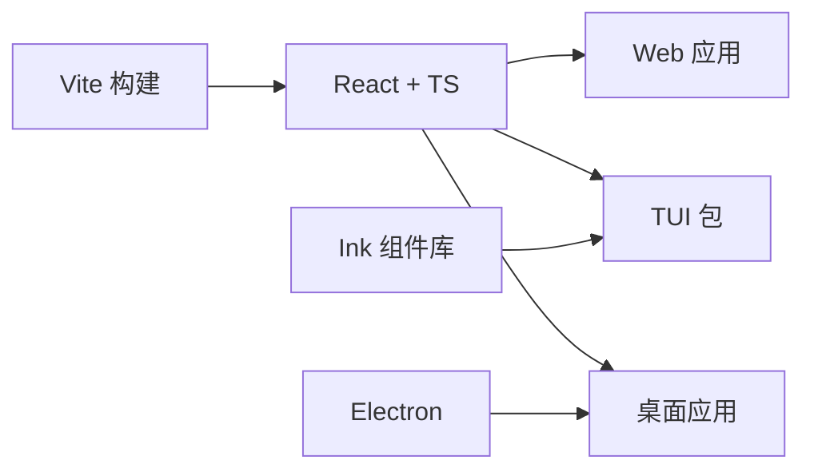
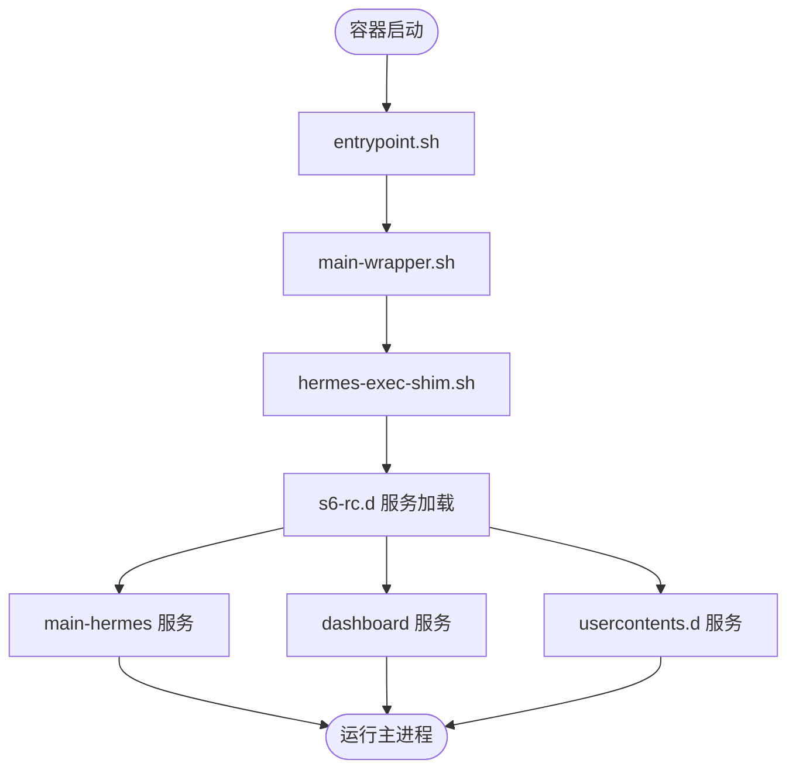
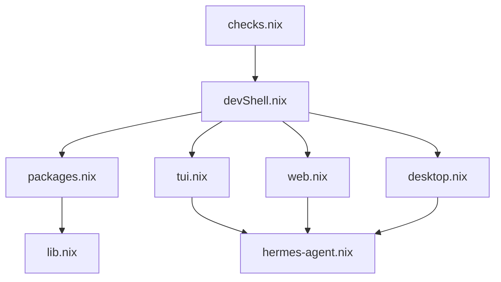
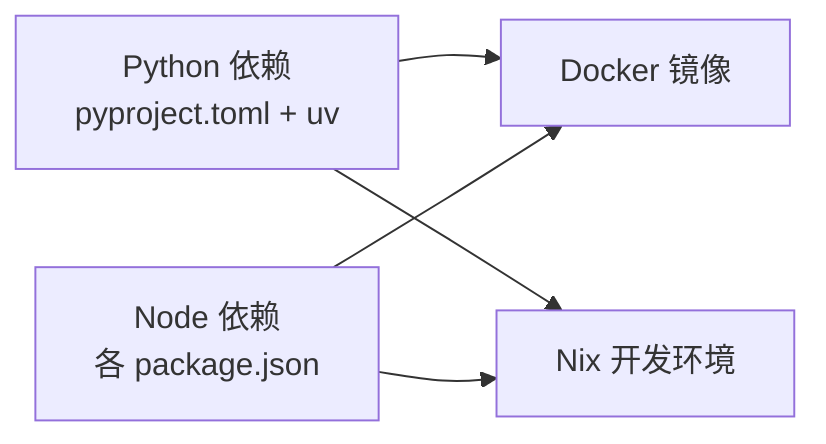

# 技术栈

<cite>
**本文引用的文件**
- [pyproject.toml](file://pyproject.toml)
- [Dockerfile](file://Dockerfile)
- [flake.nix](file://flake.nix)
- [apps/desktop/package.json](file://apps/desktop/package.json)
- [apps/bootstrap-installer/package.json](file://apps/bootstrap-installer/package.json)
- [web/package.json](file://web/package.json)
- [ui-tui/package.json](file://ui-tui/package.json)
- [website/package.json](file://website/package.json)
- [scripts/whatsapp-bridge/package.json](file://scripts/whatsapp-bridge/package.json)
- [hermes_cli/curses_ui.py](file://hermes_cli/curses_ui.py)
- [tui_gateway/server.py](file://tui_gateway/server.py)
- [gateway/platforms/api_server.py](file://gateway/platforms/api_server.py)
- [acp_adapter/server.py](file://acp_adapter/server.py)
- [agent/transports/chat_completions.py](file://agent/transports/chat_completions.py)
- [agent/transports/anthropic.py](file://agent/transports/anthropic.py)
- [agent/transports/bedrock.py](file://agent/transports/bedrock.py)
- [hermes_cli/web_server.py](file://hermes_cli/web_server.py)
- [docker/entrypoint.sh](file://docker/entrypoint.sh)
- [docker/main-wrapper.sh](file://docker/main-wrapper.sh)
- [docker/hermes-exec-shim.sh](file://docker/hermes-exec-shim.sh)
- [docker/s6-rc.d/main-hermes/main-hermes](file://docker/s6-rc.d/main-hermes/main-hermes)
- [docker/s6-rc.d/dashboard/dashboard](file://docker/s6-rc.d/dashboard/dashboard)
- [docker/s6-rc.d/usercontents.d/usercontents.d](file://docker/s6-rc.d/usercontents.d/usercontents.d)
- [docker/cont-init.d/cont-init.d](file://docker/cont-init.d/cont-init.d)
- [docker/stage2-hook.sh](file://docker/stage2-hook.sh)
- [docker/SOUL.md](file://docker/SOUL.md)
- [nix/devShell.nix](file://nix/devShell.nix)
- [nix/python.nix](file://nix/python.nix)
- [nix/packages.nix](file://nix/packages.nix)
- [nix/lib.nix](file://nix/lib.nix)
- [nix/checks.nix](file://nix/checks.nix)
- [nix/tui.nix](file://nix/tui.nix)
- [nix/web.nix](file://nix/web.nix)
- [nix/desktop.nix](file://nix/desktop.nix)
- [nix/hermes-agent.nix](file://nix/hermes-agent.nix)
- [README.md](file://README.md)
</cite>

## 目录
1. [简介](#简介)
2. [项目结构](#项目结构)
3. [核心组件](#核心组件)
4. [架构总览](#架构总览)
5. [详细组件分析](#详细组件分析)
6. [依赖分析](#依赖分析)
7. [性能考虑](#性能考虑)
8. [故障排除指南](#故障排除指南)
9. [结论](#结论)
10. [附录](#附录)

## 简介
本技术栈文档系统梳理 Hermes Agent 的技术选型与实现方式，覆盖 Python 后端、JavaScript/TypeScript 前端、React/TUI 界面、Electron 桌面应用以及容器化与 Nix 开发环境。文档重点说明各技术栈的选择原因、关键依赖与版本约束、开发工具链、兼容性与升级策略，并解释技术选型如何支撑项目的功能需求与性能目标。

## 项目结构
Hermes Agent 采用多语言混合架构：Python 作为核心运行时与业务逻辑载体；JavaScript/TypeScript 构建 Web 界面、TUI 组件与桌面应用；Nix 提供可复现的开发环境与包管理；Docker 实现容器化部署与进程监督（s6）。

图表来源
- [pyproject.toml](file://pyproject.toml)
- [web/package.json](file://web/package.json)
- [ui-tui/package.json](file://ui-tui/package.json)
- [apps/desktop/package.json](file://apps/desktop/package.json)
- [Dockerfile](file://Dockerfile)
- [flake.nix](file://flake.nix)

章节来源
- [pyproject.toml](file://pyproject.toml)
- [web/package.json](file://web/package.json)
- [ui-tui/package.json](file://ui-tui/package.json)
- [apps/desktop/package.json](file://apps/desktop/package.json)
- [Dockerfile](file://Dockerfile)
- [flake.nix](file://flake.nix)

## 核心组件
- Python 后端：提供 AI 模型适配、传输层抽象、网关平台集成、ACCP 适配器、CLI 与 Web 服务、TUI 网关等。
- JavaScript/TypeScript 前端：Web 控制台、TUI 组件库（Ink）、桌面应用（Electron）。
- 容器化与进程监督：Dockerfile、s6-rc.d 服务编排、入口脚本与执行 shim。
- Nix：可复现的开发环境、包集合与检查项。
- 多语言工具链：Vite、ESLint、Prettier、uv、pytest 等。

章节来源
- [pyproject.toml](file://pyproject.toml)
- [web/package.json](file://web/package.json)
- [ui-tui/package.json](file://ui-tui/package.json)
- [apps/desktop/package.json](file://apps/desktop/package.json)
- [Dockerfile](file://Dockerfile)
- [flake.nix](file://flake.nix)

## 架构总览
下图展示从用户交互到 AI 模型调用的端到端流程，涵盖 CLI、Web、TUI、桌面应用与后端服务之间的关系。

图表来源
- [hermes_cli/web_server.py](file://hermes_cli/web_server.py)
- [gateway/platforms/api_server.py](file://gateway/platforms/api_server.py)
- [tui_gateway/server.py](file://tui_gateway/server.py)
- [acp_adapter/server.py](file://acp_adapter/server.py)
- [agent/transports/chat_completions.py](file://agent/transports/chat_completions.py)
- [agent/transports/anthropic.py](file://agent/transports/anthropic.py)
- [agent/transports/bedrock.py](file://agent/transports/bedrock.py)

## 详细组件分析

### Python 后端与运行时
- 运行时与包管理：使用 uv 作为包管理器与虚拟环境工具，支持快速安装与依赖锁定。
- 核心模块：
  - 网关平台：统一接入多种消息平台，提供会话、镜像、流式分发等能力。
  - ACP 适配器：提供访问控制、权限与事件处理。
  - 传输层适配器：封装 OpenAI 兼容接口、Anthropic、AWS Bedrock 等。
  - CLI 与 Web 服务：提供命令行与 Web 管理入口。
  - TUI 网关：通过 WebSocket 将后端事件渲染到终端界面。
- 选择原因：
  - Python 生态成熟、生态库丰富，适合快速迭代与多平台集成。
  - uv 提升安装与依赖解析效率，减少环境差异带来的问题。

图表来源
- [gateway/platforms/api_server.py](file://gateway/platforms/api_server.py)
- [acp_adapter/server.py](file://acp_adapter/server.py)
- [agent/transports/chat_completions.py](file://agent/transports/chat_completions.py)
- [agent/transports/anthropic.py](file://agent/transports/anthropic.py)
- [agent/transports/bedrock.py](file://agent/transports/bedrock.py)
- [tui_gateway/server.py](file://tui_gateway/server.py)

章节来源
- [pyproject.toml](file://pyproject.toml)
- [hermes_cli/web_server.py](file://hermes_cli/web_server.py)
- [gateway/platforms/api_server.py](file://gateway/platforms/api_server.py)
- [acp_adapter/server.py](file://acp_adapter/server.py)
- [agent/transports/chat_completions.py](file://agent/transports/chat_completions.py)
- [agent/transports/anthropic.py](file://agent/transports/anthropic.py)
- [agent/transports/bedrock.py](file://agent/transports/bedrock.py)
- [tui_gateway/server.py](file://tui_gateway/server.py)

### JavaScript/TypeScript 前端与界面
- Web 应用：基于 Vite + React + TypeScript，提供控制台与仪表板。
- TUI 组件库：基于 React + Ink，用于终端内渲染富文本与交互。
- 桌面应用：Electron + React，提供跨平台桌面体验。
- 选择原因：
  - Vite 提供快速热重载与构建优化。
  - React 生态完善，便于组件化与状态管理。
  - Ink 使 TUI 渲染更易维护。
  - Electron 跨平台桌面集成度高。

图表来源
- [web/package.json](file://web/package.json)
- [ui-tui/package.json](file://ui-tui/package.json)
- [apps/desktop/package.json](file://apps/desktop/package.json)

章节来源
- [web/package.json](file://web/package.json)
- [ui-tui/package.json](file://ui-tui/package.json)
- [apps/desktop/package.json](file://apps/desktop/package.json)

### 容器化与进程监督
- Dockerfile：定义基础镜像、工作目录、入口点与执行 shim。
- s6-rc.d：服务编排，包含 main-hermes、dashboard、usercontents.d 等服务单元。
- 入口脚本：entrypoint.sh、main-wrapper.sh、hermes-exec-shim.sh 协同完成初始化与守护。
- 选择原因：
  - s6 提供可靠的进程监督与自动重启。
  - 分层脚本职责清晰，便于调试与扩展。

图表来源
- [docker/entrypoint.sh](file://docker/entrypoint.sh)
- [docker/main-wrapper.sh](file://docker/main-wrapper.sh)
- [docker/hermes-exec-shim.sh](file://docker/hermes-exec-shim.sh)
- [docker/s6-rc.d/main-hermes/main-hermes](file://docker/s6-rc.d/main-hermes/main-hermes)
- [docker/s6-rc.d/dashboard/dashboard](file://docker/s6-rc.d/dashboard/dashboard)
- [docker/s6-rc.d/usercontents.d/usercontents.d](file://docker/s6-rc.d/usercontents.d/usercontents.d)

章节来源
- [Dockerfile](file://Dockerfile)
- [docker/entrypoint.sh](file://docker/entrypoint.sh)
- [docker/main-wrapper.sh](file://docker/main-wrapper.sh)
- [docker/hermes-exec-shim.sh](file://docker/hermes-exec-shim.sh)
- [docker/s6-rc.d/main-hermes/main-hermes](file://docker/s6-rc.d/main-hermes/main-hermes)
- [docker/s6-rc.d/dashboard/dashboard](file://docker/s6-rc.d/dashboard/dashboard)
- [docker/s6-rc.d/usercontents.d/usercontents.d](file://docker/s6-rc.d/usercontents.d/usercontents.d)
- [docker/stage2-hook.sh](file://docker/stage2-hook.sh)
- [docker/SOUL.md](file://docker/SOUL.md)

### Nix 开发环境与包管理
- devShell：提供可复现的开发环境，包含 Python、Node.js、构建工具等。
- packages.nix：集中管理第三方包与工具。
- checks.nix：自动化检查与测试。
- tui.nix/web.nix/desktop.nix：分别针对 TUI、Web、桌面应用的构建与打包。
- 选择原因：
  - Nix 可复现性强，避免“在我机器上能跑”的问题。
  - 模块化组织，便于维护与扩展。

图表来源
- [nix/devShell.nix](file://nix/devShell.nix)
- [nix/packages.nix](file://nix/packages.nix)
- [nix/checks.nix](file://nix/checks.nix)
- [nix/tui.nix](file://nix/tui.nix)
- [nix/web.nix](file://nix/web.nix)
- [nix/desktop.nix](file://nix/desktop.nix)
- [nix/lib.nix](file://nix/lib.nix)
- [nix/hermes-agent.nix](file://nix/hermes-agent.nix)

章节来源
- [flake.nix](file://flake.nix)
- [nix/devShell.nix](file://nix/devShell.nix)
- [nix/packages.nix](file://nix/packages.nix)
- [nix/checks.nix](file://nix/checks.nix)
- [nix/tui.nix](file://nix/tui.nix)
- [nix/web.nix](file://nix/web.nix)
- [nix/desktop.nix](file://nix/desktop.nix)
- [nix/lib.nix](file://nix/lib.nix)
- [nix/hermes-agent.nix](file://nix/hermes-agent.nix)

## 依赖分析
- Python 依赖：通过 pyproject.toml 管理，使用 uv 进行安装与锁定，确保版本一致性。
- JavaScript/TypeScript 依赖：各应用独立维护 package.json，保持前端组件边界清晰。
- 容器与系统：Dockerfile 与 s6-rc.d 保证运行时稳定性；Nix 提供构建期一致性。
- 关键依赖与版本要求（示例性说明，具体以各清单为准）：
  - Python：建议使用较新稳定版本（如 3.11+），以获得更好的性能与生态支持。
  - Node.js：建议使用 LTS 版本，确保前端工具链稳定。
  - uv：用于替代 pip/pip-tools，提升安装与锁定效率。
  - Vite/React：用于快速开发与构建优化。
  - s6：用于进程监督与健康检查。

图表来源
- [pyproject.toml](file://pyproject.toml)
- [web/package.json](file://web/package.json)
- [ui-tui/package.json](file://ui-tui/package.json)
- [apps/desktop/package.json](file://apps/desktop/package.json)
- [Dockerfile](file://Dockerfile)
- [flake.nix](file://flake.nix)

章节来源
- [pyproject.toml](file://pyproject.toml)
- [web/package.json](file://web/package.json)
- [ui-tui/package.json](file://ui-tui/package.json)
- [apps/desktop/package.json](file://apps/desktop/package.json)
- [Dockerfile](file://Dockerfile)
- [flake.nix](file://flake.nix)

## 性能考虑
- Python 层面：
  - 使用异步工具与流式响应处理长连接与大输出，降低内存峰值。
  - 传输层适配器按需选择，避免不必要的网络往返。
- 前端层面：
  - Vite 的快速冷启动与热重载提升开发效率；生产构建启用代码分割与压缩。
  - TUI 使用 Ink 渲染，减少 DOM 操作开销。
- 容器与系统：
  - s6 进程监督保障服务可用性；分层脚本减少启动时间。
  - Nix 提供一致的构建环境，避免因工具链差异导致的性能波动。

## 故障排除指南
- 容器启动失败：
  - 检查 entrypoint.sh、main-wrapper.sh、hermes-exec-shim.sh 是否正确执行。
  - 查看 s6-rc.d 服务状态与日志，确认 main-hermes、dashboard、usercontents.d 是否正常。
- Python 依赖问题：
  - 使用 uv 重新安装依赖，确保锁文件一致。
  - 在 Nix 开发环境中进行隔离测试，排除宿主机污染。
- 前端构建异常：
  - 清理 node_modules 并重新安装依赖。
  - 检查 Vite 配置与 ESLint/Prettier 规则冲突。
- TUI 渲染异常：
  - 确认终端对 Ink 组件的支持情况，必要时降级到纯文本模式。

章节来源
- [docker/entrypoint.sh](file://docker/entrypoint.sh)
- [docker/main-wrapper.sh](file://docker/main-wrapper.sh)
- [docker/hermes-exec-shim.sh](file://docker/hermes-exec-shim.sh)
- [docker/s6-rc.d/main-hermes/main-hermes](file://docker/s6-rc.d/main-hermes/main-hermes)
- [docker/s6-rc.d/dashboard/dashboard](file://docker/s6-rc.d/dashboard/dashboard)
- [docker/s6-rc.d/usercontents.d/usercontents.d](file://docker/s6-rc.d/usercontents.d/usercontents.d)
- [pyproject.toml](file://pyproject.toml)
- [web/package.json](file://web/package.json)
- [ui-tui/package.json](file://ui-tui/package.json)

## 结论
Hermes Agent 的技术栈围绕“Python 核心 + 多前端入口 + Nix 可复现 + Docker/s6 稳定运行”展开。该组合在功能扩展性、开发效率与运行稳定性之间取得平衡，既满足多平台与多形态的用户交互需求，又具备良好的可维护性与可升级性。

## 附录
- 开发工具链概览：
  - Python：uv、pytest、black/isort（由 flake.nix 或项目内配置提供）
  - JavaScript/TypeScript：Vite、ESLint、Prettier、TypeScript
  - 容器与系统：Docker、s6、Nix
- 升级策略建议：
  - Python：遵循语义化版本，先在 Nix 开发环境验证，再逐步推广至容器镜像。
  - Node.js：优先 LTS 版本，前端依赖通过 package.json 锁定，定期安全审计。
  - 容器镜像：以最小变更原则更新基础镜像与 s6 版本，保留兼容性。
  - Nix：同步更新 packages.nix 与 checks.nix，确保构建链路稳定。

章节来源
- [pyproject.toml](file://pyproject.toml)
- [web/package.json](file://web/package.json)
- [ui-tui/package.json](file://ui-tui/package.json)
- [apps/desktop/package.json](file://apps/desktop/package.json)
- [Dockerfile](file://Dockerfile)
- [flake.nix](file://flake.nix)
- [nix/packages.nix](file://nix/packages.nix)
- [nix/checks.nix](file://nix/checks.nix)