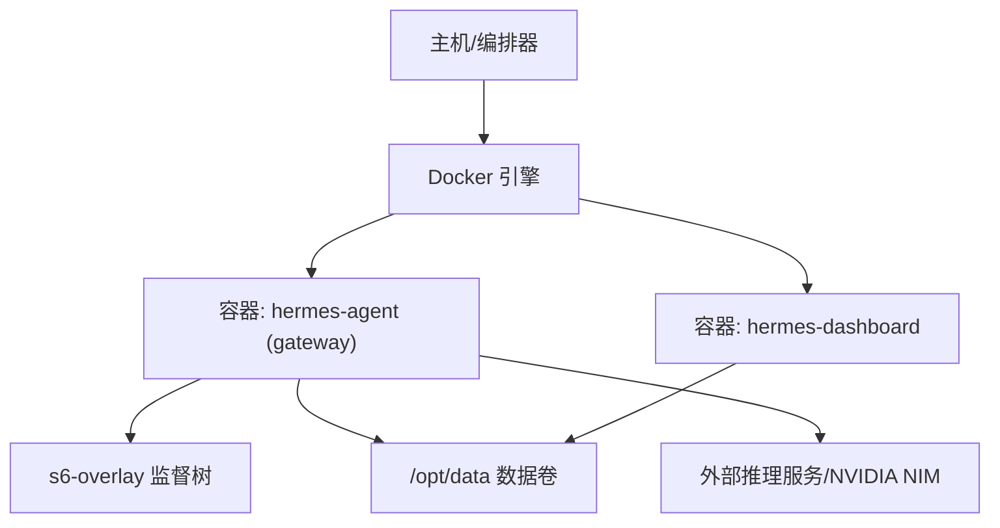
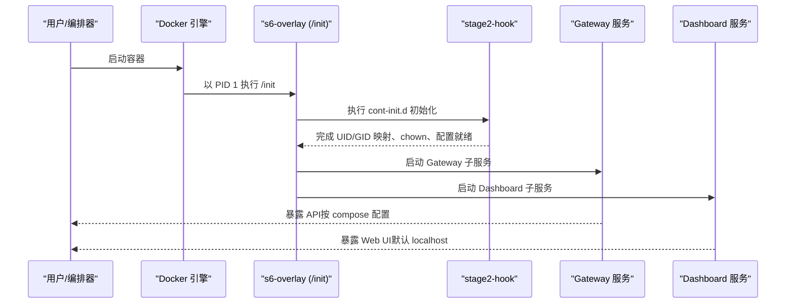
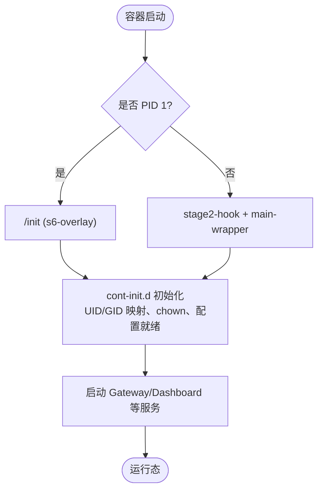
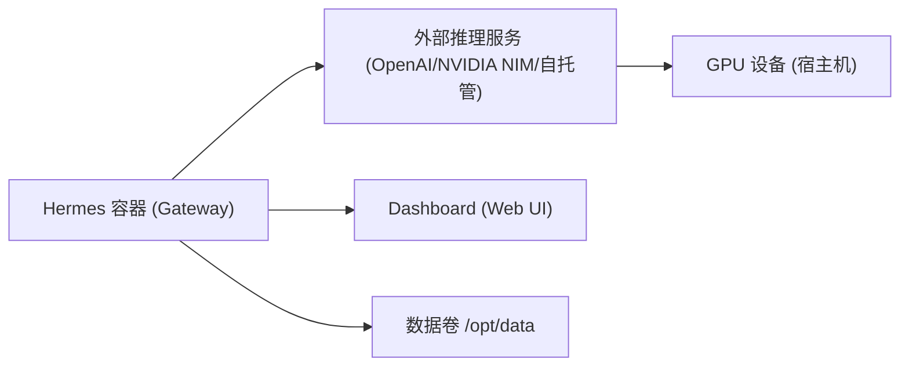

# GPU 集群部署

<cite>
**本文引用的文件**
- [Dockerfile](file://Dockerfile)
- [docker-compose.yml](file://docker-compose.yml)
- [entrypoint.sh](file://docker/entrypoint.sh)
- [auxiliary_client.py](file://agent/auxiliary_client.py)
</cite>

## 目录
1. [简介](#简介)
2. [项目结构](#项目结构)
3. [核心组件](#核心组件)
4. [架构总览](#架构总览)
5. [详细组件分析](#详细组件分析)
6. [依赖关系分析](#依赖关系分析)
7. [性能考虑](#性能考虑)
8. [故障排查指南](#故障排查指南)
9. [结论](#结论)
10. [附录](#附录)

## 简介
本文件面向在 GPU 集群上部署 Hermes Agent 的运维与平台工程师，聚焦容器化运行、GPU 资源接入、分布式推理与模型并行、显存优化、任务调度与负载均衡、性能基准与监控、温度功耗管理、多卡训练与混合精度、量化优化、故障检测与恢复、以及 NVIDIA/AMD/Intel 等主流厂商的兼容性与调优。文档以仓库中的容器构建与编排配置为基础，结合运行时可观测与外部推理集成点，给出可操作的部署与调优指引。

## 项目结构
Hermes Agent 通过 Docker 镜像提供统一运行环境，使用 s6-overlay 进行进程监督，并通过 docker-compose 编排 Gateway 与 Dashboard。镜像内预装 Python/Node 工具链与必要系统库，数据卷挂载到 /opt/data，便于跨重启持久化。

图示来源
- [Dockerfile:52-458](file://Dockerfile#L52-L458)
- [docker-compose.yml:29-77](file://docker-compose.yml#L29-L77)

章节来源
- [Dockerfile:52-458](file://Dockerfile#L52-L458)
- [docker-compose.yml:29-77](file://docker-compose.yml#L29-L77)

## 核心组件
- 容器镜像与启动流程：基于 Debian 基础镜像，安装系统依赖、Python/Node 工具链、s6-overlay；ENTRYPOINT 由 entrypoint-dispatch.sh 接管，PID 1 路径走 /init（s6-overlay），非 PID 1 路径回退到 stage2-hook + main-wrapper。
- 数据与权限：默认非 root 用户 hermes，UID/GID 可通过 HERMES_UID/HERMES_GID 映射；/opt/data 为持久化数据卷。
- 可观测与遥测：镜像支持 OTLP extra，配合 Gateway Health Exporter 可将健康指标导出至外部采集器。
- 外部推理集成：辅助客户端对 NVIDIA NIM 云端点注入归属头，便于计费与追踪。

章节来源
- [Dockerfile:52-458](file://Dockerfile#L52-L458)
- [docker-compose.yml:29-77](file://docker-compose.yml#L29-L77)
- [auxiliary_client.py:900-912](file://agent/auxiliary_client.py#L900-L912)

## 架构总览
下图展示容器启动、监督树建立、Gateway/Dashboard 服务拉起及对外暴露的关键路径。

图示来源
- [Dockerfile:336-458](file://Dockerfile#L336-L458)
- [docker-compose.yml:29-77](file://docker-compose.yml#L29-L77)
- [entrypoint.sh:1-29](file://docker/entrypoint.sh#L1-L29)

## 详细组件分析

### 容器化与 GPU 支持
- 基础镜像与依赖：Debian 13，安装 curl、python3、gcc/g++、cmake、ffmpeg、procps、git、openssh-client、docker-cli 等，便于在容器内执行诊断与工具链操作。
- s6-overlay 监督：通过 /etc/s6-overlay/s6-rc.d 声明静态服务，动态注册 per-profile gateway；/init 作为 PID 1 负责生命周期管理。
- 入口与回退：当不在 PID 1 时，entrypoint-dispatch.sh 直接调用 stage2-hook + main-wrapper，保证前台命令仍可执行。
- GPU 设备透传：容器本身不内置 GPU 驱动或 CUDA 运行时；在 Kubernetes 或 Docker 中通过设备插件/CLI 将宿主 GPU 设备与驱动暴露给容器。NVIDIA 场景下通常需 nvidia-container-toolkit 与对应驱动/CUDA 版本匹配；AMD/Intel 同理使用各自设备插件与运行时。

图示来源
- [Dockerfile:336-458](file://Dockerfile#L336-L458)
- [entrypoint.sh:1-29](file://docker/entrypoint.sh#L1-L29)

章节来源
- [Dockerfile:52-458](file://Dockerfile#L52-L458)
- [entrypoint.sh:1-29](file://docker/entrypoint.sh#L1-L29)

### 分布式推理与模型并行
- 推理入口：Hermes 通过辅助客户端访问外部推理后端（如 OpenAI 兼容接口、NVIDIA NIM）。对于本地大模型推理，可在容器内或通过 sidecar 方式运行推理服务，再由 Gateway 路由请求。
- 模型并行策略：若使用支持张量并行的推理框架（例如 vLLM、TensorRT-LLM、DeepSpeed Inference），建议在容器外部署推理服务，并在 Gateway 侧配置负载均衡与重试；Hermes 侧通过配置 base_url 与 headers 指向推理服务。
- 并发与批处理：合理设置推理服务的 max_batch_size、max_tokens、num_workers，并结合 Gateway 的请求限流与超时控制，避免 OOM 与抖动。

章节来源
- [auxiliary_client.py:900-912](file://agent/auxiliary_client.py#L900-L912)

### 显存优化策略
- 推理侧：启用 KV Cache 复用、分页注意力、连续批处理；限制最大上下文长度与生成 token 数；按需加载权重（如 LoRA 热插拔）。
- 应用侧：压缩输入、缓存中间结果、减少重复计算；对长对话采用滚动摘要或分段处理。
- 容器侧：通过 cgroup/memory limits 约束进程内存；对 Python 解释器与依赖层做精简，降低基线占用。

[本节为通用实践说明，不直接分析具体代码文件]

### GPU 资源调度与任务分配
- 编排层：Kubernetes 中使用 Device Plugin 暴露 GPU 资源，通过 requests.limits.nvidia.com/gpu 或等效字段申请；结合 Pod 拓扑感知与亲和性/反亲和性实现节点级隔离。
- 队列与优先级：为不同业务设置队列与优先级，结合弹性伸缩（HPA/Karpenter）在低峰期缩容、高峰期扩容。
- 任务分配算法：优先选择空闲 GPU 节点；对长耗时任务采用抢占式调度与检查点恢复；对短任务采用批聚合提升吞吐。

[本节为通用实践说明，不直接分析具体代码文件]

### 负载均衡配置
- 网关层：在 Gateway 上游配置反向代理（如 Nginx/Traefik/Ingress），基于连接数、延迟、错误率进行加权轮询或最少连接策略。
- 推理服务层：开启健康检查与自动摘除；对无状态推理实例进行水平扩展；对需要会话状态的服务引入粘性会话或共享存储。

[本节为通用实践说明，不直接分析具体代码文件]

### 性能基准测试
- 指标定义：QPS、P95/P99 延迟、首 Token 时间、显存峰值、GPU 利用率、能耗（Joules）、温度（℃）。
- 压测方法：使用合成负载（不同 prompt 长度、并发度）与真实业务流量回放；逐步增加并发直至瓶颈出现。
- 回归验证：每次变更（镜像、依赖、推理框架版本）后执行基准对比，设定阈值告警。

[本节为通用实践说明，不直接分析具体代码文件]

### GPU 利用率监控与温度功耗管理
- 指标采集：nvidia-smi、dcgm-exporter、rocm-smi、intel-gpu-top 等；通过 Prometheus 抓取并可视化。
- 告警规则：GPU 温度 > 阈值、功耗接近上限、ECC 错误计数上升、利用率长期过低或过高。
- 温控策略：根据温度动态降频或迁移任务；在高功耗时段调整批大小与并发。

[本节为通用实践说明，不直接分析具体代码文件]

### 多卡训练支持与混合精度
- 多卡训练：在容器内或 sidecar 中运行训练框架（PyTorch DDP/FSDP、DeepSpeed、Megatron），通过环境变量指定可见 GPU 与通信后端（NCCL/RDMA）。
- 混合精度：启用 AMP（BF16/FP16）与梯度缩放；配合梯度累积与激活重计算降低显存占用。
- 检查点与断点续训：定期落盘检查点，结合对象存储与快照机制保障数据安全。

[本节为通用实践说明，不直接分析具体代码文件]

### 模型量化优化
- 离线量化：INT8/INT4 权重量化，结合 PTQ/QAT 提升吞吐；注意精度评估与回退策略。
- 在线推理：使用支持量化推理的运行时（如 TensorRT、ONNX Runtime、vLLM 量化后端）；对关键路径保留高精度。
- 兼容性：确保驱动/运行时与量化内核版本匹配，避免回退到慢路径。

[本节为通用实践说明，不直接分析具体代码文件]

### 故障检测与恢复
- 健康检查：容器 liveness/readiness probe；服务级健康端点；GPU ECC 错误与掉卡检测。
- 自愈策略：失败重试、熔断降级、自动重启；对长时间无响应的任务进行超时回收。
- 日志与追踪：结构化日志、OTLP 链路追踪、集中式日志检索；关键路径埋点。

[本节为通用实践说明，不直接分析具体代码文件]

### 主流 GPU 厂商兼容性与调优
- NVIDIA：安装驱动与 CUDA 工具链；使用 nvidia-container-toolkit 透传设备；启用 NCCL 优化参数；监控 nvidia-smi/DCGM。
- AMD：安装 ROCm 驱动与运行时；使用 rocm-device-libs；通过 rocm-smi 监控；关注内核版本与 ROCm 兼容性矩阵。
- Intel：安装 Intel GPU 驱动与 oneAPI；使用 intel-gpu-top 监控；针对 Xe/HPC 栈优化编译与运行时参数。

[本节为通用实践说明，不直接分析具体代码文件]

## 依赖关系分析
Hermes Agent 的容器镜像与编排配置构成运行基座，外部推理服务通过 HTTP/gRPC 接入。辅助客户端对特定云端端点注入归属头，便于追踪与计费。

图示来源
- [docker-compose.yml:29-77](file://docker-compose.yml#L29-L77)
- [Dockerfile:52-458](file://Dockerfile#L52-L458)
- [auxiliary_client.py:900-912](file://agent/auxiliary_client.py#L900-L912)

章节来源
- [docker-compose.yml:29-77](file://docker-compose.yml#L29-L77)
- [Dockerfile:52-458](file://Dockerfile#L52-L458)
- [auxiliary_client.py:900-912](file://agent/auxiliary_client.py#L900-L912)

## 性能考虑
- 镜像体积与启动时间：精简依赖、分层缓存、预构建前端与 Python 依赖，减少冷启动开销。
- I/O 与网络：使用高速存储与内网通信；关闭不必要的调试输出；合理设置超时与重试。
- 资源配额：为容器设置 CPU/Memory/GPU 限额与请求；避免争抢导致的抖动。
- 可观测性：开启 OTLP 导出，采集延迟、错误率、资源利用率，形成闭环优化。

[本节为通用实践说明，不直接分析具体代码文件]

## 故障排查指南
- 容器无法启动：检查 /init 是否在 PID 1；确认 cont-init.d 脚本执行成功；查看 s6-overlay 日志。
- 端口不可达：核对 docker-compose 的网络模式与端口映射；确认防火墙与安全组。
- GPU 不可见：确认宿主驱动/运行时已安装；容器是否通过设备插件透传；nvidia-smi/rocm-smi/intel-gpu-top 是否可用。
- 推理失败：检查外部推理服务健康；核对 base_url、鉴权头；查看辅助客户端归属头是否正确注入。

章节来源
- [Dockerfile:336-458](file://Dockerfile#L336-L458)
- [docker-compose.yml:29-77](file://docker-compose.yml#L29-L77)
- [auxiliary_client.py:900-912](file://agent/auxiliary_client.py#L900-L912)

## 结论
Hermes Agent 的容器化与编排提供了稳定可靠的运行基座，结合外部推理服务可实现灵活的分布式推理与模型并行。通过合理的资源调度、负载均衡、显存优化与监控告警，可在 GPU 集群上获得高吞吐、低延迟且稳定的服务能力。针对不同 GPU 厂商，遵循其驱动与运行时最佳实践，持续进行基准测试与回归验证，是保障生产质量的关键。

[本节为总结性内容，不直接分析具体代码文件]

## 附录
- 常用环境变量
  - HERMES_UID/HERMES_GID：容器内用户映射
  - API_SERVER_HOST/API_SERVER_KEY：暴露 API 服务器（谨慎对外）
  - HERMES_HOME=/opt/data：数据目录
  - HERMES_LAZY_INSTALL_TARGET：懒加载包目标目录
- 建议的编排要点
  - 使用设备插件暴露 GPU
  - 设置资源请求/限制
  - 启用健康检查与自动重启
  - 集中日志与指标采集

[本节为补充信息，不直接分析具体代码文件]