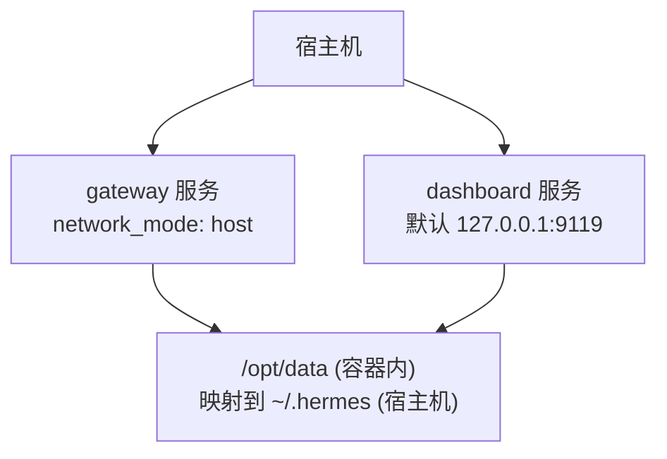
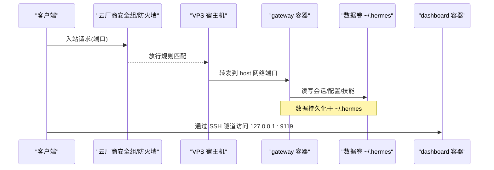
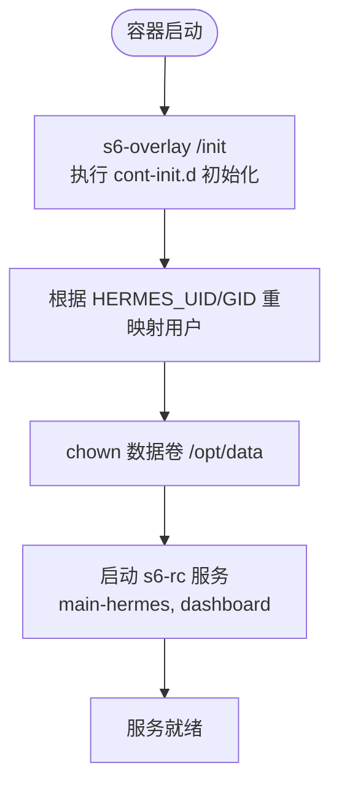
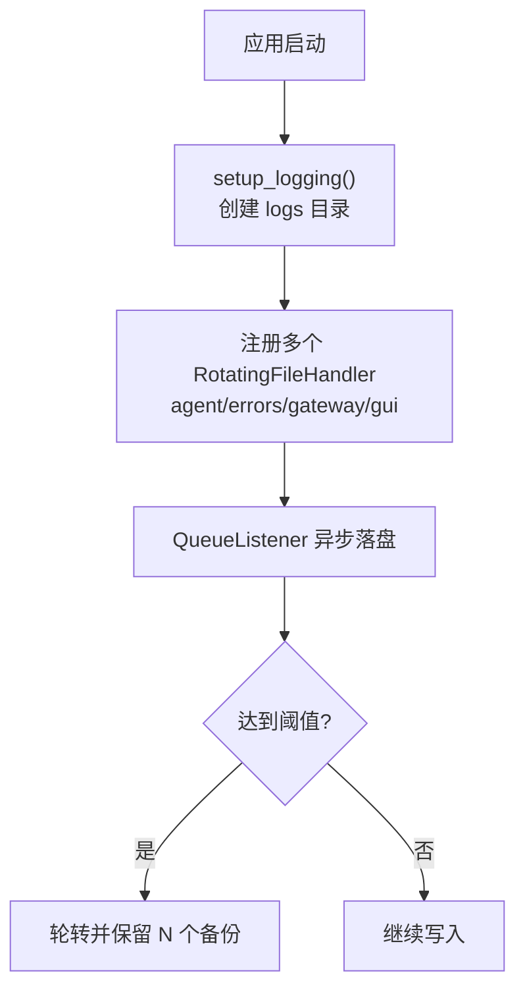
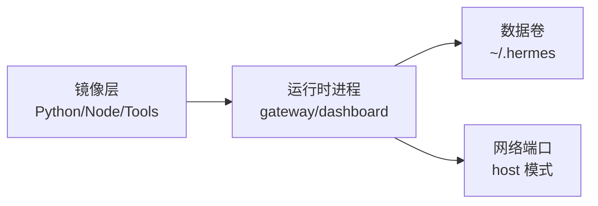

# VPS 服务器部署

<cite>
**本文引用的文件**
- [docker-compose.yml](file://docker-compose.yml)
- [Dockerfile](file://Dockerfile)
- [README.md](file://README.md)
- [hermes_constants.py](file://hermes_constants.py)
- [hermes_logging.py](file://hermes_logging.py)
- [docker-compose.windows.yml](file://docker-compose.windows.yml)
</cite>

## 目录
1. [简介](#简介)
2. [项目结构](#项目结构)
3. [核心组件](#核心组件)
4. [架构总览](#架构总览)
5. [详细组件分析](#详细组件分析)
6. [依赖关系分析](#依赖关系分析)
7. [性能与容量规划](#性能与容量规划)
8. [故障排查指南](#故障排查指南)
9. [结论](#结论)
10. [附录](#附录)

## 简介
本指南面向在各类云服务器（AWS EC2、Google Cloud、Azure、DigitalOcean、阿里云等）上以 Docker Compose 方式部署 Hermes Agent 的运维人员。文档覆盖系统要求、网络与安全（防火墙、端口、SSL）、数据持久化、服务管理、日志轮转、监控告警、备份恢复、安全加固、常见问题诊断与性能调优等内容，帮助你在生产环境中稳定运行 Hermes Agent。

## 项目结构
Hermes Agent 提供容器化镜像与 Compose 编排，包含两个主要服务：
- gateway：消息网关与代理主进程，负责会话、工具执行、平台接入等。
- dashboard：本地优先的管理面板，默认仅监听 127.0.0.1，建议通过 SSH 隧道或反向代理访问。

关键要点
- 使用 host 网络模式直接暴露端口，便于在 VPS 上快速对外提供服务。
- 数据卷挂载到宿主 ~/.hermes，保证会话、配置、技能等数据持久化。
- 通过环境变量注入密钥与平台配置（如 Teams、Google Chat 等）。
- Windows 下使用专用 compose 文件，映射端口并调整绑定地址。

图示来源
- [docker-compose.yml:29-77](file://docker-compose.yml#L29-L77)

章节来源
- [docker-compose.yml:1-77](file://docker-compose.yml#L1-L77)
- [docker-compose.windows.yml:1-39](file://docker-compose.windows.yml#L1-L39)

## 核心组件
- 容器镜像与运行时
  - 基于 Debian 13，预装 Python、Node 26、Playwright、FFmpeg、SQLite 修复版等依赖。
  - 使用 s6-overlay 作为进程管理器，启动 main-hermes、dashboard 等子服务。
  - 非 root 用户 hermes 运行，数据目录 /opt/data 由 volume 挂载。
- 数据与配置
  - HERMES_HOME=/opt/data；所有会话、配置、技能、缓存均落盘至该目录。
  - 通过环境变量控制行为（如 API_SERVER_HOST、API_SERVER_KEY、TEAMS_*、GOOGLE_CHAT_*）。
- 日志
  - 统一写入 $HERMES_HOME/logs，支持按大小轮转与多组件分流（agent.log、errors.log、gateway.log、gui.log）。
  - 自动脱敏敏感信息，避免密钥泄露到磁盘。

章节来源
- [Dockerfile:52-458](file://Dockerfile#L52-L458)
- [hermes_constants.py:114-199](file://hermes_constants.py#L114-L199)
- [hermes_logging.py:1-16](file://hermes_logging.py#L1-L16)
- [hermes_logging.py:259-376](file://hermes_logging.py#L259-L376)

## 架构总览
下图展示了在 VPS 上的典型部署拓扑：外部流量经防火墙/安全组进入宿主机，gateway 直接监听端口对外提供服务；dashboard 默认仅本地访问，可通过 SSH 隧道或反向代理暴露。

图示来源
- [docker-compose.yml:29-77](file://docker-compose.yml#L29-L77)
- [Dockerfile:359-422](file://Dockerfile#L359-L422)

## 详细组件分析

### 容器镜像与初始化流程
- 构建阶段
  - 固定 SQLite 版本以修复 WAL-reset 问题。
  - 安装 Node 26、npm、npx、uv、Python venv、FFmpeg、Playwright 等。
  - 预编译前端资源，减少运行时开销。
- 运行阶段
  - 入口脚本处理 PID 1 兼容，s6-overlay 接管进程监督。
  - cont-init.d 钩子在服务启动前完成 UID/GID 重映射、权限设置、配置初始化。
  - 将 /opt/data 标记为可写数据卷，应用以 hermes 用户运行。

图示来源
- [Dockerfile:93-157](file://Dockerfile#L93-L157)
- [Dockerfile:336-358](file://Dockerfile#L336-L358)
- [Dockerfile:424-458](file://Dockerfile#L424-L458)

章节来源
- [Dockerfile:1-458](file://Dockerfile#L1-L458)

### 数据持久化与路径解析
- 默认 HOME
  - 容器内 HERMES_HOME=/opt/data；Compose 将其映射到宿主 ~/.hermes。
- 路径解析
  - get_hermes_home() 决定实际工作目录，支持 profile 模式与自定义路径。
  - get_default_hermes_root() 在 Docker 场景下返回 HERMES_HOME 本身作为根。
- 建议
  - 将 ~/.hermes 放在独立磁盘或快照策略良好的存储上。
  - 定期备份该目录以保留会话、配置、技能与缓存。

章节来源
- [docker-compose.yml:36-44](file://docker-compose.yml#L36-L44)
- [hermes_constants.py:114-199](file://hermes_constants.py#L114-L199)

### 日志与轮转
- 日志文件
  - agent.log：主活动日志（INFO+）。
  - errors.log：错误与警告（WARNING+）。
  - gateway.log：网关相关事件（INFO+，仅在 gateway 模式）。
  - gui.log：仪表盘/TUI 网关事件（INFO+，仅在 gui 模式）。
- 轮转策略
  - 使用 RotatingFileHandler，支持 max_size_mb 与 backup_count。
  - 跨进程并发安全：Windows 使用 concurrent-log-handler 避免锁冲突。
  - 外部轮转检测：当 logrotate 替换文件时自动重新打开句柄。
- 脱敏
  - RedactingFormatter 确保敏感信息不落地。

图示来源
- [hermes_logging.py:259-376](file://hermes_logging.py#L259-L376)
- [hermes_logging.py:415-548](file://hermes_logging.py#L415-L548)
- [hermes_logging.py:550-760](file://hermes_logging.py#L550-L760)

章节来源
- [hermes_logging.py:1-800](file://hermes_logging.py#L1-L800)

### 网络与安全
- 端口与绑定
  - gateway：host 网络模式，直接绑定宿主机端口（具体端口取决于平台适配器与 API Server）。
  - dashboard：默认 127.0.0.1:9119，建议通过 SSH 隧道或反向代理暴露。
- 防火墙/安全组
  - 仅开放必要端口（例如 gateway 所需端口与 SSH 22）。
  - 若启用 OpenAI 兼容 API Server，必须设置 API_SERVER_KEY 并谨慎暴露。
- SSL/TLS
  - 建议在反向代理（Nginx/Caddy）终止 TLS，并将后端限制为 localhost。
  - 如需直连 HTTPS，请结合证书管理与域名解析，并确保最小权限原则。

章节来源
- [docker-compose.yml:13-27](file://docker-compose.yml#L13-L27)
- [docker-compose.yml:30-61](file://docker-compose.yml#L30-L61)
- [docker-compose.yml:63-77](file://docker-compose.yml#L63-L77)
- [docker-compose.windows.yml:12-39](file://docker-compose.windows.yml#L12-L39)

### 服务管理与命令
- 启动/停止/重启
  - docker compose up/down/restart。
  - 查看状态：docker compose ps。
  - 查看日志：docker compose logs -f gateway/dashboard。
- 常用操作
  - 更新镜像后重新拉起服务以应用变更。
  - 通过环境变量切换平台（Teams、Google Chat 等）。
  - 使用 SSH 隧道访问 dashboard：ssh -L 9119:localhost:9119 user@vps。

章节来源
- [docker-compose.yml:29-77](file://docker-compose.yml#L29-L77)

### 监控与可观测性
- 内置日志
  - 使用 hermes_logging 统一输出，支持组件过滤与轮转。
- OTLP 导出
  - 镜像包含 otlp extra，可在需要时对接外部采集器（需额外配置）。
- 健康检查
  - 可结合云平台健康探针与反向代理健康端点实现服务可用性监控。

章节来源
- [Dockerfile:222-267](file://Dockerfile#L222-L267)
- [hermes_logging.py:259-376](file://hermes_logging.py#L259-L376)

### 备份与恢复
- 备份目标
  - 完整备份 ~/.hermes（包含会话、配置、技能、缓存、日志）。
- 备份策略
  - 定时快照（云盘快照或对象存储同步）。
  - 增量备份（配合文件系统快照或 rsync）。
- 恢复步骤
  - 停止服务，替换 ~/.hermes，重启服务。
  - 验证日志与数据库完整性。

章节来源
- [docker-compose.yml:36-44](file://docker-compose.yml#L36-L44)
- [hermes_logging.py:259-376](file://hermes_logging.py#L259-L376)

### 安全加固措施
- 最小暴露面
  - 仅开放必要端口；dashboard 默认仅本地访问。
- 认证与加密
  - 对 API Server 强制设置 API_SERVER_KEY。
  - 通过反向代理启用 TLS 与访问控制。
- 权限隔离
  - 容器以非 root 用户运行；数据卷权限由初始化脚本设置。
- 日志脱敏
  - 自动屏蔽敏感信息，避免密钥泄露。

章节来源
- [docker-compose.yml:13-27](file://docker-compose.yml#L13-L27)
- [docker-compose.yml:30-61](file://docker-compose.yml#L30-L61)
- [hermes_logging.py:1-16](file://hermes_logging.py#L1-L16)

## 依赖关系分析
- 运行时依赖
  - Python、Node 26、Playwright、FFmpeg、SQLite（修复版）。
  - s6-overlay 用于进程监督。
- 数据依赖
  - /opt/data（映射到 ~/.hermes）承载全部持久化数据。
- 网络依赖
  - gateway 与 dashboard 通过 host 网络与宿主机端口交互。

图示来源
- [Dockerfile:52-167](file://Dockerfile#L52-L167)
- [Dockerfile:359-422](file://Dockerfile#L359-L422)
- [docker-compose.yml:29-77](file://docker-compose.yml#L29-L77)

章节来源
- [Dockerfile:52-422](file://Dockerfile#L52-L422)
- [docker-compose.yml:29-77](file://docker-compose.yml#L29-L77)

## 性能与容量规划
- CPU/内存
  - 根据模型调用频率与并发会话数评估；建议至少 2 核 4GB 起步，高并发场景适当扩容。
- 存储
  - 选择高性能 SSD；定期清理旧日志与缓存，避免磁盘占满。
- I/O 优化
  - 将 ~/.hermes 置于低延迟存储；合理设置日志轮转大小与备份数量。
- 网络
  - 限制出站带宽与连接数；使用 CDN 或缓存降低重复请求。
- 资源限制
  - 可在容器层面设置 CPU/内存上限，防止单实例占用过多资源。

[本节为通用指导，无需特定文件引用]

## 故障排查指南
- 无法访问服务
  - 检查云厂商安全组/防火墙是否放行对应端口。
  - 确认 gateway 已启动且监听正确端口。
- Dashboard 无法远程访问
  - 默认仅本地监听；使用 SSH 隧道或反向代理暴露。
- 日志为空或丢失
  - 检查 $HERMES_HOME/logs 是否存在与权限；确认轮转策略未误删。
- 数据不一致
  - 核对 ~/.hermes 是否被其他进程修改；必要时从快照恢复。
- 性能抖动
  - 观察日志与系统指标；调整并发、模型参数与缓存策略。

章节来源
- [docker-compose.yml:13-27](file://docker-compose.yml#L13-L27)
- [docker-compose.yml:63-77](file://docker-compose.yml#L63-L77)
- [hermes_logging.py:259-376](file://hermes_logging.py#L259-L376)

## 结论
通过 Docker Compose 与 s6-overlay 的监督机制，Hermes Agent 可在各类 VPS 上快速、稳定地部署。遵循最小暴露面、TLS 终止、数据持久化与日志轮转的最佳实践，并结合监控与备份策略，可实现高可用与易维护的生产环境。遇到问题时，优先检查网络、权限与日志，再逐步定位到具体组件。

## 附录
- 快速参考
  - 启动：docker compose up -d
  - 查看状态：docker compose ps
  - 查看日志：docker compose logs -f gateway/dashboard
  - 访问 Dashboard：SSH 隧道 ssh -L 9119:localhost:9119 user@vps
- 环境变量示例
  - API_SERVER_HOST/API_SERVER_KEY：开启并保护 API Server。
  - TEAMS_*：启用 Microsoft Teams 网关。
  - GOOGLE_CHAT_*：启用 Google Chat 网关。

章节来源
- [docker-compose.yml:30-61](file://docker-compose.yml#L30-L61)
- [README.md:105-184](file://README.md#L105-L184)