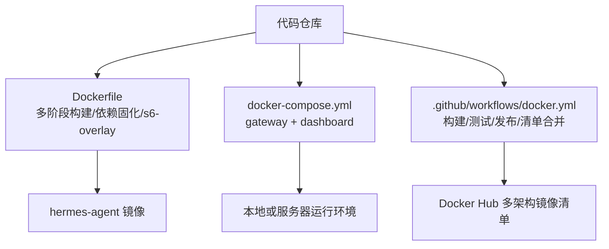
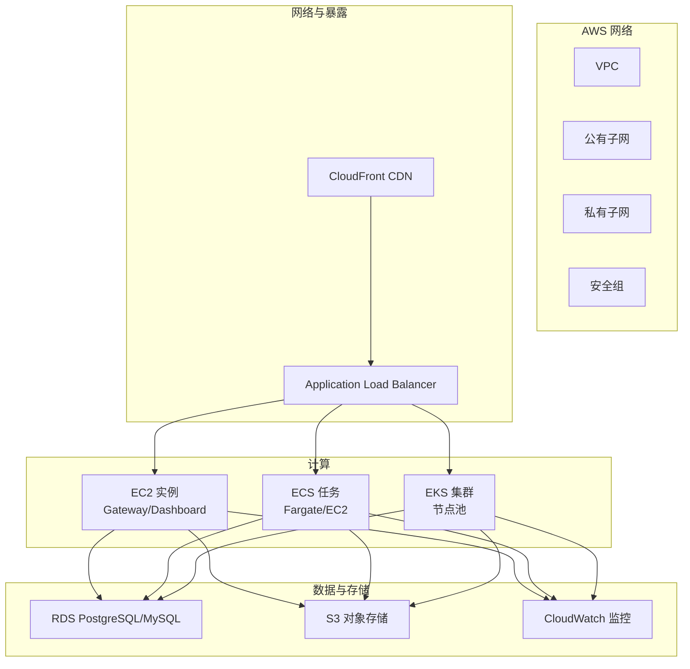
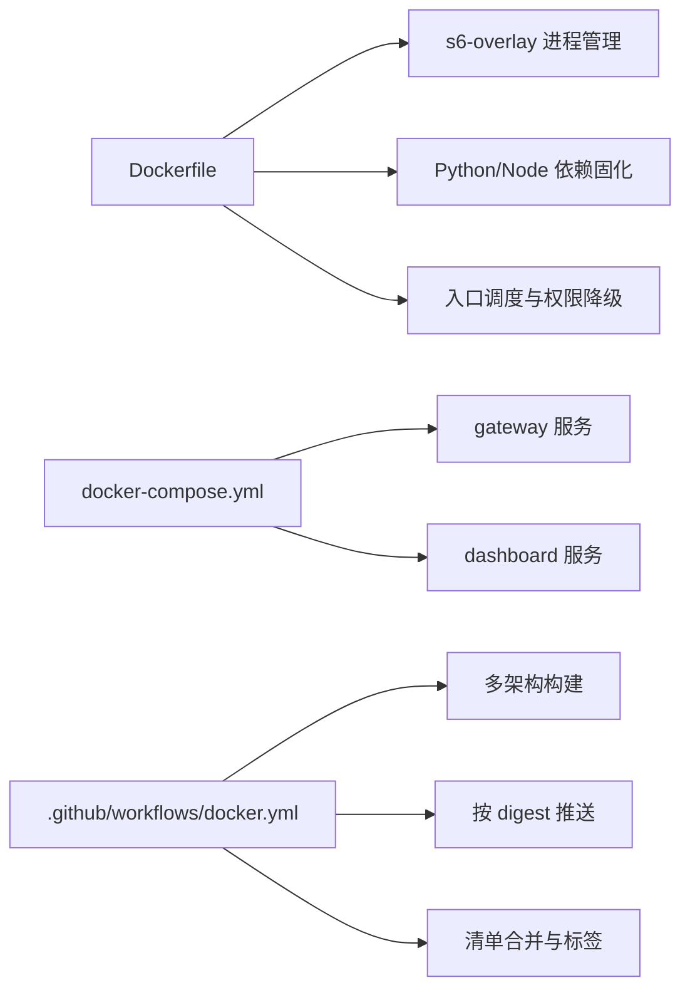

# AWS 部署

<cite>
**本文引用的文件**
- [Dockerfile](file://Dockerfile)
- [docker-compose.yml](file://docker-compose.yml)
- [.github/workflows/docker.yml](file://.github/workflows/docker.yml)
</cite>

## 目录
1. [简介](#简介)
2. [项目结构](#项目结构)
3. [核心组件](#核心组件)
4. [架构总览](#架构总览)
5. [详细组件分析](#详细组件分析)
6. [依赖关系分析](#依赖关系分析)
7. [性能考虑](#性能考虑)
8. [故障排除指南](#故障排除指南)
9. [结论](#结论)
10. [附录](#附录)

## 简介
本文件面向在 AWS 平台上部署 Hermes Agent 的运维与平台工程团队，提供从 EC2、ECS、EKS 到网络、安全、存储、数据库、监控、弹性伸缩、负载均衡、CDN、事件驱动与成本优化的端到端部署指南。文档基于仓库中的容器镜像定义、编排示例与 CI/CD 流水线，确保建议与制品一致且可落地。

## 项目结构
Hermes Agent 以容器化方式交付，包含：
- 生产级 Docker 镜像构建（多阶段、多架构、固定依赖、s6-overlay 进程管理）
- Compose 编排示例（gateway + dashboard）
- GitHub Actions 构建与发布流水线（多架构镜像、按 digest 推送、清单合并）

图表来源
- [Dockerfile:1-458](file://Dockerfile#L1-L458)
- [docker-compose.yml:1-77](file://docker-compose.yml#L1-L77)
- [.github/workflows/docker.yml:1-290](file://.github/workflows/docker.yml#L1-L290)

章节来源
- [Dockerfile:1-458](file://Dockerfile#L1-L458)
- [docker-compose.yml:1-77](file://docker-compose.yml#L1-L77)
- [.github/workflows/docker.yml:1-290](file://.github/workflows/docker.yml#L1-L290)

## 核心组件
- 容器运行时与进程管理：使用 s6-overlay 作为 PID 1，负责初始化脚本、服务注册与优雅关停；入口由 entrypoint-dispatch.sh 统一调度，兼容不同编排器对 PID 1 的限制。
- 数据持久化：通过 /opt/data 卷挂载保存配置、会话与日志等状态；懒加载依赖写入独立目录以避免污染只读镜像层。
- 前端与 TUI：预构建产物随镜像分发，避免运行时 npm install；TUI 指向预打包路径以提升启动速度。
- 安全与权限：非 root 用户 hermes（UID/GID 可映射），特权降级 shim 保证 docker exec 安全；dashboard 默认仅监听 localhost。
- 构建与发布：CI 构建 amd64/arm64 镜像，按 digest 推送并生成多架构清单；支持将 Git SHA 注入镜像以便问题定位。

章节来源
- [Dockerfile:54-91](file://Dockerfile#L54-L91)
- [Dockerfile:93-135](file://Dockerfile#L93-L135)
- [Dockerfile:149-167](file://Dockerfile#L149-L167)
- [Dockerfile:171-267](file://Dockerfile#L171-L267)
- [Dockerfile:269-292](file://Dockerfile#L269-L292)
- [Dockerfile:294-357](file://Dockerfile#L294-L357)
- [Dockerfile:359-422](file://Dockerfile#L359-L422)
- [Dockerfile:424-458](file://Dockerfile#L424-L458)
- [docker-compose.yml:1-77](file://docker-compose.yml#L1-L77)
- [.github/workflows/docker.yml:30-134](file://.github/workflows/docker.yml#L30-L134)
- [.github/workflows/docker.yml:139-290](file://.github/workflows/docker.yml#L139-L290)

## 架构总览
下图展示 Hermes Agent 在 AWS 上的典型部署拓扑：EC2/ECS/EKS 承载网关与仪表盘，外部流量经 ALB 进入，日志与对象存储接入 S3，数据库使用 RDS，指标与日志上报 CloudWatch，可选 CloudFront 加速静态资源。

图表来源
- [Dockerfile:359-422](file://Dockerfile#L359-L422)
- [docker-compose.yml:29-77](file://docker-compose.yml#L29-L77)

## 详细组件分析

### EC2 实例部署方案
- 实例类型选择
  - 通用型（如 t3/t4g）适合中等负载与开发/测试环境。
  - 计算优化型（c5/c6i）适合高并发网关场景。
  - 内存优化型（r5/r6g）适合大上下文与缓存密集型工作负载。
  - ARM 架构（Graviton）可通过镜像多架构支持获得更好性价比。
- 安全组配置
  - 入站：仅开放必要端口（例如 HTTPS 443、SSH 22 限制来源）。
  - 出站：允许访问 VPC 内 RDS、S3 端点、CloudWatch 与外部模型 API。
- EBS 卷挂载
  - 系统盘：SSD gp3，预留足够空间安装镜像与依赖。
  - 数据盘：挂载至 /opt/data 用于持久化配置与会话；启用加密与自动快照策略。
- 运行方式
  - 使用镜像提供的 s6-overlay 与 entrypoint-dispatch.sh 启动 gateway 与 dashboard。
  - 通过环境变量注入密钥与配置；dashboard 默认仅监听 localhost，需通过反向代理或隧道暴露。

章节来源
- [Dockerfile:359-422](file://Dockerfile#L359-L422)
- [docker-compose.yml:13-27](file://docker-compose.yml#L13-L27)
- [docker-compose.yml:29-77](file://docker-compose.yml#L29-L77)

### ECS 容器服务部署
- 任务定义配置
  - 容器镜像：使用构建的多架构 hermes-agent 镜像。
  - 端口映射：根据网关与仪表盘端口进行映射；如需外网访问，结合 ALB 暴露。
  - 环境变量：注入 API_SERVER_KEY、API_SERVER_HOST（谨慎）、各平台网关凭据等。
  - 存储：挂载 EFS 或 FSx for Lustre 到 /opt/data，或使用带持久卷的 Fargate 任务。
  - 健康检查：基于 /health 或自定义探针。
- 服务编排
  - 使用 ECS Service 管理副本数与滚动更新。
  - 配合 Auto Scaling 基于 CPU/请求数/队列深度扩缩容。
- 负载均衡设置
  - 使用 Application Load Balancer 监听 443，转发到目标端口。
  - 开启 TLS 终止与 WAF（可选）。

章节来源
- [docker-compose.yml:29-77](file://docker-compose.yml#L29-L77)
- [Dockerfile:424-458](file://Dockerfile#L424-L458)

### EKS 集群部署流程
- 集群创建
  - 使用 eksctl 或控制台创建集群，启用加密与审计日志。
  - 配置 OIDC 以集成 IAM Roles for Service Accounts（IRSA）。
- 节点池配置
  - 混合节点池：通用型 + Spot 实例降低成本。
  - 自动扩缩容：Cluster Autoscaler/Karpenter 基于资源需求扩容。
- Ingress 控制器设置
  - 推荐 NGINX Ingress Controller 或 ALB Ingress Controller。
  - 为网关与仪表盘分别创建 Ingress 资源，绑定域名与证书。
- 服务暴露
  - 通过 ALB 暴露公网入口，内部服务通过 ClusterIP/NodePort 通信。

章节来源
- [Dockerfile:424-458](file://Dockerfile#L424-L458)
- [docker-compose.yml:29-77](file://docker-compose.yml#L29-L77)

### IAM 角色权限最小化配置
- 原则
  - 按需授权：仅授予访问 RDS、S3、CloudWatch 的最小权限。
  - 分离职责：不同服务使用不同角色，避免共享宽泛权限。
  - 使用条件：限定资源 ARN、IP 段、时间窗口。
- 常见角色
  - Gateway 角色：读取 S3 配置、写入 CloudWatch Logs/Metrics。
  - Dashboard 角色：读取 S3 日志、查询 CloudWatch 指标。
  - 数据库角色：仅允许连接特定 RDS 实例与数据库名。

章节来源
- [docker-compose.yml:13-27](file://docker-compose.yml#L13-L27)
- [Dockerfile:359-422](file://Dockerfile#L359-L422)

### VPC 网络架构设计
- 子网划分
  - 公有子网：放置 ALB 与 NAT 网关。
  - 私有子网：放置 EC2/ECS/EKS 节点与 RDS。
- 路由与安全组
  - 私有子网通过 NAT 访问公网；RDS 仅允许来自应用子网的访问。
  - 安全组细化：仅开放必要端口与来源 CIDR。
- 端点
  - 使用 VPC Endpoints 访问 S3、CloudWatch、Secrets Manager，减少公网流量与延迟。

章节来源
- [docker-compose.yml:13-27](file://docker-compose.yml#L13-L27)
- [Dockerfile:359-422](file://Dockerfile#L359-L422)

### RDS 数据库集成（PostgreSQL/MySQL）
- 部署建议
  - 多可用区部署，启用自动备份与跨区复制。
  - 使用参数组优化连接池与 WAL/redo 日志策略。
- 连接管理
  - 使用 IAM 认证或 Secrets Manager 管理凭据。
  - 应用侧配置连接超时与重试策略。
- 监控与告警
  - 上报 QPS、连接数、慢查询到 CloudWatch。
  - 设置阈值告警与自动故障转移。

章节来源
- [docker-compose.yml:29-77](file://docker-compose.yml#L29-L77)
- [Dockerfile:359-422](file://Dockerfile#L359-L422)

### S3 对象存储用于日志和文件管理
- 用途
  - 归档日志、会话导出、模型权重与插件包。
- 安全
  - 桶策略限制访问来源与 IP；启用版本控制与生命周期规则。
- 访问
  - 通过 IRSA 或 IAM 角色授予最小权限；使用 VPC Endpoint 提升性能与安全性。

章节来源
- [docker-compose.yml:29-77](file://docker-compose.yml#L29-L77)
- [Dockerfile:359-422](file://Dockerfile#L359-L422)

### CloudWatch 监控指标配置
- 指标
  - 应用指标：请求量、错误率、延迟分位、队列长度。
  - 系统指标：CPU、内存、磁盘 I/O、网络吞吐。
- 日志
  - 集中收集 stdout/stderr 与结构化日志。
- 告警
  - 基于阈值与复合指标设置告警；联动 SNS 通知。

章节来源
- [docker-compose.yml:29-77](file://docker-compose.yml#L29-L77)
- [Dockerfile:359-422](file://Dockerfile#L359-L422)

### Auto Scaling 组配置策略
- 目标
  - 保持目标利用率（如 CPU 60%）与最低可用性。
- 策略
  - 预测性扩缩容：基于历史负载曲线提前扩容。
  - 计划性扩缩容：在业务高峰前扩容。
  - 动态扩缩容：基于实时指标调整。
- 混合实例
  - 结合 On-Demand 与 Spot 实例，提高弹性与成本效益。

章节来源
- [docker-compose.yml:29-77](file://docker-compose.yml#L29-L77)
- [Dockerfile:359-422](file://Dockerfile#L359-L422)

### Application Load Balancer 设置
- 监听器
  - 监听 443，启用 TLS 终止与 HTTP/2。
- 目标组
  - 健康检查路径与超时；支持蓝绿/金丝雀发布。
- 路由
  - 基于主机头或路径路由到不同服务（网关/仪表盘）。

章节来源
- [docker-compose.yml:29-77](file://docker-compose.yml#L29-L77)
- [Dockerfile:359-422](file://Dockerfile#L359-L422)

### CloudFront CDN 加速配置
- 用途
  - 加速静态资源（前端、仪表盘 UI）。
- 行为
  - 缓存策略：根据 Cache-Control 与 TTL 设置。
  - 安全：WAF、Geo Restriction、HTTPS Only。
- 源站
  - 指向 ALB 或 S3 静态站点。

章节来源
- [docker-compose.yml:29-77](file://docker-compose.yml#L29-L77)
- [Dockerfile:359-422](file://Dockerfile#L359-L422)

### Lambda 函数集成方案
- 触发器
  - EventBridge 事件、S3 事件、API Gateway。
- 权限
  - 使用 IRSA 或 IAM 角色授予最小权限。
- 集成
  - 调用 Hermes 网关 API 或写入 S3/RDS（通过 RDS Proxy）。

章节来源
- [docker-compose.yml:29-77](file://docker-compose.yml#L29-L77)
- [Dockerfile:359-422](file://Dockerfile#L359-L422)

### Step Functions 工作流自动化
- 场景
  - 批量数据处理、异步任务编排、失败重试与补偿。
- 设计
  - 状态机定义任务步骤、分支与重试策略。
  - 与 EventBridge、Lambda、ECS/EKS 集成。

章节来源
- [docker-compose.yml:29-77](file://docker-compose.yml#L29-L77)
- [Dockerfile:359-422](file://Dockerfile#L359-L422)

### EventBridge 事件驱动架构
- 事件源
  - 应用自定义事件、AWS 服务事件（S3、RDS、CodePipeline）。
- 规则
  - 过滤与转换事件，路由到目标（Lambda、SQS、SNS、ECS/EKS）。
- 可靠性
  - 死信队列、重试策略、幂等处理。

章节来源
- [docker-compose.yml:29-77](file://docker-compose.yml#L29-L77)
- [Dockerfile:359-422](file://Dockerfile#L359-L422)

### 成本优化策略
- 预留实例与 Savings Plans
  - 对稳定负载使用 RI/SP 降低单位成本。
- Spot 实例
  - 对无状态网关与批处理任务使用 Spot，结合 Auto Scaling 保障可用性。
- 资源右配
  - 基于监控调整实例规格与容器资源限制。
- 存储分层
  - 冷数据归档至 Glacier，热数据保留在 SSD。

章节来源
- [docker-compose.yml:29-77](file://docker-compose.yml#L29-L77)
- [Dockerfile:359-422](file://Dockerfile#L359-L422)

### 安全最佳实践
- 加密
  - 传输中：TLS 终止于 ALB/Ingress。
  - 静态：EBS/S3/RDS 启用加密。
- 审计
  - 启用 CloudTrail、VPC Flow Logs、RDS 审计日志。
- 访问控制
  - 最小权限 IAM、VPC Endpoints、安全组白名单。
- 密钥管理
  - 使用 Secrets Manager/Parameter Store，避免硬编码。

章节来源
- [docker-compose.yml:13-27](file://docker-compose.yml#L13-L27)
- [Dockerfile:359-422](file://Dockerfile#L359-L422)

### 故障排除指南
- 启动失败
  - 检查 s6-overlay 初始化脚本与 cont-init.d 执行结果。
  - 确认 /opt/data 权限与 UID/GID 映射正确。
- 网络问题
  - 验证安全组与 NACL；检查 VPC Endpoints 是否可达。
- 日志与指标
  - 查看 CloudWatch Logs 与 Metrics；定位错误码与堆栈。
- 数据库连接
  - 检查 RDS 安全组、参数组与凭据；使用 RDS Proxy 缓解连接风暴。
- 性能瓶颈
  - 分析 CPU/内存/磁盘 I/O；调整容器资源限制与应用参数。

章节来源
- [Dockerfile:93-135](file://Dockerfile#L93-L135)
- [Dockerfile:294-357](file://Dockerfile#L294-L357)
- [docker-compose.yml:13-27](file://docker-compose.yml#L13-L27)

## 依赖关系分析

图表来源
- [Dockerfile:93-135](file://Dockerfile#L93-L135)
- [Dockerfile:171-267](file://Dockerfile#L171-L267)
- [Dockerfile:424-458](file://Dockerfile#L424-L458)
- [docker-compose.yml:29-77](file://docker-compose.yml#L29-L77)
- [.github/workflows/docker.yml:30-134](file://.github/workflows/docker.yml#L30-L134)
- [.github/workflows/docker.yml:139-290](file://.github/workflows/docker.yml#L139-L290)

章节来源
- [Dockerfile:93-135](file://Dockerfile#L93-L135)
- [docker-compose.yml:29-77](file://docker-compose.yml#L29-L77)
- [.github/workflows/docker.yml:30-134](file://.github/workflows/docker.yml#L30-L134)
- [.github/workflows/docker.yml:139-290](file://.github/workflows/docker.yml#L139-L290)

## 性能考虑
- 容器优化
  - 使用多阶段构建减少镜像体积；固化依赖避免运行时编译。
  - 启用 s6-overlay 进程管理，提升稳定性与可观测性。
- 资源限制
  - 为网关与仪表盘设置合理的 CPU/内存限制与请求/限制比。
- 缓存与预热
  - 前端预构建产物；模型权重与插件包预取至 S3。
- 网络优化
  - 使用 VPC Endpoints 访问 AWS 服务；ALB 启用 HTTP/2 与连接复用。
- 数据库调优
  - 调整连接池大小、查询缓存与索引；使用 RDS Proxy 管理连接。

章节来源
- [Dockerfile:171-267](file://Dockerfile#L171-L267)
- [Dockerfile:269-292](file://Dockerfile#L269-L292)
- [docker-compose.yml:29-77](file://docker-compose.yml#L29-L77)

## 故障排除指南
- 常见问题
  - 权限不足：检查 IAM 角色与 S3/RDS 策略。
  - 网络不通：验证安全组、NACL 与 VPC Endpoints。
  - 启动失败：查看 s6-overlay 日志与 cont-init.d 输出。
- 诊断工具
  - CloudWatch Logs Insights 分析日志；X-Ray 追踪请求链路。
  - RDS Performance Insights 定位慢查询。
- 回滚策略
  - 使用蓝绿或金丝雀发布；保留旧版本镜像与配置。

章节来源
- [Dockerfile:93-135](file://Dockerfile#L93-L135)
- [docker-compose.yml:13-27](file://docker-compose.yml#L13-L27)

## 结论
Hermes Agent 以容器化方式提供一致的运行环境，结合 AWS 的弹性与托管服务可实现高可用、可扩展、安全的部署。通过合理选择 EC2/ECS/EKS、配置 ALB/CloudFront、集成 RDS/S3/CloudWatch，并遵循最小权限与加密审计的安全实践，可在保证性能的同时有效控制成本。建议在生产环境采用多可用区与自动扩缩容，结合事件驱动架构实现自动化运维。

## 附录
- 参考制品
  - 镜像构建与发布：见 CI 流水线与 Dockerfile。
  - 本地编排：见 docker-compose.yml。
- 扩展阅读
  - 安全组与 NACL 最佳实践。
  - RDS 参数组与连接池调优。
  - CloudWatch 指标与告警模板。