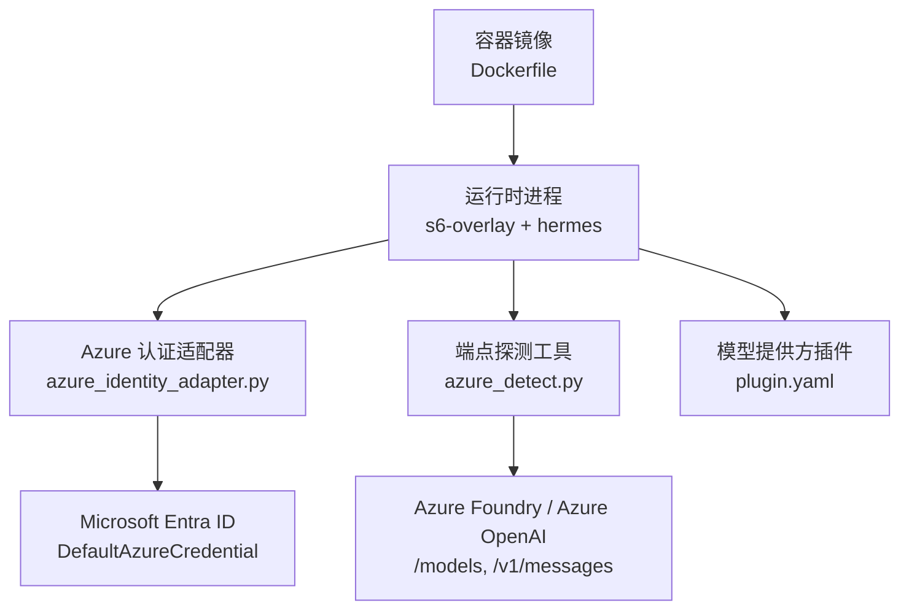
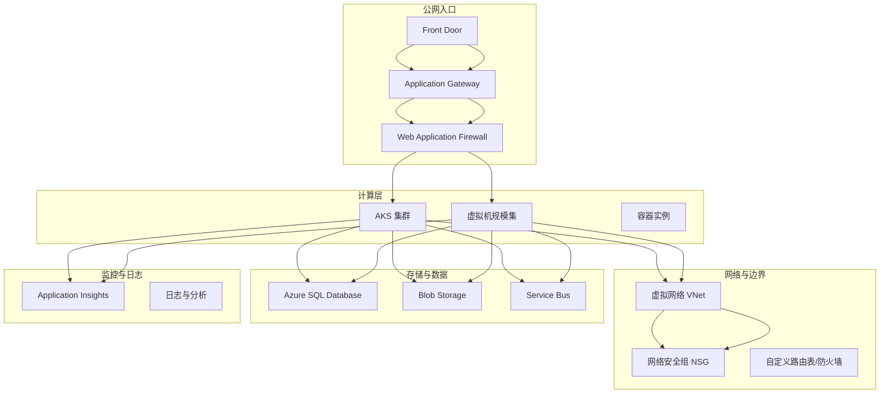
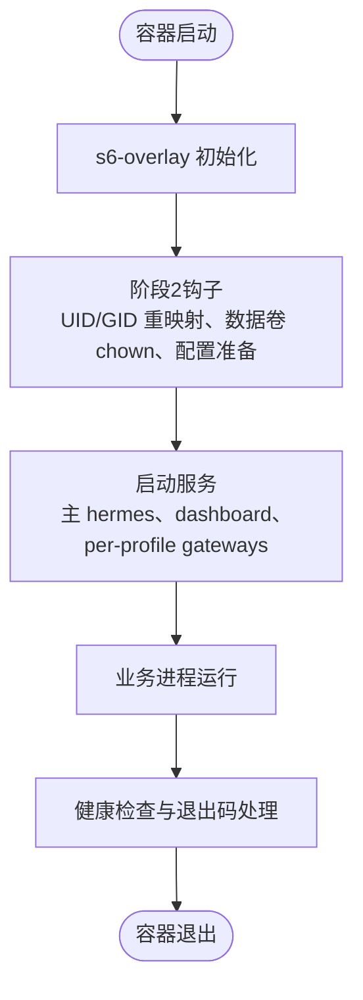
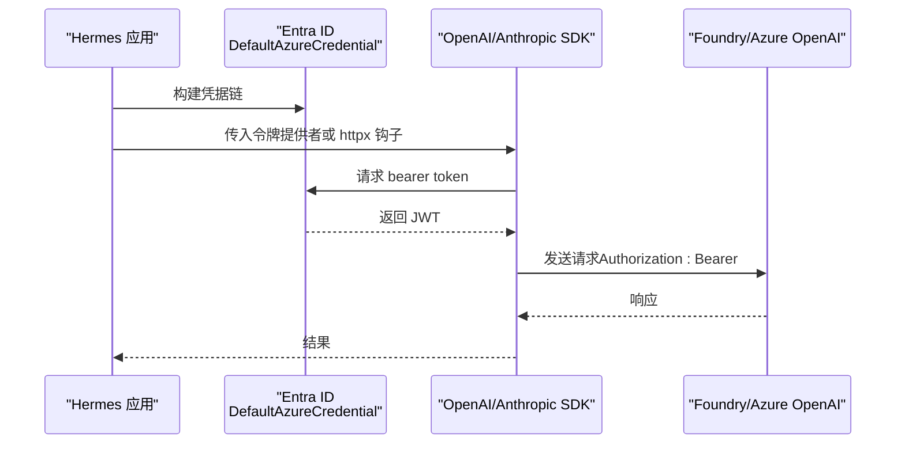
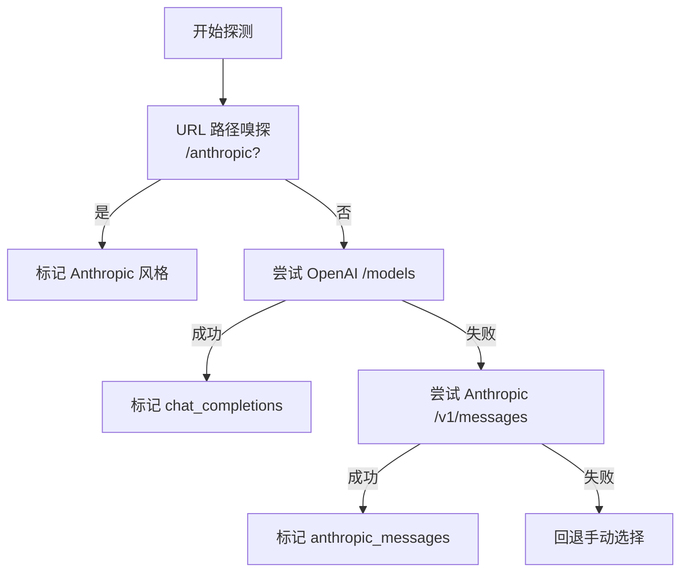
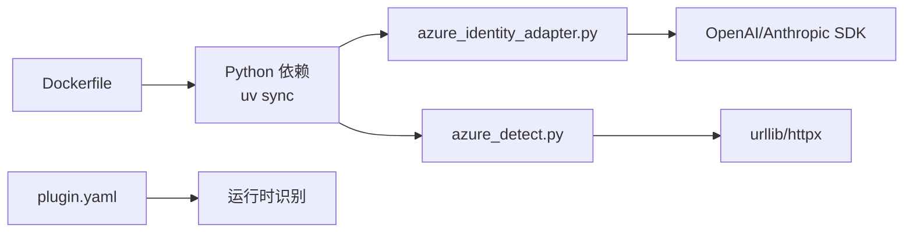

# Azure 部署

<cite>
**本文引用的文件**
- [Dockerfile](file://Dockerfile)
- [azure_identity_adapter.py](file://agent/azure_identity_adapter.py)
- [azure_detect.py](file://hermes_cli/azure_detect.py)
- [plugin.yaml](file://plugins/model-providers/azure-foundry/plugin.yaml)
- [azure-foundry.md](file://website/docs/guides/azure-foundry.md)
</cite>

## 目录
1. [简介](#简介)
2. [项目结构](#项目结构)
3. [核心组件](#核心组件)
4. [架构总览](#架构总览)
5. [详细组件分析](#详细组件分析)
6. [依赖关系分析](#依赖关系分析)
7. [性能考虑](#性能考虑)
8. [故障排除指南](#故障排除指南)
9. [结论](#结论)
10. [附录](#附录)

## 简介
本文件面向在 Microsoft Azure 平台部署 Hermes Agent 的运维与平台工程团队，聚焦以下目标：
- 提供基于 Azure 容器化镜像的运行基线（Dockerfile），便于在 AKS、VMSS、ACI、App Service、Functions 等托管环境复用。
- 说明 Azure AI Foundry / Azure OpenAI 的两种接入方式：API Key 与 Microsoft Entra ID（无密钥）认证，并给出在 Azure 各计算形态下的推荐实践。
- 给出端到端部署建议：VNet 隔离、网络安全组、托管磁盘、AKS 集群与节点池、服务网格集成思路、应用网关与 Front Door 入站、WAF 防护、SQL Database、Blob Storage、Application Insights、函数与工作流、消息队列、成本优化与安全最佳实践、故障排查与性能调优。

注意：Hermes 仓库未包含 Azure 基础设施模板（如 Bicep/Terraform）。本节将结合仓库内提供的容器镜像与 Azure 集成代码，给出可落地的部署方案与配置要点。

**章节来源**
- [azure-foundry.md:1-335](file://website/docs/guides/azure-foundry.md#L1-L335)

## 项目结构
从部署视角，仓库中与 Azure 部署强相关的资产包括：
- 容器镜像构建定义：Dockerfile，定义了运行时基础镜像、依赖安装、s6-overlay 进程管理、非 root 用户、数据卷挂载、入口点等。
- Azure 身份认证适配：agent/azure_identity_adapter.py，实现 DefaultAzureCredential 调用、令牌提供者构造、诊断探测、httpx 请求钩子注入等。
- 端点自动发现：hermes_cli/azure_detect.py，支持 OpenAI 风格与 Anthropic 风格的 Azure Foundry 端点探测、模型列表抓取、上下文长度查询。
- 插件声明：plugins/model-providers/azure-foundry/plugin.yaml，注册 Azure Foundry 模型提供方。
- 官方指南：website/docs/guides/azure-foundry.md，详细说明 Entra ID 认证、环境变量、配置项、常见问题与排障。

**图表来源**
- [Dockerfile:52-458](file://Dockerfile#L52-L458)
- [azure_identity_adapter.py:1-572](file://agent/azure_identity_adapter.py#L1-L572)
- [azure_detect.py:1-409](file://hermes_cli/azure_detect.py#L1-L409)
- [plugin.yaml:1-6](file://plugins/model-providers/azure-foundry/plugin.yaml#L1-L6)

**章节来源**
- [Dockerfile:52-458](file://Dockerfile#L52-L458)
- [azure_identity_adapter.py:1-572](file://agent/azure_identity_adapter.py#L1-L572)
- [azure_detect.py:1-409](file://hermes_cli/azure_detect.py#L1-L409)
- [plugin.yaml:1-6](file://plugins/model-providers/azure-foundry/plugin.yaml#L1-L6)
- [azure-foundry.md:1-335](file://website/docs/guides/azure-foundry.md#L1-L335)

## 核心组件
- 容器运行基线（Dockerfile）
  - 使用 Debian 基础镜像，预编译 SQLite 修复版本，安装 s6-overlay 作为进程管理器，创建非 root 用户 hermes，暴露 /opt/data 数据卷，ENTRYPOINT 为调度脚本以兼容不同编排器。
  - Python 依赖通过 uv 同步，前端资源预构建，生产镜像只包含必要 extra，避免臃肿。
  - 关键环境变量：HERMES_HOME=/opt/data、HERMES_DISABLE_LAZY_INSTALLS=1、HERMES_TUI_DIR、HERMES_WEB_DIST、PATH 中优先 hermes 执行 shim。
- Azure 身份认证适配器（Entra ID）
  - 延迟加载 azure-identity，构建 DefaultAzureCredential，按 scope 获取 bearer token。
  - 提供令牌提供者构造、健康探测、诊断信息输出；对 Anthropic SDK 通过 httpx 事件钩子注入 Authorization: Bearer。
  - 支持多凭据链：环境变量、工作负载标识、托管标识、VS Code、Azure CLI、azd、PowerShell、Broker。
- 端点自动发现（azure_detect）
  - 支持 OpenAI 风格 /models 探测与 Anthropic 风格 /v1/messages 探测，自动识别传输模式与可用模型列表。
  - 支持 Entra ID 与 API Key 两种认证头策略，确保私有网络或受限端点的回退能力。
- 插件注册
  - plugin.yaml 声明 azure-foundry 模型提供方，供向导与运行时识别。

**章节来源**
- [Dockerfile:52-458](file://Dockerfile#L52-L458)
- [azure_identity_adapter.py:1-572](file://agent/azure_identity_adapter.py#L1-L572)
- [azure_detect.py:1-409](file://hermes_cli/azure_detect.py#L1-L409)
- [plugin.yaml:1-6](file://plugins/model-providers/azure-foundry/plugin.yaml#L1-L6)
- [azure-foundry.md:1-335](file://website/docs/guides/azure-foundry.md#L1-L335)

## 架构总览
下图展示 Hermes 在 Azure 上的典型部署拓扑：外部流量经 Front Door 与 Application Gateway 进入，由 WAF 进行防护；流量转发到 AKS Ingress 或 VMSS 中的反向代理；Hermes 容器在 AKS Pod 或 VMSS 实例中运行，通过 VNet 访问后端服务（SQL、Blob、Service Bus、App Insights）；认证采用 Microsoft Entra ID（推荐）或 API Key。

[此图为概念性架构图，不直接映射具体源码文件]

## 详细组件分析

### 容器镜像与进程管理（Dockerfile）
- 基础镜像与依赖
  - 固定 SQLite 版本以避免 WAL 重置缺陷；安装系统依赖与 s6-overlay。
  - Node/Python 工具链与前端资源预构建，减少冷启动时间。
- 安全与权限
  - 非 root 用户 hermes；/opt/hermes 读-only，/opt/data 持久化数据卷。
  - 提供 docker exec 特权降级 shim，避免 root 写入导致权限问题。
- 进程监督
  - s6-overlay 作为 PID 1，负责主进程、Dashboard 与动态 per-profile gateway 生命周期管理。
  - ENTRYPOINT 兼容不同编排器（Fly Machines、docker run --init 等）。

**图表来源**
- [Dockerfile:93-157](file://Dockerfile#L93-L157)
- [Dockerfile:336-458](file://Dockerfile#L336-L458)

**章节来源**
- [Dockerfile:52-458](file://Dockerfile#L52-L458)

### Azure 身份认证适配器（Entra ID）
- 令牌提供者
  - 构建 DefaultAzureCredential，按 scope 获取 bearer token；OpenAI SDK 原生支持 callable api_key。
  - Anthropic SDK 通过 httpx 事件钩子重写 Authorization 头，保证每请求刷新。
- 健康探测与诊断
  - has_azure_identity_credentials 与 describe_active_credential 提供超时保护的探测与诊断输出。
- 凭据链
  - 环境变量、工作负载标识、托管标识、CLI/azd/PowerShell/Broker 等顺序解析。

**图表来源**
- [azure_identity_adapter.py:174-254](file://agent/azure_identity_adapter.py#L174-L254)
- [azure_identity_adapter.py:478-556](file://agent/azure_identity_adapter.py#L478-L556)

**章节来源**
- [azure_identity_adapter.py:1-572](file://agent/azure_identity_adapter.py#L1-L572)
- [azure-foundry.md:46-175](file://website/docs/guides/azure-foundry.md#L46-L175)

### 端点自动发现（OpenAI 与 Anthropic 风格）
- 探测流程
  - 路径嗅探：/anthropic 结尾识别 Anthropic 风格。
  - OpenAI 风格：GET /models 探测，提取模型列表。
  - Anthropic 风格：POST /v1/messages 最小请求，判断是否接受该形状。
- 认证头策略
  - Entra ID：仅 Authorization: Bearer。
  - API Key：同时发送 api-key 与 Authorization: Bearer，兼容不同资源。

**图表来源**
- [azure_detect.py:184-361](file://hermes_cli/azure_detect.py#L184-L361)

**章节来源**
- [azure_detect.py:1-409](file://hermes_cli/azure_detect.py#L1-L409)
- [azure-foundry.md:268-328](file://website/docs/guides/azure-foundry.md#L268-L328)

### 插件注册与配置
- plugin.yaml 声明 azure-foundry 模型提供方，供向导与运行时识别。
- config.yaml 中 model.provider、base_url、api_mode、auth_mode、entra.scope 等字段控制行为。
- 环境变量 AZURE_* 用于凭据与租户/主权云设置。

**章节来源**
- [plugin.yaml:1-6](file://plugins/model-providers/azure-foundry/plugin.yaml#L1-L6)
- [azure-foundry.md:107-128](file://website/docs/guides/azure-foundry.md#L107-L128)
- [azure-foundry.md:280-295](file://website/docs/guides/azure-foundry.md#L280-L295)

## 依赖关系分析
- 运行时依赖
  - Dockerfile 中通过 uv sync 安装 Python 依赖，包含 azure-identity、anthropic、openai、httpx 等。
  - s6-overlay 提供进程监督，替代 tini。
- 模块耦合
  - azure_identity_adapter.py 被模型提供方与 CLI 探测模块引用，承担认证与诊断职责。
  - azure_detect.py 依赖 urllib 与 open_credentialed_url，封装 HTTP 探测逻辑。
  - plugin.yaml 仅做声明式注册，低耦合。

**图表来源**
- [Dockerfile:222-268](file://Dockerfile#L222-L268)
- [azure_identity_adapter.py:1-572](file://agent/azure_identity_adapter.py#L1-L572)
- [azure_detect.py:1-409](file://hermes_cli/azure_detect.py#L1-L409)
- [plugin.yaml:1-6](file://plugins/model-providers/azure-foundry/plugin.yaml#L1-L6)

**章节来源**
- [Dockerfile:222-268](file://Dockerfile#L222-L268)
- [azure_identity_adapter.py:1-572](file://agent/azure_identity_adapter.py#L1-L572)
- [azure_detect.py:1-409](file://hermes_cli/azure_detect.py#L1-L409)
- [plugin.yaml:1-6](file://plugins/model-providers/azure-foundry/plugin.yaml#L1-L6)

## 性能考虑
- 容器镜像优化
  - 分层缓存：先复制 manifest 再安装依赖，减少重建时间。
  - 预构建前端资源与 Playwright 浏览器，避免首次连接时安装。
  - 固定 SQLite 版本，避免运行时升级带来的不稳定。
- 认证性能
  - DefaultAzureCredential 内部缓存令牌；每请求刷新仅在必要时发生。
  - httpx 事件钩子仅在 Anthropic SDK 场景引入额外开销，但保证安全与合规。
- 网络与 I/O
  - 使用 VNet 与私有端点减少跨域延迟；启用 HTTP/2 与连接复用。
  - 合理设置超时与重试策略，避免雪崩。

[本节为通用性能建议，不直接分析具体文件]

## 故障排除指南
- 认证失败
  - 检查角色分配（Azure AI User/Foundry User）是否生效；等待传播时间。
  - 使用 hermes doctor 与 describe_active_credential 查看凭据链状态。
  - 对于 Anthropic 风格端点，确认 Authorization: Bearer 而非 x-api-key。
- 端点探测失败
  - 私有网络或 IP 白名单可能导致 /models 不可达；回退手动选择 API 模式与部署名。
  - 检查 api-version 参数传递是否正确，避免 URL 拼接错误。
- 容器相关问题
  - 确认 /opt/data 数据卷挂载正确，权限由 stage2 钩子处理。
  - 若使用 docker exec，确保通过 hermes 执行 shim 以降级权限。

**章节来源**
- [azure_foundry.md:297-328](file://website/docs/guides/azure-foundry.md#L297-L328)
- [azure_identity_adapter.py:261-431](file://agent/azure_identity_adapter.py#L261-L431)
- [azure_detect.py:299-361](file://hermes_cli/azure_detect.py#L299-L361)
- [Dockerfile:294-358](file://Dockerfile#L294-L358)

## 结论
Hermes 在 Azure 上的部署以容器化为基石，结合 Azure AI Foundry 的两种认证方式，可在 AKS、VMSS、ACI、App Service、Functions 等多种托管环境中稳定运行。推荐在生产环境采用 Microsoft Entra ID 无密钥认证，配合 VNet 隔离、NSG 规则、WAF 防护、Application Insights 监控与必要的数据库与存储服务，实现安全、可观测、可扩展的部署。通过合理的镜像构建与依赖管理，可获得良好的冷启动与运行性能。

[本节为总结性内容，不直接分析具体文件]

## 附录

### Azure 部署清单与建议
- 虚拟机规模集（VMSS）
  - 使用系统或用户分配托管标识，授予 Foundry 资源 RBAC。
  - 配置 NSG 仅允许必要端口（HTTP/HTTPS、出站至 Foundry 与存储）。
  - 使用托管磁盘（Premium SSD）提升 I/O 性能；启用自动备份。
- 容器实例（ACI）
  - 适用于短期任务或批处理；配置 VNet 集成与受管标识。
  - 环境变量通过 Azure Key Vault 引用，避免明文。
- AKS 容器服务
  - 创建专用节点池，区分工作负载类型（CPU/GPU）。
  - 启用 Workload Identity 注解 Pod 服务账户，绑定到托管标识。
  - 服务网格：可选 Istio/ASM，统一 mTLS、遥测与流量治理。
- 网络安全
  - VNet 分段：管理平面、工作负载、数据平面分离。
  - NSG 规则：最小权限原则；出站限制到 Foundry、存储、监控。
  - 应用网关：HTTPS 终止、WAF 防护、健康探针。
  - Front Door：全球分发、智能路由、缓存与速率限制。
- 数据存储与消息
  - Azure SQL Database：启用加密、审计、弹性池；使用托管标识连接。
  - Blob Storage：私有端点、静态网站（如需）、生命周期管理。
  - Service Bus：命名空间级别 NSG；队列/主题最小权限。
- 监控与日志
  - Application Insights：启用分布式追踪、自定义指标、告警。
  - 日志聚合：Log Analytics Workspace，集中检索与可视化。
- 函数与工作流
  - Azure Functions：消费计划或专用计划；启用受管标识与 Key Vault 引用。
  - Logic Apps：触发器与动作使用受管标识；敏感信息通过 Key Vault。
- 成本优化
  - 预留容量：针对稳定负载的 VMSS/AKS 节点池。
  - 自动缩放：基于 CPU/内存/自定义指标；缩容到零（ACI/Functions）。
  - 镜像优化：减少层数与依赖体积；按需安装 extra。
- 安全最佳实践
  - 密钥保管库（Key Vault）：集中管理密钥、证书、连接字符串。
  - 网络隔离：私有端点、服务终结点、防火墙规则。
  - 最小权限：RBAC 粒度控制；定期审计角色分配。
- 故障排除与性能优化
  - 使用 hermes doctor 与 describe_active_credential 诊断认证。
  - 调整超时与重试；启用连接复用与 HTTP/2。
  - 监控关键指标：延迟、错误率、吞吐、资源利用率。

[本节为通用部署建议，不直接分析具体文件]