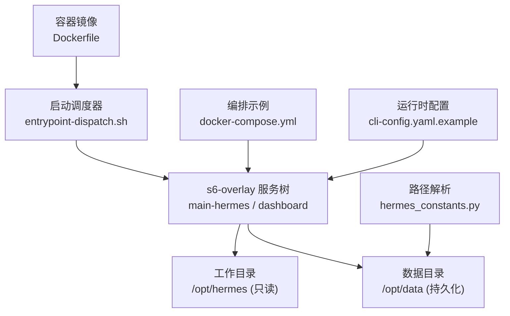
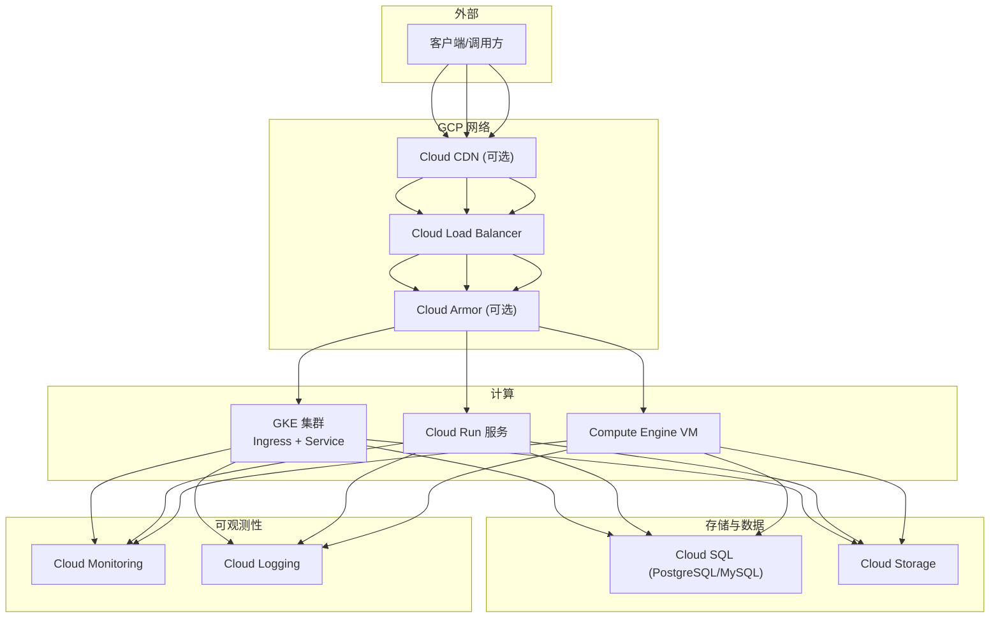
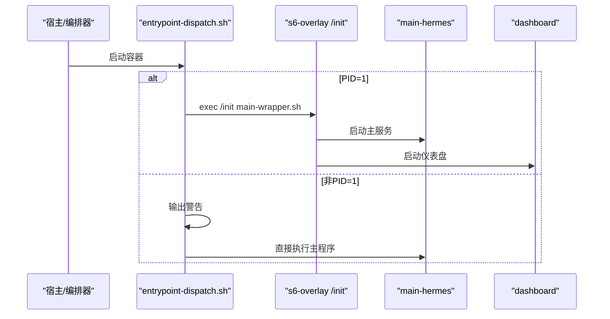
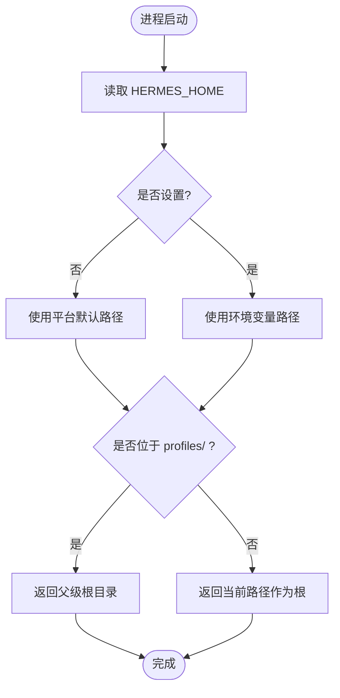
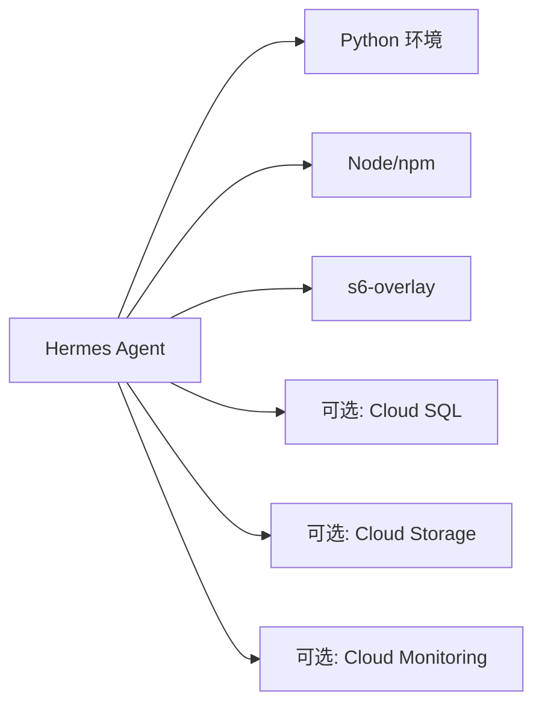

# Google Cloud 部署

<cite>
**本文引用的文件**
- [Dockerfile](file://Dockerfile)
- [docker-compose.yml](file://docker-compose.yml)
- [entrypoint-dispatch.sh](file://docker/entrypoint-dispatch.sh)
- [cli-config.yaml.example](file://cli-config.yaml.example)
- [hermes_constants.py](file://hermes_constants.py)
</cite>

## 目录
1. [简介](#简介)
2. [项目结构](#项目结构)
3. [核心组件](#核心组件)
4. [架构总览](#架构总览)
5. [详细组件分析](#详细组件分析)
6. [依赖关系分析](#依赖关系分析)
7. [性能与成本优化](#性能与成本优化)
8. [安全与合规](#安全与合规)
9. [故障排除指南](#故障排除指南)
10. [结论](#结论)
11. [附录：GCP 部署清单](#附录gcp-部署清单)

## 简介
本文件面向在 Google Cloud Platform (GCP) 上部署 Hermes Agent 的工程团队，提供从 Compute Engine、Cloud Run 到 GKE 的完整部署方案，涵盖网络、IAM、存储、数据库、监控、负载均衡与安全加固。文档同时给出可操作的配置要点、架构图与排错指引，帮助快速落地并稳定运行。

## 项目结构
Hermes Agent 以容器镜像为核心交付物，使用 s6-overlay 进行进程管理，并通过环境变量与配置文件驱动运行时行为。关键入口与数据路径如下：
- 容器镜像构建与运行时由 Dockerfile 定义，包含 Python/Node 依赖、s6-overlay 服务编排、只读代码层与可写数据卷 /opt/data。
- 启动调度器 entrypoint-dispatch.sh 负责 PID 1 场景判断，选择 s6-overlay 或直启模式。
- docker-compose.yml 演示了 gateway 与 dashboard 双服务的编排方式，默认绑定 localhost 的 dashboard 与 host 网络的 gateway。
- 运行时配置通过 cli-config.yaml.example 与环境变量（如 HERMES_HOME）控制；HERMES_HOME 默认映射至 /opt/data。

图表来源
- [Dockerfile:1-458](file://Dockerfile#L1-L458)
- [entrypoint-dispatch.sh:1-26](file://docker/entrypoint-dispatch.sh#L1-L26)
- [docker-compose.yml:1-77](file://docker-compose.yml#L1-L77)
- [hermes_constants.py:114-199](file://hermes_constants.py#L114-L199)

章节来源
- [Dockerfile:1-458](file://Dockerfile#L1-L458)
- [docker-compose.yml:1-77](file://docker-compose.yml#L1-L77)
- [entrypoint-dispatch.sh:1-26](file://docker/entrypoint-dispatch.sh#L1-L26)
- [hermes_constants.py:114-199](file://hermes_constants.py#L114-L199)

## 核心组件
- 容器运行时与进程管理：基于 s6-overlay 的多服务模型，主服务 main-hermes 与 dashboard 作为独立子进程被统一监管，支持优雅重启与日志采集。
- 启动流程：entrypoint-dispatch.sh 检测是否为 PID 1，若是则交由 s6-overlay /init 接管；否则直接执行 stage2 初始化与主程序包装脚本。
- 数据与配置：HERMES_HOME 指向 /opt/data，所有会话、缓存、技能与插件状态落盘于此；配置可通过 YAML 与环境变量注入。
- 平台适配：gateway 提供多平台接入能力（如 Teams、Google Chat 等），通过环境变量启用与鉴权。

章节来源
- [Dockerfile:93-147](file://Dockerfile#L93-L147)
- [Dockerfile:336-357](file://Dockerfile#L336-L357)
- [Dockerfile:424-457](file://Dockerfile#L424-L457)
- [entrypoint-dispatch.sh:1-26](file://docker/entrypoint-dispatch.sh#L1-L26)
- [docker-compose.yml:29-77](file://docker-compose.yml#L29-L77)
- [cli-config.yaml.example:1-120](file://cli-config.yaml.example#L1-L120)
- [hermes_constants.py:114-199](file://hermes_constants.py#L114-L199)

## 架构总览
下图展示 Hermes Agent 在 GCP 上的典型部署拓扑：外部流量经 Cloud Load Balancing 进入 GKE Ingress 或 Cloud Run 服务，网关暴露 OpenAI 兼容 API；Dashboard 仅内网访问；后端可选连接 Cloud SQL 与 Cloud Storage；指标与日志通过 Cloud Monitoring 收集。

[此图为概念性架构示意，不直接映射具体源码文件]

## 详细组件分析

### 容器镜像与进程生命周期
- 镜像分层：系统依赖、Python/Node 依赖、前端构建产物、源代码、s6-overlay 服务注册、阶段二初始化脚本。
- 进程模型：s6-overlay 作为 PID 1，统一管理 main-hermes 与 dashboard；非 PID 1 场景下回退为直接执行主程序。
- 权限与用户：默认创建 hermes 用户，数据目录 /opt/data 持久化；通过环境变量调整 UID/GID。

图表来源
- [entrypoint-dispatch.sh:1-26](file://docker/entrypoint-dispatch.sh#L1-L26)
- [Dockerfile:424-457](file://Dockerfile#L424-L457)

章节来源
- [Dockerfile:93-147](file://Dockerfile#L93-L147)
- [Dockerfile:336-357](file://Dockerfile#L336-L357)
- [Dockerfile:424-457](file://Dockerfile#L424-L457)
- [entrypoint-dispatch.sh:1-26](file://docker/entrypoint-dispatch.sh#L1-L26)

### 数据与配置路径
- 工作目录：/opt/hermes（只读），存放应用代码与依赖。
- 数据目录：/opt/data（持久化），存放会话、缓存、技能、插件与配置。
- 路径解析：HERMES_HOME 决定根路径；当位于 profiles/<name> 时自动识别根目录。

图表来源
- [hermes_constants.py:114-199](file://hermes_constants.py#L114-L199)

章节来源
- [hermes_constants.py:114-199](file://hermes_constants.py#L114-L199)

### 编排与服务发现
- Compose 示例：gateway 使用 host 网络暴露端口，dashboard 仅监听 127.0.0.1，避免公网暴露风险。
- 环境变量：API_SERVER_HOST/API_SERVER_KEY 用于开启 OpenAI 兼容 API 服务；Teams/Google Chat 等平台凭据通过环境变量注入。
- 数据卷：~/.hermes 映射至 /opt/data，保证跨重启持久化。

章节来源
- [docker-compose.yml:1-77](file://docker-compose.yml#L1-L77)

## 依赖关系分析
- 运行时依赖：Python 解释器与 venv、Node.js/npm、s6-overlay、SQLite（固定版本）。
- 外部集成：OpenAI 兼容 API、各平台网关（Teams、Google Chat 等）、可选的 Cloud SQL/Storage/Monitoring。
- 配置依赖：YAML 配置与环境变量共同决定行为，优先级遵循“环境变量 > 配置项”的原则。

[此图为概念性依赖图，不直接映射具体源码文件]

## 性能与成本优化
- 机器类型选择（Compute Engine）
  - CPU 密集型：C2/C3 系列；GPU 任务：A100/T4 按需实例。
  - 结合自动伸缩与预留实例降低峰值成本。
- 自动伸缩策略（Cloud Run）
  - 基于请求并发与延迟目标设置最小/最大实例数；冷启动优化建议预置健康检查与预热请求。
- GKE 节点池
  - 使用 Autopilot 或标准集群+HPA/VPA；按负载拆分 CPU/内存节点池；启用节点自动扩缩容。
- 存储与数据库
  - Cloud SQL 选择合适规格与备份策略；对象存储使用冷热分层与生命周期规则。
- 监控与告警
  - 通过 Cloud Monitoring 采集应用指标与系统指标；设置错误率、延迟、资源利用率阈值告警。

[本节为通用指导，不直接引用具体源码文件]

## 安全与合规
- IAM 权限最小化
  - 为服务账号分配最小必要权限；使用 Workload Identity（GKE）或托管身份（Cloud Run）替代密钥。
- VPC 与防火墙
  - 私有子网部署；仅开放必要端口；使用 VPC 流日志与防火墙规则限制入站/出站。
- 密钥管理
  - 使用 Secret Manager 管理敏感信息；容器启动时通过挂载或环境变量注入。
- 网络安全
  - 启用 Cloud Armor WAF；对 Dashboard 仅允许内网或跳板机访问；对外 API 强制 HTTPS 与鉴权。
- 审计与合规
  - 开启 Cloud Audit Logs；定期审查权限与网络策略。

[本节为通用指导，不直接引用具体源码文件]

## 故障排除指南
- 启动失败
  - 检查 entrypoint-dispatch.sh 是否以 PID 1 运行；若非 PID 1，将看到回退警告。
  - 确认 s6-overlay 服务已正确注册；查看 main-hermes 与 dashboard 日志。
- 数据丢失或权限问题
  - 确认 /opt/data 已持久化且权限正确；HERMES_UID/HERMES_GID 与宿主机一致。
- 配置未生效
  - 核对 cli-config.yaml.example 中的键值与环境变量优先级；确保 HERMES_HOME 指向预期路径。
- 平台网关无法连接
  - 检查对应平台的环境变量与凭据；确认网络可达与防火墙放行。

章节来源
- [entrypoint-dispatch.sh:1-26](file://docker/entrypoint-dispatch.sh#L1-L26)
- [docker-compose.yml:13-27](file://docker-compose.yml#L13-L27)
- [cli-config.yaml.example:1-120](file://cli-config.yaml.example#L1-L120)
- [hermes_constants.py:114-199](file://hermes_constants.py#L114-L199)

## 结论
Hermes Agent 以容器化与 s6-overlay 进程管理为核心，具备灵活的配置与扩展能力。在 GCP 上，可根据业务规模选择 Compute Engine、Cloud Run 或 GKE 部署，并结合 Cloud SQL、Cloud Storage、Cloud Monitoring 与负载均衡/CDN/WAF 构建高可用、可扩展、安全的解决方案。通过最小权限、私有网络与密钥管理等最佳实践，保障生产环境的稳定性与合规性。

## 附录：GCP 部署清单
- Compute Engine
  - 机器类型：根据负载选择 CPU/GPU 实例；启用自动重启与快照。
  - 启动脚本：安装 Docker、拉取镜像、设置环境变量与数据卷挂载。
  - 磁盘扩展：使用动态扩容或附加数据盘；将 /opt/data 置于持久盘。
- Cloud Run
  - 服务配置：设置容器镜像、CPU/内存、超时与并发上限。
  - 环境变量：注入 API 密钥、平台凭据与监控端点。
  - 自动伸缩：基于 QPS/延迟目标设置最小/最大实例。
- GKE
  - 集群创建：选择区域/多区域；启用网络策略与 Pod 安全策略。
  - 节点池：CPU/内存分离；启用自动扩缩容与抢占式实例降低成本。
  - 服务发现：使用 Ingress 与 Service；配置域名与证书。
- IAM
  - 服务账号：最小权限；Workload Identity 绑定到 Pod/ServiceAccount。
  - 角色：Secret Manager Reader、Cloud SQL Client、Storage Object Viewer 等按需授予。
- VPC 与防火墙
  - 子网划分：公共/私有；仅开放必要端口。
  - 规则：入站限制来源 IP；出站限制外网访问。
- 数据库与存储
  - Cloud SQL：选择引擎与规格；启用备份与只读副本。
  - Cloud Storage：桶策略与生命周期；读写权限最小化。
- 监控与日志
  - Cloud Monitoring：自定义指标与仪表板；告警策略。
  - Cloud Logging：结构化日志；集中检索与分析。
- 负载均衡与加速
  - Cloud Load Balancing：HTTP(S)/TCP 负载均衡；健康检查。
  - Cloud CDN：静态资源缓存；边缘加速。
  - Cloud Armor：WAF 规则；DDoS 防护。
- 函数与工作流
  - Cloud Functions：事件驱动处理；与 Pub/Sub 集成。
  - Cloud Workflows：编排多步骤任务；错误重试与补偿。
  - Pub/Sub：消息队列；解耦服务间通信。
- 成本优化
  - 承诺使用折扣：长期稳定的工作负载使用 Committed Use Discounts。
  - 自动缩容：低峰期降至最小实例；利用 Spot 实例降低成本。
- 安全最佳实践
  - 密钥管理：Secret Manager 管理；运行时注入。
  - 网络安全：私有子网、最小暴露面、加密传输。
- 故障排除
  - 启动与进程：检查 entrypoint 与 s6-overlay 服务状态。
  - 数据与权限：验证 /opt/data 挂载与权限。
  - 配置与网络：核对配置键值与防火墙规则。

[本节为操作清单，不直接引用具体源码文件]