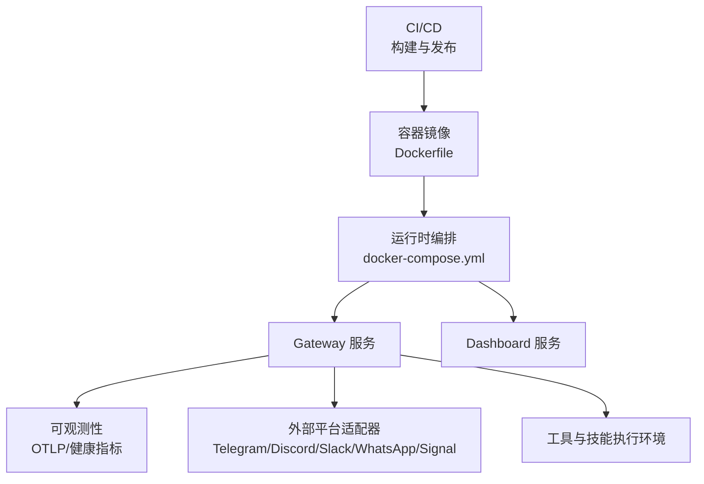
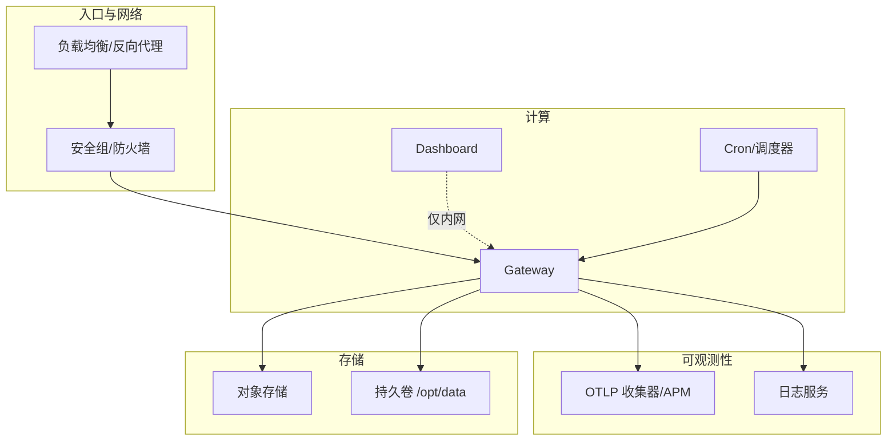
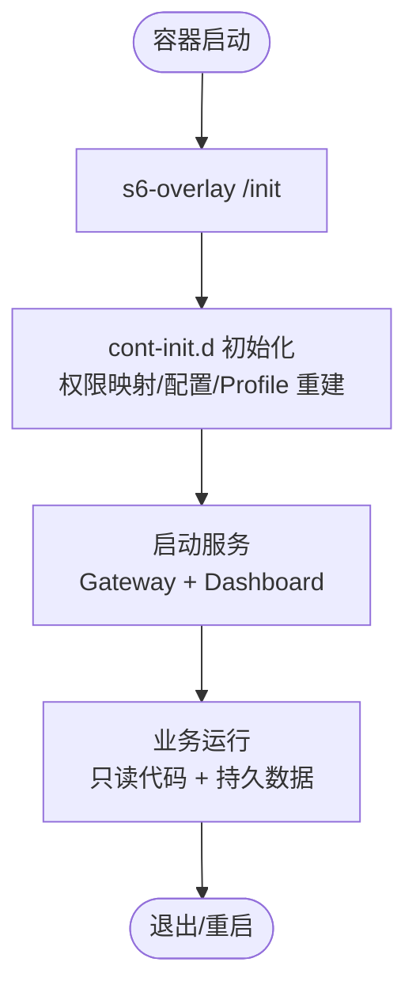
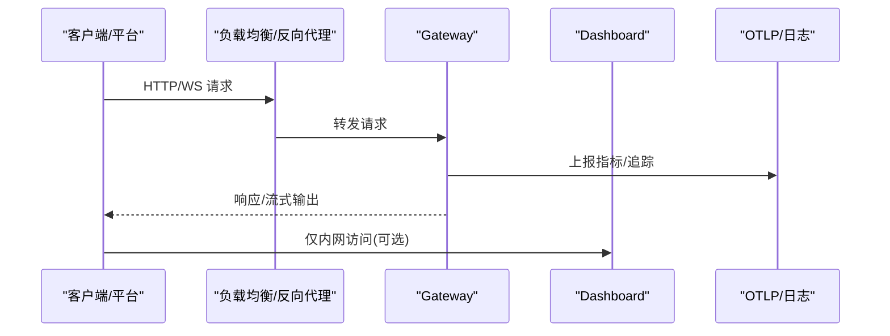
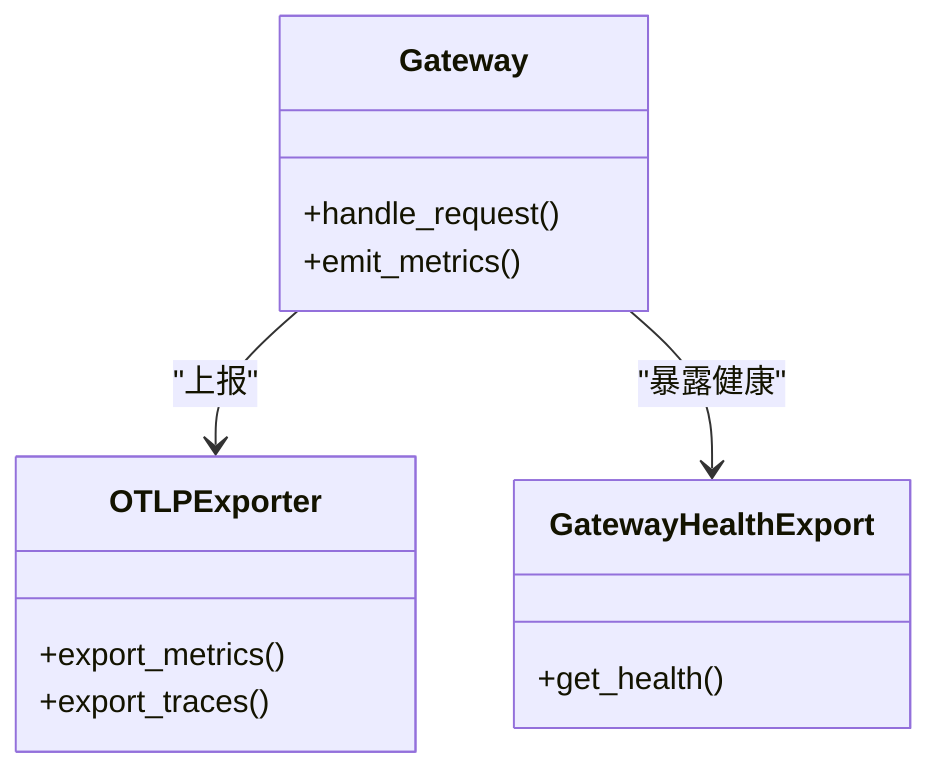
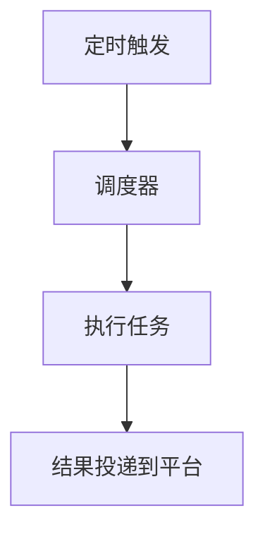
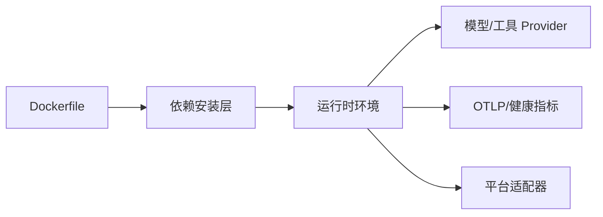

# 云平台部署

<cite>
**本文引用的文件**
- [Dockerfile](file://Dockerfile)
- [docker-compose.yml](file://docker-compose.yml)
- [.github/workflows/docker.yml](file://.github/workflows/docker.yml)
- [README.md](file://README.md)
- [gateway/config.py](file://gateway/config.py)
- [hermes_cli/config.py](file://hermes_cli/config.py)
- [agent/monitoring/otlp_exporter.py](file://agent/monitoring/otlp_exporter.py)
- [agent/monitoring/gateway_health_export.py](file://agent/monitoring/gateway_health_export.py)
- [cron/scheduler_provider.py](file://cron/scheduler_provider.py)
- [hermes_cli/platforms.py](file://hermes_cli/platforms.py)
</cite>

## 目录
1. [简介](#简介)
2. [项目结构](#项目结构)
3. [核心组件](#核心组件)
4. [架构总览](#架构总览)
5. [详细组件分析](#详细组件分析)
6. [依赖关系分析](#依赖关系分析)
7. [性能与成本优化](#性能与成本优化)
8. [故障排查指南](#故障排查指南)
9. [结论](#结论)
10. [附录：各云平台部署方案](#附录各云平台部署方案)

## 简介
本文件面向在主流云平台（AWS、Google Cloud、Azure、阿里云、腾讯云等）上部署 Hermes Agent 的运维与平台工程团队。文档基于仓库内提供的容器镜像构建、编排与可观测性能力，给出跨云的高可用、弹性伸缩、安全组与网络拓扑、无服务器集成、对象存储使用、监控日志集成、成本优化策略以及基础设施即代码实践建议。所有技术细节均以仓库中实际存在的配置与实现为依据，避免臆测。

## 项目结构
Hermes Agent 提供容器化运行能力与多平台网关服务，适合以容器或函数计算形态部署到各类云平台。关键资产包括：
- 容器镜像构建：通过 Dockerfile 定义多阶段构建、依赖预装、s6-overlay 进程管理、只读代码层与持久数据卷分离。
- 编排示例：docker-compose.yml 提供 gateway 与 dashboard 双服务，默认绑定本地回环地址，便于反向代理与安全暴露。
- CI/CD：GitHub Actions 流水线完成多架构镜像构建、测试与发布，支持按 digest 推送与 manifest list 合并。
- 可观测性：内置 OTLP 导出器与健康指标导出，便于接入云厂商的 APM/日志/指标系统。
- 调度与平台适配：内置 cron 调度与平台抽象，便于对接云原生定时任务与事件总线。

图表来源
- [Dockerfile:1-458](file://Dockerfile#L1-L458)
- [docker-compose.yml:1-77](file://docker-compose.yml#L1-L77)
- [.github/workflows/docker.yml:1-290](file://.github/workflows/docker.yml#L1-L290)

章节来源
- [Dockerfile:1-458](file://Dockerfile#L1-L458)
- [docker-compose.yml:1-77](file://docker-compose.yml#L1-L77)
- [.github/workflows/docker.yml:1-290](file://.github/workflows/docker.yml#L1-L290)
- [README.md:1-265](file://README.md#L1-L265)

## 核心组件
- 容器运行时与进程管理
  - 使用 s6-overlay 作为 PID 1，负责主进程、dashboard 与 per-profile gateway 的生命周期管理与子进程回收。
  - 代码层只读，数据层 /opt/data 持久化；通过 cont-init.d 脚本进行权限映射、配置初始化与 profile 重建。
- Gateway 与 Dashboard
  - Gateway 承载消息通道与工具执行；Dashboard 提供本地管理界面，默认仅监听 127.0.0.1。
- 可观测性
  - OTLP 导出器用于指标/追踪上报；Gateway 健康导出器暴露健康状态供采集。
- 调度与平台
  - Cron 调度器与平台抽象，便于对接云原生定时任务与事件驱动架构。

章节来源
- [Dockerfile:93-157](file://Dockerfile#L93-L157)
- [Dockerfile:336-358](file://Dockerfile#L336-L358)
- [docker-compose.yml:29-77](file://docker-compose.yml#L29-L77)
- [agent/monitoring/otlp_exporter.py](file://agent/monitoring/otlp_exporter.py)
- [agent/monitoring/gateway_health_export.py](file://agent/monitoring/gateway_health_export.py)
- [cron/scheduler_provider.py](file://cron/scheduler_provider.py)

## 架构总览
下图展示 Hermes Agent 在云平台中的典型部署拓扑：入口流量经负载均衡/反向代理进入 Gateway，Dashboard 仅内部访问；指标与日志通过 OTLP 上报至云 APM/日志系统；对象存储用于会话与技能资源；调度器触发周期性任务。

图表来源
- [docker-compose.yml:29-77](file://docker-compose.yml#L29-L77)
- [agent/monitoring/otlp_exporter.py](file://agent/monitoring/otlp_exporter.py)
- [agent/monitoring/gateway_health_export.py](file://agent/monitoring/gateway_health_export.py)
- [Dockerfile:378-393](file://Dockerfile#L378-L393)

## 详细组件分析

### 容器镜像与进程管理
- 多阶段构建：固定 SQLite 版本、安装 Node/Python 依赖、预编译前端资源，确保镜像稳定且体积可控。
- s6-overlay：替代 tini，提供健壮的服务监督树；入口分派器兼容不同平台的 PID 1 约束。
- 权限与数据：非 root 用户 hermes；/opt/hermes 只读，/opt/data 持久化；lazy-packages 重定向到数据卷避免破坏 venv。
- 环境变量：HERMES_HOME、HERMES_TUI_DIR、HERMES_WEB_DIST、HERMES_LAZY_INSTALL_TARGET 等控制行为。

图表来源
- [Dockerfile:93-157](file://Dockerfile#L93-L157)
- [Dockerfile:336-358](file://Dockerfile#L336-L358)
- [Dockerfile:378-422](file://Dockerfile#L378-L422)

章节来源
- [Dockerfile:1-458](file://Dockerfile#L1-L458)

### Gateway 与 Dashboard 编排
- Gateway：默认 host 模式，可通过环境变量启用 API Server（需密钥认证），并支持 Teams/Google Chat 等通道。
- Dashboard：仅监听 127.0.0.1，推荐通过 SSH 隧道或反向代理暴露。
- 数据卷：~/.hermes 映射到 /opt/data，保证会话、配置与技能持久化。

图表来源
- [docker-compose.yml:29-77](file://docker-compose.yml#L29-L77)
- [agent/monitoring/otlp_exporter.py](file://agent/monitoring/otlp_exporter.py)

章节来源
- [docker-compose.yml:1-77](file://docker-compose.yml#L1-L77)

### 可观测性与日志
- OTLP 导出器：将指标与追踪数据发送到 OTLP 接收端（如云 APM）。
- Gateway 健康导出：暴露健康状态，便于探针与告警。
- 日志：容器标准输出由 s6 管理，可被宿主或平台日志系统采集。

图表来源
- [agent/monitoring/otlp_exporter.py](file://agent/monitoring/otlp_exporter.py)
- [agent/monitoring/gateway_health_export.py](file://agent/monitoring/gateway_health_export.py)

章节来源
- [agent/monitoring/otlp_exporter.py](file://agent/monitoring/otlp_exporter.py)
- [agent/monitoring/gateway_health_export.py](file://agent/monitoring/gateway_health_export.py)

### 调度与平台抽象
- Cron 调度器：支持周期性任务与投递到各平台。
- 平台抽象：统一接口屏蔽底层差异，便于扩展新平台。

图表来源
- [cron/scheduler_provider.py](file://cron/scheduler_provider.py)

章节来源
- [cron/scheduler_provider.py](file://cron/scheduler_provider.py)

## 依赖关系分析
- 构建依赖：Node、Python、SQLite、s6-overlay、Playwright 浏览器等。
- 运行时依赖：OpenAI/Anthropic/Bedrock/Azure Identity 等 provider 包按需启用；Matrix/Messaging 额外依赖已预装。
- 外部集成：OTLP 收集器、对象存储（通过 provider）、平台适配器（Telegram/Discord/Slack/WhatsApp/Signal）。

图表来源
- [Dockerfile:222-267](file://Dockerfile#L222-L267)
- [Dockerfile:269-276](file://Dockerfile#L269-L276)

章节来源
- [Dockerfile:222-267](file://Dockerfile#L222-L267)
- [Dockerfile:269-276](file://Dockerfile#L269-L276)

## 性能与成本优化
- 镜像分层与缓存：依赖安装与前端构建独立分层，减少冷构建时间。
- 只读代码与持久数据：避免运行时写锁与权限问题，提升并发稳定性。
- 懒加载依赖：lazy-packages 指向数据卷，避免破坏 venv 且按需安装。
- 最小化 extra：生产镜像仅包含必要 extras，降低镜像体积与攻击面。
- 多架构构建：amd64/arm64 并行构建与发布，适配不同实例规格。

章节来源
- [Dockerfile:171-204](file://Dockerfile#L171-L204)
- [Dockerfile:222-267](file://Dockerfile#L222-L267)
- [Dockerfile:378-393](file://Dockerfile#L378-L393)
- [.github/workflows/docker.yml:33-84](file://.github/workflows/docker.yml#L33-L84)

## 故障排查指南
- 容器入口与 PID 1：若平台包装了 entrypoint，分派器会降级为直接执行 stage2-hook + main-wrapper，确保前台命令仍可工作。
- 权限问题：通过 HERMES_UID/HERMES_GID 映射宿主用户，避免文件所有权不一致。
- 端口与网络：Dashboard 仅监听 127.0.0.1；如需远程访问请使用 SSH 隧道或反向代理，不要直接暴露 0.0.0.0。
- 日志与指标：检查 OTLP 端点可达性与鉴权；确认健康导出是否被采集。
- 依赖缺失：确认所需 extra（如 messaging、otlp、provider 包）已在构建时启用。

章节来源
- [Dockerfile:424-457](file://Dockerfile#L424-L457)
- [docker-compose.yml:13-27](file://docker-compose.yml#L13-L27)
- [docker-compose.yml:63-77](file://docker-compose.yml#L63-L77)
- [agent/monitoring/otlp_exporter.py](file://agent/monitoring/otlp_exporter.py)

## 结论
Hermes Agent 以容器为核心交付物，具备完善的进程管理、可观测性与跨平台适配器，适合在各类云平台上以容器或函数计算形态部署。结合负载均衡、安全组、对象存储与云 APM/日志服务，可实现高可用、弹性伸缩与成本优化的生产级部署。

## 附录：各云平台部署方案

### AWS
- 计算与编排
  - ECS/Fargate：将 docker-compose 服务映射为任务定义，Gateway 暴露 80/443 端口，Dashboard 仅内网。
  - EC2：使用 systemd 或容器引擎运行 compose 服务，注意 SELinux/AppArmor 与端口占用。
- 网络与安全组
  - 入站：仅开放 80/443 到负载均衡；出站：允许 HTTPS 到模型提供商与 OTLP 收集器。
  - 使用 VPC 私有子网承载 Gateway，仅通过 NAT 出站。
- 对象存储与密钥
  - S3 用于会话/技能资源；Secrets Manager 或 Parameter Store 注入凭据。
- 监控与日志
  - CloudWatch Logs 采集标准输出；CloudWatch APM 或第三方 APM 通过 OTLP 接入。
- 弹性伸缩
  - Auto Scaling 基于 CPU/自定义指标（如队列长度）扩缩容；Gateway 无状态设计利于水平扩展。
- 无服务器选项
  - Lambda + API Gateway：将短生命周期任务封装为函数，通过事件桥接调用 Gateway 或工具链。
- CLI 与 IaC
  - AWS CLI/SDK + Terraform 或 CDK 管理资源；CI/CD 复用仓库的 Docker 构建流程。

章节来源
- [docker-compose.yml:29-77](file://docker-compose.yml#L29-L77)
- [Dockerfile:378-393](file://Dockerfile#L378-L393)
- [agent/monitoring/otlp_exporter.py](file://agent/monitoring/otlp_exporter.py)

### Google Cloud
- 计算与编排
  - Cloud Run：单进程 Gateway 部署，设置最大实例数与超时；Dashboard 仅内网或通过 Cloud Run Ingress。
  - GKE：使用 Deployment/Service 编排 Gateway 与 Dashboard，Ingress 暴露入口。
- 网络与安全
  - 防火墙规则限制入站端口；出站允许 HTTPS 到模型提供商与 OTLP。
- 对象存储与密钥
  - GCS 存储会话/技能；Secret Manager 注入凭据。
- 监控与日志
  - Cloud Logging 采集标准输出；Cloud Monitoring 或第三方 APM 通过 OTLP 接入。
- 弹性伸缩
  - Cloud Run 自动扩缩；GKE HPA 基于 CPU/自定义指标。
- 无服务器选项
  - Cloud Functions/Workflows：处理事件与短任务，调用 Gateway 或工具链。
- CLI 与 IaC
  - gcloud + Terraform/Deployment Manager；复用仓库的 Docker 构建流程。

章节来源
- [docker-compose.yml:29-77](file://docker-compose.yml#L29-L77)
- [Dockerfile:378-393](file://Dockerfile#L378-L393)
- [agent/monitoring/otlp_exporter.py](file://agent/monitoring/otlp_exporter.py)

### Azure
- 计算与编排
  - Azure Container Instances：快速部署单实例 Gateway；AKS 用于生产集群。
  - App Service for Containers：适合 Web 型入口，注意超时与内存限制。
- 网络与安全
  - NSG 限制入站端口；VNet 隔离 Gateway；出站允许 HTTPS。
- 对象存储与密钥
  - Blob Storage 存储会话/技能；Key Vault 注入凭据。
- 监控与日志
  - Application Insights 或第三方 APM 通过 OTLP 接入；Log Analytics 采集标准输出。
- 弹性伸缩
  - AKS HPA/VPA；ACI 基于事件扩缩。
- 无服务器选项
  - Azure Functions：处理事件与短任务，调用 Gateway 或工具链。
- CLI 与 IaC
  - az CLI + Bicep/Terraform；复用仓库的 Docker 构建流程。

章节来源
- [docker-compose.yml:29-77](file://docker-compose.yml#L29-L77)
- [Dockerfile:378-393](file://Dockerfile#L378-L393)
- [agent/monitoring/otlp_exporter.py](file://agent/monitoring/otlp_exporter.py)

### 阿里云
- 计算与编排
  - ACK（容器服务 Kubernetes 版）：Deployment/Service 编排 Gateway 与 Dashboard。
  - 函数计算 FC：短生命周期任务通过事件驱动调用 Gateway 或工具链。
- 网络与安全
  - 安全组限制入站端口；VPC 隔离；出站允许 HTTPS。
- 对象存储与密钥
  - OSS 存储会话/技能；KMS/Secrets Manager 注入凭据。
- 监控与日志
  - ARMS 或第三方 APM 通过 OTLP 接入；SLS 采集标准输出。
- 弹性伸缩
  - HPA/VPA；FC 自动扩缩。
- CLI 与 IaC
  - aliyun CLI + Terraform/ROS；复用仓库的 Docker 构建流程。

章节来源
- [docker-compose.yml:29-77](file://docker-compose.yml#L29-L77)
- [Dockerfile:378-393](file://Dockerfile#L378-L393)
- [agent/monitoring/otlp_exporter.py](file://agent/monitoring/otlp_exporter.py)

### 腾讯云
- 计算与编排
  - TKE（容器服务）：Deployment/Service 编排 Gateway 与 Dashboard。
  - 函数 SCF：短生命周期任务通过事件驱动调用 Gateway 或工具链。
- 网络与安全
  - 安全组限制入站端口；VPC 隔离；出站允许 HTTPS。
- 对象存储与密钥
  - COS 存储会话/技能；KMS/Secrets Manager 注入凭据。
- 监控与日志
  - APM 或第三方 APM 通过 OTLP 接入；CLS 采集标准输出。
- 弹性伸缩
  - HPA/VPA；SCF 自动扩缩。
- CLI 与 IaC
  - tencentcloud CLI + Terraform/CDK；复用仓库的 Docker 构建流程。

章节来源
- [docker-compose.yml:29-77](file://docker-compose.yml#L29-L77)
- [Dockerfile:378-393](file://Dockerfile#L378-L393)
- [agent/monitoring/otlp_exporter.py](file://agent/monitoring/otlp_exporter.py)

### 无服务器部署与函数计算集成
- 适用场景：短生命周期任务（数据处理、回调、定时任务）；长连接交互仍建议容器化 Gateway。
- 集成方式：通过事件总线（如 SNS/SQS、EventBridge、Pub/Sub、Event Grid、事件总线）触发函数，函数调用 Gateway 的 API 或工具链。
- 注意事项：超时、内存、冷启动；幂等性与重试；凭据通过密钥管理服务注入。

章节来源
- [cron/scheduler_provider.py](file://cron/scheduler_provider.py)
- [agent/monitoring/otlp_exporter.py](file://agent/monitoring/otlp_exporter.py)

### 对象存储使用
- 用途：会话历史、技能资源、临时文件；通过 provider 抽象访问不同云的对象存储。
- 最佳实践：加密静态数据；设置生命周期策略；最小权限原则。

章节来源
- [Dockerfile:378-393](file://Dockerfile#L378-L393)

### 监控与日志集成
- 指标与追踪：通过 OTLP 导出器上报到云 APM 或第三方系统。
- 日志：容器标准输出由平台日志服务采集；建议结构化日志以便检索。
- 健康检查：Gateway 健康导出器暴露健康状态，用于探针与告警。

章节来源
- [agent/monitoring/otlp_exporter.py](file://agent/monitoring/otlp_exporter.py)
- [agent/monitoring/gateway_health_export.py](file://agent/monitoring/gateway_health_export.py)

### 高可用与灾备
- 多副本与负载均衡：Gateway 无状态，水平扩展；Dashboard 单副本即可。
- 数据持久化：/opt/data 挂载到云盘或对象存储；定期备份。
- 故障转移：健康检查与自动重启；跨可用区部署。

章节来源
- [docker-compose.yml:29-77](file://docker-compose.yml#L29-L77)
- [Dockerfile:378-393](file://Dockerfile#L378-L393)

### 弹性伸缩配置
- 容器编排：HPA/VPA 基于 CPU/内存/自定义指标；Cloud Run/AKS/GKE/ECS 均支持自动扩缩。
- 函数计算：基于事件速率与并发阈值自动扩缩。

章节来源
- [.github/workflows/docker.yml:33-84](file://.github/workflows/docker.yml#L33-L84)

### CLI 工具与自动化部署
- 使用仓库提供的 Docker 构建与发布流程，结合平台 CLI 与 IaC 工具实现自动化。
- 环境变量与配置：通过平台密钥服务注入敏感信息；配置文件置于持久卷。

章节来源
- [.github/workflows/docker.yml:139-290](file://.github/workflows/docker.yml#L139-L290)
- [docker-compose.yml:29-77](file://docker-compose.yml#L29-L77)

### 基础设施即代码实践
- 模板化：使用 Terraform/CDK/Bicep 描述网络、计算、存储与监控资源。
- 版本化：镜像标签与配置版本化管理；变更评审与回滚策略。
- 安全：最小权限、加密传输与静态数据、审计日志。

章节来源
- [.github/workflows/docker.yml:139-290](file://.github/workflows/docker.yml#L139-L290)