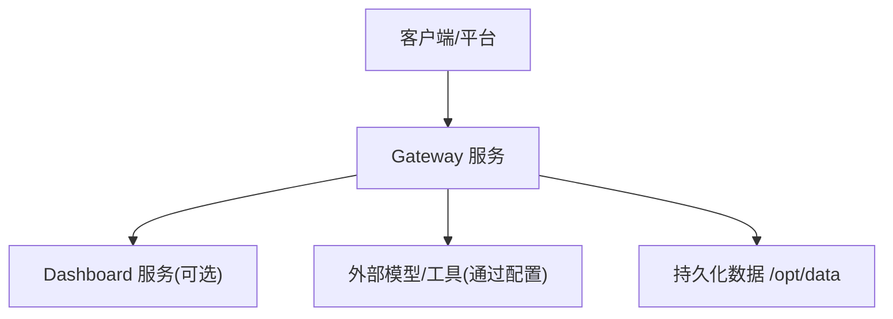
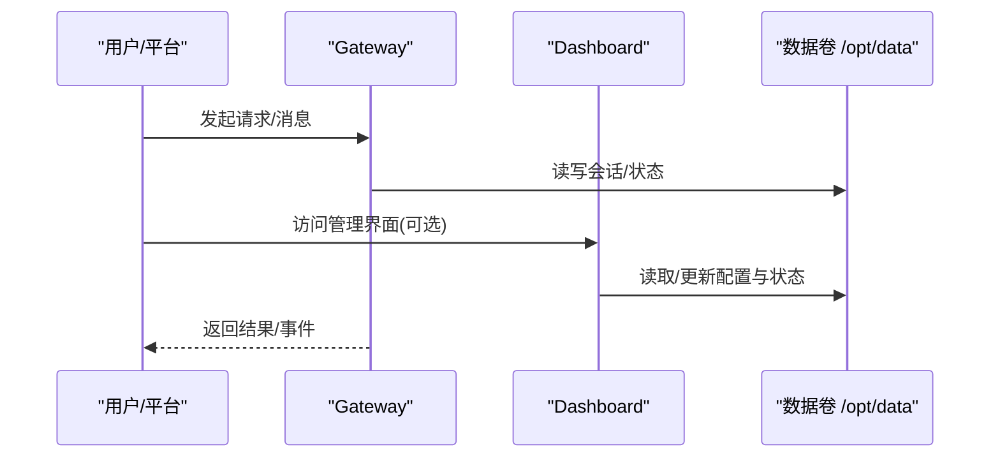
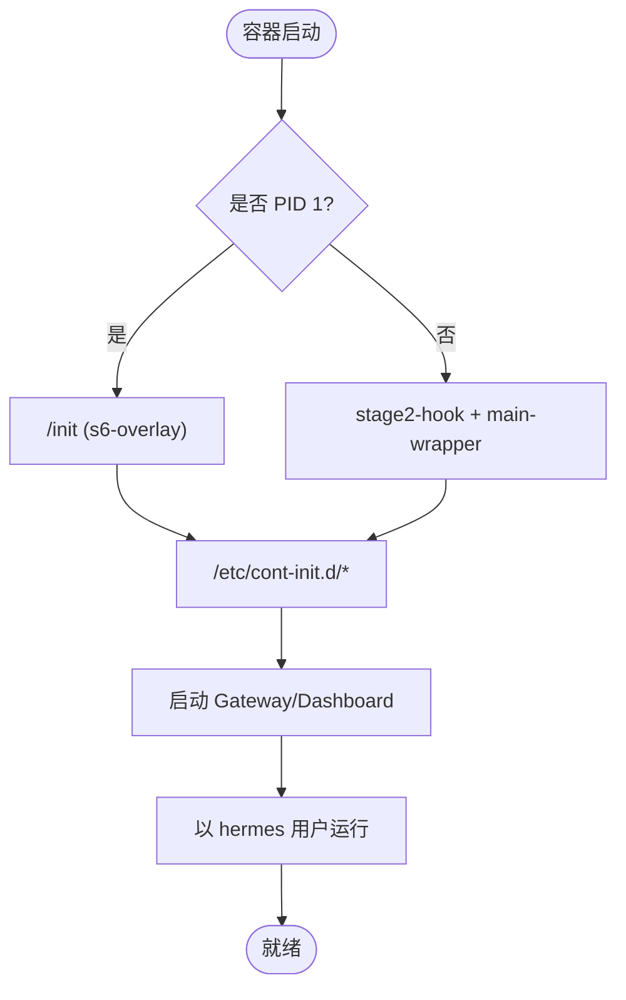
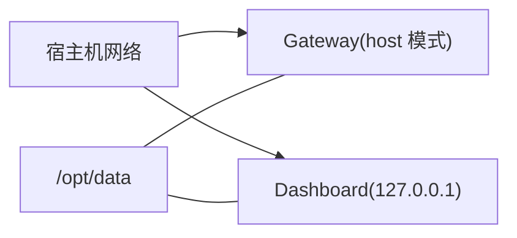
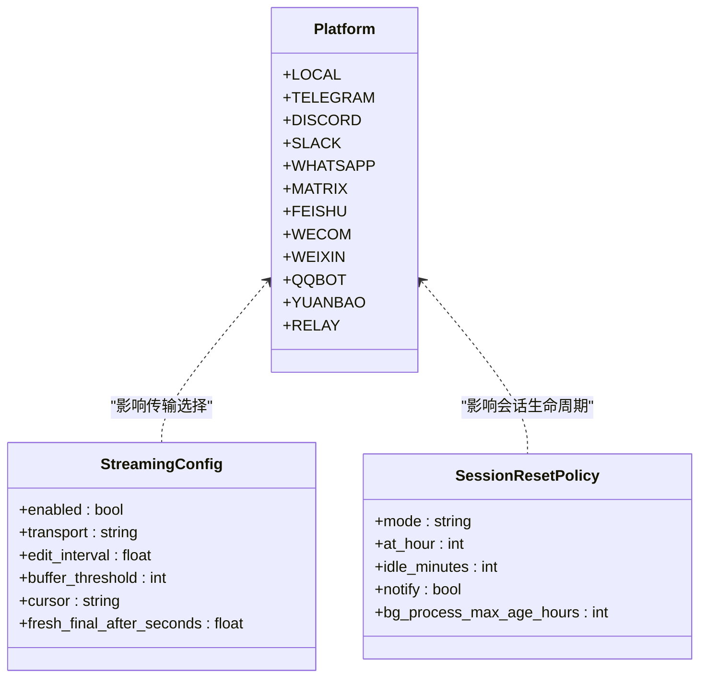
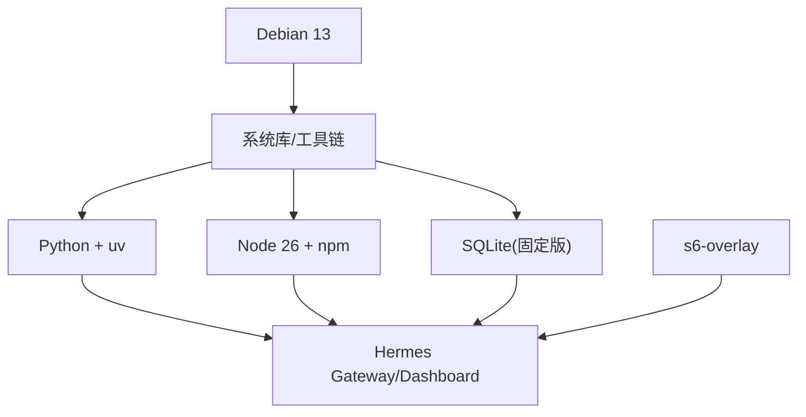

# 国内云平台

<cite>
**本文引用的文件**
- [Dockerfile](file://Dockerfile)
- [docker-compose.yml](file://docker-compose.yml)
- [gateway/config.py](file://gateway/config.py)
</cite>

## 目录
1. [简介](#简介)
2. [项目结构](#项目结构)
3. [核心组件](#核心组件)
4. [架构总览](#架构总览)
5. [详细组件分析](#详细组件分析)
6. [依赖关系分析](#依赖关系分析)
7. [性能考虑](#性能考虑)
8. [故障排查指南](#故障排查指南)
9. [结论](#结论)
10. [附录](#附录)

## 简介
本指南面向在国内主流云平台（阿里云、腾讯云、华为云）部署 Hermes Agent 的运维与平台工程团队。文档基于仓库中的容器镜像定义与服务编排，结合网关配置能力，给出 ECS/CVM/弹性云服务器、容器服务（ACK/TKE/CCI）、数据库（RDS/CDB）以及安全、网络、监控、存储、合规与成本优化等方面的落地方案。内容聚焦可操作性与可验证性，所有实现细节均以仓库内文件为依据。

## 项目结构
Hermes Agent 以容器化方式交付，提供 Gateway 与 Dashboard 两个主要服务：
- Gateway：消息通道接入、会话路由、模型调用与工具执行等核心逻辑。
- Dashboard：本地或受控访问的管理界面，默认仅监听本机。

关键构建与运行要素：
- 多阶段 Docker 构建，固定 Node/Python 工具链，预编译前端与 Python 依赖，使用 s6-overlay 进行进程管理。
- docker-compose 编排示例，包含 gateway 与 dashboard 两个服务，数据持久化到 /opt/data。
- 网关配置模块支持平台接入、流式输出、会话重置策略等。

图表来源
- [Dockerfile:52-457](file://Dockerfile#L52-L457)
- [docker-compose.yml:29-77](file://docker-compose.yml#L29-L77)

章节来源
- [Dockerfile:52-457](file://Dockerfile#L52-L457)
- [docker-compose.yml:29-77](file://docker-compose.yml#L29-L77)

## 核心组件
- 容器镜像与运行时
  - 基础系统：Debian 13，安装必要系统库；固定 SQLite 版本并启用 FTS5 等特性。
  - 工具链：Node 26、npm/npx、uv 包管理器、Python 3.13 环境。
  - 进程管理：s6-overlay 作为 PID 1，负责初始化脚本、服务注册与优雅关停。
  - 权限与安全：非 root 用户 hermes，只读代码层，数据卷 /opt/data 可写；提供 exec 降权 shim。
- 服务编排
  - gateway：主服务，暴露 OpenAI 兼容 API（需显式开启并设置密钥），默认 host 模式。
  - dashboard：Web 管理界面，默认绑定 127.0.0.1，建议通过 SSH 隧道或反向代理访问。
- 配置与扩展
  - 网关配置模块支持多平台接入、流式传输模式、会话重置策略、通道覆盖等。

章节来源
- [Dockerfile:52-457](file://Dockerfile#L52-L457)
- [docker-compose.yml:29-77](file://docker-compose.yml#L29-L77)
- [gateway/config.py:272-417](file://gateway/config.py#L272-L417)

## 架构总览
下图展示在容器环境中 Gateway 与 Dashboard 的关系及数据流向。Gateway 负责业务处理与外部集成，Dashboard 用于管理与调试。两者共享同一数据卷 /opt/data。

图表来源
- [docker-compose.yml:30-77](file://docker-compose.yml#L30-L77)
- [Dockerfile:378-422](file://Dockerfile#L378-L422)

## 详细组件分析

### 容器镜像与启动流程
- 构建阶段
  - 固定 SQLite 版本并启用 FTS5、RTREE、UNLOCK_NOTIFY 等特性，确保搜索与并发能力。
  - 安装 s6-overlay 并校验完整性，作为进程监督器。
  - 预装 Node 26 与 npm，构建前端资源；预装 Python 依赖（含 otel、provider extras）。
- 运行阶段
  - 入口点由 entrypoint-dispatch.sh 接管，优先走 s6-overlay 的 /init；若不在 PID 1，则回退到 stage2-hook + main-wrapper。
  - 初始化脚本完成 UID/GID 映射、数据卷 chown、配置注入与技能同步。
  - 非 root 用户 hermes 运行各服务，exec 降权 shim 保证 docker exec 安全。

图表来源
- [Dockerfile:93-147](file://Dockerfile#L93-L147)
- [Dockerfile:336-457](file://Dockerfile#L336-L457)

章节来源
- [Dockerfile:93-147](file://Dockerfile#L93-L147)
- [Dockerfile:336-457](file://Dockerfile#L336-L457)

### 服务编排与端口策略
- Gateway
  - 使用 host 网络模式，便于直接绑定端口或与其他宿主服务通信。
  - 可通过环境变量开启 OpenAI 兼容 API 服务器，必须设置 API_SERVER_KEY。
- Dashboard
  - 默认绑定 127.0.0.1，禁止公网直连；远程访问建议使用 SSH 隧道或反向代理。
- 数据持久化
  - 将 ~/.hermes 挂载到 /opt/data，保存会话、配置与日志等。

图表来源
- [docker-compose.yml:30-77](file://docker-compose.yml#L30-L77)

章节来源
- [docker-compose.yml:30-77](file://docker-compose.yml#L30-L77)

### 网关配置与平台接入
- 平台枚举与动态发现
  - 内置平台包括 Telegram、Discord、Slack、WhatsApp、Matrix、飞书、企业微信等。
  - 支持插件平台动态注册与发现，避免硬编码。
- 端口绑定策略
  - 部分平台需要绑定 TCP 端口（如 webhook、API Server），在单实例多 profile 场景下需避免冲突。
- 流式输出与会话策略
  - 支持 draft/edit/off/auto 多种传输模式，适配不同平台的实时体验。
  - 会话重置策略支持按日、空闲时长、组合或关闭自动重置。

图表来源
- [gateway/config.py:272-394](file://gateway/config.py#L272-L394)
- [gateway/config.py:720-800](file://gateway/config.py#L720-L800)
- [gateway/config.py:485-540](file://gateway/config.py#L485-L540)

章节来源
- [gateway/config.py:272-394](file://gateway/config.py#L272-L394)
- [gateway/config.py:485-540](file://gateway/config.py#L485-L540)
- [gateway/config.py:720-800](file://gateway/config.py#L720-L800)

## 依赖关系分析
- 运行时依赖
  - 系统库：ca-certificates、curl、ffmpeg、gcc/g++、cmake、libffi-dev、libolm-dev 等。
  - 语言栈：Python 3.13 + uv、Node 26 + npm、SQLite（固定版本）。
- 进程监督
  - s6-overlay 负责初始化、服务注册与生命周期管理。
- 数据与权限
  - 代码层只读，数据层 /opt/data 可写；exec 降权保障 docker exec 安全。

图表来源
- [Dockerfile:71-91](file://Dockerfile#L71-L91)
- [Dockerfile:152-167](file://Dockerfile#L152-L167)
- [Dockerfile:265-267](file://Dockerfile#L265-L267)
- [Dockerfile:336-457](file://Dockerfile#L336-L457)

章节来源
- [Dockerfile:71-91](file://Dockerfile#L71-L91)
- [Dockerfile:152-167](file://Dockerfile#L152-L167)
- [Dockerfile:265-267](file://Dockerfile#L265-L267)
- [Dockerfile:336-457](file://Dockerfile#L336-L457)

## 性能考虑
- 构建缓存与分层
  - 先复制 manifest 再安装依赖，最大化利用构建缓存；前端与 Python 依赖分层独立。
- 运行时优化
  - 禁用 Python 字节码写入，减少 I/O；Playwright 浏览器路径置于镜像内，避免卷覆盖导致丢失。
  - 预构建前端资源，跳过运行时 npm install，降低启动抖动。
- 进程管理
  - s6-overlay 非阻塞回收僵尸进程，提升稳定性；exec 降权避免权限问题导致的重试开销。

章节来源
- [Dockerfile:171-204](file://Dockerfile#L171-L204)
- [Dockerfile:269-276](file://Dockerfile#L269-L276)
- [Dockerfile:54-74](file://Dockerfile#L54-L74)
- [Dockerfile:395-420](file://Dockerfile#L395-L420)

## 故障排查指南
- 无法访问 Dashboard
  - 确认未将 Dashboard 绑定到 0.0.0.0；如需远程访问，使用 SSH 隧道或反向代理。
- API 服务器未生效
  - 必须同时设置 API_SERVER_HOST 与 API_SERVER_KEY；否则默认不暴露对外接口。
- 权限与文件归属
  - 使用 HERMES_UID/HERMES_GID 控制宿主与容器用户映射；避免 root 写入导致权限不一致。
- 依赖缺失或网络问题
  - 检查 apt/curl 重试机制与源可达性；Playwright 安装失败会重试三次。
- 进程异常退出
  - 查看 s6-overlay 服务日志；确认 cont-init.d 初始化脚本执行成功。

章节来源
- [docker-compose.yml:13-27](file://docker-compose.yml#L13-L27)
- [docker-compose.yml:38-61](file://docker-compose.yml#L38-L61)
- [Dockerfile:395-420](file://Dockerfile#L395-L420)
- [Dockerfile:199-204](file://Dockerfile#L199-L204)
- [Dockerfile:336-357](file://Dockerfile#L336-L357)

## 结论
Hermes Agent 以容器化与 s6-overlay 为核心，提供稳定、可观测、易编排的运行基座。通过 docker-compose 快速拉起 Gateway 与 Dashboard，配合网关配置模块灵活接入多平台与流式传输。在生产环境，建议结合云平台的安全组、网络隔离、对象存储、监控告警与备份策略，形成完整的部署与运维闭环。

## 附录

### 阿里云部署要点（ECS/ACK/RDS）
- ECS 部署
  - 使用镜像构建产物，挂载 /opt/data 为云盘或 NAS；通过安全组放行必要端口。
  - 如需外网访问，使用负载均衡或反向代理，并将 Dashboard 保持仅内网访问。
- ACK 容器服务
  - 将 Gateway 与 Dashboard 分别部署为 Deployment/StatefulSet；使用 ConfigMap/Secret 注入环境变量。
  - 使用 Ingress 暴露 Gateway API，Dashboard 仅内网访问或通过 VPN/跳板机。
- RDS 数据库
  - 当前镜像默认使用 SQLite 文件存储；如需迁移至 RDS，需在应用层替换存储后端（需二次开发）。
  - 若维持 SQLite，可将数据盘挂载到 Pod 并使用 PVC 持久化。

### 腾讯云部署要点（CVM/TKE/CDB）
- CVM 部署
  - 同 ECS，注意防火墙与安全组规则；推荐通过 Nginx/Ingress 统一入口。
- TKE 容器服务
  - 使用 Helm/Kustomize 管理配置；通过 Secret 管理敏感信息；使用 Service 暴露内部服务。
- CDB 云数据库
  - 与阿里云类似，当前默认 SQLite；如需 CDB，需应用层适配。

### 华为云部署要点（ECS/CCI/RDS）
- ECS 部署
  - 与通用 Linux 部署一致；注意带宽与磁盘 I/O 规划。
- CCI 容器实例
  - 适合无状态任务或短期作业；持久化需借助 OBS 或云盘。
- RDS 关系型数据库
  - 同上，当前默认 SQLite；如需 RDS，需应用层改造。

### 身份认证体系
- 平台接入
  - 通过网关配置模块启用对应平台，并设置 token/api_key；部分平台需回调地址或证书。
- 容器内凭据管理
  - 使用环境变量或挂载 Secret；避免明文写入镜像。
- API 服务器鉴权
  - 开启 API_SERVER_KEY 后，所有请求需携带鉴权头。

### VPC 网络架构与安全组
- 最小暴露面
  - Dashboard 仅内网；Gateway API 经负载均衡或反向代理暴露。
- 安全组策略
  - 仅放行必要端口（如 443/80）；限制来源 IP 段。
- 内网互通
  - Gateway 与数据库/对象存储通过内网端点通信，降低延迟与费用。

### 对象存储服务（OSS/COS/OBS）
- 用途
  - 存储会话附件、模型输出、日志归档等。
- 集成方式
  - 通过环境变量或配置文件注入 AK/SK；使用 SDK 访问内网端点。
- 安全与合规
  - 启用加密与访问审计；设置生命周期策略降低成本。

### 监控服务（CloudMonitor/Tencent Monitor/Huawei CES）
- 指标采集
  - 采集 CPU、内存、磁盘、网络与应用指标；结合 OTLP 导出链路追踪。
- 告警策略
  - 设置阈值与静默期；结合平台通知渠道（短信/邮件/IM）。
- 日志聚合
  - 将容器日志投递到日志服务，便于检索与审计。

### 负载均衡、CDN 与 WAF
- 负载均衡
  - 对 Gateway API 做健康检查与多副本扩缩容；配置超时与重试策略。
- CDN 加速
  - 静态资源（Dashboard 前端）可上 CDN；注意缓存与鉴权头透传。
- WAF 防护
  - 启用 Web 应用防火墙，防护常见攻击；配置白名单与速率限制。

### 函数计算与工作流编排
- 函数计算
  - 将短时任务（数据处理、批处理）下沉到函数计算；通过消息队列触发。
- 工作流编排
  - 使用平台工作流编排复杂任务；与 Gateway 通过 API/消息解耦。

### 消息队列服务
- 用途
  - 异步任务、削峰填谷、事件驱动；与 Gateway 通过 HTTP/SDK 集成。
- 可靠性
  - 启用持久化与重试；消费端幂等设计。

### 合规性与数据本地化
- 数据驻留
  - 选择国内区域；数据库与对象存储使用本地域。
- 审计与加密
  - 开启访问审计与传输加密；敏感数据落盘加密。
- 最小权限
  - 遵循最小权限原则，定期审查权限。

### 成本控制方案
- 资源规格
  - 根据负载曲线弹性伸缩；使用预留实例/节省计划。
- 存储成本
  - 冷热分层；生命周期策略自动归档。
- 网络成本
  - 内网通信优先；CDN 缓存热点资源。

### 故障恢复机制
- 高可用
  - 多副本部署；健康检查与自动重启。
- 备份与恢复
  - 定期快照与异地备份；演练恢复流程。
- 降级与熔断
  - 外部依赖不可用时降级；限流与熔断保护核心链路。

### 本地化运维最佳实践
- 标准化镜像
  - 固定依赖版本；镜像签名与漏洞扫描。
- 配置即代码
  - 使用 ConfigMap/Secret 管理配置；变更可追溯。
- 可观测性
  - 指标、日志、链路三位一体；建立告警与值班流程。