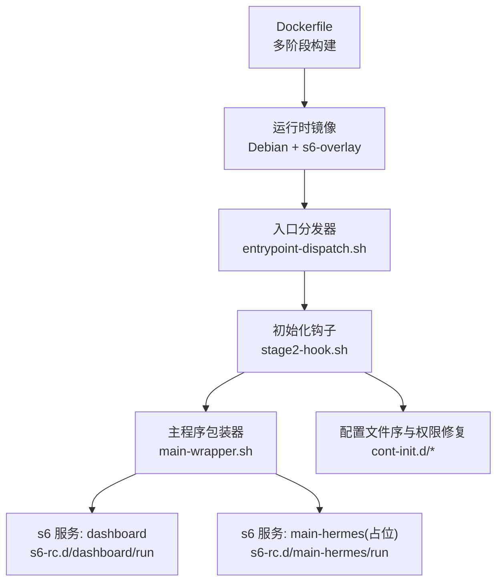
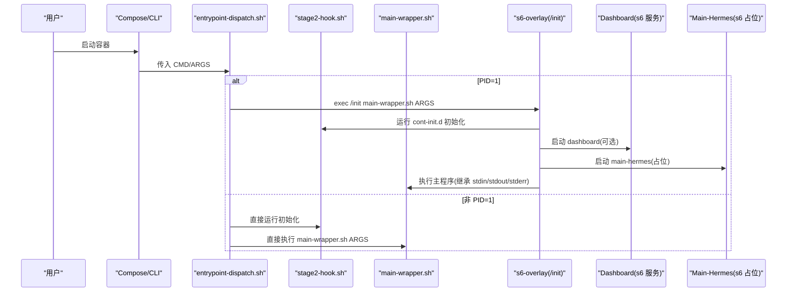
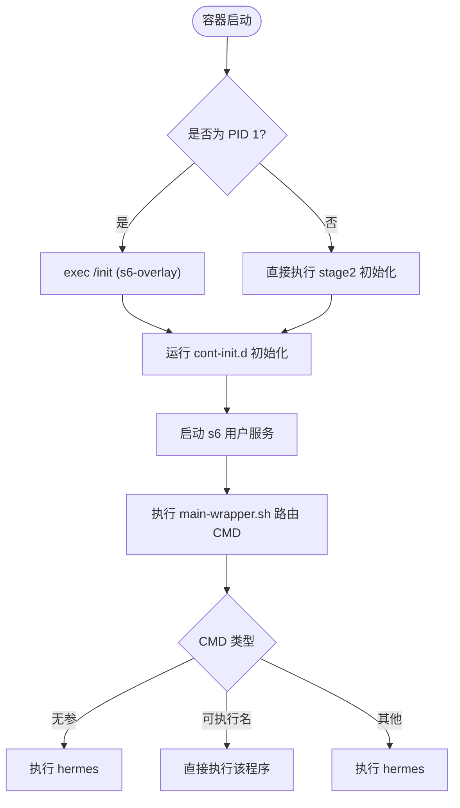
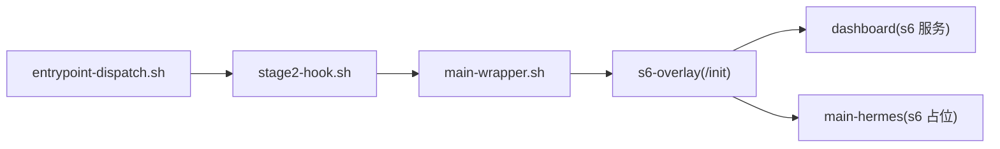

# Docker 部署

<cite>
**本文引用的文件**
- [Dockerfile](file://Dockerfile)
- [docker-compose.yml](file://docker-compose.yml)
- [docker-compose.windows.yml](file://docker-compose.windows.yml)
- [entrypoint-dispatch.sh](file://docker/entrypoint-dispatch.sh)
- [stage2-hook.sh](file://docker/stage2-hook.sh)
- [main-wrapper.sh](file://docker/main-wrapper.sh)
- [tini-shim.sh](file://docker/tini-shim.sh)
- [s6-rc.d/dashboard/run](file://docker/s6-rc.d/dashboard/run)
- [s6-rc.d/dashboard/finish](file://docker/s6-rc.d/dashboard/finish)
- [s6-rc.d/main-hermes/run](file://docker/s6-rc.d/main-hermes/run)
- [cont-init.d/02-reconcile-profiles](file://docker/cont-init.d/02-reconcile-profiles)
</cite>

## 目录
1. [简介](#简介)
2. [项目结构](#项目结构)
3. [核心组件](#核心组件)
4. [架构总览](#架构总览)
5. [详细组件分析](#详细组件分析)
6. [依赖关系分析](#依赖关系分析)
7. [性能与资源调优](#性能与资源调优)
8. [安全配置](#安全配置)
9. [故障诊断与运维](#故障诊断与运维)
10. [结论](#结论)

## 简介
本文件面向使用 Docker 部署 Hermes Agent 的工程师与运维人员，系统阐述镜像构建流程、多阶段构建优化、层缓存策略；详解 docker-compose 服务编排、环境变量管理、数据卷挂载；说明容器启动流程、进程管理与信号处理、优雅关闭机制；并提供性能调优参数、内存/CPU 限制建议、安全加固、常见问题排查与监控日志方法。

## 项目结构
- 镜像构建：基于 Debian 13 的多阶段构建，包含 SQLite 固定版本编译、Node/Python 工具链、s6-overlay 服务化、前端预构建产物与 Python 依赖安装。
- 运行期：以 s6-overlay 作为 PID 1 的服务管理器，提供主程序入口分发、初始化钩子、用户服务（dashboard）与动态 profile 网关注册。
- 编排：提供 Linux 与 Windows 两套 compose 示例，默认通过 host 网络或端口映射暴露服务，持久化数据到 /opt/data。

**图示来源**
- [Dockerfile:52-458](file://Dockerfile#L52-L458)
- [entrypoint-dispatch.sh:1-26](file://docker/entrypoint-dispatch.sh#L1-L26)
- [stage2-hook.sh:1-592](file://docker/stage2-hook.sh#L1-L592)
- [main-wrapper.sh:1-92](file://docker/main-wrapper.sh#L1-L92)
- [s6-rc.d/dashboard/run:1-57](file://docker/s6-rc.d/dashboard/run#L1-L57)
- [s6-rc.d/main-hermes/run:1-28](file://docker/s6-rc.d/main-hermes/run#L1-L28)
- [cont-init.d/02-reconcile-profiles:1-48](file://docker/cont-init.d/02-reconcile-profiles#L1-L48)

**章节来源**
- [Dockerfile:52-458](file://Dockerfile#L52-L458)
- [docker-compose.yml:1-77](file://docker-compose.yml#L1-L77)
- [docker-compose.windows.yml:1-39](file://docker-compose.windows.yml#L1-L39)

## 核心组件
- 多阶段构建与层缓存
  - 独立阶段构建固定版 SQLite，避免发行版漏洞并启用 FTS5/trigram。
  - Node/Python 依赖与前端构建分阶段缓存，减少冷构建时间。
  - 仅复制清单文件触发依赖解析层，源码变更不重算依赖。
- 服务化与生命周期
  - s6-overlay 作为 PID 1，接管僵尸进程回收与服务重启。
  - cont-init.d 在用户服务前执行初始化（UID/GID 重映射、卷权限修复、配置种子）。
  - dashboard 为可启停的 s6 服务，支持按环境变量开关。
- 入口与参数路由
  - entrypoint-dispatch.sh 兼容不同运行时是否拥有 PID 1。
  - main-wrapper.sh 负责激活 venv、工作目录恢复、命令路由与降权执行。

**章节来源**
- [Dockerfile:6-41](file://Dockerfile#L6-L41)
- [Dockerfile:171-276](file://Dockerfile#L171-L276)
- [Dockerfile:336-458](file://Dockerfile#L336-L458)
- [entrypoint-dispatch.sh:1-26](file://docker/entrypoint-dispatch.sh#L1-L26)
- [main-wrapper.sh:1-92](file://docker/main-wrapper.sh#L1-L92)
- [s6-rc.d/dashboard/run:1-57](file://docker/s6-rc.d/dashboard/run#L1-L57)

## 架构总览
下图展示从镜像构建到容器运行的关键路径与职责划分。

**图示来源**
- [entrypoint-dispatch.sh:15-26](file://docker/entrypoint-dispatch.sh#L15-L26)
- [Dockerfile:424-458](file://Dockerfile#L424-L458)
- [main-wrapper.sh:23-92](file://docker/main-wrapper.sh#L23-L92)
- [s6-rc.d/dashboard/run:1-57](file://docker/s6-rc.d/dashboard/run#L1-L57)

## 详细组件分析

### 构建过程与层缓存策略
- 多阶段构建
  - sqlite_build：编译固定版 SQLite 并安装到 /usr/local/lib，替换系统库，确保 FTS5/trigram 可用。
  - uv_source/node_source：复用上游镜像中的工具链，减少基础层体积与构建时间。
- 层缓存优化
  - 先复制 package.json/package-lock.json 与 web/ui-tui 清单，再执行 npm install，使依赖层仅在清单变化时重建。
  - Python 依赖通过 pyproject.toml + uv.lock 单独缓存，避免源码变更导致 ~4-5 分钟依赖编译。
  - 前端构建（web 与 ui-tui）独立于 Python 源码，进一步隔离缓存失效范围。
- 运行时不可变性与懒加载
  - /opt/hermes 为只读安装树，运行时状态位于 /opt/data。
  - 可选后端 SDK 通过 HERMES_LAZY_INSTALL_TARGET 指向 /opt/data/lazy-packages，追加至 sys.path 末尾，保证不会覆盖核心模块。

**章节来源**
- [Dockerfile:6-41](file://Dockerfile#L6-L41)
- [Dockerfile:171-276](file://Dockerfile#L171-L276)
- [Dockerfile:288-393](file://Dockerfile#L288-L393)

### 服务编排与环境变量
- docker-compose.yml
  - gateway：构建镜像、host 网络、挂载 ~/.hermes:/opt/data、设置 HERMES_UID/HERMES_GID、命令 gateway run。
  - dashboard：依赖 gateway、host 网络、同数据卷、默认绑定 127.0.0.1，可通过 SSH 隧道访问。
- docker-compose.windows.yml
  - 移除 network_mode: host，改用端口映射；Windows 路径 ${USERPROFILE}/.hermes。
- 关键环境变量
  - HERMES_UID/HERMES_GID（或 PUID/PGID）：将内部 hermes 用户重映射为主机 UID/GID，避免权限问题。
  - API_SERVER_HOST/API_SERVER_KEY：开启 OpenAI 兼容 API 服务（需鉴权）。
  - TEAMS_*、GOOGLE_CHAT_*：启用对应消息通道网关。
  - HERMES_DASHBOARD[_HOST/_PORT]：控制 Dashboard 监听地址与端口。

**章节来源**
- [docker-compose.yml:1-77](file://docker-compose.yml#L1-L77)
- [docker-compose.windows.yml:1-39](file://docker-compose.windows.yml#L1-L39)

### 容器启动流程与进程管理
- 入口分发器
  - 若自身为 PID 1，则 exec /init 进入 s6-overlay 完整监督树；否则跳过 /init，直接执行 stage2 初始化与 main-wrapper。
- 初始化钩子（stage2-hook.sh）
  - 拒绝不支持的 --user 启动方式，强制通过 HERMES_UID/HERMES_GID 实现主机 UID/GID 对齐。
  - 创建并修复 /opt/data 下各子目录所有权，保障 hermes 用户可写。
  - 首次启动时拷贝 .env、config.yaml、SOUL.md 等种子文件，并对敏感文件收紧权限。
  - 自动发现 Playwright 安装的 Chromium 二进制并导出给 agent-browser。
  - 可选：根据环境变量引导 auth.json、gateway_state.json 等初始状态。
- 主程序包装器（main-wrapper.sh）
  - 通过 with-contenv 恢复环境，激活 venv，恢复原始工作目录，按规则路由命令（直接执行/hermes 子命令），并以 s6-setuidgid 降权执行。
- s6 服务
  - dashboard：受 s6 监督，可按环境变量启停；finish 脚本标记“永久失败”以避免无意义重启循环。
  - main-hermes：当前为占位服务，满足 s6-rc 要求并为未来长期守护预留。

**图示来源**
- [entrypoint-dispatch.sh:15-26](file://docker/entrypoint-dispatch.sh#L15-L26)
- [stage2-hook.sh:23-74](file://docker/stage2-hook.sh#L23-L74)
- [main-wrapper.sh:23-92](file://docker/main-wrapper.sh#L23-L92)
- [s6-rc.d/dashboard/run:1-57](file://docker/s6-rc.d/dashboard/run#L1-L57)
- [s6-rc.d/dashboard/finish:1-30](file://docker/s6-rc.d/dashboard/finish#L1-L30)

**章节来源**
- [entrypoint-dispatch.sh:1-26](file://docker/entrypoint-dispatch.sh#L1-L26)
- [stage2-hook.sh:23-592](file://docker/stage2-hook.sh#L23-L592)
- [main-wrapper.sh:1-92](file://docker/main-wrapper.sh#L1-L92)
- [s6-rc.d/dashboard/run:1-57](file://docker/s6-rc.d/dashboard/run#L1-L57)
- [s6-rc.d/dashboard/finish:1-30](file://docker/s6-rc.d/dashboard/finish#L1-L30)

### 信号处理与优雅关闭
- s6-overlay 作为 PID 1，负责接收 SIGTERM/SIGINT 并协调子服务停止，随后退出容器。
- dashboard 的 finish 脚本在禁用状态下返回 125，向 s6-supervise 声明“永久失败”，避免重启风暴。
- 当平台已持有 PID 1（如 docker run --init），入口分发器会绕过 /init，此时无法享受 s6 监督能力，但前台命令仍可执行。

**章节来源**
- [Dockerfile:424-458](file://Dockerfile#L424-L458)
- [entrypoint-dispatch.sh:15-26](file://docker/entrypoint-dispatch.sh#L15-L26)
- [s6-rc.d/dashboard/finish:1-30](file://docker/s6-rc.d/dashboard/finish#L1-L30)

### 数据卷与权限模型
- 数据卷
  - /opt/data 为唯一持久化卷，compose 中映射到 ~/.hermes（Linux）或 ${USERPROFILE}/.hermes（Windows）。
- 权限模型
  - 安装树 /opt/hermes 由 root 拥有且对 hermes 只读；运行时写入全部落在 /opt/data。
  - stage2-hook 会在启动时修复 /opt/data 下各子目录与关键文件的所有权，避免 docker exec 以 root 写入导致的后续读取失败。
  - 支持 Docker socket 组权限自动注入，便于容器内调用宿主机 Docker 守护进程。

**章节来源**
- [Dockerfile:378-422](file://Dockerfile#L378-L422)
- [stage2-hook.sh:118-172](file://docker/stage2-hook.sh#L118-L172)
- [stage2-hook.sh:174-372](file://docker/stage2-hook.sh#L174-L372)
- [docker-compose.yml:36-40](file://docker-compose.yml#L36-L40)
- [docker-compose.windows.yml:17-22](file://docker-compose.windows.yml#L17-L22)

### 多阶段构建与镜像层缓存策略（深入）
- 阶段拆分
  - sqlite_build：编译并安装固定版 SQLite，解决上游 WAL-reset bug。
  - uv_source/node_source：复用上游镜像工具链，降低基础镜像差异带来的风险。
- 缓存命中要点
  - 仅复制清单文件触发依赖解析层，源码变更不影响依赖层缓存。
  - 前端构建与 Python 依赖解耦，互不影响缓存失效。
  - 使用 --link 与 --chmod 减少额外 chmod 遍历开销。
- 运行时不可变性
  - 禁止运行时 lazy install 到 /opt/hermes，统一重定向到 /opt/data/lazy-packages，并通过 sys.path 尾部追加，确保核心模块不被覆盖。

**章节来源**
- [Dockerfile:6-41](file://Dockerfile#L6-L41)
- [Dockerfile:171-276](file://Dockerfile#L171-L276)
- [Dockerfile:288-393](file://Dockerfile#L288-L393)

## 依赖关系分析
- 外部依赖
  - s6-overlay：服务管理与 PID 1 替代方案。
  - Node/npm：前端构建与部分插件侧车依赖。
  - Python/uv：应用与工具链依赖。
  - Playwright Chromium：浏览器自动化所需。
- 内部依赖
  - entrypoint-dispatch.sh → stage2-hook.sh → main-wrapper.sh → s6 服务。
  - dashboard 服务依赖 venv 中的 hermes CLI。

**图示来源**
- [entrypoint-dispatch.sh:15-26](file://docker/entrypoint-dispatch.sh#L15-L26)
- [main-wrapper.sh:23-92](file://docker/main-wrapper.sh#L23-L92)
- [s6-rc.d/dashboard/run:1-57](file://docker/s6-rc.d/dashboard/run#L1-L57)

**章节来源**
- [Dockerfile:93-135](file://Dockerfile#L93-L135)
- [Dockerfile:152-167](file://Dockerfile#L152-L167)
- [Dockerfile:199-220](file://Dockerfile#L199-L220)
- [Dockerfile:265-276](file://Dockerfile#L265-L276)

## 性能与资源调优
- 构建性能
  - 利用多阶段与清单先行复制最大化层缓存命中率。
  - 使用 --prefer-offline 与重试参数加速依赖下载。
- 运行时性能
  - PYTHONUNBUFFERED=1 确保日志即时输出，便于观测。
  - PYTHONDONTWRITEBYTECODE=1 避免在只读层写入字节码。
  - 前端使用预构建产物，避免运行时 npm install 竞争与 ENOTEMPTY 错误。
- 资源限制（建议在编排层配置）
  - CPU：--cpus 或 cgroup CPU quota，防止单实例抢占宿主资源。
  - 内存：--memory 与 --memory-swap，结合 OOM 策略与监控告警。
  - I/O：合理设置磁盘配额与日志轮转，避免日志膨胀影响性能。
- 网络
  - Linux 默认 host 网络以获得最佳吞吐；Windows 使用端口映射。
  - 对外暴露 API 时需配合反向代理与鉴权。

[本节为通用指导，无需特定文件引用]

## 安全配置
- 最小权限
  - 默认以 root 启动以便完成初始化，随后通过 s6-setuidgid 降权到 hermes 用户执行业务。
  - 禁止使用 --user 指定任意 UID/GID，应通过 HERMES_UID/HERMES_GID 进行重映射。
- 数据安全
  - /opt/hermes 只读，所有写入均在 /opt/data。
  - .env 与 config.yaml 权限收紧，auth.json 首次引导后严格限制访问。
- 网络安全
  - dashboard 默认绑定 127.0.0.1；如需远程访问，建议使用 SSH 隧道或带鉴权的反向代理。
  - 开启 OpenAI 兼容 API 时必须设置 API_SERVER_KEY。
- 依赖安全
  - 固定 SQLite 版本并校验 SHA256，避免已知漏洞。
  - s6-overlay 组件下载后进行完整性校验。

**章节来源**
- [Dockerfile:76-91](file://Dockerfile#L76-L91)
- [Dockerfile:288-393](file://Dockerfile#L288-L393)
- [stage2-hook.sh:23-74](file://docker/stage2-hook.sh#L23-L74)
- [stage2-hook.sh:418-444](file://docker/stage2-hook.sh#L418-L444)
- [docker-compose.yml:13-27](file://docker-compose.yml#L13-L27)

## 故障诊断与运维
- 常见错误与定位
  - 启动即报 --user 不支持：改为通过 HERMES_UID/HERMES_GID 重映射。
  - 权限拒绝（EACCES）：检查 /opt/data 及其子目录所有权是否被 hermes 用户正确拥有。
  - 浏览器工具找不到 Chromium：确认 PLAYWRIGHT_BROWSERS_PATH 存在且 stage2 已导出 AGENT_BROWSER_EXECUTABLE_PATH。
  - dashboard 未启动：确认 HERMES_DASHBOARD 为真值，或通过 compose 显式启动。
- 日志查看
  - 使用 docker logs <container> 查看标准输出（已禁用缓冲）。
  - 关注 stage2 初始化日志与 s6 服务状态（s6-svstat）。
- 健康检查与监控
  - 可在编排层增加 HTTP 健康检查端点（如 dashboard 或 API server）。
  - 结合系统指标（CPU/内存/IO）与容器事件进行容量规划与扩容。
- 回滚与升级
  - 镜像更新不影响 /opt/data 数据卷；注意必要时清理 /opt/data/lazy-packages（ABI 变更时会失效）。
  - 通过 compose restart 或滚动更新策略平滑升级。

**章节来源**
- [stage2-hook.sh:23-74](file://docker/stage2-hook.sh#L23-L74)
- [stage2-hook.sh:543-589](file://docker/stage2-hook.sh#L543-L589)
- [s6-rc.d/dashboard/run:1-57](file://docker/s6-rc.d/dashboard/run#L1-L57)
- [Dockerfile:54-58](file://Dockerfile#L54-L58)

## 结论
本部署方案通过多阶段构建与严格的层缓存策略，显著缩短构建时间并提升稳定性；借助 s6-overlay 实现健壮的服务治理与生命周期管理；通过清晰的数据卷与权限模型，确保运行时安全与可维护性。配合合理的资源限制与安全加固，可在生产环境中稳定运行。建议在生产环境启用健康检查、日志集中与监控告警，并结合 CI/CD 流水线固化镜像构建与发布流程。