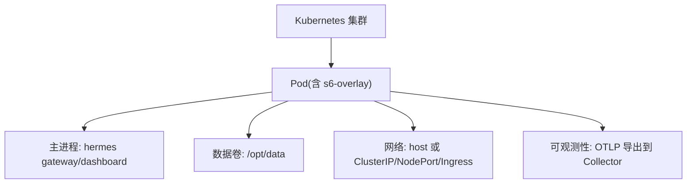
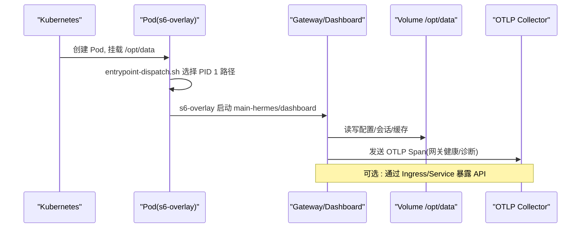
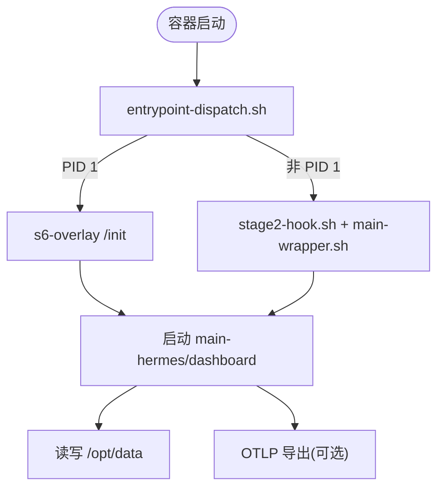
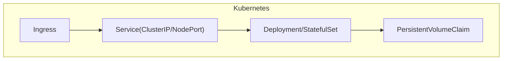
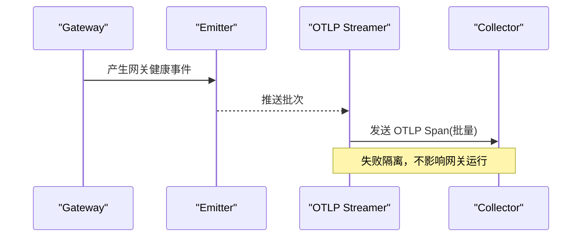
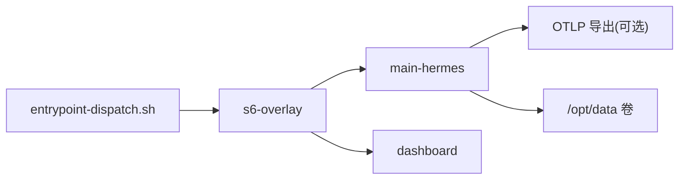

# Kubernetes 部署

<cite>
**本文引用的文件**
- [Dockerfile](file://Dockerfile)
- [docker-compose.yml](file://docker-compose.yml)
- [docker-compose.windows.yml](file://docker-compose.windows.yml)
- [entrypoint-dispatch.sh](file://docker/entrypoint-dispatch.sh)
- [main-wrapper.sh](file://docker/main-wrapper.sh)
- [tini-shim.sh](file://docker/tini-shim.sh)
- [hermes-exec-shim.sh](file://docker/hermes-exec-shim.sh)
- [stage2-hook.sh](file://docker/stage2-hook.sh)
- [otlp_exporter.py](file://agent/monitoring/otlp_exporter.py)
</cite>

## 目录
1. [简介](#简介)
2. [项目结构](#项目结构)
3. [核心组件](#核心组件)
4. [架构总览](#架构总览)
5. [详细组件分析](#详细组件分析)
6. [依赖关系分析](#依赖关系分析)
7. [性能与扩缩容建议](#性能与扩缩容建议)
8. [故障排查指南](#故障排查指南)
9. [结论](#结论)
10. [附录](#附录)

## 简介
本文件面向在 Kubernetes 上部署 Hermes Agent 的运维与平台工程师，聚焦以下目标：
- 将容器镜像与编排资源（Pod、Service、Ingress、StatefulSet、ConfigMap/Secret、HPA/VPA）进行系统化说明
- 结合仓库内 Dockerfile 与 docker-compose 配置，给出可落地的 K8s 清单模板与最佳实践
- 提供监控告警（OTLP）、日志聚合、分布式追踪的集成方案
- 覆盖生产环境安全加固、负载均衡、故障转移与灾难恢复策略

## 项目结构
仓库提供了构建与运行所需的容器化能力，以及本地编排示例。关键要点：
- 多阶段构建：固定 SQLite、安装 s6-overlay、预编译前端、冻结 Python 依赖
- 进程管理：以 s6-overlay 作为 PID 1，统一监管主服务与仪表盘
- 数据持久化：通过 /opt/data 卷挂载实现状态与配置持久化
- 入口与权限：通过 entrypoint 调度器与 exec shim 保证非 root 运行与权限隔离
- 可观测性：内置 OTLP 导出器，支持将网关健康事件上报至 OpenTelemetry Collector

**图示来源**
- [Dockerfile:93-157](file://Dockerfile#L93-L157)
- [Dockerfile:336-357](file://Dockerfile#L336-L357)
- [Dockerfile:424-457](file://Dockerfile#L424-L457)
- [docker-compose.yml:29-77](file://docker-compose.yml#L29-L77)

**章节来源**
- [Dockerfile:1-458](file://Dockerfile#L1-L458)
- [docker-compose.yml:1-77](file://docker-compose.yml#L1-L77)

## 核心组件
- 容器镜像与运行时
  - 基于 Debian 13，固定 SQLite 版本，安装 s6-overlay 作为进程管理器
  - 使用 uv 冻结 Python 依赖，npm 构建前端并预置 TUI 产物
  - 非 root 用户 hermes，只读代码层，写路径集中在 /opt/data
- 进程与生命周期
  - entrypoint-dispatch.sh 负责选择 PID 1 路径或直接执行 stage2-hook + main-wrapper
  - s6-overlay 启动 main-hermes 与 dashboard 等静态服务；动态 per-profile 网关由 cont-init 脚本重建
- 数据与配置
  - /opt/data 为持久化卷，包含会话、配置、技能缓存等
  - 环境变量控制行为（如 HERMES_UID/GID、API_SERVER_HOST/KEY、各平台接入参数）
- 可观测性
  - agent.monitoring.otlp_exporter 将网关健康事件映射为 OTel Span，批量上报至 OTLP HTTP 端点

**章节来源**
- [Dockerfile:54-91](file://Dockerfile#L54-L91)
- [Dockerfile:93-157](file://Dockerfile#L93-L157)
- [Dockerfile:222-267](file://Dockerfile#L222-L267)
- [Dockerfile:336-357](file://Dockerfile#L336-L357)
- [Dockerfile:424-457](file://Dockerfile#L424-L457)
- [docker-compose.yml:38-61](file://docker-compose.yml#L38-L61)
- [otlp_exporter.py:1-22](file://agent/monitoring/otlp_exporter.py#L1-L22)
- [otlp_exporter.py:107-135](file://agent/monitoring/otlp_exporter.py#L107-L135)
- [otlp_exporter.py:168-180](file://agent/monitoring/otlp_exporter.py#L168-L180)
- [otlp_exporter.py:235-261](file://agent/monitoring/otlp_exporter.py#L235-L261)

## 架构总览
下图展示从 Kubernetes 到容器内部进程的调用链路与数据流。

**图示来源**
- [Dockerfile:424-457](file://Dockerfile#L424-L457)
- [Dockerfile:336-357](file://Dockerfile#L336-L357)
- [otlp_exporter.py:168-180](file://agent/monitoring/otlp_exporter.py#L168-L180)

## 详细组件分析

### 容器镜像与进程模型
- 构建阶段
  - 固定 SQLite 以避免 WAL-reset 缺陷
  - 安装 s6-overlay，校验并解压多架构包
  - 预装 Node/npm、Python 依赖、前端产物
- 运行阶段
  - 以 hermes 用户运行，/opt/hermes 只读，/opt/data 持久化
  - entrypoint-dispatch.sh 兼容不同编排器的 PID 1 约束
  - s6-overlay 管理主进程与子服务，确保重启与清理

**图示来源**
- [Dockerfile:424-457](file://Dockerfile#L424-L457)
- [Dockerfile:336-357](file://Dockerfile#L336-L357)

**章节来源**
- [Dockerfile:1-91](file://Dockerfile#L1-L91)
- [Dockerfile:93-157](file://Dockerfile#L93-L157)
- [Dockerfile:222-267](file://Dockerfile#L222-L267)
- [Dockerfile:336-357](file://Dockerfile#L336-L357)
- [Dockerfile:424-457](file://Dockerfile#L424-L457)

### 编排与网络
- 本地编排参考
  - docker-compose.yml：gateway 与 dashboard 双服务，默认 host 网络，挂载 ~/.hermes 到 /opt/data
  - Windows 兼容 compose：移除 host 网络，改用端口映射
- Kubernetes 适配要点
  - 使用 Deployment/StatefulSet 管理 gateway/dashboard
  - Service 暴露端口（ClusterIP/NodePort），Ingress 对外路由
  - ConfigMap/Secret 注入环境变量与敏感信息
  - PersistentVolumeClaim 绑定 /opt/data

**图示来源**
- [docker-compose.yml:29-77](file://docker-compose.yml#L29-L77)
- [docker-compose.windows.yml:12-39](file://docker-compose.windows.yml#L12-L39)

**章节来源**
- [docker-compose.yml:1-77](file://docker-compose.yml#L1-L77)
- [docker-compose.windows.yml:1-39](file://docker-compose.windows.yml#L1-L39)

### 存储与配置
- 持久化
  - /opt/data 作为数据卷，承载会话、配置、技能缓存等
  - 建议为 StatefulSet 使用有状态 PVC，保障稳定标识与顺序
- 配置注入
  - 通过 ConfigMap 注入非敏感配置项（如 OTLP endpoint、开关）
  - 通过 Secret 注入敏感信息（如 API_KEY、平台凭据）
- 权限与安全
  - 容器内以 hermes 用户运行，代码层只读
  - 仅开放必要端口，Dashboard 默认 localhost 访问

**章节来源**
- [Dockerfile:378-422](file://Dockerfile#L378-L422)
- [docker-compose.yml:36-61](file://docker-compose.yml#L36-L61)

### 可观测性与日志
- 指标与追踪
  - OTLP 导出器将网关健康事件映射为 Span，批量发送至 OTLP HTTP 端点
  - 支持 headers_env 从环境变量解析认证头，避免硬编码密钥
- 日志
  - 启用 PYTHONUNBUFFERED 保证实时日志输出
  - 建议配合 sidecar 或 DaemonSet 收集 stdout/stderr

**图示来源**
- [otlp_exporter.py:168-180](file://agent/monitoring/otlp_exporter.py#L168-L180)
- [otlp_exporter.py:235-261](file://agent/monitoring/otlp_exporter.py#L235-L261)

**章节来源**
- [otlp_exporter.py:1-22](file://agent/monitoring/otlp_exporter.py#L1-L22)
- [otlp_exporter.py:83-115](file://agent/monitoring/otlp_exporter.py#L83-L115)
- [otlp_exporter.py:168-180](file://agent/monitoring/otlp_exporter.py#L168-L180)
- [otlp_exporter.py:235-261](file://agent/monitoring/otlp_exporter.py#L235-L261)

## 依赖关系分析
- 外部依赖
  - OpenTelemetry SDK（可选，按需懒加载）
  - 平台适配器（Teams、Google Chat 等）通过环境变量与 Secret 注入
- 内部依赖
  - s6-overlay 管理进程生命周期
  - entrypoint-dispatch.sh 协调 PID 1 行为
  - stage2-hook.sh 完成 UID/GID 重映射、卷权限、配置初始化

**图示来源**
- [Dockerfile:424-457](file://Dockerfile#L424-L457)
- [Dockerfile:336-357](file://Dockerfile#L336-L357)
- [otlp_exporter.py:168-180](file://agent/monitoring/otlp_exporter.py#L168-L180)

**章节来源**
- [Dockerfile:424-457](file://Dockerfile#L424-L457)
- [Dockerfile:336-357](file://Dockerfile#L336-L357)

## 性能与扩缩容建议
- 水平自动扩缩容（HPA）
  - 基于 CPU/内存或自定义指标（如请求量、队列长度）对 Deployment/StatefulSet 进行扩缩容
  - 建议设置合理的 requests/limits，避免抖动
- 垂直自动扩缩容（VPA）
  - 使用 VPA 推荐资源配额，结合 HPA 实现弹性伸缩
  - 注意滚动更新时的兼容性
- 资源规划
  - 根据并发会话与工具调用规模估算 CPU/内存
  - 将 I/O 密集任务与计算任务拆分，必要时引入 Sidecar
- 网络与负载均衡
  - 使用 Ingress 控制器（Nginx/ALB/Cloud LB）做七层路由与 TLS 终止
  - 合理设置连接超时、重试与熔断策略

[本节为通用指导，不直接分析具体文件]

## 故障排查指南
- 启动失败
  - 检查 entrypoint-dispatch.sh 是否被正确执行，确认 PID 1 路径
  - 查看 s6-overlay 服务日志，确认 main-hermes/dashboard 是否启动
- 权限问题
  - 确认 /opt/data 归属与权限，避免 root 写入导致后续进程无法读取
  - 使用 HERMES_UID/GID 调整宿主与容器用户映射
- 网络与暴露
  - 若使用 host 网络，需确保端口未被占用；Windows 环境下使用端口映射
  - Dashboard 默认绑定 127.0.0.1，远程访问需隧道或反向代理
- 可观测性
  - 验证 OTLP endpoint 可达性与鉴权头
  - 检查 exporter 是否成功导入与启用

**章节来源**
- [Dockerfile:424-457](file://Dockerfile#L424-L457)
- [docker-compose.yml:13-27](file://docker-compose.yml#L13-L27)
- [docker-compose.yml:36-77](file://docker-compose.yml#L36-L77)
- [otlp_exporter.py:107-115](file://agent/monitoring/otlp_exporter.py#L107-L115)
- [otlp_exporter.py:235-261](file://agent/monitoring/otlp_exporter.py#L235-L261)

## 结论
通过将容器镜像与编排资源解耦，Hermes Agent 可在 Kubernetes 上以标准化方式部署。结合 s6-overlay 的进程管理、/opt/data 的持久化设计、以及 OTLP 的可观测性能力，能够支撑生产环境的稳定性与可维护性。建议在上线前完善 HPA/VPA、Ingress 路由、安全加固与灾难恢复演练，确保系统在高可用与高并发场景下的表现。

[本节为总结性内容，不直接分析具体文件]

## 附录

### Kubernetes 清单模板（概念性）
- Pod/Deployment/StatefulSet
  - 定义 replicas、resources.requests/limits、liveness/readiness probes
  - 挂载 PVC 到 /opt/data，注入 ConfigMap/Secret
- Service
  - 暴露 Gateway/Dashboard 端口，建议使用 ClusterIP 并通过 Ingress 暴露
- Ingress
  - 配置域名、TLS、路径路由与鉴权
- ConfigMap/Secret
  - 将环境变量与敏感信息分离管理
- HPA/VPA
  - 基于指标与推荐值实现弹性伸缩

[本节为概念性说明，不直接分析具体文件]