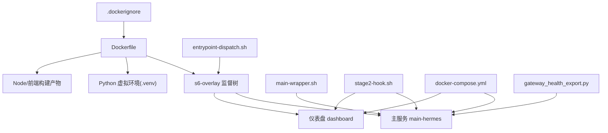
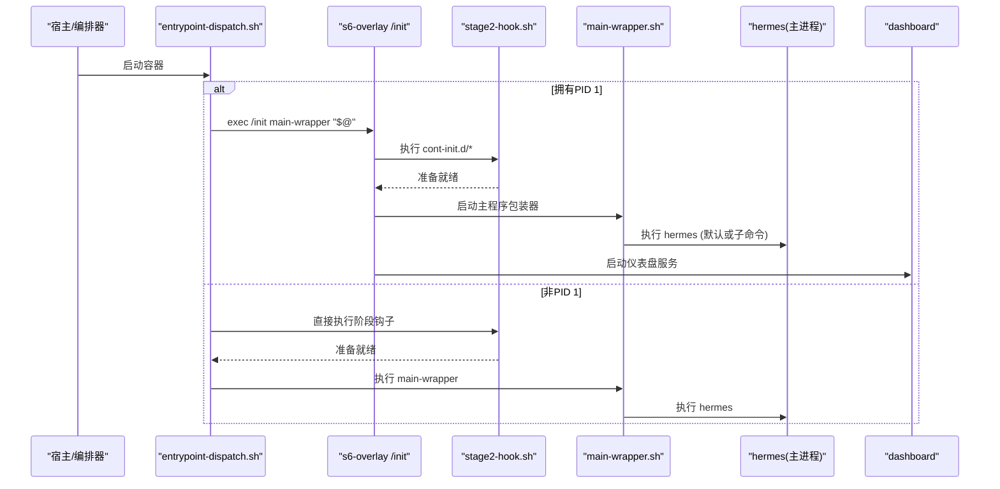
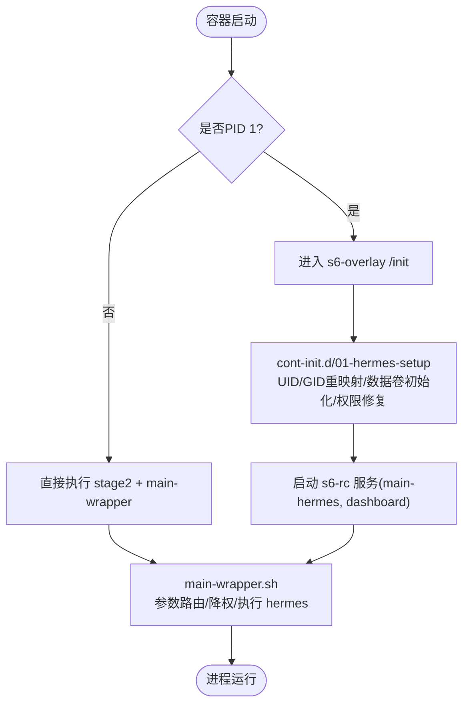
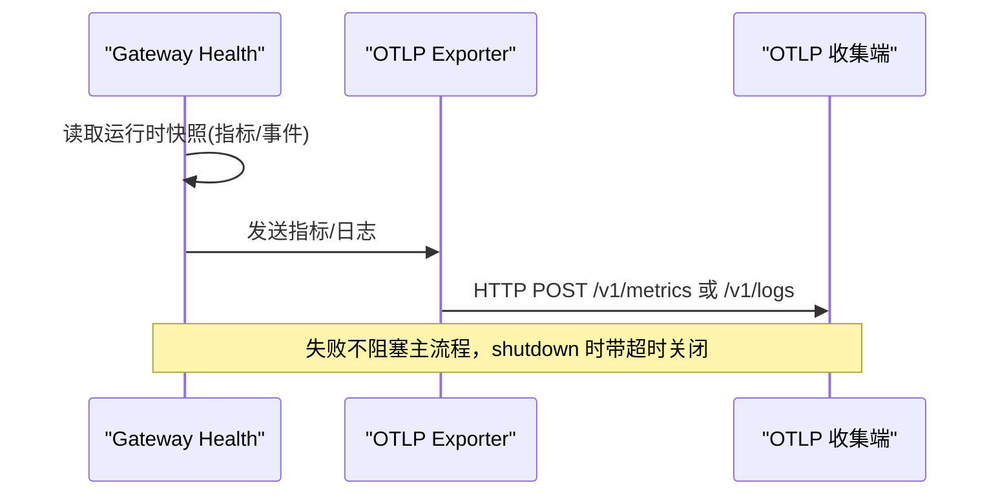
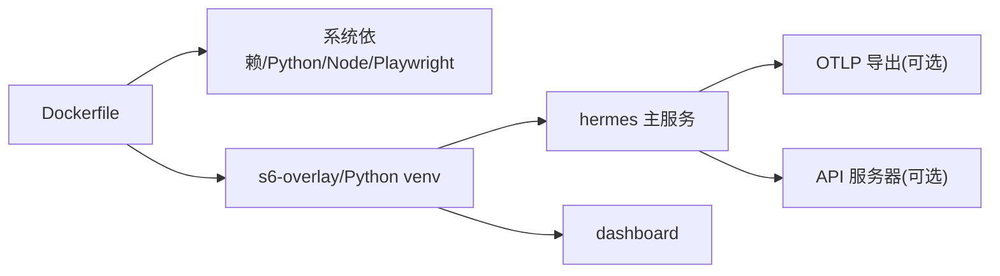

# 容器化部署

<cite>
**本文引用的文件**
- [Dockerfile](file://Dockerfile)
- [.dockerignore](file://.dockerignore)
- [docker-compose.yml](file://docker-compose.yml)
- [entrypoint-dispatch.sh](file://docker/entrypoint-dispatch.sh)
- [main-wrapper.sh](file://docker/main-wrapper.sh)
- [stage2-hook.sh](file://docker/stage2-hook.sh)
- [tini-shim.sh](file://docker/tini-shim.sh)
- [gateway_health_export.py](file://agent/monitoring/gateway_health_export.py)
- [docker.yml](file://.github/workflows/docker.yml)
</cite>

## 目录
1. [简介](#简介)
2. [项目结构](#项目结构)
3. [核心组件](#核心组件)
4. [架构总览](#架构总览)
5. [详细组件分析](#详细组件分析)
6. [依赖关系分析](#依赖关系分析)
7. [性能与体积优化](#性能与体积优化)
8. [安全与权限](#安全与权限)
9. [健康检查与可观测性](#健康检查与可观测性)
10. [编排与网络](#编排与网络)
11. [Kubernetes 部署建议](#kubernetes-部署建议)
12. [多平台构建与 CI/CD](#多平台构建与-cicd)
13. [故障排查指南](#故障排查指南)
14. [结论](#结论)

## 简介
本文件面向 Hermes Agent 的容器化部署，覆盖镜像构建、多阶段构建优化、镜像体积优化、Docker Compose 编排、服务通信与数据卷管理、Kubernetes 部署建议（含扩缩容）、容器安全最佳实践、资源限制与健康检查、监控与日志集成、ARM64 支持、多平台镜像构建以及 CI/CD 流水线集成等主题。内容基于仓库中的 Dockerfile、Compose 配置、启动脚本与监控导出模块进行系统化说明。

## 项目结构
Hermes Agent 的容器化相关资产主要分布在以下位置：
- 镜像定义与构建流程：根目录 Dockerfile、.dockerignore
- 运行时入口与进程监督：docker/ 下的 entrypoint-dispatch.sh、main-wrapper.sh、stage2-hook.sh、tini-shim.sh
- 服务编排：docker-compose.yml
- 监控与诊断导出：agent/monitoring/gateway_health_export.py
- 多架构构建与发布：.github/workflows/docker.yml

图表来源
- [Dockerfile:52-458](file://Dockerfile#L52-L458)
- [entrypoint-dispatch.sh:1-26](file://docker/entrypoint-dispatch.sh#L1-L26)
- [main-wrapper.sh:1-92](file://docker/main-wrapper.sh#L1-L92)
- [stage2-hook.sh:1-592](file://docker/stage2-hook.sh#L1-L592)
- [docker-compose.yml:29-77](file://docker-compose.yml#L29-L77)
- [gateway_health_export.py:1-644](file://agent/monitoring/gateway_health_export.py#L1-L644)

章节来源
- [Dockerfile:52-458](file://Dockerfile#L52-L458)
- [.dockerignore:1-106](file://.dockerignore#L1-L106)
- [docker-compose.yml:29-77](file://docker-compose.yml#L29-L77)

## 核心组件
- 多阶段镜像构建：分别构建 SQLite 固定版本、uv/Node 工具链、前端与 Python 依赖，最终合成最小运行镜像。
- 进程监督：使用 s6-overlay 作为 PID 1，管理主服务与仪表盘，并支持 per-profile 网关的动态注册。
- 启动流程：entrypoint-dispatch.sh 判断是否拥有 PID 1，选择走 s6-overlay 或直连 stage2 + main-wrapper；main-wrapper 负责参数路由与用户降权；stage2-hook 完成 UID/GID 重映射、数据卷初始化、配置种子注入、权限修复与浏览器二进制发现。
- 数据持久化：/opt/data 为唯一数据卷，所有运行时状态、会话、日志、技能、计划等均落盘。
- 可观测性：内置 OTLP 指标与诊断日志导出，支持在容器内以 fail-open 方式上报。

章节来源
- [Dockerfile:5-458](file://Dockerfile#L5-L458)
- [entrypoint-dispatch.sh:1-26](file://docker/entrypoint-dispatch.sh#L1-L26)
- [main-wrapper.sh:1-92](file://docker/main-wrapper.sh#L1-L92)
- [stage2-hook.sh:1-592](file://docker/stage2-hook.sh#L1-L592)
- [gateway_health_export.py:1-644](file://agent/monitoring/gateway_health_export.py#L1-L644)

## 架构总览
下图展示了容器启动到服务运行的关键路径，包括 s6-overlay 监督、阶段钩子、主程序包装器与可选的仪表盘。

图表来源
- [entrypoint-dispatch.sh:15-26](file://docker/entrypoint-dispatch.sh#L15-L26)
- [main-wrapper.sh:23-92](file://docker/main-wrapper.sh#L23-L92)
- [stage2-hook.sh:18-592](file://docker/stage2-hook.sh#L18-L592)

## 详细组件分析

### 镜像构建与多阶段优化
- 固定 SQLite：通过独立阶段编译并替换系统库，避免上游 WAL-reset 缺陷，同时启用 FTS5 trigram 自测确保功能可用。
- 工具链复用：从专用基础镜像复制 uv、Node/npm，减少安装步骤与体积。
- 分层缓存：先拷贝包清单再安装依赖，前端构建与 Python 依赖解耦，最大化利用构建缓存。
- 只读代码层：应用代码与依赖层设置为只读，运行时写操作全部指向 /opt/data，提升安全性与可恢复性。
- 预构建前端：将 web 与 ui-tui 构建产物打入镜像，避免运行时 npm install 竞争与失败。
- 可选依赖隔离：通过 HERMES_LAZY_INSTALL_TARGET 将可选后端 SDK 安装到数据卷中，保持 venv 密封。

章节来源
- [Dockerfile:5-91](file://Dockerfile#L5-L91)
- [Dockerfile:107-135](file://Dockerfile#L107-L135)
- [Dockerfile:171-276](file://Dockerfile#L171-L276)
- [Dockerfile:278-393](file://Dockerfile#L278-L393)

### 进程监督与启动流程
- s6-overlay：作为 PID 1，提供健壮的子进程回收与服务生命周期管理，替代 tini。
- 兼容 shim：保留 /usr/bin/tini 软链接以兼容旧编排模板，内部转发至新流程。
- 入口分发器：根据是否 PID 1 决定走 s6 监督或直接 bootstrap，保证在非标准环境中仍可运行。
- 主包装器：处理参数路由（无参默认 hermes、可执行直通、hermes 子命令透传），并在必要时通过 s6-setuidgid 降权。
- 阶段钩子：负责 UID/GID 重映射、数据卷 chown、配置种子注入、权限修复、浏览器二进制发现、配置迁移与首次引导状态设置。

图表来源
- [entrypoint-dispatch.sh:15-26](file://docker/entrypoint-dispatch.sh#L15-L26)
- [main-wrapper.sh:23-92](file://docker/main-wrapper.sh#L23-L92)
- [stage2-hook.sh:18-592](file://docker/stage2-hook.sh#L18-L592)

章节来源
- [entrypoint-dispatch.sh:1-26](file://docker/entrypoint-dispatch.sh#L1-L26)
- [main-wrapper.sh:1-92](file://docker/main-wrapper.sh#L1-L92)
- [stage2-hook.sh:1-592](file://docker/stage2-hook.sh#L1-L592)
- [Dockerfile:137-147](file://Dockerfile#L137-L147)

### 数据卷与权限模型
- 数据卷：/opt/data 为唯一持久化挂载点，包含 sessions、logs、skills、plans、workspace、home、profiles、cron、pairing、lazy-packages 等。
- 权限修复：阶段钩子在每次启动时针对 hermes 拥有的子目录与顶层文件进行精准 chown，避免对宿主机绑定目录的误改。
- 用户映射：支持通过 HERMES_UID/HERMES_GID（或 PUID/PGID）将内部 hermes 用户重映射到宿主用户，便于文件归属一致。
- 只读代码层：/opt/hermes 为 root 拥有且只读，防止运行时修改破坏 venv 与依赖。

章节来源
- [stage2-hook.sh:88-116](file://docker/stage2-hook.sh#L88-L116)
- [stage2-hook.sh:174-360](file://docker/stage2-hook.sh#L174-L360)
- [stage2-hook.sh:374-396](file://docker/stage2-hook.sh#L374-L396)
- [Dockerfile:149-150](file://Dockerfile#L149-L150)
- [Dockerfile:288-313](file://Dockerfile#L288-L313)

### 监控与诊断导出
- OTLP 指标：周期性采集 gateway/cron/platform 健康指标，通过 OTLPMetricExporter 上报。
- 诊断日志：订阅内部事件，过滤敏感信息后以 OTLPLogExporter 上报。
- 资源属性：注入 service.name、service.instance.id、deployment.environment 等白名单属性，并进行值长度与安全校验。
- 降级策略：SDK 不可用或网络异常时 fail-open，不影响主服务运行。

图表来源
- [gateway_health_export.py:178-243](file://agent/monitoring/gateway_health_export.py#L178-L243)
- [gateway_health_export.py:417-468](file://agent/monitoring/gateway_health_export.py#L417-L468)
- [gateway_health_export.py:485-556](file://agent/monitoring/gateway_health_export.py#L485-L556)
- [gateway_health_export.py:587-637](file://agent/monitoring/gateway_health_export.py#L587-L637)

章节来源
- [gateway_health_export.py:1-644](file://agent/monitoring/gateway_health_export.py#L1-L644)

## 依赖关系分析
- 构建期依赖：SQLite 源码、s6-overlay tarball（按架构下载并校验）、uv/Node/npm、npm 工作区依赖、Playwright Chromium。
- 运行期依赖：Python 虚拟环境、s6-overlay 监督、可选 OTLP SDK（按需懒加载）。
- 外部集成：OpenAI 兼容 API 服务器（需显式开启）、Teams/Google Chat 网关（环境变量驱动）、Docker socket（DooD 场景自动授权）。

图表来源
- [Dockerfile:71-91](file://Dockerfile#L71-L91)
- [Dockerfile:107-135](file://Dockerfile#L107-L135)
- [Dockerfile:171-276](file://Dockerfile#L171-L276)
- [gateway_health_export.py:178-243](file://agent/monitoring/gateway_health_export.py#L178-L243)

章节来源
- [Dockerfile:71-276](file://Dockerfile#L71-L276)
- [gateway_health_export.py:178-243](file://agent/monitoring/gateway_health_export.py#L178-L243)

## 性能与体积优化
- 多阶段构建：分离构建环境与运行环境，仅将必要产物复制到最终镜像。
- 依赖缓存：先拷贝清单再安装，前端与 Python 依赖分层缓存，减少冷构建时间。
- 只读代码层：避免运行时写入代码目录，降低 I/O 与权限复杂度。
- 懒加载可选依赖：通过 HERMES_LAZY_INSTALL_TARGET 将可选 SDK 安装到数据卷，减小镜像体积并提高稳定性。
- Playwright 浏览器外置：将浏览器安装到 /opt/hermes/.playwright，避免被 /opt/data 覆盖导致丢失。
- 预构建前端：跳过运行时 npm install，避免并发竞争与 ENOTEMPTY 错误。

章节来源
- [Dockerfile:171-276](file://Dockerfile#L171-L276)
- [Dockerfile:278-393](file://Dockerfile#L278-L393)

## 安全与权限
- 非 root 运行：默认创建 hermes 用户，服务通过 s6-setuidgid 降权执行。
- 拒绝任意 --user：当容器以非 hermes 的非 root UID 启动时，明确报错并给出正确用法（通过 HERMES_UID/PUID 映射）。
- 数据卷权限：阶段钩子对 hermes 拥有的子目录与文件进行精准 chown，避免误改宿主机文件。
- 配置与密钥保护：.env 文件权限收紧为 600；config.yaml 可读但不可写；auth.json 首次引导后不再覆盖。
- 代码层只读：/opt/hermes 只读，防止恶意或意外修改破坏运行环境。
- Docker socket 授权：自动检测并加入对应组，避免 DooD 场景下 EACCES。

章节来源
- [main-wrapper.sh:33-59](file://docker/main-wrapper.sh#L33-L59)
- [stage2-hook.sh:26-74](file://docker/stage2-hook.sh#L26-L74)
- [stage2-hook.sh:118-172](file://docker/stage2-hook.sh#L118-L172)
- [stage2-hook.sh:362-443](file://docker/stage2-hook.sh#L362-L443)
- [Dockerfile:149-150](file://Dockerfile#L149-L150)
- [Dockerfile:288-313](file://Dockerfile#L288-L313)

## 健康检查与可观测性
- 健康指标：通过 OTLP 定期上报 hermes.gateway.*、hermes.cron.*、hermes.platform.* 指标。
- 诊断日志：以结构化字段上报，敏感信息自动脱敏，支持按 severity 分级。
- 资源属性：注入服务名、实例 ID、环境、云信息等白名单属性，便于聚合与告警。
- 优雅关闭：shutdown 时带超时关闭导出器，避免阻塞容器退出。

章节来源
- [gateway_health_export.py:178-243](file://agent/monitoring/gateway_health_export.py#L178-L243)
- [gateway_health_export.py:417-468](file://agent/monitoring/gateway_health_export.py#L417-L468)
- [gateway_health_export.py:485-556](file://agent/monitoring/gateway_health_export.py#L485-L556)
- [gateway_health_export.py:587-637](file://agent/monitoring/gateway_health_export.py#L587-L637)

## 编排与网络
- Compose 服务：gateway 与 dashboard 两个服务，均使用 host 网络模式，便于端口暴露与调试。
- 数据卷：~/.hermes 挂载到 /opt/data，实现配置与会话持久化。
- 环境变量：支持 HERMES_UID/HERMES_GID、API_SERVER_HOST/API_SERVER_KEY、Teams/Google Chat 网关所需变量。
- 安全提示：dashboard 默认绑定 127.0.0.1，不建议直接暴露到公网；如需远程访问请使用 SSH 隧道或反向代理加认证。

章节来源
- [docker-compose.yml:29-77](file://docker-compose.yml#L29-L77)

## Kubernetes 部署建议
- 容器入口：使用镜像默认 ENTRYPOINT（entrypoint-dispatch.sh），确保 s6-overlay 监督可用；若平台已提供 PID 1，则会自动回退到直接 bootstrap。
- 数据持久化：将 PVC 挂载到 /opt/data，确保会话、日志、技能、计划等跨 Pod 重启持久化。
- 资源限制：为 Gateway 与 Dashboard 设置 requests/limits（CPU/Memory），避免资源争用影响稳定性。
- 健康检查：结合 OTLP 指标与自定义探针（如 HTTP /health 或 TCP 端口探测）实现就绪与存活检查。
- 扩缩容：Gateway 可按请求量水平扩展；Dashboard 通常为单实例。注意共享数据卷的并发读写与锁机制。
- 安全上下文：以非 root 用户运行（镜像已内置 hermes 用户），并通过 HERMES_UID/HERMES_GID 控制文件归属。
- 配置与密钥：通过 ConfigMap/Secret 注入环境变量与配置文件，避免硬编码。

[本节为通用部署建议，未直接分析具体文件]

## 多平台构建与 CI/CD
- 多架构矩阵：CI 同时构建 linux/amd64 与 linux/arm64，分别推送 digest 并合并为 manifest list。
- 缓存策略：按架构维度缓存构建结果，PR 构建复用缓存，release/main 推送触发完整构建与发布。
- 安全签名：构建时传入 HERMES_GIT_SHA，便于追踪镜像来源；发布时使用受保护的环境与凭据边界。
- 测试集成：构建后立即加载本地镜像并运行 docker 集成测试，避免二次构建开销。

章节来源
- [docker.yml:33-134](file://.github/workflows/docker.yml#L33-L134)
- [docker.yml:139-210](file://.github/workflows/docker.yml#L139-L210)
- [docker.yml:219-290](file://.github/workflows/docker.yml#L219-L290)

## 故障排查指南
- 启动失败（EACCES）：检查是否使用了不支持的 --user；应通过 HERMES_UID/HERMES_GID 映射用户；确认 /opt/data 存在且可写。
- 权限问题：阶段钩子会尝试修复 hermes 拥有的目录与文件；若仍失败，检查宿主机绑定目录是否存在符号链接或 SELinux/AppArmor 限制。
- Docker socket 访问失败：确认已挂载 /var/run/docker.sock 或 /run/docker.sock；阶段钩子会自动添加 hermes 到对应组。
- 浏览器工具不可用：阶段钩子会查找 Playwright 安装的 Chromium 二进制并设置 AGENT_BROWSER_EXECUTABLE_PATH；若未找到，检查 PLAYWRIGHT_BROWSERS_PATH 与镜像构建是否成功。
- 监控不可用：确认已启用 monitoring.gateway_health_export 与 export.otlp；若 SDK 不可用，会记录警告但不影响主服务。
- 日志定位：查看 /opt/data/logs 与 s6-overlay 服务日志；结合 OTLP 指标与诊断日志定位问题。

章节来源
- [main-wrapper.sh:33-59](file://docker/main-wrapper.sh#L33-L59)
- [stage2-hook.sh:118-172](file://docker/stage2-hook.sh#L118-L172)
- [stage2-hook.sh:543-589](file://docker/stage2-hook.sh#L543-L589)
- [gateway_health_export.py:587-637](file://agent/monitoring/gateway_health_export.py#L587-L637)

## 结论
Hermes Agent 的容器化方案采用多阶段构建、s6-overlay 监督、严格的数据卷与权限模型，以及内置的 OTLP 可观测性导出，提供了高可靠、易运维、可扩展的生产级部署能力。通过 Compose 快速本地验证，结合 Kubernetes 的资源限制、健康检查与扩缩容策略，可在多种环境中稳定运行。CI/CD 的多架构构建与发布流程确保了镜像的可追溯性与一致性。建议在部署中遵循安全最佳实践，合理配置资源与监控，以便及时发现与解决问题。