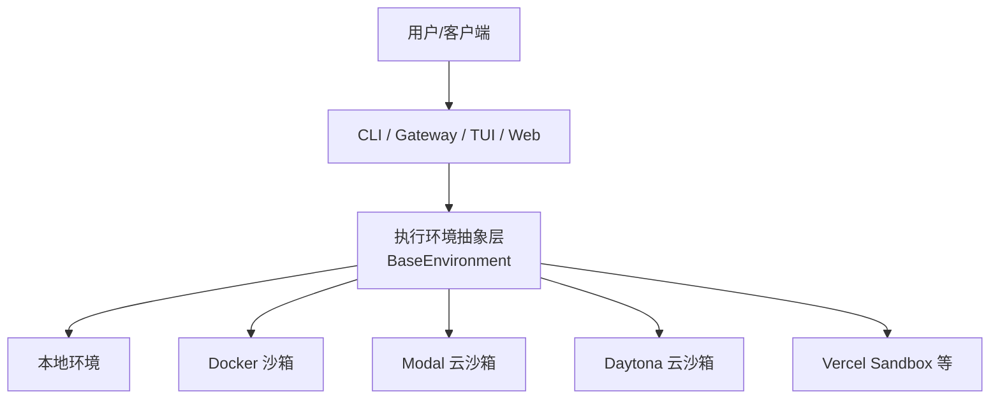
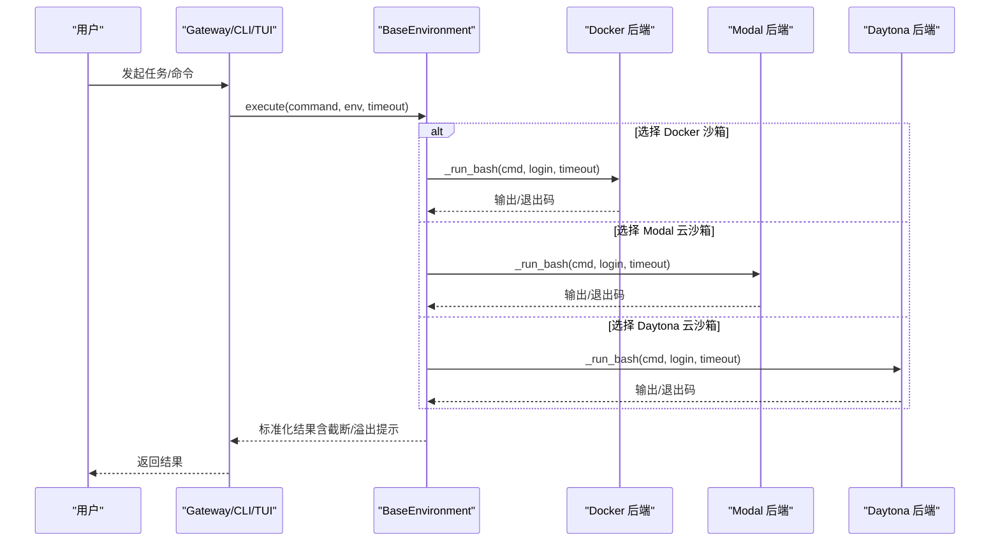
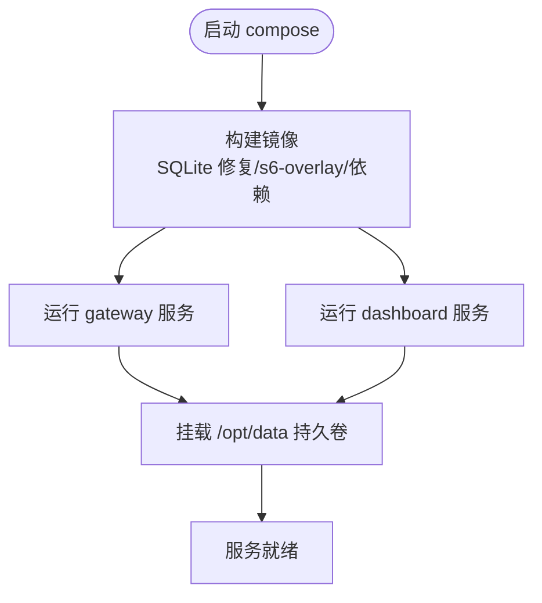
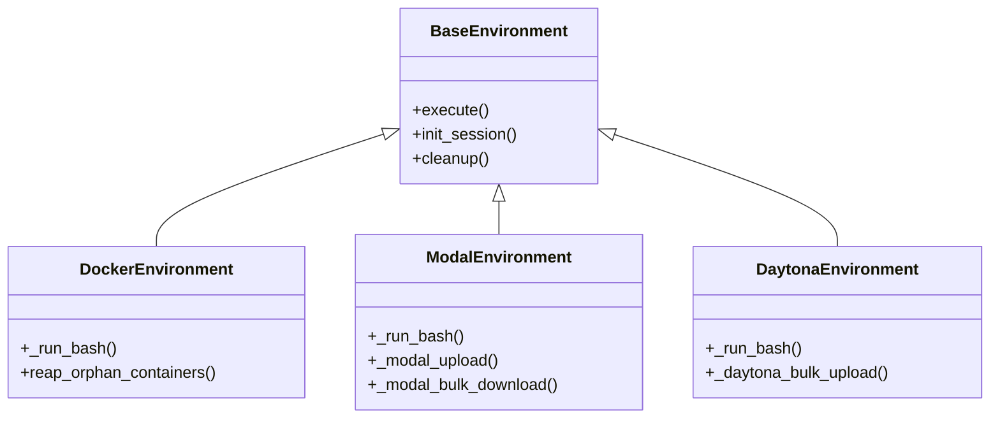
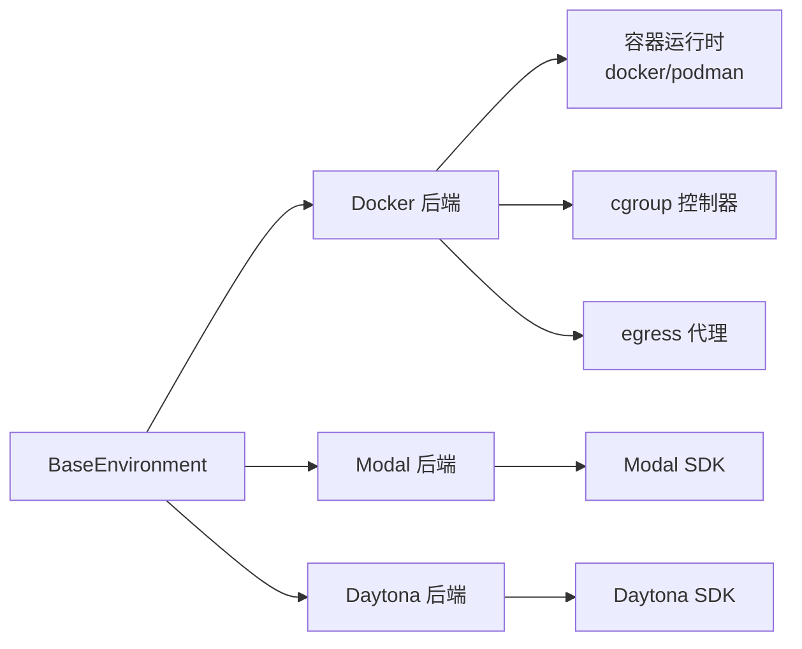

# 支持的运行环境

<cite>
**本文引用的文件**
- [README.md](file://README.md)
- [Dockerfile](file://Dockerfile)
- [docker-compose.yml](file://docker-compose.yml)
- [flake.nix](file://flake.nix)
- [scripts/install.sh](file://scripts/install.sh)
- [scripts/install.ps1](file://scripts/install.ps1)
- [tools/environments/base.py](file://tools/environments/base.py)
- [tools/environments/docker.py](file://tools/environments/docker.py)
- [tools/environments/modal.py](file://tools/environments/modal.py)
- [tools/environments/daytona.py](file://tools/environments/daytona.py)
</cite>

## 目录
1. [简介](#简介)
2. [项目结构](#项目结构)
3. [核心组件](#核心组件)
4. [架构总览](#架构总览)
5. [详细组件分析](#详细组件分析)
6. [依赖关系分析](#依赖关系分析)
7. [性能考量](#性能考量)
8. [故障排除指南](#故障排除指南)
9. [结论](#结论)
10. [附录](#附录)

## 简介
本文件面向 Hermes Agent 的部署与运维，系统梳理并说明其支持的多类运行环境：本地开发、$5 VPS、GPU 集群、无服务器基础设施（Modal/Daytona/Vercel Sandbox）等。内容涵盖各环境的安装步骤、配置选项、性能特点与适用场景；提供 Docker 容器化部署指南、Nix 包管理器支持与原生安装脚本使用方法；总结环境隔离机制、资源限制与安全要点；并给出常见问题的排查建议。

## 项目结构
Hermes Agent 通过统一的“执行环境抽象层”对接多种后端（本地、Docker、Modal、Daytona、Vercel Sandbox 等），并以 CLI/Gateway/TUI/Web Dashboard 等多入口提供服务。关键路径包括：
- 安装与引导：跨平台安装脚本（Linux/macOS/Windows）、Nix Flake、Dockerfile
- 运行时编排：docker-compose 服务定义、s6-overlay 进程管理
- 执行环境抽象：BaseEnvironment 与各后端实现（Docker/Modal/Daytona）
- 多通道接入：CLI、Gateway（Telegram/Discord/Slack/WhatsApp/Signal 等）、TUI、Web

[本节为概念性概览，不直接分析具体文件]

## 核心组件
- 统一执行环境抽象：所有命令以“每次调用派生一个 bash -c 进程”的模式执行，维护会话快照（环境变量、函数、别名）与工作目录持久化。
- 安全与资源控制：Docker 后端默认最小权限、能力裁剪、tmpfs 限制、可选 cgroup CPU/内存/PID 限制；支持 egress 代理强制出站流量。
- 云沙箱持久化：Modal/Daytona 支持文件系统快照或停止/恢复，跨会话保留工作区与缓存。
- 多入口与可观测性：CLI/Gateway/TUI/Web 共享同一套工具与环境；内置健康检查、OTLP 导出等。

**章节来源**
- [tools/environments/base.py:1-120](file://tools/environments/base.py#L1-L120)
- [tools/environments/docker.py:1-120](file://tools/environments/docker.py#L1-L120)
- [tools/environments/modal.py:1-120](file://tools/environments/modal.py#L1-L120)
- [tools/environments/daytona.py:1-120](file://tools/environments/daytona.py#L1-L120)

## 架构总览
下图展示从用户请求到不同执行后端的调用链路与数据流。

**图表来源**
- [tools/environments/base.py:550-800](file://tools/environments/base.py#L550-L800)
- [tools/environments/docker.py:638-770](file://tools/environments/docker.py#L638-L770)
- [tools/environments/modal.py:164-479](file://tools/environments/modal.py#L164-L479)
- [tools/environments/daytona.py:30-271](file://tools/environments/daytona.py#L30-L271)

## 详细组件分析

### 本地开发环境
- 适用场景：快速迭代、调试、桌面端使用、WSL2/Termux 等。
- 安装方式：
  - Linux/macOS/WSL2/Termux：一键脚本安装，自动处理 uv、Python、Node、Git Bash 等依赖。
  - Windows：PowerShell 安装器，包含原生 Git Bash 与 uv，无需管理员权限。
- 配置要点：
  - 可通过环境变量与配置文件调整模型、工具集、网关端口等。
  - 浏览器工具默认使用内置 Chromium，也可通过环境变量覆盖。
- 性能特点：零网络开销、低延迟；适合交互式开发与轻量自动化。
- 最佳实践：
  - 使用独立 venv 或受管 Python（uv）避免污染系统环境。
  - 在 WSL2 下优先使用原生 PowerShell 安装器以获得一致体验。

**章节来源**
- [README.md:35-66](file://README.md#L35-L66)
- [scripts/install.sh:45-199](file://scripts/install.sh#L45-L199)
- [scripts/install.ps1:15-75](file://scripts/install.ps1#L15-L75)

### $5 VPS 服务器（Docker 容器化）
- 适用场景：低成本长期在线、消息网关、定时任务、远程访问。
- 部署步骤：
  - 构建镜像：基于 Debian + s6-overlay，预编译前端与 Python 依赖，固定 SQLite 版本修复 WAL 问题。
  - 启动服务：使用 docker-compose 同时启动 gateway 与 dashboard，数据卷挂载至主机目录。
  - 环境变量：设置 HERMES_UID/GID 以匹配宿主用户；按需开启 API Server 与平台密钥。
- 安全与隔离：
  - 非 root 运行、只读代码层、数据层可写；dashboard 默认仅监听本地回环。
  - 可通过反向代理或 SSH 隧道暴露服务。
- 性能特点：资源占用可控，适合常驻服务；可结合 cgroup 限制 CPU/内存/PID。
- 最佳实践：
  - 使用 compose 的 restart=unless-stopped 保证自愈。
  - 将日志与状态置于持久卷，便于升级与迁移。

**图表来源**
- [Dockerfile:1-120](file://Dockerfile#L1-L120)
- [Dockerfile:336-458](file://Dockerfile#L336-L458)
- [docker-compose.yml:1-77](file://docker-compose.yml#L1-L77)

**章节来源**
- [Dockerfile:1-120](file://Dockerfile#L1-L120)
- [Dockerfile:336-458](file://Dockerfile#L336-L458)
- [docker-compose.yml:1-77](file://docker-compose.yml#L1-L77)

### GPU 集群
- 适用场景：需要本地大模型推理、图像/视频生成、重型工具链。
- 部署建议：
  - 在宿主机安装驱动与 CUDA 工具链，使用 nvidia-docker2 或 Podman 的 GPU 支持。
  - 将 GPU 设备与库映射进容器（如 --gpus all 或相应驱动挂载）。
  - 针对 PyTorch/TensorFlow 等依赖，确保镜像内版本与驱动兼容。
- 性能特点：充分利用 GPU 加速推理与媒体处理；注意显存与 I/O 瓶颈。
- 最佳实践：
  - 使用只读代码层 + 可写数据卷分离模型权重与缓存。
  - 监控显存与温度，合理设置批大小与并发。

[本节为通用指导，不直接分析具体文件]

### 无服务器基础设施（Modal / Daytona / Vercel Sandbox）
- 适用场景：按需弹性、空闲几乎零成本、长时任务挂起/唤醒。
- Modal：
  - 通过 Modal SDK 创建沙箱，支持文件系统快照与恢复；冷启动较慢但具备持久化能力。
  - 支持凭据与技能文件挂载，自动同步 .hermes 目录。
- Daytona：
  - 通过 SDK 创建/恢复云沙箱，支持 CPU/内存/磁盘配额；可停止/恢复以保持文件系统。
  - 批量上传下载优化，减少网络往返。
- Vercel Sandbox：
  - 适合轻量任务与短生命周期执行；注意超时与存储限制。
- 最佳实践：
  - 使用 FileSyncManager 增量同步，降低带宽与延迟。
  - 对敏感凭据采用最小权限挂载与临时令牌。

**图表来源**
- [tools/environments/base.py:550-800](file://tools/environments/base.py#L550-L800)
- [tools/environments/docker.py:638-770](file://tools/environments/docker.py#L638-L770)
- [tools/environments/modal.py:164-479](file://tools/environments/modal.py#L164-L479)
- [tools/environments/daytona.py:30-271](file://tools/environments/daytona.py#L30-L271)

**章节来源**
- [tools/environments/modal.py:164-479](file://tools/environments/modal.py#L164-L479)
- [tools/environments/daytona.py:30-271](file://tools/environments/daytona.py#L30-L271)

### Nix 包管理器支持
- 作用：声明式构建与开发环境，锁定依赖版本，提升可复现性。
- 关键点：
  - flake.nix 引入 nixpkgs、pyproject-nix、uv2nix 等输入，组织 packages、overlays、NixOS modules 与 devShell。
  - 适用于 CI 与本地开发，确保 Python/Node 工具链一致。
- 使用建议：
  - 使用 nix develop 进入开发环境；通过 flake outputs 暴露构建产物。
  - 在 CI 中复用 flakes 缓存加速构建。

**章节来源**
- [flake.nix:1-49](file://flake.nix#L1-L49)

### 原生安装脚本使用方法
- Linux/macOS/WSL2/Termux：
  - 一键安装脚本自动检测系统、安装 uv/Python/Node/Git Bash，并引导配置。
  - 支持跳过浏览器安装、指定分支/提交、FHS 布局（root 安装）等。
- Windows：
  - PowerShell 安装器处理 uv、Python、Node、Git，并配置 PATH 与全局 npm 前缀。
  - 解决 8.3 短路径、TLS 证书信任、PATH 刷新等常见问题。
- 推荐流程：
  - 首次安装后运行 setup 向导；按需启用 Gateway 与平台集成。
  - 使用 hermes doctor 诊断环境问题。

**章节来源**
- [scripts/install.sh:45-199](file://scripts/install.sh#L45-L199)
- [scripts/install.ps1:15-75](file://scripts/install.ps1#L15-L75)

## 依赖关系分析
- 执行环境抽象层与各后端解耦：通过统一接口屏蔽差异，便于替换与扩展。
- Docker 后端依赖：
  - 容器运行时（docker/podman）、cgroup 控制器（CPU/内存/PID）、可选 egress 代理。
  - 安全参数（能力裁剪、no-new-privileges、tmpfs 限制）与 shm 大小调优。
- 云后端依赖：
  - Modal/Daytona SDK；文件同步与快照机制；凭据与技能文件挂载。
- 安装与构建：
  - 安装脚本负责 uv/Python/Node/Git 的自举；Dockerfile 固定依赖版本与构建顺序。

**图表来源**
- [tools/environments/base.py:550-800](file://tools/environments/base.py#L550-L800)
- [tools/environments/docker.py:638-770](file://tools/environments/docker.py#L638-L770)
- [tools/environments/modal.py:164-479](file://tools/environments/modal.py#L164-L479)
- [tools/environments/daytona.py:30-271](file://tools/environments/daytona.py#L30-L271)

**章节来源**
- [tools/environments/docker.py:638-770](file://tools/environments/docker.py#L638-L770)
- [tools/environments/modal.py:164-479](file://tools/environments/modal.py#L164-L479)
- [tools/environments/daytona.py:30-271](file://tools/environments/daytona.py#L30-L271)

## 性能考量
- 本地环境：最低延迟，适合交互与调试；注意避免过多并发导致 CPU/IO 争用。
- Docker 沙箱：
  - 通过 cgroup 限制 CPU/内存/PID，防止失控任务影响宿主。
  - 增大 /dev/shm 以避免渲染/并行计算崩溃；必要时启用 egress 代理。
- 云沙箱：
  - Modal/Daytona 冷启动有延迟，适合批处理与长任务；利用快照/恢复减少重复初始化。
  - 使用批量上传/下载与增量同步降低网络开销。
- 通用优化：
  - 合理设置超时与重试策略；对长输出进行截断与转储，避免阻塞。
  - 使用只读代码层与可写数据卷分离，提高构建与重启效率。

[本节为通用指导，不直接分析具体文件]

## 故障排除指南
- 安装阶段：
  - Windows Defender/杀毒误报 uv.exe：按官方指引验证与白名单。
  - TLS 证书信任失败：设置 NODE_EXTRA_CA_CERTS 或临时关闭严格 SSL（谨慎）。
- 运行阶段：
  - Docker 不可用：确认 docker/podman 可用且 daemon 运行；检查 cgroup 控制器是否可用。
  - 容器僵尸进程：s6-overlay 作为 PID 1 负责回收；若被外部 init 接管，需调整入口。
  - 云沙箱连接失败：检查凭据、网络与平台配额；必要时重建或恢复快照。
- 诊断工具：
  - 使用 hermes doctor 检查环境与依赖；查看日志与状态。
  - 对长输出使用截断与 spill 文件定位问题。

**章节来源**
- [README.md:68-101](file://README.md#L68-L101)
- [Dockerfile:60-70](file://Dockerfile#L60-L70)
- [tools/environments/docker.py:772-800](file://tools/environments/docker.py#L772-L800)

## 结论
Hermes Agent 提供了从本地到云端的全栈运行环境支持，通过统一的执行环境抽象层屏蔽差异，兼顾安全性、可移植性与可扩展性。对于低成本 VPS，推荐使用 Docker 容器化部署；对于弹性与零闲置成本场景，可选择 Modal/Daytona/Vercel Sandbox；对于高性能需求，可在 GPU 集群上部署并优化资源限制。结合 Nix 与安装脚本，可实现高复现的开发与生产环境。

[本节为总结性内容，不直接分析具体文件]

## 附录
- 常用命令参考：
  - 启动聊天：hermes
  - 选择模型：hermes model
  - 启动网关：hermes gateway run
  - 运行仪表板：hermes dashboard
- 环境变量要点：
  - HERMES_HOME：数据目录
  - HERMES_UID/GID：容器内用户映射
  - API_SERVER_HOST/KEY：API 服务暴露与鉴权
  - TERMINAL_SANDBOX_DIR：沙箱存储根目录

[本节为补充信息，不直接分析具体文件]