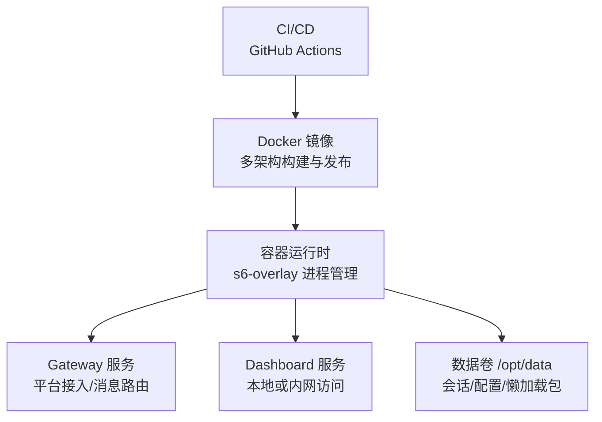
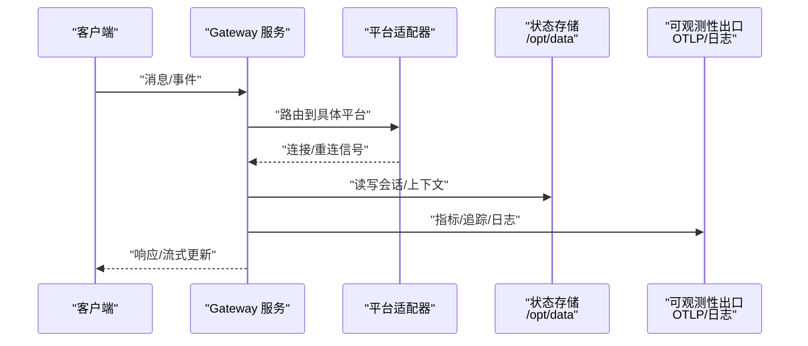
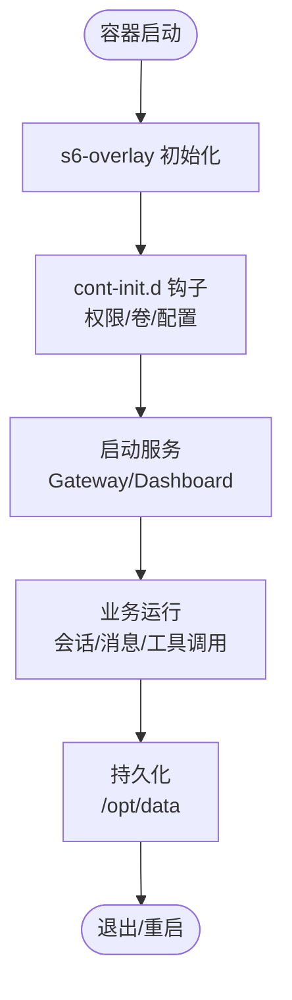
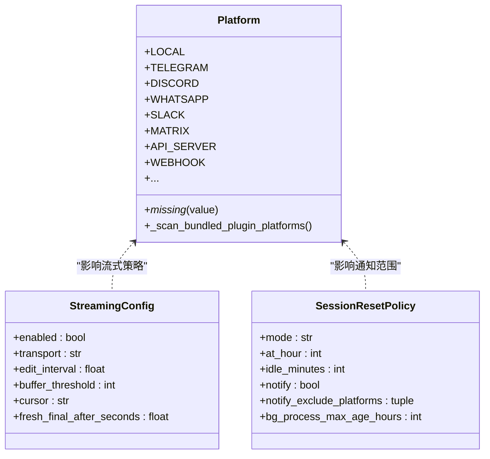
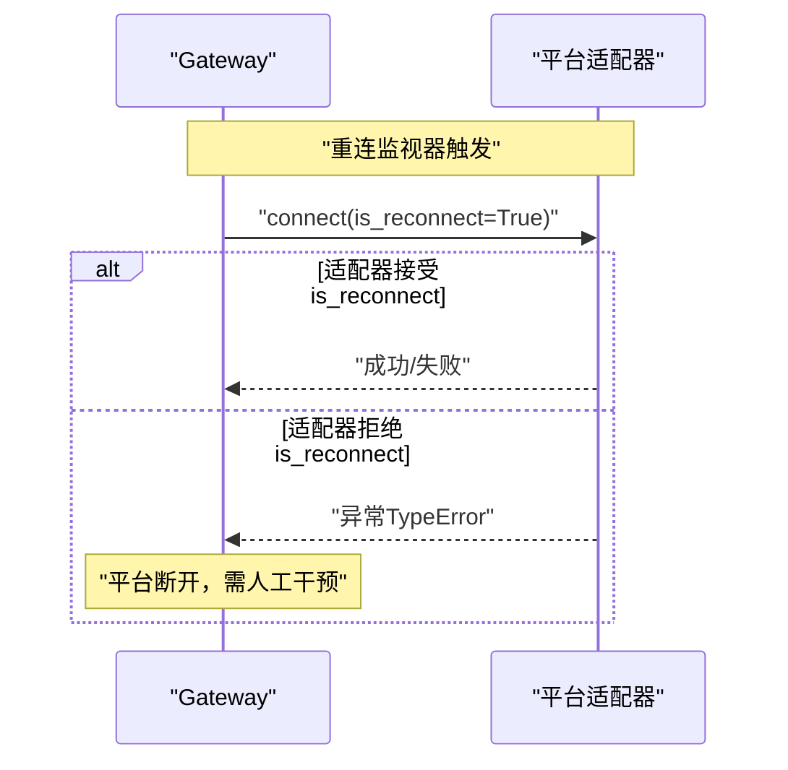
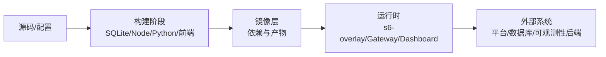

# 无服务器基础设施

<cite>
**本文引用的文件**
- [Dockerfile](file://Dockerfile)
- [docker-compose.yml](file://docker-compose.yml)
- [.github/workflows/docker.yml](file://.github/workflows/docker.yml)
- [gateway/config.py](file://gateway/config.py)
- [tests/gateway/test_adapter_connect_is_reconnect_contract.py](file://tests/gateway/test_adapter_connect_is_reconnect_contract.py)
</cite>

## 目录
1. [简介](#简介)
2. [项目结构](#项目结构)
3. [核心组件](#核心组件)
4. [架构总览](#架构总览)
5. [详细组件分析](#详细组件分析)
6. [依赖关系分析](#依赖关系分析)
7. [性能与冷启动优化](#性能与冷启动优化)
8. [监控、日志与可观测性](#监控日志与可观测性)
9. [成本优化与资源限制](#成本优化与资源限制)
10. [错误处理与健壮性](#错误处理与健壮性)
11. [多平台部署指南（AWS Lambda / Google Cloud Functions / Azure Functions）](#多平台部署指南aws-lambda--google-cloud-functions--azure-functions)
12. [故障排查指南](#故障排查指南)
13. [结论](#结论)

## 简介
本文件面向 Hermes Agent 的“无服务器化”部署目标，聚焦于容器化运行时、网关配置、事件驱动与异步处理、状态与会话管理、缓存层设计、API 网关与负载均衡、自动扩缩容、监控告警与日志聚合、性能分析与成本优化等主题。仓库本身以 Docker 容器为核心运行单元，并通过 GitHub Actions 完成多架构镜像构建与发布；网关侧提供丰富的平台接入与配置能力。文档将基于仓库现有实现，给出落地到主流无服务器平台的实践建议与最佳实践。

## 项目结构
Hermes Agent 的核心运行载体是容器镜像：
- 镜像构建与发布：通过 GitHub Actions 在 amd64/arm64 双架构下构建、测试并发布镜像，支持按 digest 推送与合并为多架构清单。
- 运行时编排：使用 s6-overlay 作为进程管理器，统一启动主服务、仪表盘及每 Profile 的网关子服务；入口脚本兼容 PID 1 与非 PID 1 场景。
- 数据持久化：/opt/data 作为可挂载卷，承载会话、配置与懒加载包等运行时数据。
- 网关配置：集中式配置模块负责平台接入、流式输出、会话重置策略等。

**图表来源**
- [.github/workflows/docker.yml:1-290](file://.github/workflows/docker.yml#L1-L290)
- [Dockerfile:93-157](file://Dockerfile#L93-L157)
- [Dockerfile:336-457](file://Dockerfile#L336-L457)
- [docker-compose.yml:29-77](file://docker-compose.yml#L29-L77)

**章节来源**
- [.github/workflows/docker.yml:1-290](file://.github/workflows/docker.yml#L1-L290)
- [Dockerfile:1-458](file://Dockerfile#L1-L458)
- [docker-compose.yml:1-77](file://docker-compose.yml#L1-L77)

## 核心组件
- 容器镜像与进程管理
  - 使用 s6-overlay 作为 PID 1，接管生命周期、健康检查与子进程监督。
  - 入口调度器兼容不同编排环境（Podman/Fly Machines 等），确保在非 PID 1 场景也能正确启动。
- 网关配置与平台接入
  - 统一的配置模型支持多种消息平台、默认频道、会话重置策略、流式输出模式等。
  - 端口绑定平台集合用于防止二次 Profile 重复绑定端口。
- CI/CD 流水线
  - 多架构构建、镜像签名与清单合并，保证跨平台一致性。

**章节来源**
- [Dockerfile:93-157](file://Dockerfile#L93-L157)
- [Dockerfile:336-457](file://Dockerfile#L336-L457)
- [gateway/config.py:272-395](file://gateway/config.py#L272-L395)
- [.github/workflows/docker.yml:1-290](file://.github/workflows/docker.yml#L1-L290)

## 架构总览
下图展示从请求进入网关到消息分发、平台适配与状态管理的整体流程。该图映射了仓库中网关配置、平台适配器契约以及容器化运行时的关键路径。

**图表来源**
- [gateway/config.py:272-395](file://gateway/config.py#L272-L395)
- [tests/gateway/test_adapter_connect_is_reconnect_contract.py:1-145](file://tests/gateway/test_adapter_connect_is_reconnect_contract.py#L1-L145)
- [Dockerfile:336-457](file://Dockerfile#L336-L457)

## 详细组件分析

### 容器运行时与进程管理（s6-overlay）
- 作用
  - 作为 PID 1 接管进程生命周期，启动主服务、仪表盘与每 Profile 的网关子服务。
  - 提供 cont-init.d 钩子进行权限映射、卷初始化与配置注入。
- 关键点
  - 入口调度器兼容非 PID 1 场景，避免在特定编排环境下崩溃。
  - 预编译前端与 Python 依赖，减少运行时安装开销。
  - 懒加载包写入持久卷，避免镜像层被污染。

**图表来源**
- [Dockerfile:93-157](file://Dockerfile#L93-L157)
- [Dockerfile:336-457](file://Dockerfile#L336-L457)

**章节来源**
- [Dockerfile:93-157](file://Dockerfile#L93-L157)
- [Dockerfile:336-457](file://Dockerfile#L336-L457)

### 网关配置与平台接入
- 平台枚举与动态注册
  - 内置平台枚举 + 插件平台动态发现，支持未知平台名解析为伪成员，便于扩展。
- 端口绑定约束
  - 明确哪些平台会绑定 TCP 端口，避免在多 Profile 模式下冲突。
- 会话重置策略
  - 支持按日、空闲、组合或关闭自动重置，并控制通知行为。
- 流式输出配置
  - 支持原生草稿、编辑回退与关闭三种传输模式，兼顾各平台能力差异。

**图表来源**
- [gateway/config.py:272-395](file://gateway/config.py#L272-L395)
- [gateway/config.py:485-540](file://gateway/config.py#L485-L540)
- [gateway/config.py:720-800](file://gateway/config.py#L720-L800)

**章节来源**
- [gateway/config.py:272-395](file://gateway/config.py#L272-L395)
- [gateway/config.py:485-540](file://gateway/config.py#L485-L540)
- [gateway/config.py:720-800](file://gateway/config.py#L720-L800)

### 平台适配器重连契约（健壮性保障）
- 问题背景
  - 网关重连监视器在每次重试时向适配器 connect() 传递 is_reconnect 关键字参数。若适配器未接受该参数，首次重连即失败，导致平台静默断开。
- 静态校验
  - 通过 AST 扫描所有适配器文件，强制要求 connect() 接受 is_reconnect 或 **kwargs，避免回归。

**图表来源**
- [tests/gateway/test_adapter_connect_is_reconnect_contract.py:1-145](file://tests/gateway/test_adapter_connect_is_reconnect_contract.py#L1-L145)

**章节来源**
- [tests/gateway/test_adapter_connect_is_reconnect_contract.py:1-145](file://tests/gateway/test_adapter_connect_is_reconnect_contract.py#L1-L145)

## 依赖关系分析
- 构建与发布
  - 多架构矩阵构建（amd64/arm64），按 digest 推送，最后合并为多架构清单。
  - 构建阶段包含 SQLite 固定版本、Node 26、Python uv 同步、前端构建与依赖缓存。
- 运行时依赖
  - s6-overlay 进程管理、Python venv、Node/npm、Playwright 浏览器、可选 OTLP 导出。
- 配置依赖
  - 平台枚举、端口绑定集合、流式输出与重置策略共同决定网关行为。

**图表来源**
- [.github/workflows/docker.yml:1-290](file://.github/workflows/docker.yml#L1-L290)
- [Dockerfile:1-458](file://Dockerfile#L1-L458)
- [gateway/config.py:272-395](file://gateway/config.py#L272-L395)

**章节来源**
- [.github/workflows/docker.yml:1-290](file://.github/workflows/docker.yml#L1-L290)
- [Dockerfile:1-458](file://Dockerfile#L1-L458)
- [gateway/config.py:272-395](file://gateway/config.py#L272-L395)

## 性能与冷启动优化
- 镜像层优化
  - 分层缓存：仅复制 manifest 与锁文件进行依赖安装，减少重建时间。
  - 预构建前端与 Python 依赖，避免运行时 npm install/uv sync 带来的延迟。
  - 固定 SQLite 版本与库链接，避免运行时脆弱性与额外下载。
- 运行时优化
  - 禁用 Python 标准输出缓冲，提升日志实时性。
  - 懒加载包写入持久卷，避免镜像层被污染且可跨重建保留。
  - 使用 s6-overlay 统一管理进程，降低僵尸进程风险。
- 冷启动策略
  - 保持最小化镜像与按需启用平台，减少初始导入开销。
  - 在函数式部署中，结合预热与连接池复用，缩短首请求延迟。

[本节为通用指导，不直接分析具体文件]

## 监控、日志与可观测性
- 日志
  - 容器内禁用 Python 输出缓冲，确保日志即时输出。
  - 通过 s6-overlay 收集子进程日志，便于集中采集。
- 指标与追踪
  - 镜像包含 OTLP 相关 extra，可在 Gateway 健康导出开启时上报指标与追踪。
  - 建议在编排层集成日志聚合与指标面板，形成闭环。
- 健康检查
  - Dashboard 与 Gateway 可通过 HTTP 端点暴露健康状态，供编排系统探测。

**章节来源**
- [Dockerfile:54-91](file://Dockerfile#L54-L91)
- [Dockerfile:246-267](file://Dockerfile#L246-L267)

## 成本优化与资源限制
- 镜像体积与构建成本
  - 使用多阶段构建与缓存，减少重复工作。
  - 仅引入生产所需 extra，避免无关依赖拉入镜像。
- 运行时资源
  - 合理设置容器 CPU/内存限制，避免争用。
  - 利用持久卷缓存懒加载包，减少重复安装。
- 平台级限制
  - 在无服务器平台中，合理设置超时、内存与并发上限，平衡成本与性能。

[本节为通用指导，不直接分析具体文件]

## 错误处理与健壮性
- 适配器重连契约
  - 强制 connect() 接受 is_reconnect，避免重连失败导致平台静默断开。
- 配置校验与降级
  - 配置项具备类型转换与默认值，避免非法输入导致启动失败。
- 安全与敏感信息
  - 终端工具输出与错误信息中进行敏感信息脱敏，防止密钥泄露。

**章节来源**
- [tests/gateway/test_adapter_connect_is_reconnect_contract.py:1-145](file://tests/gateway/test_adapter_connect_is_reconnect_contract.py#L1-L145)
- [gateway/config.py:272-395](file://gateway/config.py#L272-L395)

## 多平台部署指南（AWS Lambda / Google Cloud Functions / Azure Functions）
说明：以下内容为基于仓库实现的部署建议与最佳实践，非仓库内既有代码。

- AWS Lambda
  - 运行时选择：Python 3.13 或 Node 26（视功能需求），尽量复用仓库已验证的工具链。
  - 镜像支持：如使用容器型函数，参考 Dockerfile 的分层与依赖策略，裁剪镜像体积。
  - 事件源：API Gateway + EventBridge/SQS 触发异步任务；WebSocket API 支持长连接场景。
  - 冷启动优化：预留实例、VPC 内网络、连接池复用、惰性导入。
  - 监控：CloudWatch Logs/Metrics/Traces，结合 X-Ray 进行链路追踪。
  - 成本：按需计费，合理设置内存与超时；使用 Provisioned Concurrency 降低首请求延迟。

- Google Cloud Functions
  - 运行时：Python/Node，遵循仓库工具链版本。
  - 事件源：Cloud Run（容器）或 Cloud Functions（事件驱动）；Pub/Sub 触发异步处理。
  - 冷启动优化：最小化依赖、启用连接复用、合理设置内存/CPU。
  - 监控：Cloud Logging/Monitoring/Trace，结合 Error Reporting。
  - 成本：按请求与资源使用计费；使用弹性伸缩与预算告警。

- Azure Functions
  - 运行时：Python/Node，遵循仓库工具链版本。
  - 事件源：HTTP Trigger、Service Bus、Event Grid 等。
  - 冷启动优化：预编译依赖、连接池、最小化导入。
  - 监控：Application Insights（日志/指标/追踪）。
  - 成本：Consumption Plan 按需计费；Premium Plan 降低冷启动。

[本节为通用指导，不直接分析具体文件]

## 故障排查指南
- 平台适配器无法重连
  - 现象：首次重连后平台静默断开。
  - 原因：适配器 connect() 未接受 is_reconnect 参数。
  - 解决：按测试用例要求修改适配器签名，或通过 **kwargs 吸收。
- 容器启动异常
  - 现象：非 PID 1 环境下启动失败。
  - 原因：s6-overlay 仅在 PID 1 可用。
  - 解决：使用入口调度器或调整编排配置，确保兼容。
- 日志不可见或延迟
  - 现象：日志未及时输出。
  - 原因：Python 输出缓冲。
  - 解决：启用 PYTHONUNBUFFERED=1（镜像已默认设置）。

**章节来源**
- [tests/gateway/test_adapter_connect_is_reconnect_contract.py:1-145](file://tests/gateway/test_adapter_connect_is_reconnect_contract.py#L1-L145)
- [Dockerfile:54-91](file://Dockerfile#L54-L91)
- [Dockerfile:336-457](file://Dockerfile#L336-L457)

## 结论
Hermes Agent 以容器为核心运行单元，结合 s6-overlay 进程管理与完善的网关配置体系，具备良好的可扩展性与健壮性。通过 CI/CD 的多架构构建与发布，确保了跨平台一致性。面向无服务器部署，建议优先采用容器型函数或托管容器服务，并结合事件驱动、异步处理、缓存与可观测性体系，实现高性能、低成本与高可用的生产级部署。