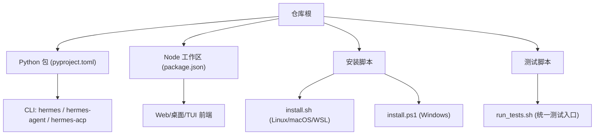
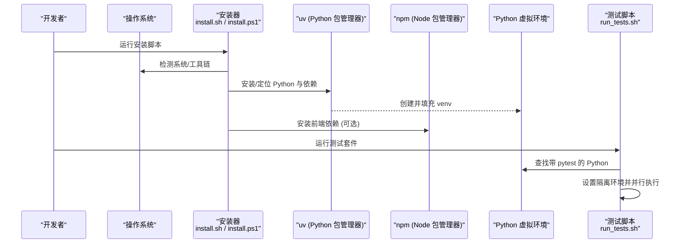
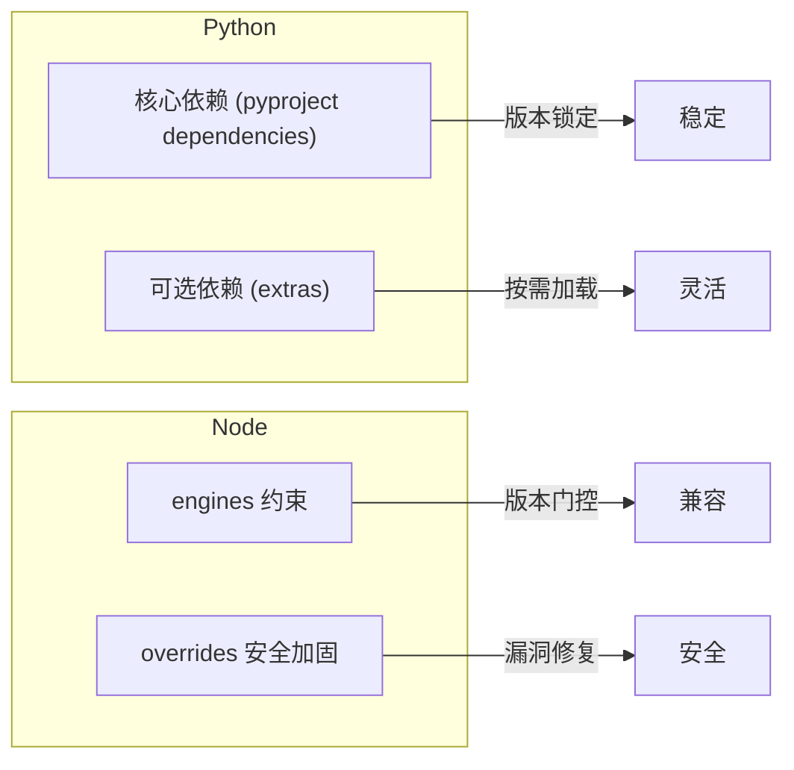

# 本地开发环境

<cite>
**本文引用的文件**
- [pyproject.toml](file://pyproject.toml)
- [package.json](file://package.json)
- [README.md](file://README.md)
- [CONTRIBUTING.md](file://CONTRIBUTING.md)
- [scripts/install.sh](file://scripts/install.sh)
- [scripts/install.ps1](file://scripts/install.ps1)
- [scripts/run_tests.sh](file://scripts/run_tests.sh)
</cite>

## 目录
1. [简介](#简介)
2. [项目结构](#项目结构)
3. [核心组件](#核心组件)
4. [架构总览](#架构总览)
5. [详细组件分析](#详细组件分析)
6. [依赖关系分析](#依赖关系分析)
7. [性能注意事项](#性能注意事项)
8. [故障排除指南](#故障排除指南)
9. [结论](#结论)
10. [附录](#附录)

## 简介
本指南面向 Hermes Agent 的本地开发者，覆盖在 Windows、macOS、Linux（含 WSL2）上搭建开发环境的完整步骤。重点包括：
- Python 与 Node.js 版本要求
- 虚拟环境与依赖安装
- 环境变量与配置准备
- IDE 与调试建议
- 测试运行、代码质量检查与前端资源构建
- 常见问题与排错

## 项目结构
Hermes Agent 采用多语言、多工作区工程组织：
- Python 后端与 CLI：由 pyproject 管理，提供 hermes、hermes-agent、hermes-acp 等入口
- Node.js 前端与桌面应用：通过根 package.json 的 workspaces 统一管理 web、ui-tui、apps/desktop 等子工程
- 脚本与工具：install.sh / install.ps1 负责跨平台安装；run_tests.sh 统一测试执行

**图表来源**
- [pyproject.toml:358-361](file://pyproject.toml#L358-L361)
- [package.json:6-12](file://package.json#L6-L12)
- [scripts/install.sh:1-15](file://scripts/install.sh#L1-L15)
- [scripts/install.ps1:1-12](file://scripts/install.ps1#L1-L12)
- [scripts/run_tests.sh:1-33](file://scripts/run_tests.sh#L1-L33)

**章节来源**
- [pyproject.toml:358-361](file://pyproject.toml#L358-L361)
- [package.json:6-12](file://package.json#L6-L12)
- [scripts/install.sh:1-15](file://scripts/install.sh#L1-L15)
- [scripts/install.ps1:1-12](file://scripts/install.ps1#L1-L12)
- [scripts/run_tests.sh:1-33](file://scripts/run_tests.sh#L1-L33)

## 核心组件
- Python 运行时与依赖
  - 最低 Python 版本：>=3.11，上限 <3.14（受限于部分 Rust 依赖 wheel 支持）
  - 推荐用于开发的 Python 版本：3.13（ty 工具链配置目标）
  - 使用 uv 进行快速依赖解析与安装
- Node.js 与前端
  - 要求 Node >=22.22.0，npm 有特定范围限制
  - 通过 npm workspaces 管理 web、ui-tui、apps/desktop 等子工程
- 安装器与引导
  - Linux/macOS/WSL：scripts/install.sh
  - Windows：scripts/install.ps1
- 测试与质量
  - 统一测试入口：scripts/run_tests.sh
  - 代码质量：ruff、ty（类型检查）、ESLint/Prettier（前端）

**章节来源**
- [pyproject.toml:15-15](file://pyproject.toml#L15-L15)
- [pyproject.toml:423-424](file://pyproject.toml#L423-L424)
- [package.json:55-58](file://package.json#L55-L58)
- [scripts/install.sh:59-61](file://scripts/install.sh#L59-L61)
- [scripts/install.ps1:378-391](file://scripts/install.ps1#L378-L391)
- [scripts/run_tests.sh:1-33](file://scripts/run_tests.sh#L1-L33)

## 架构总览
下图展示本地开发环境的关键组件与交互：安装器负责准备 Python/Node 与依赖；uv 管理 Python venv；npm 管理前端；测试脚本以隔离方式运行 pytest。

**图表来源**
- [scripts/install.sh:549-653](file://scripts/install.sh#L549-L653)
- [scripts/install.ps1:689-735](file://scripts/install.ps1#L689-L735)
- [scripts/run_tests.sh:40-99](file://scripts/run_tests.sh#L40-L99)

## 详细组件分析

### 跨平台安装与环境准备
- Linux/macOS/WSL
  - 使用 scripts/install.sh 自动安装 uv、Python 3.11+、Node 22.x、Git、浏览器工具等
  - 默认创建用户级安装布局，数据目录为 ~/.hermes
- Windows
  - 使用 scripts/install.ps1 在 PowerShell 中完成安装
  - 自动处理 8.3 短路径、PATH 刷新、证书信任提示等
- 通用要点
  - 安装器会清理或忽略可能污染安装的 PYTHONPATH/PYTHONHOME
  - 若已有 Git，则复用；否则尝试自动安装
  - Node 版本校验与降级策略与 package.json engines 保持一致

**章节来源**
- [scripts/install.sh:18-33](file://scripts/install.sh#L18-L33)
- [scripts/install.sh:503-543](file://scripts/install.sh#L503-L543)
- [scripts/install.sh:612-653](file://scripts/install.sh#L612-L653)
- [scripts/install.ps1:106-352](file://scripts/install.ps1#L106-L352)
- [scripts/install.ps1:689-735](file://scripts/install.ps1#L689-L735)
- [package.json:55-58](file://package.json#L55-L58)

### Python 虚拟环境与依赖
- 推荐使用 uv 创建独立 venv，避免与系统 Python 冲突
- 安装命令示例（在克隆后的仓库目录外创建 venv 更安全）：
  - 基础开发：uv pip install -e ".[all,dev]"
  - 仅 CLI/Gateway：uv pip install -e "."
  - 按需启用 extras：如 messaging、web、mcp 等
- 注意
  - requires-python 限制 <3.14，避免选择未发布 wheel 的 Python 版本
  - ty 工具链目标 Python 版本为 3.13

**章节来源**
- [pyproject.toml:15-15](file://pyproject.toml#L15-L15)
- [pyproject.toml:423-424](file://pyproject.toml#L423-L424)
- [README.md:226-246](file://README.md#L226-L246)

### Node.js 与前端资源
- 版本要求：Node >=22.22.0，npm 有指定范围
- 工作区：web、ui-tui、apps/desktop、tests-js 等
- 常用命令
  - 安装全部工作区依赖：npm install
  - 单独安装某工作区：npm run install:web / install:tui / install:desktop
  - 审计与修复：npm audit / npm audit fix
  - 检查与格式化：npm run check / npm run fix

**章节来源**
- [package.json:6-27](file://package.json#L6-L27)
- [package.json:55-58](file://package.json#L55-L58)

### 环境变量与配置
- 配置文件位置：~/.hermes/config.yaml（可从示例复制）
- 密钥与敏感信息：~/.hermes/.env（至少配置一个 LLM 提供商 Key）
- 其他数据目录：sessions、logs、memories、skills、cron 等
- Windows 特殊项
  - 代理/企业证书问题可通过 NODE_EXTRA_CA_CERTS 或临时关闭 strict-ssl 解决（安装器已给出提示）

**章节来源**
- [CONTRIBUTING.md:174-183](file://CONTRIBUTING.md#L174-L183)
- [scripts/install.ps1:527-554](file://scripts/install.ps1#L527-L554)

### IDE 与调试建议
- Python
  - 使用 VS Code 或 PyCharm，指向 uv 创建的 venv 解释器
  - 启用 ruff 与 ty 插件，配合 pyproject 中的规则
  - 调试入口：hermes、hermes-agent、hermes-acp（由 pyproject.scripts 定义）
- Node.js
  - 使用 VS Code 调试配置，指向对应工作区的启动脚本
  - 启用 ESLint 与 Prettier，遵循仓库规则
- 热重载
  - 前端：根据各工作区 vite.config.ts 配置 dev server
  - Python：结合 IDE 的自动重载或 uvicorn/fastapi 的热重载能力（适用于 web/dashboard）

**章节来源**
- [pyproject.toml:358-361](file://pyproject.toml#L358-L361)
- [pyproject.toml:430-448](file://pyproject.toml#L430-L448)
- [package.json:13-27](file://package.json#L13-L27)

### 测试运行与代码质量
- 统一测试入口：scripts/run_tests.sh
  - 自动寻找带 pytest 的 venv（优先 .venv/venv，其次 ~/.hermes/...）
  - 隔离环境：TZ=UTC、LANG=C.UTF-8、PYTHONHASHSEED=0，并最小化环境变量
  - 每文件隔离执行，避免模块状态泄漏
- 直接运行 pytest（不推荐替代脚本）：pytest tests/ -v
- 代码质量
  - Python：ruff、ty（见 pyproject 配置）
  - JS/TS：ESLint、Prettier（见 package.json 脚本）

**章节来源**
- [scripts/run_tests.sh:1-33](file://scripts/run_tests.sh#L1-L33)
- [scripts/run_tests.sh:40-99](file://scripts/run_tests.sh#L40-L99)
- [scripts/run_tests.sh:152-183](file://scripts/run_tests.sh#L152-L183)
- [pyproject.toml:410-448](file://pyproject.toml#L410-L448)
- [package.json:13-27](file://package.json#L13-L27)

### 构建前端资源
- 安装依赖：npm install
- 构建产物：由各工作区构建脚本生成（例如 web、ui-tui、apps/desktop）
- 常见命令：npm run check / npm run fix / npm audit fix

**章节来源**
- [package.json:13-27](file://package.json#L13-L27)

## 依赖关系分析
- Python 依赖
  - 核心依赖严格锁定版本，减少供应链风险
  - 可选依赖按功能拆分（extras），按需安装
- Node 依赖
  - 通过 engines 字段约束 Node/npm 版本
  - overrides 用于安全加固（如 lodash、yauzl 等）

**图表来源**
- [pyproject.toml:19-155](file://pyproject.toml#L19-L155)
- [pyproject.toml:157-352](file://pyproject.toml#L157-L352)
- [package.json:49-58](file://package.json#L49-L58)

**章节来源**
- [pyproject.toml:19-155](file://pyproject.toml#L19-L155)
- [pyproject.toml:157-352](file://pyproject.toml#L157-L352)
- [package.json:49-58](file://package.json#L49-L58)

## 性能注意事项
- 使用 uv 加速 Python 依赖解析与安装
- 测试前预编译字节码缓存可显著缩短 CI 与本地运行时间
- 前端构建时确保 Node 版本满足要求，避免回退到慢速引擎
- 合理选择 extras，避免不必要的重型依赖影响冷启动

**章节来源**
- [scripts/run_tests.sh:160-167](file://scripts/run_tests.sh#L160-L167)
- [pyproject.toml:19-155](file://pyproject.toml#L19-L155)

## 故障排除指南
- Windows 杀毒误报 uv.exe
  - 参考 README 中的验证与白名单流程
- TLS/证书问题（npm/electron）
  - 安装器会检测并提示设置 NODE_EXTRA_CA_CERTS 或临时关闭 strict-ssl
- Git 缺失
  - 安装器尝试自动安装；失败时给出各发行版安装命令
- Node 版本不匹配
  - 安装器会校验并切换到管理的 Node 版本
- 找不到 pytest
  - 确保 venv 安装了 dev 依赖；或使用 Nix devShell 提供的 HERMES_PYTHON

**章节来源**
- [README.md:68-101](file://README.md#L68-L101)
- [scripts/install.ps1:527-554](file://scripts/install.ps1#L527-L554)
- [scripts/install.sh:655-781](file://scripts/install.sh#L655-L781)
- [scripts/run_tests.sh:40-99](file://scripts/run_tests.sh#L40-L99)

## 结论
按照本指南完成 Python/Node 环境、虚拟环境、依赖安装与配置后，即可在 Windows、macOS、Linux（含 WSL2）上进行高效开发。借助统一的安装器、uv 与 npm workspaces，以及标准化的测试与质量检查流程，可以保持跨平台一致性与稳定性。

## 附录
- 快速开始（贡献者）
  - 使用标准安装器，进入 $HERMES_HOME/hermes-agent 目录
  - 安装开发依赖：uv pip install -e ".[all,dev]"
  - 运行测试：scripts/run_tests.sh
- 手动克隆模式
  - 在仓库外创建 venv，激活后安装依赖
  - 从该 venv 运行 hermes 入口，避免与系统 Python 冲突

**章节来源**
- [README.md:217-246](file://README.md#L217-L246)
- [CONTRIBUTING.md:116-172](file://CONTRIBUTING.md#L116-L172)
- [scripts/run_tests.sh:1-33](file://scripts/run_tests.sh#L1-L33)