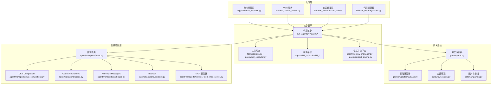
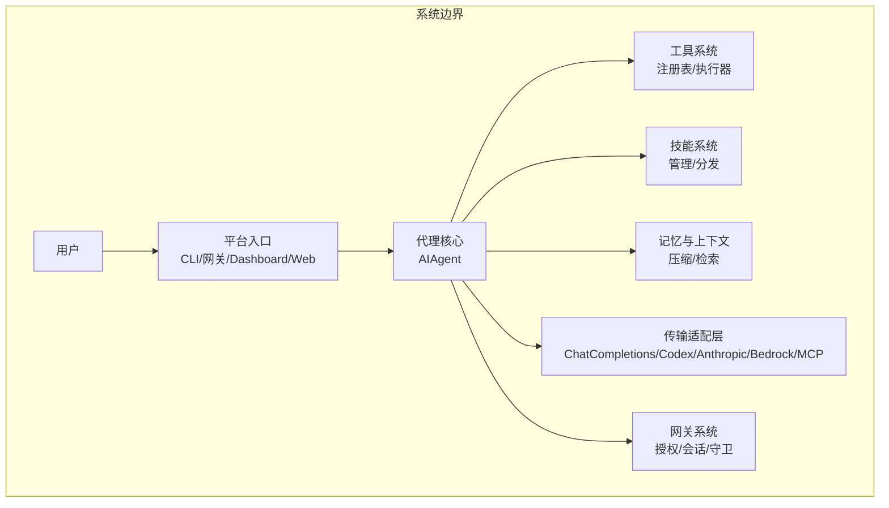
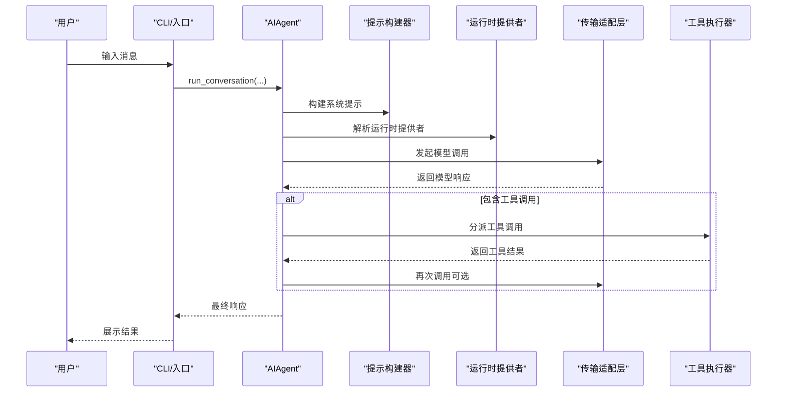
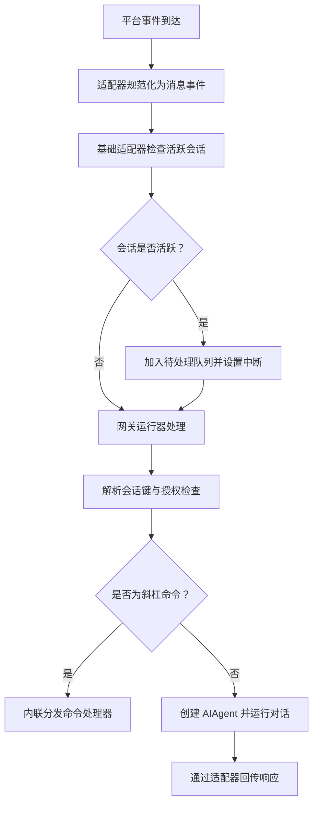
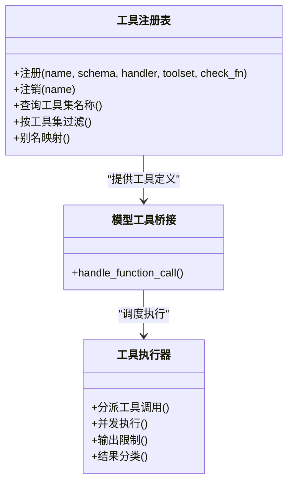
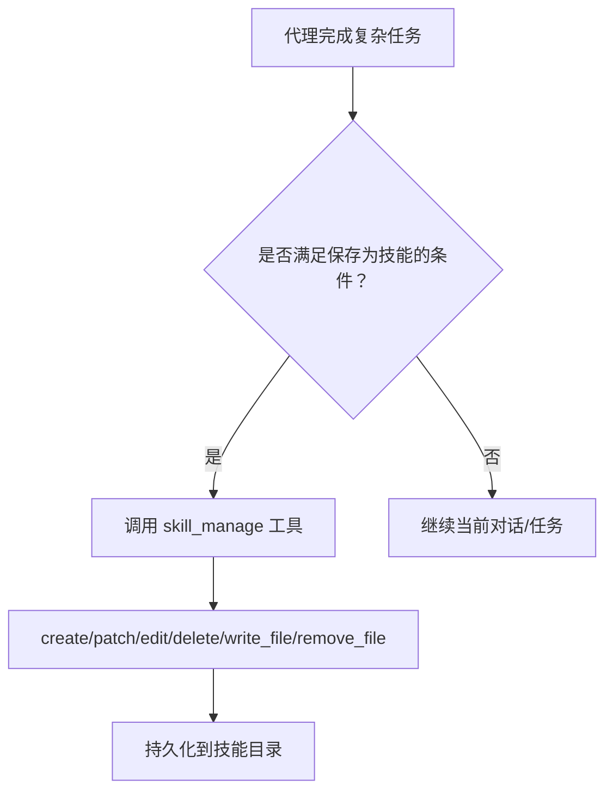
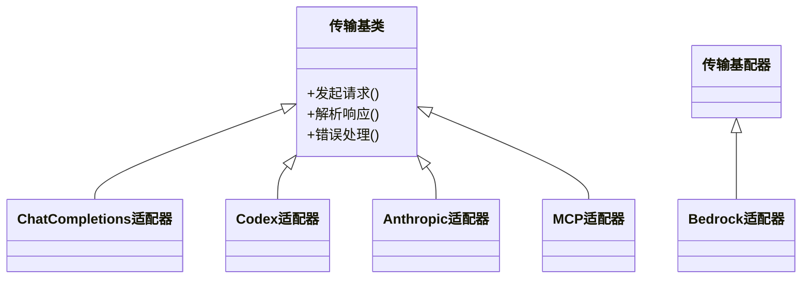
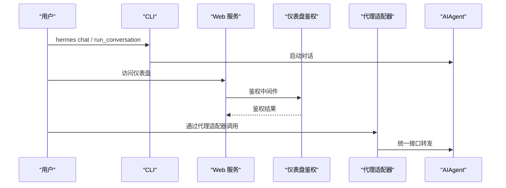
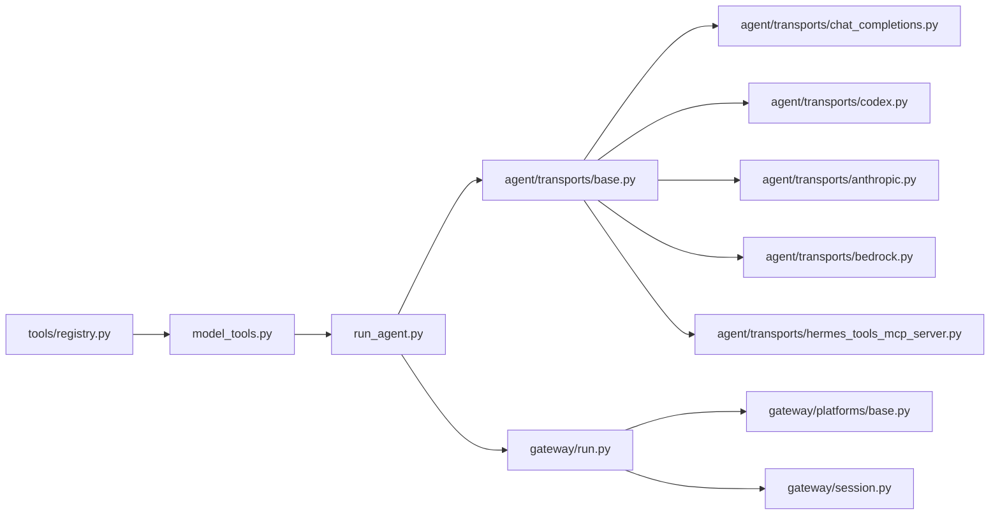

# 架构概览

<cite>
**本文引用的文件**
- [run_agent.py](file://run_agent.py)
- [cli.py](file://cli.py)
- [batch_runner.py](file://batch_runner.py)
- [prompt_builder.py](file://prompt_builder.py)
- [system_prompt.py](file://system_prompt.py)
- [model_tools.py](file://model_tools.py)
- [tools/registry.py](file://tools/registry.py)
- [gateway/run.py](file://gateway/run.py)
- [gateway/platforms/base.py](file://gateway/platforms/base.py)
- [gateway/session.py](file://gateway/session.py)
- [gateway/pairing.py](file://gateway/pairing.py)
- [hermes_cli/main.py](file://hermes_cli/main.py)
- [hermes_cli/web_server.py](file://hermes_cli/web_server.py)
- [hermes_cli/dashboard_auth/routes.py](file://hermes_cli/dashboard_auth/routes.py)
- [hermes_cli/dashboard_auth/middleware.py](file://hermes_cli/dashboard_auth/middleware.py)
- [hermes_cli/proxy/server.py](file://hermes_cli/proxy/server.py)
- [hermes_cli/proxy/adapters/base.py](file://hermes_cli/proxy/adapters/base.py)
- [hermes_cli/proxy/adapters/anthropic.py](file://hermes_cli/proxy/adapters/anthropic.py)
- [hermes_cli/proxy/adapters/bedrock.py](file://hermes_cli/proxy/adapters/bedrock.py)
- [hermes_cli/proxy/adapters/chat_completions.py](file://hermes_cli/proxy/adapters/chat_completions.py)
- [hermes_cli/proxy/adapters/codex.py](file://hermes_cli/proxy/adapters/codex.py)
- [hermes_cli/proxy/adapters/hermes_tools_mcp_server.py](file://hermes_cli/proxy/adapters/hermes_tools_mcp_server.py)
- [hermes_cli/proxy/adapters/types.py](file://hermes_cli/proxy/adapters/types.py)
- [agent/transports/chat_completions.py](file://agent/transports/chat_completions.py)
- [agent/transports/codex.py](file://agent/transports/codex.py)
- [agent/transports/anthropic.py](file://agent/transports/anthropic.py)
- [agent/transports/bedrock.py](file://agent/transports/bedrock.py)
- [agent/transports/hermes_tools_mcp_server.py](file://agent/transports/hermes_tools_mcp_server.py)
- [agent/transports/base.py](file://agent/transports/base.py)
- [agent/transports/types.py](file://agent/transports/types.py)
- [agent/context_compressor.py](file://agent/context_compressor.py)
- [agent/context_engine.py](file://agent/context_engine.py)
- [agent/memory_manager.py](file://agent/memory_manager.py)
- [agent/memory_provider.py](file://agent/memory_provider.py)
- [agent/tool_executor.py](file://agent/tool_executor.py)
- [agent/tool_guardrails.py](file://agent/tool_guardrails.py)
- [agent/tool_result_classification.py](file://agent/tool_result_classification.py)
- [agent/tool_dispatch_helpers.py](file://agent/tool_dispatch_helpers.py)
- [agent/skill_utils.py](file://agent/skill_utils.py)
- [agent/skill_bundles.py](file://agent/skill_bundles.py)
- [agent/skill_commands.py](file://agent/skill_commands.py)
- [agent/skill_preprocessing.py](file://agent/skill_preprocessing.py)
- [agent/curator.py](file://agent/curator.py)
- [agent/curator_backup.py](file://agent/curator_backup.py)
- [agent/iteration_budget.py](file://agent/iteration_budget.py)
- [agent/conversation_compression.py](file://agent/conversation_compression.py)
- [agent/conversation_loop.py](file://agent/conversation_loop.py)
- [agent/display.py](file://agent/display.py)
- [agent/error_classifier.py](file://agent/error_classifier.py)
- [agent/retry_utils.py](file://agent/retry_utils.py)
- [agent/stream_diag.py](file://agent/stream_diag.py)
- [agent/async_utils.py](file://agent/async_utils.py)
- [agent/runtime_cwd.py](file://agent/runtime_cwd.py)
- [agent/process_bootstrap.py](file://agent/process_bootstrap.py)
- [agent/lsp/client.py](file://agent/lsp/client.py)
- [agent/lsp/manager.py](file://agent/lsp/manager.py)
- [agent/lsp/protocol.py](file://agent/lsp/protocol.py)
- [agent/lsp/workspace.py](file://agent/lsp/workspace.py)
- [agent/browser_provider.py](file://agent/browser_provider.py)
- [agent/browser_registry.py](file://agent/browser_registry.py)
- [agent/image_gen_provider.py](file://agent/image_gen_provider.py)
- [agent/image_gen_registry.py](file://agent/image_gen_registry.py)
- [agent/video_gen_provider.py](file://agent/video_gen_provider.py)
- [agent/video_gen_registry.py](file://agent/video_gen_registry.py)
- [agent/web_search_provider.py](file://agent/web_search_provider.py)
- [agent/web_search_registry.py](file://agent/web_search_registry.py)
- [agent/transcription_provider.py](file://agent/transcription_provider.py)
- [agent/transcription_registry.py](file://agent/transcription_registry.py)
- [agent/tts_provider.py](file://agent/tts_provider.py)
- [agent/tts_registry.py](file://agent/tts_registry.py)
- [agent/image_routing.py](file://agent/image_routing.py)
- [agent/google_oauth.py](file://agent/google_oauth.py)
- [agent/azure_identity_adapter.py](file://agent/azure_identity_adapter.py)
- [agent/anthropic_adapter.py](file://agent/anthropic_adapter.py)
- [agent/bedrock_adapter.py](file://agent/bedrock_adapter.py)
- [agent/gemini_cloudcode_adapter.py](file://agent/gemini_cloudcode_adapter.py)
- [agent/gemini_native_adapter.py](file://agent/gemini_native_adapter.py)
- [agent/codex_responses_adapter.py](file://agent/codex_responses_adapter.py)
- [agent/codex_runtime.py](file://agent/codex_runtime.py)
- [agent/codex_responses_adapter.py](file://agent/codex_responses_adapter.py)
- [agent/codex_runtime.py](file://agent/codex_runtime.py)
- [agent/account_usage.py](file://agent/account_usage.py)
- [agent/credits_tracker.py](file://agent/credits_tracker.py)
- [agent/rate_limit_tracker.py](file://agent/rate_limit_tracker.py)
- [agent/usage_pricing.py](file://agent/usage_pricing.py)
- [agent/title_generator.py](file://agent/title_generator.py)
- [agent/think_scrubber.py](file://agent/think_scrubber.py)
- [agent/message_sanitization.py](file://agent/message_sanitization.py)
- [agent/redact.py](file://agent/redact.py)
- [agent/i18n.py](file://agent/i18n.py)
- [agent/model_metadata.py](file://agent/model_metadata.py)
- [agent/models_dev.py](file://agent/models_dev.py)
- [agent/moonshot_schema.py](file://agent/moonshot_schema.py)
- [agent/gemini_schema.py](file://agent/gemini_schema.py)
- [agent/nous_rate_guard.py](file://agent/nous_rate_guard.py)
- [agent/lmstudio_reasoning.py](file://agent/lmstudio_reasoning.py)
- [agent/jiter_preload.py](file://agent/jiter_preload.py)
- [agent/manual_compression_feedback.py](file://agent/manual_compression_feedback.py)
- [agent/subdirectory_hints.py](file://agent/subdirectory_hints.py)
- [agent/shell_hooks.py](file://agent/shell_hooks.py)
- [agent/onboarding.py](file://agent/onboarding.py)
- [agent/plugin_llm.py](file://agent/plugin_llm.py)
- [agent/portal_tags.py](file://agent/portal_tags.py)
- [agent/system_prompt.py](file://agent/system_prompt.py)
- [agent/prompt_builder.py](file://agent/prompt_builder.py)
- [agent/prompt_caching.py](file://agent/prompt_caching.py)
- [agent/context_compressor.py](file://agent/context_compressor.py)
- [agent/context_engine.py](file://agent/context_engine.py)
- [agent/memory_manager.py](file://agent/memory_manager.py)
- [agent/memory_provider.py](file://agent/memory_provider.py)
- [agent/tool_executor.py](file://agent/tool_executor.py)
- [agent/tool_guardrails.py](file://agent/tool_guardrails.py)
- [agent/tool_result_classification.py](file://agent/tool_result_classification.py)
- [agent/tool_dispatch_helpers.py](file://agent/tool_dispatch_helpers.py)
- [agent/skill_utils.py](file://agent/skill_utils.py)
- [agent/skill_bundles.py](file://agent/skill_bundles.py)
- [agent/skill_commands.py](file://agent/skill_commands.py)
- [agent/skill_preprocessing.py](file://agent/skill_preprocessing.py)
- [agent/curator.py](file://agent/curator.py)
- [agent/curator_backup.py](file://agent/curator_backup.py)
- [agent/iteration_budget.py](file://agent/iteration_budget.py)
- [agent/conversation_compression.py](file://agent/conversation_compression.py)
- [agent/conversation_loop.py](file://agent/conversation_loop.py)
- [agent/display.py](file://agent/display.py)
- [agent/error_classifier.py](file://agent/error_classifier.py)
- [agent/retry_utils.py](file://agent/retry_utils.py)
- [agent/stream_diag.py](file://agent/stream_diag.py)
- [agent/async_utils.py](file://agent/async_utils.py)
- [agent/runtime_cwd.py](file://agent/runtime_cwd.py)
- [agent/process_bootstrap.py](file://agent/process_bootstrap.py)
- [agent/lsp/client.py](file://agent/lsp/client.py)
- [agent/lsp/manager.py](file://agent/lsp/manager.py)
- [agent/lsp/protocol.py](file://agent/lsp/protocol.py)
- [agent/lsp/workspace.py](file://agent/lsp/workspace.py)
- [agent/browser_provider.py](file://agent/browser_provider.py)
- [agent/browser_registry.py](file://agent/browser_registry.py)
- [agent/image_gen_provider.py](file://agent/image_gen_provider.py)
- [agent/image_gen_registry.py](file://agent/image_gen_registry.py)
- [agent/video_gen_provider.py](file://agent/video_gen_provider.py)
- [agent/video_gen_registry.py](file://agent/video_gen_registry.py)
- [agent/web_search_provider.py](file://agent/web_search_provider.py)
- [agent/web_search_registry.py](file://agent/web_search_registry.py)
- [agent/transcription_provider.py](file://agent/transcription_provider.py)
- [agent/transcription_registry.py](file://agent/transcription_registry.py)
- [agent/tts_provider.py](file://agent/tts_provider.py)
- [agent/tts_registry.py](file://agent/tts_registry.py)
- [agent/image_routing.py](file://agent/image_routing.py)
- [agent/google_oauth.py](file://agent/google_oauth.py)
- [agent/azure_identity_adapter.py](file://agent/azure_identity_adapter.py)
- [agent/anthropic_adapter.py](file://agent/anthropic_adapter.py)
- [agent/bedrock_adapter.py](file://agent/bedrock_adapter.py)
- [agent/gemini_cloudcode_adapter.py](file://agent/gemini_cloudcode_adapter.py)
- [agent/gemini_native_adapter.py](file://agent/gemini_native_adapter.py)
- [agent/codex_responses_adapter.py](file://agent/codex_responses_adapter.py)
- [agent/codex_runtime.py](file://agent/codex_runtime.py)
- [agent/codex_responses_adapter.py](file://agent/codex_responses_adapter.py)
- [agent/codex_runtime.py](file://agent/codex_runtime.py)
- [agent/account_usage.py](file://agent/account_usage.py)
- [agent/credits_tracker.py](file://agent/credits_tracker.py)
- [agent/rate_limit_tracker.py](file://agent/rate_limit_tracker.py)
- [agent/usage_pricing.py](file://agent/usage_pricing.py)
- [agent/title_generator.py](file://agent/title_generator.py)
- [agent/think_scrubber.py](file://agent/think_scrubber.py)
- [agent/message_sanitization.py](file://agent/message_sanitization.py)
- [agent/redact.py](file://agent/redact.py)
- [agent/i18n.py](file://agent/i18n.py)
- [agent/model_metadata.py](file://agent/model_metadata.py)
- [agent/models_dev.py](file://agent/models_dev.py)
- [agent/moonshot_schema.py](file://agent/moonshot_schema.py)
- [agent/gemini_schema.py](file://agent/gemini_schema.py)
- [agent/nous_rate_guard.py](file://agent/nous_rate_guard.py)
- [agent/lmstudio_reasoning.py](file://agent/lmstudio_reasoning.py)
- [agent/jiter_preload.py](file://agent/jiter_preload.py)
- [agent/manual_compression_feedback.py](file://agent/manual_compression_feedback.py)
- [agent/subdirectory_hints.py](file://agent/subdirectory_hints.py)
- [agent/shell_hooks.py](file://agent/shell_hooks.py)
- [agent/onboarding.py](file://agent/onboarding.py)
- [agent/plugin_llm.py](file://agent/plugin_llm.py)
- [agent/portal_tags.py](file://agent/portal_tags.py)
</cite>

## 目录
1. [引言](#引言)
2. [项目结构](#项目结构)
3. [核心组件](#核心组件)
4. [架构总览](#架构总览)
5. [详细组件分析](#详细组件分析)
6. [依赖分析](#依赖分析)
7. [性能考量](#性能考量)
8. [故障排查指南](#故障排查指南)
9. [结论](#结论)
10. [附录](#附录)

## 引言
本文件面向初学者与资深开发者，系统化梳理 Hermes Agent 的高层设计与整体架构。重点阐述代理核心、网关系统、工具系统、技能系统等主要模块的职责与交互方式；给出系统边界图与组件分解图；说明技术决策与架构权衡；并讨论可扩展性与性能特征。

## 项目结构
Hermes Agent 采用“核心引擎 + 多入口 + 插件化子系统”的分层组织方式：
- 代理核心：统一的对话循环与推理引擎，负责提示工程、模型调用、工具调度、上下文压缩、记忆与持久化等。
- 网关系统：多平台消息入口，负责授权、会话路由、消息守卫与回传。
- 工具系统：工具注册、发现、执行、输出限制与分类。
- 技能系统：技能的创建、管理、分发与版本化。
- 传输适配层：统一抽象不同模型提供商与 MCP/工具服务的接入方式。
- CLI/Web/Dashboard：多入口承载用户交互与运维能力。

图表来源
- [run_agent.py](file://run_agent.py)
- [cli.py](file://cli.py)
- [hermes_cli/main.py](file://hermes_cli/main.py)
- [hermes_cli/web_server.py](file://hermes_cli/web_server.py)
- [hermes_cli/dashboard_auth/routes.py](file://hermes_cli/dashboard_auth/routes.py)
- [hermes_cli/proxy/server.py](file://hermes_cli/proxy/server.py)
- [gateway/run.py](file://gateway/run.py)
- [gateway/platforms/base.py](file://gateway/platforms/base.py)
- [gateway/session.py](file://gateway/session.py)
- [gateway/pairing.py](file://gateway/pairing.py)
- [agent/transports/base.py](file://agent/transports/base.py)
- [agent/transports/chat_completions.py](file://agent/transports/chat_completions.py)
- [agent/transports/codex.py](file://agent/transports/codex.py)
- [agent/transports/anthropic.py](file://agent/transports/anthropic.py)
- [agent/transports/bedrock.py](file://agent/transports/bedrock.py)
- [agent/transports/hermes_tools_mcp_server.py](file://agent/transports/hermes_tools_mcp_server.py)

章节来源
- [run_agent.py](file://run_agent.py)
- [cli.py](file://cli.py)
- [hermes_cli/main.py](file://hermes_cli/main.py)
- [hermes_cli/web_server.py](file://hermes_cli/web_server.py)
- [hermes_cli/dashboard_auth/routes.py](file://hermes_cli/dashboard_auth/routes.py)
- [hermes_cli/proxy/server.py](file://hermes_cli/proxy/server.py)
- [gateway/run.py](file://gateway/run.py)
- [gateway/platforms/base.py](file://gateway/platforms/base.py)
- [gateway/session.py](file://gateway/session.py)
- [gateway/pairing.py](file://gateway/pairing.py)
- [agent/transports/base.py](file://agent/transports/base.py)
- [agent/transports/chat_completions.py](file://agent/transports/chat_completions.py)
- [agent/transports/codex.py](file://agent/transports/codex.py)
- [agent/transports/anthropic.py](file://agent/transports/anthropic.py)
- [agent/transports/bedrock.py](file://agent/transports/bedrock.py)
- [agent/transports/hermes_tools_mcp_server.py](file://agent/transports/hermes_tools_mcp_server.py)

## 核心组件
- 代理核心（AIAgent）
  - 职责：统一的对话循环、提示构建、模型调用、工具调度、上下文压缩、记忆与持久化、重试与降级、迭代预算与中断控制。
  - 入口：CLI 的 chat/run_conversation；批量任务；网关消息；定时任务。
- 工具系统
  - 职责：工具注册、发现、执行、输出限制、结果分类与安全栅栏。
  - 机制：工具注册表在导入时自动发现，支持动态工具集与别名。
- 技能系统
  - 职责：技能的创建、管理、分发、版本化与复用；支持 hub 安装与社区技能浏览。
- 网关系统
  - 职责：多平台消息入口、授权与配对、会话路由、两级消息守卫、命令处理与回传。
- 传输适配层
  - 职责：抽象不同模型提供商与 MCP/工具服务的接入方式，统一请求/响应格式与错误处理。

章节来源
- [run_agent.py](file://run_agent.py)
- [tools/registry.py](file://tools/registry.py)
- [agent/tool_executor.py](file://agent/tool_executor.py)
- [agent/skill_utils.py](file://agent/skill_utils.py)
- [agent/skill_bundles.py](file://agent/skill_bundles.py)
- [agent/skill_commands.py](file://agent/skill_commands.py)
- [gateway/run.py](file://gateway/run.py)
- [gateway/platforms/base.py](file://gateway/platforms/base.py)
- [agent/transports/base.py](file://agent/transports/base.py)

## 架构总览
Hermes 采用“平台无关的核心 + 多入口 + 松耦合子系统”的架构模式：
- 平台无关的核心：单一 AIAgent 类贯穿 CLI、网关、ACP、批处理与 API 服务器，平台差异由入口与适配器承担。
- 松耦合：Optional 子系统（MCP、插件、记忆提供者、RL 环境）通过注册表与 check_fn 门控，避免硬依赖。
- 观测性与可中断：工具调用与模型调用均可被用户输入或信号中断；CLI 与网关均提供进度反馈。
- Prompt 稳定性：系统提示在对话中保持稳定，避免缓存破坏；仅在明确用户动作（如切换模型）时变更。

图表来源
- [run_agent.py](file://run_agent.py)
- [tools/registry.py](file://tools/registry.py)
- [agent/tool_executor.py](file://agent/tool_executor.py)
- [agent/skill_utils.py](file://agent/skill_utils.py)
- [agent/memory_manager.py](file://agent/memory_manager.py)
- [agent/context_engine.py](file://agent/context_engine.py)
- [agent/transports/base.py](file://agent/transports/base.py)
- [gateway/run.py](file://gateway/run.py)

## 详细组件分析

### 代理核心（AIAgent）
- 职责与流程
  - 提示装配：通过系统提示与提示构建器组装稳定的系统提示与上下文块。
  - 提供商选择：根据配置与能力选择 chat_completions、codex_responses 或 anthropic_messages 等 API 模式。
  - 可中断模型调用：支持取消与中断，便于用户干预。
  - 工具调度：顺序或并发执行工具调用，支持线程池与超时控制。
  - 上下文压缩：在上下文超限时对中间轮次进行摘要，维持长对话稳定性。
  - 记忆与持久化：在上下文丢失前刷新持久化记忆，确保信息不丢失。
  - 预算与回退：迭代预算与备用模型切换，提升鲁棒性。
- 数据流
  - 用户输入 → AIAgent.run_conversation → 提示构建 → 供应商解析 → API 调用 → 工具调用？→ 最终响应 → 展示与持久化。

图表来源
- [run_agent.py](file://run_agent.py)
- [prompt_builder.py](file://prompt_builder.py)
- [model_tools.py](file://model_tools.py)
- [agent/transports/base.py](file://agent/transports/base.py)

章节来源
- [run_agent.py](file://run_agent.py)
- [prompt_builder.py](file://prompt_builder.py)
- [model_tools.py](file://model_tools.py)
- [agent/context_compressor.py](file://agent/context_compressor.py)
- [agent/conversation_compression.py](file://agent/conversation_compression.py)
- [agent/conversation_loop.py](file://agent/conversation_loop.py)
- [agent/display.py](file://agent/display.py)
- [agent/retry_utils.py](file://agent/retry_utils.py)
- [agent/iteration_budget.py](file://agent/iteration_budget.py)

### 网关系统
- 职责与流程
  - 授权与配对：多层授权检查（平台白名单、DM 配对、全局放行），配对状态持久化。
  - 会话路由：基于会话键（包含平台、聊天类型、聊天 ID）解析会话上下文。
  - 两级消息守卫：基础适配器拦截活跃会话的消息并设置中断；网关运行器拦截命令并路由。
  - 消息回传：将最终响应通过平台适配器回传。
- 数据流
  - 平台事件 → 适配器规范化 → 基础适配器守卫 → 网关运行器处理 → 创建 AIAgent → 对话执行 → 回传响应。

图表来源
- [gateway/platforms/base.py](file://gateway/platforms/base.py)
- [gateway/run.py](file://gateway/run.py)
- [gateway/session.py](file://gateway/session.py)
- [gateway/pairing.py](file://gateway/pairing.py)

章节来源
- [gateway/platforms/base.py](file://gateway/platforms/base.py)
- [gateway/run.py](file://gateway/run.py)
- [gateway/session.py](file://gateway/session.py)
- [gateway/pairing.py](file://gateway/pairing.py)

### 工具系统
- 注册与发现
  - 工具在导入时通过注册表自动注册，形成工具目录；支持按工具集分组与别名。
  - 动态工具集与别名：工具集检查函数与别名在工具移除时自动清理或保留。
- 执行与安全
  - 工具执行器负责调度与并发控制；输出限制与结果分类保障安全与可控。
  - 工具搜索与作用域：工具搜索限定在会话工具集中，避免泄露宿主工具。
- 与代理核心的集成
  - 代理核心通过模型工具桥接工具调用，实现无缝衔接。

图表来源
- [tools/registry.py](file://tools/registry.py)
- [agent/tool_executor.py](file://agent/tool_executor.py)
- [agent/tool_dispatch_helpers.py](file://agent/tool_dispatch_helpers.py)
- [agent/tool_guardrails.py](file://agent/tool_guardrails.py)
- [agent/tool_result_classification.py](file://agent/tool_result_classification.py)

章节来源
- [tools/registry.py](file://tools/registry.py)
- [agent/tool_executor.py](file://agent/tool_executor.py)
- [agent/tool_dispatch_helpers.py](file://agent/tool_dispatch_helpers.py)
- [agent/tool_guardrails.py](file://agent/tool_guardrails.py)
- [agent/tool_result_classification.py](file://agent/tool_result_classification.py)
- [tests/tools/test_tool_search.py](file://tests/tools/test_tool_search.py)
- [tests/tools/test_mcp_dynamic_discovery.py](file://tests/tools/test_mcp_dynamic_discovery.py)

### 技能系统
- 能力与生命周期
  - 支持创建、修补、编辑、删除、文件增删等操作；优先使用修补以减少 token 消耗。
  - 支持 hub 浏览、搜索、安装与管理，涵盖多源技能。
- 与代理核心的协作
  - 代理在完成复杂任务后可将工作流保存为技能；技能可作为系统提示的一部分参与后续对话。

图表来源
- [agent/skill_utils.py](file://agent/skill_utils.py)
- [agent/skill_bundles.py](file://agent/skill_bundles.py)
- [agent/skill_commands.py](file://agent/skill_commands.py)
- [agent/skill_preprocessing.py](file://agent/skill_preprocessing.py)
- [tools/skill_manager_tool.py](file://tools/skill_manager_tool.py)
- [tools/skills_hub.py](file://tools/skills_hub.py)

章节来源
- [agent/skill_utils.py](file://agent/skill_utils.py)
- [agent/skill_bundles.py](file://agent/skill_bundles.py)
- [agent/skill_commands.py](file://agent/skill_commands.py)
- [agent/skill_preprocessing.py](file://agent/skill_preprocessing.py)
- [tools/skill_manager_tool.py](file://tools/skill_manager_tool.py)
- [tools/skills_hub.py](file://tools/skills_hub.py)

### 传输适配层
- 统一抽象
  - 传输基类定义通用接口；具体适配器覆盖不同提供商（Chat Completions、Codex、Anthropic、Bedrock）与 MCP 服务器。
- 错误处理与兼容
  - 适配器层处理网络异常、速率限制与协议差异，向上提供一致的调用体验。

图表来源
- [agent/transports/base.py](file://agent/transports/base.py)
- [agent/transports/chat_completions.py](file://agent/transports/chat_completions.py)
- [agent/transports/codex.py](file://agent/transports/codex.py)
- [agent/transports/anthropic.py](file://agent/transports/anthropic.py)
- [agent/transports/bedrock.py](file://agent/transports/bedrock.py)
- [agent/transports/hermes_tools_mcp_server.py](file://agent/transports/hermes_tools_mcp_server.py)

章节来源
- [agent/transports/base.py](file://agent/transports/base.py)
- [agent/transports/chat_completions.py](file://agent/transports/chat_completions.py)
- [agent/transports/codex.py](file://agent/transports/codex.py)
- [agent/transports/anthropic.py](file://agent/transports/anthropic.py)
- [agent/transports/bedrock.py](file://agent/transports/bedrock.py)
- [agent/transports/hermes_tools_mcp_server.py](file://agent/transports/hermes_tools_mcp_server.py)

### 入口与运维（CLI/Web/Dashboard/Proxy）
- CLI：提供命令行交互与会话管理；支持 TUI 与 RPC 驱动的技能 hub。
- Web/Dashboard：提供仪表盘鉴权与 Web 服务；中间件与路由分离鉴权逻辑。
- Proxy：代理适配器封装不同提供商的适配器，统一对外接口。

图表来源
- [cli.py](file://cli.py)
- [hermes_cli/main.py](file://hermes_cli/main.py)
- [hermes_cli/web_server.py](file://hermes_cli/web_server.py)
- [hermes_cli/dashboard_auth/routes.py](file://hermes_cli/dashboard_auth/routes.py)
- [hermes_cli/dashboard_auth/middleware.py](file://hermes_cli/dashboard_auth/middleware.py)
- [hermes_cli/proxy/server.py](file://hermes_cli/proxy/server.py)
- [hermes_cli/proxy/adapters/base.py](file://hermes_cli/proxy/adapters/base.py)
- [hermes_cli/proxy/adapters/anthropic.py](file://hermes_cli/proxy/adapters/anthropic.py)
- [hermes_cli/proxy/adapters/bedrock.py](file://hermes_cli/proxy/adapters/bedrock.py)
- [hermes_cli/proxy/adapters/chat_completions.py](file://hermes_cli/proxy/adapters/chat_completions.py)
- [hermes_cli/proxy/adapters/codex.py](file://hermes_cli/proxy/adapters/codex.py)
- [hermes_cli/proxy/adapters/hermes_tools_mcp_server.py](file://hermes_cli/proxy/adapters/hermes_tools_mcp_server.py)

章节来源
- [cli.py](file://cli.py)
- [hermes_cli/main.py](file://hermes_cli/main.py)
- [hermes_cli/web_server.py](file://hermes_cli/web_server.py)
- [hermes_cli/dashboard_auth/routes.py](file://hermes_cli/dashboard_auth/routes.py)
- [hermes_cli/dashboard_auth/middleware.py](file://hermes_cli/dashboard_auth/middleware.py)
- [hermes_cli/proxy/server.py](file://hermes_cli/proxy/server.py)
- [hermes_cli/proxy/adapters/base.py](file://hermes_cli/proxy/adapters/base.py)
- [hermes_cli/proxy/adapters/anthropic.py](file://hermes_cli/proxy/adapters/anthropic.py)
- [hermes_cli/proxy/adapters/bedrock.py](file://hermes_cli/proxy/adapters/bedrock.py)
- [hermes_cli/proxy/adapters/chat_completions.py](file://hermes_cli/proxy/adapters/chat_completions.py)
- [hermes_cli/proxy/adapters/codex.py](file://hermes_cli/proxy/adapters/codex.py)
- [hermes_cli/proxy/adapters/hermes_tools_mcp_server.py](file://hermes_cli/proxy/adapters/hermes_tools_mcp_server.py)

## 依赖分析
- 组件耦合与内聚
  - 工具注册表位于 tools/registry.py，作为所有工具的唯一入口，降低耦合度。
  - 传输适配器通过基类抽象，避免上层感知具体提供商差异。
  - 网关系统与代理核心通过事件与会话键解耦，授权与守卫逻辑清晰分离。
- 外部依赖与集成点
  - 多平台适配器（Telegram、Slack、Matrix 等）通过统一接口接入网关。
  - MCP 与外部工具服务通过适配器桥接，支持动态发现与 OAuth 管理。
- 潜在循环依赖
  - 工具注册表在导入时即生效，避免运行时动态加载导致的循环依赖风险。

图表来源
- [tools/registry.py](file://tools/registry.py)
- [model_tools.py](file://model_tools.py)
- [run_agent.py](file://run_agent.py)
- [agent/transports/base.py](file://agent/transports/base.py)
- [agent/transports/chat_completions.py](file://agent/transports/chat_completions.py)
- [agent/transports/codex.py](file://agent/transports/codex.py)
- [agent/transports/anthropic.py](file://agent/transports/anthropic.py)
- [agent/transports/bedrock.py](file://agent/transports/bedrock.py)
- [agent/transports/hermes_tools_mcp_server.py](file://agent/transports/hermes_tools_mcp_server.py)
- [gateway/run.py](file://gateway/run.py)
- [gateway/platforms/base.py](file://gateway/platforms/base.py)
- [gateway/session.py](file://gateway/session.py)

章节来源
- [tools/registry.py](file://tools/registry.py)
- [model_tools.py](file://model_tools.py)
- [run_agent.py](file://run_agent.py)
- [agent/transports/base.py](file://agent/transports/base.py)
- [gateway/run.py](file://gateway/run.py)
- [gateway/platforms/base.py](file://gateway/platforms/base.py)
- [gateway/session.py](file://gateway/session.py)

## 性能考量
- 上下文压缩与缓存
  - 中间轮次摘要与前缀缓存（如 Anthropic 缓存断点）降低 token 消耗与延迟。
- 并发与中断
  - 工具执行支持并发与中断，缩短等待时间并提升用户体验。
- 重试与降级
  - 提供重试策略与备用模型切换，增强鲁棒性。
- I/O 与资源隔离
  - 进程启动与运行时工作目录隔离，减少资源争用与副作用。

章节来源
- [agent/context_compressor.py](file://agent/context_compressor.py)
- [agent/context_engine.py](file://agent/context_engine.py)
- [agent/prompt_caching.py](file://agent/prompt_caching.py)
- [agent/tool_executor.py](file://agent/tool_executor.py)
- [agent/retry_utils.py](file://agent/retry_utils.py)
- [agent/iteration_budget.py](file://agent/iteration_budget.py)
- [agent/runtime_cwd.py](file://agent/runtime_cwd.py)
- [agent/process_bootstrap.py](file://agent/process_bootstrap.py)

## 故障排查指南
- 网关授权问题
  - 检查平台白名单、DM 配对状态与全局放行标志；确认会话键格式正确。
- 消息守卫与命令冲突
  - 确认两级守卫逻辑与内联命令分发；避免竞态条件。
- 工具执行失败
  - 检查工具注册表、工具集别名与动态发现；查看输出限制与结果分类。
- 传输适配器异常
  - 核对提供商凭证、速率限制与协议差异；查看适配器错误处理。
- 代理核心中断与重试
  - 检查中断信号、迭代预算与重试策略；关注上下文压缩与内存刷新。

章节来源
- [gateway/pairing.py](file://gateway/pairing.py)
- [gateway/platforms/base.py](file://gateway/platforms/base.py)
- [gateway/run.py](file://gateway/run.py)
- [tools/registry.py](file://tools/registry.py)
- [agent/tool_executor.py](file://agent/tool_executor.py)
- [agent/transports/base.py](file://agent/transports/base.py)
- [agent/retry_utils.py](file://agent/retry_utils.py)
- [agent/iteration_budget.py](file://agent/iteration_budget.py)

## 结论
Hermes Agent 通过“平台无关的核心 + 多入口 + 松耦合子系统”的架构，实现了高可扩展性与强健性。代理核心统一编排提示、模型与工具；网关系统提供多平台接入与安全控制；工具与技能系统支持动态扩展与复用；传输适配层屏蔽提供商差异。该设计在保证可观测性与可中断性的前提下，兼顾性能与可维护性，适合从个人助理到企业级智能体的广泛场景。

## 附录
- 设计原则速览
  - Prompt 稳定性、可观测执行、可中断、平台无关核心、松耦合、Profile 隔离。
- 推荐阅读顺序
  - 架构概览 → 代理循环内部机制 → 提示组装 → 提供商运行时解析 → 工具运行时 → 会话存储 → 网关内部机制 → 上下文压缩与提示缓存 → ACP 内部机制。