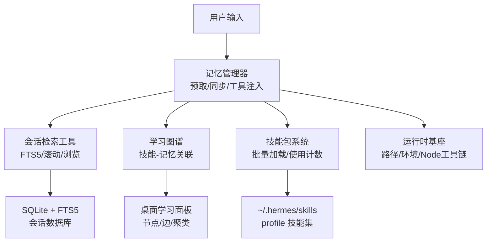
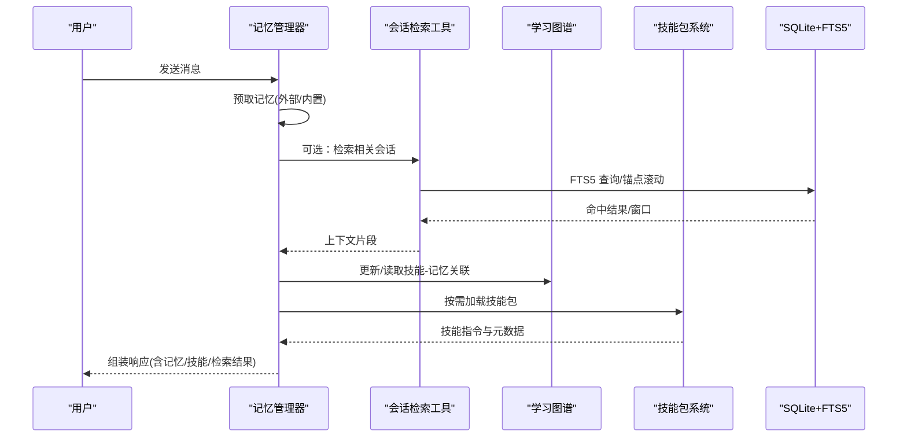
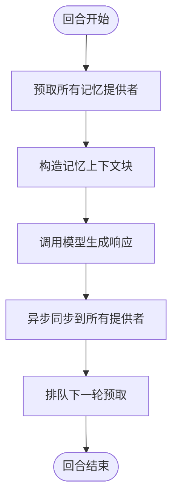
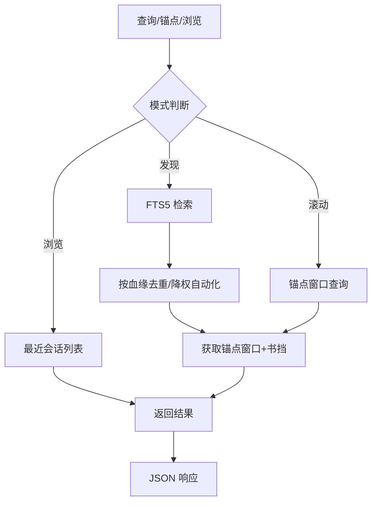
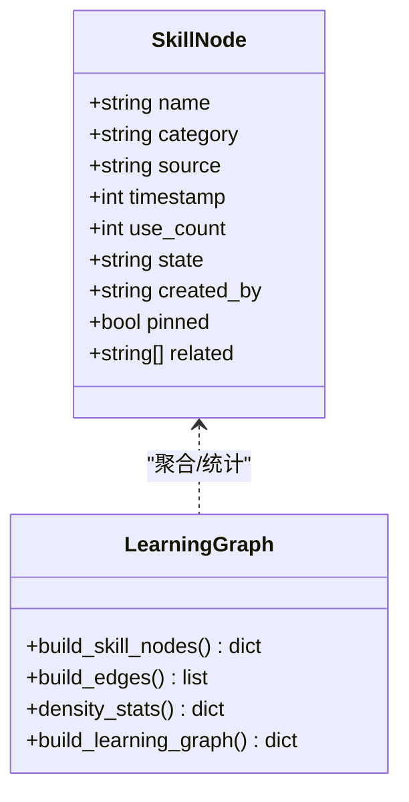
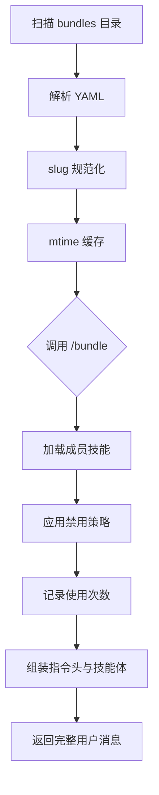
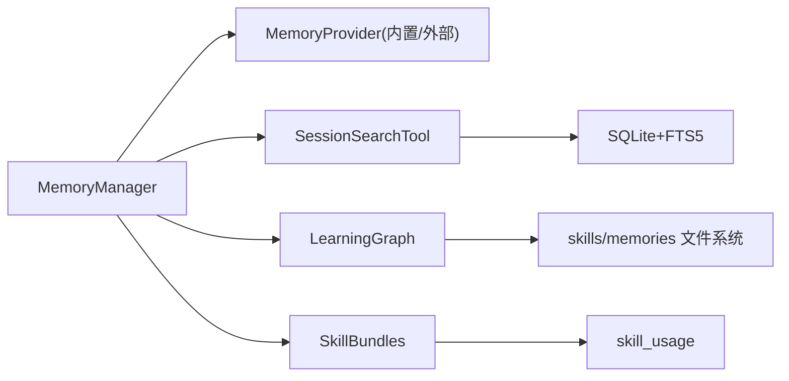

# 核心特性与价值主张

<cite>
**本文引用的文件**
- [README.md](file://README.md)
- [hermes_constants.py](file://hermes_constants.py)
- [agent/memory_manager.py](file://agent/memory_manager.py)
- [agent/learning_graph.py](file://agent/learning_graph.py)
- [tools/session_search_tool.py](file://tools/session_search_tool.py)
- [agent/skill_bundles.py](file://agent/skill_bundles.py)
</cite>

## 目录
1. [简介](#简介)
2. [项目结构](#项目结构)
3. [核心组件](#核心组件)
4. [架构总览](#架构总览)
5. [详细组件分析](#详细组件分析)
6. [依赖关系分析](#依赖关系分析)
7. [性能考量](#性能考量)
8. [故障排查指南](#故障排查指南)
9. [结论](#结论)
10. [附录](#附录)

## 简介
Hermes Agent 是内置“学习循环”的自改进 AI 代理：它能从经验中创建技能、在使用中持续改进技能、持久化知识、搜索过往对话，并构建不断深化的用户模型。它不绑定特定模型或平台，可在 VPS、GPU 集群或近乎零成本的无服务器环境中运行；同时支持 Telegram、Discord、Slack、WhatsApp、Signal 等消息通道，以及本地终端界面。其独特之处在于“闭环学习”——记忆、技能、会话检索与用户画像在每次交互中互相增强，形成越用越懂你的智能体。

## 项目结构
围绕“学习循环”，代码库将能力拆分为可组合的模块：
- 记忆编排：MemoryManager 统一接入内置与外部记忆提供者，负责预取、同步、工具注入与流式上下文清洗。
- 学习可视化：Learning Graph 将“已学会的技能”和“记忆片段”组织为图，展示关联与密度统计。
- 会话检索：Session Search Tool 提供 FTS5 全文检索、锚点滚动浏览与最近会话浏览，支持跨会话回溯。
- 技能生态：Skill Bundles 将多个技能打包为一条斜杠命令，便于复用与分发；配合使用计数与来源追踪，形成“技能即记忆”的生态。
- 运行时基座：hermes_constants 提供路径、环境、Node 工具链等基础设施，确保多部署形态一致。

图表来源
- [agent/memory_manager.py:364-757](file://agent/memory_manager.py#L364-L757)
- [tools/session_search_tool.py:1-800](file://tools/session_search_tool.py#L1-L800)
- [agent/learning_graph.py:254-323](file://agent/learning_graph.py#L254-L323)
- [agent/skill_bundles.py:168-368](file://agent/skill_bundles.py#L168-L368)
- [hermes_constants.py:114-198](file://hermes_constants.py#L114-L198)

章节来源
- [README.md:19-31](file://README.md#L19-L31)
- [hermes_constants.py:114-198](file://hermes_constants.py#L114-L198)

## 核心组件
- 记忆管理器（MemoryManager）
  - 职责：注册内置与至多一个外部记忆提供者；构建系统提示；回合前预取上下文；回合后异步同步；注入记忆相关工具；流式上下文清洗。
  - 关键机制：外部预取超时保护、单工作线程串行写入、后台任务优雅关闭、工具 schema 规范化与冲突规避。
- 会话检索工具（Session Search Tool）
  - 职责：三种调用模式（发现/滚动/浏览），基于 SQLite FTS5 实现跨会话检索；自动去重、降权自动化源、压缩历史可见性处理；返回锚点窗口与书挡消息。
  - 关键机制：按血缘根去重、压缩归档识别、标题匹配优先、索引重建状态提示。
- 学习图谱（Learning Graph）
  - 职责：扫描基础与个人技能、读取 MEMORY.md/USER.md 记忆卡片、计算技能间相关边与记忆-技能边，输出节点/边/聚类/统计。
  - 关键机制：frontmatter 解析、使用计数与时间戳归一化、词法重叠打分。
- 技能包（Skill Bundles）
  - 职责：将多个技能打包为单一斜杠命令；动态加载、禁用过滤、缺失提示；记录使用次数；生成聚合指令。
  - 关键机制：slug 规范化、mtime 缓存、YAML 配置驱动、与技能命令系统的兼容。
- 运行时基座（hermes_constants）
  - 职责：HERMES_HOME 解析、profile 模式、Node/npm/npx 管理、浏览器工具可用性探测、安全父目录权限等。
  - 关键机制：进程级与上下文级作用域分离、自愈 Node 树、健壮的路径回退。

章节来源
- [agent/memory_manager.py:50-157](file://agent/memory_manager.py#L50-L157)
- [agent/memory_manager.py:364-757](file://agent/memory_manager.py#L364-L757)
- [tools/session_search_tool.py:1-800](file://tools/session_search_tool.py#L1-L800)
- [agent/learning_graph.py:25-190](file://agent/learning_graph.py#L25-L190)
- [agent/learning_graph.py:193-323](file://agent/learning_graph.py#L193-L323)
- [agent/skill_bundles.py:168-368](file://agent/skill_bundles.py#L168-L368)
- [hermes_constants.py:114-198](file://hermes_constants.py#L114-L198)

## 架构总览
Hermes Agent 的学习循环由“记忆—技能—检索—用户模型”四者构成闭环：
- 记忆层：回合前后通过 MemoryManager 预取与同步，保证 LLM 始终获得最新、最相关的持久化知识。
- 技能层：通过 Skill Bundles 将复杂流程封装为可复用单元，并在使用中积累使用计数与来源信息。
- 检索层：Session Search Tool 让代理能“回忆”过去对话，结合 FTS5 与血缘去重，避免自动化内容淹没用户历史。
- 用户模型：MEMORY.md/USER.md 作为显式记忆，Learning Graph 将其与技能关联，形成“我记住了什么、学会了什么”的可视化知识网络。

图表来源
- [agent/memory_manager.py:525-694](file://agent/memory_manager.py#L525-L694)
- [tools/session_search_tool.py:690-800](file://tools/session_search_tool.py#L690-L800)
- [agent/learning_graph.py:254-323](file://agent/learning_graph.py#L254-L323)
- [agent/skill_bundles.py:253-368](file://agent/skill_bundles.py#L253-L368)

## 详细组件分析

### 记忆管理器（MemoryManager）
- 设计要点
  - 仅允许一个外部提供者，避免工具 schema 膨胀与后端冲突。
  - 外部预取采用独立线程与超时控制，失败不影响主流程。
  - 回合同步走单工作线程队列，保证写入顺序与进程退出时优雅关闭。
  - 工具 schema 规范化，防止因格式不一致导致请求被拒绝。
- 数据流
  - 回合前：prefetch_all → 合并各提供者上下文 → 包装为 <memory-context> 块。
  - 回合后：sync_all → 异步写入；queue_prefetch_all → 下一轮预取预热。
- 错误处理
  - 单个提供者异常不会阻塞其他提供者；超时与失败均记录日志并降级。

图表来源
- [agent/memory_manager.py:525-694](file://agent/memory_manager.py#L525-L694)
- [agent/memory_manager.py:364-401](file://agent/memory_manager.py#L364-L401)

章节来源
- [agent/memory_manager.py:50-157](file://agent/memory_manager.py#L50-L157)
- [agent/memory_manager.py:364-757](file://agent/memory_manager.py#L364-L757)

### 会话检索工具（Session Search Tool）
- 设计要点
  - 三合一接口：discover（FTS5 发现）、scroll（锚点滚动）、browse（最近会话）。
  - 自动降权 cron 等自动化源，避免“召回盲区”。
  - 对压缩归档与压缩结束的会话进行特殊处理，确保可回溯到已总结的历史。
  - 支持跨 profile 只读访问与链接渲染。
- 算法流程
  - 标题匹配优先 → FTS5 检索 → 按血缘去重 → 锚点窗口 + 书挡 → 返回结构化结果。
- 性能与安全
  - 限制扫描上限、避免大负载；ANSI 转义清理；索引重建状态提示。

图表来源
- [tools/session_search_tool.py:690-800](file://tools/session_search_tool.py#L690-L800)
- [tools/session_search_tool.py:437-615](file://tools/session_search_tool.py#L437-L615)

章节来源
- [tools/session_search_tool.py:1-800](file://tools/session_search_tool.py#L1-L800)

### 学习图谱（Learning Graph）
- 设计要点
  - 聚焦“已学会”的技能（非基础安装且被代理创建或使用过）与记忆卡片。
  - 技能边来自 declared related_skills；记忆-技能边通过词法重叠打分建立。
  - 输出节点、边、聚类与密度统计，用于桌面学习面板。
- 数据结构
  - SkillNode：名称、类别、来源、时间戳、使用次数、状态、创建者、是否置顶、相关技能。
  - 记忆卡片：MEMORY.md/USER.md 按分隔符切分，标题与正文摘要。
- 复杂度
  - 构建节点：O(S)，S 为技能文件数。
  - 构建边：O(S+E)，E 为相关技能声明总数。
  - 记忆-技能边：O(M*K)，M 为记忆卡片数，K 为技能数（词法交集打分）。

图表来源
- [agent/learning_graph.py:25-190](file://agent/learning_graph.py#L25-L190)
- [agent/learning_graph.py:254-323](file://agent/learning_graph.py#L254-L323)

章节来源
- [agent/learning_graph.py:25-190](file://agent/learning_graph.py#L25-L190)
- [agent/learning_graph.py:193-323](file://agent/learning_graph.py#L193-L323)

### 技能包（Skill Bundles）
- 设计要点
  - YAML 配置驱动，支持 name/description/instruction/skills。
  - slug 规范化与冲突处理；mtime 缓存减少磁盘扫描。
  - 加载时应用禁用策略、记录使用次数、生成聚合指令头。
- 使用场景
  - 一键加载“研究套件”“开发套件”等多技能组合，提升复杂任务效率。
  - 团队共享标准工作流，降低上手成本。

图表来源
- [agent/skill_bundles.py:168-368](file://agent/skill_bundles.py#L168-L368)

章节来源
- [agent/skill_bundles.py:168-368](file://agent/skill_bundles.py#L168-L368)

### 运行时基座（hermes_constants）
- 设计要点
  - 统一的 HERMES_HOME 解析，支持 profile 模式与自定义部署。
  - Node/npm/npx 自愈：检测损坏/过时版本并重新下载目标 Major。
  - 浏览器工具可用性探测，避免空引用导致后续工具失效。
- 价值
  - 保障跨平台一致性，简化部署与维护；为上层功能提供稳定基线。

章节来源
- [hermes_constants.py:114-198](file://hermes_constants.py#L114-L198)
- [hermes_constants.py:325-666](file://hermes_constants.py#L325-L666)

## 依赖关系分析
- 松耦合与高内聚
  - MemoryManager 通过 Provider 接口解耦具体存储实现；工具 schema 注入与路由隔离。
  - Session Search Tool 直接依赖 hermes_state 提供的会话数据库接口，屏蔽底层细节。
  - Learning Graph 依赖 skills 与 memories 文件系统约定，输出面向 UI 的结构化数据。
  - Skill Bundles 依赖 skill_commands 与 skill_usage，形成“加载—使用—统计”的闭环。
- 潜在风险
  - 外部记忆提供者超时或失败需严格隔离，避免影响主流程（已在 MemoryManager 中实现）。
  - FTS5 索引重建期间搜索结果可能不完整，需在 UI 中提示（已在 Session Search Tool 中实现）。

图表来源
- [agent/memory_manager.py:364-757](file://agent/memory_manager.py#L364-L757)
- [tools/session_search_tool.py:690-800](file://tools/session_search_tool.py#L690-L800)
- [agent/learning_graph.py:254-323](file://agent/learning_graph.py#L254-L323)
- [agent/skill_bundles.py:253-368](file://agent/skill_bundles.py#L253-L368)

章节来源
- [agent/memory_manager.py:364-757](file://agent/memory_manager.py#L364-L757)
- [tools/session_search_tool.py:690-800](file://tools/session_search_tool.py#L690-L800)
- [agent/learning_graph.py:254-323](file://agent/learning_graph.py#L254-L323)
- [agent/skill_bundles.py:253-368](file://agent/skill_bundles.py#L253-L368)

## 性能考量
- 记忆预取与同步
  - 外部预取超时保护，避免慢后端阻塞；单工作线程串行写入，保证顺序与资源可控。
- 会话检索
  - FTS5 全文检索 + 血缘去重 + 降权自动化源，平衡召回质量与性能；限制扫描上限，避免大结果集。
- 学习图谱
  - 仅关注“已学会”的技能与记忆，降低节点规模；词法重叠打分轻量高效。
- 技能包
  - mtime 缓存减少频繁磁盘扫描；按需加载与禁用过滤降低无效开销。
- 运行时基座
  - Node/npm/npx 自愈与可用性探测，减少启动失败与运行时异常。

[本节为通用性能讨论，无需特定文件分析]

## 故障排查指南
- 记忆提供者异常
  - 现象：某外部提供者预取超时或同步失败。
  - 处理：检查日志中的 provider 名称与错误；确认网络/服务状态；必要时暂时禁用该提供者。
- 会话检索不完整
  - 现象：旧消息未出现在搜索结果中。
  - 处理：查看索引重建进度提示；等待后台重建完成；必要时触发重建。
- 技能包加载失败
  - 现象：部分技能缺失或被禁用。
  - 处理：检查 bundle YAML 配置；确认技能名与平台禁用策略；查看加载日志中的 missing/disabled 列表。
- Node 工具链问题
  - 现象：npm/node 不可用或版本不匹配。
  - 处理：运行自愈流程；验证 node/npm/npx 可执行性；必要时重新安装托管 Node 树。

章节来源
- [agent/memory_manager.py:547-595](file://agent/memory_manager.py#L547-L595)
- [tools/session_search_tool.py:211-231](file://tools/session_search_tool.py#L211-L231)
- [agent/skill_bundles.py:253-368](file://agent/skill_bundles.py#L253-L368)
- [hermes_constants.py:325-666](file://hermes_constants.py#L325-L666)

## 结论
Hermes Agent 以“内置学习循环”为核心差异化优势：记忆、技能、检索与用户模型在每次交互中相互增强，形成可持续进化的智能体。其架构通过模块化设计（记忆编排、会话检索、学习图谱、技能包、运行时基座）实现了高内聚、低耦合与可扩展性；同时兼顾性能与稳定性（超时保护、索引重建提示、Node 自愈）。长期目标是构建开放的“技能生态系统”与“持久化知识网络”，让代理越用越聪明、越用越懂你。

[本节为总结性内容，无需特定文件分析]

## 附录
- 使用场景示例
  - 跨会话知识复用：在项目中遇到类似问题，可通过会话检索快速定位历史方案，并结合记忆与技能包复现解决流程。
  - 复杂任务编排：通过技能包一键加载“研究套件”，自动拉取背景资料、整理对比矩阵、生成报告草稿。
  - 用户画像深化：随着对话推进，MEMORY.md/USER.md 与技能使用计数共同刻画用户偏好，使后续建议更精准。
- 技术愿景
  - 开放标准兼容：与 agentskills.io 等开放标准对齐，促进技能共享与生态繁荣。
  - 多端一致体验：CLI/TUI/Gateway 共享同一套能力，无论在哪台设备、哪个平台都能无缝继续。
  - 低成本运行：支持 $5 VPS 与无服务器环境，闲置几乎零成本，按需唤醒。

[本节为概念性内容，无需特定文件分析]