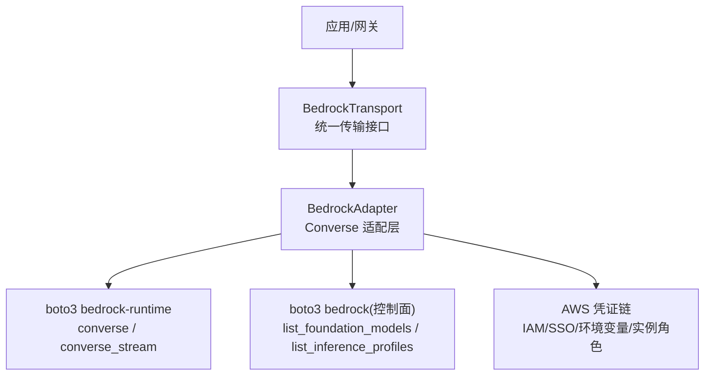
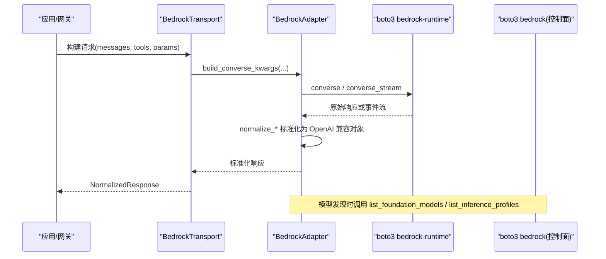
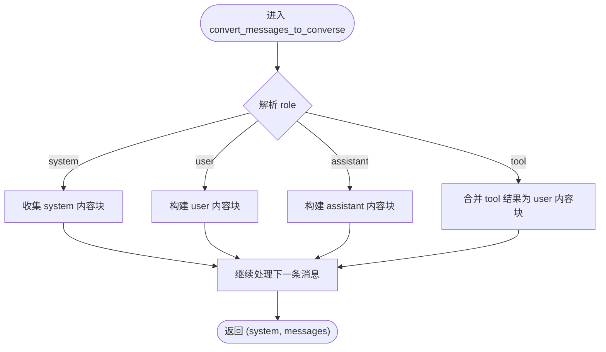
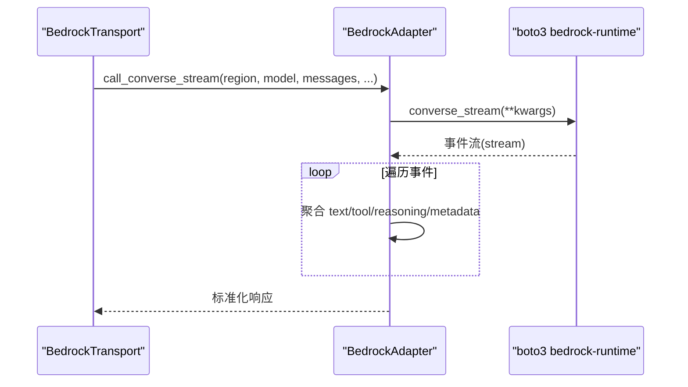
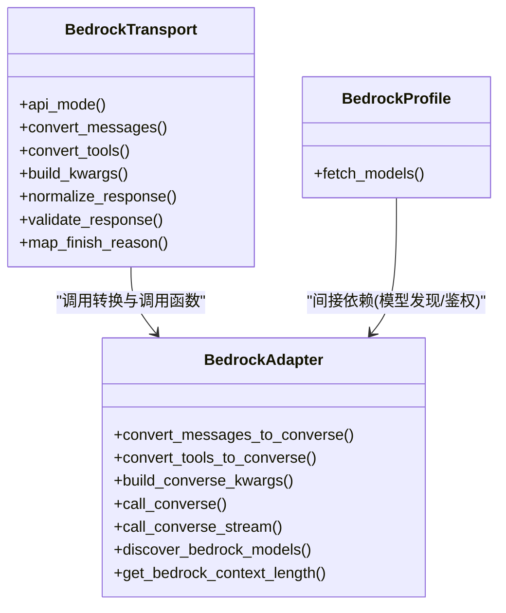

# AWS Bedrock 提供商

<cite>
**本文引用的文件**
- [agent/bedrock_adapter.py](file://agent/bedrock_adapter.py)
- [agent/transports/bedrock.py](file://agent/transports/bedrock.py)
- [plugins/model-providers/bedrock/__init__.py](file://plugins/model-providers/bedrock/__init__.py)
- [website/docs/guides/aws-bedrock.md](file://website/docs/guides/aws-bedrock.md)
</cite>

## 目录
1. [简介](#简介)
2. [项目结构](#项目结构)
3. [核心组件](#核心组件)
4. [架构总览](#架构总览)
5. [详细组件分析](#详细组件分析)
6. [依赖关系分析](#依赖关系分析)
7. [性能与成本优化](#性能与成本优化)
8. [故障排除指南](#故障排除指南)
9. [结论](#结论)
10. [附录：配置示例与最佳实践](#附录：配置示例与最佳实践)

## 简介
本文件面向在 Hermes Agent 中集成和使用 Amazon Bedrock 的工程师与运维人员，系统性说明 Bedrock 提供商的配置、IAM 权限、模型访问控制、支持的多种基础模型（Claude、Llama、Nova 等）、企业级能力（Guardrails、推理优化、上下文窗口探测）、与 AWS 生态的集成方式，以及性能调优、成本优化、监控告警与故障排除的最佳实践。

Hermes Agent 通过原生 Converse API 接入 Bedrock，绕过 OpenAI 兼容端点，从而获得完整的 Bedrock 生态能力：IAM 认证、Guardrails、跨区推理配置文件、流式响应、工具调用、提示词缓存等。

## 项目结构
Bedrock 相关代码主要分布在以下位置：
- agent/bedrock_adapter.py：Bedrock Converse API 的核心适配层，负责消息/工具格式转换、Converse 调用、流式事件处理、错误分类、模型发现、上下文长度探测等。
- agent/transports/bedrock.py：将 Bedrock 适配为统一的 ProviderTransport，提供消息/工具转换、参数构建、响应标准化和校验。
- plugins/model-providers/bedrock/__init__.py：注册 Bedrock 提供商 Profile，声明鉴权类型、API 模式与默认 base_url。
- website/docs/guides/aws-bedrock.md：官方用户指南，涵盖前置条件、快速开始、配置项、可用模型、诊断与排错等。

图表来源
- [agent/transports/bedrock.py:15-65](file://agent/transports/bedrock.py#L15-L65)
- [agent/bedrock_adapter.py:91-111](file://agent/bedrock_adapter.py#L91-L111)
- [agent/bedrock_adapter.py:1198-1327](file://agent/bedrock_adapter.py#L1198-L1327)
- [plugins/model-providers/bedrock/__init__.py:7-28](file://plugins/model-providers/bedrock/__init__.py#L7-L28)

章节来源
- [agent/bedrock_adapter.py:1-1574](file://agent/bedrock_adapter.py#L1-L1574)
- [agent/transports/bedrock.py:1-155](file://agent/transports/bedrock.py#L1-L155)
- [plugins/model-providers/bedrock/__init__.py:1-31](file://plugins/model-providers/bedrock/__init__.py#L1-L31)
- [website/docs/guides/aws-bedrock.md:1-179](file://website/docs/guides/aws-bedrock.md#L1-L179)

## 核心组件
- BedrockTransport：实现 ProviderTransport 接口，封装消息/工具到 Converse 格式的转换、构建 Converse 调用参数、标准化响应与完成原因映射。
- BedrockAdapter：提供 Converse API 的完整能力，包括：
  - 消息与工具格式转换（OpenAI ↔ Converse）
  - 非流式与流式调用封装
  - IAM 鉴权源检测与区域解析
  - 模型发现（基础模型 + 推理配置文件）
  - 提示词缓存（cachePoint）策略
  - 错误分类（上下文溢出、限流、过载）
  - 上下文窗口探测与静态回退表
- BedrockProfile：注册 Bedrock 提供商元数据（鉴权类型为 aws_sdk，API 模式为 bedrock_converse）。

章节来源
- [agent/transports/bedrock.py:15-155](file://agent/transports/bedrock.py#L15-L155)
- [agent/bedrock_adapter.py:488-722](file://agent/bedrock_adapter.py#L488-L722)
- [agent/bedrock_adapter.py:1018-1183](file://agent/bedrock_adapter.py#L1018-L1183)
- [agent/bedrock_adapter.py:1198-1327](file://agent/bedrock_adapter.py#L1198-L1327)
- [plugins/model-providers/bedrock/__init__.py:7-28](file://plugins/model-providers/bedrock/__init__.py#L7-L28)

## 架构总览
Hermes Agent 通过 Transport 抽象屏蔽底层差异，BedrockTransport 将请求转换为 Converse 参数并交由 BedrockAdapter 调用 boto3。适配器内部维护客户端缓存、处理连接失效、鉴权与区域解析，并将响应标准化为 OpenAI 兼容结构，供上层统一消费。

图表来源
- [agent/transports/bedrock.py:32-65](file://agent/transports/bedrock.py#L32-L65)
- [agent/bedrock_adapter.py:1018-1183](file://agent/bedrock_adapter.py#L1018-L1183)
- [agent/bedrock_adapter.py:1198-1327](file://agent/bedrock_adapter.py#L1198-L1327)

## 详细组件分析

### 消息与工具格式转换
- 将 OpenAI 格式的消息与工具定义转换为 Bedrock Converse 所需的 system、messages、toolConfig 等字段。
- 处理空文本占位、图片 data URL 解码、工具调用与结果合并、严格交替的角色顺序等边界情况。
- 对不支持工具调用的模型自动剥离 toolConfig，避免 ValidationException。

图表来源
- [agent/bedrock_adapter.py:601-722](file://agent/bedrock_adapter.py#L601-L722)

章节来源
- [agent/bedrock_adapter.py:488-722](file://agent/bedrock_adapter.py#L488-L722)

### Converse 调用与流式处理
- 非流式：call_converse 使用 client.converse，捕获连接失效并驱逐缓存客户端后重试。
- 流式：call_converse_stream 使用 client.converse_stream，支持实时回调；当 IAM 拒绝流式动作时自动降级为非流式路径。
- 流式事件聚合：stream_converse_with_callbacks 将 contentBlockStart/Delta/Stop、messageStop、metadata 等事件聚合成 OpenAI 兼容响应。

图表来源
- [agent/bedrock_adapter.py:1133-1183](file://agent/bedrock_adapter.py#L1133-L1183)
- [agent/bedrock_adapter.py:829-1011](file://agent/bedrock_adapter.py#L829-L1011)

章节来源
- [agent/bedrock_adapter.py:1092-1183](file://agent/bedrock_adapter.py#L1092-L1183)
- [agent/bedrock_adapter.py:829-1011](file://agent/bedrock_adapter.py#L829-L1011)

### 鉴权与区域解析
- 鉴权优先级：Bearer Token → 显式密钥对 → 命名配置(SAML/SSO/AssumeRole) → 容器凭证(ECS/CodeBuild) → Web Identity(EKS IRSA) → 隐式实例角色(EC2/ECS/Lambda)。
- 区域解析：优先读取 AWS_REGION/AWS_DEFAULT_REGION，其次 botocore 配置，最后回退 us-east-1。
- 客户端缓存：按 region 缓存 bedrock-runtime 与 bedrock 控制面客户端，支持单区域驱逐以应对连接失效。

章节来源
- [agent/bedrock_adapter.py:267-384](file://agent/bedrock_adapter.py#L267-L384)
- [agent/bedrock_adapter.py:91-133](file://agent/bedrock_adapter.py#L91-L133)

### 模型发现与访问控制
- 基础模型发现：list_foundation_models，过滤活跃、支持流式、输出包含 TEXT 的模型。
- 推理配置文件发现：list_inference_profiles，支持跨区与全球路由，提升容量与容灾。
- 提供者过滤：可按 provider 名称或模型 ID 前缀过滤（如 anthropic、amazon、meta）。
- 访问控制：需具备 bedrock:InvokeModel、bedrock:InvokeModelWithResponseStream、bedrock:ListFoundationModels、bedrock:ListInferenceProfiles 等权限。

章节来源
- [agent/bedrock_adapter.py:1198-1327](file://agent/bedrock_adapter.py#L1198-L1327)
- [website/docs/guides/aws-bedrock.md:11-25](file://website/docs/guides/aws-bedrock.md#L11-L25)

### 提示词缓存与上下文窗口
- 提示词缓存：对支持 cachePoint 的模型（Anthropic Claude、Amazon Nova），在 system、toolConfig、最新消息之前插入 cachePoint，减少重复输入开销。
- 上下文窗口探测：通过发送略超阈值的请求触发长度验证错误，解析最大 token 数；若失败则回退到静态表。
- 静态回退表：覆盖主流模型（Claude、Nova、Llama、Mistral、DeepSeek）的上下文长度，避免误压缩。

章节来源
- [agent/bedrock_adapter.py:436-457](file://agent/bedrock_adapter.py#L436-L457)
- [agent/bedrock_adapter.py:1018-1089](file://agent/bedrock_adapter.py#L1018-L1089)
- [agent/bedrock_adapter.py:1394-1574](file://agent/bedrock_adapter.py#L1394-L1574)

### 错误分类与恢复
- 上下文溢出：识别 input too long/max input token 等错误，触发上下文压缩重试。
- 限流/配额：识别 ThrottlingException、Too many concurrent requests、ServiceQuotaExceededException，进行退避重试。
- 临时过载：识别 ModelNotReadyException、ModelTimeoutException、InternalServerException，延迟重试。
- 连接失效：识别 botocore/urllib3 的连接异常，驱逐客户端重建连接池。
- 流式鉴权不足：当仅授予 InvokeModel 而未授予 InvokeModelWithResponseStream 时，自动降级为非流式路径。

章节来源
- [agent/bedrock_adapter.py:1339-1392](file://agent/bedrock_adapter.py#L1339-L1392)
- [agent/bedrock_adapter.py:137-226](file://agent/bedrock_adapter.py#L137-L226)
- [agent/bedrock_adapter.py:228-261](file://agent/bedrock_adapter.py#L228-L261)

## 依赖关系分析
- BedrockTransport 依赖 BedrockAdapter 提供的转换与调用函数。
- BedrockAdapter 依赖 boto3 的 bedrock-runtime 与 bedrock 控制面客户端。
- BedrockProfile 声明鉴权类型为 aws_sdk，API 模式为 bedrock_converse，便于平台统一调度。

图表来源
- [agent/transports/bedrock.py:15-155](file://agent/transports/bedrock.py#L15-L155)
- [agent/bedrock_adapter.py:488-1183](file://agent/bedrock_adapter.py#L488-L1183)
- [plugins/model-providers/bedrock/__init__.py:7-28](file://plugins/model-providers/bedrock/__init__.py#L7-L28)

章节来源
- [agent/transports/bedrock.py:15-155](file://agent/transports/bedrock.py#L15-L155)
- [agent/bedrock_adapter.py:488-1183](file://agent/bedrock_adapter.py#L488-L1183)
- [plugins/model-providers/bedrock/__init__.py:7-28](file://plugins/model-providers/bedrock/__init__.py#L7-L28)

## 性能与成本优化
- 使用推理配置文件：优先选择 us.* 或 global.* 前缀的推理配置文件，以获得更好的容量与跨区容灾能力。
- 启用提示词缓存：对支持的模型启用 cachePoint，减少重复系统提示与工具定义的 token 消耗。
- 合理设置 max_tokens、temperature、top_p：根据任务需求调整采样参数，避免过度生成。
- 流式优先：在 IAM 允许的情况下使用流式调用，降低首字节延迟并提升交互体验。
- 上下文窗口探测：动态探测真实上下文上限，避免过早压缩导致质量下降。
- 错误退避：针对限流与过载错误实施指数退避重试，提高鲁棒性。
- 资源隔离：在不同环境（开发/测试/生产）使用独立 IAM 角色与区域，限制影响面。

[本节为通用指导，不直接分析具体文件]

## 故障排除指南
- 无 AWS 凭证：检查环境变量与实例角色，确保 boto3 已安装且版本满足要求。
- 模型不可用：确认使用的是推理配置文件而非裸基础模型 ID；必要时切换至 global.* 或 us.* 前缀。
- 限流/配额：查看 Service Quotas 控制台申请提升；结合重试与退避策略。
- 流式被拒：若 IAM 未授予 InvokeModelWithResponseStream，系统将自动降级为非流式路径。
- 连接失效：检测到连接异常时会驱逐缓存客户端，下次调用重建连接池。
- 上下文溢出：出现 input too long 错误时，应压缩上下文或拆分对话历史。

章节来源
- [website/docs/guides/aws-bedrock.md:150-179](file://website/docs/guides/aws-bedrock.md#L150-L179)
- [agent/bedrock_adapter.py:1339-1392](file://agent/bedrock_adapter.py#L1339-L1392)
- [agent/bedrock_adapter.py:137-226](file://agent/bedrock_adapter.py#L137-L226)
- [agent/bedrock_adapter.py:228-261](file://agent/bedrock_adapter.py#L228-L261)

## 结论
Hermes Agent 对 Bedrock 的原生集成提供了从鉴权、模型发现、消息/工具转换、流式与非流式调用、错误分类与恢复、提示词缓存到上下文窗口探测的全链路能力。配合合理的 IAM 权限、推理配置文件与参数调优，可在保障安全与稳定性的同时，获得高性能与低成本的企业级 AI 推理服务。

[本节为总结，不直接分析具体文件]

## 附录：配置示例与最佳实践

- 前置条件与权限
  - 安装 boto3 并配置 AWS 凭证（IAM 角色、环境变量、SSO 等）。
  - 至少授予 bedrock:InvokeModel、bedrock:InvokeModelWithResponseStream、bedrock:ListFoundationModels、bedrock:ListInferenceProfiles。

- 基本配置
  - 在 config.yaml 中指定 provider=bedrock、region 与 base_url。
  - 可选启用 Guardrails，配置 guardrail_identifier、guardrail_version、stream_processing_mode、trace。

- 模型选择
  - 推荐使用推理配置文件（us.* 或 global.*），例如 Claude Sonnet 4.6、Amazon Nova Pro、Llama 4 Scout 等。
  - 可通过 hermes model 命令自动发现并选择模型。

- 流式与缓存
  - 在 IAM 允许时使用流式调用以获得更低延迟。
  - 对支持的模型启用提示词缓存以降低重复输入成本。

- 监控与诊断
  - 使用 hermes doctor 检查凭证、boto3 安装、Bedrock API 可达性与可用模型数量。
  - 关注日志中的限流、过载与上下文溢出错误，及时调整参数或压缩上下文。

章节来源
- [website/docs/guides/aws-bedrock.md:11-98](file://website/docs/guides/aws-bedrock.md#L11-L98)
- [website/docs/guides/aws-bedrock.md:99-149](file://website/docs/guides/aws-bedrock.md#L99-L149)