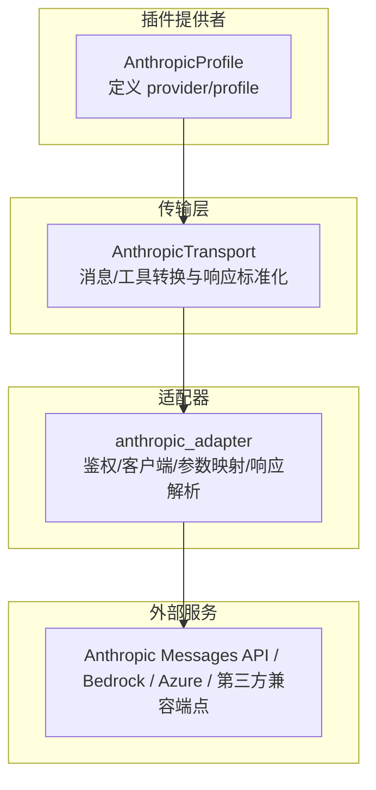
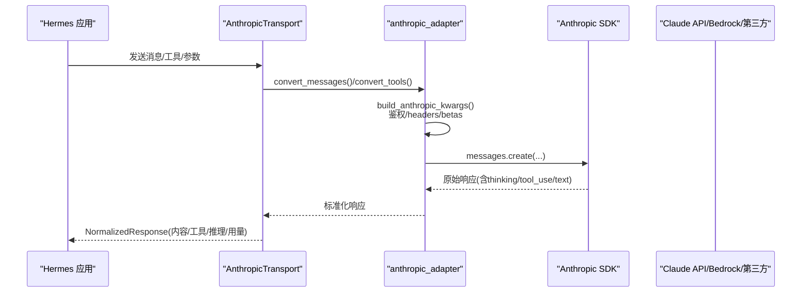
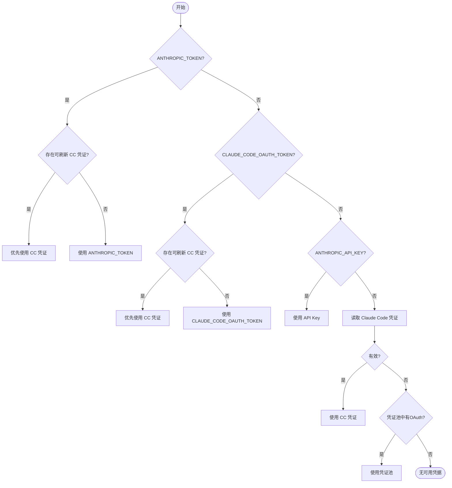
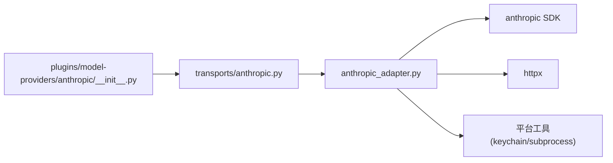

# Anthropic Claude 提供商

<cite>
**本文引用的文件**
- [agent/anthropic_adapter.py](file://agent/anthropic_adapter.py)
- [agent/transports/anthropic.py](file://agent/transports/anthropic.py)
- [plugins/model-providers/anthropic/__init__.py](file://plugins/model-providers/anthropic/__init__.py)
- [plugins/model-providers/anthropic/plugin.yaml](file://plugins/model-providers/anthropic/plugin.yaml)
- [agent/auxiliary_client.py](file://agent/auxiliary_client.py)
- [agent/chat_completion_helpers.py](file://agent/chat_completion_helpers.py)
- [agent/agent_init.py](file://agent/agent_init.py)
- [agent/agent_runtime_helpers.py](file://agent/agent_runtime_helpers.py)
- [agent/conversation_loop.py](file://agent/conversation_loop.py)
</cite>

## 目录
1. [简介](#简介)
2. [项目结构](#项目结构)
3. [核心组件](#核心组件)
4. [架构总览](#架构总览)
5. [详细组件分析](#详细组件分析)
6. [依赖关系分析](#依赖关系分析)
7. [性能与调优](#性能与调优)
8. [故障排查指南](#故障排查指南)
9. [结论](#结论)
10. [附录：配置示例与最佳实践](#附录配置示例与最佳实践)

## 简介
本文件面向在 Hermes Agent 中集成和使用 Anthropic Claude 模型的用户与开发者，系统性说明：
- 配置方法、API 密钥设置、认证流程与权限管理
- Claude 的功能特性（文本生成、代码理解、多模态输入、工具调用、思考模式等）
- 不同 Claude 模型版本的特点与选择建议
- 完整的配置示例、性能调优参数与错误处理策略
- 与 Hermes Agent 的深度集成方式与高级用法

## 项目结构
Hermes 对 Claude 的支持由“插件提供者 + 传输层 + 适配器”三层构成：
- 插件提供者：声明 provider profile、默认模型、环境变量与基础 URL
- 传输层：将 OpenAI 风格消息转换为 Anthropic Messages API 的格式，并标准化响应
- 适配器：负责鉴权、客户端构建、模型能力探测、请求参数映射与响应解析

图表来源
- [plugins/model-providers/anthropic/__init__.py:14-55](file://plugins/model-providers/anthropic/__init__.py#L14-L55)
- [agent/transports/anthropic.py:13-78](file://agent/transports/anthropic.py#L13-L78)
- [agent/anthropic_adapter.py:777-912](file://agent/anthropic_adapter.py#L777-L912)

章节来源
- [plugins/model-providers/anthropic/__init__.py:14-55](file://plugins/model-providers/anthropic/__init__.py#L14-L55)
- [agent/transports/anthropic.py:13-78](file://agent/transports/anthropic.py#L13-L78)
- [agent/anthropic_adapter.py:777-912](file://agent/anthropic_adapter.py#L777-L912)

## 核心组件
- 提供者 Profile：注册 anthropic provider，声明 api_mode、环境变量、默认辅助模型与基础 URL
- 传输层：封装 convert_messages、convert_tools、build_kwargs、normalize_response、validate_response、extract_cache_stats
- 适配器：构建客户端、识别 OAuth/API Key/Bearer、注入 beta headers、处理 thinking/adaptive thinking、fast mode、工具与多模态内容、缓存控制、重试与超时

章节来源
- [plugins/model-providers/anthropic/__init__.py:14-55](file://plugins/model-providers/anthropic/__init__.py#L14-L55)
- [agent/transports/anthropic.py:13-252](file://agent/transports/anthropic.py#L13-L252)
- [agent/anthropic_adapter.py:777-912](file://agent/anthropic_adapter.py#L777-L912)

## 架构总览
下图展示一次典型对话从 Hermes 到 Claude 的端到端流程，包括消息转换、工具调用、思考块与响应标准化。

图表来源
- [agent/transports/anthropic.py:24-78](file://agent/transports/anthropic.py#L24-L78)
- [agent/transports/anthropic.py:80-192](file://agent/transports/anthropic.py#L80-L192)
- [agent/anthropic_adapter.py:777-912](file://agent/anthropic_adapter.py#L777-L912)

## 详细组件分析

### 认证与密钥管理
- 支持的密钥类型
  - 常规 API Key：通过 x-api-key 头
  - OAuth/setup-token：Bearer 认证，附带 Claude Code 身份头
  - Claude Code 凭证：自动读取 macOS 钥匙串或 ~/.claude/.credentials.json，支持刷新
  - 第三方兼容端点：根据 base_url 自动切换 Bearer/x-api-key
- 密钥解析优先级
  - ANTHROPIC_TOKEN
  - CLAUDE_CODE_OAUTH_TOKEN
  - ANTHROPIC_API_KEY
  - Claude Code 凭证（可自动刷新）
  - 凭证池中的 OAuth 条目
- 安全细节
  - 使用 secret scope 读取环境变量
  - 写入凭据时采用原子写与严格权限
  - 对第三方端点进行 host 白名单匹配，避免误判

图表来源
- [agent/anthropic_adapter.py:1357-1412](file://agent/anthropic_adapter.py#L1357-L1412)
- [agent/anthropic_adapter.py:1040-1092](file://agent/anthropic_adapter.py#L1040-L1092)
- [agent/anthropic_adapter.py:1159-1210](file://agent/anthropic_adapter.py#L1159-L1210)
- [agent/anthropic_adapter.py:1212-1278](file://agent/anthropic_adapter.py#L1212-L1278)

章节来源
- [agent/anthropic_adapter.py:1357-1412](file://agent/anthropic_adapter.py#L1357-L1412)
- [agent/anthropic_adapter.py:1040-1092](file://agent/anthropic_adapter.py#L1040-L1092)
- [agent/anthropic_adapter.py:1159-1210](file://agent/anthropic_adapter.py#L1159-L1210)
- [agent/anthropic_adapter.py:1212-1278](file://agent/anthropic_adapter.py#L1212-L1278)

### 客户端构建与端点适配
- 自动识别端点类型
  - 原生 Anthropic：x-api-key
  - OAuth/setup-token：Bearer + Claude Code UA
  - 第三方兼容端点：按 base_url 判断是否使用 Bearer
  - Kimi/Moonshot 专用路径：强制特定 UA
  - Azure/AWS Bedrock：附加必要 beta 与查询参数
- Beta 功能开关
  - 通用 beta：interleaved-thinking、fine-grained-tool-streaming
  - 1M 上下文 beta：仅在需要时附加（如 Azure）
  - Fast Mode beta：仅受支持的模型启用
- 超时与重试
  - 连接超时固定为短值，读超时默认较长
  - 关闭 SDK 内部重试，交由 Hermes 外层统一处理以尊重 Retry-After

章节来源
- [agent/anthropic_adapter.py:665-774](file://agent/anthropic_adapter.py#L665-L774)
- [agent/anthropic_adapter.py:777-912](file://agent/anthropic_adapter.py#L777-L912)
- [agent/anthropic_adapter.py:915-951](file://agent/anthropic_adapter.py#L915-L951)

### 消息与工具转换
- 消息转换
  - 将 OpenAI 风格消息转为 Anthropic system/messages 元组
  - 支持 text、image、tool_result 等多模态内容
  - 保留 cache_control 标记用于提示缓存
- 工具转换
  - 将 OpenAI function schema 转为 Anthropic input_schema
  - 清理不支持的 union/nullable 关键字，确保校验通过
  - 去重工具名，避免重复导致 API 报错
- 响应标准化
  - 提取 text/thinking/tool_use
  - 映射 stop_reason 到 finish_reason
  - 收集 reasoning_details，必要时携带有序 content blocks 以维持签名顺序

章节来源
- [agent/transports/anthropic.py:24-78](file://agent/transports/anthropic.py#L24-L78)
- [agent/transports/anthropic.py:80-192](file://agent/transports/anthropic.py#L80-L192)
- [agent/anthropic_adapter.py:1755-1790](file://agent/anthropic_adapter.py#L1755-L1790)
- [agent/anthropic_adapter.py:1815-1846](file://agent/anthropic_adapter.py#L1815-L1846)

### 思考模式与采样参数
- 自适应思考（Adaptive Thinking）
  - 新版 Claude 使用 output_config.effort 控制思考强度
  - 未知模型默认走现代契约（自适应），旧版家族走手动预算
  - 部分模型不支持 xhigh 级别，需降级为 max
- 采样参数限制
  - 某些模型禁止非默认 temperature/top_p/top_k，需移除这些字段
- Fast Mode
  - 仅在受支持模型上启用，避免 400 错误

章节来源
- [agent/anthropic_adapter.py:70-87](file://agent/anthropic_adapter.py#L70-L87)
- [agent/anthropic_adapter.py:257-321](file://agent/anthropic_adapter.py#L257-L321)

### 多模态与文件处理
- 图片输入
  - 支持 data URL 与远程 URL，自动推断媒体类型
  - 转换为 Anthropic image source（base64/url）
- 工具结果
  - 支持 text/image 混合的工具结果，过滤为 API 接受的块类型
- 提示缓存
  - 支持在 tool 与 assistant 内容块上设置 cache_control，跨会话复用

章节来源
- [agent/anthropic_adapter.py:1793-1812](file://agent/anthropic_adapter.py#L1793-L1812)
- [agent/anthropic_adapter.py:1925-1948](file://agent/anthropic_adapter.py#L1925-L1948)
- [agent/anthropic_adapter.py:2036-2045](file://agent/anthropic_adapter.py#L2036-L2045)

### 与 Hermes 的深度集成
- 提供者注册
  - 通过 ProviderProfile 注册 anthropic，声明 env_vars、base_url、auth_type、默认辅助模型
- 运行时注入
  - agent_init 与 runtime helpers 会注入 anthropic_api_key/base_url 等运行时信息
  - conversation_loop 在需要时可访问 _anthropic_api_key 进行特殊处理
- 辅助客户端
  - auxiliary_client 在构造时可能包装/替换为 Anthropic 客户端，支持自定义 base_url

章节来源
- [plugins/model-providers/anthropic/__init__.py:14-55](file://plugins/model-providers/anthropic/__init__.py#L14-L55)
- [agent/agent_init.py:1043-1083](file://agent/agent_init.py#L1043-L1083)
- [agent/agent_runtime_helpers.py:1326-1329](file://agent/agent_runtime_helpers.py#L1326-L1329)
- [agent/agent_runtime_helpers.py:1582-1585](file://agent/agent_runtime_helpers.py#L1582-L1585)
- [agent/agent_runtime_helpers.py:2433-2573](file://agent/agent_runtime_helpers.py#L2433-L2573)
- [agent/conversation_loop.py:4242-4252](file://agent/conversation_loop.py#L4242-L4252)
- [agent/auxiliary_client.py:2062-2062](file://agent/auxiliary_client.py#L2062-L2062)
- [agent/auxiliary_client.py:2390-2390](file://agent/auxiliary_client.py#L2390-L2390)
- [agent/auxiliary_client.py:2430-2430](file://agent/auxiliary_client.py#L2430-L2430)
- [agent/auxiliary_client.py:3485-3485](file://agent/auxiliary_client.py#L3485-L3485)
- [agent/chat_completion_helpers.py:2152-2154](file://agent/chat_completion_helpers.py#L2152-L2154)

## 依赖关系分析
- 模块耦合
  - transports/anthropic.py 依赖 anthropic_adapter 完成具体实现
  - anthropic_adapter 依赖 SDK、httpx、平台工具（keychain、subprocess）
  - 插件提供者提供高层 profile 与默认值
- 外部依赖
  - anthropic SDK（可选安装，懒加载）
  - httpx（超时、代理）
  - 平台相关（macOS keychain、Azure Entra ID 等）

图表来源
- [agent/transports/anthropic.py:13-78](file://agent/transports/anthropic.py#L13-L78)
- [agent/anthropic_adapter.py:49-66](file://agent/anthropic_adapter.py#L49-L66)
- [plugins/model-providers/anthropic/__init__.py:14-55](file://plugins/model-providers/anthropic/__init__.py#L14-L55)

章节来源
- [agent/transports/anthropic.py:13-78](file://agent/transports/anthropic.py#L13-L78)
- [agent/anthropic_adapter.py:49-66](file://agent/anthropic_adapter.py#L49-L66)
- [plugins/model-providers/anthropic/__init__.py:14-55](file://plugins/model-providers/anthropic/__init__.py#L14-L55)

## 性能与调优
- 输出令牌上限
  - 按模型族设定最大输出 token，避免饥饿长输出；未知模型使用较高默认值
- 思考预算与自适应
  - 自适应思考 effort 映射：ultra/max→max，xhigh→xhigh（受模型支持），medium/low/minimal→对应级别
- Fast Mode
  - 仅在受支持模型启用，提升吞吐
- 提示缓存
  - 在 tool 与 assistant 内容块上设置 cache_control，减少重复计算
- 超时与重试
  - 连接超时短、读超时较长；关闭 SDK 内部重试，交由外层统一处理以避免重复消耗配额

章节来源
- [agent/anthropic_adapter.py:135-177](file://agent/anthropic_adapter.py#L135-L177)
- [agent/anthropic_adapter.py:70-87](file://agent/anthropic_adapter.py#L70-L87)
- [agent/anthropic_adapter.py:313-321](file://agent/anthropic_adapter.py#L313-L321)
- [agent/anthropic_adapter.py:835-843](file://agent/anthropic_adapter.py#L835-L843)

## 故障排查指南
- 常见错误与定位
  - 400 “Extra inputs are not permitted”：检查 replay 的 content block 是否包含输出-only 字段；使用 sanitize 清洗
  - 400 “text content blocks must contain non-whitespace text”：空/空白文本块会被替换为占位符
  - 400 “thinking ... blocks in the latest assistant message cannot be modified”：保持 ordered_blocks 顺序并重放
  - 400 “rate limited / invalid response”：refusal/end_turn 不应视为无效响应而重试
- 凭据问题
  - 无法刷新 OAuth：确认 refresh_token 存在且未过期；优先采用已刷新的 CC 凭证
  - 第三方端点鉴权失败：确认 base_url 正确且使用了正确的认证头（Bearer vs x-api-key）
- 网络与超时
  - 连接超时过短：调整 connect timeout；读超时默认较长，可按需调整
  - 重试风暴：关闭 SDK 内部重试，依赖外层统一重试

章节来源
- [agent/transports/anthropic.py:194-220](file://agent/transports/anthropic.py#L194-L220)
- [agent/anthropic_adapter.py:1951-1970](file://agent/anthropic_adapter.py#L1951-L1970)
- [agent/anthropic_adapter.py:1973-2033](file://agent/anthropic_adapter.py#L1973-L2033)
- [agent/anthropic_adapter.py:1159-1210](file://agent/anthropic_adapter.py#L1159-L1210)
- [agent/anthropic_adapter.py:835-843](file://agent/anthropic_adapter.py#L835-L843)

## 结论
Hermes 对 Anthropic Claude 的支持通过清晰的三层架构实现了高内聚、低耦合的集成：
- 插件提供者负责声明式配置
- 传输层专注格式转换与标准化
- 适配器处理鉴权、端点适配、功能开关与响应解析
该设计使 Claude 的多项能力（文本、代码、多模态、工具调用、思考模式、缓存、Fast Mode）得以稳定接入，并提供完善的错误处理与性能优化。

## 附录：配置示例与最佳实践
- 环境变量
  - 设置 ANTHROPIC_API_KEY 或 ANTHROPIC_TOKEN/CLAUDE_CODE_OAUTH_TOKEN
  - 如需第三方端点，设置 base_url 并确保鉴权头匹配
- 模型选择建议
  - 强推理/复杂任务：Opus 系列
  - 平衡性能与成本：Sonnet 系列
  - 轻量快速：Haiku 系列
  - 新模型遵循现代契约（自适应思考），无需额外配置
- 性能调优
  - 合理设置 max_tokens，避免截断
  - 启用提示缓存（cache_control）于稳定工具/系统提示
  - 在受支持模型上开启 Fast Mode
- 安全与合规
  - 使用 secret scope 读取敏感信息
  - 谨慎处理工具调用参数，避免泄露凭据
  - 对第三方端点进行 host 白名单校验

章节来源
- [plugins/model-providers/anthropic/__init__.py:14-55](file://plugins/model-providers/anthropic/__init__.py#L14-L55)
- [agent/anthropic_adapter.py:1357-1412](file://agent/anthropic_adapter.py#L1357-L1412)
- [agent/anthropic_adapter.py:135-177](file://agent/anthropic_adapter.py#L135-L177)
- [agent/anthropic_adapter.py:313-321](file://agent/anthropic_adapter.py#L313-L321)
- [agent/anthropic_adapter.py:2036-2045](file://agent/anthropic_adapter.py#L2036-L2045)