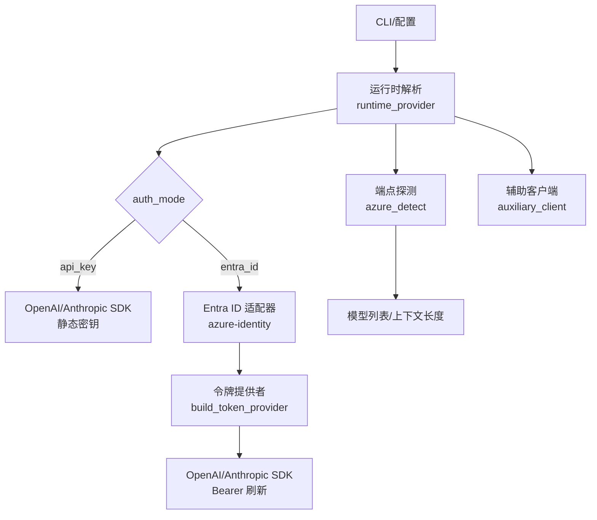
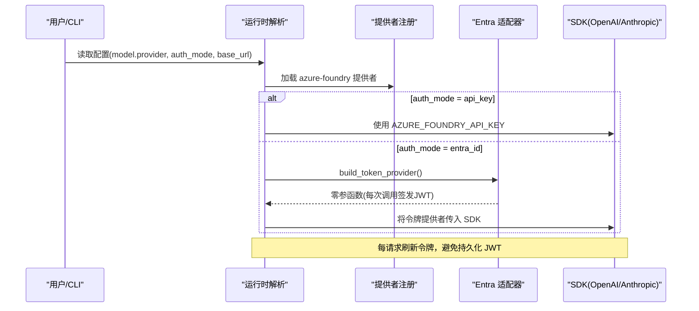
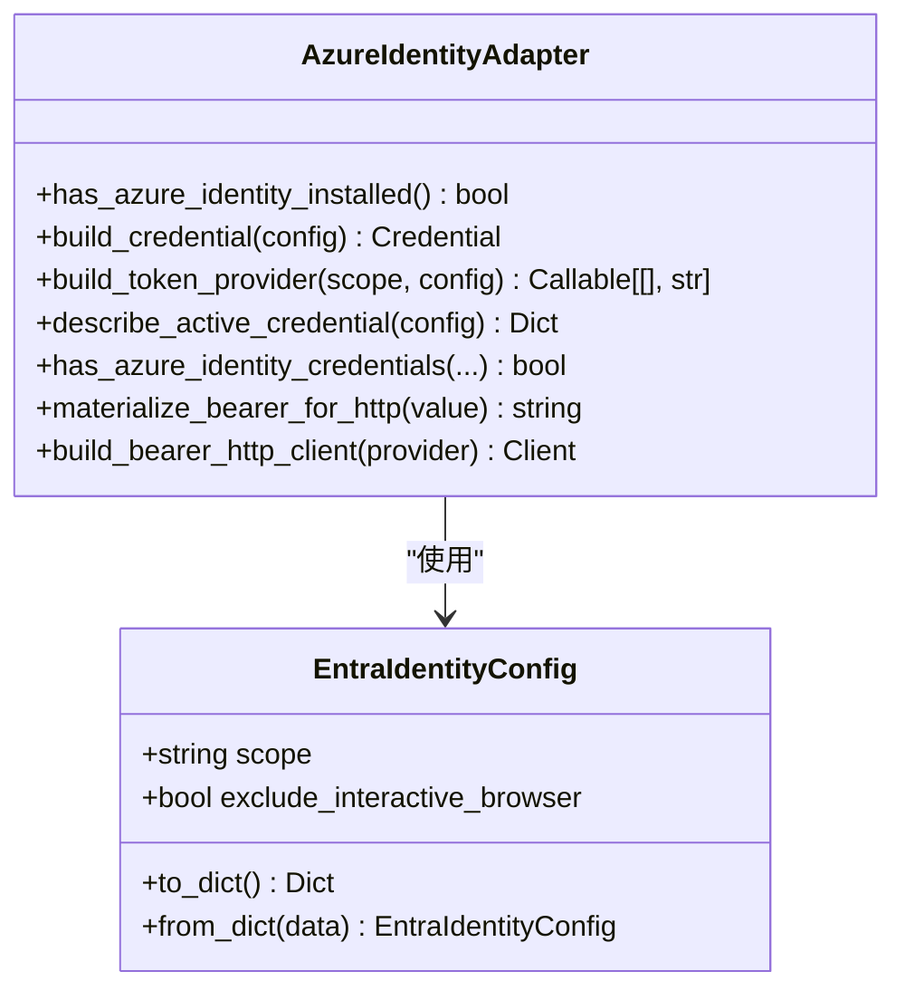
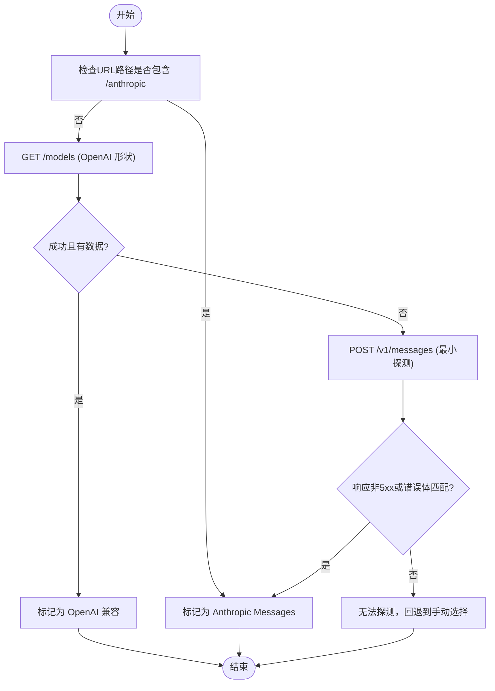
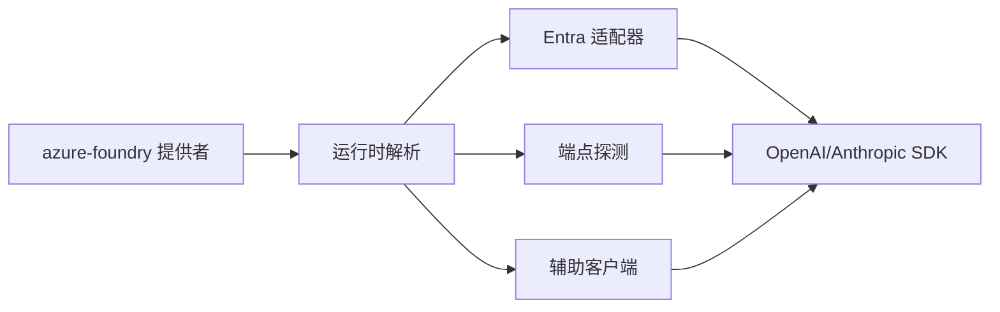

# Azure 系列提供商

<cite>
**本文引用的文件**
- [agent/azure_identity_adapter.py](file://agent/azure_identity_adapter.py)
- [hermes_cli/azure_detect.py](file://hermes_cli/azure_detect.py)
- [plugins/model-providers/azure-foundry/__init__.py](file://plugins/model-providers/azure-foundry/__init__.py)
- [hermes_cli/auth.py](file://hermes_cli/auth.py)
- [agent/auxiliary_client.py](file://agent/auxiliary_client.py)
- [agent/anthropic_adapter.py](file://agent/anthropic_adapter.py)
- [tests/agent/test_azure_identity_adapter.py](file://tests/agent/test_azure_identity_adapter.py)
- [tests/hermes_cli/test_azure_foundry_entra.py](file://tests/hermes_cli/test_azure_foundry_entra.py)
</cite>

## 目录
1. [简介](#简介)
2. [项目结构](#项目结构)
3. [核心组件](#核心组件)
4. [架构总览](#架构总览)
5. [详细组件分析](#详细组件分析)
6. [依赖关系分析](#依赖关系分析)
7. [性能与可扩展性](#性能与可扩展性)
8. [监控、日志与合规](#监控日志与合规)
9. [故障诊断指南](#故障诊断指南)
10. [结论](#结论)
11. [附录：配置示例清单](#附录配置示例清单)

## 简介
本文件面向企业用户，系统性说明如何在 Hermes Agent 中配置和使用 Azure Foundry 模型服务。重点覆盖：
- 身份认证：API Key 与 Microsoft Entra ID（无密钥）两种模式
- 资源管理：基础 URL、模型选择、上下文长度探测
- 安全策略：最小权限、令牌刷新、敏感信息脱敏
- 合规要求：范围（scope）、租户、主权云等
- 生态集成：Key Vault、Monitor、Log Analytics 的落地建议
- 监控告警与故障诊断：端到端排查路径
- 最佳实践：生产环境部署建议

## 项目结构
Azure 相关能力由以下模块协作完成：
- 插件注册：声明 Azure Foundry 提供者及其环境变量
- 运行时解析：根据配置决定使用 API Key 还是 Entra ID
- 身份适配：封装 azure-identity，提供令牌提供者与 HTTP 注入
- 端点探测：自动识别 OpenAI 兼容或 Anthropic 消息式端点
- 辅助客户端：在辅助任务中统一走 Azure Foundry 通道

图表来源
- [plugins/model-providers/azure-foundry/__init__.py:1-22](file://plugins/model-providers/azure-foundry/__init__.py#L1-L22)
- [hermes_cli/auth.py:499-505](file://hermes_cli/auth.py#L499-L505)
- [agent/azure_identity_adapter.py:1-30](file://agent/azure_identity_adapter.py#L1-L30)
- [hermes_cli/azure_detect.py:1-36](file://hermes_cli/azure_detect.py#L1-L36)
- [agent/auxiliary_client.py:3371-3450](file://agent/auxiliary_client.py#L3371-L3450)

章节来源
- [plugins/model-providers/azure-foundry/__init__.py:1-22](file://plugins/model-providers/azure-foundry/__init__.py#L1-L22)
- [hermes_cli/auth.py:499-505](file://hermes_cli/auth.py#L499-L505)

## 核心组件
- Azure Foundry 提供者注册：声明名称、别名、显示名、环境变量、基础 URL 占位与认证类型
- Entra ID 适配器：基于 azure-identity 的默认凭据链，提供令牌提供者、HTTP 请求头注入、诊断探针
- 端点探测：自动判断 OpenAI 兼容或 Anthropic 消息式端点，并尝试获取模型列表与上下文长度
- CLI 认证状态：结构化检查当前是否已登录（不实际签发令牌）
- 辅助客户端：在辅助任务中统一走 Azure Foundry 通道，支持 Entra ID 与 API Key

章节来源
- [plugins/model-providers/azure-foundry/__init__.py:1-22](file://plugins/model-providers/azure-foundry/__init__.py#L1-L22)
- [agent/azure_identity_adapter.py:1-572](file://agent/azure_identity_adapter.py#L1-L572)
- [hermes_cli/azure_detect.py:1-409](file://hermes_cli/azure_detect.py#L1-L409)
- [hermes_cli/auth.py:499-505](file://hermes_cli/auth.py#L499-L505)
- [agent/auxiliary_client.py:3371-3450](file://agent/auxiliary_client.py#L3371-L3450)

## 架构总览
Hermes 对 Azure Foundry 的支持遵循“可插拔提供者 + 运行时解析 + 身份适配”的分层设计：
- 提供者层：声明 provider、环境变量、基础 URL
- 运行时层：根据 model.auth_mode 选择 API Key 或 Entra ID；处理 base_url 规范化（如去除 /v1）
- 身份层：通过 azure-identity 的 DefaultAzureCredential 链式解析凭据，生成每请求刷新令牌
- 协议层：OpenAI chat_completions 或 Anthropic messages（含 Azure 托管路径）
- 探测层：自动探测端点能力，返回可用模型与上下文长度提示

图表来源
- [hermes_cli/auth.py:499-505](file://hermes_cli/auth.py#L499-L505)
- [agent/azure_identity_adapter.py:215-253](file://agent/azure_identity_adapter.py#L215-L253)
- [plugins/model-providers/azure-foundry/__init__.py:10-19](file://plugins/model-providers/azure-foundry/__init__.py#L10-L19)

## 详细组件分析

### Entra ID 身份适配器
职责
- 懒加载 azure-identity，仅在启用 Entra ID 时引入
- 构建 DefaultAzureCredential，支持环境变量、工作负载标识、托管标识、VS Code、Azure CLI 等链式解析
- 提供令牌提供者（零参函数），供 OpenAI/Anthropic SDK 每请求调用以刷新令牌
- 为 Anthropic SDK 提供 httpx 事件钩子，确保 Authorization 头按请求刷新
- 提供诊断探针：检测凭据可用性、描述活动凭据链、超时保护

关键要点
- scope 默认使用微软文档的 Foundry 推理范围；可通过 model.entra.scope 覆盖
- 不持久化 JWT；缓存位于进程内或系统凭据存储
- 失败路径清晰：缺失包时给出安装指引；网络慢时超时返回

图表来源
- [agent/azure_identity_adapter.py:122-171](file://agent/azure_identity_adapter.py#L122-L171)
- [agent/azure_identity_adapter.py:174-253](file://agent/azure_identity_adapter.py#L174-L253)
- [agent/azure_identity_adapter.py:261-431](file://agent/azure_identity_adapter.py#L261-L431)
- [agent/azure_identity_adapter.py:449-556](file://agent/azure_identity_adapter.py#L449-L556)

章节来源
- [agent/azure_identity_adapter.py:1-572](file://agent/azure_identity_adapter.py#L1-L572)
- [tests/agent/test_azure_identity_adapter.py:1-497](file://tests/agent/test_azure_identity_adapter.py#L1-L497)

### 端点探测与模型发现
职责
- 自动识别 OpenAI 兼容（chat_completions）或 Anthropic 消息式（anthropic_messages）端点
- 尝试 GET /models 获取模型列表（OpenAI 形状）
- 对 Anthropic 路径发送最小探测请求，判断端点是否接受消息格式
- 查询模型上下文长度，辅助向导设置

流程

图表来源
- [hermes_cli/azure_detect.py:184-361](file://hermes_cli/azure_detect.py#L184-L361)

章节来源
- [hermes_cli/azure_detect.py:1-409](file://hermes_cli/azure_detect.py#L1-L409)

### 运行时解析与辅助客户端
运行时解析
- 当 provider=azure-foundry 且 auth_mode=entra_id 时，返回可调用的 api_key（令牌提供者）
- 当 auth_mode=api_key 或未指定时，沿用 AZURE_FOUNDRY_API_KEY 静态密钥
- 对 Anthropic 消息式端点，自动去除末尾 /v1，保证 base_url 正确

辅助客户端
- 在辅助任务中优先尝试 azure-foundry 通道
- 若未解析到模型，记录调试日志并回退

章节来源
- [tests/hermes_cli/test_azure_foundry_entra.py:72-145](file://tests/hermes_cli/test_azure_foundry_entra.py#L72-L145)
- [agent/auxiliary_client.py:3371-3450](file://agent/auxiliary_client.py#L3371-L3450)

### Anthropic 消息式端点的特殊处理
- 对于 Azure 托管的 Anthropic 消息端点，需使用 per-request 刷新令牌的 httpx 客户端注入 Authorization 头
- 适配器会清理冲突的头（如 api-key、x-api-key），避免同时携带多种认证导致歧义

章节来源
- [agent/anthropic_adapter.py:598-660](file://agent/anthropic_adapter.py#L598-L660)
- [agent/azure_identity_adapter.py:478-556](file://agent/azure_identity_adapter.py#L478-L556)

## 依赖关系分析
- 提供者注册依赖 providers.base.ProviderProfile
- Entra ID 适配器依赖 azure-identity（可选，懒加载）
- 端点探测依赖 urllib 与 hermes_cli.urllib_security
- 辅助客户端依赖 hermes_cli.runtime_provider 与 agent.azure_identity_adapter

图表来源
- [plugins/model-providers/azure-foundry/__init__.py:7-21](file://plugins/model-providers/azure-foundry/__init__.py#L7-L21)
- [agent/azure_identity_adapter.py:1-30](file://agent/azure_identity_adapter.py#L1-L30)
- [hermes_cli/azure_detect.py:38-50](file://hermes_cli/azure_detect.py#L38-L50)
- [agent/auxiliary_client.py:3371-3450](file://agent/auxiliary_client.py#L3371-L3450)

章节来源
- [plugins/model-providers/azure-foundry/__init__.py:1-22](file://plugins/model-providers/azure-foundry/__init__.py#L1-L22)
- [agent/azure_identity_adapter.py:1-572](file://agent/azure_identity_adapter.py#L1-L572)
- [hermes_cli/azure_detect.py:1-409](file://hermes_cli/azure_detect.py#L1-L409)
- [agent/auxiliary_client.py:3371-3450](file://agent/auxiliary_client.py#L3371-L3450)

## 性能与可扩展性
- 懒加载：azure-identity 仅在启用 Entra ID 时导入，降低启动开销
- 令牌缓存：DefaultAzureCredential 内部缓存令牌；适配器不重复持久化 JWT
- 每请求刷新：SDK 每请求调用令牌提供者，避免长生命周期令牌泄露
- 超时保护：凭据探测使用线程+超时，防止网络或服务不可用导致阻塞
- 可扩展：新增 Azure 托管端点只需扩展探测逻辑与 base_url 规范

[本节为通用指导，无需特定文件引用]

## 监控、日志与合规
- 监控与日志
  - 建议在 Azure Monitor 中采集应用指标与请求延迟
  - 使用 Log Analytics 聚合日志，建立告警规则（如 401/429/5xx 比例异常）
  - 结合 Application Insights 追踪端到端调用链路
- 密钥管理
  - 推荐将 AZURE_FOUNDRY_API_KEY 存入 Azure Key Vault，并通过受管标识或工作负载标识访问
  - 使用 Entra ID 模式避免静态密钥落地，减少泄露面
- 合规与安全策略
  - 使用最小权限原则配置托管标识/服务主体
  - 针对主权云或自定义租户，通过 model.entra.scope 精确限定授权范围
  - 审计与合规：开启 Azure 资源访问日志，定期审查凭据与角色分配

[本节为通用指导，无需特定文件引用]

## 故障诊断指南
常见问题与定位步骤
- 无法获取令牌
  - 运行诊断：describe_active_credential，查看 env_sources、expires_on、error/hint
  - 检查 AZURE_* 环境变量与工作负载标识配置
  - 确认网络可达性与 IMDS/STS 服务状态
- 401/403 错误
  - 确认 scope 是否正确（默认 https://ai.azure.com/.default）
  - 检查托管标识/服务主体是否有推理端点访问权限
  - 对 Anthropic 端点，确认 Authorization 头未被其他头覆盖
- 端点探测失败
  - 检查 base_url 是否为有效资源地址
  - 确认防火墙/代理允许访问 /models 与 /v1/messages
  - 必要时回退到手动选择 API 模式
- 性能问题
  - 观察令牌刷新频率与耗时（azure-identity 内部缓存应减少开销）
  - 调整超时参数与重试策略

章节来源
- [agent/azure_identity_adapter.py:261-431](file://agent/azure_identity_adapter.py#L261-L431)
- [hermes_cli/azure_detect.py:299-361](file://hermes_cli/azure_detect.py#L299-L361)
- [tests/agent/test_azure_identity_adapter.py:387-497](file://tests/agent/test_azure_identity_adapter.py#L387-L497)

## 结论
Hermes 对 Azure Foundry 的支持提供了企业级所需的灵活认证、自动探测与健壮的错误处理。通过 Entra ID 模式与 Key Vault 集成，可在保障安全的前提下实现高可用的模型服务接入。配合 Azure Monitor 与 Log Analytics，可实现完善的可观测性与合规审计。

[本节为总结，无需特定文件引用]

## 附录：配置示例清单
以下为常见配置项与用途说明（以字段名与取值为主，不含代码片段）：
- 提供者与基础 URL
  - provider: azure-foundry
  - base_url: 资源专属端点（例如 openai 兼容或 anthropic 消息式）
- 认证模式
  - auth_mode: api_key 或 entra_id
  - api_key: AZURE_FOUNDRY_API_KEY（静态密钥）
  - token_provider: 由 build_token_provider 生成的零参函数（Entra ID）
- Entra ID 配置
  - model.entra.scope: 默认 https://ai.azure.com/.default，可按需覆盖
  - AZURE_TENANT_ID、AZURE_CLIENT_ID、AZURE_CLIENT_SECRET、IDENTITY_ENDPOINT 等标准环境变量
- 端点探测
  - 自动识别 chat_completions 或 anthropic_messages
  - 尝试获取 /models 列表与模型上下文长度
- 辅助客户端
  - 在辅助任务中优先走 azure-foundry 通道
  - 未解析到模型时记录调试日志

章节来源
- [plugins/model-providers/azure-foundry/__init__.py:10-19](file://plugins/model-providers/azure-foundry/__init__.py#L10-L19)
- [hermes_cli/auth.py:499-505](file://hermes_cli/auth.py#L499-L505)
- [agent/azure_identity_adapter.py:122-171](file://agent/azure_identity_adapter.py#L122-L171)
- [hermes_cli/azure_detect.py:67-91](file://hermes_cli/azure_detect.py#L67-L91)
- [agent/auxiliary_client.py:3371-3450](file://agent/auxiliary_client.py#L3371-L3450)